# 東京博善「窓口（mado）」システム手順書

| 項目 | 内容 |
|---|---|
| 文書名 | 東京博善 窓口システム（mado）手順書 |
| 対象システム | 管理画面（admin.html）／LINEミニアプリ（index.html・LIFF）／CRM（crm.html） |
| 対象読者 | 斎場スタッフ・本社運用担当・PMO・新規参画メンバー |
| 検証環境（STG） | `https://mado-staging.web.app/admin.html` |
| 本番環境 | `https://madoguchi-ec1d5.web.app/admin.html`（Firebase プロジェクト `madoguchi-ec1d5`） |
| 作成日 | 2026-08-04 |
| 作成方法 | STG 画面キャプチャ・公式操作マニュアル（Phase 1）・現場マニュアル・システム仕様書 v2.0・admin-manual／sitemap ドキュメント・プロジェクト議事録を突き合わせて作成 |

> **ログイン情報・APIキーは本書に記載しません。** ステージング／本番のアカウントは管理者から個別（DM）に共有されます。認証情報を共有チャットや文書に貼らない運用ルールです。

---

## 目次

1. [システム概要 — このシステムは何のためにあるか](#1-システム概要)
2. [全体アーキテクチャと外部連携](#2-全体アーキテクチャと外部連携)
3. [業務の全体像（1日の流れ）](#3-業務の全体像1日の流れ)
4. [管理画面（admin.html）画面別の意味と操作手順](#4-管理画面adminhtml)
5. [LINEミニアプリ 画面別の意味と操作手順](#5-lineミニアプリお客様向け)
6. [シナリオ別 操作フロー](#6-シナリオ別-操作フロー)
7. [権限（ロール）一覧](#7-権限ロール一覧)
8. [トラブルシューティング Q&A](#8-トラブルシューティング-qa)
9. [用語集](#9-用語集)
10. [既知の注意点・制約](#10-既知の注意点制約)
11. [参考資料（出典）](#11-参考資料出典)

---

## 1. システム概要

### 1.1 何のためのシステムか

「東京博善の窓口（mado）」は、東京博善株式会社の各斎場（町屋・落合・代々幡・四ツ木・桐ヶ谷・堀ノ内・お花茶屋会館の7斎場）における**葬儀当日の受付・火葬同意・モバイルオーダー・会計精算**をデジタル化するシステムです。

**解決したい課題:**

- 紙による火葬同意の取得・受付の手間
- 待合室・休憩室での飲食注文時にスタッフを呼び出す手間、提供ミス
- 葬儀後のアフターケア（相続・法要・供養等）に向けた顧客接点の不在

**最終目的:** 葬儀当日の利便性向上（ペーパーレス・受付混雑緩和・モバイルオーダー）を入り口に LINE 会員化を促進し、アフターケア CRM の会員基盤を構築すること。

### 1.2 サブシステム構成

| サブシステム | URL | 利用者 | 概要 |
|---|---|---|---|
| **管理画面（受注管理）** | `/admin.html` | 斎場スタッフ・本社（約60名想定） | 注文カンバン・代理注文・火葬確認（受付）・お会計精算・事前同意管理・各種マスタ |
| **LINEミニアプリ** | `/index.html`（LIFF） | 喪主・お連れ様・参列者 | チェックイン・モバイルオーダー・事前/当日の火葬同意・会員登録。平均年齢60歳以上を想定したシニア向けUX（大きな文字・タップ領域・白/紫の東京博善ブランドカラー） |
| **CRM** | `/crm.html` | コールセンター（PMO/CC） | アフターケア架電管理・LINEチャット・チケット・資料請求・Twilio電話 |
| **外部API（v1）** | `/api/v1/*` | 外部システム | 中間サーバー・BM社等との連携用 REST API |

### 1.3 プロジェクト体制（参考）

| 役割 | 会社 |
|---|---|
| 発注元・事業主体 | 東京博善株式会社（＋広済堂 情報システム部＝SAP管理者） |
| 全体進行・一次請け・インフラ(Firebase)・UI調整 | 株式会社ナーブ（NURVE） |
| PM・要件整理・開発推進 | 株式会社ARCRA |
| バックエンド・API開発 | 株式会社rubyjobs ほか |
| 外部連携パートナー | テコテック（予約システム連携）／Bluememe（会員基盤API） |

---

## 2. 全体アーキテクチャと外部連携

### 2.1 技術スタック

| レイヤー | 技術 |
|---|---|
| フロントエンド | HTML/CSS/JS（SPA・フレームワークなし） |
| バックエンド | Firebase Cloud Functions v2（Node.js）＋ Express（`functions/index.js` 単一大規模ファイル） |
| データベース | Cloud Firestore（reservations / checkins / orders / menu / members / halls / salesPoints / settings ほか） |
| 認証 | 独自セッション（管理）＋ LINE認証（LIFF）＋ APIキー（外部）— **認証3系統** |
| LINE連携 | LINE Messaging API ＋ LIFF SDK v2（ミニアプリ LIFF ID: 2009732994 / OA: 2009733008） |
| 電話（CRM） | Twilio WebRTC／録音／OpenAI Whisper 文字起こし |
| ホスティング | Firebase Hosting（STG: `mado-staging` ／ 本番: `madoguchi-ec1d5`） |

### 2.2 外部システムとの関係

```
新予約・葬祭管理（TECOTEC）──毎朝CSV/API──▶ ┌──────────────┐
                                              │  窓口 mado    │
LINE Platform（LIFF/Messaging API）◀────────▶│  Firebase     │
                                              │  admin/index/ │
SAP S/4HANA ◀── SAP中間API（Node.js）◀──────│  crm          │
                                              └──────┬───────┘
自動精算機（東芝テック/ユニコ）◀─精算QR・受注番号─┘
```

- **予約データ**: 既存予約システム（Fellow／タイコウ→新予約システムTECOTEC）から毎朝取り込み。中間サーバー→窓口の同期。
- **SAP連携**: mado は SAP と直接通信せず、**SAP中間API** を介して商品カタログ同期・受注登録（sapCartAdd／sapCartComplete）・割引・自動仕訳を処理。
- **精算機連携**: 「お会計精算」で発行する**精算QR**（SAP受注番号ベース）を自動精算機で読み取り精算。
- **デプロイ運用**: `staging` ブランチ → STG 自動デプロイ／`main` → 本番（承認ゲート付き手動）。障害時は直前コミットへ revert → 再デプロイ、または Hosting の版切り戻し。

### 2.3 環境

| 環境 | URL | 用途 |
|---|---|---|
| ステージング（STG） | `https://mado-staging.web.app/` | 検証用。テストデータ（斎場7・予約・事前同意・商品等）投入済み。**実顧客データは使用しない**。テストデータはリセットされることがあるため証跡は都度保存 |
| 本番 | `https://madoguchi-ec1d5.web.app/` | 実運用。イベントログは本番DBのリアルタイム表示 |

**LINEミニアプリのプレビュー（STG）**: LINE ログイン・QR 不要でブラウザから各画面を確認できます。

```
https://mado-staging.web.app/?preview=<画面名>
  friend / top / top-day / register / pre-info / pre-complete /
  checkin-pending / checkin-done / profile
```

画面上部ヘッダーに「👁 プレビュー」と表示されていればプレビューモードで正しく開けています（会員状態・予約データに依存せず表示。実機確認にはテスト用QRの発行が必要）。

---

## 3. 業務の全体像（1日の流れ）

```
① 事前準備 … 本日の火葬予約・火葬同意の状況を「火葬確認」で確認
 ↓
② 来場受付 … 「火葬確認」で対象予約の受付を完了し、必要に応じてQRカードをお渡し
 ↓
③ 代理注文 … お客様ご自身で注文できない場合は「代理注文」からスタッフが注文
 ↓
④ 提供中   … 「オーダー」で注文状況（未処理→調理中→提供済み）を管理
 ↓
⑤ お会計   … 「お会計精算」で会計待ち → 支払い準備完了（SAP登録）→ 精算QR → 会計完了
```

> **「受付」と「注文」は別の操作です。** 受付＝「火葬確認」タブで来場を受け付ける操作。注文＝「代理注文」タブでスタッフが商品を注文する操作。

**現場スタッフが主に使うタブ**

| タブ | いつ使うか |
|---|---|
| 📋 **火葬確認** | 朝いちばん。本日の予約・火葬同意の確認、来場受付 |
| 📝 **代理注文** | お客様に代わって商品を注文するとき |
| 🍽️ **オーダー** | 注文の調理・提供状況を確認するとき |
| 💳 **お会計精算** | 会計処理を行うとき |

---

## 4. 管理画面（admin.html）

### 4.0 ログイン

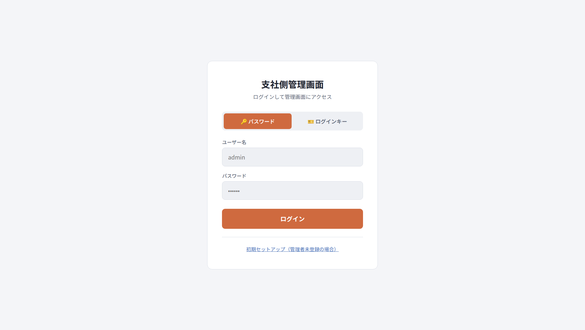

**この画面の意味:** スタッフ認証の入り口。パスワード認証と「ログインキー」認証（`XXXX-XXXX-XXXX` 形式の印刷カード）の2方式があります。管理者未登録の場合のみ初期セットアップフローが表示されます。

| # | 操作 | 確認ポイント |
|---|---|---|
| 1 | ブラウザで管理画面 URL にアクセス | ログイン画面が表示される |
| 2 | 「🔑 パスワード」タブを選択（既定） | — |
| 3 | ユーザー名・パスワードを入力 | パスワードはマスク表示 |
| 4 | 「ログイン」を押下 | オーダー（カンバン）画面へ遷移 |

> ログインカード所持者は「🎫 ログインキー」タブに切り替えてキーを入力してもログインできます。アカウントは管理者が「ユーザー」画面から発行します。

### 4.1 共通ヘッダー（全タブ共通）

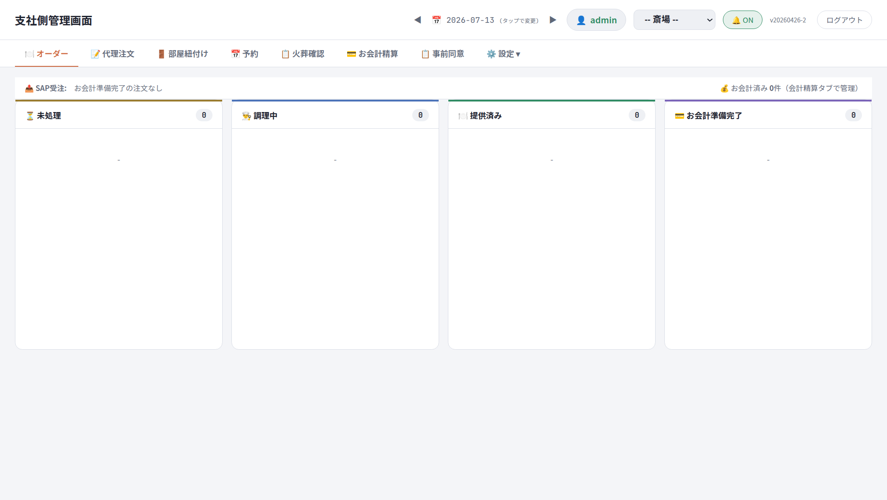

| 表示 | 意味 |
|---|---|
| **支社側管理画面** | 画面タイトル（システム名） |
| **◀ 日付 ▶** | 表示対象日。◀＝前日／▶＝翌日。「(タップで変更)」で任意日付を選択。**一覧に何も出ないときはまずここを確認** |
| **👤 admin** | ログイン中のアカウント名 |
| **-- 斎場 --** | 操作対象の斎場切替（複数斎場権限がある場合のみ表示） |
| **🔔 ON** | 通知音の ON/OFF |
| **v20260426-2 等** | 稼働中のビルドバージョン（STGでは build SHA も表示。障害切り分け時に確認） |
| **ログアウト** | ログアウト |

**ナビゲーションタブ:** 日常運用タブがメインバーに横並び、マスタ系は「⚙️ 設定 ▼」ドロップダウンに集約されています。

```
🍽️ オーダー ／ 📝 代理注文 ／ 🚪 部屋紐付け ／ 📅 予約 ／ 📋 火葬確認 ／ 💳 お会計精算 ／ 📋 事前同意 ／ ⚙️ 設定 ▼
```

> 非 superadmin（斎場スタッフ）には「📅 予約」と「⚙️ 設定」は表示されません。

### 4.2 🍽️ オーダー（注文カンバン）

**この画面の意味:** モバイルオーダー業務の中心画面。お客様のスマホ注文・スタッフの代理注文が**商品単位のカード**としてリアルタイムに流れ込み、調理・提供・会計準備の進行を管理します。新規注文が入ると通知音が鳴ります。

**カンバン列（左から右へ進める）**

| 列 | 状態の意味 |
|---|---|
| ⏳ 未処理 | 注文直後。スタッフが認知する前 |
| 👨‍🍳 調理中 | 調理が必要な商品で「調理開始」を押した状態 |
| 🍽️ 提供済み | 商品をお客様に提供した状態（PDA売上計上前） |
| 💳 お会計準備完了 | PDA 売上計上済み・会計待ち |
| 💰 お会計済み | 会計完了（画面右上の件数表示。管理は「お会計精算」タブ） |

**画面上部の SAP 受注帯:** SAP への受注登録状況（登録済／カート／送信中／失敗／対象外）を常時表示。「失敗」がある場合は「↻ 失敗分を一括再送」で再送できます。

**注文カードの見方:** 注文番号（#1, #2…）／故人名（予約紐付け済みの場合）／注文時刻／注文区分（代理注文等）／斎場・売上場所／SAP連携ステータス／商品明細と数量／合計金額（税込）／操作ボタン。

**基本操作フロー（注文〜会計）**

| # | 操作 | 確認ポイント |
|---|---|---|
| 1 | 注文が入る → 「未処理」にカード出現・通知音 | 未処理列の件数増 |
| 2 | 調理が必要 → 「調理開始」／即時提供品（瓶ビール・缶飲料・売店品）→ 直接「提供済み」 | カードが列移動 |
| 3 | 調理完了後「提供済み」を押下 | LINE「提供完了」通知が送信される |
| 4 | 商品を提供 → PDA で売上計上 → 「お会計準備完了」 | SAP登録済タグが付くケースあり |
| 5 | その場支払いの場合、支払受領 → 「お会計済み」 | LINE「会計完了」通知 |

> **LINE通知は3種類のみ**: ①注文受付 ②提供完了 ③会計完了。「調理中」通知はありません。
>
> **喪主まとめ払いの場合は「お会計済み」を押さない**: ステータスは「お会計準備完了」のまま保持し、注文詳細モーダルで支払先を「喪主」に紐付け、最終精算は「お会計精算」タブで行います。

**一部キャンセル（個別商品の削除）:** カードの「✏ 編集」または「📋 注文詳細」→「注文を編集」モーダル → 対象商品行の「✕」→ 合計再計算を確認 → 「保存」。注文自体は残るため SAP 連携・受付ステータスに影響しません。

**注文詳細モーダル（支払先振り分け）**

| ボタン | 意味・用途 |
|---|---|
| 喪主 | 喪主まとめ払い。喪主アカウントへ紐付け、最終精算は別途 |
| 現金 | その場での現金支払い |
| 売掛 | 葬儀社等への請求案件で後日精算 |
| ワンタイム | 単発の精算（イレギュラー） |

モーダルではほかに SAP 送信済ロック／SAP診断（成功・失敗・対象外の詳細）／カート明細（Condition Types）／税抜小計・税額・税込額／支払者別請求明細（payers）／合計（grandTotals）を確認できます。

### 4.3 📝 代理注文

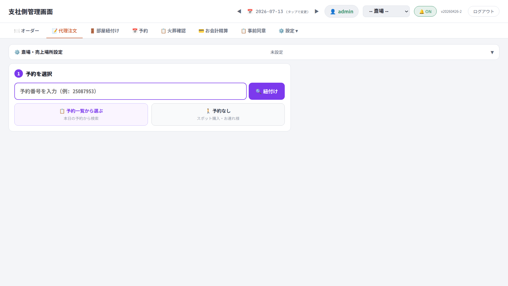

**この画面の意味:** スマホをお持ちでない方や口頭注文に対応するため、**スタッフがお客様の代わりに注文を入力する**画面。「斎場・売上場所 → 予約選択 → 商品選択 → 支払者確認 → 確定」と進みます。

**起点「予約を選択」の3方式**

| 選択肢 | 用途 |
|---|---|
| 予約番号を入力 → 「🔍 紐付け」 | 予約番号がわかる場合 |
| 📋 予約一覧から選ぶ | 本日の予約から検索して選択 |
| 🚶 予約なし | スポット購入・お連れ様（参列者）等。**支払い先となる得意先を選択**して進める |

**手順**

| # | 操作 | 確認ポイント |
|---|---|---|
| 1 | 上部の「斎場・売上場所設定」で売上場所を選択 | 斎場・売上場所が正しい |
| 2 | 予約を選択（上記3方式のいずれか） | 対象予約が表示される |
| 3 | 「紐付け」を押下 | 紐付け先確定 |
| 4 | メニューから商品・数量を選択 | カート内容と金額 |
| 5 | 支払者（購入者区分）と金額を確認し注文確定 | 「オーダー」カンバンに新規カード出現 |

> **購入者区分（MVGR4）による商品制限**: お連れ様＝区分`1`のみ／喪家＝`1`・`2`／職員代理＝`1`・`2`・`3`。区分未設定（空欄）の商品・価格未設定（0円）の商品は表示・注文の対象外とする仕様です（サーバー側でも再検証）。
> **価格未設定・0円商品は注文不可**。`price=1` は「手動価格入力」のマーカーで、2円以上の金額を入力した場合のみ注文できます。

### 4.4 🚪 部屋紐付け

**この画面の意味:** 予約と部屋（式場・控室等）の割当を管理する画面。部屋エディタ・売上場所設定を含み、LINEミニアプリ側の「部屋未割当（scrNoAssign）」制御の元データになります。FD予約で部屋割当が済んでいないと、お客様側アプリは注文に進めず待機画面になります。

### 4.5 📅 予約

**この画面の意味:** 予約マスタの検索・編集・QR発行・LINE通知を行う画面（主に管理者向け）。期間・斎場を指定し、**故人名・葬儀社・予約番号・申込者名・電話番号**で検索できます。CSV出力・新規予約作成・確定済/未確定の切替も可能です。

**各行の操作**

| ボタン | 内容 |
|---|---|
| 📌 確定 | 予約を確定する |
| ✏️ | 予約内容を編集する |
| 📱 | 予約QRの表示・カード印刷 |
| 📨 | **紐付け・編集後の最新予約内容を顧客の LINE へ通知**（確認ダイアログあり。LINE未連携の予約には送信されない） |
| 🗑 | 予約を削除する |

### 4.6 📋 火葬確認（旧「受付」）

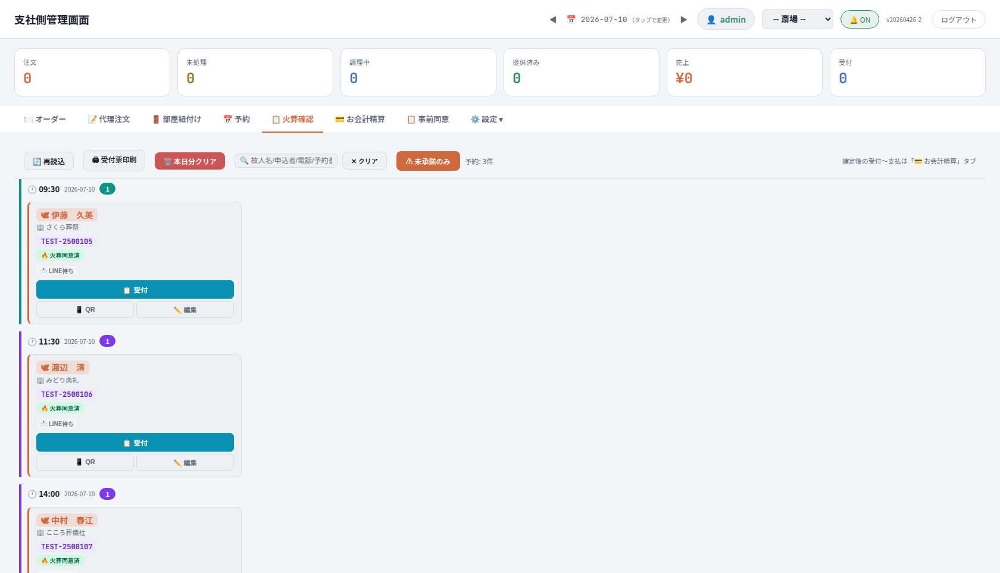

**この画面の意味:** 炉前・受付でいちばん使う画面。**本日の火葬予約ごとの「火葬同意」状況の確認**と**来場受付**を行います。予約は火葬時間ごとにまとまって表示されます。

**予約カードの見方**

| 表示 | 意味 |
|---|---|
| 👤 氏名 | 故人名 |
| 🏢 葬儀社名 | 依頼元の葬儀社 |
| TEST-2500200 等 | 予約番号 |
| 🔥 **火葬同意済** ／ ⚠ **未同意** | 火葬同意の状況（事前同意紐付け済み or 炉前取得済みで「同意済」） |
| LINE待ち 等 | LINE連携の状況 |
| **受付** | 来場受付ボタン |
| 📱 **QR** | 予約QRの表示・カード印刷 |
| **LINE申込を検索** | LINE側の火葬申込を検索し、訂正・予約への紐付け・申込者への変更通知を行う（予約マスタは変更しない） |

**主な操作**

- **⚠ 未承諾のみ**（ツールバー）: 火葬未同意の予約だけに絞り込み。ON中はボタンが色付き。もう一度押すと解除。
- **日付スライド ◀/▶**: 翌日以降の未同意者への事前連絡などに使用。
- **検索**: 故人名・申込者名・電話番号・予約番号で絞り込み。
- **🖨 受付票印刷**: 表示中（絞り込み後）の未承諾予約を、QR付き受付票として1件1ページで一括印刷。
- **📱 QR → 🖨 カード印刷**: 故人名・火葬日時・喪主名・ご案内文＋QR をカード形式で個別印刷し、来場者へお渡し。
- **受付**: 来場時に押下。**押すとすぐ受付完了**（確認画面なし）。受付後は「お会計精算」タブの「会計待ち」に並びます。誤操作時は「お会計精算」タブの該当カードから「← 精算未受付に戻す」（支払い前に限る）。**受付操作では LINE 通知は送信されません**。

**炉前での火葬承諾取得フロー**

| # | 操作 | 確認ポイント |
|---|---|---|
| 1 | 故人名でカードを特定し、バッジで同意状況を確認 | 「同意済」なら火葬進行へ。「未同意」なら次へ |
| 2 | 「📱 QR」で受付QRを表示 | QRモーダル表示 |
| 3 | お客様のスマホで読み取っていただく | LINEミニアプリで火葬承諾確認画面が開く |
| 4 | お客様が同意ボタンを押下 | バッジが「同意済」に変化 |
| 5 | 続けて申込情報を「その場で入力」or「後で入力」 | 後で入力の場合は未入力者リストでフォロー |

### 4.7 💳 お会計精算

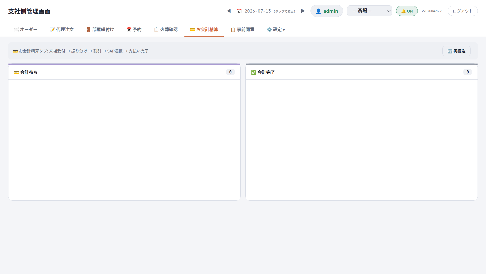

**この画面の意味:** **利用者（支払者）単位**の決済を管理する画面。オーダー（商品単位のカンバン）と違い、ここでは「誰がいくら支払うか」を扱います。領収書分割・手動割引もこの画面から行います。

**会計の2ステータス**

| 列 | 意味 |
|---|---|
| 💳 会計待ち | まだお支払いが済んでいない |
| ✅ 会計完了 | お支払いが完了した |

**精算QRの発行手順**

| # | 操作 | 確認ポイント |
|---|---|---|
| 1 | 会計待ちカードの「**支払い準備完了**」を押下 | **この時点で SAP へ受注登録される** |
| 2 | SAP 登録が正常完了すると「▼ 詳細」内に「**精算QR発行**」ボタンが出現 | 未登録・失敗時はボタンが表示されない |
| 3 | 「精算QR発行」を押下 | 価格確認画面 → QRコード発行（自動精算機で読み取り） |
| 4 | 支払確認後「会計完了」へ進める | 領収書分割・手動割引もここから |

> SAP受注が「失敗」の場合はオーダー画面上部の「↻ 失敗分を一括再送」で再送。繰り返し失敗する場合はシステム担当へ。

### 4.8 📋 事前同意

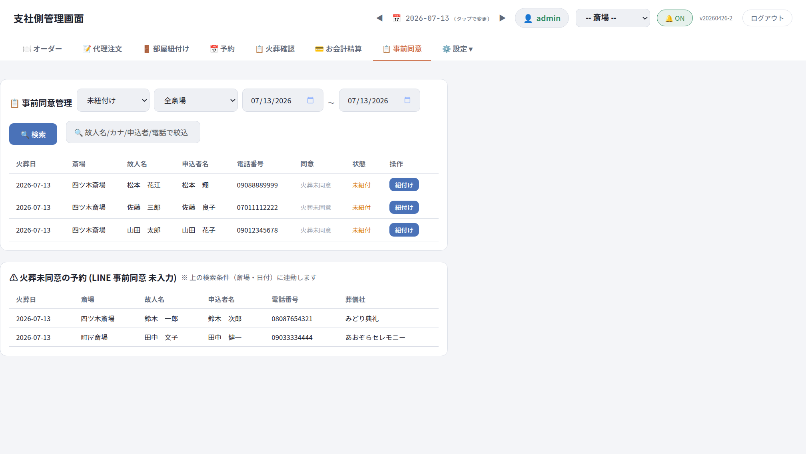

**この画面の意味:** LINEミニアプリから事前提出された**火葬の事前同意**を確認し、**予約と紐付ける**画面。「火葬当日に未同意者・未紐付者を探す」用途にも使います。

- **自動紐付け**: 予約取込時に「火葬日＋斎場＋故人名（＋喪家名かな）」の一致で自動紐付け。
- **手動紐付け**: 利用者から「事前同意済み」と申告があるのに受付画面で未同意になっている場合に使用。

**検索・絞り込み:** 状態（未紐付け／紐付け済み）・斎場・期間のフィルタに加え、LINE火葬申込の**全入力項目**（受付番号・火葬日・斎場・故人/申込者の氏名・かな・電話番号・メール・郵便番号・住所・続柄）で部分一致検索。**ひらがな/カタカナどちらでも検索可**。「検索対象が上限に達しています」と出たら火葬日か斎場で絞り込み。

**予約と紐付ける手順**

| # | 操作 | 確認ポイント |
|---|---|---|
| 1 | 該当行の「紐付け」→ 火葬日・斎場・喪家名かなを確認し「火葬予約を検索」 | 同一火葬日・同一斎場の予約候補が一覧表示 |
| 2 | 火葬日・斎場・故人名・喪家名かなが一致する行に「**完全一致候補**」表示 | 完全一致でも自動確定はされない |
| 3 | 「LINE申込を編集して紐づける」を押下 | LINE側入力内容の確認・訂正画面 |
| 4 | 内容を確認・訂正し「変更して紐づけを完了する」 | 変更されるのは **LINE申込情報のみ**（予約マスタは変更されない）。4項目が予約と不一致の場合、紐づけは停止 |

> 逆方向（予約→LINE申込）は「火葬確認」タブの「LINE申込を検索」から。受付番号・申込者名（かな）・電話番号で検索 → 編集して紐づけ → 変更・紐づけ・LINE通知がすべて ✅ になることを確認。一致する申込がない場合は新規登録QRを案内。LINE通知だけ失敗した場合は「LINE通知だけ再実行」（重複送信はされない）。

画面下部には「⚠ 火葬未同意の予約（LINE事前同意 未入力）」一覧が表示され、当日の未同意者を確認できます。

### 4.9 ⚙️ 設定ドロップダウン（マスタ系・superadmin限定）

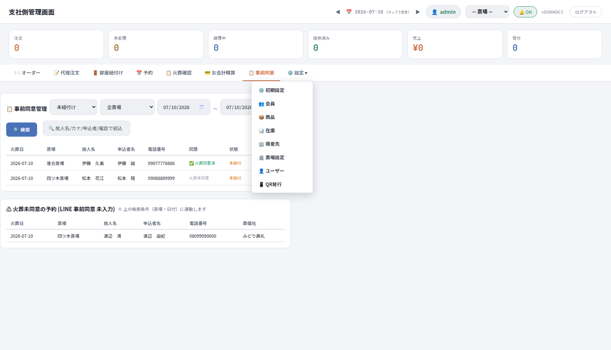

| メニュー | 意味・用途 |
|---|---|
| ⚙️ 初期設定 | リッチメニュー設定／Webhook／会員登録API／管理連携API／SAP連携／イベントログ／外部APIキー発行／場所・部屋設定／味バリエーション設定 |
| 👥 会員 | LINE会員マスタ（注文履歴・来店経過・葬儀日設定・AC/受付モード切替） |
| 📦 商品 | SAP商品マスタの全同期・差分同期・DB削除、プラント別フィルタ、品番・状態管理 |
| 📊 在庫 | 在庫情報の確認 ⚠ **既知の不具合により現在動作しません**（§10参照） |
| 🏢 得意先 | 葬儀社・得意先マスタ（「予約なし」代理注文の支払先に使用） |
| 🏛️ 斎場設定 | 斎場／保管場所／売上場所／商品紐付け／ジオフェンス設定 |
| 👤 ユーザー | 管理者ユーザーの作成（ロール・許可斎場・デフォルト売上場所）・ログインキー発行 |
| 📱 QR発行 | **オーダー用QR**（斎場×売上場所×ラベル指定で場所専用QRを生成・印刷）と**事前同意QR**（全申込者共通の固定QR。葬儀社経由で配布、`mode=pre` で事前同意モード起動） |

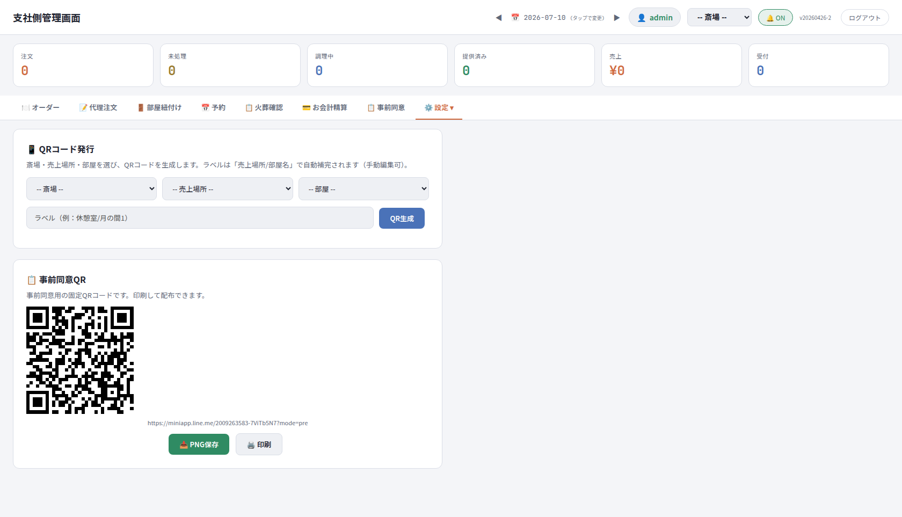

> **精算QRとの違いに注意**: 設定▼の「QR発行」は**部屋QR／共通QR**用。受注ごとの**精算QR**は「お会計精算」タブから発行します。

**オーダー用QR発行手順:** 斎場を選択 → 売上場所をプルダウン選択 → ラベル入力（例: 机1、A-3）→「QR生成」→ 印刷して対象場所（机上・メニュー裏等）に設置。

### 4.10 📅 予約一覧・その他参考画面

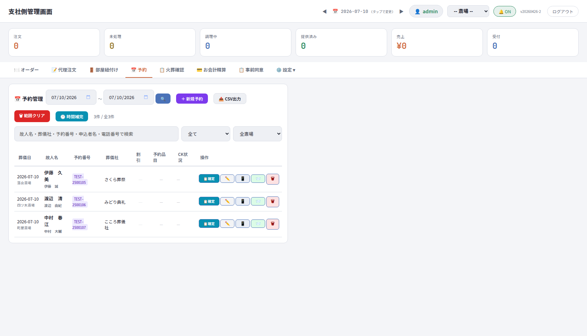

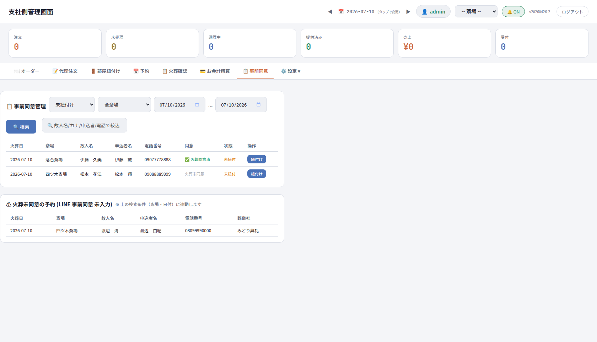

---

## 5. LINEミニアプリ（お客様向け）

### 5.1 画面一覧と遷移

全15画面。起動時 URL パラメータ（`hallId`/`spId`/`roomId`/`rsvId`/`mode`/`page` 等）と会員状態で自動ルーティングされます。

| # | 画面ID | 画面名 | 表示条件 |
|---|---|---|---|
| 1 | scrLoad | 読み込み中 | 起動直後（LIFF初期化） |
| 2 | scrFriend | LINE友だち追加 | 公式アカウント未追加 |
| 3 | scrNoQr | QR未読取 | QRパラメータ無しで起動 |
| 4 | scrNoAssign | 部屋未紐付け | FD予約だが部屋割当待ち |
| 5 | scrPickHall | 斎場選択 | ジオフェンスで複数斎場ヒット |
| 6 | scrRegister | 規約同意（ご利用にあたって） | 新規 or 未同意 |
| 7 | scrProfile | 申込者情報入力 | 申込者情報未入力 |
| 8 | scrPreInfo | 事前同意フォーム | `page=preconsent`（事前同意QR）でアクセス |
| 9 | scrPreComplete | 事前同意完了 | 事前同意送信完了 |
| 10 | scrCheckin | チェックイン（ホーム） | 会員確定後の起点 |
| 11 | scrFeeCheck | 料金確認（喪主払い分） | 喪主払い品目あり |
| 12 | scrOrder | 注文メニュー | チェックイン完了後 |
| 13 | scrConfirm | 注文確定 | 注文確定送信後 |
| 14 | scrHistory | 注文履歴 | フッターナビ「履歴」 |
| 15 | scrMyCart | 予約カート | フッターナビ「予約カート」 |

```
scrLoad ─┬─[QRなし]───────▶ scrNoQr
         ├─[友だち未追加]──▶ scrFriend
         ├─[page=preconsent]▶ scrPreInfo ─▶ scrPreComplete
         └─[QRあり]─┬─[複数斎場]──▶ scrPickHall ─┐
                     ├─[新規/未同意]▶ scrRegister ─▶ scrProfile ─▶ scrCheckin
                     └─[既存会員]──▶ scrCheckin（部屋未割当なら scrNoAssign）
scrCheckin ─▶ (scrFeeCheck) ─▶ scrOrder ─▶ scrConfirm
フッターナビ: 🏠ホーム / 🍽️オーダー / 🧾予約カート / 📜履歴 / 📢公式
```

### 5.2 主要画面の意味

| 画面 | スクリーンショット | 意味 |
|---|---|---|
| 友だち追加 | 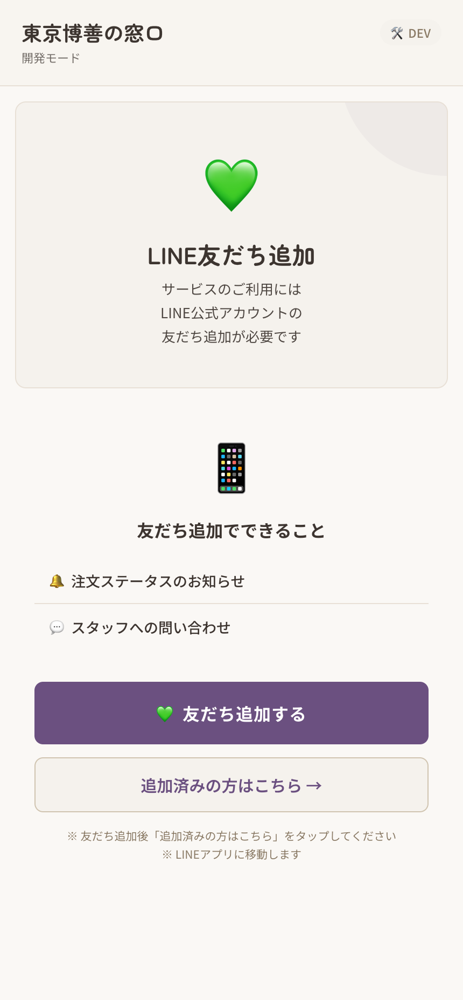 | LINE公式アカウント未追加の場合、フローの最初に友だち追加を促す（Phase2で入口に移動する仕様決定済み） |
| 規約同意 | 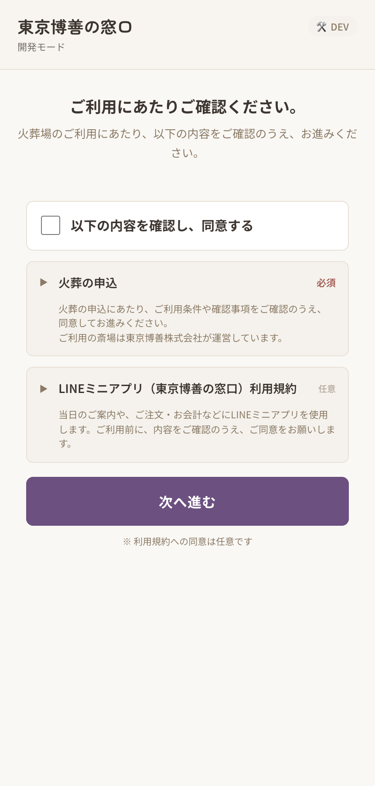 | 「ご利用にあたって」画面。利用規約への同意。東京博善ブランドカラー（白/紫） |
| 事前同意フォーム | 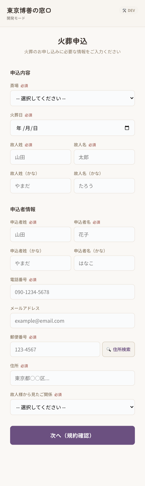 | 葬儀社配布の事前同意QR（`mode=pre`）から遷移。火葬日前に申込者（喪家）が同意内容確認と申込者情報（氏名・かな・電話・住所・続柄等）を入力 |
| チェックイン（ホーム） | 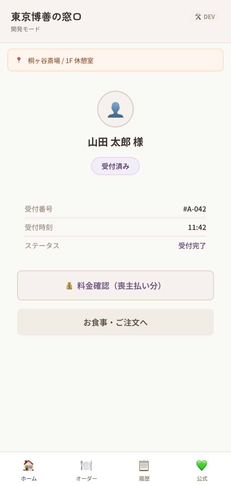 | 会員確定後のホーム。受付状態・お席の確認。当日QR読取時は故人情報と火葬時刻を確認してから同意画面に進む |
| 注文メニュー |  | 売上場所別メニュー。カテゴリ絞り込み→カート→注文確定 |
| 注文確定 |  | 注文完了。以後 LINE 通知（①注文受付 ②提供完了 ③会計完了）が届く |

### 5.3 お客様操作フロー

**モバイルオーダー**

| # | 操作 | 確認ポイント |
|---|---|---|
| 1 | 設置QRをスマホで読込 | ミニアプリ起動 |
| 2 | 受付完了画面でお席を確認 | 売店・控室等の場所 |
| 3 | メニューで商品選択（カテゴリ絞り込み可） | カートに追加 |
| 4 | 「注文を確定する」 | 注文受付のLINE通知 |
| 5 | 提供を受ける | 提供完了のLINE通知 |
| 6 | その場払いの場合スタッフに支払い | 会計完了通知 |

**事前火葬同意（火葬日前）**: 葬儀社配布QR読込 → 同意内容確認 → 申込者情報入力 → 送信 → 完了画面。

**炉前での火葬承諾（当日）**: スタッフ提示の受付QR読込 → 故人情報・火葬時刻の確認 → 同意ボタン → 申込情報を「その場で入力」or「後で入力」。

---

## 6. シナリオ別 操作フロー

### シナリオA: 売店でその場支払い

| # | 誰 | 操作 |
|---|---|---|
| 1 | お客様 | 売店QRを読込 → 飲料を選択して注文確定 |
| 2 | スタッフ | 即時提供品のため「提供済み」を直接押下（LINE提供完了通知） |
| 3 | スタッフ | 飲料を提供 → PDAで売上計上 → 「お会計準備完了」 |
| 4 | スタッフ | 注文詳細で支払先「現金」を選択 → 現金受領 → 「お会計済み」（LINE会計完了通知） |

### シナリオB: 控室で喪主まとめ払い

| # | 誰 | 操作 |
|---|---|---|
| 1 | お客様 | 控室QRから複数回注文 |
| 2 | スタッフ | 「調理開始」→提供→「提供済み」→PDA計上→「お会計準備完了」 |
| 3 | スタッフ | 注文詳細で支払先「喪主」を選択（**「お会計済み」は押さない**） |
| 4 | スタッフ | 最終的に「お会計精算」タブでまとめて精算（支払い準備完了→SAP登録→精算QR→会計完了） |

### シナリオC: 事前同意完了パターン

事前同意QRで入力済み → 自動/手動で予約紐付け → 当日「火葬確認」でバッジ「同意済」を確認 → 追加操作なしで火葬進行。

### シナリオD: 炉前で承諾取得（その場入力）

「火葬確認」で未同意カードを特定 → 「QR」提示 → お客様が読込・同意・申込情報入力 → バッジ更新を確認。

### シナリオE: 炉前で承諾のみ・後で入力

同意後「後で入力」を選択 → スタッフが業務時間中に未入力者リストを確認 → 声かけして本人入力 or 代行入力。

---

## 7. 権限（ロール）一覧

| ロール | 表示名 | 主な権限 |
|---|---|---|
| `superadmin` | 管理者 | 全権限＋ユーザー管理＋設定ドロップダウン |
| `staff` | スタッフ | 通常運用（受注／受付／会計など）。「予約」「設定」は非表示 |
| `cc_sv` | CC SV | コールセンターSV（CRM全件＋割振解除） |
| `cc_staff` | CCスタッフ | コールセンター（自分＋未割当） |
| `label_agent` | ラベル担当 | ラベル（サブチケット）業務のみ |

ユーザーごとに「許可斎場（空＝全斎場）」「デフォルト売上場所」を設定可能。認証は3系統（管理画面セッション／LIFF／外部APIキー）。

---

## 8. トラブルシューティング Q&A

| 症状 | 原因と対応 |
|---|---|
| 一覧に何も表示されない（「該当なし」） | 上部の**日付**が対象日か確認。◀/▶で移動 |
| 注文がカンバンに出ない | 「リアルタイム接続中」表示を確認→再読込。日付・斎場フィルタ・通知OFFも確認。お客様側の通信エラーなら再送依頼 |
| 「未承諾のみ」を押したら件数が減った | 絞り込みが効いている状態。もう一度押すと全件表示 |
| カナで検索しても出ない | 事前同意タブは故人名ふりがな対応。漢字/ひらがな/カタカナで試す。出なければふりがな未登録の可能性 |
| 「精算QR発行」ボタンが見当たらない | 「支払い準備完了」まで進め、SAP登録完了後に「▼ 詳細」内に表示される |
| SAP受注が「失敗」 | オーダー画面上部「↻ 失敗分を一括再送」。繰り返す場合はシステム担当へ。ハードリロード（Ctrl+Shift+R）で最新ビルド読込後に再振り分けで直るケースあり（キャッシュ起因） |
| LINE通知が届かない | 友だち登録・お客様側の通知設定を確認。1分以上遅延したら管理者へ |
| QRが読み取れない | 汚損・反射→再発行印刷。スマホ側→再起動。期限切れ→新規発行 |
| PDA売上計上エラー | PDA通信確認→再試行。SAP一時障害→注文詳細のSAP診断確認・再送。二重計上に注意 |
| 操作を間違えた／画面が固まった | 「🔄 再読込」→ 改善しなければブラウザ再読み込み |
| 誤って受付した | 「お会計精算」タブの該当カード「← 精算未受付に戻す」（支払い前のみ） |

---

## 9. 用語集

| 用語 | 意味 |
|---|---|
| 管理画面（支社側管理画面） | スタッフ向けWeb画面（admin.html） |
| LINEミニアプリ | お客様（喪家・参列者）向けの注文・同意入力アプリ（LIFF） |
| 火葬確認 | 本日の火葬予約と火葬同意状況を確認する画面（旧「受付」） |
| 事前同意 | 火葬日前に申込者がLINEから入力する火葬同意 |
| 火葬承諾 | 炉前で確認・取得する火葬同意（受付タブのバッジ表記） |
| 紐付け | 事前同意（LINE申込）と予約マスタを結び付けること |
| カンバン | 注文をステータス列で管理する画面形式 |
| 代理注文 | スタッフがお客様に代わって注文すること |
| お会計準備完了 | 提供が終わり会計に進める状態（PDA計上済み） |
| 精算QR | お会計精算画面で発行する自動精算機用QR |
| PDA | 売上計上に使用するスタッフ携帯端末 |
| SAP | 基幹システム（売上・得意先管理）。mado からは中間APIを経由 |
| MVGR4（購入者区分） | 商品マスタの購入者区分。1=お連れ様/喪家可、2=喪家のみ、3=代理購入のみ、空欄=販売対象外 |
| LIFF | LINE Front-end Framework。LINE内でWebアプリを動かす仕組み |
| ジオフェンス | 位置情報による斎場の自動判定（複数ヒット時は斎場選択画面） |

---

## 10. 既知の注意点・制約

- **在庫タブは動作しない（既知リグレッション）**: `initInventoryTab` 等の JS 関数が削除されたまま画面が残っており、開くと `ReferenceError` が発生します。修正までは使用しないでください（Phase 1 は在庫表示に依存しない運用。日次終了時の在庫修正で調整）。
- **お連れ様注文の SAP レスポンス**: `sapStatus:"error"`／`sapOrderNos` 空が返ることがありますが SAP 受注自体は成立している既知バグがあります。止まらず受注番号の記録を優先してください。
- **「本日分クリア」は要注意操作**: 受付状況をリセットします。原則、責任者判断で実施。
- **STG のテストデータ**はリセットされることがあります。証跡は都度保存してください。実顧客データは STG に投入しません。
- **合同法要タブは削除済み**（外部API `GET /api/v1/godo-hoyo` とリッチメニューの「合同法要問合せ」は存続）。
- **購入者区分・0円商品の強制制御**は 2026-08 時点で改善対応中の領域です（画面フィルタだけでなくサーバー側検証を必須化する方針）。
- 予約なし注文（お連れ様）の**運用ルール**（対象ケース・個別会計の可否・後からの予約紐付け・操作権限）は運用側と確認中の項目があります。

---

## 11. 参考資料（出典）

| 資料 | 場所 |
|---|---|
| 04_操作マニュアル_Phase1.docx（v1.0） | mado リポジトリ `docs/uat/`（Drive ミラーあり） |
| 現場マニュアル-斎場職員向け.md（2026-07-14改訂） | mado リポジトリ `docs/` |
| mado-system-spec.docx（システム仕様書 v2.0） | mado リポジトリ `docs/` |
| admin-manual（画面マニュアル・タブ別MD＋キャプチャ） | mado リポジトリ `docs/admin-manual/` |
| sitemap（LINEミニアプリ全15画面＋キャプチャ） | mado リポジトリ `docs/sitemap/` |
| 東博_mado管理側_エンジニア改善指示（2026-08-02） | Google Drive |
| プロジェクト定例議事録（7/21・7/24・7/31 ほか） | Notion「【Tokyo-Hakuzen東京博善】窓口システム開発」 |
| リポジトリ | `nurveteam/mado`（Firebase: mado-staging / madoguchi-ec1d5） |

> 本書のスクリーンショットは mado リポジトリ `docs/` 配下の公式キャプチャ（STG 環境・テストデータ）を転載したものです。この作業セッションからは `mado-staging.web.app` への直接アクセスがネットワークポリシーで許可されていないため、ライブ画面の新規キャプチャは行っていません。
