# 東京博善「窓口（mado）」システム手順書 v4.0

| 項目 | 内容 |
|---|---|
| 文書名 | 東京博善 窓口システム（mado）手順書 兼 リスク台帳 |
| 対象システム | 支社側管理画面（admin.html）／LINEミニアプリ（index.html・LIFF）／CRM（crm.html）／外部API（/api/v1/*） |
| 対象読者 | 斎場スタッフ（町屋・落合・代々幡・四ツ木・桐ヶ谷・堀ノ内・お花茶屋会館）・本社運用担当・PMO・新規参画メンバー |
| 検証環境（STG） | `https://mado-staging.web.app/admin.html`（Firebase プロジェクト `mado-staging`） |
| 本番環境 | `https://madoguchi-ec1d5.web.app/admin.html`（Firebase プロジェクト `madoguchi-ec1d5`） |
| リポジトリ | GitHub `nurveteam/mado` |
| 版数 | v4.0（2026-08-04）— スクリーンショット49枚（うち**41枚は 2026-08-04 版ソースを起動して本日新規撮影**）。業務フローを前日Ver./当日Ver.に分割。お会計精算・火葬確認・代理注文を実画面の最新仕様へ全面更新 |
| 作成方法 | 04_操作マニュアル_Phase1・現場マニュアル（2026-07-14改訂）・mado-system-spec v2.0・admin-manual／sitemap・エンジニア改善指示（2026-08-02）・Notion議事録（7/21〜7/31）・Slack `#prj-東博の窓口システム開発` を突合し、5回の検証パス＋v3.0/v4.0追補検証（§12）を実施 |

> **ログイン情報・APIキーは本書に記載しません。** アカウントは管理者から個別（DM）に共有されます（リスク D-1）。
>
> **📸 スクリーンショットの撮影方法（v4.0）**: 本作業環境から `mado-staging.web.app` への直接アクセスはネットワークポリシーで遮断されているため、**STG と同一の 2026-08-04 版ソースコード（`nurveteam/mado` の `public/admin.html`〈899KB〉・`public/index.html`）をローカルで起動し、STG 相当の架空テストデータ（東博太郎・幕内祭典・TEST-2500200 等）を投入して Chromium で撮影**しました。画面仕様・文言・配色は STG と同一です（ヘッダーの build 表示のみ「build 不明」となる点が実環境と異なります）。加えて 2026-08-04 の STG ライブ画面 1 枚（`STG/951d4df`）と、実データ取得が必要な LIFF 画面 6 枚（2026-07 公式キャプチャ・ライトテーマ）を併用しています。旧ダークテーマの画像はすべて排除しました。

---

## 目次

1. [システム概要](#1-システム概要)
2. [全体アーキテクチャと外部連携](#2-全体アーキテクチャと外部連携)
3. [業務の全体像 — 前日Ver.／当日Ver.](#3-業務の全体像--前日ver当日ver)
4. [管理画面（admin.html）画面別の意味と操作手順](#4-管理画面adminhtml)
5. [LINEミニアプリ 画面別の意味と操作手順](#5-lineミニアプリお客様向け)
6. [シナリオ別 操作フロー](#6-シナリオ別-操作フロー)
7. [権限（ロール）一覧](#7-権限ロール一覧)
8. [トラブルシューティング Q&A](#8-トラブルシューティング-qa)
9. [リスク台帳 — 網羅的リスク分析と対策](#9-リスク台帳--網羅的リスク分析と対策)
10. [用語集](#10-用語集)
11. [参考資料（出典）](#11-参考資料出典)
12. [検証記録（5回のレビューパス＋追補）](#12-検証記録5回のレビューパス追補)

---

## 1. システム概要

### 1.1 何のためのシステムか

「東京博善の窓口（mado）」は、**東京博善株式会社**（広済堂グループ）の7斎場 — **町屋斎場・落合斎場・代々幡斎場・四ツ木斎場・桐ヶ谷斎場・堀ノ内斎場・お花茶屋会館** — の式場・控室・休憩室・ラウンジ・売店・お別れ室で使用する、**葬儀当日の受付・火葬同意・モバイルオーダー・会計精算**のデジタル化システムです。

**解決したい課題**: 紙による火葬同意（火葬承諾書）の取得・受付の手間／飲食注文時にスタッフを呼び出す手間・提供ミス／葬儀後のアフターケア（相続・法要・供養・骨物）に向けた顧客接点の不在。

**最終目的:** 葬儀当日の利便性向上を入り口に LINE 公式アカウント（OA 2009733008）経由の会員化を促進し、アフターケア CRM（Bluememe 社の会員基盤 API と連携）の基盤を構築すること。

### 1.2 サブシステム構成

| サブシステム | URL | 利用者 | 概要 |
|---|---|---|---|
| **支社側管理画面（受注管理）** | `/admin.html` | 斎場スタッフ・本社（約60名想定） | 注文カンバン・代理注文・部屋紐付け・火葬確認（受付）・お会計精算・事前同意管理・各種マスタ |
| **LINEミニアプリ** | `/index.html`（LIFF。QR基点は 2026-08-03 に本番用 LIFF `2009732996` へ切替。旧開発用=2009732994） | 喪主・喪家・お連れ様・参列者 | チェックイン・モバイルオーダー・事前/当日の火葬同意・会員登録。シニア向けUX（白/紫の東京博善ブランドカラー） |
| **CRM** | `/crm.html` | コールセンター（CC SV／CCスタッフ） | アフターケア架電管理・LINEチャット・チケット・資料請求・Twilio WebRTC 電話・OpenAI Whisper 文字起こし |
| **外部API（v1）** | `/api/v1/*` | 中間サーバー・Bluememe 等 | 外部システム連携用 REST API（X-Api-Key 認証） |

### 1.3 プロジェクト体制

| 役割 | 会社・担当 |
|---|---|
| 発注元・事業主体 | 東京博善株式会社（窓口事業: 小島室長・大沼様・榎本様ほか、業務部・現場担当） |
| SAP管理 | 広済堂 情報システム部 |
| 全体進行・一次請け・インフラ（Firebase）・UI調整 | 株式会社ナーブ（NURVE。廣瀬様ほか。SAP中間サーバー担当: 山本様） |
| PM・要件整理・開発推進 | 株式会社ARCRA（佐藤） |
| バックエンド・API開発 | 株式会社rubyjobs（Mario Yi 氏。2026-08 に引き継ぎ実施 → リスク F-1） |
| 外部連携パートナー | 株式会社テコテック（新予約・葬祭管理システム連携）／Bluememe（会員基盤・アフターケアAPI） |
| 精算機 | 東芝テック／ユニコ（自動精算機・PDA） |

**フェーズ:** Phase 1＝火葬同意機能等（8/7 リリース判定 → 8/9 運用引継ぎ）。Phase 2＝モバイルオーダー全シーン・生前マイページ・訃報連絡・思い出アルバム等（9月以降）。受入テスト 8/1〜8/17（山場）→ 8/20 リリース判定ステコミ → 9/1 リリース。

---

## 2. 全体アーキテクチャと外部連携

### 2.1 技術スタック

| レイヤー | 技術 |
|---|---|
| フロントエンド | HTML/CSS/JS（SPA・フレームワークなし）。`public/admin.html`（約900KB・単一ファイル）・`public/index.html`・`public/crm.html`。外部ライブラリ: Firebase JS SDK 10.7.1（compat）・Leaflet 1.9.4（ジオフェンス地図）・qrcodejs 1.0.0・SheetJS xlsx 0.20.1・Noto Sans JP／JetBrains Mono |
| バックエンド | Firebase Cloud Functions v2（Node.js）＋ Express。`functions/index.js` 単一大規模ファイル（リスク E-4）。本番 API は Cloud Run（`api-…-an.a.run.app`） |
| データベース | Cloud Firestore 24 コレクション。管理画面は `orders`・`checkins`・`reservations` を **onSnapshot リアルタイムリスナー**で購読（当日 `date` 基準）し、他は REST。where+orderBy 併用を避け JS ソートで代替する設計 |
| 認証 | **3系統**: 管理画面セッション（X-Admin-Token・sessionStorage保持）／LIFF（Authorization: Bearer）／外部APIキー（X-Api-Key） |
| LINE連携 | LINE Messaging API（push/reply/profile/リッチメニュー）＋ LIFF SDK v2。公式アカウント OA **2009733008** |
| 電話（CRM） | Twilio WebRTC Client SDK 1.14.1（録音30日保持）＋ OpenAI Whisper（25MB上限） |
| ホスティング | Firebase Hosting（STG: `mado-staging`／本番: `madoguchi-ec1d5`）。環境判定により Firebase 設定・API 先・LIFF 基点 URL を自動切替（local は Firestore エミュレータ localhost:8080） |
| API規模 | 110 エンドポイント（2026-03 仕様書 v2.0 時点）→ 177（2026-07 体制資料時点） |

### 2.2 外部システムとの関係

```
新予約・葬祭管理（テコテック製。旧: Fellow／タイコウ）──毎朝CSV/API──▶ ┌────────────────┐
                                                                        │  窓口 mado      │
LINE Platform（LIFF / OA 2009733008）◀───────────────────────────────▶│  Firebase       │
                                                                        │  admin / index  │
SAP S/4HANA Cloud ◀── SAP中間API（Node.js・NURVE管理）◀──────────────│  / crm          │
   │ sapCartAdd / sapCartComplete / 割引 / 自動仕訳                     └───────┬────────┘
自動精算機（東芝テック／ユニコ）◀── 精算QR（SAP受注番号）──────────────────┘
```

- **予約データ**: テコテック新予約システム（9月リリース。旧 Fellow／タイコウ）→ NURVE 中間サーバー → 窓口へ同期。
- **SAP連携**: 注文作成時 `sapCartAdd`、「お会計準備完了」遷移時 `sapCartComplete`（受注登録）。価格は Condition Types（本体価格 **PP00**・手動価格 **PPR0**・社員割引 **Z001**・キャッシュバック）。支払割当は**代表品目分類**ベース（旧 productGroup から PR #190 で移行）。
- **SAP中間の環境**: STG 連携先は `saptest-staging.nurve.jp`（NURVE 山本様管理）→ SAP検証環境。
- **精算機連携**: 精算QR（SAP受注番号ベース）を自動精算機で読み取り精算。精算機で処理が中断した場合は**精算ロック管理**（§4.7）で状態確認・解除（15分で自動解除）。
- **デプロイ運用**: `staging` → STG 自動デプロイ／`main` → 本番（GitHub Environment「production」required reviewers 承認ゲート）。障害時は revert → 再デプロイ or Hosting 版切り戻し。

### 2.3 環境

| 環境 | URL | 用途・注意 |
|---|---|---|
| ステージング（STG） | `https://mado-staging.web.app/` | 検証用。テストデータ投入済み（斎場7・予約10・事前同意5・商品約2万件）。**実顧客データは使用しない**。ヘッダーに build SHA 表示（例: `STG / 951d4df / build 30866385986`） |
| 本番 | `https://madoguchi-ec1d5.web.app/` | 実運用 |

**LINEミニアプリのプレビュー（STG）**: LINE ログイン・QR 不要でブラウザから確認可能。

```
https://mado-staging.web.app/?preview=<画面名>
  friend / top / top-day / register / pre-info / pre-complete /
  checkin-pending / checkin-done / profile
```

ヘッダーに「👁 プレビュー」表示があればプレビューモードです（§5 の l-*.png はこのモードの撮影）。実機確認にはテスト用QRが必要。**検証環境専用ミニアプリが未設定の期間は、LINE アプリから開くと本番に接続される点に注意**（リスク C-7）。

---

## 3. 業務の全体像 — 前日Ver.／当日Ver.

窓口システムの業務は、**火葬日前（前日まで）に行う事前準備**と、**火葬当日の運用**で使う画面・手順が異なります。

### 3.1 前日Ver.（火葬日前日までの事前フロー）

主担当: 葬儀社（QR配布）・申込者（喪家）・本社/コールセンター・斎場管理者

```
【葬儀社】商談時に事前同意QR（全申込者共通・mode=pre）を申込者へ配布
   ↓                     ※テコテック新予約システム移行後は SMS 送付へ変更予定
【申込者】LINEで読み取り → 友だち追加（scrFriend）→ 同意内容確認 →
          申込者情報入力（scrPreInfo）→ 送信 → 受付番号 YYMMDD-0001 発番（scrPreComplete）
   ↓
【システム】中間サーバーからの予約取込時に「火葬日・斎場・故人名・喪家名かな」の
            完全一致で事前同意と予約を自動紐付け
   ↓
【管理者】「📅 予約」タブで翌日分の予約を確認し「📋確定」（区民葬・献体・減額・公費
          と得意先コードを確認）
【スタッフ】「📋 事前同意」タブで未紐付けを確認 → 不一致分は手動紐付け（§4.8）
【スタッフ】「📋 火葬確認」タブの日付を ◀/▶ で翌日に切り替え、「⚠ 未承諾のみ」で
          翌日の未同意者を抽出 → 必要に応じ事前連絡・受付票印刷で当日に備える
```

### 3.2 当日Ver.（火葬当日の同意確認〜精算フロー）

主担当: 斎場スタッフ（受付・炉前・売店・配膳）

```
① 始業前チェック … 🟢接続中／🔔ON／日付=本日／斎場セレクタ=自斎場／ハードリロード
 ↓
② 火葬同意の確認 …「📋 火葬確認」で本日の予約一覧（火葬開始時間順）を確認。
   「火葬同意の取得状況」が 承諾（緑）→ そのまま火葬進行
                         未承諾（赤）→ ③へ
 ↓
③ 炉前で当日取得 … 対象行の「QR」ボタン → 受付QRを提示 → お客様が読取 →
   故人情報・火葬時刻を確認 → 同意 → 申込者情報を「入力して受付へ進む」or「あとで入力する」
   （LINE申込の訂正・紐付けは「LINE申込を検索」から。※受付操作でLINE通知は送信されない）
 ↓
④ 部屋紐付け …「🚪 部屋紐付け」で控室・休憩室の部屋に予約を紐付け（FD制御・ラストオーダー起動）
 ↓
⑤ 注文対応 … お客様のモバイルオーダー／「📝 代理注文」。「🍽️ オーダー」カンバンで
   未処理 →（調理開始）→ 調理中 →（提供済み）→ 提供済み →（PDA計上→お会計準備完了）
   ※「お会計準備完了」への遷移で SAP 受注登録（sapCartComplete）
 ↓
⑥ 精算 …「💳 お会計精算」: 受付 → 割引 → 支払い準備完了 → 精算QR発行 → 自動精算機で支払い
   → 支払い済み（喪主まとめ払いは個別注文を「お会計済み」にせず、ここで一括精算）
 ↓
⑦ 利用終了 … 部屋紐付けを「解除」。リッチメニューは葬儀日翌日に dailyMenuCheck で
   アフターケアフェーズへ自動切替（以後は CRM 架電・合同法要等のアフターケア導線）
```

> **「受付」と「注文」は別の操作です。** 受付＝「火葬確認」タブで来場を受け付ける操作。注文＝「代理注文」タブでスタッフが商品を注文する操作。

---

## 4. 管理画面（admin.html）

### 4.0 ログイン

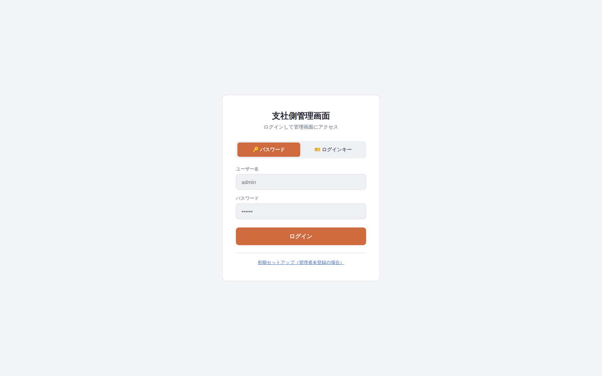

**この画面の意味:** スタッフ認証の入り口。「🔑 パスワード」と「🎫 ログインキー」（`XXXX-XXXX-XXXX` 形式の印刷カード）の2方式。Enter キーでも送信できます。認証成功でトークンが sessionStorage に保存され、オーダー画面へ遷移します。

| # | 操作 | 確認ポイント |
|---|---|---|
| 1 | 管理画面 URL にアクセス | ログイン画面が表示される |
| 2 | 「🔑 パスワード」タブ（既定）でユーザー名・パスワードを入力 | マスク表示 |
| 3 | 「ログイン」を押下 | オーダー（カンバン）画面へ遷移 |

### 4.1 共通ヘッダー（全タブ共通）

| 表示 | 意味 |
|---|---|
| **支社側管理画面** | 画面タイトル（`<title>` は「支社側管理画面 [v20260426-2]」） |
| **◀ 2026-08-05（タップで変更）▶** | 表示対象日（viewDate）。◀=前日／▶=翌日。**一覧が空のときはまずここを確認** |
| **👤 管理者** | ログイン中ユーザーの表示名 |
| **-- 斎場 --**（`globalHallSelect`） | 操作対象の斎場。四ツ木斎場等を選択すると全タブが追従（部屋紐付けの `raHallSelect` と連動） |
| **🔔 ON** | 通知音トグル |
| **STG / 951d4df / build …** | 稼働ビルド（本番は v20260426-2 等）。キャッシュ確認・障害切り分けに使用 |
| **ログアウト** | セッション破棄 |

**ナビゲーションタブ（実画面の並び）**

```
🍽️ オーダー ／ 📝 代理注文 ／ 🚪 部屋紐付け ／ 📅 予約 ／ 📋 火葬確認 ／ 💳 お会計精算 ／ 📋 事前同意 ／ ⚙️ 設定 ▾
```

「⚙️ 設定 ▾」はドロップダウン（`settingsMenu`）で、⚙️初期設定／👥会員／📦商品／📊在庫／🏢得意先／🏛️斎場設定／👤ユーザー（superadmin のみ表示）／📱QR発行 を格納。非 superadmin には「📅 予約」と「⚙️ 設定」自体が非表示です。旧「合同法要」タブは削除済み（外部API `GET /api/v1/godo-hoyo` とリッチメニューの「合同法要問合せ」は存続）。

### 4.2 🍽️ オーダー（注文カンバン・panelOrders）

**この画面の意味:** ログイン直後のデフォルトタブ。LINE ミニアプリの注文と代理注文が**リアルタイム**（Firestore リスナー＋通知音）で流れ込み、**未処理 → 調理中 → 提供済み → お会計準備完了**の4列で管理します（「お会計済み」は列を廃止し、右上に件数のみ表示。管理は「お会計精算」タブ）。

本日撮影（ローカル起動・4列すべてにカードがある状態）:

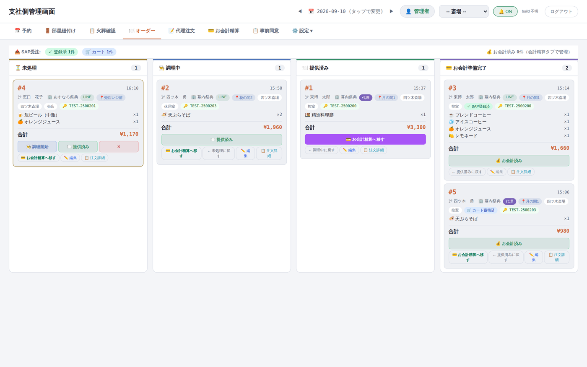

STG ライブ画面（2026-08-04・build STG/951d4df）:

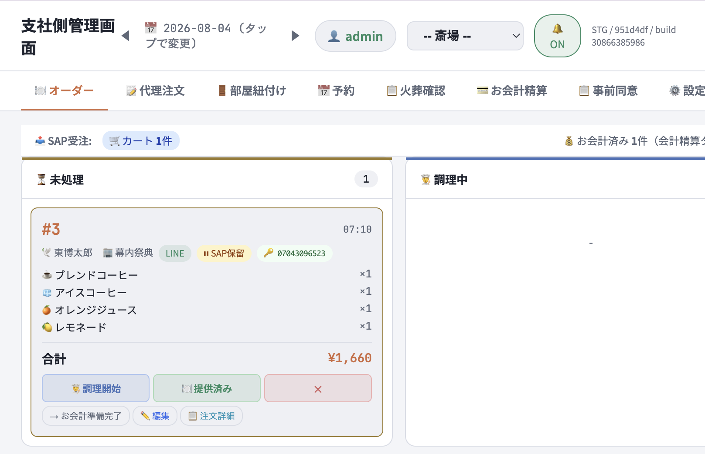

**上部「📤 SAP受注:」ステータス帯**（お会計準備完了列の集計。件数が0のチップは非表示）

| チップ | sapStatus 値 | 意味 |
|---|---|---|
| ✓ 登録済 N件（緑） | `sent` | SAP 受注登録済み |
| 🛒 カート N件（青） | `cart_added`／`partial` | SAP カート蓄積済み（お会計待ち）／一部支払済 |
| ⏳ 送信中 N件（黄） | 未知の値 | レスポンス待ち |
| ⚠ 失敗 N件（赤） | `error`／`queued` | 送信失敗（queued=中間サーバー到達未確認も失敗扱い・DIAG-053） |
| ⏭ 対象外 N件（灰） | `sap_disabled`／`sap_skipped`／`cart_pending` | SAP無効・対象外・保留 |
| ↻ 失敗分を一括再送（赤ボタン） | — | `retryAllFailedSap()`。失敗があるときのみ表示 |

**注文カードの構成**（例: #3 東博太郎）: 注文番号 `#3`／注文時刻／🕊 故人名（checkin・予約から解決）／🏢 葬儀社名（幕内祭典）／注文経路タグ `LINE` or `代理`（紫）／📍QRラベル（例: 売店レジ前・月の間1・花の間2）／斎場・売上場所タグ（四ツ木斎場・控室）／SAPバッジ（✓SAP登録済／🛒カート蓄積済／⚠SAP失敗／⏸SAP保留 等）／🔑 外部受注ID（bookingId。例: TEST-2500200）／商品明細（☕ブレンドコーヒー ×1 …）／合計 ¥1,660。

**カードのボタン（列により変化）**

| ボタン | 動作 |
|---|---|
| 👨‍🍳 調理開始 | 「調理中」列へ |
| 🍽️ 提供済み | 「提供済み」列へ＋**LINE「提供完了」通知**。即時提供品（瓶ビール（中瓶）等）は調理開始を飛ばして直接押下 |
| ✕（赤） | 注文キャンセル |
| → お会計準備完了 | PDA 売上計上後に押下。**SAP 受注登録（sapCartComplete）が走る** |
| 💰 お会計済み | その場支払い完了時（LINE「会計完了」通知）。喪主まとめ払いでは押さない |
| ← 未処理に戻す／← 調理中に戻す／← 提供済みに戻す | 1つ前の列へ戻す |
| ↻ SAP再送 | SAP失敗・カート蓄積状態のカードで個別再送 |
| ✏️ 編集 | 「注文を編集」モーダル（下記） |
| 📋 注文詳細 | 外部受注ID（bookingId/checkinId）単位の注文詳細パネル |

**✏️ 編集 → 注文を編集モーダル**（個別商品の削除・追加＝一部キャンセル）

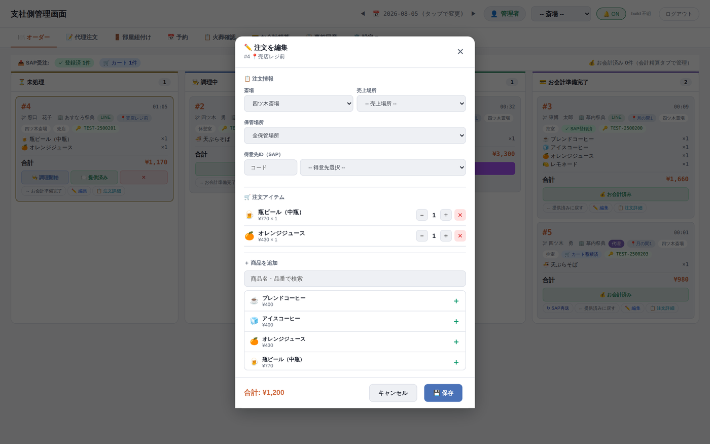

対象商品行の「✕」で削除 → 合計再計算を確認 →（誤削除時は「＋ 商品を追加」で品名・品番検索して再追加）→「保存」。SAP カートが CART／PENDING 状態のときは品目編集が可能で、**保存は削除→追加の2ステップ**で実行されます（品番・品名〈🔍差替候補〉・単価・数量・品目グループ）。

**📋 注文詳細 → 注文詳細パネル**

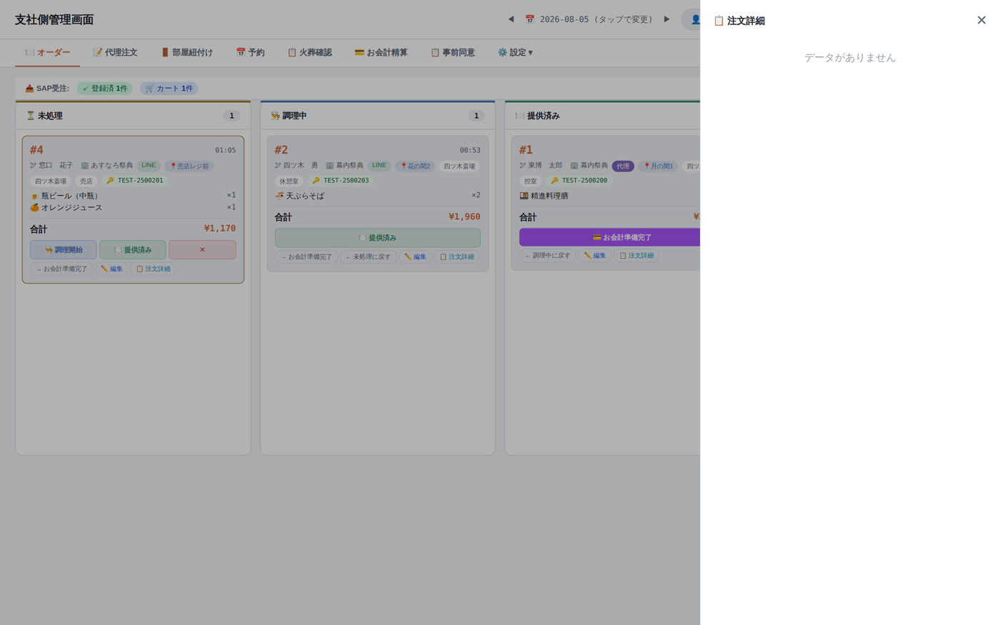

外部受注ID（カートキー）単位で、SAP 受注サマリー（`GET /api/admin/checkin/{id}/summary`）・支払先振り分け（喪主／現金／売掛／ワンタイム）・SAP診断・カート明細（Condition Types: PP00 等）・税額・支払者別請求明細（payers）・合計（grandTotals）を確認します。

> **LINE通知は3種類のみ**: ①注文受付 ②提供完了 ③会計完了。「調理中」通知はありません。
> **喪主まとめ払いは「お会計済み」を押さない**（リスク A-1）。「お会計準備完了」のまま「💳 お会計精算」で一括精算します。

### 4.3 📝 代理注文（panelProxy）

**この画面の意味:** スマホをお持ちでない方・口頭注文・葬儀社一括手配に対応する、スタッフ代行注文のウィザード画面。**Step 0（⚙️ 斎場・売上場所設定）→ Step 1（予約を選択）→ Step 3（商品を選択）→ 送信**の順に展開します（購入者=支払者の選択は予約有無・文脈で変化。Step0 サマリに「支払者未確定」と表示）。

**Step 0 未設定のガード**: 斎場・売上場所が未選択の間、Step 1 に「⚠ 先に「⚙️ 斎場・売上場所設定」で斎場と売上場所を選択してください。」と表示され進めません。

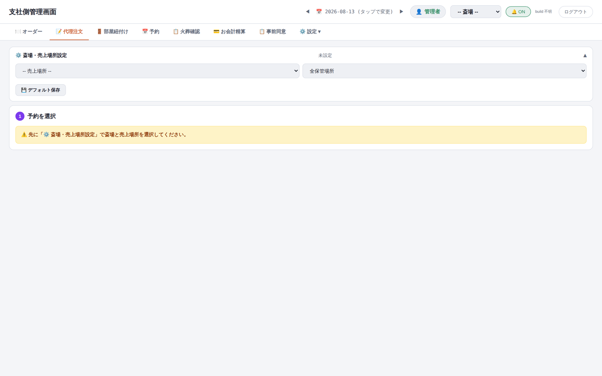

**Step 0 で 四ツ木斎場・控室 を選択すると Step 1 が有効化**（ヘッダー右にサマリ「四ツ木斎場」表示。「💾 デフォルト保存」でログインユーザーの既定値に保存）:

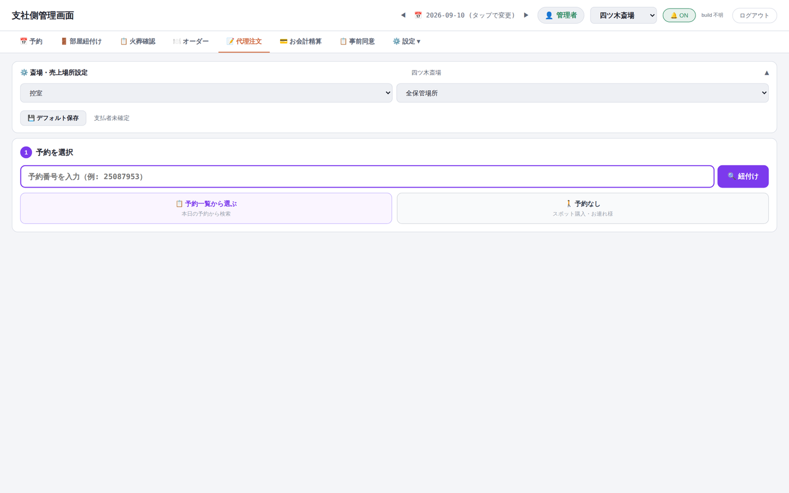

**Step 1「予約を選択」の3方式**

| 方式 | 操作 |
|---|---|
| 予約番号を入力 | `予約番号を入力（例: 25087953）` に入力 → 紫の「🔗 紐付け」ボタン。成功でトースト「✅ 予約紐付け完了: 東博　太郎」「📋 予約選択: 東博　太郎 — 予約品目 1件あり」 |
| 📋 予約一覧から選ぶ | 予約ピッカーモーダル（下記） |
| 🚶 予約なし | スポット購入・お連れ様。得意先（葬儀社）を支払先に選択して進行 |

**📋 予約一覧から選ぶ → 予約ピッカーモーダル**（「2026-08-05 の予約から選択（検索は期間全体）」・故人名/葬儀社/予約番号で検索・「⏱ 葬儀時間↑」ソート。注記「※ 受付完了の予約は葬儀社得意先コードが自動入力されます」。TOHAKU-959 対応で検索文字ありの場合は期間全体から検索）:


**予約紐付け後**: Step 1 に紫の「📋 予約選択済み `TEST-2500200` 東博　太郎 / 幕内祭典」バッジが表示され（「✕」で解除）、**Step 3「商品を選択」**が展開します:

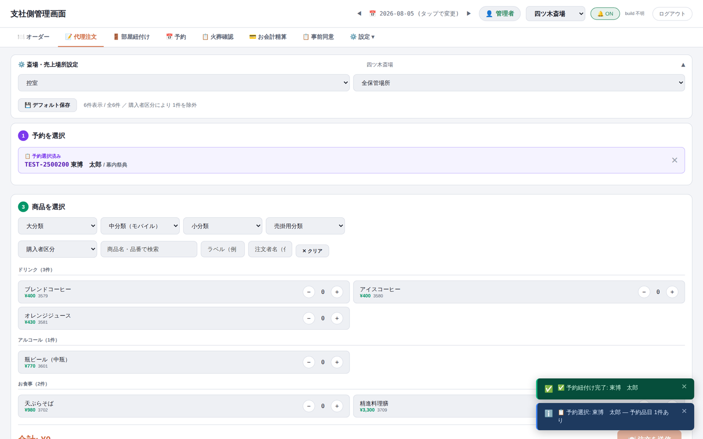

**Step 3 のフィルタ（実画面の並び）**: `大分類` ／ `中分類（モバイル）`＝MVGR1 ／ `小分類`＝MVGR3 ／ `売掛用分類` ／ `購入者区分`＝MVGR4 ／ `商品名・品番で検索` ／ `ラベル（例: 机1）` ／ `注文者名（任意）` ／ `✕ クリア`。商品はカテゴリ見出し（ドリンク（3件）・アルコール（1件）・お食事（2件）…）ごとに「商品名＋¥価格＋SAP品番（例: ブレンドコーヒー ¥400 `3579`）」で並び、`−`／数量／`＋`で加減します。

> **購入者区分（MVGR4）フィルタは実際に働いています**: 撮影画面のヘッダーに「**6件表示 / 全6件 ／ 購入者区分により 1件を除外**」と表示（喪家専用 MVGR4=`3` の骨壺が除外された状態）。区分の意味は 1=お連れ様/喪家可・2=喪家のみ・3=代理購入のみ・空欄=販売対象外（TOHAKU-405/410。サーバー側 422 検証は改善指示 2026-08-02 で実装中 → リスク B-1/B-2）。

**商品を追加すると**画面下部に「合計: ¥1,200」とオレンジの「🍽️ 注文を送信」ボタンが表示され、送信でオーダーカンバンに新規カードが出現します:

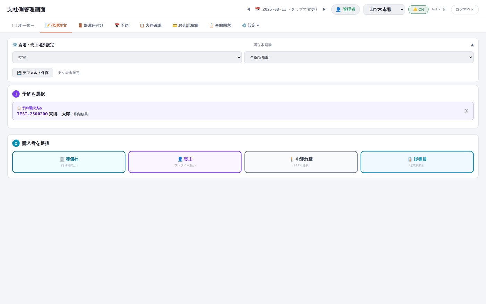

### 4.4 🚪 部屋紐付け（panelRoomAssignments）

**この画面の意味:** 売店以外の全売上場所種別（式場・控室・休憩室・ラウンジ・お別れ室）の部屋に予約を一時紐付けし、有効期限（`expiresAt`）を**ラストオーダー終了時刻**として使う画面。休憩室では**FD（フリードリンク）制御**も発動。紐付け中のみ LIFF で注文可能で、未紐付け・期限切れの部屋QRは LIFF 側で「ただいまこのお部屋ではご注文いただけません」（scrNoAssign）になります。

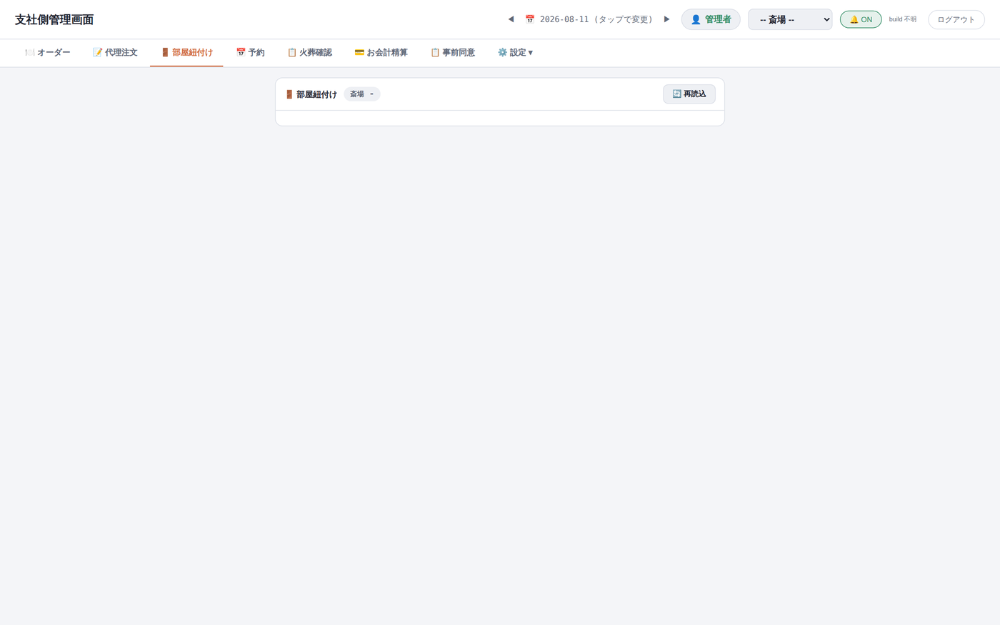

- 一覧は売上場所ごとにグルーピング（例: 「控室 [FD制御]」配下に 月の間1・月の間2）。行には **未紐付け** or **予約ラベル（故人名）＋🏢葬儀社名＋mm:ss カウントダウン**（サーバー時刻基準・1秒毎更新）or **期限切れ**。
- ボタン: `紐付け`（青）／紐付け中は `紐付け`＋`解除`（赤・**確認なしで即時解除**）。`🔄 再読込`。デフォルト時間は**既定30分**（⚙️初期設定の場所・部屋設定で変更可）。

**「紐付け」→ 予約割当モーダル（raAssignOverlay）**: 見出し「予約を紐付け：控室/月の間1」・故人名/申込者名/予約番号の部分一致検索・当日予約候補の行毎に「この予約で紐付け」。すでに紐付け中の場合は「⚠ 現在「◯◯」が紐付け中です。確定すると上書きされます。」:

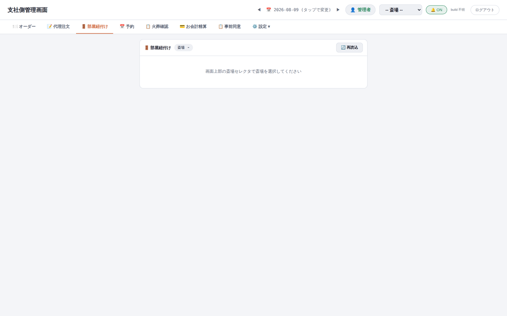

> 該当部屋が無い場合は「この斎場にはフリードリンク制御 ON の部屋がありません」→ 🏛️斎場設定の売上場所行「⚙ 設定」で「ラストオーダーの対象とする」（既定 ON）／「フリードリンク予約に基づく出し分けを有効化」（`freeDrinkRuleEnabled`）を設定し「🚪 部屋管理」で部屋を登録。予約品目に `★` があれば LIFF はフリードリンクメニューを表示（PR #75・spec 20260531-last-order-via-room-assignment）。

### 4.5 📅 予約（panelReservations・superadmin限定）

**この画面の意味:** テコテック新予約システム→NURVE 中間サーバー経由で受信した予約を**参照・突合し、受付を確定する**画面。TOHAKU-1185 で新規予約作成・CSV/Excel 取込・出力・範囲クリア・編集・削除等の UI は撤去され（受信処理と障害復旧用 API `/api/admin/reservations/import` は残置）、**行操作は「📋確定」のみ**（確定済みは「✅確定済」表示）。

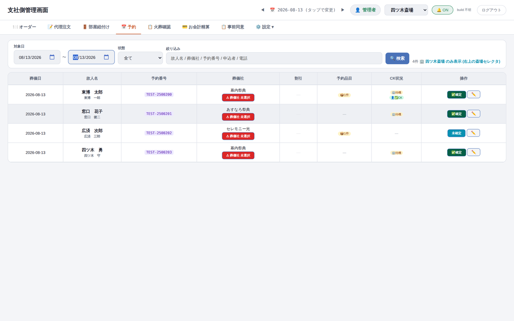

**「📋確定」→ 予約確定モーダル**: 葬儀日・故人名・予約番号・葬儀社を確認し、**区民葬・献体・減額・公費**のチェックと**得意先コード**を確認して確定します。**得意先コード未設定の予約は mado 側で編集せず**、予約連携元と得意先マスタ設定を確認します:

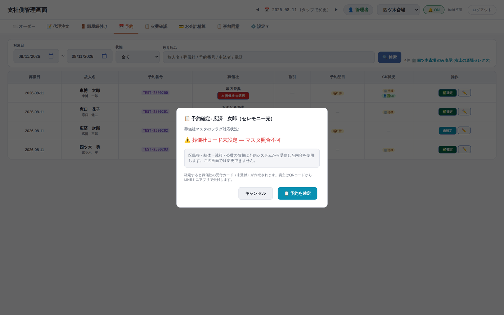

### 4.6 📋 火葬確認（panelCheckins・旧「受付」）

**この画面の意味:** 炉前・受付でいちばん使う画面。本日の火葬予約の**火葬同意の取得状況の確認**と**当日取得・受付**を行います。INT.CONSENT-A10-11 以降は**6列テーブル**（旧カード表示から変更）で、**火葬開始時間の昇順**に表示されます。

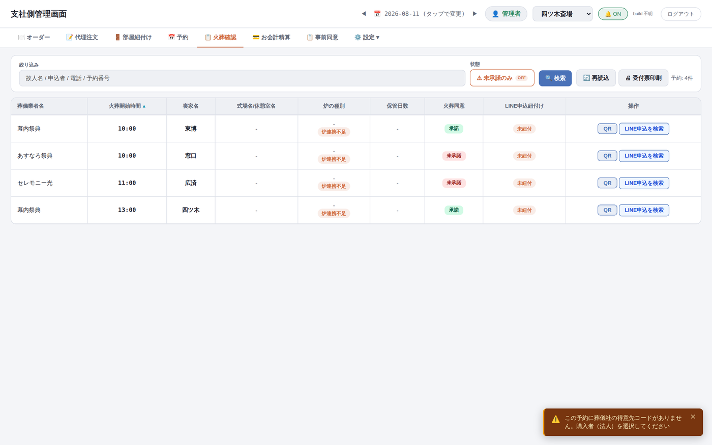

**テーブル列:** 葬儀業者名（幕内祭典・あすなろ祭典・セレモニー光…）／火葬開始時間 ▲（クリックでソート）／喪家名／式場名・休憩室名／炉の種別／保管日数／**火葬同意の取得状況**（緑「承諾」・赤「未承諾」）／操作（`QR`・`LINE申込を検索`）。

**ツールバー**

| ボタン | 動作 |
|---|---|
| 絞り込み入力 | 故人名／申込者／電話／予約番号の部分一致（KAS-008・作間様指摘で追加） |
| ⚠ 未承諾のみ `OFF/ON` | 未承諾行だけに絞るトグル。ON で下図のように絞り込み |
| 🔍 検索・🔄 再読込 | 再取得（`loadReservations({force:true})`） |
| 🖨 受付票印刷 | 表示中の未承諾予約を QR カード形式で一括印刷（1件=1ページ・喪家名に「様」付与・発行元/発行日入り） |
| 予約: 4件（全5件中） | 選択斎場の件数（括弧内=全斎場） → 件数が合わない時は斎場セレクタを確認（リスク B-6） |
| 🗑️ 本日分クリア | **2026-08-04 の UAT 事故対応で UAT 期間中は非表示化**（範囲クリアと同様）。復活時も責任者判断でのみ使用（リスク A-2） |

「⚠ 未承諾のみ」ON の状態:

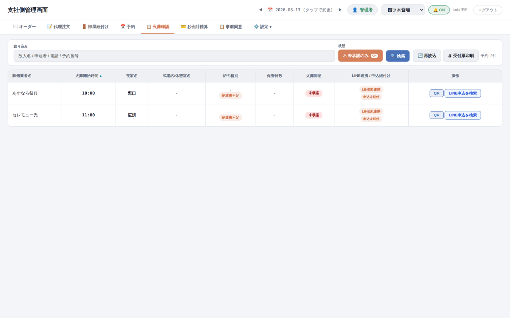

**「QR」→ 受付QRモーダル**（お客様のスマホで読み取り → LIFF で故人情報・火葬時刻の確認 → 火葬承諾 → 申込者情報入力へ）:

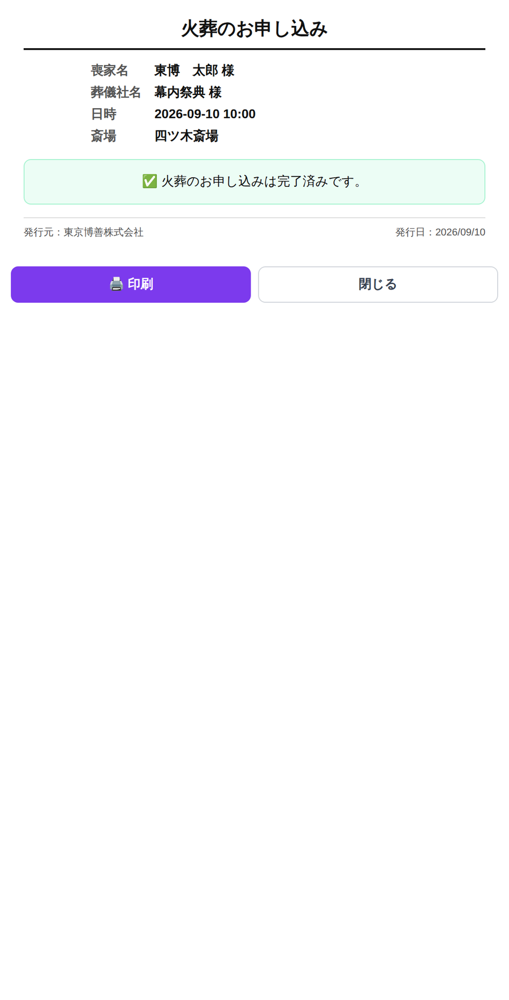

**「LINE申込を検索」**: 受付番号・申込者名（かな）・電話番号で LINE 火葬申込を部分一致検索 → 「編集して紐づけ」→ LINE側入力の修正（予約マスタは変更しない）→「変更して紐づけを完了する」→ 変更・紐づけ・申込者への LINE 通知がすべて ✅ になることを確認（詳細 §4.8）。

### 4.7 💳 お会計精算（panelPayment）

**この画面の意味:** 利用者（支払者）単位の精算を管理する画面。カンバンは **💳 会計待ち／✅ 会計完了 の2列**で、各列の中は**時間帯グループ**（撮影データでは「時間未設定」）にまとまります。画面上部には**🔒 精算ロック管理**があります。

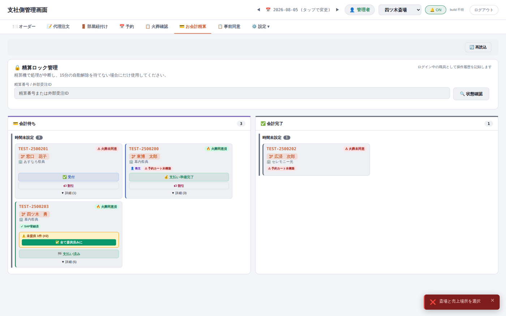

**🔒 精算ロック管理**: 「精算機で処理が中断し、**15分の自動解除**を待てない場合にだけ使用してください。」精算番号または外部受注IDを入力 → 「🔍 状態確認」でロック状態を確認・解除。操作はログイン中の職員名で履歴記録されます（東芝テック自動精算機との二重会計防止。リスク C-3）。

**精算カードの見方**（例: `TEST-2500200` 東博　太郎）

| 要素 | 意味 |
|---|---|
| `TEST-2500200`＋故人名＋🏛葬儀社 | 外部受注ID（予約番号）・喪家・葬儀社（幕内祭典等） |
| 🔥 火葬同意済／⚠ 火葬未同意 | 火葬確認タブと連動した同意状況 |
| 👤 喪主 | 喪主まとめ払いの紐付けあり |
| ⚠ 予約カート未構築 | 予約品目の SAP カートが未構築 |
| ✓ SAP登録済 | SAP 受注登録済み |
| ⚠ 未提供 N件 (#M) → 「✅ 全て提供済みに」 | 未提供の注文が残っている警告と一括提供済み化ボタン |

**カードのボタン（状態により変化）**

| ボタン | 動作 |
|---|---|
| ✅ 受付 | 来場受付（未受付→会計待ちへ） |
| 👛 支払い準備完了 | **SAP へ受注登録（sapCartComplete）**。成功後「▼ 詳細」内に**精算QR発行**が出現 → 価格確認 → QR発行（自動精算機読取） |
| 🗨 割引 | 手動割引設定モーダル（下記） |
| 🏁 支払い済み | 支払確認後に会計完了列へ |
| ▼ 詳細 (N) | 明細展開（注文一覧・領収書分割・カート品目編集へ） |
| ← 精算未受付に戻す | 誤受付の取り消し（支払い前のみ） |

**🗨 割引 → 手動割引設定モーダル**: 「現在: 割引なし」＋割引種別リスト（**区民葬・検体・減額・公費**。得意先=葬儀社マスタの割引フラグと連動し、対応する割引が無い得意先では「割引種別が見つかりません」）＋「🚫 割引なし（解除）」「キャンセル」:

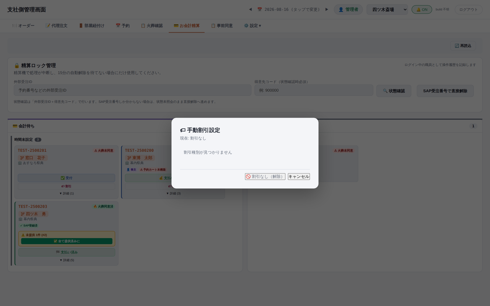

**▼ 詳細 (N)** 展開で注文明細・支払者別金額・領収書分割（receiptGroup A/B/C 割当）・カート品目編集（§4.2）へアクセス:

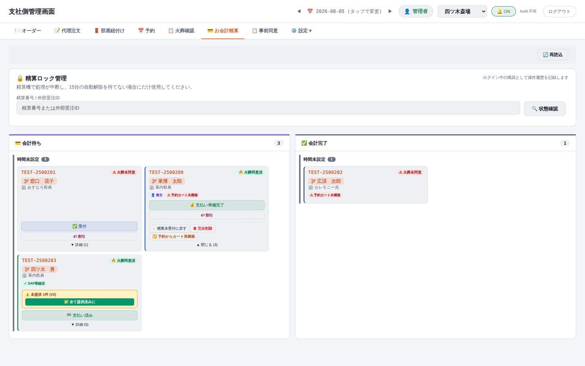

### 4.8 📋 事前同意（panelPreConsents）

**この画面の意味:** LIFF「scrPreInfo」から送信された事前同意（火葬申込）の一覧・予約紐付け画面。火葬申込時に**受付番号 `YYMMDD-0001`** が発番され、LINE 確認メッセージと一覧に表示されます（PR #66）。

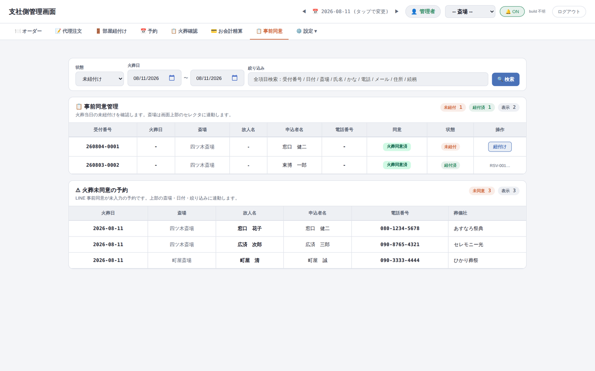

**ツールバー:** 状態（全て／**未紐付け**〈初期選択〉／紐付け済み）・期間（火葬日 `pcDateFrom`〜`pcDateTo`）・絞り込み（受付番号・火葬日・斎場・故人/申込者の氏名・かな・電話・メール・郵便番号・住所・続柄・同意状態の部分一致。**ひらがな/カタカナ同一視**）・🔍 検索。**テーブル列:** 受付番号／火葬日／斎場／故人名／申込者名／電話番号／同意（火葬同意済/未同意バッジ）／状態（未紐付/紐付済）／操作。

カナ検索の例（2026-07 公式キャプチャ）:

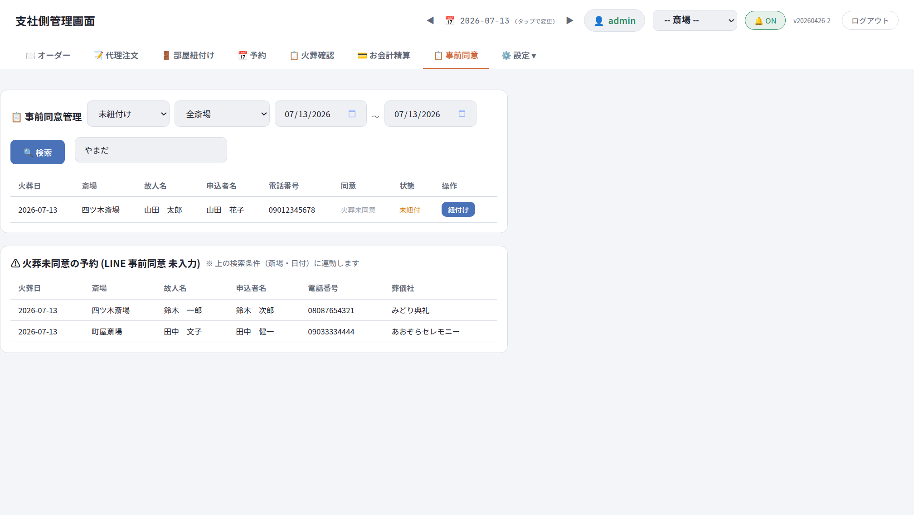

**「紐付け」→ 予約紐付けモーダル（pcLinkOverlay）**: 対象の事前同意情報と火葬日・斎場・喪家名かなを確認 → 「火葬予約を検索」→ 候補一覧。火葬日・斎場・故人名・喪家名かなが一致した行に「**完全一致候補**」表示（**完全一致でも自動確定しない** — 職員が確認して選択）→「LINE申込を編集して紐づける」→ 内容確認・訂正（必須: 申込者姓名・電話・郵便番号・住所・続柄）→「変更して紐づけを完了する」。編集後4項目が予約と不一致ならサーバーが紐づけを停止します:


> 自動紐付けは予約取込時の「火葬日・斎場・故人名・喪家名かな」完全一致（7/31 議事録では「火葬日＋故人名＋葬儀社名＋斎場ID」と整理 → §12 パス1）。「検索対象が上限に達しています」が出たら火葬日か斎場で絞り込み（リスク E-7）。画面下部に「⚠ 火葬未同意の予約（LINE事前同意 未入力）」一覧。

### 4.9 ⚙️ 設定 ▾ ドロップダウン（マスタ系・superadmin限定）

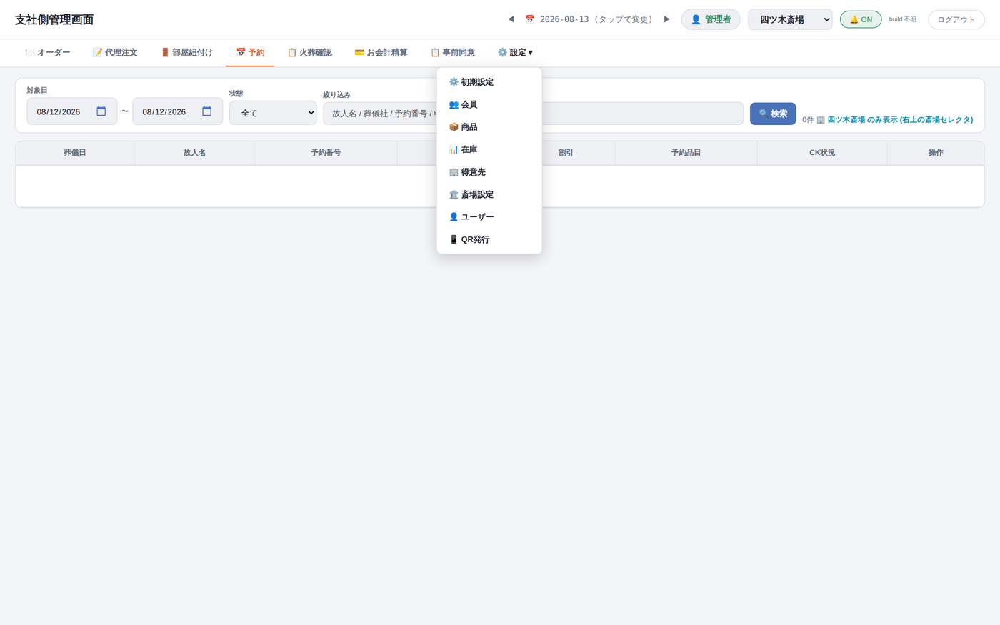

### 4.10 設定配下の各マスタ画面（本日撮影・画面別）

**⚙️ 初期設定（panelSettings）** — リッチメニュー設定（受付⇄アフターケア。`dailyMenuCheck` が葬儀日翌日に自動切替）／Webhook／会員登録API／管理連携API／SAP連携設定（有効/無効）／イベントログ／外部APIキー／場所・部屋設定（部屋紐付けデフォルト時間=30分）／味バリエーション設定:

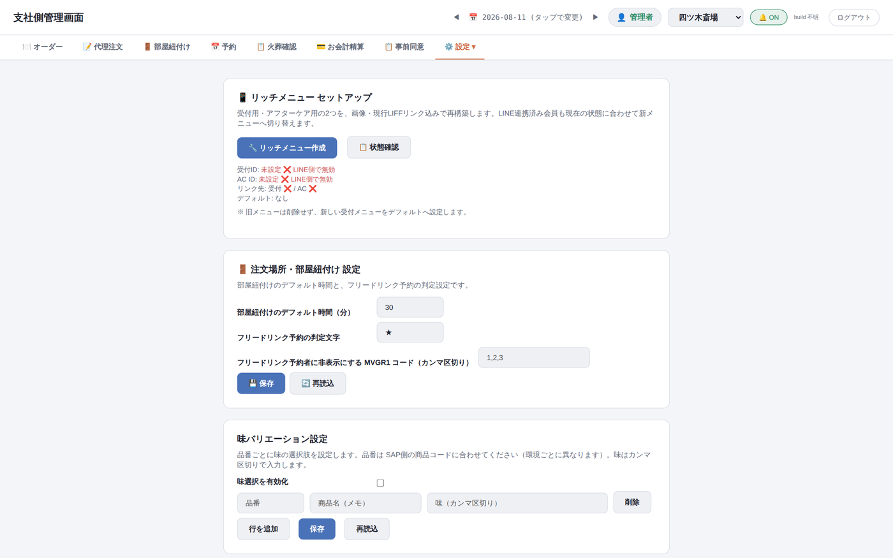

**👥 会員（panelMembers）** — LINE会員マスタ。会員ID・氏名・電話・葬儀日（date入力で設定）・経過日数（当日=赤・〜7日=赤・〜49日=橙・〜100日=青）・メニューフェーズ（受付=緑/AC=青バッジ・「→AC」「→受付」切替）・来店/注文回数・累計金額・削除（会員情報は完全削除・注文/受付履歴は残置・CRMチケットは匿名化）:

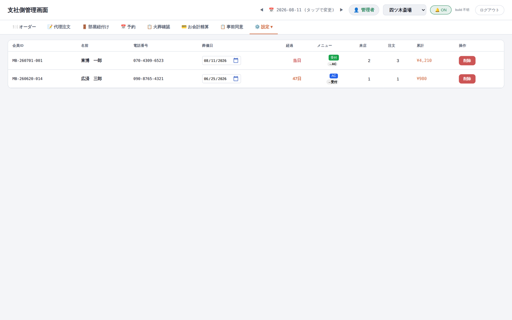

**📦 商品（panelProducts）** — SAP商品カタログの同期・プラント（斎場）別フィルタ・品番/状態管理。分類は 大分類／MVGR1（モバイルカテゴリ）／MVGR2（商品分類。未取込は「（マスタ未取込）」）／MVGR3（中分類）／MVGR4（購入者区分）／MVGR5（小区分）:

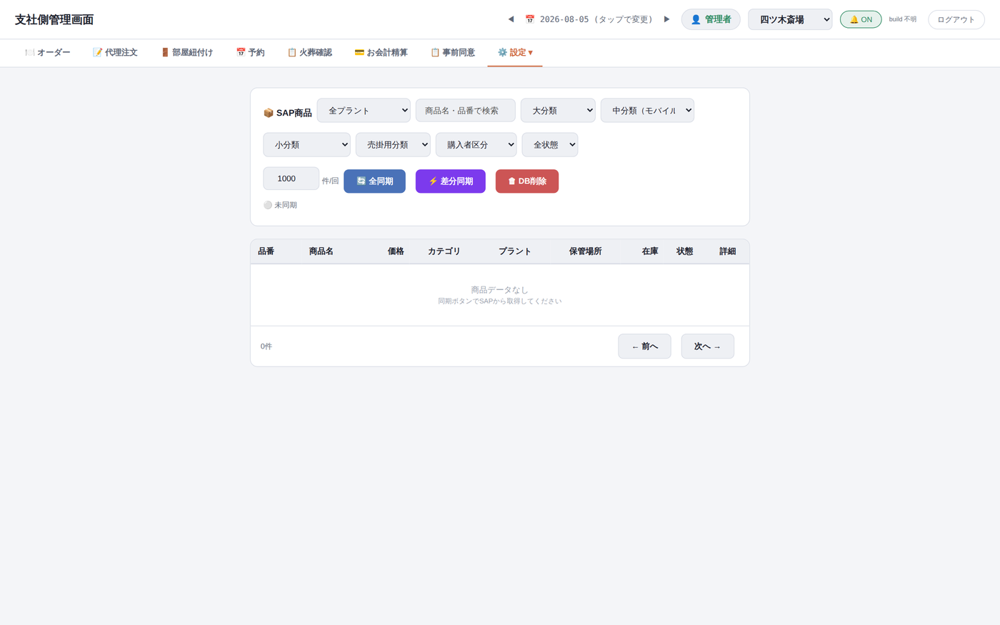

**🏢 得意先（panelCustomers）** — 葬儀社マスタ（幕内祭典・あすなろ祭典・セレモニー光…）。得意先コード（C-0001 等）・**区民葬/検体/減額/公費の割引フラグ**（手動割引モーダルと連動）・「予約なし」代理注文の支払先:

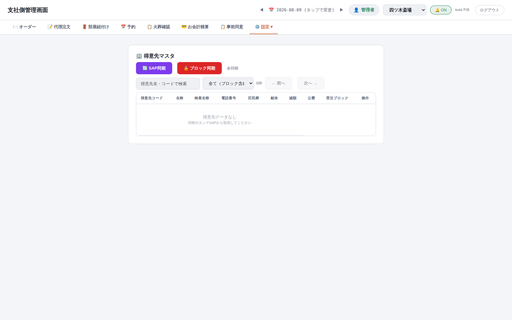

**🏛️ 斎場設定（panelHalls）** — 7斎場マスタ（SAPプラントコード 🏭・施設コード 🔑・ジオフェンス設定）と、斎場ごとの保管場所・売上場所・商品紐付け・「⚙ 設定」（freeDrinkRuleEnabled／ラストオーダー対象）・「🚪 部屋管理」:

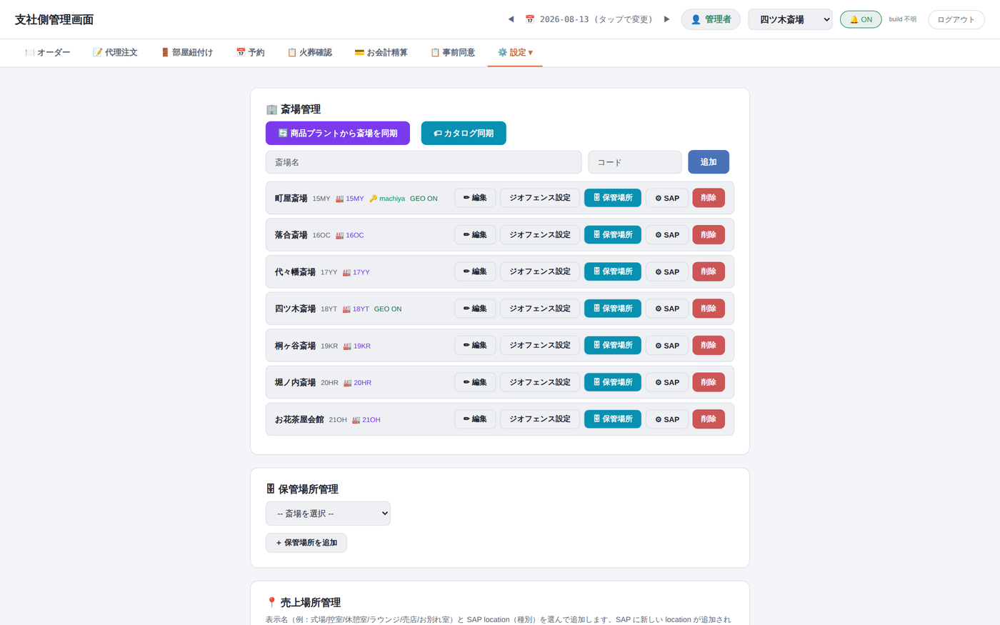

**👤 ユーザー（panelUsers）** — 管理者ユーザー作成（ロール superadmin/staff/cc_sv/cc_staff/label_agent・**許可斎場**〈空=全斎場〉・**デフォルト売上場所**）・ログインキー発行:

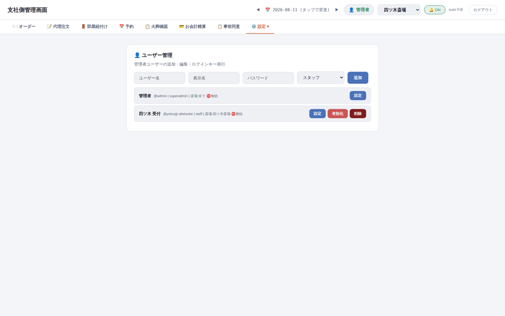

**📱 QR発行（panelQr）** — オーダー用QR（斎場×売上場所×ラベル〈例: 机1〉→「QR生成」→ 印刷して机上・メニュー裏に設置）と事前同意QR（全申込者共通固定・東博様→各葬儀社へ配布・`mode=pre` 起動・PNG保存/印刷）:

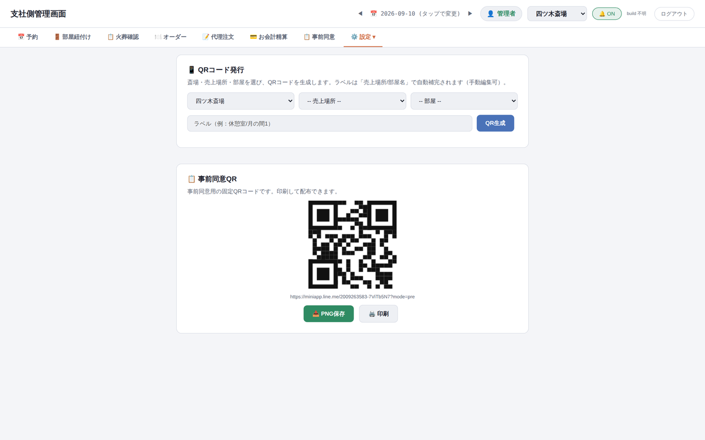

「QR生成」を押した状態:

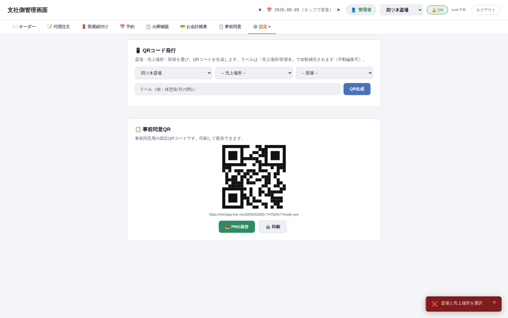

> **精算QRとの違いに注意**: QR発行タブは**部屋QR／共通QR**用。受注ごとの**精算QR**は「💳 お会計精算」の「支払い準備完了 → ▼詳細 → 精算QR発行」から（取り違えると精算機で読めません）。

---

## 5. LINEミニアプリ（お客様向け）

### 5.1 画面一覧と遷移

全15画面。起動 URL パラメータ（`hallId`/`spId`/`roomId`/`rsvId`/`mode`/`page`/`loc`）と会員状態で自動ルーティング。§5.2 の `l-*.png` は `?preview=` モードの**本日新規撮影**（ヘッダーに「👁 プレビュー」表示）。

| # | 画面ID | 画面名 | preview名 | 表示条件 |
|---|---|---|---|---|
| 1 | scrLoad | 読み込み中 | — | 起動直後（LIFF初期化） |
| 2 | scrFriend | LINE友だち追加 | friend | 公式アカウント（OA 2009733008）未追加 |
| 3 | scrNoQr | QR未読取 | — | QRパラメータ無し |
| 4 | scrNoAssign | 部屋未紐付け | — | 部屋割当待ち・期限切れ（§4.4 連動） |
| 5 | scrPickHall | 斎場選択 | — | ジオフェンス複数ヒット |
| 6 | scrRegister | 規約同意（ご利用にあたって） | register | 新規 or 未同意 |
| 7 | scrProfile | 申込者情報入力 | profile | 申込者情報未入力 |
| 8 | scrPreInfo | 事前同意フォーム | pre-info | `page=preconsent`（事前同意QR・`mode=pre`） |
| 9 | scrPreComplete | 事前同意完了 | pre-complete | 事前同意送信完了 |
| 10 | scrCheckin | チェックイン（ホーム） | top / top-day / checkin-pending / checkin-done | 会員確定後の起点 |
| 11 | scrFeeCheck | 料金確認（喪主払い分） | — | 喪主払い品目あり |
| 12 | scrOrder | 注文メニュー | — | チェックイン完了後 |
| 13 | scrConfirm | 注文確定 | — | 注文確定送信後 |
| 14 | scrHistory | 注文履歴 | — | フッターナビ「履歴」 |
| 15 | scrMyCart | 予約カート | — | フッターナビ「予約カート」 |

```
scrLoad ─┬─[QRなし]───────▶ scrNoQr
         ├─[友だち未追加]──▶ scrFriend
         ├─[page=preconsent]▶ scrPreInfo ─▶ scrPreComplete
         └─[QRあり]─┬─[複数斎場]──▶ scrPickHall ─┐
                     ├─[新規/未同意]▶ scrRegister ─▶ scrProfile ─▶ scrCheckin
                     └─[既存会員]──▶ scrCheckin（部屋未割当なら scrNoAssign）
scrCheckin ─▶ (scrFeeCheck) ─▶ scrOrder ─▶ scrConfirm
フッターナビ: 🏠ホーム / 🍽️オーダー / 🧾予約カート / 📜履歴 / 📢公式
```

### 5.2 主要画面の意味とスクリーンショット

| 画面 | スクリーンショット | 意味・確認ポイント |
|---|---|---|
| scrFriend 友だち追加 | 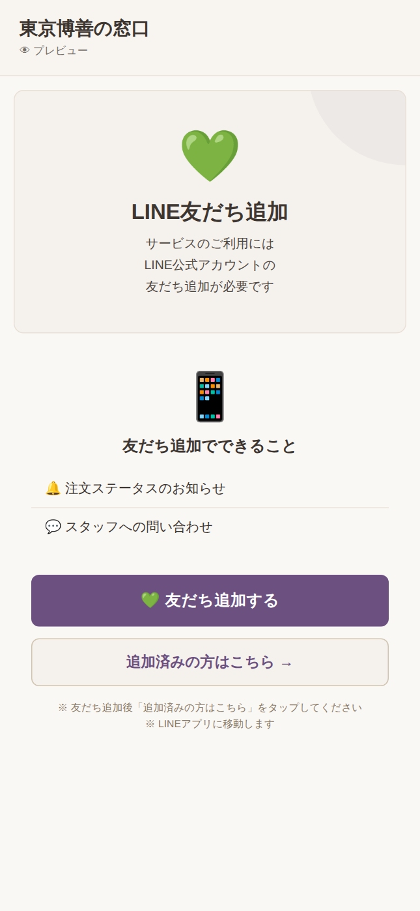 | 公式アカウント未追加時にフロー最初で友だち追加を促す（Phase1確定仕様: 導線の最初に配置） |
| scrRegister 規約同意 | 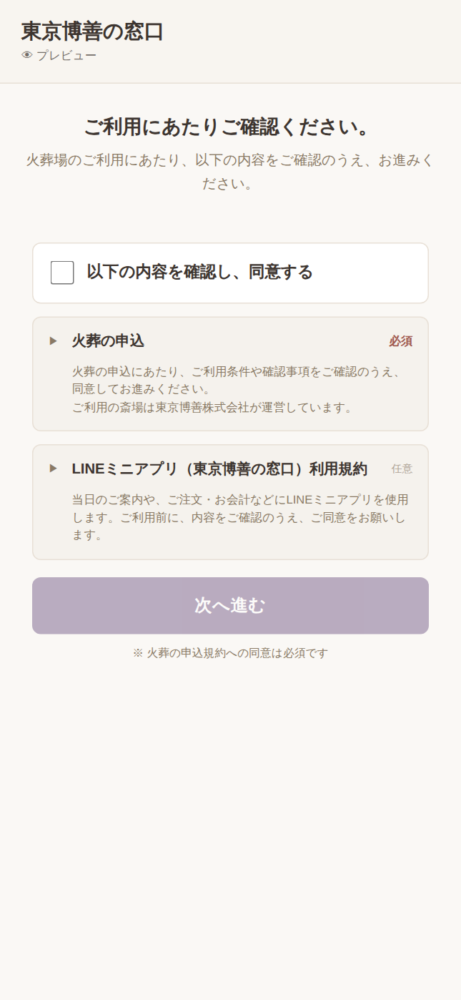 | 「ご利用にあたって」（旧「ようこそ！」から文言変更・🎉削除）。白/紫の東京博善ブランド配色 |
| scrProfile 申込者情報入力 | 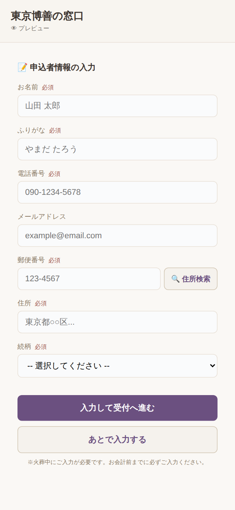 | お名前・ふりがな・電話番号・メール・郵便番号（🔍住所検索）・住所・続柄（必須バッジ付き）。ボタンは「**入力して受付へ進む**」「**あとで入力する**」。注記「※火葬中にご入力が必要です。お会計前までに必ずご入力ください。」 |
| scrPreInfo 事前同意フォーム | 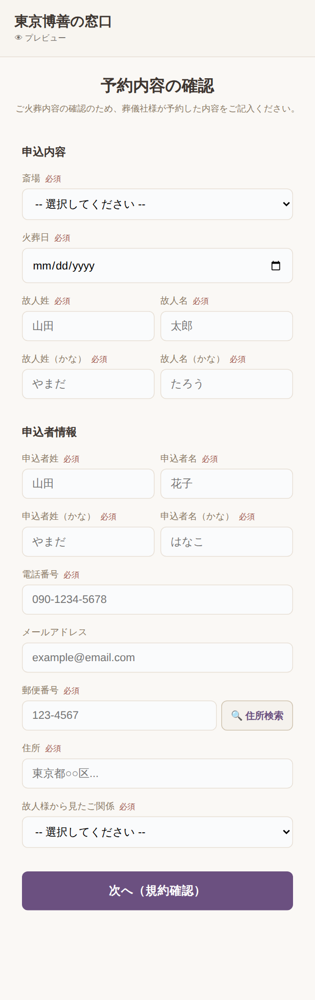 | 事前同意QR（`mode=pre`）から遷移。同意内容確認＋申込者情報入力 → 送信 |
| scrPreComplete 事前同意完了 | 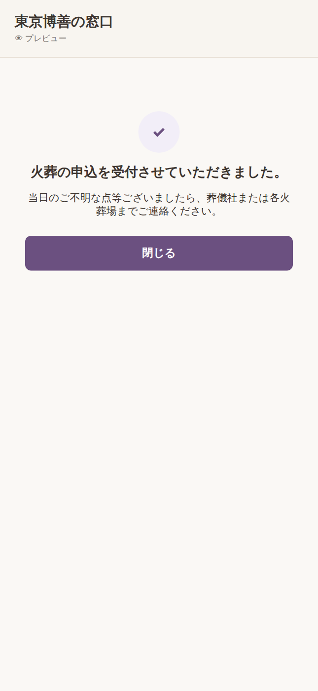 | 送信完了。受付番号 `YYMMDD-0001` が LINE 通知される |
| scrCheckin（前日TOP） | 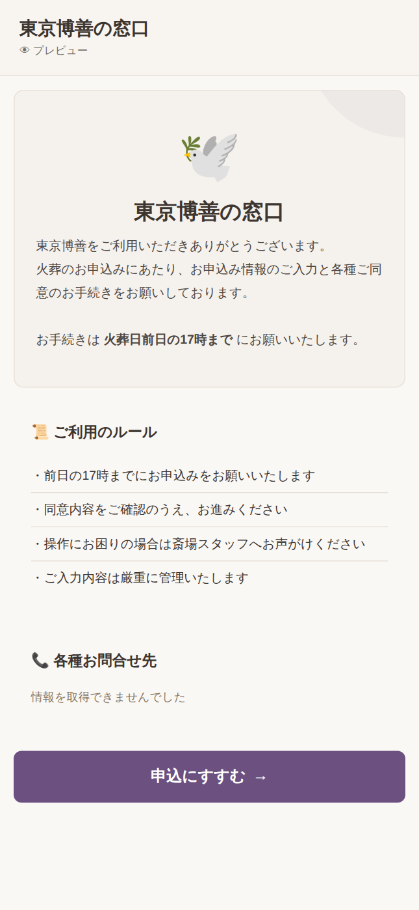 | 火葬日前日までのホーム表示 |
| scrCheckin（当日TOP） | 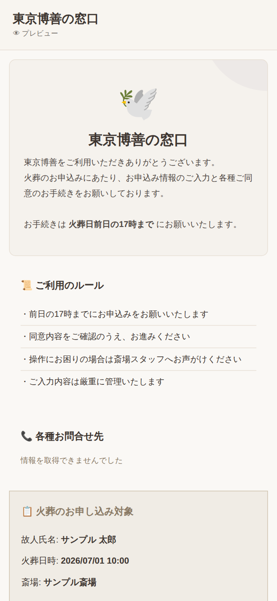 | 火葬当日のホーム表示（当日導線） |
| scrCheckin（受付待ち） | 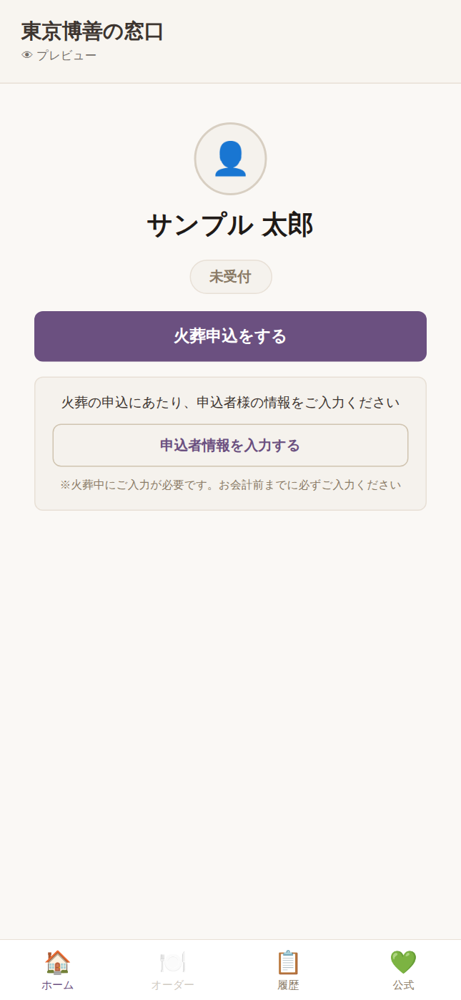 | チェックイン待ち状態 |
| scrCheckin（受付完了） | 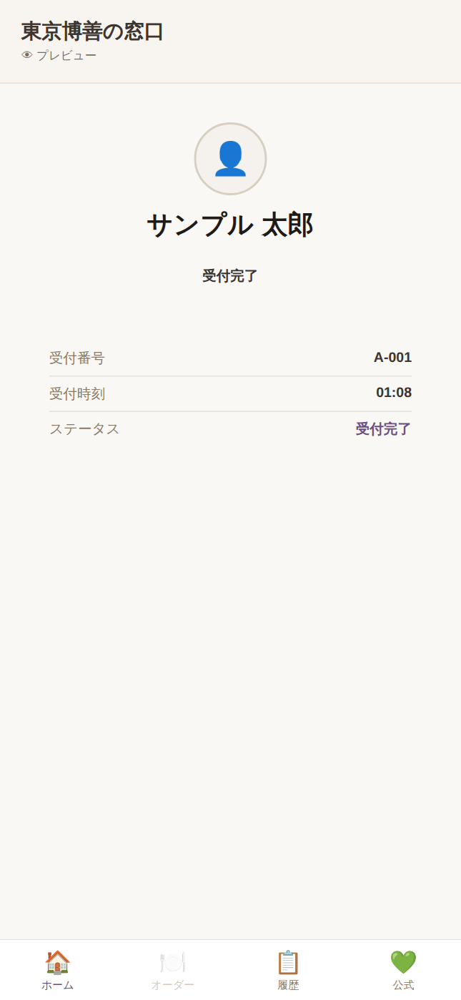 | 受付完了状態・お席の確認 |
| scrPickHall 斎場選択 | 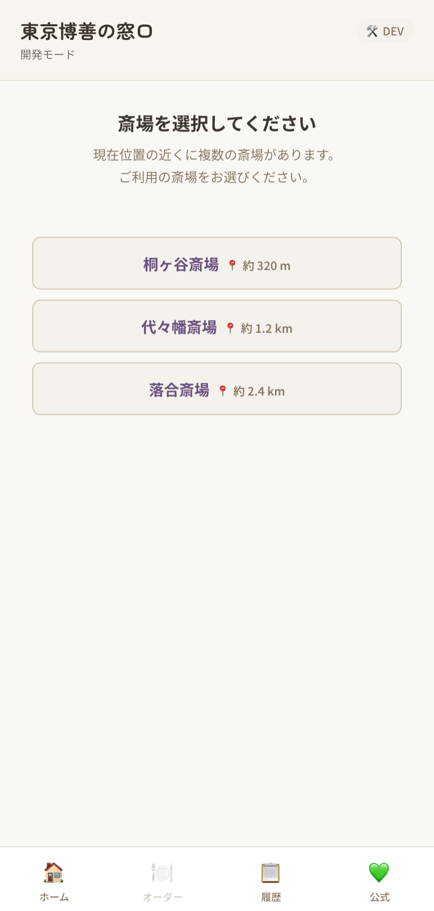 | ジオフェンスで複数斎場ヒット時に町屋〜お花茶屋から選択（2026-07公式キャプチャ） |
| scrFeeCheck 料金確認 | 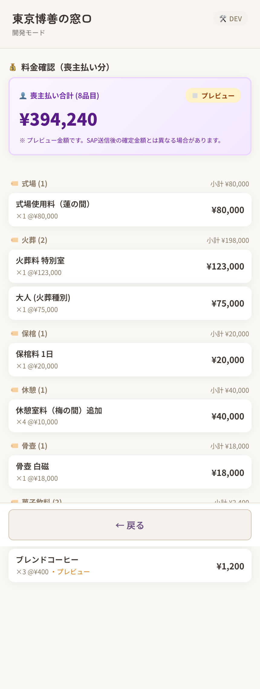 | 喪主払い分（予約品目＋モバイルオーダー）の事前確認。管理画面の振り分けと連動（同上） |
| scrOrder 注文メニュー | 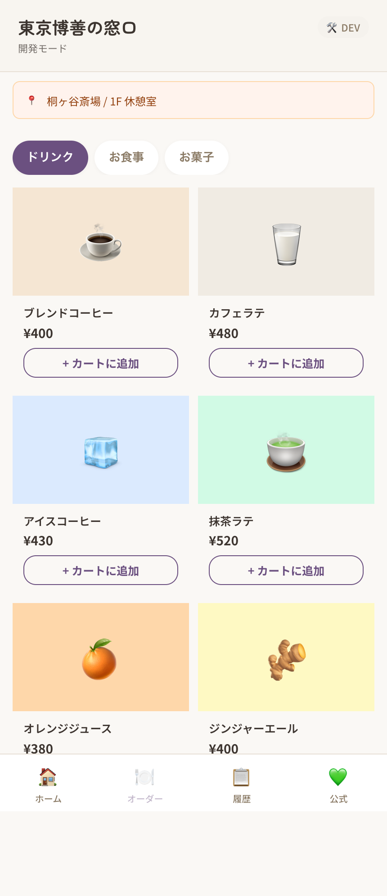 | 売上場所別メニュー→カート→確定。FD対象の休憩室では★品目でフリードリンクメニュー（同上） |
| scrConfirm 注文確定 | 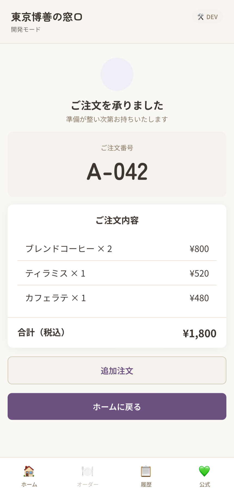 | 注文完了。以後 LINE 通知①注文受付②提供完了③会計完了（同上） |
| scrHistory 注文履歴 | 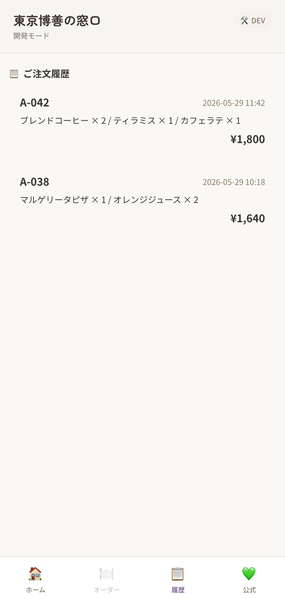 | 過去注文一覧（同上） |
| scrMyCart 予約カート | 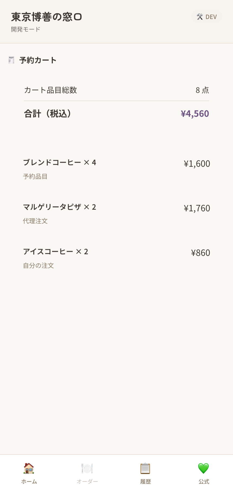 | 予約品目（火葬・式場・骨壺等 reservedItems）の確認（同上） |

---

## 6. シナリオ別 操作フロー

### シナリオA: 売店でその場支払い

| # | 誰 | 操作 |
|---|---|---|
| 1 | お客様 | 売店QR（例: ラベル「売店レジ前」）を読込 → 瓶ビール（中瓶）等を注文確定 |
| 2 | スタッフ | 即時提供品のため「🍽️ 提供済み」を直接押下（LINE提供完了通知） |
| 3 | スタッフ | 提供 → PDAで売上計上 → 「→ お会計準備完了」（SAP受注登録） |
| 4 | スタッフ | 現金受領 → 「💰 お会計済み」（LINE会計完了通知） |

### シナリオB: 控室で喪主まとめ払い

| # | 誰 | 操作 |
|---|---|---|
| 1 | スタッフ | 「🚪 部屋紐付け」で控室・月の間1 に予約（東博太郎）を紐付け |
| 2 | お客様 | 部屋QR（📍月の間1）から複数回注文 |
| 3 | スタッフ | 「調理開始」→「提供済み」→ PDA計上 →「→ お会計準備完了」 |
| 4 | スタッフ | 注文詳細で支払先「喪主」を紐付け（**「お会計済み」は押さない**） |
| 5 | スタッフ | 「💳 お会計精算」で 受付 →（割引）→ 👛支払い準備完了（SAP登録）→ ▼詳細 → 精算QR発行 → 自動精算機で支払い → 🏁支払い済み。お客様は scrFeeCheck で喪主払い分を事前確認可能 |

### シナリオC: 事前同意完了パターン（前日Ver.）

事前同意QRで入力済み（受付番号 `YYMMDD-0001` 発番）→ 自動/手動で予約紐付け → 当日「火葬確認」で「承諾」（緑）を確認 → 追加操作なしで火葬進行。

### シナリオD: 炉前で承諾取得（その場入力・当日Ver.）

「火葬確認」で「未承諾」（赤）行を特定 → 「QR」提示 → お客様が読込 → 故人情報・火葬時刻確認 → 同意 → scrProfile で「入力して受付へ進む」→ 取得状況が「承諾」へ。

### シナリオE: 炉前で承諾のみ・後で入力

scrProfile で「あとで入力する」を選択（※火葬中に入力が必要・お会計前までに必須）→ スタッフが業務時間中に未入力者を確認し声かけ → 本人入力 or 代行入力。

### シナリオF: 割引・キャッシュバックを含む会計（参考: SAP検証ケース）

| ケース | 内容 | 支払パターン |
|---|---|---|
| P0-1 | 予約費用のみ | 葬儀社払い（売掛） |
| P0-2 | 予約＋モバイルオーダー合算 | 喪主＋葬儀社の分割（領収書分割） |
| P0-3 | モバイルオーダー複数明細 | 喪主 |
| P0-4 | 値引（社員割 Z001） | 葬儀社払い |
| P0-5 | キャッシュバック（業者バック） | 葬儀社払い |

---

## 7. 権限（ロール）一覧

| ロール | 表示名 | 主な権限 |
|---|---|---|
| `superadmin` | 管理者 | 全権限＋ユーザー管理＋「📅 予約」＋「⚙️ 設定 ▾」 |
| `staff` | スタッフ | 通常運用（オーダー/代理注文/部屋紐付け/火葬確認/お会計精算/事前同意）。「予約」「設定」非表示 |
| `cc_sv` | CC SV | コールセンターSV（CRM全件＋割振解除） |
| `cc_staff` | CCスタッフ | コールセンター（自分＋未割当） |
| `label_agent` | ラベル担当 | ラベル（サブチケット）業務のみ |

ユーザーごとに「許可斎場（空＝全斎場）」「デフォルト売上場所」を設定可能（§4.10 ユーザー画面）。

---

## 8. トラブルシューティング Q&A

| 症状 | 原因と対応 |
|---|---|
| 一覧に何も表示されない | 上部の**日付（viewDate）**と**斎場セレクタ**を確認。◀/▶で移動 |
| 注文がカンバンに出ない | 「接続中」表示→再読込。日付・斎場・通知OFF確認。お客様側通信エラーなら再送依頼 |
| LIFF に「ただいまこのお部屋ではご注文いただけません」 | 部屋が未紐付け or 期限切れ →「🚪 部屋紐付け」で紐付け（§4.4） |
| 代理注文が Step1 から進めない | 「⚠ 先に斎場・売上場所を選択」ガード → Step0 で斎場と売上場所（例: 四ツ木斎場・控室）を選択 |
| 「未承諾のみ」で件数が減った | 絞り込みトグルON状態。もう一度押して解除 |
| 「予約: 4件（全5件中）」で件数が合わない | 表示件数=選択斎場/括弧内=全斎場の仕様（リスク B-6）。5件目の斎場を確認 |
| カナで検索しても出ない | 事前同意はかな/カナ同一視。それでも出なければふりがな未登録の可能性 |
| 「検索対象が上限に達しています」 | 火葬日または斎場で絞り込んで再検索 |
| 「精算QR発行」が見当たらない | 「👛 支払い準備完了」でSAP登録成功後に「▼ 詳細」内に出現 |
| 精算機で処理が中断した | 15分の自動解除を待つ。急ぐ場合のみ「🔒 精算ロック管理」で精算番号/外部受注IDを入力し状態確認・解除（職員名で履歴記録） |
| SAP「代表品目分類 "XX" の支払割当が見つかりません」 | ハードリロード（Ctrl+Shift+R）→ 再振り分け → 「↻ 失敗分を一括再送」（TOHAKU-942系）。エラー全文は ⚠SAP受注エラー詳細で確認 |
| お連れ様注文で `sapStatus:"error"`・`sapOrderNos` 空 | SAP受注は成立している既知バグ。受注番号の記録を優先（リスク C-2） |
| LINE通知が届かない | 友だち・通知設定を確認。**LINEブロックと受信停止は別物**（リスク C-5） |
| QRが読めない | 汚損→再印刷。**部屋QR（QR発行タブ）と精算QR（お会計精算）の取り違え**も確認 |
| 誤って受付した | 「お会計精算」の該当カード「← 精算未受付に戻す」（支払い前のみ） |
| 在庫タブを開くとエラー | 既知の不具合（リスク E-5）。使用しない |
| 予約の得意先コードが未設定 | mado 側で編集しない。連携元と得意先マスタを確認（§4.5） |

---

## 9. リスク台帳 — 網羅的リスク分析と対策

UAT 指摘（東博UAT 2026-07〜08）・Backlog（TOHAKU-405／410／634／888／910／942／944／953／959／973／1022／1067／1071／1072／1073／1079／1094／1185）・エンジニア改善指示（2026-08-02）・議事録・Slack から抽出した 6 カテゴリ・31 項目。影響度: ◎=重大／○=業務影響／△=限定的。

### A. 業務運用リスク

| ID | リスク | 影響度 | 根拠・経緯 | 現場対処 | 恒久対策・状態 |
|---|---|---|---|---|---|
| A-1 | 喪主まとめ払いの注文で誤って「お会計済み」を押下し、最終精算から漏れる／二重請求 | ◎ | Phase1 マニュアル 2.2.6 | 支払先「喪主」の注文は「お会計準備完了」で止める運用を朝礼で徹底 | 押下時の警告表示（改善要望） |
| A-2 | 「本日分クリア」の誤操作で当日の受付状況が全リセット | ○ | Phase1 マニュアル 2.3.3 → **2026-08-04 UAT事故対応で UAT 期間中は非表示化済み**（§4.6） | 復活後も責任者判断でのみ実施 | superadmin 限定化・二段階確認（改善要望） |
| A-3 | 「受付」誤押下（確認なし即確定）／部屋紐付け「解除」誤押下（確認なし即解除） | ○ | 現場マニュアル 4-7・admin-manual 04 | 受付は「← 精算未受付に戻す」で復旧（支払い前）。解除誤操作は再紐付け | 確認ダイアログ追加を検討 |
| A-4 | 通知音OFF・接続切断による注文見落とし | ○ | Phase1 マニュアル 5.1 | §3 始業時チェックリスト | 接続断の視覚アラート強化（改善要望） |
| A-5 | キャッシュされた旧 admin.html での操作による不具合再発（旧 productGroup 割当で SAP 失敗等） | ◎ | TOHAKU-942（checkinId `Mth0d9A5xvQlYGKsjeZ1`／`ZWNMT3qMNHsjVO2ogfjq`・2026-07-21）・PR #190 | リリース後はハードリロードし build 表示を確認 | キャッシュバスティング強化（改善要望） |
| A-6 | 日付・斎場フィルタ誤設定による「表示されない」誤認 | △ | 現場マニュアル Q&A | Q&A・始業時チェック | — |
| A-7 | LINE 非対応客・障害時の紙運用（火葬承諾書）フォールバック未整備 | ○ | 7/31 開発定例（未確定） | 紙の承諾書を受付に常備 | 例外運用・データ保存期間・出力要否を 8/9 運用引継ぎまでに確定 |
| A-8 | 「予約なし（お連れ様）」注文の運用ルール未確定／部屋紐付け解除忘れ（既定30分で自動失効までエラー表示） | ○ | 現場マニュアル 5-1・admin-manual 04 | 迷うケースは責任者へ。部屋利用終了時の明示解除を徹底 | 運用確定次第マニュアル追記 |

### B. データ品質リスク

| ID | リスク | 影響度 | 根拠・経緯 | 現場対処 | 恒久対策・状態 |
|---|---|---|---|---|---|
| B-1 | 購入者区分（MVGR4）が完全には強制されず、お連れ様に喪家専用（`2`）・代理限定（`3`）・空欄の商品が露出し得る | ◎ | 東博UAT: 四ツ木斎場・控室・予約なし・お連れ様で 3,126 件表示。TOHAKU-405。※現行画面はフィルタ動作あり（「購入者区分により1件を除外」表示を §4.3 で実証） | 代理注文時に購入者区分を意識し疑わしい商品は販売しない | guest={1}/family={1,2}/staff_proxy={1,2,3}/空欄不可を共通モジュール（`functions/proxy-order-policy.js`）化し、`/api/admin/proxy-order`・`/api/admin/guest-order` でサーバー側再検証 → HTTP 422 `PRODUCT_NOT_ELIGIBLE_FOR_PURCHASER`（実装中） |
| B-2 | 価格未設定・0円商品が追加・送信可能 | ◎ | 東博UAT: 1,684 件。TOHAKU-1094 | 0円商品を見つけたら商品部へ連絡 | `null/0/空`→`PRICE_NOT_CONFIGURED` 422、`price=1`=手動価格（2円以上のみ）、負数→`INVALID_PRICE` |
| B-3 | 内部用商品の露出（貴殯演出装置 `0JA0AB08000972A-1` スモークマシン＝斎場設備部門在庫品） | ◎ | TOHAKU-410 | 発見時は注文せず報告 | 名前ブラックリスト禁止。MVGR4 空欄・available=false・plant/storage location 不適合で除外 |
| B-4 | 旧mado商品と SAP 商品の重複カード | ○ | 実装が配列結合 | SAPコード表示のある方を使用 | canonical key=`plant+':'+sapItemCode` で統合。名称のみ統合禁止 |
| B-5 | 商品分類フィルタの意味未確定（MVGR2 未取込「（マスタ未取込）」・MVGR5 空） | △ | TOHAKU-634/1072/1073（KSD 回答待ち） | フィルタ名を独自解釈しない | 回答確定まで読み替え禁止。PR #212 はマージ保留 |
| B-6 | 「予約: 4件（全5件中）」表示を不具合と誤認 | △ | NP-02 | 斎場セレクタと5件目の hallId を確認 | データ確認前のコード変更禁止 |
| B-7 | 事前同意の自動紐付け不一致 | ○ | Phase1 2.7.3・7/31 定例 | 炉前で再取得 or 手動紐付け | 完全一致でも自動確定しない仕様を維持。SMS 導線化で入力品質改善 |
| B-8 | 本番の予約件数不一致（50件 vs 55件） | ○ | 7/8 MO定例 ToDo #5 | 日付・斎場・取込時刻を確認して報告 | 中間サーバー取込と突合し原因特定（調査中） |

### C. 外部連携リスク

| ID | リスク | 影響度 | 根拠・経緯 | 現場対処 | 恒久対策・状態 |
|---|---|---|---|---|---|
| C-1 | SAP 受注失敗の残留（「代表品目分類 "17"/"14" の支払割当が見つかりません（品目: 3579/3709）」） | ◎ | TOHAKU-942・PR #190 で恒久対応済み | ハードリロード→再振り分け→一括再送 | 再発時は checkinId・時刻・SAPレスポンス添付で報告 |
| C-2 | お連れ様注文の `sapStatus:"error"`・`sapOrderNos` 空でも SAP 受注成立 | ○ | 既知バグ（7/27 手順書） | 受注番号の記録優先。再送前に `GET /api/admin/sap-order/{受注番号}/summary` で確認 | ステータス整合修正（バックログ） |
| C-3 | 自動精算機（東芝テック/ユニコ）連携の未確定領域（二重会計・精算失敗時対応） | ◎ | TOHAKU-944/877 | 精算失敗時は二重操作せず、**精算ロック管理は15分自動解除を待てない場合のみ**使用し受付番号・SAP受注番号を控えて責任者へ | ベンダー（ユニコ）確認前提で仕様確定 |
| C-4 | 予約取込（中間サーバー）失敗・遅延で当日予約が出ない | ◎ | 単一依存点。TOHAKU-1185 で現場 CSV 取込 UI は撤去済み | 「予約」タブ件数確認 → システム担当連絡 | 取込失敗アラート整備・9月移行時の再結合テスト |
| C-5 | LINE ブロックと受信停止の混同 | △ | 260703 内部MTG | 友だち状態・ブロック・通知設定を切り分け | `lineReachable` 表示活用 |
| C-6 | 管理API エラー残留（`GET /api/admin/checkin/{id}/summary` 400 連発事例） | △ | 2026-08-04 STG コンソール（checkinId `WlgYanzt8hqDWvqVMS4h`） | 業務に支障なければ続行し再現条件を報告 | データ整合性調査・エラーハンドリング改善 |
| C-7 | 検証用ミニアプリ未設定期間の本番接続 | ○ | 7/10 Slack | STG 確認は `?preview=`。実機はテスト用QR | 検証用 LIFF 分離（QR基点は 2026-08-03 に本番用 LIFF 2009732996 へ切替済み） |
| C-8 | SAP 中間（`saptest-staging.nurve.jp`）障害・認証キー未共有 | △ | 7/22 Slack | NURVE 山本様へ確認 | キー管理・連絡フロー明文化（F-1 連動） |

### D. セキュリティ・権限・個人情報リスク

| ID | リスク | 影響度 | 根拠・経緯 | 現場対処 | 恒久対策・状態 |
|---|---|---|---|---|---|
| D-1 | 認証情報の共有チャネル逸脱（STG パスワードの Slack/Teams 平文共有・APIキーのスクリーンショット保存の実績） | ◎ | 2026-07-08 Slack/Teams・2026-08-04 Drive | 認証情報は DM のみ。スクリーンショットに写さない | 該当パスワード・APIキー（「中間サーバー（検証環境・予約受信用）」等）のローテーション。本書掲載画像は機微部分を排除し検証パス5で機械チェック |
| D-2 | 本番デプロイ承認ゲートの不備（旧: main push で両環境同時デプロイ） | ◎ | 7/21 Slack | 凍結中は main へマージしない | staging/main 分離＋GitHub Environment「production」required reviewers 適用済み |
| D-3 | 個人情報（故人名・喪家名・電話・LINE ID）のログ・エラー露出 | ◎ | 改善指示 §3.3 | 障害報告は checkinId 等の安全な識別子で | ログ・422 レスポンスに safe な識別子のみ |
| D-4 | ロール設定ミス（許可斎場漏れ・label_agent 過剰権限） | ○ | admin-manual | 発行時に「ロール・許可斎場・デフォルト売上場所」3点確認 | 発行チェックリスト・四半期棚卸し |
| D-5 | STG への実顧客データ投入・テストデータリセットによる証跡消失 | ○ | 7/22 Slack | STG は架空データ（東博太郎等）のみ。証跡は都度保存 | リセット前周知ルール |
| D-6 | 録音・文字起こしデータの取扱い（Twilio 30日・Whisper 25MB） | △ | spec v2.0 §9 | 業務目的に限定 | 保持期間・アクセス権の規程化 |

### E. 開発・リリースプロセスリスク

| ID | リスク | 影響度 | 根拠・経緯 | 現場対処 | 恒久対策・状態 |
|---|---|---|---|---|---|
| E-1 | CI が構文チェックのみで `npm test` 未実行 | ◎ | `.github/workflows/ci.yml` と `functions/package.json` の乖離 | — | CI へ `npm run check`＋`npm test` 追加。ポリシー純関数の単体テスト必須化 |
| E-2 | 巨大混在 PR #224（45ファイル・10コミット・DIRTY） | ○ | 改善指示 §12 | — | 一括マージ禁止 → 課題単位 PR へ移植 → superseded close ※精算ロックは反映済みを確認（§12） |
| E-3 | Draft 競合 PR #214（TOHAKU-1071 職員向け商品名表示） | △ | 改善指示 §6 | — | 最新 staging から作り直し |
| E-4 | `functions/index.js`・`admin.html` の単一巨大ファイル | ○ | spec v2.0 | — | ポリシーのモジュール分離から着手 |
| E-5 | 在庫タブ regression（コミット `b6b0478` で JS 5関数削除・`ReferenceError: initInventoryTab is not defined`） | ○ | admin-manual README | 在庫タブを使わない | タブ撤去 or 復旧のチケット化 |
| E-6 | UAT 山場（8/1〜8/17）×お盆（8/10〜8/14）×8/20 判定×9/1 リリースの重複 | ○ | 東博公式スケジュール | — | 休暇確認済み・受入指摘表棚卸（7/30）・判定基準事前合意 |
| E-7 | Firestore JSソート設計の検索上限 | △ | spec v2.0 §9 | 火葬日・斎場で絞る | 大規模化時に再設計 |
| E-8 | 反映済み案件への重複改修（TOHAKU-959 等） | △ | PR #226/#234・b38ef49 | — | 完了報告の状態区別ルール（改善指示 §14） |

### F. 体制・引き継ぎリスク

| ID | リスク | 影響度 | 根拠・経緯 | 現場対処 | 恒久対策・状態 |
|---|---|---|---|---|---|
| F-1 | rubyjobs Mario Yi 氏担当領域（SAP中間・デプロイ・LINE Developers 管理者権限・APIキー）の属人化 | ◎ | 2026-08-02〜03 引き継ぎスレッド・引き継ぎ棚卸しシート | 棚卸しシート参照 | LINE Developers 権限移譲・docs 維持・担当課題（TOHAKU-634/1072・910・888・1022・1079）移管確認 |
| F-2 | Phase 1 の UAT 担当・Go/No-Go 基準・障害エスカレーション未確定のまま 8/7 判定 | ◎ | 7/31 開発定例 | — | 東博様側アクション（大沼様: しきい値リスト・GAコード／榎本様: LINE公式プランアップグレード）と併せ判定基準を文書化 |
| F-3 | マニュアルと画面の乖離（受付→火葬確認改称・テーブル化・お会計精算2列化・予約タブUI撤去・精算ロック追加… 画面は高頻度で進化） | ○ | admin-manual・本書 v3→v4 の差分実績 | 本書 §10 対応表参照 | 画面変更時に admin-manual／本書を同時更新 |

---

## 10. 用語集

| 用語 | 意味 |
|---|---|
| 支社側管理画面 | スタッフ向けWeb画面（admin.html）。旧称「MO管理画面」「受付管理」 |
| LINEミニアプリ | お客様向け注文・同意入力アプリ（LIFF。QR基点 2009732996） |
| 火葬確認 | 本日の火葬予約と同意状況の画面（**旧「受付」タブ**。現行は6列テーブル） |
| 事前同意／火葬承諾 | 火葬日前に LINE から入力する同意／炉前で取得する同意 |
| 受付番号 | LINE火葬申込の `YYMMDD-0001` 形式番号（PR #66） |
| 紐付け | 事前同意⇄予約、部屋⇄予約を結び付けること |
| viewDate | ヘッダーの表示対象日。全タブの表示範囲を決める |
| お会計準備完了 | PDA計上済み・会計待ち状態（SAP受注登録 `sapCartComplete` の契機） |
| 精算QR／部屋QR | 自動精算機用QR（お会計精算から発行）／注文用QR（QR発行タブ） |
| 精算ロック管理 | 精算機処理中断時の状態確認・解除（15分自動解除。お会計精算画面上部） |
| FD制御／ラストオーダー | 部屋紐付けに連動するフリードリンク出し分け（予約品目の`★`）／`expiresAt` による注文締切（既定30分） |
| PDA | 売上計上に使うスタッフ携帯端末（東芝テック） |
| SAP／SAP中間API | 基幹 SAP S/4HANA Cloud／mado と SAP の中間層（sapCartAdd・sapCartComplete） |
| Condition Types | SAP 価格条件（PP00 本体価格・PPR0 手動価格・Z001 社員割引） |
| MVGR1〜5 | SAP 商品分類。1=モバイルカテゴリ（画面「中分類（モバイル）」）、2=商品分類、3=中分類（画面「小分類」）、**4=購入者区分**、5=小区分 |
| 代表品目分類 | SAP 支払割当のキー（PR #190 で旧 productGroup から移行） |
| 区民葬・検体・減額・公費 | 手動割引の種別（得意先マスタの割引フラグと連動） |
| sapStatus | 注文の SAP 連携状態（sent／error／cart_added／partial／sap_disabled／sap_skipped／cart_pending／queued） |
| LIFF／ジオフェンス | LINE Front-end Framework／位置情報による斎場自動判定（scrPickHall） |
| TOHAKU-xxx／KSD | Backlog 課題番号／広済堂（商品マスタの業務判断元） |

**新旧対応表**

| 旧表記・業務フロー表記 | 現行UI |
|---|---|
| 受付タブ | 📋 火葬確認（6列テーブル） |
| 火葬同意（事前）／（炉前） | 事前同意タブ／火葬確認の「承諾/未承諾」 |
| お会計精算の4列（未受付/受付完了/支払いお知らせ済み/支払い済み） | **💳 会計待ち／✅ 会計完了 の2列**＋カード内状態 |
| Pattern A その場払い／Pattern B 喪主まとめ払い | 注文詳細「現金/ワンタイム」／「喪主」→お会計精算で一括 |

---

## 11. 参考資料（出典）

| 資料 | 場所 |
|---|---|
| mado 実ソース `public/admin.html`（899KB・2026-08-04版）・`public/index.html` | GitHub `nurveteam/mado`（Drive ミラー 2026-08-04 13:44 取得） |
| 04_操作マニュアル_Phase1.docx（v1.0） | `docs/uat/` |
| 現場マニュアル-斎場職員向け.md（2026-07-14 改訂）＋imgs | `docs/` |
| mado-system-spec.docx（v2.0・MADO-SPEC-2026-001） | `docs/` |
| admin-manual（README＋タブ別MD 00〜15＋モーダル別MD） | `docs/admin-manual/` |
| sitemap（LIFF 全15画面 README＋画面別MD） | `docs/sitemap/` |
| 東博_mado管理側_エンジニア改善指示_20260802.md（基準 SHA `5a962c8`） | Google Drive |
| Mario様_引き継ぎ棚卸しシート_東博窓口システム_20260803 | Google Drive |
| プロジェクト議事録（7/21・7/22・7/24・7/28・7/31） | Notion「【Tokyo-Hakuzen東京博善】窓口システム開発」 |
| STG SAP確認手順・デプロイ運用・操作手順書（2026-07 Slack） | Slack `#prj-東博の窓口システム開発` |
| スクリーンショット | 41枚=本日ローカル起動撮影（§冒頭の撮影方法参照）／1枚=STGライブ（2026-08-04）／7枚=2026-07 公式キャプチャ（ライトテーマ） |

---

## 12. 検証記録（5回のレビューパス＋追補）

| 回 | 観点 | 主な発見と修正 |
|---|---|---|
| 第1回 | 事実整合性 | API数の記載揺れ（110→177）併記／SAP中間URLの環境区別／事前同意の自動紐付け条件の資料間相違（現場マニュアル vs 7/31議事録）を注記し B-7 登録 |
| 第2回 | リスク網羅性 | 6カテゴリで棚卸しし C-5・C-7・D-3・D-6・E-6・E-8・F-2 を追加（計31項目） |
| 第3回 | 固有名詞の正確性 | 斎場7・TOHAKU 18件・PR 8件・商品コード・LIFF/OA・コミットSHA を原典と突合。「受付」旧称を「火葬確認」へ統一 |
| 第4回 | 対策の実行可能性 | 全リスクを現場対処／恒久対策に分離。KSD回答待ち等は「勝手に確定しない」を明記 |
| 第5回 | 文書整合性（機械チェック） | 画像実在・認証情報値の非掲載・タブ名表記・リスクID相互参照・章番号を検証 |

**v3.0 追補検証:** 予約タブ（TOHAKU-1185 で UI 撤去）・代理注文（ウィザード化）・お会計精算・部屋紐付けの仕様を admin-manual と突合して更新。

**v4.0 追補検証（2026-08-04・実ソース起動による実機確認）:** 2026-08-04 版 `admin.html` をローカル起動し全タブを操作して、文書と実画面の差分を検出・修正した。
① **お会計精算は「💳 会計待ち／✅ 会計完了」の2列**が現行（v3.0 記載の4列〈未受付/受付完了/支払いお知らせ済み/支払い済み〉は旧仕様）。**精算ロック管理**（精算番号/外部受注ID・状態確認・15分自動解除）が画面上部に実装済み — PR #224 に含まれていた精算ロックは STG 反映済みと確認し E-2 を更新。
② **火葬確認は6列テーブル**（葬儀業者名/火葬開始時間/喪家名/式場名・休憩室名/炉の種別/保管日数/火葬同意の取得状況/操作）へ変更（INT.CONSENT-A10-11）。**「本日分クリア」は 2026-08-04 の UAT 事故対応で UAT 期間中非表示** — リスク A-2 の影響度を◎→○へ更新。
③ **代理注文の実フィルタ名**（大分類/中分類（モバイル）/小分類/売掛用分類/購入者区分/商品名・品番/ラベル/注文者名）と**購入者区分フィルタの動作**（「購入者区分により1件を除外」表示）を実画面で確認し §4.3 を実装準拠に修正。
④ オーダーカンバンは「お会計済み」列を廃止し4列＋件数表示（MO定例 #165）であることを確認。SAP チップの分類（DIAG-048/DIAG-053: queued は失敗扱い）を §4.2 に反映。
⑤ スクリーンショット 49 枚のうち 41 枚を撮り直し、旧ダークテーマ画像（modal-*.png ほか）と旧UI画像（カード型受付画面等）を全廃棄。

**既知の限界:** 本書は 2026-08-04 時点の実ソース・ドキュメント・議事録に基づく。撮影に使用したデータは架空のテストデータであり、STG 実データとは件数・内容が異なる。`mado-staging.web.app` そのもののライブ全画面キャプチャは本作業環境のネットワーク制約により実施していない（オーダータブのみ 2026-08-04 のライブ画面を掲載）。
