# 東京博善「窓口（mado）」システム手順書 v6.3

| 項目 | 内容 |
|---|---|
| 文書名 | 東京博善 窓口システム（mado）操作手順書 |
| 対象 | 支社側管理画面（スタッフ向け）／LINEミニアプリ「東京博善の窓口」（お客様向け） |
| 対象読者 | 斎場スタッフ（町屋・落合・代々幡・四ツ木・桐ヶ谷・堀ノ内・お花茶屋会館）・本社運用担当・新規参画メンバー |
| 検証環境（STG） | `https://mado-staging.web.app/admin.html` |
| 本番環境 | `https://madoguchi-ec1d5.web.app/admin.html` |
| 版数 | v6.3（2026-08-05）— LINEミニアプリの章（§4）を、お客様目線の導線形式（画面の行き来・各ボタンの行き先つき）で全面改訂 |

> **ログイン情報は本書に記載しません。** アカウントは管理者から個別（DM）に共有されます。
>
> **📸 掲載画像の氏名・電話番号・受注番号・金額は、すべてテスト用の架空データです**（例: 東博 太郎さま・幕内祭典・受注番号 TEST-2500200）。実際の運用では、それぞれのご予約の内容が表示されます。

---

## 目次

1. [システム全体のつながり](#1-システム全体のつながり)
2. [業務の全体像 — 前日の準備／当日の運用](#2-業務の全体像--前日の準備当日の運用)
3. [管理画面の操作手順（画面別・ボタン別）](#3-管理画面の操作手順画面別ボタン別)
4. [LINEミニアプリの操作手順（お客様向け画面）](#4-lineミニアプリの操作手順お客様向け画面)
5. [シナリオ別 操作フロー](#5-シナリオ別-操作フロー)
6. [権限（アカウント種別）一覧](#6-権限アカウント種別一覧)
7. [困ったときは（Q&A）](#7-困ったときはqa)

---

## 1. システム全体のつながり

「東京博善の窓口（mado）」は、**東京博善株式会社**の7斎場（**町屋斎場・落合斎場・代々幡斎場・四ツ木斎場・桐ヶ谷斎場・堀ノ内斎場・お花茶屋会館**）で、葬儀当日の**受付・火葬同意・飲食などの注文・会計精算**をデジタル化するシステムです。

**つながっているシステム**

| 相手 | 何をやり取りするか |
|---|---|
| 新予約システム（テコテック製・9月稼働。旧 Fellow／タイコウ） | 毎朝、当日の火葬予約データを受け取る（中間サーバー経由） |
| LINE | お客様のミニアプリ・友だち追加・注文/提供/会計の通知・リッチメニュー |
| SAP（基幹システム・広済堂 情報システム部管理） | 商品カタログを受け取り、注文を「受注」として登録。割引（社員割・区民葬など）や仕訳も自動処理 |
| 自動精算機（東芝テック／ユニコ） | 管理画面で発行する「精算QR」を読み取り、お客様が支払い |
| PDA（スタッフ携帯端末） | 売上計上に使用 |
| アフターケアCRM（Bluememe 連携） | 葬儀翌日以降、LINEメニューがアフターケア用に自動で切り替わり、法要・相続などのご案内につながる |

**運用の要点**

- 予約・注文・受付の画面は**リアルタイム更新**です（新しい注文が入ると通知音が鳴ります）。
- 注文が「お会計準備完了」になった時点で **SAP に受注登録**されます。登録には**最大45秒**かかることがあります（**その間に再送信しないでください** — 二重請求の原因になります）。
- 検証環境（STG）は**テスト専用**です。実際のお客様のデータは入れません。テストデータは予告なくリセットされることがあるため、確認結果は都度スクリーンショット等で保存してください。

---

## 2. 業務の全体像 — 前日の準備／当日の運用

### 2.1 前日の準備（火葬日前日までのフロー）

担当: 葬儀社（QR配布）→ 申込者（喪家）→ 本社・斎場管理者

```
【葬儀社】商談時に「事前同意QR」（全申込者共通）を申込者へ配布
   ↓            ※新予約システム移行後は SMS でリンクを直接送る方式に変更予定
【申込者】LINEで読み取り → TOP画面（「お手続きは火葬日前日の17時まで」）→「申込にすすむ」
          → 友だち追加 → 同意内容の確認・申込者情報の入力 → 送信
          → 完了画面「火葬の申込を受付させていただきました。」が表示され、「閉じる」でトーク画面に戻る（受付番号 260804-0001 形式は管理画面「📝 事前同意」側に発番。お客様の画面には表示されません）
   ↓
【システム】翌日の予約取込時に「火葬日・斎場・故人名・喪家名（かな）」の完全一致で
            事前同意と予約を自動で紐付け
   ↓
【管理者】「📅 予約」タブで翌日分を確認し「📋確定」（区民葬・献体・減額・公費と得意先を確認）
【スタッフ】「📋 事前同意」タブで未紐付けを確認 → 一致しなかった分は手動で紐付け（§3.8）
【スタッフ】「📋 火葬確認」の日付を翌日に切り替え「⚠ 未承諾のみ」で未同意者を抽出 →
            必要に応じて事前連絡・受付票の印刷
```

### 2.2 当日の運用（火葬当日のフロー）

担当: 斎場スタッフ（受付・炉前・売店・配膳）

```
① 始業前チェック … 通知音ON／日付=本日／斎場=自斎場／画面を最新に更新（Ctrl+Shift+R）
 ↓
② 火葬同意の確認 …「📋 火葬確認」で本日の予約一覧（火葬開始時間順）を確認
   「承諾」（緑）→ そのまま火葬進行 ／「未承諾」（赤）→ ③へ
 ↓
③ 炉前で当日取得 … 該当行の「QR」→ 受付QRをお客様に提示 → お客様が読み取り →
   TOP画面で故人氏名・火葬日時・斎場を確認 →「同意にすすむ」→ 火葬同意・利用規約に同意
   → 申込者情報を「入力して受付へ進む」または「あとで入力する」
   （※あとで入力の場合も火葬中に入力が必要。お会計前までに必須）
 ↓
④ 部屋の紐付け …「🚪 部屋紐付け」で控室・休憩室の部屋に予約を紐付け
   （紐付けするとその部屋のQRから注文できるようになり、フリードリンクの出し分けも有効化）
 ↓
⑤ 注文対応 … お客様のスマホ注文／スタッフの「📝 代理注文」。「🍽️ オーダー」で
   未処理 →（調理開始）→ 調理中 →（提供済み）→ 提供済み →（PDA計上 → お会計準備完了）
 ↓
⑥ 精算 …「💳 お会計精算」で 受付 →（割引）→ 支払い準備完了 → 精算QR発行 →
   自動精算機でお支払い → 支払い済み（喪主まとめ払いはここで一括精算）
 ↓
⑦ 利用終了 … 部屋の紐付けを「解除」。LINEメニューは葬儀日の翌日に自動で
   アフターケア用へ切り替わる
```

> **「受付」と「注文」は別の操作です。** 受付＝「火葬確認」タブで来場を受け付ける操作。注文＝「代理注文」タブでスタッフが商品を注文する操作。

---

## 3. 管理画面の操作手順（画面別・ボタン別）

### 3.0 ログイン

**できること:** スタッフ用アカウントでのログイン。パスワード方式と「ログインキー」方式（`XXXX-XXXX-XXXX` 形式の印刷カード）の2通り。


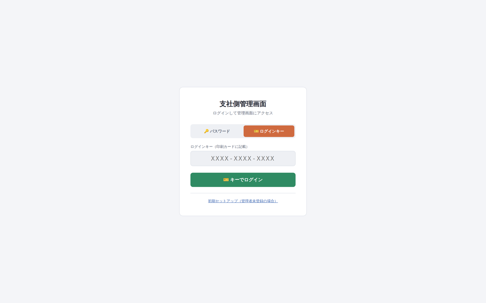

| # | 操作 |
|---|---|
| 1 | 管理画面URLを開く |
| 2 | 「🔑 パスワード」タブでユーザー名・パスワードを入力（またはログインキータブでカードのキーを入力。ハイフンは省略可） |
| 3 | 「ログイン」を押す → オーダー画面が開く |

### 3.1 画面共通の見かた

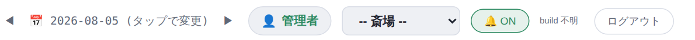

| 表示 | 意味 |
|---|---|
| ◀ 2026-08-05（タップで変更）▶ | **表示対象日**。◀=前日/▶=翌日。**一覧が空のときはまずここを確認** |
| 👤 管理者 | ログイン中の利用者名 |
| 四ツ木斎場 ▼ | **操作対象の斎場**。切り替えると全タブが連動 |
| 🔔 ON | 新規注文の通知音の ON/OFF |
| STG / 951d4df / build … | 画面の版数表示。障害時に「最新の画面か」を確認するのに使用 |
| ログアウト | ログアウト |

**画面切り替えタブ（それぞれをクリックして移動）**

| タブ | 用途 |
|---|---|
|  | 注文の進行管理（§3.2） |
| 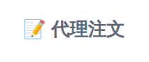 | スタッフによる代理注文（§3.3） |
| 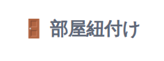 | 部屋と予約の紐付け（§3.4） |
| 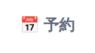 | 予約の確認・確定（管理者のみ表示）（§3.5） |
| 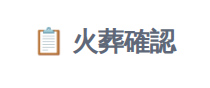 | 火葬同意の確認・来場受付（§3.6） |
| 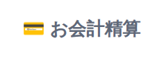 | 会計・精算（§3.7） |
| 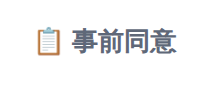 | 事前同意の一覧・紐付け（§3.8） |
| 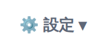 | 各種マスタ・設定（管理者のみ表示）（§3.9） |

### 3.2 🍽️ オーダー（注文の進行管理）

**できること:** お客様のスマホ注文とスタッフの代理注文が、**未処理 → 調理中 → 提供済み → お会計準備完了** の4つの列でリアルタイムに管理できます（新しい注文が入ると通知音が鳴ります）。「お会計済み」の件数は右上に表示され、会計そのものは「💳 お会計精算」タブで行います。


検証環境のライブ画面（2026-08-04）:


**列の見かた**

| 列 | 意味 |
|---|---|
| 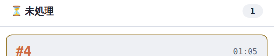 | 注文が入った直後。スタッフがまだ対応していない状態 |
| 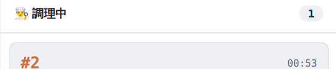 | 「調理開始」を押した状態 |
| 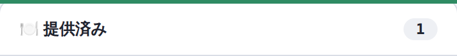 | お客様に商品を渡した状態（PDA計上前） |
| 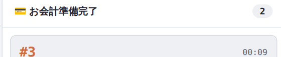 | PDA計上済み・会計待ち。**この列に移った時点で SAP に受注登録される** |

**注文カードの見かた**（例: #3 東博太郎様の注文）

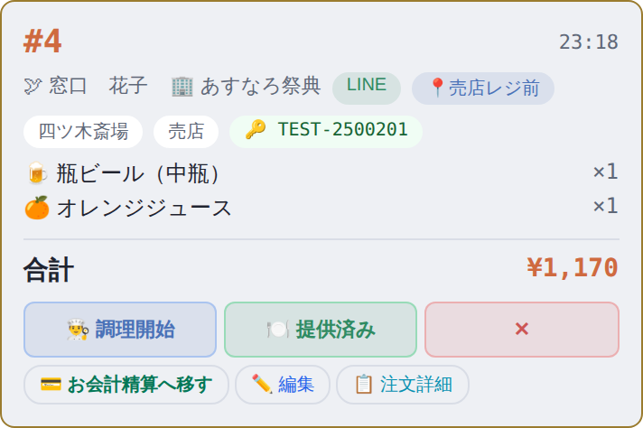

カードには 注文番号（#3）・注文時刻・🕊故人名・🏢葬儀社名（幕内祭典）・注文経路（LINE／代理）・📍場所ラベル（月の間1 など）・斎場と売り場（四ツ木斎場・控室）・SAP登録状況・🔑受注番号（TEST-2500200）・商品明細・合計金額 が表示されます。

**カードのボタン**

| ボタン | 説明 |
|---|---|
| 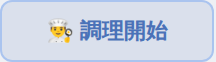 | **調理開始** — カードを「調理中」列へ移す。調理が必要な商品（天ぷらそば等）で使用 |
| 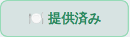 | **提供済み** — カードを「提供済み」列へ移し、お客様のLINEに「提供完了」通知を送る。瓶ビール等のすぐ渡せる商品は調理開始を飛ばして直接押す |
| 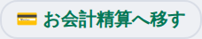 | **お会計準備完了** — PDAで売上計上した後に押す。SAPへの受注登録が行われる |
|  | **お会計済み** — その場でお支払いいただいた場合に押す（LINEに「会計完了」通知）。**喪主まとめ払いのときは押さない**（§3.7で一括精算） |
| 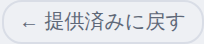 | **1つ前の列へ戻す** — 押し間違えたときに使用（未処理に戻す/調理中に戻す も同様） |
|  | **編集** — 注文内の商品を個別に削除・追加（一部キャンセル）。下のモーダルが開く |
| 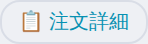 | **注文詳細** — 受注番号単位の明細・支払先の振り分け（喪主/現金/売掛/ワンタイム）・SAP登録状況の確認 |
| 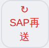 | **SAP再送** — SAP登録に失敗した注文をこのカードだけ再送 |
| 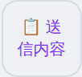 | **送信内容** — SAPに送った内容の確認画面を開く |

**画面上部「📤 SAP受注」の帯**（お会計準備完了列の集計。0件のものは表示されません）

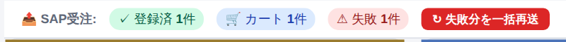

| 表示 | 意味 |
|---|---|
| ✓ 登録済（緑） | SAPへの受注登録が完了 |
| 🛒 カート（青） | SAP側のカートに蓄積済み（会計待ち） |
| ⏳ 送信中（黄） | 送信の応答待ち |
| ⚠ 失敗（赤） | 登録に失敗。下の「一括再送」で再送 |
| ⏭ 対象外（灰） | SAP登録の対象外・保留 |
|  | **失敗分を一括再送** — 失敗した注文をまとめて再送（失敗があるときだけ表示） |

SAP登録に失敗した注文のカードには「⚠SAP失敗」の赤いバッジが付きます（バッジにカーソルを合わせると失敗理由の全文が表示されます。例:「代表品目分類 "17" の支払割当が見つかりません（品目: 3579）」）:

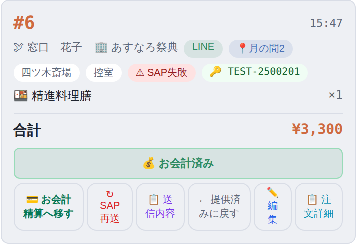

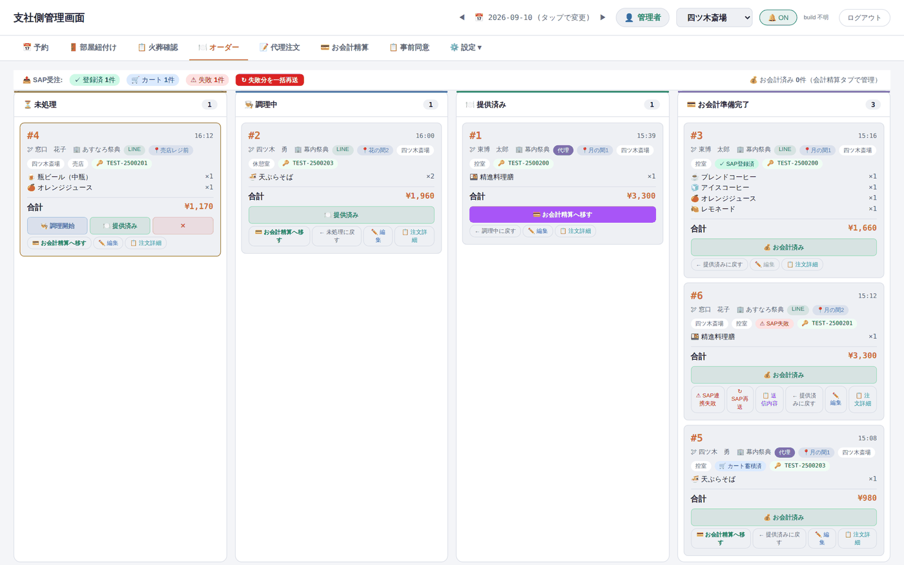

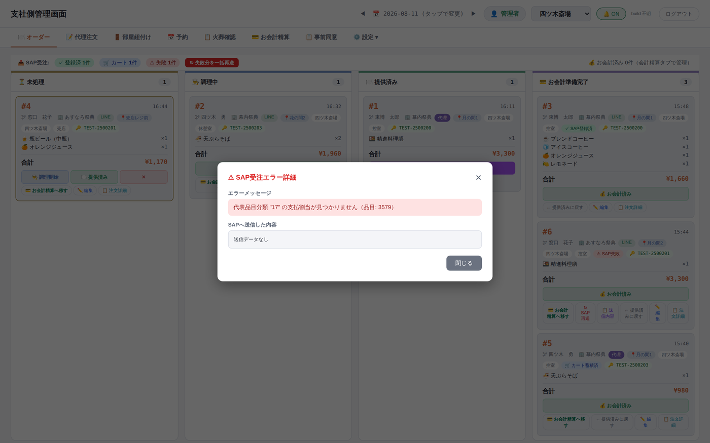

**✏️ 編集（一部キャンセル）の手順**


| # | 操作 |
|---|---|
| 1 | カードの「✏ 編集」を押す →「注文を編集」画面が開く |
| 2 | 取り消したい商品の行の「✕」を押す → 合計金額が自動で再計算される |
| 3 | 間違えて消したら「＋ 商品を追加」で商品名・品番から再追加 |
| 4 | 「保存」で確定（注文自体は残るので受付や会計には影響しない） |

**📋 注文詳細**（支払先の振り分け）


| 支払先ボタン | 使いどころ |
|---|---|
| 喪主 | 喪主まとめ払い。最終精算は「💳 お会計精算」で一括 |
| 現金 | その場での現金支払い |
| 売掛 | 葬儀社への請求（後日精算） |
| ワンタイム | 単発精算（イレギュラー時） |

> **LINE通知は3種類だけ**: ①注文受付 ②提供完了 ③会計完了。「調理中」の通知はありません。

### 3.3 📝 代理注文（スタッフによる代行注文）

**できること:** スマホをお持ちでないお客様や口頭注文・葬儀社の一括手配を、スタッフが代わりに入力できます。**手順0（斎場・売り場を選ぶ）→ 手順1（予約を選ぶ）→ 手順3（商品を選ぶ）→ 送信**の順に進みます。

斎場・売り場が未選択の間は先に進めません（案内が表示されます）:


「⚙️ 斎場・売上場所設定」を開いて選択します:

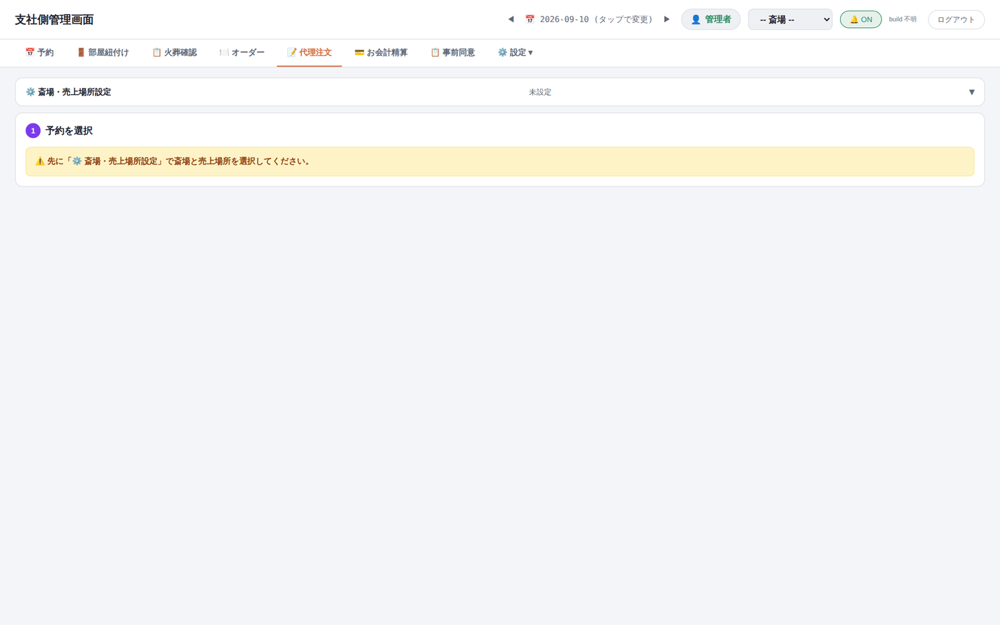

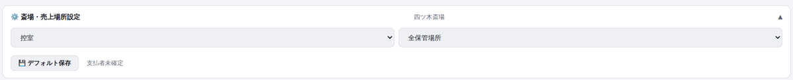

| ボタン | 説明 |
|---|---|
| 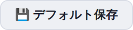 | **デフォルト保存** — 今の斎場・売り場の選択を自分の既定値として保存（次回から自動設定） |

四ツ木斎場・控室を選ぶと「予約を選択」が使えるようになります:


**手順1: 予約の選び方（3通り）**

| 方法 | 説明 |
|---|---|
| 受注番号を入力 →  | 番号がわかっている場合が最速。成功すると「✅ 予約紐付け完了: 東博　太郎」と表示 |
|  | 当日の予約一覧から選ぶ（下の一覧画面が開く） |
| 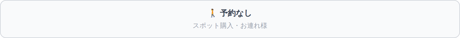 | 予約なしのスポット購入・お連れ様向け。支払先（葬儀社など）を選んで進む |

予約一覧（故人名・葬儀社・受注番号で検索、葬儀時間順の並び替え付き。「※ 受付完了の予約は葬儀社の得意先が自動で入ります」）:

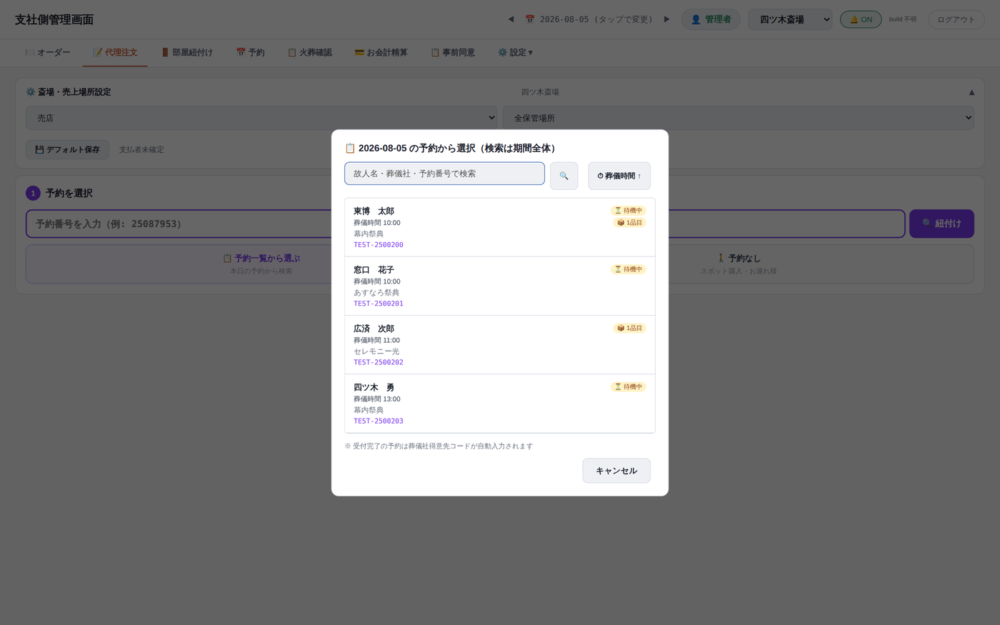


「🚶 予約なし」を選んだ場合は支払先を選択します（🏢葬儀社=幕内祭典・あすなろ祭典・セレモニー光などから選択／🚶お連れ様=その場精算）:

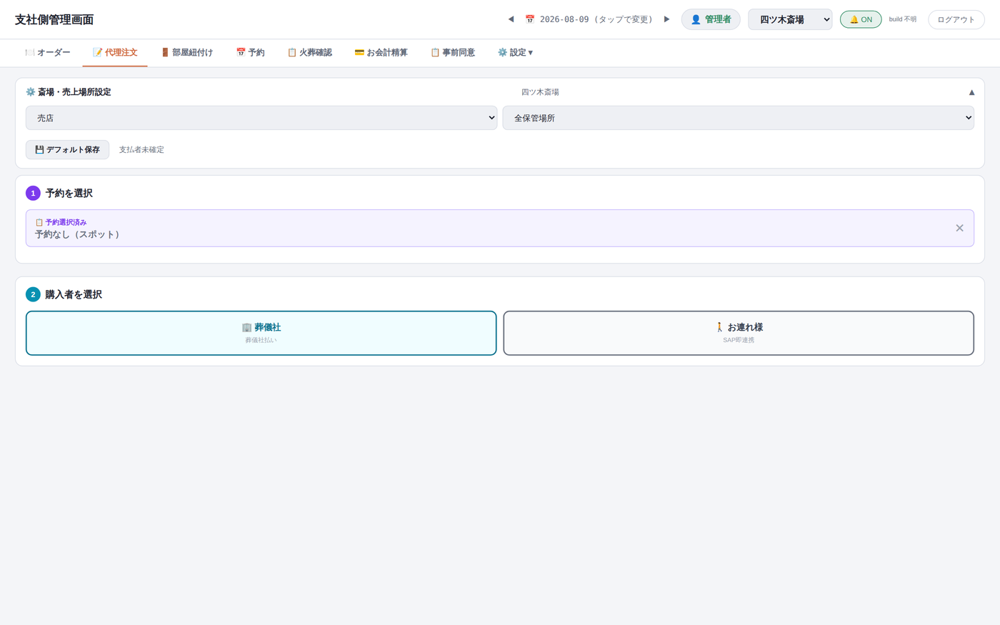

**手順3: 商品を選ぶ**

予約を選ぶと商品一覧が開きます（紫のバッジ「📋 予約選択済み TEST-2500200 東博　太郎 / 幕内祭典」。✕で選び直し）:


絞り込み（大分類／中分類（モバイル）／小分類／売掛用分類／購入者区分／商品名・品番検索／ラベル／注文者名）:

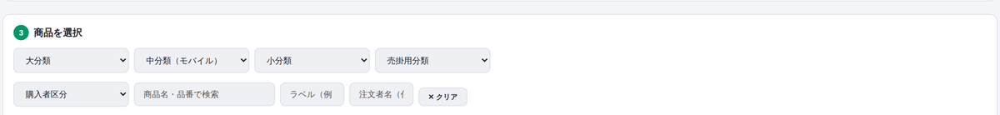

| ボタン | 説明 |
|---|---|
|  /  | 数量の増減 |
| 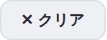 | 絞り込みをすべて解除 |
|  | **注文を送信** — 確定するとオーダー画面に新しいカードが現れる |

> **購入者による商品の出し分け**: 画面上部に「6件表示 / 全6件 ／ 購入者区分により 1件を除外」のように表示されます。お連れ様には一般商品のみ、喪家向け商品（精進料理膳など）・スタッフ代理専用品（骨壺など）は購入者に応じて自動的に隠れます。**0円・価格未設定の商品は注文できません。**

商品を追加すると下部に合計金額と送信ボタンが表示されます:


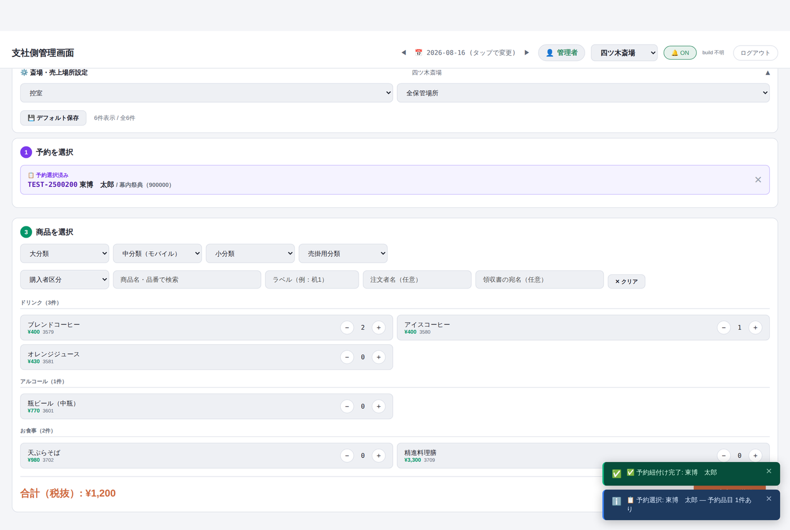

### 3.4 🚪 部屋紐付け（部屋と予約の紐付け）

**できること:** 控室・休憩室・式場・ラウンジ・お別れ室の部屋にご家族の予約を紐付けます。紐付けている間だけその部屋のQRから注文でき、休憩室では**フリードリンクの出し分け**も有効になります。紐付けの残り時間（既定30分・設定で変更可）が**ラストオーダー**として働き、期限が切れるとお客様側に「ただいまこのお部屋ではご注文いただけません」と表示されます。


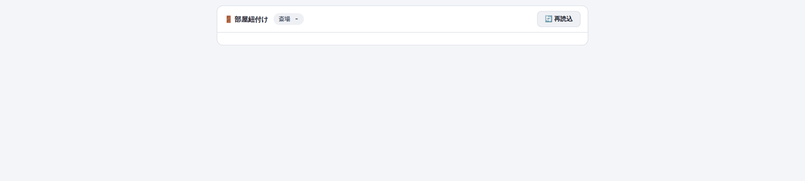

| ボタン・表示 | 説明 |
|---|---|
|  | **紐付け** — 部屋に予約を割り当てる（下の画面が開く） |
|  | **解除** — 紐付けを即時解除（**確認画面は出ません**。ご利用終了時に必ず押す） |
| 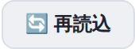 | **再読込** — 一覧を最新化 |
|  | **FD制御** — この売り場でフリードリンクの出し分けが有効という印 |

「紐付け」を押すと当日の予約から選べます（故人名・申込者名・受注番号で検索 →「この予約で紐付け」）:


すでに紐付いている部屋では上書きの警告が出ます:

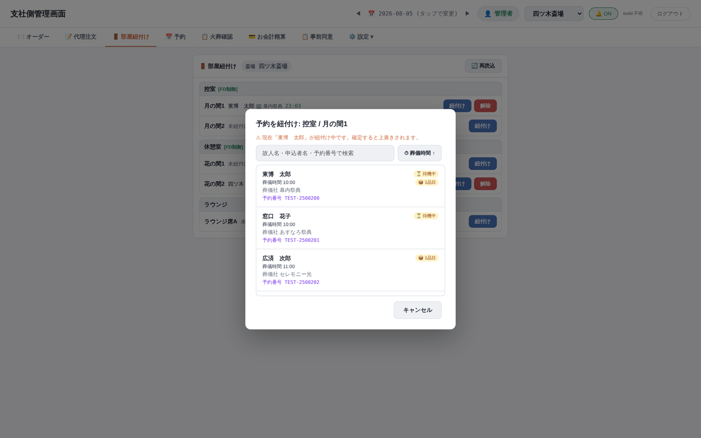

| # | ご利用開始〜終了の手順 |
|---|---|
| 1 | ご家族を部屋にご案内する前にこのタブを開く |
| 2 | 該当部屋の「紐付け」→ 当日予約から選択 →「この予約で紐付け」 |
| 3 | お客様をご案内し、部屋のQRを案内（予約にフリードリンク対象の品目があれば自動でフリードリンクメニューが出ます） |
| 4 | ご利用終了時に「解除」を押す（忘れても残り時間で自動失効しますが、その間は次のご家族が注文できないため必ず解除） |

### 3.5 📅 予約（予約の確認・確定 — 管理者のみ）

**できること:** 新予約システムから毎朝届いた予約データを確認し、「確定」します。確定時に区民葬・献体・減額・公費の該当と、支払先の葬儀社（得意先）を確認します。


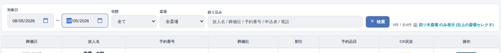

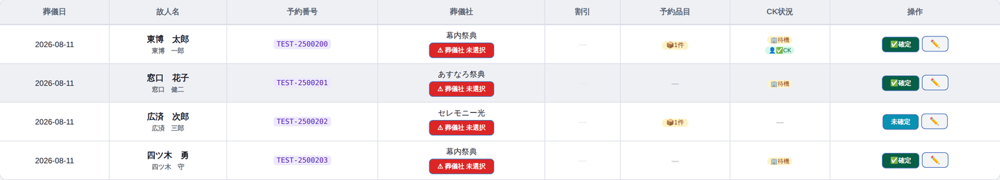

| ボタン | 説明 |
|---|---|
|  | **確定** — 確認画面（下）を開いて予約を確定する |
|  | **確定済** — すでに確定した予約の表示 |


> 支払先の得意先が入っていない予約は、この画面では直さず、予約の連携元と得意先マスタの設定を確認してください。

### 3.6 📋 火葬確認（火葬同意の確認・来場受付）

**できること:** 本日の火葬予約が**火葬開始時間順**に一覧表示され、火葬同意が取れているか（緑「承諾」／赤「未承諾」）を確認できます。未承諾の方には、その場で受付QRを提示して同意をいただきます。


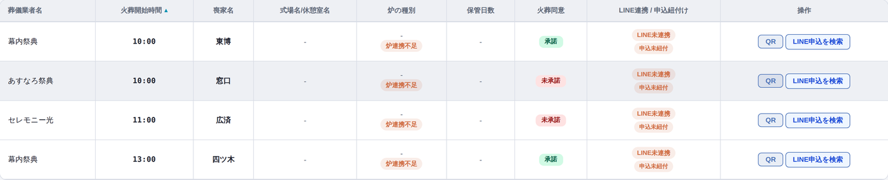

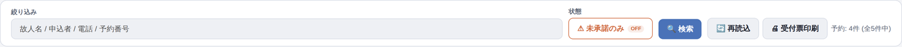

| ボタン・表示 | 説明 |
|---|---|
|  | **未承諾のみ** — 押すと未承諾の行だけに絞り込み（もう一度押すと解除） |
|  | **検索** — 故人名・申込者・電話・受注番号で絞り込み |
| 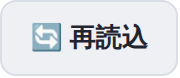 | **再読込** — 一覧を最新化 |
| 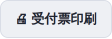 | **受付票印刷** — 表示中の未承諾の方の受付票（QR付き・1名1ページ）をまとめて印刷 |
|  | **QR** — その方専用の受付QRを表示（炉前でお客様に提示） |
|  | **LINE申込を検索** — LINEで入力された火葬申込を受付番号・申込者名（かな）・電話番号で探し、内容を直して予約と紐付ける |
|  / 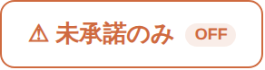 | 同意の取得状況（承諾＝対応不要／未承諾＝要対応） |

「⚠ 未承諾のみ」を押した状態:


絞り込みに「東博」と入力した状態:

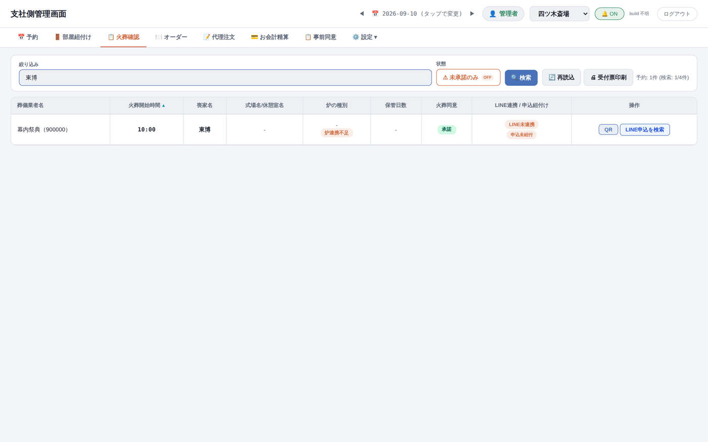

「QR」を押した状態（お客様がこれを読み取ると、スマホに故人情報と同意画面が開きます）:


> 件数の「予約: 4件（全5件中）」は「選択中の斎場で4件・全斎場で5件」という意味です。件数が合わないときは右上の斎場を確認してください。「本日分クリア」ボタンは誤操作防止のため受入テスト期間中は非表示になっています。

### 3.7 💳 お会計精算（会計・精算）

**できること:** お支払い者ごとの会計を「**会計待ち → 会計完了**」で管理します。割引の適用、SAPへの登録、自動精算機用の**精算QR**の発行、領収書の分割までここで行います。画面上部には自動精算機が途中で止まった時のための「**精算ロック管理**」があります。


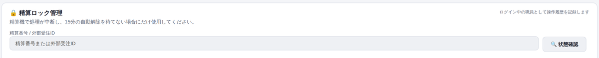

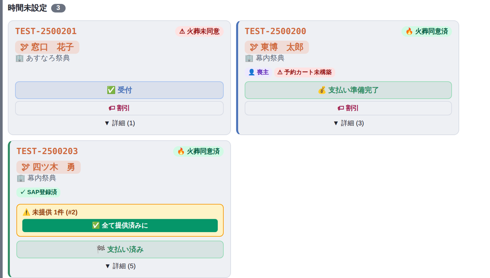

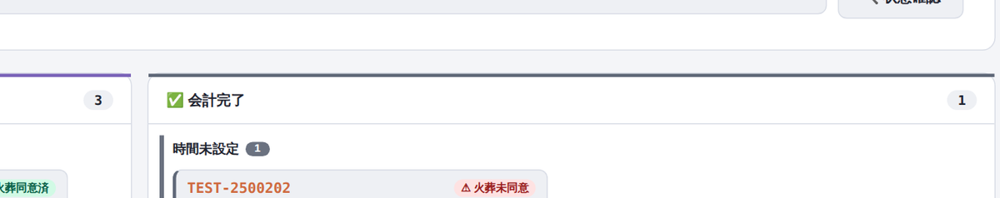

| ボタン・表示 | 説明 |
|---|---|
|  | **受付** — 来場受付。カードが会計待ちに並ぶ |
|  | **支払い準備完了** — SAPに受注登録される。成功すると「▼ 詳細」の中に**精算QR発行**ボタンが現れる |
| 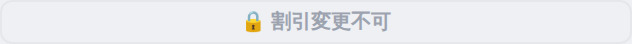 | **割引** — 区民葬・検体・減額・公費の割引を適用（下の画面。葬儀社ごとの対応可否と連動） |
|  | **全て提供済みに** — 未提供の注文が残っている警告が出たとき、まとめて提供済みにする |
|  | **支払い済み** — お支払い確認後に押す。会計完了の列へ移る |
|  | **詳細** — 明細を開く（注文一覧・精算QR発行・領収書分割・商品の修正） |
| 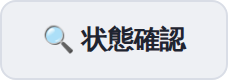 | **状態確認** — 精算番号または受注番号を入れて精算機のロック状態を確認・解除（操作者名が記録されます） |
|  /  | 火葬同意の状況（火葬確認タブと連動） |

割引の画面（この葬儀社に使える割引が無い場合は「割引種別が見つかりません」と表示されます）:


「▼ 詳細」を開いた状態（明細・領収書分割などへ進めます）:


| # | 精算QR発行までの手順 |
|---|---|
| 1 | 会計待ちのカードで「支払い準備完了」を押す（SAPに登録される。最大45秒） |
| 2 | 登録が成功したら「▼ 詳細」を開く →「精算QR発行」を押す |
| 3 | 金額を確認してQRを表示 → お客様が自動精算機で読み取ってお支払い |
| 4 | 支払い確認後「支払い済み」を押す |

> 精算機が途中で止まった場合は15分で自動解除されます。急ぐ場合のみ「精算ロック管理」で状態確認・解除してください（二重会計防止のため、精算機側での二重操作はしないでください）。

### 3.8 📋 事前同意（事前の火葬同意の一覧・紐付け）

**できること:** お客様が前日までに LINE で入力した火葬同意（受付番号つき。例: 260804-0001）の一覧を確認し、予約と紐付けます。名前の入力ゆれなどで自動紐付けされなかったものを、ここで手動で紐付けます。


| ボタン | 説明 |
|---|---|
|  | **状態の絞り込み** — 全て／未紐付け（初期表示）／紐付け済み |
|  | **検索** — 受付番号・氏名・かな・電話・住所など全項目で部分一致（ひらがな/カタカナどちらでも可） |
|  | **紐付け** — 予約との紐付け画面を開く（下） |

かな検索の例（「とうはく」で検索）:


紐付け画面（火葬日・斎場・故人名・喪家名かなが一致した予約には「完全一致候補」と表示。**一致していても自動確定はされないので、内容を確認して選択**）:


| # | 紐付けの手順 |
|---|---|
| 1 | 「未紐付け」で一覧を表示し、対象を検索 |
| 2 | 「紐付け」→ 火葬予約を検索 → 候補から該当予約を確認 |
| 3 | 「LINE申込を編集して紐づける」で入力内容を確認・訂正（氏名・電話・住所・続柄は空にできません） |
| 4 | 「変更して紐づけを完了する」→ 紐付けと申込者へのLINE通知が完了したことを確認 |

> 逆方向（予約から探す）は「📋 火葬確認」の「LINE申込を検索」から行います。通知だけ失敗した場合は「LINE通知だけ再実行」できます（同じ内容が二重に送られることはありません）。

### 3.9 ⚙️ 設定（各種マスタ — 管理者のみ）


**⚙️ 初期設定** — LINEメニューの切替設定・各種連携・イベント履歴・部屋紐付けの標準時間（30分）など:


主なセクション:

| セクション | 内容 |
|---|---|
|  | **リッチメニュー** — お客様のLINEメニュー（受付用⇄アフターケア用）の設定・手動切替 |
|  | **Webhook** — LINEからの受信設定 |
|  | **会員情報登録の連携** — 会員情報を外部（アフターケアCRM）へ連携する設定 |
|  | **SAP連携** — SAP登録の有効/無効の切替 |
|  | **イベントログ** — 受付・ログインなどの操作履歴 |
|  | **外部APIキー** — 外部システム接続用の鍵の発行・管理（**画面を撮影・共有しない**） |
|  | **場所・部屋設定** — 部屋紐付けの標準時間（既定30分）など |
|  | **味バリエーション** — 商品の味の選択肢（ホット/アイス等）の設定 |

**👥 会員** — LINE会員の一覧。葬儀日・経過日数・メニュー切替（受付⇄アフターケア）・来店/注文回数・累計金額・削除:


**📦 商品** — SAPから取り込んだ商品カタログの確認・同期。分類での絞り込み:


**📊 在庫** — **現在故障中のため使用しないでください**（開くとエラーになります。修正待ち）:


**🏢 得意先** — 葬儀社の一覧（幕内祭典・あすなろ祭典・セレモニー光など）。**区民葬・検体・減額・公費の割引可否**はここの設定が会計画面に反映されます:


**🏛️ 斎場設定** — 7斎場と、斎場ごとの売り場・部屋・取扱商品の設定:


売り場の「⚙ 設定」で「ラストオーダーの対象とする」「フリードリンクの出し分けを有効化」を設定します（ここが OFF の売り場の部屋は部屋紐付けタブに表示されません）:


**👤 ユーザー** — スタッフアカウントの発行。権限・担当斎場（空欄=全斎場）・既定の売り場・ログインキー発行:


**📱 QR発行** — 2種類のQRを発行します:


| QR | 用途 |
|---|---|
| オーダー用QR | 斎場×売り場×ラベル（例: 机1）を指定して発行し、印刷して机上などに設置。読み取るとその売り場の注文メニューが開く |
| 事前同意QR | 全申込者共通の固定QR。東京博善から各葬儀社に配布し、商談時にお客様が読み取る |

> **注意: ここで発行するQRと「精算QR」は別物です。** 精算QRは「💳 お会計精算 → 支払い準備完了 → ▼詳細 → 精算QR発行」から発行します（取り違えると精算機で読めません）。

---

## 4. LINEミニアプリの操作手順（お客様向け画面）

お客様（喪主さま・ご遺族・お連れ様）のスマホに表示される、LINEミニアプリ「**東京博善の窓口**」の画面です。斎場スタッフがお客様をご案内する際の参考にしてください。

**画面下部の共通メニュー** — 受付画面（§4.2 STEP 5）以降、各画面の下部に常に表示されます:


| ボタン | タップすると |
|---|---|
|  | **ホーム画面**（§4.3）へ。受付番号・受付時刻の確認と、「料金確認（喪主払い分）」「お食事・ご注文へ」への入口 |
|  | **注文メニュー**（§4.3）へ。読み取ったお部屋（例: 四ツ木斎場 控室「月の間1」）の商品一覧。受付前は薄い表示で押せません |
|  | **予約カート**（§4.4）へ。火葬料金などのご予約内容と、ご注文の一覧 |
|  | **ご注文履歴**（§4.4）へ。この予約の注文・本日の注文・全履歴 |
|  | **LINE公式アカウント「東京博善の窓口」のトーク画面へ移動**します（ミニアプリの外に出ます） |

### 4.1 前日まで（事前同意）— お客様の導線

葬儀社との商談時にご案内する**事前同意QR**（全申込者共通）から、お客様がご自身のスマホで**火葬日前日の17時まで**に行うお手続きです。トーク画面とミニアプリの行き来を含めた全体の流れ:


> **ミニアプリの外（LINEの画面）へ移動するのは2か所だけです。**
> ① STEP 3 友だち追加 — LINEの友だち追加画面へ一時的に移動し、お客様ご自身でミニアプリへ戻ります
> ② STEP 6 完了画面の「閉じる」— ミニアプリが閉じ、LINEのトーク画面に戻ります

**STEP 1: 事前同意QRを読み取る（LINEのカメラ／トーク画面）**

お客様がLINEのカメラ、またはトークに届いたリンクから事前同意QRを開くと、トーク画面の上にミニアプリ「東京博善の窓口」が立ち上がります。※LINE本体側の画面（カメラ・トーク一覧）はLINE社のアプリ画面のため本書には掲載していません。

**STEP 2: TOP画面 —「申込にすすむ」をタップ**

ご利用のルール（前日17時までのお手続き等）と、7斎場の各種お問合せ先が表示されます:


| ボタン・部品 | 説明 |
|---|---|
|  | **申込にすすむ** — タップすると、友だち未追加の方は STEP 3（友だち追加）へ、追加済みの方は STEP 4（申込者情報の入力）へ進みます |
|  | ご利用のルール — 前日17時までのお申込み・同意内容の確認・お困りの際は斎場スタッフへ・入力内容の管理、の4項目 |
|  | 各種お問合せ先 — 町屋斎場・落合斎場・代々幡斎場・四ツ木斎場・桐ヶ谷斎場・堀ノ内斎場・お花茶屋会館の電話番号（※画像の番号はテスト用） |

**STEP 3: 友だち追加（公式アカウント未追加の方のみ）— ここでLINEの画面へ移動します**


| ボタン | 動き |
|---|---|
|  | **💚 友だち追加する** — **ミニアプリを離れ、LINEの友だち追加画面へ移動します。** 追加しても自動ではミニアプリに戻らないため、お客様ご自身で戻っていただきます（画面下の注記「※ LINEアプリに移動します」のとおり） |
|  | **追加済みの方はこちら →** — 友だち追加を確認して次へ。未追加のままタップすると「⚠ 友だち追加ボタンをタップしてから再度お試しください」と表示されます |

すでに友だち追加済みの方にはこの画面は表示されず、STEP 2 から直接 STEP 4 へ進みます。

**STEP 4: 申込者情報の入力（予約内容の確認）—「次へ（規約確認）」をタップ**

画面名は「**予約内容の確認**」。開いた直後は未入力の状態です:


斎場・火葬日・故人さまの氏名（かな）・申込者さまの氏名（かな）・電話番号・郵便番号（🔍住所検索付き）・住所・故人様から見たご関係（続柄）を入力します。入力し終えた状態:


| ボタン | 説明 |
|---|---|
|  | **次へ（規約確認）** — 必須項目が空のままだと「⚠ 必須項目を入力してください」と表示されて進めません。かな欄はひらがな・カタカナのみ有効です |

**STEP 5: 規約への同意（ご利用にあたりご確認ください。）—「次へ進む」をタップ**

「**火葬の申込**」（**必須**）と「**LINEミニアプリ（東京博善の窓口）利用規約**」（任意）の2つが表示されます。チェックを入れる前は「次へ進む」ボタンは押せません（薄い色）:


「**以下の内容を確認し、同意する**」（まとめてチェック）をタップすると両方にチェックが入り、ボタンが押せる色に変わります:


| 部品 | 説明 |
|---|---|
|  | まとめてチェック — 表示中の規約すべてに一括で同意/解除 |
|  | チェック前の「次へ進む」（押せない状態） |
|  | チェック後の「次へ進む」（押せる状態）。※火葬の申込規約への同意は必須・利用規約は任意です |

**STEP 6: 完了画面 —「閉じる」でLINEのトーク画面に戻ります**

「**火葬の申込を受付させていただきました。**」と表示されて、お客様のお手続きは完了です。**この画面に受付番号は表示されません**（事前同意の受付番号〈260804-0001 形式〉は管理画面「📝 事前同意」の一覧に発番され、スタッフ側で確認します）:


| ボタン | 動き |
|---|---|
|  | **閉じる** — **ミニアプリが閉じ、LINEのトーク画面に戻ります** |

### 4.2 当日（火葬同意〜受付）— お客様の導線

斎場でご案内する**受付QR（予約個別QR）**の読み取りから受付完了までの導線です。前日までに事前同意がお済みの方は、同意画面と申込者情報入力が**自動的に省略**されます:


> 当日の導線では、**トーク画面へ自動的に戻る場面はありません。** 受付完了後はそのままミニアプリ内で注文（§4.3）へ進みます。トーク画面を開きたい場合は、下部メニューの「公式」から移動できます。

**STEP 1: 受付QRを読み取る（LINEのカメラ）**

スタッフが「🔥 火葬確認」画面の「QR」ボタンで表示したQR、または受付票のQRを、お客様がLINEのカメラで読み取ります。

**STEP 2: TOP画面 — 故人さまの情報を確認して「同意にすすむ」**

前日のTOP画面と同じ構成に加えて、「**📋 火葬のお申し込み対象**」に**故人氏名・火葬日時・斎場**が表示されます。お客様にお間違いがないかを確認していただいてから進みます:


| 部品 | 説明 |
|---|---|
|  | 火葬のお申し込み対象（例: 東博 太郎さま・当日 10:00・四ツ木斎場） |
|  | **同意にすすむ** — タップすると STEP 3（規約への同意）へ。同意・入力がすべてお済みの方は、受付（STEP 5）まで自動で進みます |

**STEP 3: 規約への同意 —「次へ進む」をタップ（同意済みの方には表示されません）**

画面は前日の STEP 5 と同じですが、**未同意の規約だけ**が表示されます。火葬同意・利用規約とも同意済みの方はこの画面ごとスキップされます:


同意が完了すると、管理画面「🔥 火葬確認」で該当のご予約が**「承諾」**表示に変わります。

**STEP 4: 申込者情報の入力（未入力の場合のみ）—「入力して受付へ進む」**

ご予約に申込者さまの氏名・電話・住所・続柄が入っていない場合に表示されます。開いた直後（未入力）と入力し終えた状態:


| ボタン | 説明 |
|---|---|
|  | **入力して受付へ進む** — 登録して受付画面へ |

※「**あとで入力する**」を選んでも受付には進めますが、**火葬中（お会計前まで）に必ず入力**が必要です。未入力の間は、ホーム画面に「申込者情報を入力する」の案内が表示され続けます。

**STEP 5: 受付 —「火葬申込をする」をタップ**

お名前と「未受付」の状態が表示されます:


| ボタン | 説明 |
|---|---|
|  | **火葬申込をする** — 受付を確定します。利用規約が未同意の場合は同意画面に戻ります |

**STEP 6: 受付完了 — 受付番号が表示され、そのまま注文へ**

「✅ 受付完了！」と表示され、**受付番号（例: #1）・受付時刻・ステータス「受付完了」**が確認できます。以後は「お食事・ご注文へ」からモバイルオーダー（§4.3）に進みます:


### 4.3 受付後〜ご注文の画面

**ホーム（受付状況）** — 受付後の起点になる画面です。お名前（例: 東博 一郎さま）・「受付済み」バッジ・**受付番号（#1）・受付時刻・ステータス「受付完了」**が表示されます。「**お食事・ご注文へ**」をタップすると注文メニューへ、「**💰 料金確認（喪主払い分）**」をタップすると料金確認（§4.4）へ移動します。申込者情報が未入力の間は「申込者情報を入力する」の案内も表示されます（受付前後の画面の変化は §4.2 STEP 5・6 参照）:


**注文メニュー** — お部屋に設置されたオーダーQR（例: 四ツ木斎場・控室「月の間1」）をLINEのカメラで読み取ると、その売り場のメニューが開きます。画面上部の📍現在地バーで、どのお部屋あてのご注文になるかを必ず確認してください:


| 部品 | タップすると／説明 |
|---|---|
|  | 現在地バー — いま開いているメニューの売り場とお部屋。別のお部屋のQRを読み取ると表示が切り替わります |
|  | カテゴリタブ — 「お飲み物」「お食事」「フリードリンク」の商品一覧を切り替えます |
|  | **注文を確定する →** — カートの内容を送信します。送信完了まで**最大45秒**かかることがあります。画面はそのままでお待ちいただき、**再送信はしないでください**（二重注文の原因になります） |
|  | カートバー — タップで中身を開閉（例: 🛒 カート 2点 ¥800）。開くと品目ごとの数量変更もできます |

**フリードリンクタブ** — フリードリンクが有効なお部屋のお客様にのみ表示されます。対象のお飲み物（ブレンドコーヒー・アイスコーヒーなど）はこのタブから注文します。※ラストオーダーの設定があるお部屋では、時刻（既定: お部屋の利用終了30分前）を過ぎるとご注文いただけません:


**商品の詳細** — 商品カード（例: ブレンドコーヒー ¥400）をタップすると、説明文「香り高いオリジナルブレンド。ホットでご提供します。」と数量の＋／−が表示されます。＋を押すとカートに入り、×で商品一覧に戻ります:


**カートを開いた状態** — 品目・数量・金額（例: ブレンドコーヒー×2 ¥800・オレンジジュース×1 ¥430、合計¥1,230）を確認して「注文を確定する →」:


**注文完了** — 「ご注文を承りました」と**ご注文番号（例: 006）**が表示されます。「**追加注文**」をタップすると注文メニューへ、「**ホームに戻る**」をタップするとホーム画面へ戻ります。友だち追加済みの方には、注文ステータスのお知らせがLINE公式アカウントのトークに届きます:


### 4.4 履歴・予約カート・料金確認

**ご注文履歴**（下部メニュー「履歴」）— ご予約に紐づく方は「**🔖 この予約の注文**」、ご予約のない方は「**📅 本日の注文**」が最初に表示されます。「**📜 全履歴を見る**」をタップすると過去のご注文まで一覧でき、「↩ 戻す」で元の表示に戻ります。注文ごとに、注文番号（例: #3）・日付・品目・数量・金額と、「提供済み」「お会計済み」の状態が表示されます:


**予約カート**(下部メニュー「予約カート」) — 火葬のご予約内容とご注文を1つの画面でまとめて確認できます。カート合計(例: 4品目 ¥64,260)の下に、**📝 予約品目(例: 火葬料金〈最上等〉¥59,000)／🏢 代理注文(例: 精進料理膳 ¥3,300)／👤 自分の注文(例: ブレンドコーヒーほか3点 ¥1,660)／👥 他メンバー(例: オレンジジュース ¥300)**が色分けのラベルつきで並びます。表示価格は目安で、確定金額は精算時に決まります:


**料金確認（喪主払い分）**（ホーム画面の「💰 料金確認」）— 喪主さまがお支払いになる分の合計（例: 5品目 ¥64,260・税抜¥58,418／税¥5,842）です。SAPで金額が確定すると「**✓ 確定金額**」、確定前は「**◻️ プレビュー**」と表示されます。式場（式場使用料）・火葬（火葬料金〈最上等〉）・骨壺（白磁 7寸）・菓子飲料（精進料理膳・ブレンドコーヒー）のグループごとに小計が出ます。「← 戻る」でホームに戻ります:


### 4.5 こんな画面が出たら

**「オーダーQRコードを読み取ってください」** — お部屋の情報がない状態で注文メニューを開いたときに表示されます。「**QRコードを読み取る**」をタップすると**LINEのQRコードリーダーに移動**するので、お席のオーダーQRを読み取るようご案内ください:


**「ただいまこのお部屋ではご注文いただけません」** — お部屋の紐付けが未実施か期限切れです。スタッフが管理画面の「🚪 部屋紐付け」で該当のお部屋（例: 控室「月の間1」）にご予約を紐付けると解消します:


**「斎場を選択してください」** — 位置情報から複数の斎場に該当した場合に表示されます。町屋斎場〜お花茶屋会館の一覧から、ご利用中の斎場をタップして選びます:


---

## 5. シナリオ別 操作フロー

### シナリオA: 売店でその場支払い

| # | 誰 | 操作 |
|---|---|---|
| 1 | お客様 | 売店のQR（ラベル「売店レジ前」）を読み取り、瓶ビール（中瓶）等を注文 |
| 2 | スタッフ | すぐ渡せる商品なので「🍽️ 提供済み」を直接押す（LINEに提供完了通知） |
| 3 | スタッフ | 商品を渡す → PDAで売上計上 → 「→ お会計準備完了」 |
| 4 | スタッフ | 現金を受け取り「💰 お会計済み」（LINEに会計完了通知） |

### シナリオB: 控室で喪主まとめ払い

| # | 誰 | 操作 |
|---|---|---|
| 1 | スタッフ | 「🚪 部屋紐付け」で控室・月の間1 に東博家の予約を紐付け |
| 2 | お客様 | 部屋のQR（📍月の間1）から何度か注文（対象ならフリードリンクタブも表示） |
| 3 | スタッフ | 「調理開始」→「提供済み」→ PDA計上 → 「→ お会計準備完了」 |
| 4 | スタッフ | 「📋 注文詳細」で支払先を「喪主」に（**「お会計済み」は押さない**） |
| 5 | スタッフ | 「💳 お会計精算」で 受付 →（割引）→ 支払い準備完了 → ▼詳細 → 精算QR発行 → 自動精算機でお支払い → 支払い済み。お客様は「料金確認」画面で喪主払い分を事前に確認できます |

### シナリオC: 事前同意済みの方（前日までに入力済み）

事前同意QR → TOP「申込にすすむ」→ 入力完了（受付番号発番）→ 予約と自動/手動で紐付け → 当日「📋 火葬確認」で「承諾」（緑）→ 追加の操作は不要。

### シナリオD: 炉前でその場同意（当日）

「📋 火葬確認」で「未承諾」（赤）の行 → 「QR」を提示 → お客様が読み取り → TOPで故人情報を確認 →「同意にすすむ」→ 同意 → 申込者情報を「入力して受付へ進む」→ 一覧が「承諾」に変わったことを確認。

### シナリオE: 同意だけ先に・情報はあとで

申込者情報の画面で「あとで入力する」を選択（火葬中に入力・お会計前まで必須）→ スタッフが業務の合間に未入力の方を確認して声かけ → ご本人入力または代行入力。

### シナリオF: 割引がある会計の例

| ケース | 内容 | 支払い |
|---|---|---|
| 例1 | 予約の火葬費用のみ | 葬儀社への請求（売掛） |
| 例2 | 予約＋モバイルオーダーの合算 | 喪主と葬儀社で分割（領収書分割を使用） |
| 例3 | モバイルオーダー複数明細 | 喪主 |
| 例4 | 社員割引の適用 | 葬儀社への請求 |
| 例5 | 業者キャッシュバックあり | 葬儀社への請求 |

---

## 6. 権限（アカウント種別）一覧

| 種別 | 表示名 | できること |
|---|---|---|
| 管理者 | superadmin | 全機能＋「📅 予約」「⚙️ 設定」＋アカウント発行 |
| スタッフ | staff | 日常運用（オーダー/代理注文/部屋紐付け/火葬確認/お会計精算/事前同意）。「予約」「設定」は表示されない |
| CC SV | cc_sv | コールセンター管理（全件＋割り振り解除） |
| CCスタッフ | cc_staff | コールセンター（自分の担当＋未割当） |
| ラベル担当 | label_agent | ラベル業務のみ |

アカウントごとに「担当斎場（空欄=全斎場）」「既定の売り場」を設定できます（§3.9 ユーザー）。

---

## 7. 困ったときは（Q&A）

| 症状 | 対応 |
|---|---|
| 一覧に何も表示されない | 画面上部の**日付**と**斎場**を確認 |
| 注文がカンバンに出ない | 「接続中」表示を確認→再読込。日付・斎場・🔔OFF も確認 |
| お客様に「ただいまこのお部屋ではご注文いただけません」と出る | 「🚪 部屋紐付け」で該当のお部屋に予約を紐付け |
| 代理注文が先に進めない | 最初に「⚙️ 斎場・売上場所設定」で斎場と売り場を選択 |
| 「未承諾のみ」で件数が減った | 絞り込みが ON の状態。もう一度押すと全件表示 |
| 「予約: 4件（全5件中）」で件数が合わない | 表示は選択中の斎場のみ。右上の斎場を確認 |
| かなで検索しても出ない | ひらがな/カタカナはどちらでも可。出ない場合はふりがな未登録の可能性 |
| 「検索対象が上限に達しています」 | 火葬日または斎場で絞ってから再検索 |
| 「精算QR発行」ボタンが見当たらない | 「支払い準備完了」を押して SAP 登録が成功すると「▼ 詳細」の中に現れる |
| 精算機が途中で止まった | 15分で自動解除。急ぐ場合のみ「精算ロック管理」で状態確認・解除（精算機側で二重操作しない） |
| 「支払割当が見つかりません」等のSAPエラー | 画面を最新に更新（Ctrl+Shift+R）→ 支払先を振り分け直す → 「↻ 失敗分を一括再送」。繰り返す場合はシステム担当へ |
| お連れ様の注文がエラー表示なのに登録されている | 表示の既知不具合。受注番号の記録を優先し、二重登録しない |
| 注文送信が長い | 最大45秒かかることがあります。**再送信しない**（二重請求防止） |
| LINE通知が届かない | 友だち追加・通知設定を確認（ブロックと通知オフは別物） |
| QRが読めない | 汚れ→再印刷。**部屋QRと精算QRの取り違え**も確認 |
| 誤って受付した | 「💳 お会計精算」の「← 精算未受付に戻す」（支払い前のみ） |
| 在庫タブがエラーになる | 故障中のため使用しない（修正待ち） |
| 予約に葬儀社（得意先）が入っていない | この画面では直さず、予約の連携元と得意先マスタを確認 |
