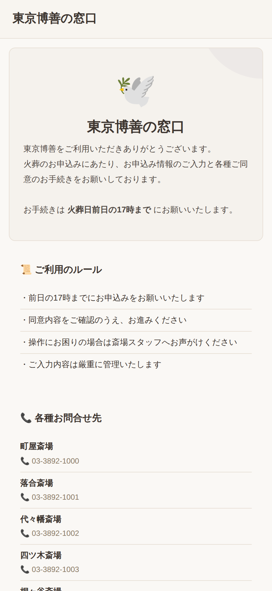
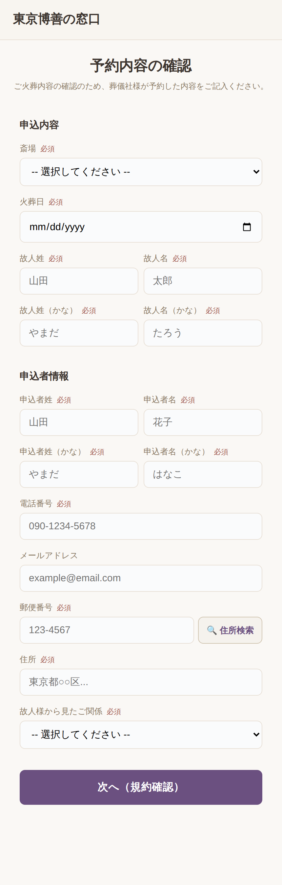
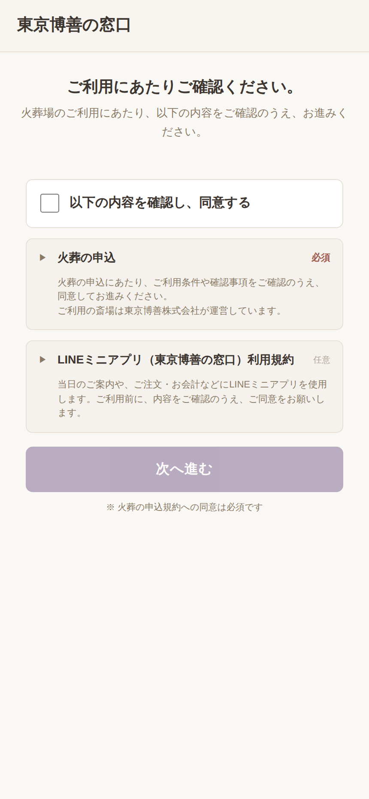
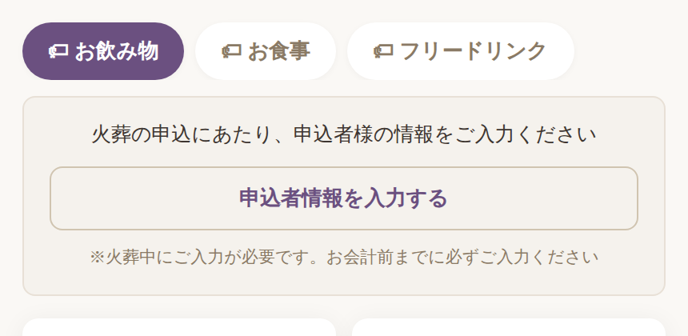
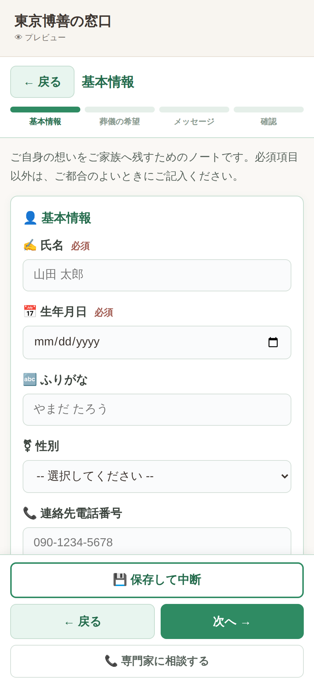

# 東京博善「窓口（mado）」システム手順書 v5.0

| 項目 | 内容 |
|---|---|
| 文書名 | 東京博善 窓口システム（mado）手順書 兼 リスク台帳 |
| 対象システム | 支社側管理画面（admin.html）／LINEミニアプリ（index.html・LIFF）／CRM（crm.html）／外部API（/api/v1/*） |
| 対象読者 | 斎場スタッフ（町屋・落合・代々幡・四ツ木・桐ヶ谷・堀ノ内・お花茶屋会館）・本社運用担当・PMO・新規参画メンバー |
| 検証環境（STG） | `https://mado-staging.web.app/admin.html`（Firebase プロジェクト `mado-staging`） |
| 本番環境 | `https://madoguchi-ec1d5.web.app/admin.html`（Firebase プロジェクト `madoguchi-ec1d5`） |
| リポジトリ | GitHub `nurveteam/mado` |
| 版数 | v5.0（2026-08-04）— 章構成をアーキテクチャ起点に再編。スクリーンショット **84枚**（うち **77枚は 2026-08-04 版ソースを起動して本日撮影**。LINEミニアプリは実フロー17画面＋プレビュー9画面をすべて新規撮影し、旧キャプチャを全廃棄） |
| 作成方法 | 04_操作マニュアル_Phase1・現場マニュアル（2026-07-14改訂）・mado-system-spec v2.0・admin-manual／sitemap・エンジニア改善指示（2026-08-02）・Notion議事録（7/21〜7/31）・Slack `#prj-東博の窓口システム開発` を突合し、5回の検証パス＋v3.0/v4.0/v5.0追補検証（§11）を実施 |

> **ログイン情報・APIキーは本書に記載しません。** アカウントは管理者から個別（DM）に共有されます（リスク D-1）。
>
> **📸 スクリーンショットの撮影方法**: 本作業環境から `mado-staging.web.app` への直接アクセスはネットワークポリシーで遮断されているため、**STG と同一の 2026-08-04 版ソースコード（`public/admin.html`〈899KB〉・`public/index.html`）をローカルで起動し、STG 相当の架空テストデータ（東博太郎・幕内祭典・TEST-2500200 等）を投入して Chromium で操作しながら撮影**しました。LINEミニアプリは LIFF の開発モード（ENV=local・`liffId:''`）で実フロー（TOP→同意→受付→注文→確定→履歴→予約カート→料金確認）を実際に操作して撮影しています。画面仕様・文言・配色は STG と同一です（ヘッダーの build 表示のみ「build 不明」となる点が実環境と異なります）。STG ライブ画面 1 枚（2026-08-04・`STG/951d4df`）を併載。

---

## 目次

1. [全体アーキテクチャと外部連携](#1-全体アーキテクチャと外部連携)
2. [業務の全体像 — 前日Ver.／当日Ver.](#2-業務の全体像--前日ver当日ver)
3. [管理画面（admin.html）画面別の意味と操作手順](#3-管理画面adminhtml)
4. [LINEミニアプリ 画面別の意味と操作手順](#4-lineミニアプリお客様向け)
5. [シナリオ別 操作フロー](#5-シナリオ別-操作フロー)
6. [権限（ロール）一覧](#6-権限ロール一覧)
7. [トラブルシューティング Q&A](#7-トラブルシューティング-qa)
8. [リスク台帳 — 網羅的リスク分析と対策](#8-リスク台帳--網羅的リスク分析と対策)
9. [用語集](#9-用語集)
10. [参考資料（出典）](#10-参考資料出典)
11. [検証記録（5回のレビューパス＋追補）](#11-検証記録5回のレビューパス追補)

---

## 1. 全体アーキテクチャと外部連携

「東京博善の窓口（mado）」は、**東京博善株式会社**（広済堂グループ）の7斎場 — **町屋斎場・落合斎場・代々幡斎場・四ツ木斎場・桐ヶ谷斎場・堀ノ内斎場・お花茶屋会館** — で使用する、葬儀当日の**受付・火葬同意・モバイルオーダー・会計精算**のデジタル化システムです。開発体制は 東京博善（発注元。窓口事業: 小島室長・大沼様・榎本様）／広済堂 情報システム部（SAP管理）／NURVE（一次請け・Firebase・SAP中間サーバー: 山本様）／ARCRA（PM・開発推進）／rubyjobs（バックエンド。Mario Yi 氏より 2026-08 引き継ぎ）／テコテック（新予約システム）／Bluememe（会員基盤API）／東芝テック・ユニコ（自動精算機・PDA）。

### 1.1 サブシステム構成

| サブシステム | URL | 利用者 | 概要 |
|---|---|---|---|
| **支社側管理画面（受注管理）** | `/admin.html` | 斎場スタッフ・本社（約60名想定） | 注文カンバン・代理注文・部屋紐付け・火葬確認（受付）・お会計精算・事前同意管理・各種マスタ |
| **LINEミニアプリ** | `/index.html`（LIFF。QR基点は 2026-08-03 に本番用 LIFF `2009732996` へ切替。旧開発用=2009732994。サーバー側 verifyLiff は 994/995/996 の3環境を許可） | 喪主・喪家・お連れ様・参列者 | TOP・火葬同意（事前/当日）・チェックイン・モバイルオーダー・予約カート・料金確認。白/紫の東京博善ブランドカラー |
| **CRM** | `/crm.html` | コールセンター（CC SV／CCスタッフ） | アフターケア架電・LINEチャット・チケット・資料請求・Twilio WebRTC 電話・OpenAI Whisper 文字起こし |
| **外部API（v1）** | `/api/v1/*` | 中間サーバー・Bluememe 等 | 外部連携用 REST API（X-Api-Key 認証） |

### 1.2 技術スタック

| レイヤー | 技術 |
|---|---|
| フロントエンド | HTML/CSS/JS（SPA・フレームワークなし）。`public/admin.html`（約900KB・単一ファイル）・`public/index.html`。外部ライブラリ: Firebase JS SDK 10.7.1（compat）・LIFF SDK 2.22.3・Leaflet 1.9.4（ジオフェンス地図）・qrcodejs 1.0.0・SheetJS xlsx 0.20.1・Noto Sans JP／JetBrains Mono |
| バックエンド | Firebase Cloud Functions v2（Node.js）＋ Express。`functions/index.js` 単一大規模ファイル（リスク E-4）。本番 API は Cloud Run（`api-…-an.a.run.app`） |
| データベース | Cloud Firestore 24 コレクション。管理画面は `orders`・`checkins`・`reservations` を **onSnapshot リアルタイムリスナー**で購読（当日 `date` 基準）、他は REST。where+orderBy 併用を避け JS ソートで代替する設計 |
| 認証 | **3系統**: 管理画面セッション（X-Admin-Token・sessionStorage 保持）／LIFF（Authorization: Bearer）／外部APIキー（X-Api-Key） |
| 環境判定 | hostname ベースで local／staging／production を自動判定（localhost=開発モード・Firestore エミュレータ localhost:8080、mado-staging=STG、それ以外=本番）。LINE 公式アカウント OA **2009733008** |
| 電話（CRM） | Twilio WebRTC Client SDK 1.14.1（録音30日保持）＋ OpenAI Whisper（25MB上限） |
| API規模 | 110 エンドポイント（2026-03 仕様書 v2.0）→ 177（2026-07 体制資料） |

### 1.3 外部システムとの関係

```
新予約・葬祭管理（テコテック製。旧: Fellow／タイコウ）──毎朝CSV/API──▶ ┌────────────────┐
                                                                        │  窓口 mado      │
LINE Platform（LIFF 2009732996 / OA 2009733008）◀────────────────────▶│  Firebase       │
                                                                        │  admin / index  │
SAP S/4HANA Cloud ◀── SAP中間API（Node.js・NURVE管理）◀──────────────│  / crm          │
   │ sapCartAdd / sapCartComplete / 割引 / 自動仕訳                     └───────┬────────┘
自動精算機（東芝テック／ユニコ）◀── 精算QR（SAP受注番号）──────────────────┘
```

- **予約データ**: テコテック新予約システム（9月リリース）→ NURVE 中間サーバー → 窓口へ同期。
- **SAP連携**: 注文作成時 `sapCartAdd`、「お会計準備完了」遷移時 `sapCartComplete`（受注登録）。**サーバーは SAP 中間への送信を同期で待つ（クライアント側タイムアウト45秒。先に中断すると再注文→二重請求になるため。DIAG-053）**。価格は Condition Types（本体価格 **PP00**・手動価格 **PPR0**・社員割引 **Z001**・キャッシュバック）。支払割当は**代表品目分類**ベース（PR #190 で旧 productGroup から移行）。
- **SAP中間の環境**: STG 連携先は `saptest-staging.nurve.jp`（NURVE 山本様管理）→ SAP検証環境。
- **精算機連携**: 精算QR（SAP受注番号ベース）を自動精算機で読み取り精算。処理中断時は**精算ロック管理**（§3.7）で状態確認・解除（15分自動解除）。
- **デプロイ運用**: `staging` → STG 自動デプロイ／`main` → 本番（GitHub Environment「production」required reviewers 承認ゲート）。障害時は revert → 再デプロイ or Hosting 版切り戻し。

### 1.4 環境と LIFF プレビュー

| 環境 | URL | 用途・注意 |
|---|---|---|
| ステージング（STG） | `https://mado-staging.web.app/` | 検証用。テストデータ投入済み（斎場7・予約10・事前同意5・商品約2万件）。**実顧客データは使用しない**。ヘッダーに build SHA（例: `STG / 951d4df / build 30866385986`） |
| 本番 | `https://madoguchi-ec1d5.web.app/` | 実運用 |

**LIFF プレビュー**: `https://mado-staging.web.app/?preview=<画面名>`（friend / top / top-day / register / pre-info / pre-complete / checkin-pending / checkin-done / profile / **ending-note**〈大沼様レビュー用。EN_ENABLED=false でも表示可〉）。ヘッダーに「👁 プレビュー」表示。会員状態・予約データに依存せず表示され、LINE ログイン不要です。

---

## 2. 業務の全体像 — 前日Ver.／当日Ver.

### 2.1 前日Ver.（火葬日前日までの事前フロー）

主担当: 葬儀社（QR配布）・申込者（喪家）・本社／斎場管理者

```
【葬儀社】商談時に事前同意QR（全申込者共通・mode=pre）を申込者へ配布
   ↓                     ※テコテック新予約システム移行後は SMS 送付へ変更予定
【申込者】LINEで読み取り → TOP（scrTop:「お手続きは火葬日前日の17時まで」）→「申込にすすむ」
          → 友だち追加（scrFriend）→ 同意内容確認・申込者情報入力（scrPreInfo）→ 送信
          → 受付番号 YYMMDD-0001 発番（scrPreComplete・LINE通知）
   ↓
【システム】予約取込時に「火葬日・斎場・故人名・喪家名かな」の完全一致で自動紐付け
   ↓
【管理者】「📅 予約」タブで翌日分を確認し「📋確定」（区民葬・献体・減額・公費と得意先コードを確認）
【スタッフ】「📋 事前同意」タブで未紐付けを確認 → 不一致分は手動紐付け（§3.8）
【スタッフ】「📋 火葬確認」の日付を ◀/▶ で翌日へ →「⚠ 未承諾のみ」で未同意者を抽出 → 事前連絡・受付票印刷
```

### 2.2 当日Ver.（火葬当日の同意確認〜精算フロー）

主担当: 斎場スタッフ（受付・炉前・売店・配膳）

```
① 始業前チェック … 🟢接続中／🔔ON／日付=本日／斎場セレクタ=自斎場／ハードリロード（build表示確認）
 ↓
② 火葬同意の確認 …「📋 火葬確認」で本日の予約（火葬開始時間順）を確認
   承諾（緑）→ そのまま火葬進行 ／ 未承諾（赤）→ ③へ
 ↓
③ 炉前で当日取得 … 対象行「QR」→ 受付QR提示 → お客様が読取 → TOP（当日: 故人氏名・火葬日時・
   斎場を確認）→「同意にすすむ」→ 火葬同意・利用規約に同意 → 申込者情報を
   「入力して受付へ進む」or「あとで入力する」（※火葬中に入力・お会計前まで必須）
 ↓
④ 部屋紐付け …「🚪 部屋紐付け」で控室・休憩室の部屋に予約を紐付け（FD制御・ラストオーダー起動）
 ↓
⑤ 注文対応 … モバイルオーダー／「📝 代理注文」。「🍽️ オーダー」カンバンで
   未処理 →（👨‍🍳調理開始）→ 調理中 →（🍽️提供済み）→ 提供済み →（PDA計上 → お会計準備完了）
   ※「→ お会計準備完了」で SAP 受注登録（sapCartComplete）
 ↓
⑥ 精算 …「💳 お会計精算」: ✅受付 →（🗨割引）→ 👛支払い準備完了 → ▼詳細 → 精算QR発行
   → 自動精算機で支払い → 🏁支払い済み（喪主まとめ払いはここで一括精算）
 ↓
⑦ 利用終了 … 部屋紐付けを「解除」。リッチメニューは葬儀日翌日に dailyMenuCheck で
   アフターケアフェーズへ自動切替（以後は CRM 架電・合同法要等の導線）
```

> **「受付」と「注文」は別の操作です。** 受付＝「火葬確認」タブの操作。注文＝「代理注文」タブの操作。

---

## 3. 管理画面（admin.html）

### 3.0 ログイン

パスワード方式（既定）とログインキー方式の2タブ。Enter キーでも送信できます。


「🎫 ログインキー」タブでは `XXXX-XXXX-XXXX` 形式の印刷カードのキーを入力します（ハイフン・空白は自動除去）:


| # | 操作 | 確認ポイント |
|---|---|---|
| 1 | 管理画面 URL にアクセス | ログイン画面が表示される |
| 2 | ユーザー名・パスワード（または ログインキー）を入力し「ログイン」 | 認証成功でトークンが sessionStorage に保存され、オーダー画面へ |

### 3.1 共通ヘッダー（全タブ共通）

ヘッダー右側の拡大（◀ 2026-08-05（タップで変更）▶／👤管理者／斎場セレクタ／🔔ON／build表示／ログアウト）:


| 表示 | 意味 |
|---|---|
| ◀ 日付 ▶（`todayDate`） | 表示対象日（viewDate）。◀=前日／▶=翌日。タップで日付ピッカー。**一覧が空のときはまずここ** |
| 👤 管理者 | ログイン中ユーザーの表示名 |
| -- 斎場 --（`globalHallSelect`） | 操作対象斎場。全タブが追従（部屋紐付けの `raHallSelect` と連動） |
| 🔔 ON（`soundBtn`） | 通知音トグル |
| `STG / 951d4df / build …`（`buildInfo`） | 稼働ビルド。キャッシュ確認・障害切り分けに使用（本番は v20260426-2 等） |

**ナビゲーションタブ**: `🍽️ オーダー ／ 📝 代理注文 ／ 🚪 部屋紐付け ／ 📅 予約 ／ 📋 火葬確認 ／ 💳 お会計精算 ／ 📋 事前同意 ／ ⚙️ 設定 ▾`。「⚙️ 設定 ▾」（`settingsMenu`）に ⚙️初期設定／👥会員／📦商品／📊在庫／🏢得意先／🏛️斎場設定／👤ユーザー（superadmin のみ）／📱QR発行。非 superadmin には「📅 予約」「⚙️ 設定」自体が非表示。旧「合同法要」タブは削除済み（外部API `GET /api/v1/godo-hoyo` は存続）。

### 3.2 🍽️ オーダー（注文カンバン・panelOrders）

ログイン直後のデフォルトタブ。注文が Firestore リスナーでリアルタイムに流れ込み（新規で通知音＋「🍽️ 新規注文 #N ¥…」フラッシュ）、**⏳未処理 → 👨‍🍳調理中 → 🍽️提供済み → 💳お会計準備完了**の4列で管理します（「💰お会計済み」は列を廃止し右上に件数のみ。MO定例 #165）。

4列すべてにカードがある状態（本日撮影）:


STG ライブ画面（2026-08-04・build STG/951d4df）:


**注文カードの拡大**（#3: 🕊東博太郎／🏢幕内祭典／LINE／📍月の間1／四ツ木斎場／控室／✓SAP登録済／🔑TEST-2500200／明細4行／合計¥1,660）:


**「📤 SAP受注:」ステータス帯**（お会計準備完了列の集計。DIAG-048 で sapStatus 値ごとに分類）:


| チップ | sapStatus | 意味 |
|---|---|---|
| ✓ 登録済（緑） | `sent` | SAP 受注登録済み |
| 🛒 カート（青） | `cart_added`／`partial` | カート蓄積済み（お会計待ち）／一部支払済 |
| ⏳ 送信中（黄） | 未知値 | レスポンス待ち |
| ⚠ 失敗（赤） | `error`／`queued` | 送信失敗（queued=SAP中間到達未確認も失敗扱い・DIAG-053） |
| ⏭ 対象外（灰） | `sap_disabled`／`sap_skipped`／`cart_pending` | SAP無効・対象外・保留 |
| ↻ 失敗分を一括再送（赤） | — | `retryAllFailedSap()`。失敗があるときのみ表示 |

**SAP失敗時のカード**（#6: 「⚠SAP失敗」バッジ〈title にエラー全文: 例「代表品目分類 "17" の支払割当が見つかりません（品目: 3579）」〉＋「↻SAP再送」「📋送信内容」ボタン）:


失敗カードがある状態の画面全体（SAP帯に「⚠失敗1件」「↻失敗分を一括再送」が出現）:


「📋送信内容」を押すと SAP へ送信した内容の確認モーダルが開きます:


**カードのボタン（列により変化）**

| ボタン | 動作 |
|---|---|
| 👨‍🍳 調理開始 | 「調理中」列へ |
| 🍽️ 提供済み | 「提供済み」列へ＋**LINE「提供完了」通知**。即時提供品（瓶ビール（中瓶）等）は直接押下 |
| ✕（赤） | 注文キャンセル |
| → お会計準備完了 | PDA 売上計上後に押下。**SAP 受注登録（sapCartComplete）** |
| 💰 お会計済み | その場支払い完了（LINE「会計完了」通知）。喪主まとめ払いでは押さない |
| ← 未処理に戻す／← 調理中に戻す／← 提供済みに戻す | 1つ前の列へ |
| ↻ SAP再送／📋 送信内容 | SAP失敗・カート蓄積カードのみ表示 |
| ✏️ 編集 | 「注文を編集」モーダル（下記） |
| 📋 注文詳細 | 外部受注ID（bookingId/checkinId）単位の詳細パネル |

**✏️ 編集 → 注文を編集モーダル**（一部キャンセル）: 対象商品行の「✕」→ 合計再計算 →（誤削除時は「＋ 商品を追加」で品名・品番検索）→「保存」。SAP カートが CART／PENDING のとき品目編集可能・**保存は削除→追加の2ステップ**（品番・品名〈🔍差替候補〉・単価・数量・品目グループ）:


**📋 注文詳細**: SAP 受注サマリー（`GET /api/admin/checkin/{id}/summary`）・支払先振り分け（喪主／現金／売掛／ワンタイム）・SAP診断・カート明細（PP00 等）・payers（支払者別請求明細）・grandTotals:


> **LINE通知は3種類のみ**: ①注文受付 ②提供完了 ③会計完了。**喪主まとめ払いは「お会計済み」を押さない**（リスク A-1）。

### 3.3 📝 代理注文（panelProxy）

スタッフ代行注文のウィザード画面。**Step 0（⚙️ 斎場・売上場所設定）→ Step 1（予約を選択）→ Step 3（商品を選択）→ 🍽️ 注文を送信**。

Step 0 未設定のガード（「⚠ 先に「⚙️ 斎場・売上場所設定」で斎場と売上場所を選択してください。」）:


Step 0 の展開（`proxySP` 売上場所／`proxySloc` 保管場所〈全保管場所〉／💾 デフォルト保存）:


Step0 バーの拡大（選択サマリ「四ツ木斎場」「支払者未確定」表示）:


四ツ木斎場・控室を選択すると Step 1 が有効化:


**Step 1「予約を選択」の3方式**

| 方式 | 操作 |
|---|---|
| 予約番号を入力 | `予約番号を入力（例: 25087953）` → 紫「🔗 紐付け」。成功トースト「✅ 予約紐付け完了: 東博　太郎」「📋 予約選択: 東博　太郎 — 予約品目 1件あり」 |
| 📋 予約一覧から選ぶ | 予約ピッカーモーダル（下記） |
| 🚶 予約なし | スポット購入・お連れ様。**支払者（得意先）選択**へ（下記） |

予約ピッカーモーダル（「2026-08-05 の予約から選択（検索は期間全体）」・故人名/葬儀社/予約番号検索・「⏱ 葬儀時間↑」ソート・「※ 受付完了の予約は葬儀社得意先コードが自動入力されます」。TOHAKU-959: 検索文字ありは期間全体から検索）。当日予約の行（東博太郎/幕内祭典 10:00・窓口花子/あすなろ祭典 10:00・広済次郎/セレモニー光 11:00・四ツ木勇/幕内祭典 13:00）が表示された状態:


**🚶 予約なし** を選ぶと支払者選択が展開（🏢葬儀社=得意先ピッカー `proxyFuneralPicker` から幕内祭典・あすなろ祭典・セレモニー光等を選択／🚶お連れ様=**SAP 即連携**）:


**予約紐付け後** Step 3「商品を選択」が展開。紫バッジ「📋 予約選択済み `TEST-2500200` 東博　太郎 / 幕内祭典」（✕で解除）:


Step 3 フィルタ行の拡大 — `大分類` ／ `中分類（モバイル）`＝MVGR1 ／ `小分類`＝MVGR3 ／ `売掛用分類` ／ `購入者区分`＝MVGR4 ／ `商品名・品番で検索` ／ `ラベル（例: 机1）` ／ `注文者名（任意）` ／ `✕ クリア`:


> **購入者区分（MVGR4）フィルタの実動作**: ヘッダーに「**6件表示 / 全6件 ／ 購入者区分により 1件を除外**」（代理購入専用 MVGR4=`3` の骨壺（白磁 7寸）`4101` が除外された状態）。区分は 1=お連れ様/喪家可・2=喪家のみ・3=代理購入のみ・空欄=販売対象外（TOHAKU-405/410。サーバー側 422 検証は改善指示 2026-08-02 で実装中 → リスク B-1/B-2）。

商品（ブレンドコーヒー ¥400 `3579`・アイスコーヒー ¥400 `3580`・オレンジジュース ¥430 `3581`・瓶ビール（中瓶）¥770 `3601`・天ぷらそば ¥980 `3702`・精進料理膳 ¥3,300 `3709`）を `＋` で加算すると下部に「合計: ¥1,200」とオレンジの「🍽️ 注文を送信」:


タブ全体（フルページ）:


### 3.4 🚪 部屋紐付け（panelRoomAssignments）

売店以外の全種別（式場・控室・休憩室・ラウンジ・お別れ室）の部屋に予約を一時紐付けし、有効期限（`expiresAt`）を**ラストオーダー終了時刻**として使う画面。休憩室では**FD（フリードリンク）制御**も発動（予約品目に `★` があると LIFF がフリードリンクメニューを表示）。未紐付け・期限切れの部屋QRは LIFF 側で scrNoAssign（§4）になります。


部屋行の拡大（「控室 [FD制御]」配下の月の間1=**東博　太郎 🏢幕内祭典 25:20 カウントダウン**・月の間2=未紐付け、休憩室の花の間2=四ツ木　勇 05:00。`紐付け`（青）／`解除`（赤・**確認なし即時解除**））:


「紐付け」→ **予約割当モーダル（raAssignOverlay）**: 見出し「予約を紐付け：控室/月の間1」・故人名/申込者名/予約番号検索・行毎「この予約で紐付け」:


すでに紐付け中の部屋で押すと上書き警告「⚠ 現在「東博　太郎」が紐付け中です。確定すると上書きされます。」:


- カウントダウンは**サーバー時刻基準**（`serverTime` オフセット補正・1秒毎更新・30秒毎再取得）。デフォルト時間は**既定30分**（⚙️初期設定で変更可）。
- 該当部屋が無い場合: 「この斎場にはフリードリンク制御 ON の部屋がありません」→ 🏛️斎場設定の売上場所「⚙ 設定」で `freeDrinkRuleEnabled`／「ラストオーダーの対象とする」（既定 ON）を設定し部屋を登録（PR #75・spec 20260531-last-order-via-room-assignment・hallId 値揺れは DIAG-043 対応済み）。

### 3.5 📅 予約（panelReservations・superadmin限定）

テコテック→NURVE 中間サーバー経由で受信した予約を**参照・突合し、受付を確定する**画面。TOHAKU-1185 で新規作成・CSV/Excel 取込・出力・範囲クリア・編集・削除の UI は撤去（`/api/admin/reservations/import` は障害復旧用に残置）。**行操作は「📋確定」のみ**（確定済みは「✅確定済」）。


ツールバー拡大（期間 `rsvTabFrom`〜`rsvTabTo`・🔍・キーワード・ステータスフィルタ〈全て/確定済み/未確定/**区民葬/検体/減額/公費**/予約品目あり〉・斎場フィルタ）:


「📋確定」→ **予約確定モーダル**（葬儀日・故人名・予約番号・葬儀社を確認し、区民葬・献体・減額・公費チェックと**得意先コード**を確認して確定。**得意先コード未設定の予約は mado 側で編集せず**連携元と得意先マスタを確認）:


### 3.6 📋 火葬確認（panelCheckins・旧「受付」）

炉前・受付でいちばん使う画面。INT.CONSENT-A10-11 以降は**6列テーブル**（旧カード表示から変更）・**火葬開始時間の昇順**。


行の拡大（葬儀業者名=幕内祭典等／火葬開始時間 10:00〜／喪家名／式場名・休憩室名／炉の種別／保管日数／**火葬同意の取得状況**=緑「承諾」・赤「未承諾」／操作=`QR`・`LINE申込を検索`）:


ツールバー拡大（絞り込み〈故人名/申込者/電話/予約番号。KAS-008 作間様指摘で追加〉・「⚠ 未承諾のみ OFF」トグル・🔍検索・🔄再読込・🖨受付票印刷・「予約: 4件（全5件中）」）:


| ボタン | 動作 |
|---|---|
| ⚠ 未承諾のみ OFF/ON | 未承諾行のみに絞るトグル |
| 🖨 受付票印刷 | 表示中の未承諾予約を QR カード形式で一括印刷（1件=1ページ・喪家名に「様」・発行元/発行日入り。`printReceptionList()`） |
| 🗑️ 本日分クリア | **2026-08-04 の UAT 事故対応で UAT 期間中は非表示化**（範囲クリアと同様）。復活時も責任者判断（リスク A-2） |

「⚠ 未承諾のみ」ON（あすなろ祭典・窓口様／セレモニー光・広済様の未承諾2件に絞り込み）:


絞り込みに「東博」を入力した状態（部分一致検索）:


「QR」→ 受付QRモーダル（お客様がスマホで読取 → LIFF の当日TOP → 同意フローへ）:


「LINE申込を検索」: 受付番号・申込者名（かな）・電話番号で LINE 火葬申込を検索 → 「編集して紐づけ」→ LINE側入力のみ修正（予約マスタは変更しない）→「変更して紐づけを完了する」→ 変更・紐づけ・LINE通知の3点が ✅ になることを確認（§3.8）。

### 3.7 💳 お会計精算（panelPayment）

利用者（支払者）単位の精算画面。カンバンは **💳 会計待ち／✅ 会計完了 の2列**（各列内は時間帯グループ）。上部に **🔒 精算ロック管理**。


**🔒 精算ロック管理の拡大**（「精算機で処理が中断し、**15分の自動解除**を待てない場合にだけ使用してください。」精算番号/外部受注ID → 「🔍 状態確認」。操作は「ログイン中の職員として操作履歴を記録します」）:


**精算カードの拡大**（`TEST-2500200` 東博　太郎／🏛幕内祭典／🔥火葬同意済／👤喪主／⚠予約カート未構築／「👛 支払い準備完了」「🗨 割引」「▼ 詳細 (3)」）:


| ボタン | 動作 |
|---|---|
| ✅ 受付 | 来場受付（会計待ちへ） |
| 👛 支払い準備完了 | **SAP 受注登録（sapCartComplete）**。成功後「▼ 詳細」内に**精算QR発行**が出現 → 価格確認 → QR発行（東芝テック自動精算機で読取） |
| 🗨 割引 | 手動割引設定モーダル（下記） |
| ✅ 全て提供済みに | 「⚠ 未提供 N件 (#M)」警告時の一括提供済み化 |
| 🏁 支払い済み | 支払確認後に会計完了列へ |
| ▼ 詳細 (N) | 明細展開（注文一覧・領収書分割・カート品目編集へ） |
| ← 精算未受付に戻す | 誤受付の取り消し（支払い前のみ） |

**🗨 割引 → 手動割引設定モーダル**（「現在: 割引なし」・割引種別リスト=**区民葬・検体・減額・公費**〈得意先マスタの割引フラグと連動。対応割引が無い得意先は「割引種別が見つかりません」〉・「🚫 割引なし（解除）」）:


**▼ 詳細 (N)** の展開（注文明細・支払者別金額・領収書分割 receiptGroup A/B/C・カート品目編集への導線）:


### 3.8 📋 事前同意（panelPreConsents）

LIFF「scrPreInfo」から送信された事前同意（火葬申込）の一覧・予約紐付け画面。火葬申込時に**受付番号 `YYMMDD-0001`**（例: 260804-0001）が発番されます（PR #66）。


絞り込みに「とうはく」と入力したカナ検索（ひらがな/カタカナ同一視。受付番号・火葬日・斎場・故人/申込者の氏名・かな・電話・メール・郵便番号・住所・続柄・同意状態の部分一致）:


「紐付け」→ **予約紐付けモーダル（pcLinkOverlay）**: 火葬日・斎場・喪家名かな確認 →「火葬予約を検索」→ 候補一覧（火葬日・斎場・故人名・喪家名かな一致行に「**完全一致候補**」。**完全一致でも自動確定しない**）→「LINE申込を編集して紐づける」（必須: 申込者姓名・電話・郵便番号・住所・続柄）→「変更して紐づけを完了する」。編集後4項目が予約と不一致ならサーバーが紐づけを停止:


> 自動紐付けは予約取込時の「火葬日・斎場・故人名・喪家名かな」完全一致（7/31 議事録では「火葬日＋故人名＋葬儀社名＋斎場ID」と整理 → §11 パス1）。「検索対象が上限に達しています」は火葬日か斎場で絞り込み（リスク E-7）。画面下部に「⚠ 火葬未同意の予約（LINE事前同意 未入力）」一覧。

### 3.9 ⚙️ 設定 ▾ 配下（マスタ系・superadmin限定）


**⚙️ 初期設定（panelSettings）** — リッチメニュー設定（受付⇄アフターケア・`dailyMenuCheck` 自動切替）／Webhook／会員登録API／管理連携API／SAP連携設定（有効/無効）／イベントログ／外部APIキー／場所・部屋設定（部屋紐付けデフォルト30分）／味バリエーション設定:


全セクションのフルページ:


**👥 会員（panelMembers）** — 会員ID・氏名・電話・葬儀日・経過日数（当日=赤/〜7日=赤/〜49日=橙/〜100日=青）・メニューフェーズ（受付=緑/AC=青・「→AC」「→受付」切替）・来店/注文回数・累計金額・削除（会員情報は完全削除・注文/受付履歴は残置・CRMチケットは匿名化）:


**📦 商品（panelProducts）** — SAPカタログ同期（全同期/差分同期/DB削除）・プラント別フィルタ・大分類/MVGR1〜5 分類（MVGR2 未取込は「（マスタ未取込）」）:


**📊 在庫（panelInventory）** — **既知の不具合により動作しません**（コミット `b6b0478` で `initInventoryTab` 等 JS 5関数が削除され `ReferenceError` 発生。リスク E-5 の実証キャプチャ）:


**🏢 得意先（panelCustomers）** — 葬儀社マスタ（幕内祭典 C-0001・あすなろ祭典 C-0002・セレモニー光 C-0003）。**区民葬/検体/減額/公費の割引フラグ**が手動割引モーダルと連動:


**🏛️ 斎場設定（panelHalls）** — 7斎場マスタ（🏭SAPプラントコード・🔑施設コード・ジオフェンス）と保管場所・売上場所・商品紐付け:


売上場所行「⚙ 設定」→ **売上場所設定モーダル**（「ラストオーダーの対象とする」〈既定ON〉・「フリードリンク予約に基づく出し分けを有効化」`freeDrinkRuleEnabled`。ここが OFF の売上場所の部屋は部屋紐付けタブに出ない）:


**👤 ユーザー（panelUsers）** — ロール（superadmin/staff/cc_sv/cc_staff/label_agent）・**許可斎場**（空=全斎場）・**デフォルト売上場所**・ログインキー発行:


**📱 QR発行（panelQr）** — オーダー用QR（斎場×売上場所×ラベル〈例: 机1〉→「QR生成」→印刷）と事前同意QR（全申込者共通固定・東博様→各葬儀社へ配布・`mode=pre` 起動・PNG保存/印刷）:


> **精算QRとの違い**: QR発行タブ=部屋QR/共通QR。受注ごとの精算QRは「💳 お会計精算 → 👛支払い準備完了 → ▼詳細 → 精算QR発行」。

---

## 4. LINEミニアプリ（お客様向け）

### 4.1 画面一覧と遷移

全16画面（scrTop 追加・scrEndingNote 含む）。起動 URL パラメータ（`hallId`/`spId`/`roomId`/`rsvId`/`mode`/`page`/`label`/`loc`/`consentToken`）と会員状態で自動ルーティングします。

| # | 画面ID | 画面名 | 表示条件 |
|---|---|---|---|
| 1 | scrLoad | 読み込み中 | LIFF初期化中（ログインループは10秒2回で停止する保護付き） |
| 2 | scrFriend | LINE友だち追加 | 公式アカウント（OA 2009733008）未追加（`liff.getFriendship()` 判定） |
| 3 | scrTop | TOP | `mode=pre`（前日: ボタン「**申込にすすむ**」）または `rsvId`（当日: 「**同意にすすむ**」＋故人情報表示） |
| 4 | scrNoQr | QR未読取 | `page=order` でQRパラメータ欠如／ジオフェンス該当なし |
| 5 | scrNoAssign | 部屋未紐付け | `/api/mobile-catalog` が 423 `ROOM_NOT_ASSIGNED`（§3.4 連動。**印刷配布済みの旧QR〈spId入り・roomId無し〉にも発生し得る**） |
| 6 | scrPickHall | 斎場選択 | ジオフェンス複数ヒット |
| 7 | scrRegister | 同意（火葬同意・利用規約） | 未同意（rsvId ありは火葬同意+規約、なしは規約のみ） |
| 8 | scrProfile | 申込者情報入力 | 申込者情報未入力 |
| 9 | scrPreInfo | 事前同意フォーム | `mode=pre` |
| 10 | scrPreComplete | 事前同意完了 | 送信完了（受付番号 `YYMMDD-0001` 発番） |
| 11 | scrCheckin | チェックイン（ホーム） | 会員確定後の起点 |
| 12 | scrOrder | 注文メニュー | チェックイン完了後（`/api/mobile-catalog` のカテゴリ＋商品） |
| 13 | scrConfirm | 注文確定 | `/api/order` 成功後 |
| 14 | scrHistory | 注文履歴 | フッター「履歴」（予約単位 scope=booking／受付単位／本日／全履歴） |
| 15 | scrMyCart | 予約カート | フッター「予約カート」 |
| 16 | scrFeeCheck | 料金確認（喪主払い） | 喪主払い品目あり（`/api/my-cart/mourner-summary`） |
| — | scrEndingNote | エンディングノート（A12） | **EN_ENABLED=false**（LINE公開申請対策 2026-08-03。未提供機能の導線は審査却下要因のため封鎖）。`?preview=ending-note`（大沼様レビュー用）のみ表示可 |

```
scrLoad ─┬─[友だち未追加]──▶ scrFriend
         ├─[mode=pre]──▶ scrTop(前日)─「申込にすすむ」▶ scrPreInfo ─▶ scrPreComplete
         ├─[rsvId]────▶ scrTop(当日・故人情報)─「同意にすすむ」▶ scrRegister ─▶ scrProfile
         ├─[page=order・QR欠如]▶ scrNoQr ／ [ROOM_NOT_ASSIGNED]▶ scrNoAssign
         ├─[ジオフェンス複数]──▶ scrPickHall
         └─[注文QR]──▶ scrCheckin ─▶ scrOrder ─▶ scrConfirm
フッターナビ: 🏠ホーム / 🍽️オーダー / 🧾予約カート / 📜履歴 / 💚公式
```

フッターナビの拡大:


### 4.2 前日フロー（事前同意）の画面

**scrTop（前日TOP・`mode=pre`）**: 鳩のシンボル＋「東京博善の窓口」。「お手続きは **火葬日前日の17時まで** にお願いいたします。」・📜ご利用のルール4項目・📞各種お問合せ先（町屋斎場〜お花茶屋会館の7斎場電話一覧）・最下部に「申込にすすむ」:



**scrPreInfo（事前同意フォーム）**: 「申込にすすむ」で遷移。同意内容の確認＋斎場選択（populatePreHalls で7斎場）＋火葬日（当日以降のみ選択可）＋故人・申込者情報（かなバリデーション付き）を入力して送信:



プレビューモード版（`?preview=pre-info`）:


**scrPreComplete（事前同意完了）**: 受付番号 `YYMMDD-0001` が発番され LINE 確認メッセージ送信:


### 4.3 当日フロー（火葬同意）の画面

**scrTop（当日TOP・`rsvId`）**: 前日TOPと同構成＋**故人情報ブロック**（故人氏名: 東博　太郎／火葬日時: 2026-08-05 10:00／斎場: 四ツ木斎場）。ボタンは「同意にすすむ」— 7/22 議事録の確定仕様「QR読取後・同意前に、この方の火葬申込に進んで問題ないかを確認する画面」の実装:


**scrFriend（友だち追加）**: 公式アカウント未追加時にフロー最初で表示（Phase1確定仕様）:


**scrRegister（同意画面）**: 「同意にすすむ」で遷移。**火葬同意**（rsvId ありのとき表示）と**利用規約**のチェック → 同意ボタン。「ご利用にあたって」文言（旧「ようこそ！」から変更・🎉削除）:



プレビュー版:


**scrProfile（申込者情報入力）**: お名前・ふりがな・電話番号・メール・郵便番号（🔍住所検索=zipcloud）・住所・続柄（必須バッジ）。「**入力して受付へ進む**」「**あとで入力する**」。注記「※火葬中にご入力が必要です。お会計前までに必ずご入力ください。」:


### 4.4 チェックイン〜モバイルオーダーの画面

**scrCheckin（ホーム）**: 会員確定後の起点。受付状態・お席（売上場所/部屋）の確認:


プレビュー版（受付待ち／受付完了）:


**scrOrder（注文メニュー）**: 📍現在地バー「控室 / 月の間1」（`/api/mobile-catalog` の salesPointName＋roomName を最優先表示）・カテゴリタブ（実カテゴリ＋**フリードリンク仮想カテゴリ**。DIAG-034: 同一品目が実カテゴリと FD タブの両方に出現）・申込者情報未入力バナー「申込者情報を入力する」・商品カード（品名・説明文 longText・価格・− 数量 ＋）:


カテゴリタブ＋申込者バナーの拡大:



フリードリンクタブ選択時（isFreeDrink=true の品目のみ。部屋紐付け＋予約品目 `★` で有効化）:


商品をタップすると**商品詳細モーダル**（説明文・価格・数量選択）:


**カートを開いた状態**（画面下部のカートバーをタップで展開。品目・数量・合計）:


**scrConfirm（注文確定）**: 「注文を確定する」→ `/api/order`（**45秒タイムアウト**・DIAG-053「再送信しないでください」案内=二重請求防止）→ 完了画面。以後 LINE 通知①注文受付②提供完了③会計完了:


**scrHistory（注文履歴）**: スコープ表示「🔖 この予約の注文 (N件)」（booking）／🎫この受付／📅本日／📜全履歴（「📜 全履歴を見る」⇄「↩ 戻す」）。ステータスバッジ=調理中/提供済み/お会計済み/キャンセル:


**scrMyCart（予約カート）**: カート合計（例: ¥64,260・4品目）と**ソース別ピル** — 📝予約品目（紫）/🏢代理注文（青）/👤自分の注文（緑）/👥他メンバー（橙）。「状態: カート蓄積中」・「※ 表示価格は目安です。確定金額は精算時に決まります。」・プレビュー品目に「・プレビュー」マーカー:


**scrFeeCheck（料金確認・喪主払い）**: 「👤 喪主払い合計 (N品目)」＋「✓ 確定金額」（SAP確定）or「◻️ プレビュー」バッジ・税抜/税額内訳・**商品グループ別**の小計（PG_LABELS: 1=式場・2=火葬・3=保棺・4=休憩・5=お見送り・10=骨壺・20=菓子飲料・30=小物・40=物品・50=サービス・60=炉・61=他サービス・62=電気・63=花・64=設備・99=持ち帰り菓子）。支払先未設定品目があると「⚠️ 一部品目の支払先が未設定です。施設スタッフにご確認ください。」:


### 4.5 エラー・例外系の画面

**scrNoQr（QR未読取）**: リッチメニュー「モバイルオーダー」（page=order）経由で QR パラメータが無い場合等:


**scrNoAssign（部屋未紐付け）**: 「ただいまこのお部屋ではご注文いただけません」— 部屋紐付けが未実施/期限切れ（§3.4）。**印刷配布済みの旧QR（spId入り・roomId無し）でも発生し得る**ため要注意:


**scrPickHall（斎場選択）**: ジオフェンスで複数斎場ヒット時に町屋〜お花茶屋から選択:


**scrEndingNote（エンディングノート・A12）**: Phase 2 の未提供機能。**EN_ENABLED=false**（LINE公開申請対策 2026-08-03）のため通常導線は封鎖、`?preview=ending-note`（大沼様レビュー用）でのみ表示:



プレビュー用 TOP 画面（`?preview=top` / `?preview=top-day`）:


---

## 5. シナリオ別 操作フロー

### シナリオA: 売店でその場支払い

| # | 誰 | 操作 |
|---|---|---|
| 1 | お客様 | 売店QR（ラベル「売店レジ前」）読込 → 瓶ビール（中瓶）`3601` 等を注文確定 |
| 2 | スタッフ | 即時提供品のため「🍽️ 提供済み」直接押下（LINE提供完了通知） |
| 3 | スタッフ | 提供 → PDA計上 → 「→ お会計準備完了」（SAP受注登録） |
| 4 | スタッフ | 現金受領 → 「💰 お会計済み」（LINE会計完了通知） |

### シナリオB: 控室で喪主まとめ払い

| # | 誰 | 操作 |
|---|---|---|
| 1 | スタッフ | 「🚪 部屋紐付け」で控室・月の間1 に予約（東博太郎）を紐付け |
| 2 | お客様 | 部屋QR（📍月の間1）から複数回注文（FD対象なら FD タブが出現） |
| 3 | スタッフ | 「調理開始」→「提供済み」→ PDA計上 →「→ お会計準備完了」 |
| 4 | スタッフ | 注文詳細で支払先「喪主」（**「お会計済み」は押さない**） |
| 5 | スタッフ | 「💳 お会計精算」: ✅受付 →（🗨割引）→ 👛支払い準備完了 → ▼詳細 → 精算QR発行 → 自動精算機 → 🏁支払い済み。お客様は scrFeeCheck で喪主払い分を事前確認可能 |

### シナリオC: 事前同意完了パターン（前日Ver.）

事前同意QR → scrTop「申込にすすむ」→ scrPreInfo 入力（受付番号 `YYMMDD-0001`）→ 自動/手動紐付け → 当日「火葬確認」で「承諾」（緑）→ 追加操作なし。

### シナリオD: 炉前で承諾取得（その場入力・当日Ver.）

「火葬確認」で「未承諾」（赤）行 → 「QR」提示 → scrTop（故人情報確認）→「同意にすすむ」→ scrRegister 同意 → scrProfile「入力して受付へ進む」→ 取得状況が「承諾」へ。

### シナリオE: 炉前で承諾のみ・後で入力

scrProfile「あとで入力する」（※火葬中に入力・お会計前まで必須）→ スタッフが未入力者を確認し声かけ → 本人入力 or 代行入力。

### シナリオF: 割引・キャッシュバックを含む会計（SAP検証ケース）

| ケース | 内容 | 支払パターン |
|---|---|---|
| P0-1 | 予約費用のみ | 葬儀社払い（売掛） |
| P0-2 | 予約＋モバイルオーダー合算 | 喪主＋葬儀社の分割（領収書分割） |
| P0-3 | モバイルオーダー複数明細 | 喪主 |
| P0-4 | 値引（社員割 Z001） | 葬儀社払い |
| P0-5 | キャッシュバック（業者バック） | 葬儀社払い |

---

## 6. 権限（ロール）一覧

| ロール | 表示名 | 主な権限 |
|---|---|---|
| `superadmin` | 管理者 | 全権限＋ユーザー管理＋「📅 予約」＋「⚙️ 設定 ▾」 |
| `staff` | スタッフ | 通常運用（オーダー/代理注文/部屋紐付け/火葬確認/お会計精算/事前同意）。「予約」「設定」非表示 |
| `cc_sv` | CC SV | コールセンターSV（CRM全件＋割振解除） |
| `cc_staff` | CCスタッフ | コールセンター（自分＋未割当） |
| `label_agent` | ラベル担当 | ラベル（サブチケット）業務のみ |

ユーザーごとに「許可斎場（空＝全斎場）」「デフォルト売上場所」を設定可能（§3.9 ユーザー画面）。

---

## 7. トラブルシューティング Q&A

| 症状 | 原因と対応 |
|---|---|
| 一覧に何も表示されない | **日付（viewDate）**と**斎場セレクタ**を確認 |
| 注文がカンバンに出ない | 「接続中」→再読込。日付・斎場・🔔OFF確認。お客様側通信エラーなら再送依頼 |
| LIFF「ただいまこのお部屋ではご注文いただけません」 | 部屋未紐付け/期限切れ →「🚪 部屋紐付け」（§3.4）。**旧QR（roomId無し）でも発生** |
| 代理注文が Step1 から進めない | Step0 ガード → 斎場と売上場所（例: 四ツ木斎場・控室）を選択 |
| 「未承諾のみ」で件数が減った | トグルON状態。再度押して解除 |
| 「予約: 4件（全5件中）」が合わない | 表示=選択斎場/括弧=全斎場の仕様（リスク B-6） |
| カナ検索で出ない | かな/カナ同一視。出なければふりがな未登録 |
| 「検索対象が上限に達しています」 | 火葬日または斎場で絞る |
| 「精算QR発行」が無い | 「👛 支払い準備完了」でSAP登録成功後に「▼ 詳細」内に出現 |
| 精算機で処理が中断 | 15分の自動解除を待つ。急ぐ場合のみ「🔒 精算ロック管理」で状態確認・解除（職員名で履歴記録） |
| 「代表品目分類 "XX" の支払割当が見つかりません」 | ハードリロード → 再振り分け → 「↻ 失敗分を一括再送」。エラー全文はカードの「📋送信内容」/⚠SAP失敗バッジで確認（TOHAKU-942系） |
| お連れ様注文で `sapStatus:"error"`・`sapOrderNos` 空 | SAP受注は成立の既知バグ。受注番号記録を優先（リスク C-2） |
| 注文送信が長い/タイムアウト表示 | SAP同期送信のため最大45秒待つ。**「再送信しないでください」**（二重請求防止・DIAG-053） |
| LINE通知が届かない | 友だち・通知設定確認。**ブロックと受信停止は別物**（リスク C-5） |
| QRが読めない | 汚損→再印刷。**部屋QR と 精算QR の取り違え**も確認 |
| 誤って受付した | 「お会計精算」の「← 精算未受付に戻す」（支払い前のみ） |
| 在庫タブを開くとエラー | 既知の不具合（リスク E-5・§3.9 の実証キャプチャ参照）。使用しない |
| 予約の得意先コード未設定 | mado 側で編集しない。連携元と得意先マスタを確認（§3.5） |

---

## 8. リスク台帳 — 網羅的リスク分析と対策

UAT 指摘（東博UAT 2026-07〜08）・Backlog（TOHAKU-405／410／634／888／910／942／944／953／959／973／1022／1067／1071／1072／1073／1079／1094／1185）・エンジニア改善指示（2026-08-02）・議事録・Slack から抽出した 6 カテゴリ・31 項目。影響度: ◎=重大／○=業務影響／△=限定的。

### A. 業務運用リスク

| ID | リスク | 影響度 | 根拠・経緯 | 現場対処 | 恒久対策・状態 |
|---|---|---|---|---|---|
| A-1 | 喪主まとめ払いの注文で誤って「お会計済み」を押下し、最終精算から漏れる／二重請求 | ◎ | Phase1 マニュアル 2.2.6 | 支払先「喪主」の注文は「お会計準備完了」で止める運用を朝礼で徹底 | 押下時の警告表示（改善要望） |
| A-2 | 「本日分クリア」の誤操作で当日の受付状況が全リセット | ○ | Phase1 マニュアル 2.3.3 → **2026-08-04 UAT事故対応で UAT 期間中は非表示化済み**（§3.6） | 復活後も責任者判断でのみ実施 | superadmin 限定化・二段階確認（改善要望） |
| A-3 | 「受付」誤押下（確認なし即確定）／部屋紐付け「解除」誤押下（確認なし即解除） | ○ | 現場マニュアル 4-7・admin-manual 04 | 受付は「← 精算未受付に戻す」で復旧（支払い前）。解除誤操作は再紐付け | 確認ダイアログ追加を検討 |
| A-4 | 通知音OFF・接続切断による注文見落とし | ○ | Phase1 マニュアル 5.1 | §2 始業時チェックリスト | 接続断の視覚アラート強化（改善要望） |
| A-5 | キャッシュされた旧 admin.html での操作による不具合再発（旧 productGroup 割当で SAP 失敗等） | ◎ | TOHAKU-942（checkinId `Mth0d9A5xvQlYGKsjeZ1`／`ZWNMT3qMNHsjVO2ogfjq`・2026-07-21）・PR #190 | リリース後はハードリロードし build 表示を確認 | キャッシュバスティング強化（改善要望） |
| A-6 | 日付・斎場フィルタ誤設定による「表示されない」誤認 | △ | 現場マニュアル Q&A | Q&A・始業時チェック | — |
| A-7 | LINE 非対応客・障害時の紙運用（火葬承諾書）フォールバック未整備 | ○ | 7/31 開発定例（未確定） | 紙の承諾書を受付に常備 | 例外運用・データ保存期間・出力要否を 8/9 運用引継ぎまでに確定 |
| A-8 | 「予約なし（お連れ様）」注文の運用ルール未確定／部屋紐付け解除忘れ（既定30分で自動失効までエラー表示） | ○ | 現場マニュアル 5-1・admin-manual 04 | 迷うケースは責任者へ。部屋利用終了時の明示解除を徹底 | 運用確定次第マニュアル追記 |

### B. データ品質リスク

| ID | リスク | 影響度 | 根拠・経緯 | 現場対処 | 恒久対策・状態 |
|---|---|---|---|---|---|
| B-1 | 購入者区分（MVGR4）が完全には強制されず、お連れ様に喪家専用（`2`）・代理限定（`3`）・空欄の商品が露出し得る | ◎ | 東博UAT: 四ツ木斎場・控室・予約なし・お連れ様で 3,126 件表示。TOHAKU-405。※現行画面のフィルタ動作は §3.3 で実証（「購入者区分により1件を除外」） | 代理注文時に購入者区分を意識し疑わしい商品は販売しない | guest={1}/family={1,2}/staff_proxy={1,2,3}/空欄不可を共通モジュール（`functions/proxy-order-policy.js`）化し、`/api/admin/proxy-order`・`/api/admin/guest-order` でサーバー側再検証 → HTTP 422 `PRODUCT_NOT_ELIGIBLE_FOR_PURCHASER`（実装中） |
| B-2 | 価格未設定・0円商品が追加・送信可能 | ◎ | 東博UAT: 1,684 件。TOHAKU-1094 | 0円商品を見つけたら商品部へ連絡 | `null/0/空`→`PRICE_NOT_CONFIGURED` 422、`price=1`=手動価格（2円以上のみ・PPR0）、負数→`INVALID_PRICE` |
| B-3 | 内部用商品の露出（貴殯演出装置 `0JA0AB08000972A-1` スモークマシン＝斎場設備部門在庫品） | ◎ | TOHAKU-410 | 発見時は注文せず報告 | 名前ブラックリスト禁止。MVGR4 空欄・available=false・plant/storage location 不適合で除外 |
| B-4 | 旧mado商品と SAP 商品の重複カード | ○ | 実装が配列結合 | SAPコード表示のある方を使用 | canonical key=`plant+':'+sapItemCode` で統合。名称のみ統合禁止 |
| B-5 | 商品分類フィルタの意味未確定（MVGR2 未取込「（マスタ未取込）」・MVGR5 空） | △ | TOHAKU-634/1072/1073（KSD 回答待ち） | フィルタ名を独自解釈しない | 回答確定まで読み替え禁止。PR #212 はマージ保留 |
| B-6 | 「予約: 4件（全5件中）」表示を不具合と誤認 | △ | NP-02 | 斎場セレクタと5件目の hallId を確認 | データ確認前のコード変更禁止 |
| B-7 | 事前同意の自動紐付け不一致 | ○ | Phase1 2.7.3・7/31 定例 | 炉前で再取得 or 手動紐付け | 完全一致でも自動確定しない仕様を維持。SMS 導線化で入力品質改善 |
| B-8 | 本番の予約件数不一致（50件 vs 55件） | ○ | 7/8 MO定例 ToDo #5 | 日付・斎場・取込時刻を確認して報告 | 中間サーバー取込と突合し原因特定（調査中） |

### C. 外部連携リスク

| ID | リスク | 影響度 | 根拠・経緯 | 現場対処 | 恒久対策・状態 |
|---|---|---|---|---|---|
| C-1 | SAP 受注失敗の残留（「代表品目分類 "17"/"14" の支払割当が見つかりません（品目: 3579/3709）」） | ◎ | TOHAKU-942・PR #190 で恒久対応済み | ハードリロード→再振り分け→一括再送 | 再発時は checkinId・時刻・SAPレスポンス添付で報告 |
| C-2 | お連れ様注文の `sapStatus:"error"`・`sapOrderNos` 空でも SAP 受注成立 | ○ | 既知バグ（7/27 手順書） | 受注番号の記録優先。再送前に `GET /api/admin/sap-order/{受注番号}/summary` で確認 | ステータス整合修正（バックログ） |
| C-3 | 自動精算機（東芝テック/ユニコ）連携の未確定領域（二重会計・精算失敗時対応） | ◎ | TOHAKU-944/877 | 精算失敗時は二重操作せず、**精算ロック管理は15分自動解除を待てない場合のみ**使用し受付番号・SAP受注番号を控えて責任者へ | ベンダー（ユニコ）確認前提で仕様確定 |
| C-4 | 予約取込（中間サーバー）失敗・遅延で当日予約が出ない | ◎ | 単一依存点。TOHAKU-1185 で現場 CSV 取込 UI は撤去済み | 「予約」タブ件数確認 → システム担当連絡 | 取込失敗アラート整備・9月移行時の再結合テスト |
| C-5 | LINE ブロックと受信停止の混同 | △ | 260703 内部MTG | 友だち状態・ブロック・通知設定を切り分け | `lineReachable` 表示活用 |
| C-6 | 管理API エラー残留（`GET /api/admin/checkin/{id}/summary` 400 連発事例） | △ | 2026-08-04 STG コンソール（checkinId `WlgYanzt8hqDWvqVMS4h`） | 業務に支障なければ続行し再現条件を報告 | データ整合性調査・エラーハンドリング改善 |
| C-7 | 検証用ミニアプリ未設定期間の本番接続／旧QR（roomId無し）での scrNoAssign 発生 | ○ | 7/10 Slack・index.html 実装コメント | STG 確認は `?preview=`。実機はテスト用QR。旧QRは回収・再印刷 | QR基点は 2026-08-03 に本番用 LIFF 2009732996 へ切替済み（verifyLiff は 994/995/996 許可） |
| C-8 | SAP 中間（`saptest-staging.nurve.jp`）障害・認証キー未共有 | △ | 7/22 Slack | NURVE 山本様へ確認 | キー管理・連絡フロー明文化（F-1 連動） |

### D. セキュリティ・権限・個人情報リスク

| ID | リスク | 影響度 | 根拠・経緯 | 現場対処 | 恒久対策・状態 |
|---|---|---|---|---|---|
| D-1 | 認証情報の共有チャネル逸脱（STG パスワードの Slack/Teams 平文共有・APIキーのスクリーンショット保存の実績） | ◎ | 2026-07-08 Slack/Teams・2026-08-04 Drive | 認証情報は DM のみ。スクリーンショットに写さない | 該当パスワード・APIキー（「中間サーバー（検証環境・予約受信用）」等）のローテーション。本書掲載画像は機微部分を排除し検証パス5で機械チェック |
| D-2 | 本番デプロイ承認ゲートの不備（旧: main push で両環境同時デプロイ） | ◎ | 7/21 Slack | 凍結中は main へマージしない | staging/main 分離＋GitHub Environment「production」required reviewers 適用済み |
| D-3 | 個人情報（故人名・喪家名・電話・LINE ID）のログ・エラー露出 | ◎ | 改善指示 §3.3 | 障害報告は checkinId 等の安全な識別子で | ログ・422 レスポンスに safe な識別子のみ |
| D-4 | ロール設定ミス（許可斎場漏れ・label_agent 過剰権限） | ○ | admin-manual | 発行時に「ロール・許可斎場・デフォルト売上場所」3点確認 | 発行チェックリスト・四半期棚卸し |
| D-5 | STG への実顧客データ投入・テストデータリセットによる証跡消失 | ○ | 7/22 Slack | STG は架空データ（東博太郎等）のみ。証跡は都度保存 | リセット前周知ルール |
| D-6 | 録音・文字起こしデータの取扱い（Twilio 30日・Whisper 25MB） | △ | spec v2.0 §9 | 業務目的に限定 | 保持期間・アクセス権の規程化 |

### E. 開発・リリースプロセスリスク

| ID | リスク | 影響度 | 根拠・経緯 | 現場対処 | 恒久対策・状態 |
|---|---|---|---|---|---|
| E-1 | CI が構文チェックのみで `npm test` 未実行 | ◎ | `.github/workflows/ci.yml` と `functions/package.json` の乖離 | — | CI へ `npm run check`＋`npm test` 追加。ポリシー純関数の単体テスト必須化 |
| E-2 | 巨大混在 PR #224（45ファイル・10コミット・DIRTY） | ○ | 改善指示 §12 | — | 一括マージ禁止 → 課題単位 PR へ移植 → superseded close ※精算ロックは STG 反映済み（§11） |
| E-3 | Draft 競合 PR #214（TOHAKU-1071 職員向け商品名表示） | △ | 改善指示 §6 | — | 最新 staging から作り直し |
| E-4 | `functions/index.js`・`admin.html` の単一巨大ファイル | ○ | spec v2.0 | — | ポリシーのモジュール分離から着手 |
| E-5 | 在庫タブ regression（コミット `b6b0478` で JS 5関数削除・`ReferenceError: initInventoryTab is not defined`） | ○ | admin-manual README・§3.9 実証キャプチャ | 在庫タブを使わない | タブ撤去 or 復旧のチケット化 |
| E-6 | UAT 山場（8/1〜8/17）×お盆（8/10〜8/14）×8/20 判定×9/1 リリースの重複 | ○ | 東博公式スケジュール | — | 休暇確認済み・受入指摘表棚卸（7/30）・判定基準事前合意 |
| E-7 | Firestore JSソート設計の検索上限 | △ | spec v2.0 §9 | 火葬日・斎場で絞る | 大規模化時に再設計 |
| E-8 | 反映済み案件への重複改修（TOHAKU-959 等） | △ | PR #226/#234・b38ef49 | — | 完了報告の状態区別ルール（改善指示 §14） |

### F. 体制・引き継ぎリスク

| ID | リスク | 影響度 | 根拠・経緯 | 現場対処 | 恒久対策・状態 |
|---|---|---|---|---|---|
| F-1 | rubyjobs Mario Yi 氏担当領域（SAP中間・デプロイ・LINE Developers 管理者権限・APIキー）の属人化 | ◎ | 2026-08-02〜03 引き継ぎスレッド・引き継ぎ棚卸しシート | 棚卸しシート参照 | LINE Developers 権限移譲・docs 維持・担当課題（TOHAKU-634/1072・910・888・1022・1079）移管確認 |
| F-2 | Phase 1 の UAT 担当・Go/No-Go 基準・障害エスカレーション未確定のまま 8/7 判定 | ◎ | 7/31 開発定例 | — | 東博様側アクション（大沼様: 火葬炉/式場しきい値リスト・GAコード／榎本様: LINE公式プランアップグレード）と併せ判定基準を文書化 |
| F-3 | マニュアルと画面の乖離（受付→火葬確認改称・テーブル化・お会計精算2列化・予約タブUI撤去・精算ロック追加・EN封鎖… 画面は高頻度で進化） | ○ | admin-manual・本書 v3→v5 の差分実績 | 本書 §9 対応表参照 | 画面変更時に admin-manual／本書を同時更新 |

---

## 9. 用語集

| 用語 | 意味 |
|---|---|
| 支社側管理画面 | スタッフ向けWeb画面（admin.html）。旧称「MO管理画面」「受付管理」 |
| LINEミニアプリ | お客様向けアプリ（LIFF。QR基点 2009732996・OA 2009733008） |
| 火葬確認 | 本日の火葬予約と同意状況の画面（**旧「受付」タブ**。現行6列テーブル） |
| 事前同意／火葬承諾 | 火葬日前に LINE から入力する同意／炉前で取得する同意 |
| 受付番号 | LINE火葬申込の `YYMMDD-0001` 形式番号（PR #66） |
| scrTop | LIFF の TOP 画面。前日（mode=pre「申込にすすむ」）/当日（rsvId「同意にすすむ」＋故人情報） |
| viewDate | 管理画面ヘッダーの表示対象日 |
| お会計準備完了 | PDA計上済み・会計待ち（SAP受注登録 `sapCartComplete` の契機） |
| 精算QR／部屋QR | 自動精算機用QR（お会計精算から発行）／注文用QR（QR発行タブ） |
| 精算ロック管理 | 精算機処理中断時の状態確認・解除（15分自動解除・職員名で履歴記録） |
| FD制御／ラストオーダー | 部屋紐付けに連動するフリードリンク出し分け（予約品目の`★`・FD仮想カテゴリ）／`expiresAt` による注文締切（既定30分） |
| PDA | 売上計上に使うスタッフ携帯端末（東芝テック） |
| SAP／SAP中間API | 基幹 SAP S/4HANA Cloud／mado と SAP の中間層（sapCartAdd・sapCartComplete・同期送信45秒） |
| Condition Types | SAP 価格条件（PP00 本体価格・PPR0 手動価格・Z001 社員割引） |
| MVGR1〜5 | SAP 商品分類。1=モバイルカテゴリ（画面「中分類（モバイル）」）、2=商品分類、3=中分類（画面「小分類」）、**4=購入者区分**、5=小区分 |
| 代表品目分類 | SAP 支払割当のキー（PR #190 で旧 productGroup から移行） |
| 商品グループ（PG_LABELS） | 1=式場・2=火葬・3=保棺・4=休憩・5=お見送り・10=骨壺・20=菓子飲料・30=小物・40=物品・50=サービス・60=炉・61=他サービス・62=電気・63=花・64=設備・99=持ち帰り菓子 |
| カートソース | 📝予約品目／🏢代理注文／👤自分の注文／👥他メンバー（予約カートの4分類） |
| 区民葬・検体・減額・公費 | 手動割引の種別（得意先マスタの割引フラグと連動） |
| sapStatus | sent／error／cart_added／partial／sap_disabled／sap_skipped／cart_pending／queued |
| エンディングノート（A12） | Phase 2 機能。EN_ENABLED=false で封鎖中（?preview=ending-note のみ） |
| LIFF／ジオフェンス | LINE Front-end Framework／位置情報による斎場自動判定（scrPickHall） |
| TOHAKU-xxx／KSD | Backlog 課題番号／広済堂（商品マスタの業務判断元） |

**新旧対応表**

| 旧表記 | 現行UI |
|---|---|
| 受付タブ | 📋 火葬確認（6列テーブル） |
| お会計精算の4列（未受付/受付完了/支払いお知らせ済み/支払い済み） | **💳 会計待ち／✅ 会計完了 の2列**＋カード内状態 |
| Pattern A その場払い／Pattern B 喪主まとめ払い | 注文詳細「現金/ワンタイム」／「喪主」→お会計精算で一括 |
| ようこそ！（scrRegister） | ご利用にあたって |

---

## 10. 参考資料（出典）

| 資料 | 場所 |
|---|---|
| mado 実ソース `public/admin.html`（899KB）・`public/index.html`（2026-08-04版） | GitHub `nurveteam/mado`（Drive ミラー 2026-08-04 13:44 取得） |
| 04_操作マニュアル_Phase1.docx（v1.0） | `docs/uat/` |
| 現場マニュアル-斎場職員向け.md（2026-07-14 改訂）＋imgs | `docs/` |
| mado-system-spec.docx（v2.0・MADO-SPEC-2026-001） | `docs/` |
| admin-manual（README＋タブ別MD 00〜15＋モーダル別MD） | `docs/admin-manual/` |
| sitemap（LIFF 画面別MD） | `docs/sitemap/` |
| 東博_mado管理側_エンジニア改善指示_20260802.md（基準 SHA `5a962c8`） | Google Drive |
| Mario様_引き継ぎ棚卸しシート_東博窓口システム_20260803 | Google Drive |
| プロジェクト議事録（7/21・7/22・7/24・7/28・7/31） | Notion「【Tokyo-Hakuzen東京博善】窓口システム開発」 |
| STG SAP確認手順・デプロイ運用・操作手順書（2026-07 Slack） | Slack `#prj-東博の窓口システム開発` |
| スクリーンショット | 77枚=本日ローカル起動撮影（管理画面46＋LIFF実フロー17＋プレビュー9＋部分拡大14のうち撮影由来）／1枚=STGライブ（2026-08-04）／6枚=部分拡大の元画像に含む |
| リポジトリ | GitHub `nurveteam/mado`（Firebase: mado-staging／madoguchi-ec1d5） |

---

## 11. 検証記録（5回のレビューパス＋追補）

| 回 | 観点 | 主な発見と修正 |
|---|---|---|
| 第1回 | 事実整合性 | API数の記載揺れ（110→177）併記／SAP中間URLの環境区別／事前同意の自動紐付け条件の資料間相違（現場マニュアル vs 7/31議事録）を注記し B-7 登録 |
| 第2回 | リスク網羅性 | 6カテゴリで棚卸しし C-5・C-7・D-3・D-6・E-6・E-8・F-2 を追加（計31項目） |
| 第3回 | 固有名詞の正確性 | 斎場7・TOHAKU 18件・PR 8件・商品コード・LIFF/OA・コミットSHA を原典と突合。「受付」旧称を「火葬確認」へ統一 |
| 第4回 | 対策の実行可能性 | 全リスクを現場対処／恒久対策に分離。KSD回答待ち等は「勝手に確定しない」を明記 |
| 第5回 | 文書整合性（機械チェック） | 画像実在・認証情報値の非掲載・タブ名表記・リスクID相互参照・章番号を検証 |

**v3.0 追補:** 予約タブ（TOHAKU-1185）・代理注文（ウィザード化）・お会計精算・部屋紐付けの仕様を admin-manual と突合して更新。

**v4.0 追補（実ソース起動・実機確認）:** ①お会計精算=2列＋精算ロック管理 ②火葬確認=6列テーブル（INT.CONSENT-A10-11）・「本日分クリア」UAT期間中非表示 ③代理注文の実フィルタ名・購入者区分除外動作 ④オーダー4列化（MO定例 #165）・SAPチップ分類（DIAG-048/053）⑤スクリーンショット41枚撮り直し・旧テーマ全廃棄。

**v5.0 追補（2026-08-04・LIFF 実フロー撮影＋章再構成）:**
① 章構成を手順書仕様に再編（旧§1 システム概要を削除し、アーキテクチャを §1 に。全章 -1 renumber）。
② **LINEミニアプリを実フローで撮影**（開発モード ENV=local を利用し、TOP前日/当日 → 同意 → 申込者情報 → チェックイン → 注文メニュー → FDタブ → 商品モーダル → カート → 注文確定 → 履歴 → 予約カート → 料金確認 → NoQr/NoAssign/PickHall/エンディングノートの17画面）。旧キャプチャ（2026-07 sitemap 由来の scrOrder/scrConfirm/scrHistory/scrMyCart/scrFeeCheck/scrPickHall）を全廃棄。
③ 実ソース `index.html` の解析で新事実を反映: **scrTop の前日/当日出し分け**（「申込にすすむ」/「同意にすすむ」・故人情報表示）、**エンディングノート A12 の封鎖**（EN_ENABLED=false・LINE公開申請対策 2026-08-03・?preview=ending-note のみ）、**注文送信45秒タイムアウトと再送信禁止案内**（DIAG-053）、**旧QR（roomId無し）での ROOM_NOT_ASSIGNED 発生**、**LIFF ID 切替**（QR基点 2009732996・verifyLiff は 994/995/996 許可）、**ログインループ保護**（10秒2回で停止）、予約カートのソース4分類、料金確認の商品グループラベル（PG_LABELS 16種）。
④ 管理画面に SAP失敗状態（チップ・カード・送信内容モーダル）・予約ピッカー行あり・予約なし支払者選択・上書き警告・カナ検索・在庫タブ不具合の実証・売上場所設定モーダル・ログインキータブ・初期設定フルページを追加撮影し、**部分拡大14枚**（カード・チップ帯・ツールバー・フッターナビ等）を作成。合計84枚。
⑤ 機械チェック（画像84枚の実在・認証情報値の非掲載・リスクID相互参照・章番号 1〜11 整合）を再実施し全合格。

**既知の限界:** 本書は 2026-08-04 時点の実ソース・ドキュメント・議事録に基づく。撮影データは架空のテストデータ（東博太郎・幕内祭典・TEST-2500200 等）であり STG 実データとは件数・内容が異なる。`mado-staging.web.app` そのもののライブ全画面キャプチャは本作業環境のネットワーク制約により実施していない（オーダータブのみ 2026-08-04 のライブ画面を掲載）。
