# 東京博善「窓口（mado）」システム手順書 v3.0

| 項目 | 内容 |
|---|---|
| 文書名 | 東京博善 窓口システム（mado）手順書 兼 リスク台帳 |
| 対象システム | 支社側管理画面（admin.html）／LINEミニアプリ（index.html・LIFF ID 2009732994）／CRM（crm.html）／外部API（/api/v1/*） |
| 対象読者 | 斎場スタッフ（町屋・落合・代々幡・四ツ木・桐ヶ谷・堀ノ内・お花茶屋会館）・本社運用担当・PMO・新規参画メンバー |
| 検証環境（STG） | `https://mado-staging.web.app/admin.html`（Firebase プロジェクト `mado-staging`） |
| 本番環境 | `https://madoguchi-ec1d5.web.app/admin.html`（Firebase プロジェクト `madoguchi-ec1d5`） |
| リポジトリ | GitHub `nurveteam/mado` |
| 版数 | v3.0（2026-08-04）— v2.0 に対しスクリーンショットを16→36枚へ増補、全タブのボタン単位の記載、押下後モーダルの手順、最新仕様（TOHAKU-1185・代理注文Step構成等）への追従 |
| 作成方法 | 04_操作マニュアル_Phase1（v1.0）・現場マニュアル-斎場職員向け（2026-07-14改訂）・mado-system-spec v2.0・admin-manual（タブ別MD 00〜15＋モーダル別MD）・sitemap（LINE全15画面）・東博_mado管理側_エンジニア改善指示（2026-08-02）・Notion 議事録（7/21・7/22・7/24・7/28・7/31）・Slack `#prj-東博の窓口システム開発` を突き合わせ、5回の検証パス（§12）＋v3.0 追補検証を経て作成 |

> **ログイン情報・APIキーは本書に記載しません。** ステージング／本番のアカウントは管理者から個別（DM）に共有されます。認証情報を共有チャット・スクリーンショット・文書に残さない運用ルールです（リスク D-1 参照）。
>
> **スクリーンショットについて**: 本書の画面はすべて mado の実画面キャプチャです。①2026-07-10 ライトテーマ化後に取得された `docs/admin-manual/imgs/`・`docs/現場マニュアル-imgs/`・`docs/sitemap/imgs/` の公式キャプチャ、②2026-08-04 の STG ライブ画面（build `STG/951d4df`）を使用しています。モーダル系キャプチャ（`modal-*.png`）の一部は旧ダークテーマ時代のもので、現行画面は白基調ですが**要素・ボタン構成は同一**です。本作業環境から `mado-staging.web.app` への直接アクセスはネットワークポリシーで遮断されているため、それ以外の新規ライブキャプチャは行っていません。

---

## 目次

1. [システム概要](#1-システム概要)
2. [全体アーキテクチャと外部連携](#2-全体アーキテクチャと外部連携)
3. [業務の全体像（1日の流れ）](#3-業務の全体像1日の流れ)
4. [管理画面（admin.html）画面別の意味と操作手順](#4-管理画面adminhtml)
5. [LINEミニアプリ 画面別の意味と操作手順](#5-lineミニアプリお客様向け)
6. [シナリオ別 操作フロー](#6-シナリオ別-操作フロー)
7. [権限（ロール）一覧](#7-権限ロール一覧)
8. [トラブルシューティング Q&A](#8-トラブルシューティング-qa)
9. [リスク台帳 — 網羅的リスク分析と対策](#9-リスク台帳--網羅的リスク分析と対策)
10. [用語集](#10-用語集)
11. [参考資料（出典）](#11-参考資料出典)
12. [検証記録（5回のレビューパス）](#12-検証記録5回のレビューパス)

---

## 1. システム概要

### 1.1 何のためのシステムか

「東京博善の窓口（mado）」は、**東京博善株式会社**（広済堂グループ）の7斎場 — **町屋斎場・落合斎場・代々幡斎場・四ツ木斎場・桐ヶ谷斎場・堀ノ内斎場・お花茶屋会館** — の式場・控室・休憩室・ラウンジ・売店・お別れ室で使用する、**葬儀当日の受付・火葬同意・モバイルオーダー・会計精算**のデジタル化システムです。

**解決したい課題**

- 紙による火葬同意（火葬承諾書）の取得・受付の手間
- 待合室・休憩室での飲食注文時にスタッフを呼び出す手間、提供ミス
- 葬儀後のアフターケア（相続・法要・供養・骨物）に向けた顧客接点の不在

**最終目的:** 葬儀当日の利便性向上（ペーパーレス・受付混雑緩和・モバイルオーダー）を入り口に LINE 公式アカウント（OA 2009733008）経由の会員化を促進し、アフターケア CRM（Bluememe 社の会員基盤 API と連携）の基盤を構築すること。

### 1.2 サブシステム構成

| サブシステム | URL | 利用者 | 概要 |
|---|---|---|---|
| **支社側管理画面（受注管理）** | `/admin.html` | 斎場スタッフ・本社（約60名想定） | 注文カンバン・代理注文・部屋紐付け・火葬確認（受付）・お会計精算・事前同意管理・各種マスタ |
| **LINEミニアプリ** | `/index.html`（LIFF ID 2009732994） | 喪主・喪家・お連れ様・参列者 | チェックイン・モバイルオーダー・事前/当日の火葬同意・会員登録。平均年齢60歳以上を想定したシニア向けUX（大きな文字・タップ領域・東京博善ブランドカラーの白/紫） |
| **CRM** | `/crm.html` | コールセンター（CC SV／CCスタッフ） | アフターケア架電管理・LINEチャット・チケット・資料請求・Twilio WebRTC 電話・OpenAI Whisper 文字起こし |
| **外部API（v1）** | `/api/v1/*` | 中間サーバー・Bluememe 等 | 外部システム連携用 REST API（X-Api-Key 認証） |

### 1.3 プロジェクト体制

| 役割 | 会社・担当 |
|---|---|
| 発注元・事業主体 | 東京博善株式会社（窓口事業: 小島室長・大沼様・榎本様ほか、業務部・現場担当） |
| SAP管理 | 広済堂 情報システム部 |
| 全体進行・一次請け・インフラ（Firebase）・UI調整 | 株式会社ナーブ（NURVE。廣瀬様ほか。SAP中間サーバー担当: 山本様） |
| PM・要件整理・開発推進 | 株式会社ARCRA（佐藤） |
| バックエンド・API開発 | 株式会社rubyjobs（Mario Yi 氏。2026-08 に引き継ぎ実施 → リスク F-1） |
| 外部連携パートナー | 株式会社テコテック（新予約・葬祭管理システムからのデータ連携）／Bluememe（会員基盤・アフターケアAPI） |
| 精算機 | 東芝テック／ユニコ（自動精算機・PDA） |

**フェーズ:** Phase 1＝火葬同意機能等（8/7 リリース判定 → 8/9 運用引継ぎ）。Phase 2＝モバイルオーダー全シーン・生前マイページ・訃報連絡・思い出アルバム等（9月以降）。全体は 受入テスト 8/1〜8/17（山場）→ 8/20 リリース判定ステコミ → 9/1 リリースのスケジュール。

---

## 2. 全体アーキテクチャと外部連携

### 2.1 技術スタック

| レイヤー | 技術 |
|---|---|
| フロントエンド | HTML/CSS/JS（SPA・フレームワークなし）。`public/admin.html`・`public/index.html`・`public/crm.html` |
| バックエンド | Firebase Cloud Functions v2（Node.js）＋ Express。`functions/index.js` 単一大規模ファイル（v2.0 時点 3,133 行 → リスク E-4） |
| データベース | Cloud Firestore 24 コレクション（reservations / checkins / orders / menu / members / halls / salesPoints / settings / adminUsers / adminSessions / externalApiKeys ほか）。where+orderBy 併用を避け JS ソートで代替する設計 |
| 認証 | **3系統**: 管理画面セッション（X-Admin-Token）／LIFF（Authorization: Bearer）／外部APIキー（X-Api-Key） |
| LINE連携 | LINE Messaging API（push/reply/profile/リッチメニュー）＋ LIFF SDK v2。ミニアプリ LIFF ID **2009732994**／公式アカウント OA **2009733008** |
| 電話（CRM） | Twilio WebRTC Client SDK 1.14.1（発信・録音 record-from-answer-dual・録音30日保持）＋ OpenAI Whisper（25MB上限） |
| 郵便番号検索 | zipcloud API（CRM 資料請求フォーム） |
| ホスティング | Firebase Hosting（STG: `mado-staging`／本番: `madoguchi-ec1d5`） |
| API規模 | 110 エンドポイント（2026-03 仕様書 v2.0 時点）→ 177 エンドポイント（2026-07 体制資料時点） |

### 2.2 外部システムとの関係

```
新予約・葬祭管理（テコテック製。旧: Fellow／タイコウ）──毎朝CSV/API──▶ ┌────────────────┐
                                                                        │  窓口 mado      │
LINE Platform（LIFF 2009732994 / OA 2009733008）◀────────────────────▶│  Firebase       │
                                                                        │  admin / index  │
SAP S/4HANA Cloud ◀── SAP中間API（Node.js・NURVE管理）◀──────────────│  / crm          │
   │ sapCartAdd / sapCartComplete / 割引 / 自動仕訳                     └───────┬────────┘
自動精算機（東芝テック／ユニコ）◀── 精算QR（SAP受注番号）──────────────────┘
```

- **予約データ**: 既存予約システム（Fellow／タイコウ → 9月リリースのテコテック新予約システムへ移行中）から毎朝取り込み。NURVE 中間サーバー→窓口の同期。`date` フィールド基準の当日中心リアルタイムリスナー。
- **SAP連携**: mado は SAP S/4HANA Cloud と直接通信せず、**SAP中間API** を経由。注文作成時 `sapCartAdd`、「お会計準備完了」遷移時 `sapCartComplete`（受注登録）。価格は Condition Types（本体価格 **PP00**、手動価格 **PPR0**、社員割引 **Z001**、キャッシュバック＝業者バック等）で構成。
- **SAP中間の環境**: STG 連携先は `saptest-staging.nurve.jp`（認証キー必要・NURVE 山本様管理）→ SAP検証環境。
- **精算機連携**: 「お会計精算」で発行する**精算QR**（SAP受注番号ベース）を自動精算機で読み取り精算（TOHAKU-944／877 で検証。→ リスク C-3）。
- **デプロイ運用**: GitHub `nurveteam/mado`。`staging` ブランチ → STG 自動デプロイ／`main` → 本番（`production-deploy.yml`・GitHub Environment「production」required reviewers による承認ゲート）。CI（`.github/workflows/ci.yml`）は node --check 構文確認＋必須ファイル確認が主体（→ リスク E-1）。障害時は直前コミットへ revert → 再デプロイ、または Hosting の版切り戻し。コード凍結ルールあり。

### 2.3 環境

| 環境 | URL | 用途・注意 |
|---|---|---|
| ステージング（STG） | `https://mado-staging.web.app/` | 検証用。テストデータ投入済み（斎場7・予約10・事前同意5・商品約2万件）。**実顧客データは使用しない**。テストデータはリセットされることがあるため証跡は都度保存。ヘッダーに build SHA 表示（例: `STG / 951d4df / build 30866385986`） |
| 本番 | `https://madoguchi-ec1d5.web.app/` | 実運用。イベントログは本番DBのリアルタイム表示 |

**LINEミニアプリのプレビュー（STG）**: LINE ログイン・QR 不要でブラウザから各画面を確認できます。

```
https://mado-staging.web.app/?preview=<画面名>
  friend / top / top-day / register / pre-info / pre-complete /
  checkin-pending / checkin-done / profile
```

画面上部ヘッダーに「👁 プレビュー」と表示されていればプレビューモードで正しく開けています（会員状態・予約データに依存せず表示）。実機（LINEアプリ内）確認にはテスト用QRの発行が必要です。**検証環境専用ミニアプリが未設定の期間は、LINEアプリから開くと本番に接続される点に注意**（→ リスク C-7）。

---

## 3. 業務の全体像（1日の流れ）

```
① 事前準備 … 本日の火葬予約・火葬同意の状況を「火葬確認」で確認
 ↓
② 来場受付 … 「火葬確認」で対象予約の受付を完了し、必要に応じてQRカードをお渡し
 ↓
③ 部屋紐付け … 控室・休憩室等をご利用のご家族は「部屋紐付け」で部屋と予約を紐付け
 ↓
④ 代理注文 … お客様ご自身で注文できない場合は「代理注文」からスタッフが注文
 ↓
⑤ 提供中   … 「オーダー」で注文状況（未処理→調理中→提供済み）を管理
 ↓
⑥ お会計   … 「お会計精算」で受付〜振り分け〜割引〜SAP連携〜精算QR〜支払い完了
```

> **「受付」と「注文」は別の操作です。** 受付＝「火葬確認」タブで来場を受け付ける操作。注文＝「代理注文」タブでスタッフが商品を注文する操作。

**始業時チェックリスト（リスク A-4／A-5 対応）**

- [ ] ヘッダーが「🟢 リアルタイム接続中」になっている
- [ ] 通知音トグルが「🔔 ON」になっている
- [ ] 表示日付が本日、斎場セレクタが自斎場になっている
- [ ] リリース直後・障害復旧後はハードリロード（Ctrl+Shift+R）で最新ビルド（ヘッダーの build 表示）を読み込んでいる

---

## 4. 管理画面（admin.html）

### 4.0 ログイン


**この画面の意味:** スタッフ認証の入り口。「🔑 パスワード」認証と「🎫 ログインキー」認証（`XXXX-XXXX-XXXX` 形式の印刷カード）の2方式。管理者未登録の場合のみ初期セットアップフローが表示されます。

| # | 操作 | 確認ポイント |
|---|---|---|
| 1 | ブラウザで管理画面 URL にアクセス | ログイン画面が表示される |
| 2 | 「🔑 パスワード」タブを選択（既定） | — |
| 3 | ユーザー名・パスワードを入力 | パスワードはマスク表示 |
| 4 | 「ログイン」を押下 | オーダー（カンバン）画面へ遷移 |

> アカウントは superadmin が「ユーザー」画面から発行します（ロール・許可斎場・デフォルト売上場所を設定）。ログイン情報は DM で個別共有し、共有チャットに貼りません（リスク D-1）。

### 4.1 共通ヘッダー（全タブ共通）

2026-08-04 の STG ライブ画面。ヘッダー右端に build 表示（`STG / 951d4df / build 30866385986`）が見えます。


| 表示 | 意味 |
|---|---|
| **支社側管理画面** | 画面タイトル |
| **◀ 2026-08-04（タップで変更）▶** | 表示対象日。◀＝前日／▶＝翌日。**一覧に何も出ないときはまずここを確認** |
| **👤 admin 等** | ログイン中のアカウント名 |
| **-- 斎場 --**（`globalHallSelect`） | 操作対象の斎場切替（複数斎場権限がある場合のみ表示。例: 町屋斎場＝斎場コード 15MY）。部屋紐付けタブの `raHallSelect` と連動 |
| **🔔 ON** | 通知音の ON/OFF トグル |
| **STG / 951d4df / build 30866385986** | 稼働中バージョン（本番は `v20260426-2` 等）。障害切り分け・キャッシュ確認に使用 |
| **ログアウト**（`logout-btn`） | ログアウト |

**ナビゲーションタブ:** 日常運用タブがメインバー、マスタ系は「⚙️ 設定 ▼」ドロップダウンに集約（MO定例の指示による再編。旧「合同法要」タブは削除済み — 外部API `GET /api/v1/godo-hoyo` とリッチメニューの「合同法要問合せ」は存続）。

```
🍽️ オーダー ／ 📝 代理注文 ／ 🚪 部屋紐付け ／ 📅 予約 ／ 📋 火葬確認 ／ 💳 お会計精算 ／ 📋 事前同意 ／ ⚙️ 設定 ▼
```

> 非 superadmin（斎場スタッフ）には「📅 予約」と「⚙️ 設定」は表示されません。

### 4.2 🍽️ オーダー（注文カンバン・panelOrders）

**この画面の意味:** モバイルオーダー業務の中心画面（ログイン直後のデフォルトタブ）。お客様のスマホ注文・スタッフの代理注文が**商品単位のカード**としてリアルタイムに流れ込み、調理・提供・会計準備の進行を5列カンバンで管理します。新規注文が入ると通知音が鳴ります。

空の状態（全列 0 件）:


注文が入った状態（STG ライブ・注文 #3）:


**カンバン5列（列ID と意味）**

| 列ID | カラム名 | 状態の意味 |
|---|---|---|
| col-pending | ⏳ 未処理 | 受注直後・調理開始前。スタッフが認知する前 |
| col-preparing | 👨‍🍳 調理中 | 「調理開始」を押した状態 |
| col-ready | 🍽️ 提供済み | 提供済み（PDA売上計上前） |
| col-billing | 💳 お会計準備完了 | PDA 売上計上済み・会計待ち。**この遷移時に SAP 受注登録（sapCartComplete）** |
| col-completed | 💰 お会計済み | 会計完了（画面右上「お会計済み N件（会計精算タブで管理）」） |

**画面上部の SAP受注 状況サマリ（ステータスチップ。各カウントが0でない時のみ表示）**

| バッジ | 意味 |
|---|---|
| ✓ 登録済（緑） | SAP 受注登録済み |
| 🛒 カート N件（青） | SAP カート蓄積済み（お会計待ち） |
| ⏳ 送信中（黄） | SAP 送信中 |
| ⚠ 失敗（赤） | SAP 送信失敗 → 「⚠ SAP受注エラー詳細」モーダルで確認可能 |
| ⏭ 対象外（灰） | SAP対象外／無効／保留 |
| ↻ 失敗分を一括再送（赤ボタン） | `retryAllFailedSap()` — 失敗分があるときのみ表示 |

**注文カードの構成要素（上のライブ画面 #3 の例）**

| 要素 | 例 | 意味 |
|---|---|---|
| 注文番号 | `#3` | システム採番 |
| 時刻 | `07:10` | 注文時刻 |
| 会員名 | 🕊 東博太郎 | 予約紐付け済みの場合は故人名/会員名 |
| 葬儀社 | 🏢 幕内祭典 | 依頼元葬儀社 |
| 注文経路タグ | `LINE` | LINE ミニアプリ経由／代理注文 等 |
| SAP状態タグ | `⏸ SAP保留` | 登録済/カート/送信中/失敗/対象外/保留 |
| 連絡先タグ | 🔑 07043096523 | 会員の電話番号（テストデータ） |
| 商品明細 | ☕ ブレンドコーヒー ×1 ほか | 品名・数量 |
| 合計 | ¥1,660 | 税込合計 |

**カードのボタン（押すとどうなるか）**

| ボタン | 動作 |
|---|---|
| 👨‍🍳 調理開始 | カードが「調理中」列へ移動 |
| 🍽️ 提供済み | カードが「提供済み」列へ移動し、**LINE「提供完了」通知**を送信。即時提供品（瓶ビール・缶飲料・売店品）は調理開始を飛ばして直接押下 |
| ✕（赤） | 注文のキャンセル |
| → お会計準備完了 | PDA 売上計上後に押下。「お会計準備完了」列へ移動し **SAP 受注登録**が走る |
| ✏ 編集 | 「注文を編集」モーダル（個別商品の削除・追加。→ 一部キャンセル手順） |
| 📋 注文詳細 | 注文詳細モーダル（支払先振り分け・SAP診断・金額明細） |
| お会計済み／提供済みに戻す | 状態を進める／1つ戻す |

> **LINE通知は3種類のみ**: ①注文受付 ②提供完了 ③会計完了。「調理中」通知はありません。
>
> **喪主まとめ払いの場合は「お会計済み」を押さない**（リスク A-1）: ステータスは「お会計準備完了」のまま保持し、注文詳細モーダルで支払先を「喪主」に紐付け、最終精算は「お会計精算」タブで行います。

**一部キャンセル（個別商品の削除）:** 「✏ 編集」または「📋 注文詳細」→「注文を編集」モーダル → 対象商品行の「✕」→ 合計再計算を確認 →（誤削除時は「＋ 商品を追加」で品名・品番検索して再追加）→「保存」。注文自体は残るため SAP 連携・受付ステータスに影響しません。

**カート品目編集モーダル（cartItemEditModal）** — SAP カート蓄積後の品目を直接編集する場合:

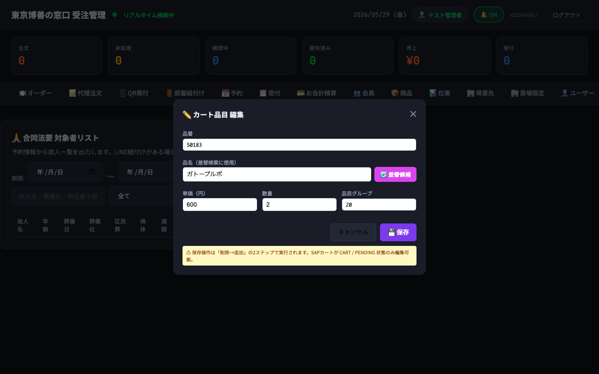

| 要素 | 内容 |
|---|---|
| `cartItemEditCode` | 品番（材料コード） |
| `cartItemEditName` | 品名 ＋「🔍 差替候補」ボタン（`searchCartItemReplace()` で品名から候補検索 → `applyCartItemReplace()` で選択） |
| `cartItemEditPrice`／`cartItemEditQty` | 単価（円）／数量 |
| `cartItemEditGroup` | 品目グループ（例: `1`） |
| キャンセル／💾 保存（紫） | `closeCartItemEditModal()`／`saveCartItemEdit()` |
| ⚠ 警告表示 | 「保存操作は**削除→追加の2ステップ**で実行されます。SAPカートが CART / PENDING 状態のみ編集可能。」 |

**注文詳細モーダル（支払先振り分け）**

| ボタン | 意味・用途 |
|---|---|
| 喪主 | 喪主まとめ払い。喪主アカウントへ紐付け、最終精算は「お会計精算」タブ |
| 現金 | その場での現金支払い |
| 売掛 | 葬儀社等への請求案件で後日精算 |
| ワンタイム | 単発の精算（イレギュラー） |

モーダルではほかに SAP 送信済ロック／SAP診断（成功・失敗・対象外の詳細）／カート明細（Condition Types: 本体価格 PP00 等）／税抜小計・税額・税込額／支払者別請求明細（payers）／合計（grandTotals）を確認できます。

> **支払割当（振り分け）は「代表品目分類」で行われます**: 旧 productGroup ベースの割当は SAP 側で「代表品目分類 "17" の支払割当が見つかりません（品目: 3579）」等のエラーになります（TOHAKU-942・PR #190 で恒久対応済み）。エラー時はハードリロード後に再振り分けで解消します（リスク A-5／C-1）。

### 4.3 📝 代理注文（panelProxy）

**この画面の意味:** LINE ミニアプリを使わない来店客や、葬儀社一括手配に対応するため、**スタッフがお客様の代わりに注文を入力する**画面。**Step 0（斎場・売上場所設定）→ Step 1（予約を選ぶ）→ Step 2（購入者を選ぶ）→ Step 3（商品を選ぶ）**の順に、前の Step を完了すると次が展開されるウィザード形式です。タブを開くと `loadHalls / loadAllMenu / loadProxyCustomers / loadReservations / loadCatalogCache` が並列実行され、`resetProxyStep1()` で初期化されます。

現行ライトテーマの Step 展開画面:

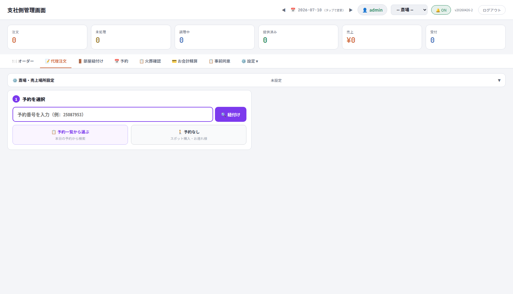

現場マニュアル版キャプチャ（Step 1 予約選択まわり）:


**Step 0: ⚙️ 斎場・売上場所設定（折りたたみ）**

| 要素 | 内容・操作 |
|---|---|
| トグルボタン | `⚙️ 斎場・売上場所設定` ＋ 現在の選択サマリ表示。押すと展開 |
| `proxySP` | 売上場所セレクタ（例: 四ツ木斎場の控室・売店・休憩室・ラウンジ・お別れ室・式場） |
| `proxySloc` | 保管場所（storage location）セレクタ（全 / 指定） |
| 💾 デフォルト保存 | この設定をログインユーザーのデフォルトとして保存（次回から自動適用） |

**Step 1: 予約を選ぶ（3方式）**

| 要素 | 内容・操作 |
|---|---|
| `proxyBookingIdInput` ＋ 🔍 紐付け | 予約番号を直接入力して紐付け（最速パス。例: `25087953`）。`lookupProxyBookingId()` |
| 📋 予約一覧から選ぶ | 予約ピッカーモーダルが開き、本日の予約から検索して選択 |
| 🚶 予約なし | スポット購入・お連れ様用（予約スキップ） |
| 選択済みバッジ | 予約選択後に表示。「✕」で解除（`resetProxyStep1()`） |

**Step 2: 購入者を選ぶ（4種。`selectPayer()` で切替）**

| ボタン | 意味 | 表示条件・挙動 |
|---|---|---|
| 🏢 葬儀社 | 葬儀社払い（売掛） | 常時。下に得意先ピッカー `proxyFuneralPicker` が展開され、得意先マスタ（葬儀社）から選択 |
| 👤 喪主 | ワンタイム払い（喪主負担） | **予約ありのみ**。ワンタイム顧客IDで識別し、お会計時に他注文と合算 |
| 🚶 お連れ様 | ゲスト払い | 常時。**SAP に即連携**（カート蓄積せず） |
| 🎓 従業員 | 従業員割引（Z001） | **予約ありのみ**。得意先ピッカー `proxyEmployeePicker` が展開 |

> **購入者区分（MVGR4）による商品制限（TOHAKU-405）**: お連れ様（guest）＝区分 `1` のみ／喪家（family）＝`1`・`2`／職員代理（staff_proxy）＝`1`・`2`・`3`。**MVGR4 空欄の商品は全購入者で表示・注文不可**（例: 斎場設備部門の在庫品「貴殯演出装置 0JA0AB08000972A-1 スモークマシン」は MVGR4 空欄のため販売対象外。TOHAKU-410）。画面フィルタの「全購入者区分」選択でも許可集合は広がりません。

**Step 3: 商品を選ぶ（フィルタとカート）**

| 要素 | 内容 |
|---|---|
| `proxyCategoryFilter` | 全カテゴリ（大分類） |
| `proxyMvgr1Filter` | 全モバイルカテゴリ（MVGR1） |
| `proxyMvgr3Filter` | 全中分類（MVGR3） |
| `proxyMvgr4Filter` | 全購入者区分（MVGR4） |
| `proxyMvgr5Filter` | 全小区分（MVGR5） |
| `proxySearchFilter` | 商品名・品番で検索 |
| `proxyLabel` | ラベル（例: 机1） |
| `proxyName` | 注文者名（任意） |
| ✕ クリア | 全フィルタクリア |
| 合計金額（オレンジ大文字） | カート合計 |
| 🍽️ 注文を送信 | `submitProxyFromStep()` — 確定するとオーダーカンバンに新規カード出現 |

> **価格未設定・0円商品は注文不可（TOHAKU-1094）**: `null`／`undefined`／空／`0` は「価格未設定」として追加・送信不可。`price=1` は「手動価格入力」のマーカーで、**2円以上**の金額を入力した場合のみ注文できます（PPR0 条件へ反映）。2026-08-02 のエンジニア改善指示で、画面フィルタに加えて `/api/admin/proxy-order`・`/api/admin/guest-order` の**サーバー側でも商品マスタを再取得して再検証**し、不正リクエストは HTTP 422（`PRODUCT_NOT_ELIGIBLE_FOR_PURCHASER`／`PRICE_NOT_CONFIGURED` 等）で拒否する方針が確定しています（リスク B-1／B-2）。

### 4.4 🚪 部屋紐付け（panelRoomAssignments）

**この画面の意味:** 売店以外の全売上場所種別（**式場・控室・休憩室・ラウンジ・お別れ室**）の部屋に予約を一時的に紐付け、紐付けの有効期限（`expiresAt`）を**ラストオーダー終了時刻**として機能させる画面。休憩室では加えて**フリードリンク（FD）制御**が発動します。紐付け中だけ LIFF でメニュー表示・注文が可能になり、未紐付け／期限切れの部屋の QR を読むと LIFF 側に「ただいまこのお部屋ではご注文いただけません」（scrNoAssign）が表示されます。

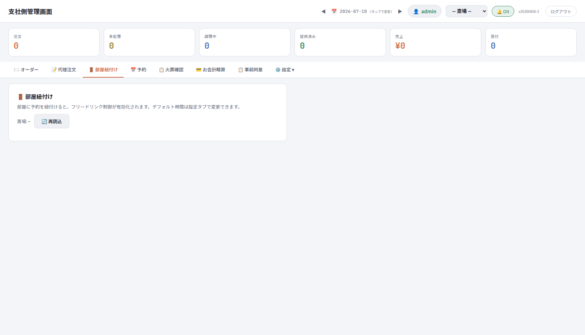

**画面の要素**

| 要素 | 内容 |
|---|---|
| 説明文 | 「部屋に予約を紐付けると、フリードリンク制御が有効化されます。デフォルト時間は設定タブで変更できます。」 |
| `raHallSelect` | 斎場セレクタ（トップバーの `globalHallSelect` と連動・優先反映） |
| 🔄 再読込 | `loadRoomAssignments()` |
| `raList` | 部屋一覧。**売上場所ごとにグルーピング**表示（グループヘッダー: 売上場所名（例: 休憩室）＋ `[FD制御]` バッジ） |
| 部屋行 | 部屋名（例: **月の間1**）／現在の紐付け（**未紐付け** or **予約ラベル＋mm:ss カウントダウン** or **期限切れ**）／アクション（`紐付け`（青）。紐付け中は `紐付け`＋`解除`（赤）の2ボタン） |

- カウントダウンは**サーバー時刻基準**（APIレスポンスの `serverTime` とのオフセットで計算。PCスリープ・時計ズレの影響を受けない）。1秒毎に再描画、30秒毎に `/api/admin/room-assignments?hallId=` を再取得。
- 該当部屋がない場合: 「この斎場にはフリードリンク制御 ON の部屋がありません」→ 斎場設定タブの売上場所設定で「ラストオーダーの対象とする」（既定 ON）または「フリードリンク予約に基づく出し分けを有効化」（`freeDrinkRuleEnabled`）を ON にして部屋を登録します。

**「紐付け」を押すと → 予約割当モーダル（raAssignOverlay）**

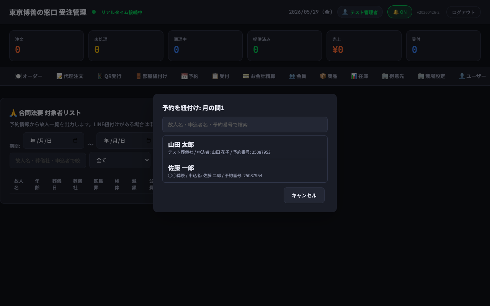

| 要素 | 内容 |
|---|---|
| 見出し | `予約を紐付け：{売上場所}/{部屋名}` |
| `raAssignPrev` | すでに紐付け中の場合のみ: 「⚠ 現在「◯◯」が紐付け中です。確定すると上書きされます。」 |
| `raAssignSearch` | 故人名・申込者名・予約番号の部分一致検索（`filterRaAssignList()`） |
| `raAssignList` | 当日予約候補（`/api/admin/reservations?hallId=...&date=YYYY-MM-DD`）。行毎に「**この予約で紐付け**」ボタン（`confirmRaAssign()`。上書き時は確認モーダル） |
| キャンセル | `closeRaAssignModal()` |

**業務フロー**

| 場面 | 手順 |
|---|---|
| ご利用開始時 | ①ご家族を休憩室へご案内する前に本タブを開く → ②該当部屋の「紐付け」→ ③当日予約から選び「この予約で紐付け」→ ④お客様をご案内し部屋QRを案内 → ⑤LIFF 起動時、予約品目に `★` があればフリードリンクメニュー、なければ通常メニューが自動で出る |
| ご利用終了時 | 部屋行の「**解除**」を押す（**確認なしで即時解除**）。解除を忘れてもデフォルト時間（**既定30分**。⚙️設定タブで変更可）で自動失効するが、その間に新規QRを読まれると「ご注文いただけません」エラーになるため**明示解除を推奨** |

**関連モーダル（斎場設定タブ起点）**

- **部屋管理モーダル**（斎場設定タブ → 売上場所行「🚪 部屋管理」）: ここで登録した部屋が本タブに表示される。

  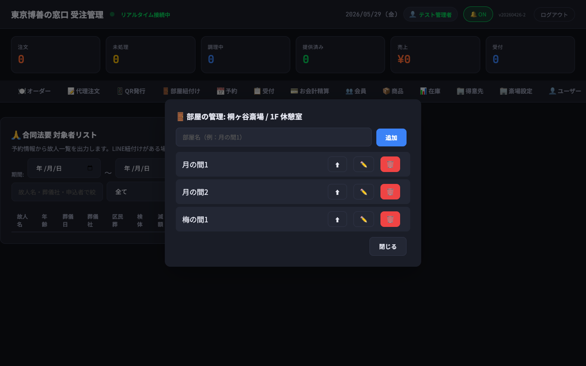

- **売上場所設定モーダル**（斎場設定タブ → 売上場所行「⚙ 設定」）: `freeDrinkRuleEnabled` を ON にしないとその売上場所配下の部屋は本タブに出ない。

  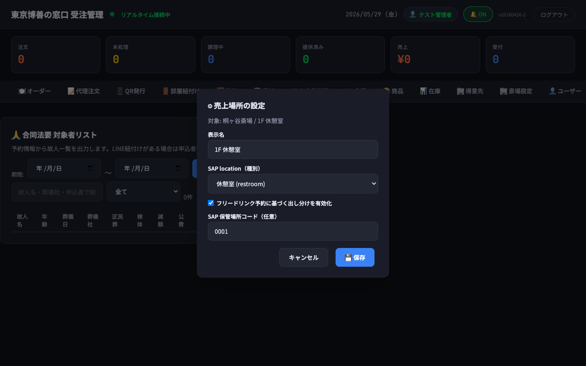

> 紐付け対象を FD 制御 ON の部屋に絞った経緯は PR #75、2026-05-31 のラストオーダー機能追加（spec `20260531-last-order-via-room-assignment.md`）で売店以外の全種別に拡大。当日予約候補取得の hallId 値揺れ問題は DIAG-043 で対応済み。

### 4.5 📅 予約（panelReservations・superadmin限定）

**この画面の意味:** テコテック予約システムから NURVE 中間サーバー経由で受信した予約を、東京博善の管理者が**参照・突合し、受付を確定する**画面。支社職員の日次業務では使用しません（スタッフには非表示）。


**ツールバー・検索**

| 要素 | 内容 |
|---|---|
| `rsvTabFrom`／`rsvTabTo` ＋ 🔍 | 期間（火葬日範囲）を指定して検索。件数は `rsvTabCount` に表示 |
| キーワード検索 | 故人名・葬儀社・予約番号 |
| ステータスフィルタ | 全て／確定済み／未確定／**区民葬**／**検体**／**減額**／**公費**／予約品目あり |
| 斎場フィルタ | 全斎場／個別（町屋・落合・代々幡・四ツ木・桐ヶ谷・堀ノ内・お花茶屋） |

**テーブル列:** 葬儀日／故人名／予約番号／葬儀社／割引／予約品目／CK状況／操作。空状態の文言は「日付を指定して検索してください」。

**行操作は「📌 確定」のみ**（TOHAKU-1185 により新規予約・CSV/Excel 取込・出力・範囲クリア・時間補完・編集・QR・手動LINE通知・削除の各ボタンは UI から撤去。受信処理と障害復旧用の関数/API は残置）。

**「確定」を押すと → 予約確定モーダル（rsvConfirmModal）**: 区民葬・献体・減額・公費のチェックと得意先コードを確認して確定します。**得意先コード未設定の予約は mado 側で編集せず**、予約連携元（テコテック/中間サーバー）と得意先マスタ設定を確認します。

> 予約品目（`reservedItems`）は商品グループ1（飲食）限定ではなく、火葬・式場・骨壺など複数グループにまたがります。確定後の受付・支払いは「💳 お会計精算」タブで処理します。

### 4.6 📋 火葬確認（panelCheckins・旧「受付」）

**この画面の意味:** 炉前・受付でいちばん使う画面。**本日の火葬予約ごとの「火葬同意」状況の確認**と**来場受付**を行います。予約は火葬時間ごとにまとまって表示されます。

予約カードが並んだ状態（現場マニュアル版・大判）:

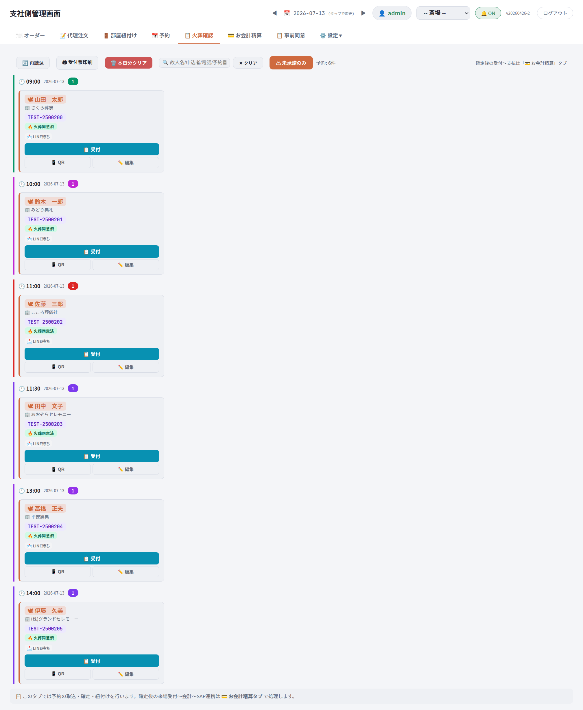

「⚠ 未承諾のみ」フィルタを ON にした状態:

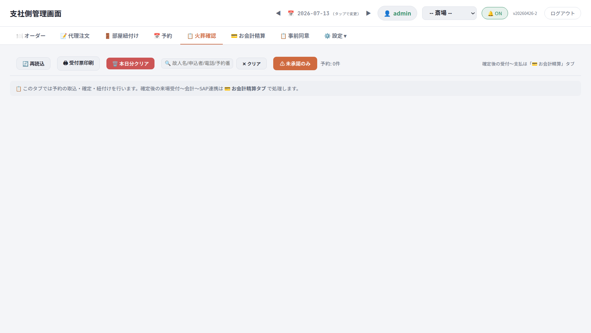

**予約カードの見方**

| 表示 | 意味 |
|---|---|
| 👤 氏名（例: 山田　太郎） | 故人名 |
| 🏢 葬儀社名（例: 幕内祭典） | 依頼元の葬儀社 |
| `TEST-2500200` 等 | 予約番号 |
| 🔥 **火葬同意済** ／ ⚠ **未同意** | 火葬同意の状況（事前同意紐付け済み or 炉前取得済みで「同意済」） |
| LINE待ち 等 | LINE連携の状況 |
| **受付** | 来場受付ボタン |
| 📱 **QR** | 予約QRの表示・カード印刷 |
| **LINE申込を検索** | LINE側の火葬申込を検索し、訂正・予約への紐付け・申込者への変更通知を行う（予約マスタは変更しない） |

**ツールバーのボタン（押すとどうなるか）**

| ボタン | 動作 |
|---|---|
| ⚠ 未承諾のみ | 火葬未同意の予約だけに絞り込み。ON中はボタンが色付き。もう一度押すと全件表示に復帰 |
| ◀ / ▶（日付） | 前日・翌日の予約へ切替（翌日以降の未同意者への事前連絡に使用） |
| 検索ボックス | 故人名・申込者名・電話番号・予約番号で絞り込み |
| 🖨 受付票印刷 | 表示中（絞り込み後）の**未承諾予約**を、QR付き受付票として1件1ページで一括印刷（喪家名フルネーム・喪家名/葬儀社名に「様」・下部に発行元と発行日） |
| 🔄 再読込 | リストの手動最新化 |
| 本日分クリア | 本日の受付状況をリセット。**要注意操作 — 原則、責任者判断でのみ実施**（リスク A-2） |

**カードのボタン**

| ボタン | 動作 |
|---|---|
| 受付 | **押すとすぐ受付完了**（確認画面なし）。受付後は「お会計精算」タブの「未受付→受付完了」へ。誤操作時は「お会計精算」の該当カード「← 精算未受付に戻す」（支払い前に限る）。**受付操作では LINE 通知は送信されません** |
| 📱 QR → 🖨 カード印刷 | 故人名・火葬日時・喪主名・ご案内文＋QR をカード形式で個別印刷し、来場者へお渡し |
| LINE申込を検索 | 受付番号・申込者名（かな）・電話番号で LINE 火葬申込を検索 → 「編集して紐づけ」→ LINE側入力の修正 → 「変更して紐づけを完了する」→ 変更・紐づけ・申込者への LINE 通知が ✅ になることを確認（§4.8 参照） |

> **件数表示の読み方**: 「四ツ木 4件（全5件中）」のような表示は「選択中の斎場で4件・全斎場で5件」の意味です。件数が合わないように見えたら、まず斎場セレクタと5件目の斎場を確認してください（リスク B-6）。

**炉前での火葬承諾取得フロー**

| # | 操作 | 確認ポイント |
|---|---|---|
| 1 | 故人名でカードを特定し、バッジで同意状況を確認 | 「同意済」なら火葬進行へ。「未同意」なら次へ |
| 2 | 「📱 QR」で受付QRを表示 | QRモーダル表示 |
| 3 | お客様のスマホで読み取っていただく | LINEミニアプリで故人情報・火葬時刻の確認 → 火葬承諾確認画面 |
| 4 | お客様が同意ボタンを押下 | バッジが「同意済」に変化 |
| 5 | 続けて申込情報を「その場で入力」or「後で入力」 | 後で入力の場合は未入力者リストでフォロー |

### 4.7 💳 お会計精算（panelPayment）

**この画面の意味:** 受付〜支払い完了までの全フェーズを**利用者（支払者）単位**のカンバンで管理する画面。受付登録・振り分け（喪主/葬儀社/お連れ様への支払先設定）・割引適用・SAP送信・支払いお知らせ（LINE）・領収書分割まで1画面で完結します。ヘッダー帯の説明は「💳 お会計精算タブ: 来場受付 → 振り分け → 割引 → SAP連携 → 支払い完了」、ボタンは「🔄 再読込」。


**カンバン4列**

| 列ID | カラム名 | 意味 |
|---|---|---|
| col-pending | ⏳ 未受付 | 予約はあるが受付前 |
| col-preparing | ✅ 受付完了 | 受付登録済み |
| col-ready | 💰 支払いお知らせ済み | 支払い案内（LINE）通知済み |
| col-completed | 🎉 支払い済み | SAP送信＆支払完了 |

> 現場向け簡略運用では「💳 会計待ち／✅ 会計完了」の2段階で覚えて構いません（会計待ち＝未受付〜支払いお知らせ済み）。当タブの状態は「📅 予約 → 📌 確定」とは独立した状態管理です。

**カードの主な操作（押すとどうなるか）**

| ボタン | 動作 |
|---|---|
| 支払い準備完了 | **この時点で SAP へ受注登録（sapCartComplete）**。振り分け（代表品目分類→支払者の `pgToPayer` マップ）に基づき明細が支払者別に確定 |
| ▼ 詳細 → 精算QR発行 | SAP登録が正常完了した場合のみ表示。押すと価格確認画面（priceSimModal）→ 精算QR発行（東芝テック自動精算機で読み取り）。QR表示モーダルは `qrModalName`／`qrModalSub`／`qrModalBox`／`qrModalStatus` |
| 🏷 割引設定 | 手動割引設定モーダル（下記） |
| 🧾 領収書分割 | 領収書分割設定モーダル（下記） |
| ✏️ 編集 | カート品目編集モーダル（§4.2 参照） |
| 支払いお知らせ | お客様のLINEへ支払額を通知 → 「支払いお知らせ済み」列へ |
| 会計完了 | 支払確認後に押下 → 「支払い済み」列へ |
| ← 精算未受付に戻す | 誤受付の取り消し（支払い前のみ） |

**🏷 手動割引設定モーダル（discountModal）**

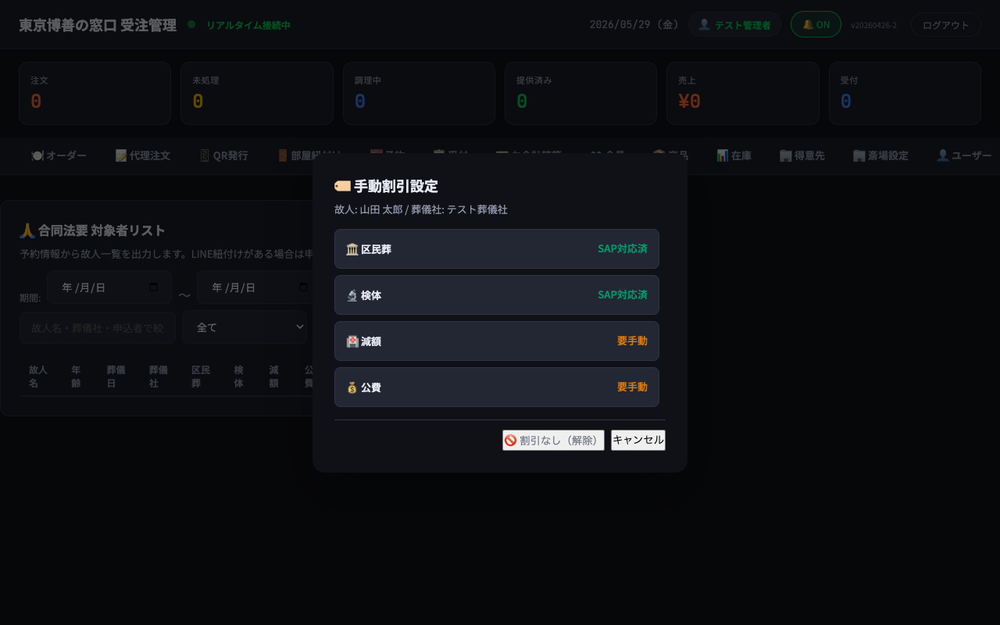

| 要素 | 内容 |
|---|---|
| `discountModalSub` | 対象予約のサブ情報（故人名等） |
| `discountTypeList` | 割引種別の選択リスト — **区民葬・検体・減額・公費**など。葬儀社マスタ（得意先）の割引フラグと連動し対応可否を表示 |
| 🚫 割引なし（解除） | `setDiscount(null)` |
| キャンセル | `closeDiscountModal()` |

> 割引種別は「📅 予約」タブの予約確定モーダル（rsvConfirmModal）でも設定できます。「📋 火葬確認」タブでは区民葬等の状態は変更しません。SAP 上の価格条件は社員割引 **Z001**・キャッシュバック（業者バック）等の Condition Types で処理されます。

**🧾 領収書分割設定モーダル（receiptSplitModal）**

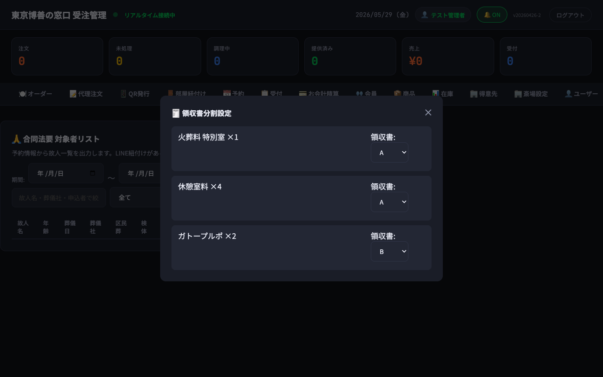

- 各品目行（`{lineNumber, name, productGroup, quantity, receiptGroup}`）に **receiptGroup（A/B/C など）**を割り当て、同じグループの品目をまとめて1枚の領収書として発行します（1注文を複数受領者に分配）。

**⚠ SAP受注エラー詳細モーダル**

- 起動元: 注文カードの「⚠ SAP失敗」バッジ／ヘッダー帯の「⚠ 失敗」チップ。
- 内容: SAP 応答（HTTP ステータス＋メッセージID＋本文）を全文確認 →「この注文だけ再送」または「↻ 失敗分を一括再送」。必要ならカート品目編集で品目修正後に再送します。

### 4.8 📋 事前同意（panelPreConsents）

**この画面の意味:** LIFF 側「scrPreInfo」から送信された**事前同意（火葬申込）**のデータを一覧表示し、対応する予約と紐付ける画面。「火葬当日に未同意者・未紐付者を探す」用途にも使います。火葬申込時には**受付番号（`YYMMDD-0001` 形式）**が発番され、LINE 確認メッセージと一覧に表示されます（PR #66）。


**ツールバー（検索・絞り込み）**

| 要素 | 内容 |
|---|---|
| `pcStatusFilter` | 全て／**未紐付け（初期選択）**／紐付け済み |
| `pcDateFrom`／`pcDateTo` | 期間（火葬日） |
| 絞り込み入力 | LINE火葬申込の**全入力項目**（受付番号・火葬日・斎場・故人/申込者の氏名・かな・電話番号・メール・郵便番号・住所・続柄・同意状態）の部分一致。**ひらがな/カタカナどちらでも検索可** |
| 🔍 検索 | `loadPreConsents()` |

カナ検索の例（「やまだ」「ヤマダ」どちらでも同一結果）:


**テーブル列:** 受付番号／火葬日／斎場／故人名／申込者名／電話番号／同意／状態／操作。

- **自動紐付け**: 予約取込時に「火葬日・斎場・故人名・喪家名かな」の完全一致で自動紐付け（7/31 開発定例では「火葬日＋故人名＋葬儀社名＋斎場ID」の4条件と整理。§12 検証パス1参照）。
- 「検索対象が上限に達しています」と出たら火葬日か斎場で絞り込み（Firestore インデックス節約設計の上限。リスク E-7）。

**「紐付け」を押すと → 予約紐付けモーダル（pcLinkOverlay）**

| # | 操作 | 確認ポイント |
|---|---|---|
| 1 | 該当行の「紐付け」→ `pcLinkInfo` で対象の事前同意情報・火葬日・斎場・喪家名かなを確認し「火葬予約を検索」 | `pcLinkCandidates` に未紐付けの火葬予約候補が一覧表示 |
| 2 | 火葬日・斎場・故人名・喪家名かなが一致する行に「**完全一致候補**」表示 | **完全一致でも自動確定はされない**（職員が確認して選択） |
| 3 | 「LINE申込を編集して紐づける」を押下 | LINE側入力内容の確認・訂正画面。必須項目（申込者姓名・電話・郵便番号・住所・続柄）は空にできない |
| 4 | 内容を確認・訂正し「変更して紐づけを完了する」 | 変更されるのは **LINE申込情報のみ**（予約マスタは変更されない）。編集後4項目が予約と不一致の場合、サーバーが紐づけを停止 |

> 逆方向（予約→LINE申込）は「火葬確認」タブの「LINE申込を検索」から（§4.6）。別のLINE利用者を指すデータは送信前に停止／同時更新時は再検索を要求／通知失敗時は紐づけ結果を維持し「LINE通知だけ再実行」（同一内容は重複排除）。一致する申込がない場合は申込者へ新規登録QRを案内します。

画面下部には「⚠ 火葬未同意の予約（LINE 事前同意 未入力）」一覧が表示され、当日の未同意者を確認できます。

### 4.9 ⚙️ 設定ドロップダウン（マスタ系・superadmin限定）


| メニュー | パネルID | 意味・用途 |
|---|---|---|
| ⚙️ 初期設定 | settings | リッチメニュー設定／Webhook／会員登録API／管理連携API／SAP連携設定（有効/無効切替）／イベントログ／外部APIキー発行／場所・部屋設定（部屋紐付けのデフォルト時間=既定30分）／味バリエーション設定 |
| 👥 会員 | members | LINE会員マスタ（注文履歴・来店経過・葬儀日設定・AC/受付モード切替） |
| 📦 商品 | products | SAP商品マスタの全同期・差分同期・DB削除、プラント別フィルタ、品番・状態管理 |
| 📊 在庫 | inventory | ⚠ **既知の不具合により現在動作しません**（リスク E-5） |
| 🏢 得意先 | customers | 葬儀社・得意先マスタ（区民葬/検体/減額/公費の割引フラグ、「予約なし」代理注文・葬儀社払いの支払先） |
| 🏛️ 斎場設定 | halls | 斎場／保管場所（storage location）／売上場所／商品紐付け／部屋管理／ジオフェンス設定 |
| 👤 ユーザー | users | 管理者ユーザーの作成（ロール・許可斎場・デフォルト売上場所）・ログインキー発行 |
| 📱 QR発行 | qr | オーダー用QRと事前同意QRの生成・印刷（下記） |

### 4.10 設定配下の各マスタ画面（画面別）

**⚙️ 初期設定（settings）** — リッチメニュー切替（受付フェーズ⇄アフターケアフェーズ。`dailyMenuCheck` Cloud Function が葬儀日翌日に自動切替）、Webhook、SAP連携の有効/無効、イベントログ、外部APIキー管理:

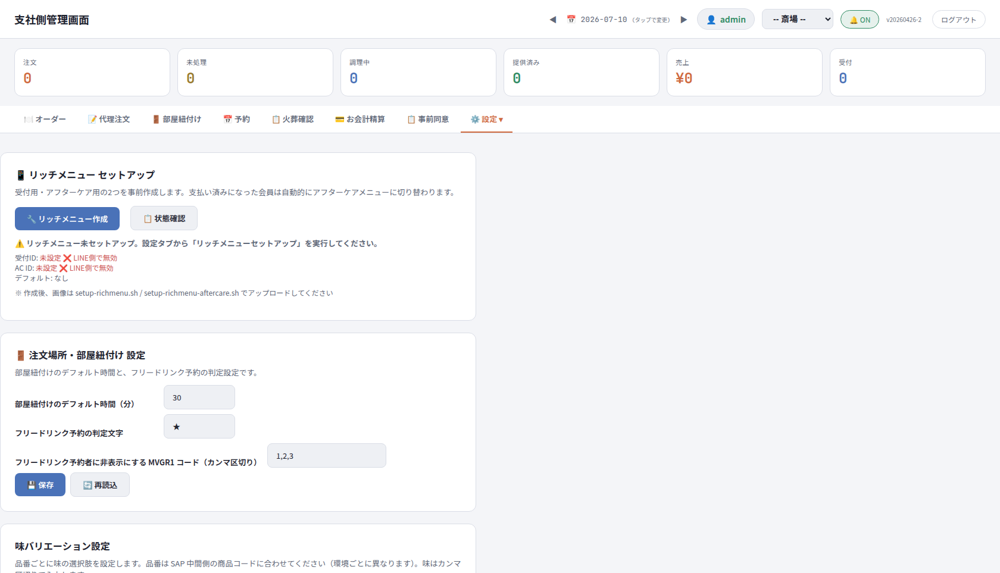

**🏛️ 斎場設定（halls）** — 7斎場のマスタと、斎場ごとの保管場所・売上場所・商品紐付け。売上場所行の「⚙ 設定」で売上場所設定モーダル（`freeDrinkRuleEnabled`・「ラストオーダーの対象とする」）、「🚪 部屋管理」で部屋管理モーダルを起動（§4.4）:

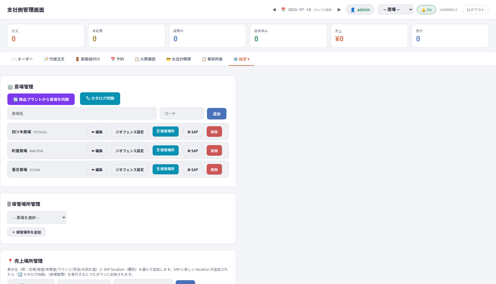

**📦 商品（products）** — SAP商品カタログの同期状況・プラント（斎場）別フィルタ・品番/状態管理。分類は 大分類／MVGR1（モバイルカテゴリ）／MVGR2（商品分類。未取込は「（マスタ未取込）」表示）／MVGR3（中分類）／MVGR4（購入者区分）／MVGR5（小区分）:

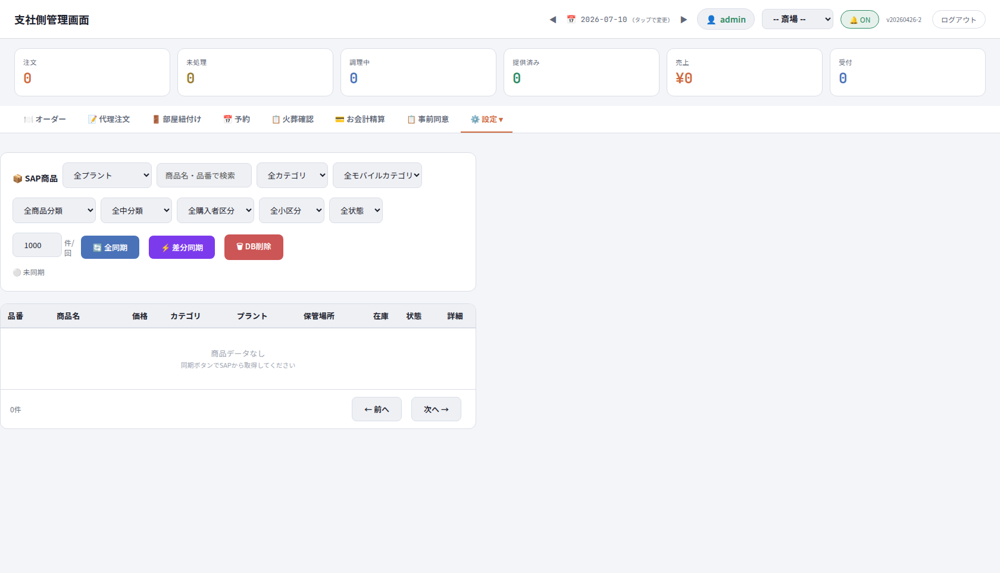

**📱 QR発行（qr）** — 2種類のQRを発行:


| QR | 用途・手順 |
|---|---|
| オーダー用QR | 斎場を選択（既定: 町屋斎場）→ 売上場所をプルダウン選択 → ラベル入力（例: 机1、A-3）→「QR生成」→ 印刷して対象場所（机上・メニュー裏等）に設置。場所専用QRのため読み取ると該当売上場所のメニューが開く |
| 事前同意QR | 全申込者共通の固定QR。**東博様→各葬儀社へ配布**し、商談時・印刷物で申込者が読み込む。`mode=pre` で LIFF が事前同意モード起動。「PNG保存」「印刷」ボタンあり |

> **精算QRとの違いに注意**: 「QR発行」タブは**部屋QR／共通QR**用。受注ごとの**精算QR**は「💳 お会計精算」タブの「支払い準備完了 → ▼詳細 → 精算QR発行」から発行します（取り違えると精算機で読めません）。

---

## 5. LINEミニアプリ（お客様向け）

### 5.1 画面一覧と遷移

全15画面。起動時 URL パラメータ（`hallId`/`spId`/`roomId`/`rsvId`/`skip`/`mode`/`page`/`loc`）と会員状態で自動ルーティングされます（`public/index.html` の初期化処理）。

| # | 画面ID | 画面名 | 表示条件 |
|---|---|---|---|
| 1 | scrLoad | 読み込み中 | 起動直後（LIFF初期化） |
| 2 | scrFriend | LINE友だち追加 | 公式アカウント（OA 2009733008）未追加 |
| 3 | scrNoQr | QR未読取 | QRパラメータ無しで起動（ジオフェンス該当なし/エラー含む） |
| 4 | scrNoAssign | 部屋未紐付け | 部屋割当待ち・期限切れ（§4.4 の部屋紐付けと連動） |
| 5 | scrPickHall | 斎場選択 | ジオフェンスで複数斎場ヒット |
| 6 | scrRegister | 規約同意（ご利用にあたって） | 新規 or 未同意 |
| 7 | scrProfile | 申込者情報入力 | 申込者情報未入力 |
| 8 | scrPreInfo | 事前同意フォーム | `page=preconsent`（事前同意QR・`mode=pre`）でアクセス |
| 9 | scrPreComplete | 事前同意完了 | 事前同意送信完了 |
| 10 | scrCheckin | チェックイン（ホーム） | 会員確定後の起点 |
| 11 | scrFeeCheck | 料金確認（喪主払い分） | 喪主払い品目あり |
| 12 | scrOrder | 注文メニュー | チェックイン完了後 |
| 13 | scrConfirm | 注文確定 | 注文確定送信後 |
| 14 | scrHistory | 注文履歴 | フッターナビ「履歴」 |
| 15 | scrMyCart | 予約カート | フッターナビ「予約カート」（予約カート可視時のみ） |

```
scrLoad ─┬─[QRなし]───────▶ scrNoQr
         ├─[友だち未追加]──▶ scrFriend
         ├─[page=preconsent]▶ scrPreInfo ─▶ scrPreComplete
         └─[QRあり]─┬─[複数斎場]──▶ scrPickHall ─┐
                     ├─[新規/未同意]▶ scrRegister ─▶ scrProfile ─▶ scrCheckin
                     └─[既存会員]──▶ scrCheckin（部屋未割当なら scrNoAssign）
scrCheckin ─▶ (scrFeeCheck) ─▶ scrOrder ─▶ scrConfirm
フッターナビ: 🏠ホーム / 🍽️オーダー / 🧾予約カート / 📜履歴 / 📢公式（外部LINEへ）
※ scrRegister/scrProfile/scrLoad/scrFriend/scrPreInfo/scrPreComplete/scrFeeCheck/scrNoQr/scrNoAssign ではフッターナビ非表示
```

**Phase 1 で確定済みのフロー仕様（7/22・7/31 議事録）**: ①LINE友だち追加をフローの最初に移動（従来は追加後にトップへ戻る導線が不自然だったため）②QR読取後・同意画面前に「この方の火葬申込に進んで問題ないか」の確認画面（故人情報・火葬時刻表示）を追加 ③テコテック新予約システムリプレイス後は喪主の携帯番号を直接取得できるため、仮申込リンクの送付を現行の葬儀社経由共通QRから **SMS 送付**へ変更予定。

### 5.2 主要画面の意味とスクリーンショット

**scrFriend — LINE友だち追加**: 公式アカウント未追加の場合、フローの最初に友だち追加を促します。


**scrRegister — 規約同意（ご利用にあたって）**: 利用規約への同意。文言は旧「ようこそ！」から「ご利用にあたって」へ変更・🎉アイコン削除済み。配色は旧・緑/ポップ調から東京博善ブランドカラー（白/紫）へ変更済み（Notion タスク TD-3425）。


**scrProfile — 申込者情報入力**: 申込者（喪主・喪家）の氏名・かな・電話・住所・続柄等を入力。事前同意フローでは必須項目を空にできません。

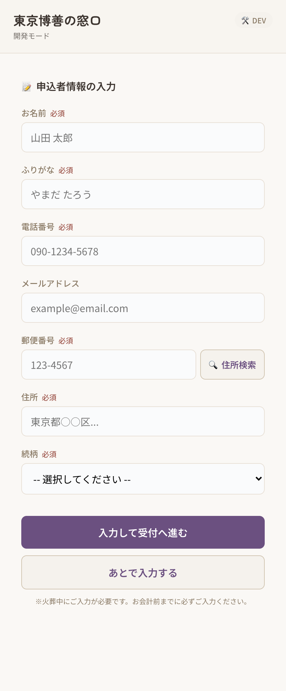

**scrPreInfo — 事前同意フォーム**: 葬儀社配布の事前同意QR（`mode=pre`）から遷移。火葬日前に同意内容確認と申込者情報を入力し送信 → scrPreComplete（完了画面）→ 受付番号 `YYMMDD-0001` が LINE 確認メッセージで届きます。


**scrPickHall — 斎場選択**: リッチメニュー等 QR なし起動時、位置情報（ジオフェンス）で複数斎場にヒットした場合に、町屋・落合・代々幡・四ツ木・桐ヶ谷・堀ノ内・お花茶屋から選択します。


**scrCheckin — チェックイン（ホーム）**: 会員確定後のホーム。受付状態・お席（売上場所/部屋）の確認。当日QR読取時は故人情報と火葬時刻を確認してから同意画面へ進みます。


**scrFeeCheck — 料金確認（喪主払い分）**: 喪主払いに振り分けられた品目（予約品目＋モバイルオーダー）の金額を、お支払い前にお客様が確認する画面。管理画面「お会計精算」の振り分け結果（pgToPayer）と対応します。


**scrOrder — 注文メニュー**: 売上場所別メニュー。カテゴリ絞り込み → カート → 注文確定。部屋紐付け中の休憩室では予約品目に `★` があるとフリードリンクメニューが自動表示されます（§4.4）。


**scrConfirm — 注文確定**: 注文完了画面。以後 LINE 通知（①注文受付 ②提供完了 ③会計完了）が届きます。


**scrHistory — 注文履歴**: 過去の注文一覧。


**scrMyCart — 予約カート**: 予約品目（火葬・式場・骨壺など reservedItems）の確認。


### 5.3 お客様操作フロー

**モバイルオーダー**: 設置QR読込 → 受付完了画面でお席確認（売店・控室等） → メニューで商品選択（カテゴリ絞り込み可） → 「注文を確定する」（注文受付LINE通知） → 提供（提供完了通知） → その場払いはスタッフへ支払い（会計完了通知）。

**事前火葬同意（火葬日前）**: 葬儀社配布QR読込（`mode=pre`） → 同意内容確認 → 申込者情報入力 → 送信 → 完了画面（受付番号発番）。

**炉前での火葬承諾（当日）**: スタッフ提示の受付QR読込 → 故人情報・火葬時刻の確認 → 同意ボタン → 申込情報を「その場で入力」or「後で入力」。

---

## 6. シナリオ別 操作フロー

### シナリオA: 売店でその場支払い

| # | 誰 | 操作 |
|---|---|---|
| 1 | お客様 | 売店QRを読込 → 飲料を選択して注文確定 |
| 2 | スタッフ | 即時提供品のため「提供済み」を直接押下（LINE提供完了通知） |
| 3 | スタッフ | 飲料を提供 → PDAで売上計上 → 「→ お会計準備完了」 |
| 4 | スタッフ | 注文詳細で支払先「現金」を選択 → 現金受領 → 「お会計済み」（LINE会計完了通知） |

### シナリオB: 控室で喪主まとめ払い

| # | 誰 | 操作 |
|---|---|---|
| 1 | スタッフ | 「🚪 部屋紐付け」で控室の部屋と予約を紐付け（§4.4） |
| 2 | お客様 | 控室QRから複数回注文 |
| 3 | スタッフ | 「調理開始」→提供→「提供済み」→PDA計上→「→ お会計準備完了」 |
| 4 | スタッフ | 注文詳細で支払先「喪主」を選択（**「お会計済み」は押さない**） |
| 5 | スタッフ | 「💳 お会計精算」でまとめて精算（支払い準備完了→SAP登録→精算QR→会計完了）。お客様は scrFeeCheck で喪主払い分を確認可能 |

### シナリオC: 事前同意完了パターン

事前同意QRで入力済み（受付番号発番） → 自動/手動で予約紐付け → 当日「火葬確認」でバッジ「同意済」を確認 → 追加操作なしで火葬進行。

### シナリオD: 炉前で承諾取得（その場入力）

「火葬確認」で未同意カードを特定 → 「📱 QR」提示 → お客様が読込・故人情報確認・同意・申込情報入力 → バッジ更新を確認。

### シナリオE: 炉前で承諾のみ・後で入力

同意後「後で入力」を選択 → スタッフが業務時間中に未入力者リストを確認 → 声かけして本人入力 or 代行入力。

### シナリオF: 割引・キャッシュバックを含む会計（参考: SAP検証ケース）

STG では実際の SAP 検証で次の代表ケースを通しています。会計時の考え方の参考にしてください。

| ケース | 内容 | 支払パターン |
|---|---|---|
| P0-1 | 予約費用のみ | 葬儀社払い（売掛） |
| P0-2 | 予約＋モバイルオーダー合算 | 喪主＋葬儀社の分割（領収書分割） |
| P0-3 | モバイルオーダー複数明細 | 喪主 |
| P0-4 | 値引（社員割 Z001） | 葬儀社払い |
| P0-5 | キャッシュバック（業者バック） | 葬儀社払い |

---

## 7. 権限（ロール）一覧

| ロール | 表示名 | 主な権限 |
|---|---|---|
| `superadmin` | 管理者 | 全権限＋ユーザー管理＋「📅 予約」＋「⚙️ 設定」ドロップダウン |
| `staff` | スタッフ | 通常運用（オーダー/代理注文/部屋紐付け/火葬確認/お会計精算/事前同意）。「予約」「設定」は非表示 |
| `cc_sv` | CC SV | コールセンターSV（CRM全件＋割振解除） |
| `cc_staff` | CCスタッフ | コールセンター（自分＋未割当） |
| `label_agent` | ラベル担当 | ラベル（サブチケット）業務のみ |

ユーザーごとに「許可斎場（空＝全斎場）」「デフォルト売上場所」を設定可能。認証は3系統（管理画面セッション／LIFF／外部APIキー）。

---

## 8. トラブルシューティング Q&A

| 症状 | 原因と対応 |
|---|---|
| 一覧に何も表示されない（「該当なし」） | 上部の**日付**が対象日か確認。◀/▶で移動。斎場セレクタも確認 |
| 注文がカンバンに出ない | 「リアルタイム接続中」表示を確認→再読込。日付・斎場フィルタ・通知OFFも確認。お客様側の通信エラーなら再送依頼 |
| LIFF に「ただいまこのお部屋ではご注文いただけません」 | 部屋が未紐付け or 紐付け期限切れ。「🚪 部屋紐付け」で該当部屋に予約を紐付け（§4.4） |
| 「未承諾のみ」を押したら件数が減った | 絞り込みが効いている状態。もう一度押すと全件表示 |
| 件数が「4件（全5件中）」等で合わない | 「表示件数＝選択斎場／括弧内＝全斎場」の仕様。5件目が別斎場でないか確認（リスク B-6） |
| カナで検索しても出ない | 事前同意タブは故人名ふりがな対応。漢字/ひらがな/カタカナで試す。出なければふりがな未登録の可能性 |
| 「検索対象が上限に達しています」 | 火葬日または斎場で絞り込んでから再検索 |
| 「精算QR発行」ボタンが見当たらない | 「支払い準備完了」まで進め、SAP登録完了後に「▼ 詳細」内に表示される |
| SAP受注が「失敗」／「代表品目分類 "XX" の支払割当が見つかりません」 | ハードリロード（Ctrl+Shift+R）で最新 admin.html を読み込み → 再振り分け → 「↻ 失敗分を一括再送」。エラー全文は「⚠ SAP受注エラー詳細」モーダルで確認。繰り返す場合はシステム担当へ（TOHAKU-942 系） |
| お連れ様注文で `sapStatus:"error"`・`sapOrderNos` 空 | SAP受注自体は成立している既知バグ。止まらず受注番号の記録を優先（リスク C-2） |
| LINE通知が届かない | 友だち登録・お客様側の通知設定を確認。**LINEブロックと受信停止は別物**（リスク C-5）。1分以上遅延したら管理者へ |
| QRが読み取れない | 汚損・反射→再発行印刷。スマホ側→再起動。期限切れ→新規発行。**部屋QRと精算QRの取り違え**も確認 |
| PDA売上計上エラー | PDA通信確認→再試行。SAP一時障害→注文詳細のSAP診断確認・再送。二重計上に注意 |
| 操作を間違えた／画面が固まった | 「🔄 再読込」→ 改善しなければブラウザ再読み込み |
| 誤って受付した | 「お会計精算」タブの該当カード「← 精算未受付に戻す」（支払い前のみ） |
| 在庫タブを開くとエラー | 既知の不具合（リスク E-5）。使用しない。Phase 1 は在庫非依存運用 |
| 予約の得意先コードが未設定 | mado 側で予約を編集しない。予約連携元（テコテック/中間サーバー）と得意先マスタ設定を確認（§4.5） |

---

## 9. リスク台帳 — 網羅的リスク分析と対策

本章は、UAT 指摘（東博UAT 2026-07〜08）・Backlog（TOHAKU-405／410／634／888／910／942／944／953／959／973／1022／1067／1071／1072／1073／1079／1094／1185）・エンジニア改善指示（2026-08-02）・議事録・Slack 共有事項から抽出したリスクを 6 カテゴリ・31 項目に棚卸しし、**現場対処（今日からできること）**と**恒久対策（システム/プロセス対応）**に分けて整理したものです。影響度: ◎=重大（誤販売・金銭・個人情報）／○=業務影響／△=限定的。

### A. 業務運用リスク

| ID | リスク | 影響度 | 根拠・経緯 | 現場対処 | 恒久対策・状態 |
|---|---|---|---|---|---|
| A-1 | 喪主まとめ払いの注文で誤って「お会計済み」を押下し、最終精算から漏れる／二重請求 | ◎ | Phase1 マニュアル 2.2.6 | 支払先「喪主」の注文は「お会計準備完了」で止める運用を朝礼で徹底。シナリオB を教育資料に使用 | 支払先=喪主のカードで「お会計済み」押下時に警告表示（改善要望） |
| A-2 | 「本日分クリア」の誤操作で当日の受付状況が全リセット | ◎ | Phase1 マニュアル 2.3.3 | 原則、責任者判断でのみ実施 | ボタンの権限制限（superadmin限定化）・二段階確認（改善要望） |
| A-3 | 「受付」ボタンの誤押下（確認画面なしで即確定）／部屋紐付け「解除」の誤押下（確認なしで即時解除） | ○ | 現場マニュアル 4-7・admin-manual 04 | 受付は「← 精算未受付に戻す」で復旧（支払い前のみ）。解除誤操作時は再紐付け | 確認ダイアログ追加を検討 |
| A-4 | 通知音OFF・リアルタイム接続切断による注文見落とし→提供遅延 | ○ | Phase1 マニュアル 5.1 | §3 始業時チェックリスト（🟢接続中・🔔ON・日付・斎場）を運用 | 接続断の視覚アラート強化（改善要望） |
| A-5 | ブラウザにキャッシュされた旧 admin.html での操作による不具合再発（例: 旧 productGroup 割当で SAP 登録失敗） | ◎ | TOHAKU-942（#3: checkinId `Mth0d9A5xvQlYGKsjeZ1`／#4: `ZWNMT3qMNHsjVO2ogfjq`、2026-07-21 発生）・PR #190 | リリース後・障害後はハードリロード（Ctrl+Shift+R）し、ヘッダーの build 表示（例: STG/951d4df）を確認 | キャッシュバスティングの強化・バージョン不一致警告（改善要望） |
| A-6 | 日付・斎場フィルタの誤設定による「表示されない」誤認 | △ | 現場マニュアル Q&A | Q&A 参照。始業時チェックリスト | — |
| A-7 | LINE 非対応のお客様・システム障害時の紙運用（火葬承諾書）フォールバック未整備 | ○ | 7/31 開発定例（未確定事項） | 当面は従来の紙運用を併用できるよう受付に用紙を常備 | 例外時の紙・代理入力手順、データ保存期間・出力要否を Phase1 運用引継ぎ（8/9）までに確定 |
| A-8 | 「予約なし（お連れ様）」注文の運用ルール未確定（対象ケース・個別会計の可否・後からの予約紐付け・操作権限）／部屋紐付けの解除忘れ（既定30分で自動失効するが、その間の新規QRはエラー） | ○ | 現場マニュアル 5-1・admin-manual 04 | 判断に迷うケースは責任者へエスカレーション。部屋利用終了時の明示解除を徹底 | 運用側と確定次第マニュアル追記（確認中） |

### B. データ品質リスク

| ID | リスク | 影響度 | 根拠・経緯 | 現場対処 | 恒久対策・状態 |
|---|---|---|---|---|---|
| B-1 | 購入者区分（MVGR4）が強制されず、お連れ様に喪家専用（`2`）・代理限定（`3`）・区分空欄の商品が表示・注文可能 | ◎ | 東博UAT: 四ツ木斎場・控室・予約なし・お連れ様で 3,126 件表示（MVGR4 `1`=193件・`2`=4件・`3`=26件ほか）。TOHAKU-405 | 代理注文時はスタッフが購入者区分を意識し、疑わしい商品は販売しない | guest={1}／family={1,2}／staff_proxy={1,2,3}／空欄=常に不可 のポリシーを共通モジュール（`functions/proxy-order-policy.js`）化し、画面4箇所＋`/api/admin/proxy-order`・`/api/admin/guest-order` のサーバー側で再検証、違反は HTTP 422 `PRODUCT_NOT_ELIGIBLE_FOR_PURCHASER`（改善指示 2026-08-02。実装中） |
| B-2 | 価格未設定・0円商品が追加・送信可能（合計0円でも送信ボタン有効） | ◎ | 東博UAT: 価格未設定 1,684 件が表示され `＋` で数量増加可能。TOHAKU-1094 | 0円・価格なし商品は登録しない。気づいたら商品部（商品担当）へ連絡 | `null/undefined/空/0`→`PRICE_NOT_CONFIGURED`、`price=1`＝手動価格マーカー（2円以上入力時のみ可）、負数→`INVALID_PRICE`。画面 disabled＋サーバー 422。拒否時は注文 doc・SAP 送信・通知を 0 件にするテスト必須 |
| B-3 | 内部用・販売対象外商品が購入者一覧に露出（例: 貴殯演出装置 `0JA0AB08000972A-1` スモークマシン＝斎場設備部門の在庫品） | ◎ | TOHAKU-410 | 発見時は注文せず商品部へ報告 | 商品名ブラックリストでは対応しない（誤適用リスク）。MVGR4 空欄・`available=false`・販売不可属性・plant/storage location 不適合で除外 |
| B-4 | 旧mado商品と SAP 商品の二重表示（同一商品の重複カード） | ○ | 現行実装が配列結合のため | 同名カードが2枚ある場合は SAP コード表示のある方を使用 | canonical key＝`normalize(plant)+':'+normalize(sapItemCode)` で統合。名称のみでの自動統合は禁止。属性競合時は注文不可＋監視ログ |
| B-5 | 商品分類フィルタの意味が未確定（「全商品分類」=MVGR2 で未取込は「（マスタ未取込）」表示、MVGR5 が中間サーバー改修で空に） | △ | TOHAKU-634／1072／1073（KSD 回答待ち・業務判断中） | フィルタ名を独自解釈しない。「（マスタ未取込）」は既存仕様 | 回答確定まで MVGR5→MVGR2 のハードコード読み替え・フィルタ名変更を行わない。PR #212（「該当商品なし」診断表示）は回答待ちのままマージしない |
| B-6 | 火葬確認の件数表示「4件（全5件中）」を不具合と誤認 | △ | NP-02。`renderReservations()` は表示件数=選択斎場・括弧内=全斎場 | 斎場セレクタと5件目の `hallId` を確認 | 5件目が同一斎場なのに除外されている場合のみ別課題化（データ確認前のコード変更禁止） |
| B-7 | 事前同意の自動紐付け不一致（入力の斎場名・日付・故人名が予約と不一致） | ○ | Phase1 マニュアル 2.7.3・7/31 定例 | 炉前で受付QRから再取得、または事前同意タブで手動紐付け | 完全一致でも自動確定しない現仕様を維持（誤紐付け防止）。SMS 導線化（テコテック新予約後）で入力品質を改善 |
| B-8 | 本番の予約件数不一致（例: 50件 vs 55件） | ○ | 7/8 MO定例 ToDo #5 | 日付・斎場・取込時刻を確認して報告 | 本番環境でデータソース（中間サーバー取込）と突合し原因特定（調査タスク） |

### C. 外部連携リスク

| ID | リスク | 影響度 | 根拠・経緯 | 現場対処 | 恒久対策・状態 |
|---|---|---|---|---|---|
| C-1 | SAP 受注登録失敗の残留（支払割当が旧 productGroup 基準で作成され「代表品目分類 "17"/"14" の支払割当が見つかりません（品目: 3579/3709）」等） | ◎ | TOHAKU-942（2026-07-21 14:20/14:53 JST 発生）・PR #190 で代表品目分類ベースへ修正済み | ハードリロード→再振り分け→「↻ 失敗分を一括再送」。数分で解消 | #190 適用済み。再発時は checkinId・エラー時刻・SAPレスポンスを添えて報告 |
| C-2 | お連れ様注文で `sapStatus:"error"`・`sapOrderNos` 空が返るが SAP 受注は成立（ステータス不整合） | ○ | 既知バグ（7/27 正式手順書） | 止まらず SAP 受注番号の記録を優先。二重登録を避けるため再送前に SAP 受注サマリー（`GET /api/admin/sap-order/{受注番号}/summary`）で確認 | ステータス整合の修正（バックログ） |
| C-3 | 自動精算機（東芝テック／ユニコ）連携の未確定領域（対応支払方法・二重会計防止・精算失敗時の対応） | ◎ | TOHAKU-944／877 精算機検証・現場マニュアル 7-3 | 精算失敗時は精算機で二重操作せず、受付番号・SAP受注番号を控えて責任者へ | 9月リリースの決済/自動精算機連携はベンダー（ユニコ）確認を前提に仕様確定。検証完了までマニュアルに暫定運用を明記 |
| C-4 | 予約データ取込（中間サーバー・毎朝CSV/API）の失敗・遅延で当日予約が表示されない | ◎ | アーキテクチャ上の単一依存点 | 「予約」タブで件数確認 → 出ていなければシステム担当連絡（TOHAKU-1185 以降、現場での CSV 手動取込 UI は撤去済み） | 取込失敗アラートの整備（改善要望）。テコテック新予約システム移行（9月）時の再結合テスト |
| C-5 | LINE ブロックと配信停止（受信停止）の混同による「通知が届かない」誤対応 | △ | 260703 内部MTG「LINEブロックと受信停止は別物」 | 通知未達時は友だち状態・ブロック状態・通知設定を切り分けて確認 | 会員詳細に到達可否（`lineReachable`）表示の活用 |
| C-6 | 管理API のエラー残留（例: `GET /api/admin/checkin/{id}/summary` が 400 を返し続ける事例） | △ | 2026-08-04 STG 画面のコンソールで `WlgYanzt8hqDWvqVMS4h` に対し 400 連発を確認 | 画面動作に支障がなければ業務続行。再現条件をメモして報告 | 対象 checkin データの整合性調査・エラーハンドリング改善 |
| C-7 | 検証環境専用ミニアプリ未設定期間に、LINE アプリから開くと本番環境へ接続 | ○ | 7/10 Slack（Mario Yi 氏の案内） | STG の画面確認はブラウザの `?preview=` を使用。実機テストはテスト用QRで | 検証環境用ミニアプリ（LIFF）の分離設定 |
| C-8 | SAP 中間サーバー（`saptest-staging.nurve.jp`）・SAP 検証環境の障害/認証キー未共有で検証が止まる | △ | 7/22 Slack 手順 | 中間サーバー担当（NURVE 山本様）へ確認 | 認証キーの引き継ぎ管理・障害時連絡フローの明文化（F-1 と連動） |

### D. セキュリティ・権限・個人情報リスク

| ID | リスク | 影響度 | 根拠・経緯 | 現場対処 | 恒久対策・状態 |
|---|---|---|---|---|---|
| D-1 | 認証情報の共有チャネル逸脱（STG の ID/パスワードが Slack・Teams に平文で共有された実績、外部APIキー発行画面のスクリーンショットが Drive に保存された実績） | ◎ | 2026-07-08 Slack／Teams、2026-08-04 Drive「APIキー mado.png」 | 認証情報は DM のみで受け渡し。スクリーンショットに APIキー・トークンを写さない。写ってしまったら即削除依頼 | 該当 STG パスワード・APIキー（発行名「中間サーバー（検証環境・予約受信用）」等）のローテーション。本書掲載のライブ画面は機微部分を切除済み。文書への値の非掲載を検証パス5で機械チェック |
| D-2 | 本番デプロイの承認ゲート不備（旧: main push で STG/本番同時デプロイ。production-deploy.yml の承認ゲートが一時 TODO） | ◎ | 7/21 Slack（Mario Yi 氏のデプロイ運用回答） | 凍結期間中は main へのマージ/デプロイをしない | staging→STG 自動／main→本番（GitHub Environment「production」required reviewers）へ分離済み。判断者・実装担当・本番承認者の三役を維持 |
| D-3 | 個人情報（故人名・喪家名・電話番号・LINE ID・予約番号）のログ・エラーメッセージへの露出 | ◎ | 改善指示 2026-08-02 §3.3 | 障害報告に個人名を書かない（checkinId 等の安全な識別子を使用） | サーバーログ・422 レスポンスには safe な識別子（id・sapCode）のみを含める実装ルール |
| D-4 | ロール設定ミス（許可斎場の設定漏れで全斎場が見える／label_agent への過剰権限付与） | ○ | admin-manual ロール仕様 | ユーザー発行時に「ロール・許可斎場・デフォルト売上場所」の3点をダブルチェック | ユーザー発行チェックリスト化。棚卸し（四半期） |
| D-5 | STG への実顧客データ投入・STG テストデータのリセットによる証跡消失 | ○ | 7/22 Slack STG 注意事項 | STG は架空データのみ（東博太郎等のテストデータを使用）。証跡（スクリーンショット・受注番号）は都度保存 | データリセット前の周知ルール |
| D-6 | 録音・文字起こしデータの保持（Twilio 録音30日・Whisper 25MB 上限）と取扱い | △ | mado-system-spec v2.0 §9 | CRM 利用者は録音再生・共有を業務目的に限定 | 保持期間・アクセス権の運用規程化 |

### E. 開発・リリースプロセスリスク

| ID | リスク | 影響度 | 根拠・経緯 | 現場対処 | 恒久対策・状態 |
|---|---|---|---|---|---|
| E-1 | CI が構文チェック（node --check）と必須ファイル確認のみで、`functions` の `npm test`（node --test）が未実行 → リグレッション検出漏れ | ◎ | `.github/workflows/ci.yml` と `functions/package.json` の乖離（改善指示 §8） | — | CI へ `npm run check`＋`npm test` を追加。購入者区分・価格ポリシーの純粋関数（`functions/proxy-order-policy.js`）単体テストを通常 CI で必須化 |
| E-2 | 巨大混在 PR #224（OPEN・Draft・DIRTY、45ファイル・10コミットに購入者制御/TOHAKU-1071/1072診断/売上一覧/セキュリティ/精算ロックが混在） | ○ | 改善指示 §12 | — | 一括マージ禁止。最新 `origin/staging` との差分棚卸し → 課題単位の新規PR（fix/proxy-purchaser-eligibility・fix/proxy-price-safety・fix/staff-product-identity 等）へ移植 → superseded として close＋対応表コメント |
| E-3 | Draft 競合 PR #214（TOHAKU-1071: 職員向け商品名を `productDescription + SAPコード` 表示）が最新 staging と競合 | △ | 改善指示 §6 | — | 直接マージせず最新 staging から専用ブランチを作り直し必要差分のみ移植。お客様側表示・レシート名は変更しない |
| E-4 | `functions/index.js` 単一巨大ファイル（3,133行〜）による変更影響の見通し悪化 | ○ | mado-system-spec v2.0 | — | ポリシーの純粋関数モジュール分離から段階的に着手 |
| E-5 | 在庫タブのリグレッション（コミット `b6b0478`〈2026-04-13 価格条件 sapPrices 機能廃止〉で `initInventoryTab` 等 JS 5関数・約74行が削除され、タブ・パネル・呼び出しだけ残存。開くと `ReferenceError: initInventoryTab is not defined`） | ○ | admin-manual README | 在庫タブを使用しない（Phase 1 は在庫非依存運用・日次終了時の在庫修正で調整） | タブ撤去 or 関数復旧の改修チケット化 |
| E-6 | UAT 山場（8/1〜8/17）とお盆休み（8/10〜8/14）・8/20 リリース判定ステコミ・9/1 リリースの日程重複 | ○ | 東博公式スケジュール資料 | — | メンバー休暇状況の事前確認（実施済み）・受入指摘表の棚卸（7/30）・判定基準の事前合意 |
| E-7 | Firestore「orderBy 不使用・JSソート」設計の検索上限（「検索対象が上限に達しています」） | △ | mado-system-spec v2.0 §9・現場マニュアル 8-1 | 火葬日・斎場で絞ってから検索 | 大規模化時のインデックス設計見直し |
| E-8 | TOHAKU-959（葬儀日/火葬日の任意化）等「反映済み案件」への重複改修 | △ | PR #226・#234・b38ef49 が最新 STG 反映済み | — | 「ローカル実装済み／PR作成済み／merge済み／STG反映済み／UAT PASS」を区別して報告する完了報告ルール（改善指示 §14） |

### F. 体制・引き継ぎリスク

| ID | リスク | 影響度 | 根拠・経緯 | 現場対処 | 恒久対策・状態 |
|---|---|---|---|---|---|
| F-1 | 属人化: rubyjobs Mario Yi 氏の担当領域（SAP中間連携・デプロイ・LINE Developers 管理者権限・APIキー管理）の引き継ぎ | ◎ | 2026-08-02〜03 引き継ぎスレッド・「Mario様_引き継ぎ棚卸しシート_東博窓口システム_20260803」 | 不明点は引き継ぎ棚卸しシートを参照 | LINE Developers コンソールの管理者権限移譲、docs/（api.md・admin-manual・引き継ぎ-STG デプロイ-障害切り分け.md）の維持、担当課題（TOHAKU-634/1072・910・888・1022・1079 等）の移管完了確認 |
| F-2 | Phase 1 の UAT 担当・期限・完了基準・Go/No-Go 判定基準・障害時エスカレーション体制が未確定のままリリース判定（8/7）を迎える | ◎ | 7/31 開発定例（いずれも当日時点未確定） | — | 東博様側アクション（大沼様: 火葬炉/式場しきい値リスト・GA コード、榎本様: LINE 公式アカウントのプランアップグレード）と合わせ、判定基準を文書化して 8/7 前に合意 |
| F-3 | マニュアルと画面文言の乖離（「受付」→「火葬確認」改称、「合同法要」タブ削除、ライトテーマ化 2026-07-10、予約タブの UI 撤去〈TOHAKU-1185〉など画面は継続的に変化） | ○ | admin-manual README 改訂履歴 | 本書 §10 の新旧対応表を参照 | 画面変更時に admin-manual／本書を同時更新する運用（文言変更は都度連絡で修正可能） |

---

## 10. 用語集

| 用語 | 意味 |
|---|---|
| 支社側管理画面 | スタッフ向けWeb画面（admin.html）。旧称「MO管理画面」「受付管理」 |
| LINEミニアプリ | お客様（喪家・参列者）向けの注文・同意入力アプリ（LIFF ID 2009732994） |
| 火葬確認 | 本日の火葬予約と火葬同意状況を確認する画面（**旧「受付」タブ**） |
| 事前同意 | 火葬日前に申込者がLINEから入力する火葬同意（システム表記） |
| 火葬承諾 | 炉前で確認・取得する火葬同意（火葬確認タブのバッジ表記） |
| 受付番号 | LINE火葬申込時に発番される `YYMMDD-0001` 形式の番号（PR #66） |
| 紐付け | 事前同意（LINE申込）と予約マスタ、または部屋と予約を結び付けること |
| カンバン | 注文・会計をステータス列で管理する画面形式 |
| 代理注文 | スタッフがお客様に代わって注文すること（Step 0〜3 のウィザード形式） |
| お会計準備完了 | 提供が終わり会計に進める状態（PDA計上済み・SAP受注登録契機） |
| 精算QR | お会計精算画面で発行する自動精算機用QR（SAP受注番号ベース。部屋QRとは別物） |
| FD制御（フリードリンク制御） | 部屋紐付けに連動し、休憩室で予約品目に `★` を含む場合にフリードリンクメニューを出し分ける仕組み |
| ラストオーダー | 部屋紐付けの有効期限（`expiresAt`）を注文可能時刻の締めとして使う仕組み（既定30分・設定変更可） |
| PDA | 売上計上に使用するスタッフ携帯端末（東芝テック） |
| SAP | 基幹システム SAP S/4HANA Cloud。mado からは SAP中間API を経由 |
| Condition Types | SAP の価格条件。本体価格 PP00・手動価格 PPR0・社員割引 Z001 等 |
| MVGR1〜5 | SAP 商品マスタの分類項目。MVGR1=モバイルカテゴリ、MVGR2=商品分類、MVGR3=中分類、**MVGR4=購入者区分**（1=お連れ様/喪家可、2=喪家のみ、3=代理購入のみ、空欄=販売対象外）、MVGR5=小区分 |
| 代表品目分類 | SAP 支払割当（振り分け）のグループ化キー（旧 productGroup から移行。PR #190。`pgToPayer` マップ） |
| plant／storage location | SAP の斎場（プラント）／保管場所 |
| 区民葬・検体・減額・公費 | 手動割引の種別。得意先（葬儀社）マスタの割引フラグと連動 |
| LIFF | LINE Front-end Framework。LINE内でWebアプリを動かす仕組み |
| ジオフェンス | 位置情報による斎場の自動判定（複数ヒット時は斎場選択画面 scrPickHall） |
| TOHAKU-xxx | 東博プロジェクトの Backlog 課題番号 |
| KSD | 広済堂（Kosaido）。商品マスタ関連の業務判断元 |

**新旧対応表（業務フロー表記 ⇄ 画面表記）**

| 業務フロー上の表記 | システムUI上の表記 |
|---|---|
| 火葬同意（事前） | 事前同意（事前同意タブ） |
| 火葬同意（炉前） | 火葬承諾（火葬確認タブのバッジ） |
| 受付タブ | 火葬確認タブ（改称済み） |
| Pattern A: その場で支払い | 注文詳細モーダルで「現金」または「ワンタイム」 |
| Pattern B: 喪主まとめ払い | 注文詳細モーダルで「喪主」 |
| 購入者（代理注文） | 🏢葬儀社／👤喪主（ワンタイム）／🚶お連れ様（guest）／🎓従業員 |

---

## 11. 参考資料（出典）

| 資料 | 場所 |
|---|---|
| 04_操作マニュアル_Phase1.docx（v1.0 ドラフト） | mado リポジトリ `docs/uat/`（Drive ミラーあり） |
| 現場マニュアル-斎場職員向け.md（2026-07-14 改訂）＋ 現場マニュアル-imgs | mado リポジトリ `docs/` |
| mado-system-spec.docx（喪主の窓口 システム仕様書 v2.0、MADO-SPEC-2026-001） | mado リポジトリ `docs/` |
| admin-manual（README＋タブ別MD 00〜15＋モーダル別MD＋公式キャプチャ imgs/） | mado リポジトリ `docs/admin-manual/` |
| sitemap（LINEミニアプリ全15画面 README＋画面別MD＋キャプチャ imgs/） | mado リポジトリ `docs/sitemap/` |
| 東博_mado管理側_エンジニア改善指示_20260802.md（基準 `origin/staging` SHA `5a962c8`） | Google Drive |
| Mario様_引き継ぎ棚卸しシート_東博窓口システム_20260803 | Google Drive |
| 260716_東京博善_東博WBS_v2.5.xlsx／東博プロジェクト全体共有資料（20260804） | Google Drive |
| プロジェクト議事録（7/21 窓口定例・7/22 火葬同意フロー確認・7/24 開発MTG・7/28 窓口定例・7/31 開発定例） | Notion「【Tokyo-Hakuzen東京博善】窓口システム開発」 |
| mado 正式操作手順書・STG SAP確認手順・デプロイ運用（2026-07 Slack 共有） | Slack `#prj-東博の窓口システム開発` |
| STG ライブ画面キャプチャ（2026-08-04・build STG/951d4df） | 本書 imgs/01b-orders-card-live.png（機微情報切除済み） |
| リポジトリ | GitHub `nurveteam/mado`（Firebase: mado-staging／madoguchi-ec1d5） |

---

## 12. 検証記録（5回のレビューパス）

本書は v2.0 作成時に以下の 5 回の検証パスを実施し、v3.0 で追補検証を行いました。

| 回 | 観点 | 主な発見と修正 |
|---|---|---|
| 第1回 | **事実整合性**（原典との突合） | ① API エンドポイント数の記載揺れを発見（仕様書 v2.0〈2026-03〉=110、体制資料〈2026-07〉=177）→ §2.1 に両時点を併記。② SAP 中間の URL 混同を修正（STG 連携先=`saptest-staging.nurve.jp`。`saptest-production.up.railway.app` は sitemap キャプチャ取得時のテスト参照先であり本書からは除外）。③ 事前同意の自動紐付け条件が資料間で相違（現場マニュアル=「火葬日・斎場・故人名・喪家名かな」／7/31 議事録=「火葬日＋故人名＋葬儀社名＋斎場ID」）→ 実装準拠の現場マニュアル表記を正とし、§4.8 に相違があった旨を注記、リスク B-7 に登録 |
| 第2回 | **リスク網羅性**（カテゴリ別棚卸し） | 業務運用／データ品質／外部連携／セキュリティ・個人情報／開発プロセス／体制の 6 カテゴリでブレーンストーミングし直し、初稿に無かった C-5（LINE ブロック≠受信停止）・C-7（検証用ミニアプリ未設定で本番接続）・D-3（個人情報のログ露出）・D-6（録音データ保持）・E-6（お盆×UAT 日程）・E-8（反映済み案件への重複改修）・F-2（Go/No-Go 基準未確定）を追加。最終 31 項目 |
| 第3回 | **固有名詞の正確性** | 斎場7（町屋・落合・代々幡・四ツ木・桐ヶ谷・堀ノ内・お花茶屋会館）、TOHAKU 課題番号（405/410/634/888/910/942/944/953/959/973/1022/1067/1071/1072/1073/1079/1094/1185）、PR 番号（#66/#75/#190/#212/#214/#224/#226/#234）、商品コード `0JA0AB08000972A-1`・品目 3579/3709、LIFF 2009732994／OA 2009733008、コミット `b6b0478`・`5a962c8` を原典と1件ずつ突合。「受付」旧称の残存箇所を「火葬確認（旧・受付）」表記へ統一 |
| 第4回 | **対策の実行可能性** | 全リスクを「現場対処（スタッフが今日できること）」と「恒久対策（システム/プロセス）」に分離。判断待ち項目（TOHAKU-1072/1073/1094、KSD 回答待ち、精算機ベンダー確認）は**本書で勝手に対策を確定しない**方針を明記（B-5・C-3）。担当の割り付け（商品部・NURVE・rubyjobs・東博様側アクション）を追記 |
| 第5回 | **文書整合性**（機械チェック含む） | ① 画像参照のファイル実在をスクリプトで確認。② 認証情報（パスワード値・APIキー値）が本文・掲載画像に含まれないことを確認（D-1 対応。ライブ画面キャプチャは機微部分を切除の上、目視確認済み）。③ タブ名の表記ゆれ（オーダー/代理注文/部屋紐付け/予約/火葬確認/お会計精算/事前同意/設定）を §4 と §8・§9 で照合。④ 目次アンカーと章番号の整合、リスク ID の相互参照（A-1〜F-3）のリンク切れがないことを確認 |

**v3.0 追補検証（2026-08-04）:** admin-manual のタブ別MD・モーダル別MDと突合し、次の v2.0 記載を最新仕様へ更新した。①「📅 予約」タブ — 編集/QR/LINE通知/削除ボタンは **TOHAKU-1185 で UI から撤去**され行操作は「確定」のみ（v2.0 は旧仕様を記載していた）。②「📝 代理注文」— 現行 UI は Step 0〜3 のウィザード形式・購入者4種（葬儀社/喪主/お連れ様/従業員）であることを反映。③「💳 お会計精算」— カンバンは 4 列（未受付/受付完了/支払いお知らせ済み/支払い済み）が正式仕様。④「🚪 部屋紐付け」の FD 制御・ラストオーダー仕様（既定30分・サーバー時刻基準カウントダウン）を追加。⑤ スクリーンショットを16→36枚へ増補（うち1枚は 2026-08-04 STG ライブ画面。モーダル系の一部は旧テーマの公式キャプチャであることを冒頭に注記）。

**検証で残った既知の限界:** 本書は 2026-08-04 時点の STG・ドキュメント・議事録に基づきます。購入者区分・価格ポリシー（B-1/B-2）は実装中のため、リリース後に §4.3 の記述を実装結果と再突合してください。ライブ環境の全画面キャプチャは本作業環境のネットワーク制約により実施できていません（オーダータブのみ 2026-08-04 のライブキャプチャを掲載）。
