# 東京博善「窓口（mado）」システム手順書 v14.0

| 項目 | 内容 |
|---|---|
| 文書名 | 東京博善 窓口システム（mado）操作手順書 |
| 対象 | 支社側管理画面（スタッフ向け）／LINEミニアプリ「東京博善の窓口」（お客様向け） |
| 対象読者 | 斎場スタッフ（町屋・落合・代々幡・四ツ木・桐ヶ谷・堀ノ内・お花茶屋会館）・本社運用担当・新規参画メンバー |
| 検証環境（STG） | `https://mado-staging.web.app/admin.html` |
| 本番環境 | `https://madoguchi-ec1d5.web.app/admin.html` |
| 版数 | v14.0（2026-09-15）— §1に接続システム7つの役割の個別解説（データの流れ・止まった時の見え方）、§3.1にヘッダーの働き（斎場/日付の効き方・リアルタイム接続と自動再接続・通知音）、§3.7に会計カードの表示要素と「支払先ごとの受注」枠の見方、§4.4に履歴の状態表示と管理画面の対応表、§7.1にエラーメッセージ12種の対処を追加。v13.0（同日）で全画面文言の機械照合、v12.x/v11.x は従前どおり |

> **ログイン情報は本書に記載しません。** アカウントは管理者から個別（DM）に共有されます。
>
> **📸 掲載画像の氏名・電話番号・予約番号・金額は、全てテスト用の架空データです**（例: 東博 太郎さま・幕内祭典・予約番号 TEST-2500200）。実際の運用では、それぞれのご予約の内容が表示されます。

---

## 目次

1. [システム全体の繋がり](#1-システム全体の繋がり)
2. [業務の全体像 — 前日の準備／当日の運用](#2-業務の全体像--前日の準備当日の運用)
3. [管理画面の操作手順（画面別・ボタン別）](#3-管理画面の操作手順画面別ボタン別)
4. [LINEミニアプリの操作手順（お客様向け画面）](#4-lineミニアプリの操作手順お客様向け画面)
5. [シナリオ別 操作フロー](#5-シナリオ別-操作フロー)
6. [権限（アカウント種別）一覧](#6-権限アカウント種別一覧)
7. [困ったときは（Q&A）](#7-困ったときはqa)

---

## 1. システム全体の繋がり

「東京博善の窓口（mado）」は、**東京博善株式会社**の7斎場（**町屋斎場・落合斎場・代々幡斎場・四ツ木斎場・桐ヶ谷斎場・堀ノ内斎場・お花茶屋会館**）で、葬儀当日の**受付・火葬同意・飲食などの注文・会計精算**をデジタル化するシステムです。

**繋がっているシステム**

| 相手 | 何をやり取りするか |
|---|---|
| 新予約システム（テコテック製・9月稼働。旧 Fellow／タイコウ） | 毎朝、当日の火葬予約データを受け取る（中間サーバー経由） |
| LINE | お客様のミニアプリ・友だち追加・注文/提供/会計の通知・リッチメニュー |
| SAP（基幹システム・広済堂 情報システム部管理） | 商品カタログを受け取り、注文を「受注」として登録。割引（社員割・区民葬など）や仕訳も自動処理 |
| 自動精算機（東芝テック／ユニコ） | 管理画面で発行する「精算QR」を読み取り、お客様が支払い |
| PDA（スタッフ携帯端末） | 売上計上に使用 |
| アフターケアCRM「喪主の窓口」（§3.10） | 葬儀翌日以降、LINEメニューがアフターケア用に自動で切り替わり、法要・相続などのご案内に繋がる。ご遺族対応はコールセンター向け画面「喪主の窓口」（架電リスト・LINEチャット・チケット）で管理 |
| 会員情報登録API（OutSystems） | 火葬予約の会員情報を外部システムへ登録する連携（§3.9の「🧾 会員情報登録API 送信先」で送信のON/OFFと送信先を管理。連携OFFの間は呼び出されません） |

**一つ一つのシステムの役割（詳しく）**

**① 新予約システム（テコテック製）** — 火葬予約の大元です。窓口はここから**中間サーバー経由で予約データを受信するだけ**の参照側で、窓口の「📅 予約」タブから新規予約を作ることはありません（作成・変更は予約システム側で行い、窓口へは10〜15分程度の時間差で届きます — §3.5）。届いた予約を「確定」することで、受付・精算に使えるようになります。

**② 中間サーバー（NURVE管理）** — 窓口とSAP・予約システムの間に立つ通訳役です。商品カタログ・カート・受注・精算機の入金連絡は全てここを経由します。SAPへの送信がタイムアウトした時に「届いたかは不明」という表現になるのは、窓口→中間→SAPの2段構えのため、途中まで届いている可能性があるからです（だからこそ**再送の前に注文一覧・カートの確認**が必要になります）。

**③ SAP（基幹システム・広済堂情報システム部管理）** — 商品マスタ・得意先マスタ・受注・請求の正本です。窓口の商品・得意先・割引可否・受注ブロックは全てSAPから同期した写しで、**金額の最終的な正はSAP側**にあります。画面の金額とSAPの金額が食い違うと「⚠ 金額照合待ち」などで会計が止まる仕組みです（§3.7）。

**④ 自動精算機（東芝テック／ユニコ）** — 精算QR（SAP受注番号入り）を読み取ってお客様が支払う機械です。支払いが完了すると中間サーバー経由で窓口に入金の連絡が届き、受付と注文が自動でお会計済みに進みます。処理が途中で止まった場合は15分で自動解除され、急ぐ時だけ「精算ロック管理」を使います（§3.7⑪）。

**⑤ LINE（ミニアプリ・公式アカウント）** — お客様との接点です。ミニアプリ（申込・注文・履歴・料金確認・館内案内図）と、公式アカウントのトークに届く通知（注文の進行・支払いお知らせ＋精算QR画像・お支払い完了）、リッチメニュー（受付用⇄アフターケア用の自動切替）で構成されます。**LINEに紐付かない注文（スポット注文・紙で受付した喪主様）には通知が届きません** — その分は口頭と紙でご案内します。

**⑥ PDA（スタッフ携帯端末）** — 売上計上の端末です。窓口とは直接繋がっておらず、「PDAで計上してから『💳 お会計精算へ移す』を押す」という**操作の順序**で整合を取ります。

**⑦ アフターケアCRM「喪主の窓口」（Bluememe）** — 葬儀翌日以降のご遺族対応の画面です。窓口の会員情報（葬儀日）を起点にLINEメニューが自動でアフターケア用へ切り替わり、以降のやり取り（架電・LINEチャット・資料請求）はこちらで管理します（§3.10）。

**番号の呼び分け（取り違えの多い3つ）**

| 番号 | どこで使うか |
|---|---|
| **予約番号** | 新予約システムから届く番号（例: TEST-2500200 / 25087953）。管理画面の検索欄は**全て「予約番号」表記**です。注文カードでは 🔑 のマークで表示されます |
| **SAP受注番号** | 「💳 お会計精算」で「💰 支払い準備完了」を押したときにSAPが発行する番号（例: 783）。**精算QRはこの番号で発行**されます |
| **受付番号** | ①事前同意の受付番号（例: 260804-0001。管理画面「📋 事前同意」で発番）と、②当日の受付番号（例: #1。お客様のミニアプリのホーム画面に表示）の2種類があります |

**運用の要点**

- 予約・注文・受付の画面は**リアルタイム更新**です（新しい注文が入ると通知音が鳴ります）。
- SAPへの連携は**2段階**です。①「🍽️ オーダー」で注文を **お会計準備完了** に進めると（ボタンは「💳 お会計精算へ移す」）、SAP側の**カートに蓄積**されます（カードに「🛒 カート蓄積済」と表示）。②「💳 お会計精算」で **💰 支払い準備完了にする** →「支払い内訳確認」→ **💰 支払いお知らせを送信** まで進めた時点で、**SAPの受注（受注番号）が発行**されます。
- お客様のスマホからの注文送信は、応答まで**最大45秒**かかることがあります（**その間に再送信しないで下さい** — 二重請求の原因になります）。時間がかかるとお客様の画面には「⚠️ 通信に時間がかかっています。注文は受け付けられている可能性がありますので、もう一度送信せず「注文履歴」で状態をご確認ください。」と表示されます。
- 検証環境（STG）は**テスト専用**です。実際のお客様のデータは入れません。テストデータは予告なくリセットされることがあるため、確認結果は都度スクリーンショット等で保存して下さい。

---

## 2. 業務の全体像 — 前日の準備／当日の運用

この章では、火葬日前日までの準備と火葬当日の運用を、時系列に沿って説明します。各手順の詳しい操作方法は第3章（管理画面）・第4章（お客様の画面）を参照して下さい。

### 2.1 前日の準備（火葬日前日までの流れ）

担当: 葬儀社（QR配布）→ 申込者（喪家）→ 本社・斎場管理者

**1.【葬儀社】事前同意QRの配布** — 商談時に「事前同意QR」（全申込者共通）を申込者へ配布します。※新予約システム移行後は、SMSでリンクを直接送る方式に変更予定です。

**2.【申込者（喪家）】LINEでのお申込み（→§4.1）** — LINEでQRを読み取り、TOP画面（「お手続きは火葬日前日の17時まで」）から「申込にすすむ」→ 公式LINEの友だち追加 → 申込者情報の入力 → 規約への同意 → 送信、と進みます。完了画面「火葬の申込を受付させていただきました。」が表示され、「閉じる」でトーク画面に戻ります。

**3.【システム（自動）】予約との自動紐付け** — 翌日の予約取込時に、申込と予約の「**電話番号・故人名かな・火葬日・斎場**」の4点が全て一致した場合に、事前同意と予約を自動で紐付けます（2026-09-14 説明会周知の条件。表記のゆれは自動補正され、該当が1件に絞れた場合だけ成立します）。1つでも一致しない場合は自動紐付けされません。また予約側に火葬日・斎場・故人名・申込者名（かな）のいずれかが欠けていると照合自体が出来ず、「📋 火葬確認」に「照合項目不足」と表示されます。

**4.【管理者】予約の確定（→§3.5）** — 「📅 予約」タブで翌日分を確認し、「未確定」ボタンから確定します（区民葬・献体・減額・公費の該当と得意先を確認。確定済みは「✅確定」表示）。

**5.【スタッフ】未紐付けの手動紐付け（→§3.8）** — 「📋 事前同意」タブで未紐付けの申込を確認し、自動で一致しなかった分を手動で紐付けます。

**6.【スタッフ】未同意者の事前確認（→§3.6）** — 「📋 火葬確認」の日付を翌日に切り替え、「⚠ 未承諾のみ」で未同意の方を抽出します。必要に応じて事前連絡や受付票の印刷を行います。

前日の中心となる3画面（お客様のTOP画面／事前同意の一覧／予約の確定）:

 

### 2.2 当日の運用（火葬当日の流れ）

担当: 斎場スタッフ（受付・炉前・売店・配膳）

**① 始業前チェック（→§3.1）** — 通知音ON／表示日付=本日／斎場=自斎場を確認し、画面を最新に更新します（Ctrl+Shift+R）。

**② 火葬同意の確認（→§3.6）** — 「📋 火葬確認」で本日の予約一覧（火葬開始時間順）を確認します。「承諾」（緑）→ そのまま火葬進行。「未承諾」（赤）→ ③へ。

**③ 炉前で当日取得（→§3.6・§4.2）** — 該当行の「QR」で受付QRをお客様に提示 → お客様が読み取り → TOP画面で「📋 ご登録内容（故人様）」を確認 →「申込にすすむ」→ 火葬同意・利用規約に同意 → 申込者情報を入力して「入力して受付へ進む」。※ご予約のあるお客様は「あとで入力する」を選べず、その場で全項目の入力が必要です。※喪主様がLINEをお使いでない場合は、「💳 お会計精算」のカードから「🖨 紙で受付」（LINEなし受付）が使えます（§3.7①-2）。

**④ 部屋の紐付け（→§3.4）** — 「🚪 部屋紐付け」で控室・休憩室の部屋に予約を紐付けます。紐付けするとその部屋のQRから注文出来るようになり、フリードリンクの出し分けも有効になります。

**⑤ 注文対応（→§3.2・§3.3）** — お客様のスマホ注文とスタッフの「📝 代理注文」を、「🍽️ オーダー」で 未処理 →（調理開始）→ 調理中 →（提供済み）→ 提供済み →（PDA計上 →）お会計準備完了 と進めます。※代理注文でご予約を選んだ場合、購入者は「葬儀社払い」で自動確定します。喪主様のお支払いにする時は「📋 注文詳細」で支払先を振り分けます。

**⑥ 精算（→§3.7）** — 「💳 お会計精算」で 受付する →（割引・振り分け）→ 支払い準備完了にする → 支払い内訳確認 → 支払いお知らせを送信（ここでSAPの受注番号が発行）→ ▼詳細 → 精算QRを発行 → 自動精算機でお支払い → 会計完了にする、と進めます。喪主まとめ払いはここで一括精算します。

**⑦ 利用終了（→§3.4）** — 部屋の紐付けを「解除」します。LINEメニューは葬儀日の翌日に自動でアフターケア用へ切り替わります。

当日の中心となる3画面（火葬確認／オーダー／お会計精算）:

> **「受付」と「注文」は別の操作です。** 受付＝「火葬確認」タブで来場を受け付ける操作。注文＝「代理注文」タブでスタッフが商品を注文する操作。

---

## 3. 管理画面の操作手順（画面別・ボタン別）

### 3.0 ログイン

**出来ること:** スタッフ用アカウントでのログイン。パスワード方式と「ログインキー」方式（`XXXX-XXXX-XXXX` 形式の印刷カード）の2通り。

| # | 操作 |
|---|---|
| 1 | 管理画面URLを開く |
| 2 | 「🔑 パスワード」タブでユーザー名・パスワードを入力（またはログインキータブでカードのキーを入力。ハイフンは省略可） |
| 3 | 「ログイン」を押す → オーダー画面が開く |

### 3.1 画面共通の見方

管理画面の上部には、ヘッダー（日付・利用者・斎場・通知音）と画面切り替えタブが常に表示されます:

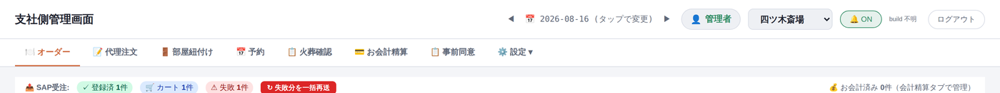

| 表示 | 意味 |
|---|---|
| ◀ 2026-08-05（タップで変更）▶ | **表示対象日**。◀=前日/▶=翌日。**一覧が空のときはまずここを確認** |
| 👤 管理者 | ログイン中の利用者名 |
| 四ツ木斎場 ▼ | **操作対象の斎場**。切り替えると全タブが連動 |
| 🔔 ON | 新規注文の通知音の ON/OFF |
| build …（画面右上の小さな文字） | 表示中の画面の版数。上手く動かないときに「最新の画面を開いているか」を確認するのに使います |
| ログアウト | ログアウト |

**画面切り替えタブ（それぞれをクリックして移動）**

タブは業務の流れの順（予約 → 部屋紐付け → 火葬確認 → オーダー → 代理注文 → お会計精算 → 事前同意）に左から並んでいます。本書の§3.2以降は操作の説明のしやすさから従来の順で章立てしていますが、画面上の並びは下表の順です:

| タブ（左から順） | 用途 |
|---|---|
|  | 予約の確認・確定（管理者のみ表示）（§3.5） |
|  | 部屋と予約の紐付け（§3.4） |
|  | 火葬同意の確認・来場受付（§3.6） |
|  | 注文の進行管理（§3.2） |
|  | スタッフによる代理注文（§3.3） |
|  | 会計・精算（§3.7） |
|  | 事前同意の一覧・紐付け（§3.8） |
|  | 「⚙️ 設定 ▾」— 各種マスタ・設定の一覧を開きます（管理者のみ表示）（§3.9） |

**ヘッダーの働き（詳しく）**

- **斎場の切り替え** — 選べる斎場は自分のアカウントの「アクセス範囲（許可斎場）」の中だけです（管理者は全斎場）。切り替えると**全タブの一覧・件数・通知が選択中の斎場に連動**します。「一覧に出るはずのものが出ない」「件数が合わない」時は、まずここを確認して下さい（他斎場の注文はポップアップ通知も鳴りません）。
- **表示対象日** — オーダー・火葬確認などの一覧が対象日に連動します。日付を過去に切り替えて履歴を確認した後は、**必ず本日に戻して**下さい（戻し忘れが「注文が出ない」の定番原因です）。
- **リアルタイム更新** — 画面は自動で最新化され、ヘッダーに「**リアルタイム接続中**」と表示されます。通信が切れると「**❌ 接続エラー**」に変わりますが、**10秒後に自動で再接続**を試みます。表示が戻らない時だけ再読込（Ctrl+Shift+R）して下さい。
- **通知音（🔔）** — 新しい注文が入った時に鳴ります。売店・厨房の担当はONのまま運用し、会議等で消したい時だけOFFにします（OFFのままだと新規注文に気付けません — §7.3）。

**操作結果の通知（画面右下に数秒表示されます）**

操作が成功すると緑、失敗すると赤の通知が画面右下に表示されます。赤い通知は失敗の理由が書かれているため、消える前に内容を確認して下さい（例はSAP登録失敗の通知）:

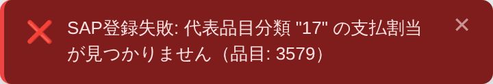

### 3.2 🍽️ オーダー（注文の進行管理）

**出来ること:** お客様のスマホ注文とスタッフの代理注文が、**未処理 → 調理中 → 提供済み → お会計準備完了** の4つの列でリアルタイムに管理出来ます（新しい注文が入ると通知音が鳴ります）。「お会計済み」の件数は右上に表示され、会計そのものは「💳 お会計精算」タブで行います。

**列の見方**

| 列 | 意味 |
|---|---|
|  | 注文が入った直後。スタッフがまだ対応していない状態 |
|  | 「調理開始」を押した状態 |
|  | お客様に商品を渡した状態（PDA計上前） |
|  | PDA計上済み・会計待ち。**ご予約に紐づく注文はこの列に移るとSAPのカートに蓄積**されます（受注番号の発行は「💳 お会計精算」の「💰 支払い準備完了」で行われます）。**スポット注文（予約に紐付かない注文）は例外**で、ご注文の時点でSAPへ受注確定済みのため、この列への移動でSAPには何も送られません（下の「スポット注文の扱い」参照） |

**注文カードの見方**（例: 売店でのご注文 #4）

カードには 注文番号（#4）・注文時刻・🕊故人名（窓口 花子）・🏢葬儀社名（あすなろ祭典）・注文経路（LINE／代理）・📍場所ラベル（売店レジ前・月の間1 など）・斎場と売り場（四ツ木斎場・売店）・SAP連携の状況・🔑予約番号（TEST-2500201）・商品明細・合計金額 が表示されます。

**カードのボタン**

| ボタン | 説明 |
|---|---|
|  | **調理開始** — カードを「調理中」列へ移す。調理が必要な商品（天ぷらそば等）で使用 |
|  | **🍽️ 提供済み** — カードを「提供済み」列へ移し、お客様のLINEに「🍽️ 注文 #◯ の提供が完了しました。」の通知を送る。瓶ビール等のすぐ渡せる商品は調理開始を飛ばして直接押す |
|  | **💳 お会計精算へ移す** — PDAで売上計上した後に押す。SAPのカートに蓄積され、カードは「お会計準備完了」列へ移ります。※押すとお客様のLINEに「💳 注文 #◯ のお会計の準備ができました。スタッフにお声がけください。」が届きます。**喪主まとめ払いのご家族では、この通知を受けたお客様が個別にお支払いに来られることがある**ため、まとめ払いの旨をあわせてご案内下さい。※予約にも受付にも紐付かない**スポット注文ではこのボタンは表示されず、代わりに「→ お会計準備完了」が出ます**（SAPへは送られません — ご注文時に受注確定済みのため。下の「スポット注文の扱い」参照） |
|  | **お会計済み** — その場でお支払いいただいた場合に押す（LINEに「会計完了」通知）。**喪主まとめ払いのときは押さない**（§3.7で一括精算） |
|  | **← 提供済みに戻す** — 1つ前の列に戻します。押し間違えたときに使用（列に応じて「← 未処理に戻す」「← 調理中に戻す」「← お会計準備完了に戻す」も同じ働きです） |
|  | **編集** — 注文内の商品を個別に削除・追加（一部キャンセル）。下のモーダルが開く |
|  | **📋 注文詳細** — 予約番号単位の明細・支払先の振り分け（喪主/現金/売掛/ワンタイム）・SAP連携状況の確認 |
|  | **SAP再送** — SAP登録に失敗した注文をこのカードだけ再送 |
|  | **📋 送信内容** — SAPに送った内容の確認画面を開く |
| （✕） | **注文の取り消し** — 「未処理」列のカードにだけ付いています。注文そのものを取り消します |
| （💳 一部支払い） | 「お会計準備完了」列で、SAPカートに蓄積済みの注文にだけ表示されます。まとめ精算を待たずにこの注文分だけ先に精算するときに使います |
| （⚠ SAP金額照合待ち） | SAPの受注金額・割引条件の確認が必要な注文では、「💰 お会計済み」の代わりにこの表示が出て**先に進めません**。「💳 お会計精算」側で照合してから進めます |
| （⚠ SAP連携失敗） | SAP連携に失敗した注文では、進めるボタンの代わりにこの表示が出ます。「↻ SAP再送」で解消してから進めます |

**注文の状態の進み方（どの列で・どのボタンで動くか）**

| 今の列 | 押せる進めるボタン | 押せる戻すボタン | いつも押せるボタン |
|---|---|---|---|
| ⏳ 未処理 | 👨‍🍳 調理開始（→調理中）／🍽️ 提供済み（→提供済み）／💳 お会計精算へ移す（→お会計準備完了） | ✕（注文の取り消し） | ✏️ 編集・📋 注文詳細 |
| 👨‍🍳 調理中 | 🍽️ 提供済み（→提供済み）／💳 お会計精算へ移す | ← 未処理に戻す | ✏️ 編集・📋 注文詳細 |
| 🍽️ 提供済み | 💳 お会計精算へ移す（→お会計準備完了） | ← 調理中に戻す | ✏️ 編集・📋 注文詳細 |
| 💳 お会計準備完了 | 💰 お会計済み（※SAPの金額確認が必要な注文では「⚠ SAP金額照合待ち」と表示されて押せません） | ← 提供済みに戻す | ↻ SAP再送・📋 送信内容・💳 一部支払い・✏️ 編集・📋 注文詳細 |
| 💰 お会計済み（右上の件数） | — | ← お会計準備完了に戻す | 📋 注文詳細 |

> **✏️ 編集が出来るのはSAPカート投入前まで**です。投入後に編集しようとすると「SAPカート投入後の注文は編集できません。SAP受注・カートを照合してください。」と表示されます。

**🔍 一つ一つの操作の詳しい流れ（オーダー）**

**① 👨‍🍳 調理開始** — 調理が必要な商品（天ぷらそば・うどんなど温かい食事）を受けた時に、厨房へ取り掛かりの合図をするための操作です。押す前に、カードの商品明細と場所ラベル（どのお部屋からの注文か）を確認します。押すとカードが「調理中」列へ移るだけで、**お客様への通知は届きません**（調理中の通知は仕組みとしてありません）。飲み物だけの注文など、調理が要らない場合はこのボタンを押す必要はなく、次の「🍽️ 提供済み」へ直接進めて構いません。押し間違えた場合は「← 未処理に戻す」で戻せます。

**② 🍽️ 提供済み** — 商品をお客様のお手元へ届け終えた時に押します。押した瞬間にカードが「提供済み」列へ移り、**お客様のLINEに「🍽️ 注文 #◯ の提供が完了しました。」の通知が届きます**。つまりこのボタンは「お届け完了の連絡」を兼ねているため、**実際にお渡しする前に押さないで下さい**（お客様が「届いたはずの商品が無い」と混乱する原因になります）。複数の注文をまとめてお届けした場合は、届けた注文のカードを1枚ずつ押します。

**③ 💳 お会計精算へ移す** — お渡しが済んだ注文を会計の待ち行列に載せる操作で、**PDAで売上計上を済ませた後**に押すのが順番です。押すと2つのことが同時に起きます: (1) カードが「お会計準備完了」列へ移り、注文の内容が**SAPのカート（会計の入れ物）に蓄積**されます（受注番号はまだ発行されません — 発行は「💳 お会計精算」タブの「💰 支払い準備完了」で行われます）。(2) お客様のLINEに「💳 注文 #◯ のお会計の準備ができました。スタッフにお声がけください。」が届きます。この通知を見たお客様が個別にお支払いに来られることがあるため、**喪主まとめ払いのご家族では「お支払いは代表の方がまとめて行います」と一言添えて**下さい。なお、ご予約に紐づかないスポット注文ではボタン名が「💳 お会計準備完了」と表示されますが、働きは同じです。

**④ 💰 お会計済み** — 売店などで**その場で現金等のお支払いが完了した**注文だけに押します。お客様のLINEに「💰 注文 #◯ のお会計が完了しました。」が届き、カードは右上の「お会計済み」件数に集計されます。**喪主まとめ払いの注文では絶対に押さないで下さい** — まとめ払いは「💳 お会計精算」タブで一括精算するのが正しい流れで、ここで押してしまうと精算対象から外れてしまいます。また、SAPの金額確認が必要な注文では、このボタンの代わりに「⚠ SAP金額照合待ち」と表示されて押せません（§3.7の「🔄 SAPと照合」で確認してから進めます）。

**⑤ ← 戻すボタン（未処理に戻す／調理中に戻す／提供済みに戻す／お会計準備完了に戻す）** — 押し間違えた時に、カードを1つ前の列へ戻すための操作です。戻しても**既に送られたお客様への通知は取り消せません**（例: 提供済みを取り消しても「提供が完了しました」の通知は届いたままです）。戻した後は正しい順序でもう一度進めて下さい。

**⑥ ✕（注文の取り消し）** — 「未処理」列のカードにだけ付いています。注文そのものを取り消す操作で、押すとお客様のLINEに「❌ 注文 #◯ はキャンセルとなりました。」が届きます。調理が始まった後（調理中以降）の取り消しは、この✕ではなく「✏️ 編集」での一部取消か、列を未処理へ戻してからの取り消しになります。取り消しのご依頼をお客様から受けた場合もスタッフがこの操作で対応します（お客様の画面には取消ボタンはありません）。

**⑦ ✏️ 編集（一部キャンセル）** — 「1品だけ取り消したい」「数量を間違えた」時の操作です。開いた画面で行の「✕」を押すと合計金額がその場で再計算され、消し過ぎた時は「＋ 商品を追加」で商品名・品番から戻せます。最後に「保存」を押すまで確定しません。**編集出来るのはSAPカートへ入る前（お会計準備完了へ移す前）まで**で、投入後は「SAPカート投入後の注文は編集できません」と表示されます。その場合の内容変更は§3.7側（注文詳細・SAP照合）で扱います。

**⑧ 📋 注文詳細** — 予約番号の単位で、その方の全注文の明細・金額・支払先の振り分け・SAP連携の状況をまとめて確認する画面です。会計の前に「どの品目を誰が支払うか」を確認・変更したい時はここを開きます（振り分けの詳しい操作は§3.7）。確認だけなら何度開いても状態は変わりません。

**⑨ ↻ SAP再送・📋 送信内容・↻ 失敗分を一括再送** — SAP連携に失敗した注文（⚠SAP失敗の赤いバッジ）を送り直す操作です。押す前に必ずバッジにカーソルを合わせて**失敗理由の全文**を確認して下さい（例:「代表品目分類 "17" の支払割当が見つかりません」→ 先に振り分けを直さないと再送しても同じ失敗になります）。「📋 送信内容」ではSAPに送った内容そのものを確認出来ます。失敗が複数ある時は画面上部の「↻ 失敗分を一括再送」でまとめて再送できます。**「⚠ SAP未確定」（到達が確認できていない）の注文だけは、そのまま再送すると二重投入の恐れがある**ため、先に「📋 注文詳細」でカートの中身を確認してから判断して下さい。

**🧾 スポット注文の扱い（予約にも受付にも紐付かない注文）**

「🚶 予約なし」から入力した代理注文・お連れ様購入など、**予約にも受付にも紐付かない注文**は、通常の注文と会計の仕組みが根本的に異なります。

- **SAP連携のタイミングが違います。** 通常の注文は「お会計準備完了」でカートに蓄積→「💰 支払い準備完了」で受注確定、という2段階ですが、スポット注文は**ご注文を送信した時点で、その注文だけで完結する受注としてSAPへ確定**します（カートには積まれません）。
- **「💳 お会計精算」タブには載りません。** 受付単位で精算するお会計精算の対象外のため、カードに「**🧾 スポット注文（お会計精算の対象外）**」のバッジが付き、「💳 お会計精算へ移す」ボタン自体が表示されません（代わりに「→ お会計準備完了」が出ます）。
- **会計はこのオーダー画面内で完結させます。** お渡し・PDA計上の後、「→ お会計準備完了」→ その場でお支払いを受けて「💰 お会計済み」の順に進めます。
- **お客様への通知はありません。** LINEに紐付かないため、提供完了・会計完了などの通知は届きません。お渡しとお会計は口頭でご案内下さい。
- **お連れ様購入には「G」で始まるゲスト予約番号**が自動で発行され、カードと成功表示（「✅ お連れ様注文を作成しました 予約番号: G…」）に表示されます。領収書や後からの照会はこの番号で行えます。

| 表示 | 意味 |
|---|---|
| LINE ／ 代理 | 注文の入り口（お客様のスマホ注文か、スタッフの代理注文か） |
| 📍（例: 月の間1・売店レジ前） | 注文が入ったお部屋・場所のラベル |
| 🔑（例: TEST-2500200） | 紐づくご予約の予約番号 |
| 🔥 火葬同意済 ／ ⚠ 火葬未同意 | 火葬同意の状況（「📋 火葬確認」と連動） |
| 区民葬 ／ 献体 ／ 減額 ／ 公費 | 適用中の割引・特別料金 |
| 🛒 カート蓄積済 | SAPのカートに入り、お会計待ちの状態 |
| ✓ SAP登録済 | SAPの受注が発行済み |
| ⚠ SAP失敗 | SAP連携に失敗（カーソルを合わせると理由の全文） |
| ⚠ SAP未確定 | 送信したがSAP側への到達が確認できていない。**そのまま再送すると二重投入の恐れ** |
| ⏸ SAP保留 ／ ⏭ SAP対象外 ／ 🚫 SAP無効 | SAP連携の対象外・停止中 |
| ⚡ 一部支払済 | 一部の品目だけ精算が済んだ状態 |
| ⚠ 予約カート未構築 | ご予約分の品目がSAPカートに入っていない。「↻ SAP再送」で作り直す |
| ⚠ 金額要確認 | SAPの受注金額と割引条件の確認が必要。**再送・精算は禁止**（「🔄 SAPと照合」で確認） |
| ⚠ 予約と重複 ◯件 ／ ⚠ SAP送信除外 ◯件 | 予約品目と重複した品目／SAP送信から除外された品目がある（カーソルで品目名を確認） |
| 🧾 スポット注文（お会計精算の対象外） | 予約にも受付にも紐付かない注文の印。**ご注文の時点でSAPへ受注として確定済み**のため、受付単位で精算する「💳 お会計精算」には移せません。このオーダー画面内で「→ お会計準備完了」→「💰 お会計済み」と進めて完結させます |

**画面上部「📤 SAP受注」の帯**（お会計準備完了列の集計。0件のものは表示されません）

| 表示 | 意味 |
|---|---|
| ✓ 登録済（緑） | SAPへの受注登録が完了 |
| 🛒 カート（青） | SAP側のカートに蓄積済み（会計待ち） |
| ⏳ 送信中（黄） | 応答待ち（通常は表示されません） |
| ⚠ 失敗（赤） | 登録に失敗した注文と、**「SAP未確定」（送信はしたがSAP側への到達が確認できていない）注文の合計**。下の「↻ 失敗分を一括再送」で再送します |
| ⏭ 対象外（灰） | SAP連携の対象外・無効・保留 |
|  | **失敗分を一括再送** — 失敗した注文をまとめて再送（失敗があるときだけ表示） |

SAP登録に失敗した注文のカードには「⚠SAP失敗」の赤いバッジが付きます（バッジにカーソルを合わせると失敗理由の全文が表示されます。例:「代表品目分類 "17" の支払割当が見つかりません（品目: 3579）」）:

**✏️ 編集（一部キャンセル）の手順**

| # | 操作 |
|---|---|
| 1 | カードの「✏ 編集」を押す →「注文を編集」画面が開く |
| 2 | 取り消したい商品の行の「✕」を押す → 合計金額が自動で再計算される |
| 3 | 間違えて消したら「＋ 商品を追加」で商品名・品番から再追加 |
| 4 | 「保存」で確定（注文自体は残るので受付や会計には影響しない） |

**📋 注文詳細**（支払先の振り分け）

| 支払先ボタン | 使いどころ |
|---|---|
| 喪主 | 喪主まとめ払い。最終精算は「💳 お会計精算」で一括 |
| 現金 | その場での現金支払い |
| 売掛 | 葬儀社への請求（後日精算） |
| ワンタイム | 単発精算（イレギュラー時）。※現場に馴染みのある言葉に合わせて「**喪主支払い**」への名称変更が予定されています |

> **お客様のLINEに届く注文の通知は4種類です（全文）**: ①「🍽️ 注文 #◯ の提供が完了しました。ごゆっくりお過ごしください。」②「💳 注文 #◯ のお会計の準備ができました。スタッフにお声がけください。」③「💰 注文 #◯ のお会計が完了しました。またのご利用をお待ちしております。」④「❌ 注文 #◯ はキャンセルとなりました。」（取消時に理由を入れた場合は「理由: ◯◯」の行が付きます）
> **注文した時点・調理中の通知はありません**（注文直後の確認は、お客様の画面の「ご注文を承りました」とご注文履歴で行います）。
>
> このほか、精算が済んだ時には会計のお知らせ（「✅ お支払いが完了しました。」）が届きます（§3.7）。
>
> **注文の取り消しはスタッフ側の操作で行います。** お客様の画面（LINEミニアプリ）には現在、注文を取り消すボタンはありません（サーバー側には「未処理の注文に限りお客様ご自身で取り消せる」仕組みが用意されており、その際は調理開始後だと「調理開始後の注文はLINEからキャンセルできません。スタッフへお声がけください。」と案内される設計ですが、現時点でお客様の画面に取消の導線はありません）。取消のご依頼を受けたら、このタブの「キャンセル」で対応して下さい。

### 3.3 📝 代理注文（スタッフによる代行注文）

**出来ること:** スマホをお持ちでないお客様や口頭注文・葬儀社の一括手配を、スタッフが代わりに入力出来ます。画面は上から **⚙️ 斎場・売上場所設定 → 1 予約を選択 → 2 購入者を選択 → 3 商品を選択** の順に並び、上のステップが終わると下が開きます（ステップ番号は 1・2・3 の丸数字で表示されます）。

> 代理注文もお客様ご自身のLINE注文と同じ「オーダー」情報として集約されるため、**LINE連携のあるご予約なら、代理で入力した注文でも提供完了などの通知はお客様のLINEに届きます**（§3.2の通知一覧参照）。

> **ご注意: 1でご予約を選ぶと、原則 2「購入者を選択」は表示されません。** 購入者は自動的に「**🏢 葬儀社払い**」で確定し、画面のステップ番号も **1 → 3** と飛びます。喪主さまのお支払いにしたい場合は、注文の送信後に「🍽️ オーダー」の「📋 注文詳細」で支払先を「喪主」に振り分けて下さい。
>
> **例外**: ご予約に**葬儀社の得意先コードが入っていない場合**は自動確定されず、画面右下に「⚠ この予約に葬儀社の得意先コードがありません。購入者（法人）を選択してください」と表示されて **2 購入者を選択** が開きます（下の画面）。「🏢 葬儀社」から法人を選んで進みます。2 が出るもう1つのケースは「🚶 予約なし」を選んだときです。

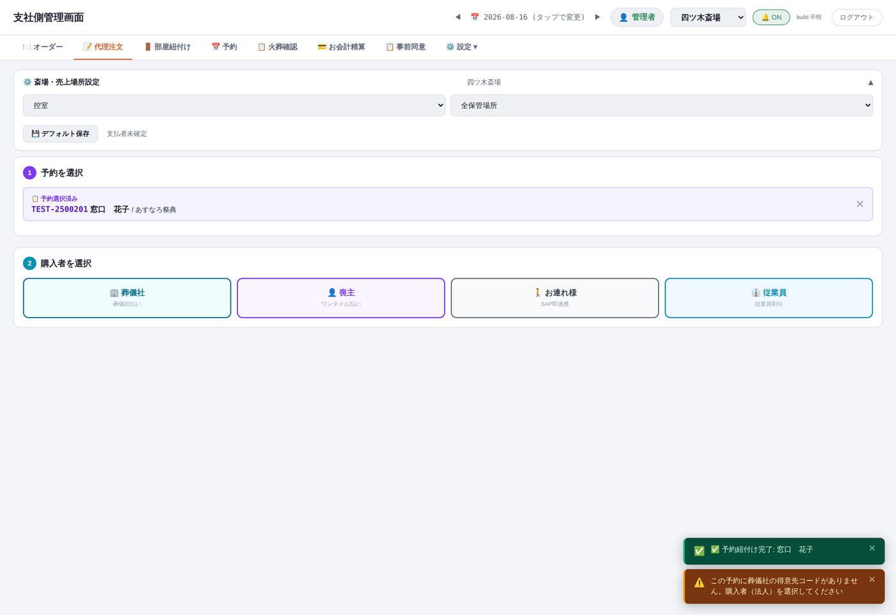

**STEP 0: 斎場・売上場所を選ぶ**

斎場・売上場所が未選択の間は先に進めません（「⚠️ 先に「⚙️ 斎場・売上場所設定」で斎場と売上場所を選択してください。」と表示されます）:

「⚙️ 斎場・売上場所設定」を開いて、売上場所（例: 控室）と保管場所を選びます:

| ボタン | 説明 |
|---|---|
|  | **デフォルト保存** — 今の斎場・売上場所を自分の既定値として保存（次回から自動で選ばれます） |

四ツ木斎場・控室を選ぶと「1 予約を選択」が使えるようになります:

**STEP 1: 予約を選ぶ（3通り）**

| 方法 | 説明 |
|---|---|
| 予約番号を入力 →  | **🔍 紐付け** — 予約番号（例: TEST-2500200）が分かっている場合が最速。成功すると「✅ 予約紐付け完了: 東博　太郎」と表示されます |
|  | **📋 予約一覧から選ぶ** — 当日の予約一覧から選びます（下の画面が開きます） |
|  | **🚶 予約なし** — ご予約のないスポット購入・お連れ様向け。この場合だけ 2 購入者を選択 が表示されます |

予約一覧（「本日の予約から検索」。**故人名・葬儀社・予約番号**で検索出来、葬儀時間順の並び替えが付きます。「※ 受付完了の予約は葬儀社得意先コードが自動入力されます」）:

ご予約を選ぶと、2 を飛ばして「3 商品を選択」が開きます（紫のバッジ「📋 予約選択済み TEST-2500200 東博　太郎 / 幕内祭典」。✕で選び直し）。**ステップ番号が 1 → 3 と飛ぶのが正常な動きです**:

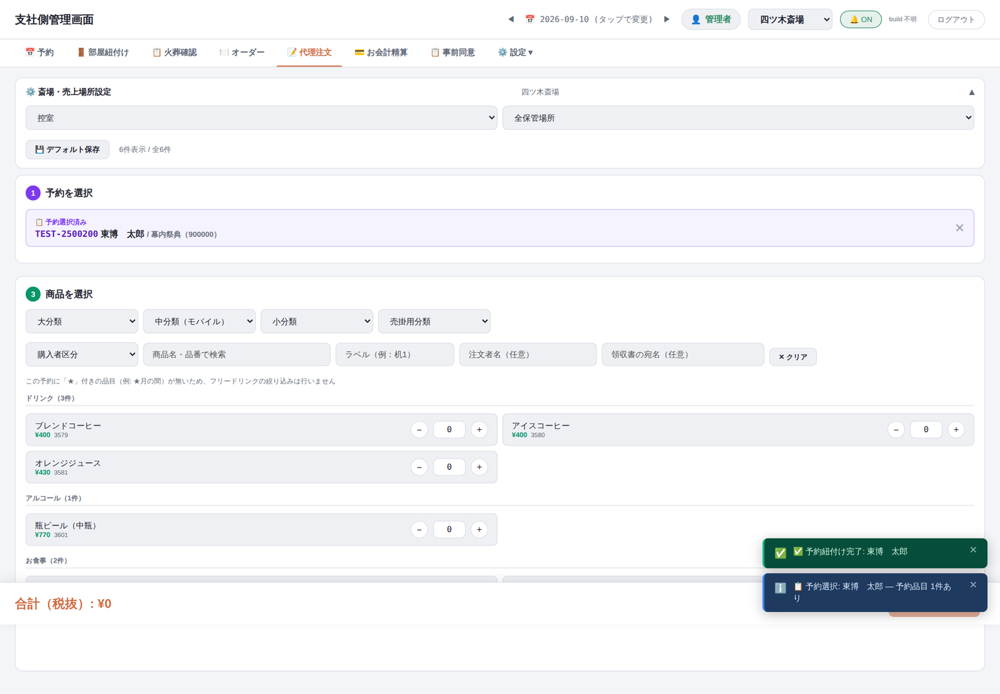

**STEP 2: 購入者を選ぶ（「🚶 予約なし」を選んだ時と、ご予約に得意先コードが無い時のみ）**

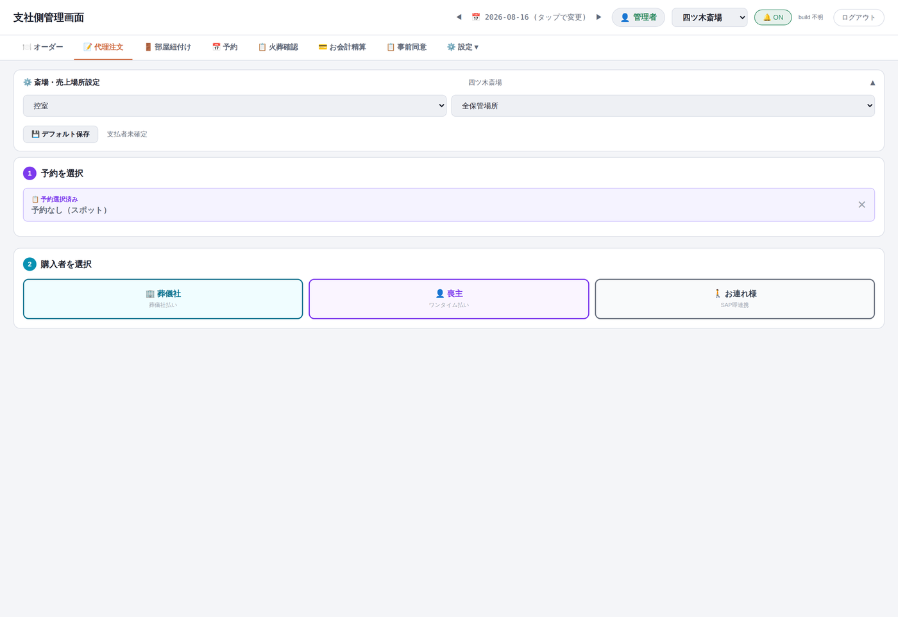

| ボタン | 説明 |
|---|---|
| 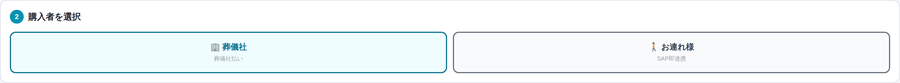 | 「2 購入者を選択」の見出し（この見出しが出ていない＝予約ありで葬儀社払いに自動確定済み） |
|  | **🏢 葬儀社（葬儀社払い）** — 押すと得意先の選択欄が開きます。幕内祭典・あすなろ祭典・セレモニー光などから選びます |
|  | **👤 喪主（直売）** — 喪主様への直接販売として登録します |
|  | **🚶 お連れ様（SAP即連携）** — その場精算のお連れ様購入。選ぶと、お名前（未入力の場合「お連れ様」で登録）・領収書名の入力欄が使え、送信ボタンが「**🚶 お連れ様購入（SAP即連携）**」に変わります |

> 設定によっては、この画面に「👔 従業員（従業員割引）」の選択肢も表示されます（現在の検証環境では非表示です）。

**STEP 3: 商品を選ぶ**

絞り込み（大分類／中分類（モバイル）／小分類／売掛用分類／購入者区分／商品名・品番で検索／ラベル／注文者名。ほかに「**🍵 フリードリンク対象のみ**」のチェックで、フリードリンクの対象品だけに絞り込めます — ソフトドリンク・アルコール・ノンアルコールのうち対象外のものが非表示になり、軽食・和菓子などはそのまま表示されます）:

| ボタン | 説明 |
|---|---|
|  /  | 数量の増減 |
|  | **✕ クリア** — 絞り込みを全て解除 |
|  | **注文を送信** — 確定すると「🍽️ オーダー」に新しいカードが現れます |

> **購入者による商品の出し分け**: 画面上部に「6件表示 / 全6件 ／ 購入者区分により 1件を除外」のように表示されます。お連れ様には一般商品のみ、喪家向け商品（精進料理膳など）・スタッフ代理専用品（骨壺など）は購入者に応じて自動的に隠れます。**0円・価格未設定の商品は注文出来ません。** また購入者を変更すると、その購入者に出せない品目はカートから外され、件数と理由が表示されます。

商品を追加すると下部に合計金額と送信ボタンが表示されます:

**🔍 一つ一つの操作の詳しい流れ（代理注文）**

**① ⚙️ 斎場・売上場所設定（STEP 0）** — 「どこの売上として計上するか」を最初に決める操作で、ここが未選択の間は下のステップが全て塞がっています。売上場所（控室・売店・ラウンジなど）と保管場所（在庫の引き当て元）を選びます。毎回同じ場所で入力する方は「デフォルト保存」を押しておくと、次回からログインした時点で自動的に選ばれた状態になります。**売上場所を間違えたまま注文を送ると、後の精算でエラーになる**事例が報告されているため（誤った売上場所でも入力自体は通ってしまいます）、送信前にもう一度設定バーの表示を確認して下さい。

**② 🔍 紐付け（予約番号で選ぶ）** — 予約番号が手元にある場合の最短ルートです。入力して押すと、その場で予約が検索され、成功すると「✅ 予約紐付け完了: 東博　太郎」と表示され、紫のバッジ（予約番号・故人名・葬儀社名）が付きます。番号の打ち間違いなどで見つからない場合はエラーが表示されるだけで、何も確定しません。選び直したい時はバッジの「✕」を押します。

**③ 📋 予約一覧から選ぶ** — 番号が分からない時に使います。本日の予約が一覧表示され、故人名・葬儀社・予約番号で検索、葬儀時間順の並び替えが出来ます。行を選ぶとその予約に紐付き、②と同じ状態になります。受付（チェックイン）が完了している予約は、葬儀社の得意先が自動で入っています。

**④ 🚶 予約なし（スポット注文）** — ご予約と関係のないスポット購入（お連れ様の追加の飲み物など）の入り口です。これを選んだ時だけ「2 購入者を選択」が開き、**誰のお支払いになるか**を必ず選びます。葬儀社（→得意先の選択欄が開く。**売掛が使えない葬儀社では売掛の注文は送信前に止まります**）・喪主（直売）・お連れ様（SAP即連携＝その場精算）から選択します。**スポット注文は送信した時点でSAPへ受注として確定し、「💳 お会計精算」タブには載りません**（オーダー画面内で「→ お会計準備完了」→「💰 お会計済み」と進めて完結。§3.2「スポット注文の扱い」参照）。予約なしで送った注文は後から予約に紐付けられないため、ご予約のある方の注文と分かっている場合は必ず②か③で予約を選んでから進めて下さい。

**④-2 お連れ様購入の流れ（詳しく）** — 購入者で「🚶 お連れ様」を選ぶと、お名前・領収書名・ラベルを添えられます（お名前が未入力の場合は「お連れ様」で登録されます）。商品を選んで「**🚶 お連れ様購入（SAP即連携）**」を押すと、**その瞬間にSAPへ受注が確定**し、「✅ お連れ様注文を作成しました 予約番号: G…」と表示されます（**Gで始まるゲスト予約番号**が自動採番され、領収書やお問い合わせの手掛かりになります）。作成された注文は最初から「お会計準備完了」列に入るので、お支払いを受けて「💰 お会計済み」で完結します。送信中に通信が切れた場合は「送信の結果が確認できませんでした（通信タイムアウト）。SAPに届いたかは不明です。再送する前に必ず注文一覧を確認してください」と表示されます — **必ず注文一覧を確認してから**再送して下さい。前回の送信が実は成立していた場合は、再送時に「⚠ 前回の送信が既に注文として成立しています。注文一覧を確認してください」と自動で止まる仕組みも入っていますが、確認が先です。

**④-3 酒類を含む注文の記録** — ビール・日本酒など酒類を含む代理注文・お連れ様購入を確定すると、**職員が年齢と運転の有無を口頭で確認したものとして記録**されます（確認した職員のアカウントが監査記録に残ります）。必ず口頭確認をしてから確定して下さい（ノンアルコール商品は対象外です）。

**⑤ 商品を選んで「注文を送信」（STEP 3）** — 商品カードの「＋／−」で数量を調整すると、画面下部に合計金額が積み上がります。絞り込み（大分類・商品名・品番など）は表示を絞るだけで、カートの中身には影響しません。購入者によって出せる商品が自動で変わる点に注意して下さい: お連れ様には一般商品のみが表示され、喪家向け商品（精進料理膳など）やスタッフ代理専用品（骨壺など）は自動的に隠れます。購入者を途中で変更すると、その購入者に出せない品目はカートから外され、件数と理由が画面に表示されます。「注文を送信」を押すと確定し、「🍽️ オーダー」タブの「未処理」列に新しいカードが現れます（以降の進行は§3.2と同じです）。**送信は1回だけ**押し、応答を待って下さい（最大45秒。§1参照）。タイムアウトの表示が出た場合は「届いていない」と決めつけず、**先に注文一覧で前回分が入っていないかを確認**します — 同じ内容をもう一度送っても、前回が成立していた場合は「⚠ 前回の送信が既に注文として成立しています」と自動で止まる仕組みが入っています。

**⑥ 送信した後の支払先の直し方** — 予約ありの代理注文は自動的に「葬儀社払い」で登録されます。喪主様のお支払いにしたかった場合は、送信後に「🍽️ オーダー」の「📋 注文詳細」を開き、支払先を「喪主」へ振り分け直します（§3.2⑧・§3.7）。注文を送り直す必要はありません。

### 3.4 🚪 部屋紐付け（部屋と予約の紐付け）

**出来ること:** 控室・休憩室・式場・ラウンジ・お別れ室の部屋にご家族の予約を紐付けます。紐付けている間だけその部屋のQRから注文出来、休憩室では**フリードリンクの出し分け**も有効になります。紐付けの残り時間（既定30分・設定で変更可）が**ラストオーダー**として働き、期限が切れるとお客様側に「ただいまこのお部屋ではご注文いただけません」と表示されます。

| ボタン・表示 | 説明 |
|---|---|
|  | **紐付け** — 部屋に予約を割り当てる（下の画面が開く） |
|  | **解除** — 「紐付けを解除しますか？」の確認が出て、OKすると解除されます。ご利用終了時に必ず押して下さい（紐付け中の部屋にだけ表示されます） |
|  | **再読込** — 一覧を最新化 |
|  | **FD制御** — この売り場でフリードリンクの出し分けが有効という印 |

「紐付け」を押すと「予約を紐付け」画面が開き、当日の予約から選べます（**故人名・申込者名・予約番号**で検索、「⏱ 葬儀時間」で並び替え）。**一覧の行そのものをタップ**すると紐付けが確定します（確定用のボタンはありません）:

すでに紐付いている部屋では上書きの警告が出ます:

| # | ご利用開始〜終了の手順 |
|---|---|
| 1 | ご家族を部屋にご案内する前にこのタブを開く |
| 2 | 該当部屋の「紐付け」→ 当日予約の一覧から該当の行をタップ（すでに他のご予約が紐付いている部屋では上書きの確認が出ます） |
| 3 | お客様をご案内し、部屋のQRを案内（予約にフリードリンク対象の品目があれば自動でフリードリンクメニューが出ます） |
| 4 | ご利用終了時に「解除」を押す（忘れても残り時間で自動失効し、表示は「期限切れ」に変わります。ただし失効するまでの間は次のご家族が注文出来ないため必ず解除して下さい。**「期限切れ」になると解除ボタンは消えます**） |

> **売店は部屋紐付けの対象外**です（ラストオーダーの対象外のため、紐付けなしで常時ご注文いただけます）。フリードリンクの出し分けを設定出来るのは**休憩室のみ**です。

**🔍 一つ一つの操作の詳しい流れ（部屋紐付け）**

**① 紐付け** — 「この部屋を、今からこのご家族が使う」とシステムに登録する操作です。押すと「予約を紐付け」画面が開き、当日の予約一覧から**行そのものをタップ**した瞬間に確定します（「確定」ボタンはありません。タップ＝確定なので、行を選ぶ前に故人名・葬儀社名をよく確認して下さい）。確定した瞬間から、その部屋に貼ってあるQRを読み取ったお客様がメニューを開けるようになり、残り時間（既定30分）のカウントダウンが始まります。予約にフリードリンク対象の品目が含まれていれば、休憩室ではフリードリンクメニューが自動で表示されます。**既に別のご予約が紐付いている部屋**で行をタップすると上書きの警告が出ます — 前のご家族の利用が本当に終わっているかを確認してからOKして下さい。

**② 解除** — ご利用終了時に「この部屋は空きました」と登録する操作です。押すと「紐付けを解除しますか？」の確認が出て、OKすると即座に解除され、その部屋のQRからは注文出来なくなります。**解除を忘れても残り時間が切れれば自動失効しますが、失効するまでの間は次のご家族がその部屋から注文出来ません**。お見送りが済んだら忘れずに押す運用にして下さい。表示が「期限切れ」に変わった部屋では解除ボタン自体が消えます（もう解除する必要が無いためです）。

**③ 残り時間（ラストオーダー）の見方** — 各部屋の行に残り時間がカウントダウン表示されます。この時間がそのままラストオーダーとして働き、切れた後にお客様がQRから注文しようとすると「ただいまこのお部屋ではご注文いただけません」と表示されます。ご利用が長引く場合は、一度解除してから改めて紐付けると時間がリセットされます。標準の30分は「⚙️ 設定 → 場所・部屋設定」で変更出来ます（管理者のみ）。

**④ 再読込** — 他の端末で行われた紐付け・解除を含めて一覧を最新の状態にします。フロアの担当が複数いる時は、操作の前に一度押す習慣にすると行き違いを防げます。

### 3.5 📅 予約（予約の確認・確定 — 管理者のみ）

**出来ること:** 新予約システムから毎朝届いた予約データを確認し、「確定」します。確定時に区民葬・献体・減額・公費の該当と、支払先の葬儀社（得意先）を確認します。

> **予約データの反映には10〜15分程度の時間差が出ることがあります。** 予約システム側で登録・更新した直後にこの画面へ表示されなくても、すぐに異常と判断せず、少し時間を置いてから再読込して確認して下さい（2026-09-14 操作説明会での周知事項）。
>
> **「確定」の操作は必ず行い、順序にもご注意下さい。** 確定によって受付・精算に必要な情報が次の工程（火葬確認・お会計精算）へ進みます。一方で、**受付（チェックイン）が済んだ後に予約確定を行うと、同じ内容の受注が二重に作られるケース**が報告されており、対策の改修が進んでいます。予約確定→受付の順を守り、確定後は「💳 お会計精算」の一覧に同じ方のデータが二重に表示されていないかを確認して下さい。

上部の「**対象日**」は、葬儀日・火葬日・式場の利用日・保棺の保管期間の**いずれかが指定した期間に重なる**予約を表示します（葬儀日だけの絞り込みではありません）。「**状態**」は 全て／未確定／確定済み の3択、「**絞り込み**」は 故人名・葬儀社・予約番号・申込者・電話 での部分一致検索です。

| ボタン | 説明 |
|---|---|
|  | **未確定** — 押すと確定の確認画面（下）が開きます。確定するとボタンが「✅確定」表示に変わります |
|  | **✅確定** — 確定済みの状態表示（ボタンではありません） |
|  | **⚠ 葬儀社 未選択** — ご予約に葬儀社の得意先コードが入っていない警告。このままだと代理注文・SAP連携で支払先を決められないため、予約の編集（✏️）で葬儀社を設定します |

予約の編集（✏️）を押すと「予約を編集」画面が開きます。故人名・申込者名・電話番号・メールアドレス・郵便番号・住所・続柄・予約番号・葬儀社の得意先コード（「🔍 葬儀社名から候補を出す」付き）・年齢/享年・葬儀日・火葬日・火葬時間と、割引フラグ（区民葬・献体・減額・公費）をここで修正出来ます:

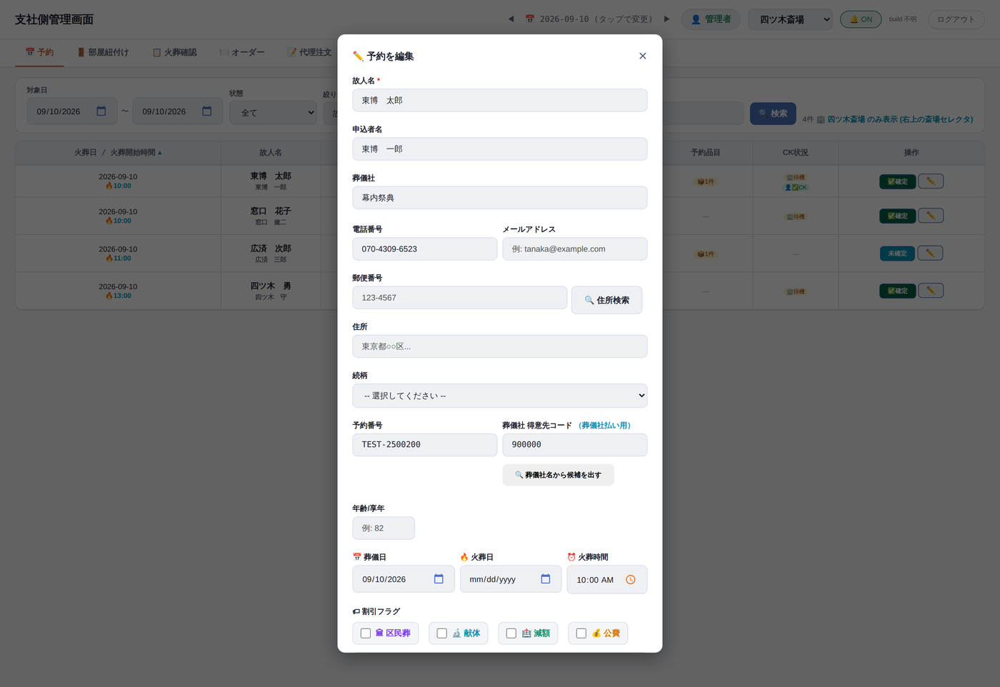

画面を下に送ると「**🏗 施設予約情報（手動入力）**」（予約パターン・炉種別・号炉・時間帯・火葬種別）、「**⚱ 収骨容器（骨壺）選択**」、「**📦 予約品目（火葬種別・式場・骨壺など）**」（SAP品目コードと品名・数量の行を「＋追加」で登録）が続きます。ここで登録した予約品目が、お客様の「予約カート」や会計時のSAP連携の対象になります:

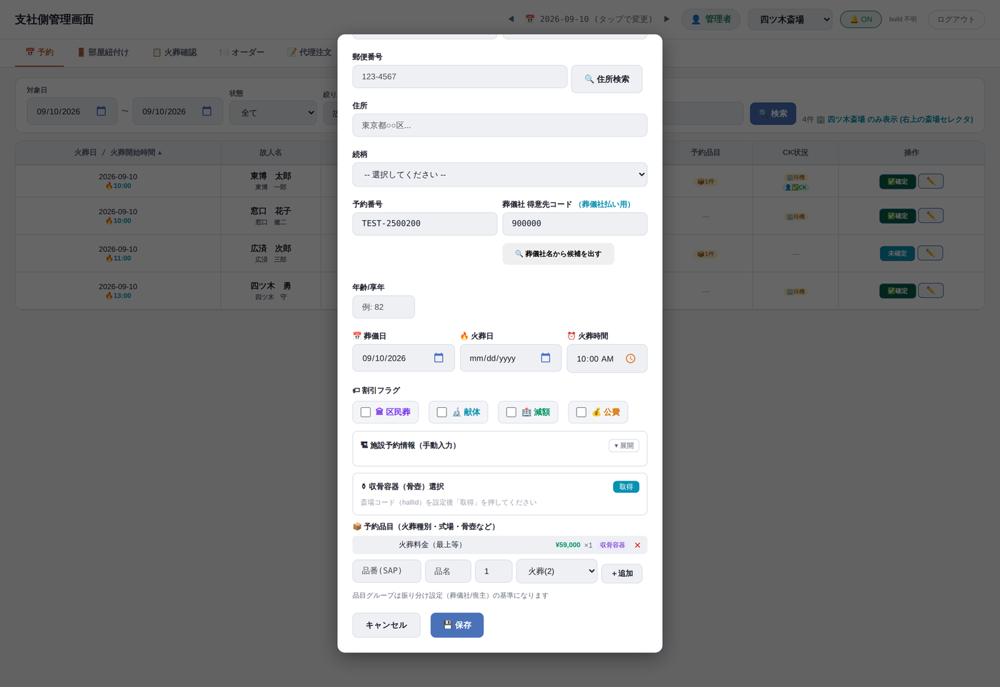

見出しの「**火葬日 / 火葬開始時間**」を押すと並び替え（昇順/降順）が切り替わります。なお、データ削除用の「🗑 範囲クリア」「🗑️ 本日分クリア」ボタンは、**テストデータの誤削除事故を受けて現在の画面では非表示**になっています（機能自体は残っており、必要な場合はシステム担当が実施します）。

> 支払先の得意先が入っていない予約は、この画面では直さず、予約の連携元と得意先マスタの設定を確認して下さい。

**🔍 一つ一つの操作の詳しい流れ（予約）**

**① 未確定 → 確定** — 予約システムから届いたデータを「この内容で受付・精算に使ってよい」と承認する操作です。「未確定」ボタンを押すと確定の確認画面が開き、**区民葬・献体・減額・公費の該当**と**支払先の葬儀社（得意先）**を目視で確認してから確定します。確定するとボタンが「✅確定」の状態表示に変わり、この予約が火葬確認・お会計精算の対象として流れ始めます。確定は取り消しの操作が無い前提で、**内容を確認してから**押して下さい。また**受付が先に済んでいる予約を後から確定すると受注が二重に作られるケース**が報告されているため、順序（確定→受付）を守って下さい（冒頭の注意参照）。

**② ⚠ 葬儀社 未選択** — 予約に葬儀社の得意先コードが入っていない警告です。このままでも確定は出来ますが、**代理注文の自動確定（葬儀社払い）とSAP連携で支払先を決められず**、後の工程で必ず詰まります。「✏️ 予約の編集」を開き、「🔍 葬儀社名から候補を出す」で得意先コードを設定してから確定して下さい。

**③ ✏️ 予約の編集** — 氏名・電話・住所などの申込者情報のほか、得意先コード・割引フラグ（区民葬・献体・減額・公費）・葬儀日・火葬日・火葬時間を修正出来ます。画面下部の「🏗 施設予約情報（手動入力）」（予約パターン・炉種別・号炉・時間帯・火葬種別）、「⚱ 収骨容器（骨壺）選択」、「📦 予約品目」（SAP品目コード・品名・数量を「＋追加」で登録）まで一続きの画面です。**ここで登録した予約品目が、お客様の「予約カート」と会計時のSAP連携の対象**になるため、火葬料金・式場使用料など最初から決まっている品目はここで揃えておきます。保存すると即時に反映されます。

**④ 絞り込みと並び替え** — 「対象日」（葬儀日・火葬日・式場利用日・保管期間のいずれかが重なる期間）と「状態」（全て／未確定／確定済み）、キーワード検索（故人名・葬儀社・予約番号・申込者・電話）で一覧を絞り込みます。朝一番に状態を「未確定」にして、当日分を順に確定していく使い方が基本です。見出しの「火葬日 / 火葬開始時間」を押すと並び替え（昇順/降順）が切り替わります。

**⑤ 🗑 範囲クリア／🗑️ 本日分クリア（現在は非表示）** — テストデータ整理用の**削除操作**で、過去に誤操作でテストデータ61件が消えた事故があったため、**現在の画面ではどちらのボタンも非表示**になっています。実行する場合（システム担当）は、本日分クリアで「⚠️ 全斎場分の本日予約データをすべて削除します。この操作は取り消せません。本当に実行しますか？」→「もう一度ご確認ください。本日付の予約が全て (全斎場分) 削除されます。」の**二段階の確認**を経る仕組みです。通常運用では使いません。

### 3.6 📋 火葬確認（火葬同意の確認・来場受付）

**出来ること:** 本日の火葬予約が**火葬開始時間順**に一覧表示され、火葬同意が取れているか（緑「承諾」／赤「未承諾」）を確認出来ます。未承諾の方には、その場で受付QRを提示して同意をいただきます。一覧は **葬儀業者名／火葬開始時間／喪家名／式場名・休憩室名／炉の種別／保管日数／火葬同意／LINE申込紐付け／操作** の9列です。

| ボタン・表示 | 説明 |
|---|---|
|  | **未承諾のみ** — 押すと未承諾の行だけに絞り込み（もう一度押すと解除） |
|  | **🔍 検索** — 故人名・申込者・電話・**予約番号**で絞り込み |
|  | **再読込** — 一覧を最新化 |
|  | **🖨 受付票印刷** — 表示中の未承諾の方の受付票（QR付き・1名1ページ）を別ウィンドウで開き、**約1秒後に印刷画面が自動で開きます**。閉じてしまった場合はウィンドウ内の「🖨️ 印刷」から印刷出来ます |
|  | **QR** — その方専用の受付QRを表示（炉前でお客様に提示） |
|  | **LINE申込を検索** — LINEで入力された火葬申込を探して予約と紐付けます。**いずれか1項目だけでも検索でき**、入力時は受付番号・かな・電話の部分一致、**未入力のまま検索すると「予約の故人名・火葬日・斎場がすべて一致する未紐付けデータ」**が表示されます |
|  /  | 同意の取得状況（承諾＝対応不要／未承諾＝要対応） |

「⚠ 未承諾のみ」を押した状態:

絞り込みに「東博」と入力した状態:

「QR」を押すと、その方1名分の「**火葬のお申し込み**」QRカード（喪家名・葬儀社名・日時・斎場・受付QR）が**印刷用の別ウィンドウで直接開きます**（以前の画面内QR表示は廃止されました）。ウィンドウ内の「🖨 印刷」で印刷し、炉前でお客様に読み取っていただきます。既に申込が完了している方のカードには「✅ 火葬のお申し込みは完了済みです。」と緑色で表示されます。※UAT用の隔離予約では「UATテスト予約は受付票印刷の対象外です」と表示され開きません:

「LINE申込を検索」を押した状態。画面上部に予約マスターの内容（参照のみ）が表示され、下の検索欄でLINEで入力された火葬申込を探せます。**受付番号・申込者かな・電話番号のいずれか1項目だけでも検索出来ます**。未入力のまま検索すると「予約の故人名・火葬日・斎場が全て一致する未紐付けデータ」が候補に出ます:

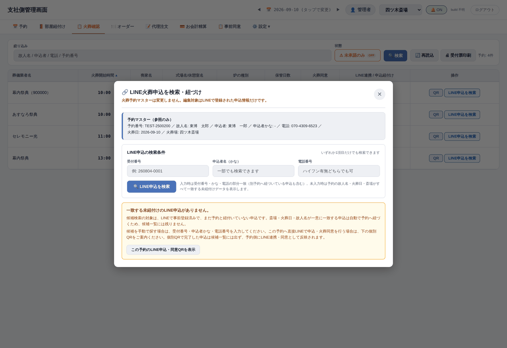

検索結果の各候補には、予約と申込の突き合わせ結果がバッジで表示されます — 「**完全一致候補**」（緑。火葬日・斎場・故人名・喪家名かなが全て一致）／「**相違あり**」（内容に食い違いがある候補）／「**別予約に紐づけ済み**」（他の予約に既に紐付いている申込。既に別のLINE申込と紐づいた予約への切り替えは出来ません）。**完全一致でも自動確定はされない**ので、内容を確認してから紐付けて下さい。

検索画面の下部の「**この予約のLINE申込・同意QRを表示**」で、その予約に紐付いている申込内容と同意QRをその場で確認出来ます。一覧の見出し「**⏱ 葬儀時間**」は押すたびに昇順・降順が切り替わります。

「🖨 受付票印刷」で開く受付票(1名1ページ・QRカード形式)。喪家名・葬儀社名・日時・斎場と、その方専用の受付QRが印字されます。炉前でこの紙のQRを読み取っていただく運用が出来ます:

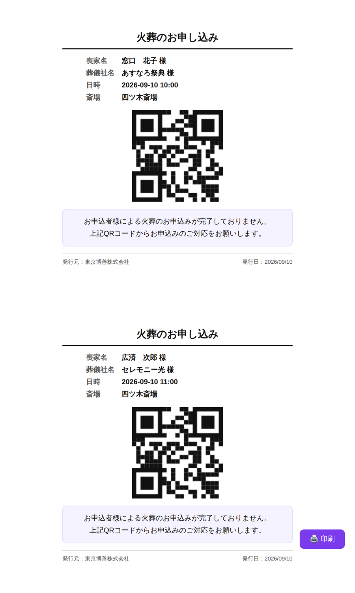

> **受付QRには有効期限があります。** QRカード・受付票のQRは発行から**48時間**で失効します（標準設定。運用側の設定で1〜168時間の範囲に変更出来ます）。期限が切れたQRをお客様が読み取ると「QRコードの有効期限が切れています」、既に読み取り済みのQRでは「このQRコードは使用済みです」、印刷し直した後の古いQRでは「このQRコードは再発行により無効になりました」と表示されます。いずれの場合も、**一覧から新しいQRを発行（印刷）し直して**ご案内下さい。なお、既に承諾済みの予約はQR発行の対象外です（対象に含めると「QRコードを発行できない予約が含まれています」と表示されます）。

**🔍 一つ一つの操作の詳しい流れ（火葬確認）**

**① 未承諾のみ（絞り込み）** — 朝の準備で最初に押すスイッチです。押すと火葬同意がまだ取れていない方だけが残り、「今日、炉前で同意をいただく必要がある方」の一覧になります。もう一度押すと全件表示に戻ります。件数が急に減って見えるのはこの絞り込みがONのままの状態です（§7.3）。

**② 🖨 受付票印刷（未承諾の方の一括印刷）** — 表示中の未承諾の方全員分の受付票（1名1ページ・喪家名・葬儀社名・日時・斎場・受付QR付き）を別ウィンドウで開きます。開いて約1秒後に印刷画面が自動で立ち上がるので、そのまま印刷します（閉じてしまった場合はウィンドウ内の「🖨️ 印刷」から）。この紙のQRを炉前でお客様に読み取っていただくと、その場で同意の入力へ進めます。**QRには有効期限（標準48時間）がある**ため、受付票は当日〜前日に印刷して下さい（期限や再発行の扱いは下の注意書き参照）。

**③ QR（1名分のQRカード）** — 特定のお一人分だけQRを出したい時の操作です。押すとその方専用の「火葬のお申し込み」QRカードが印刷用の別ウィンドウで直接開きます（以前の画面内QR表示は廃止されました）。既に申込が完了している方では「✅ 火葬のお申し込みは完了済みです。」と緑色で表示され、UAT用の隔離予約では「UATテスト予約は受付票印刷の対象外です」と表示されて開きません。印刷せずに画面のままお客様へ提示して読み取っていただくことも出来ます。

**④ LINE申込を検索（予約→申込の紐付け）** — 「予約はあるのに、LINEで入力された申込がまだ紐付いていない」時に、この予約側から申込を探しに行く操作です。押すと画面上部に予約マスターの内容（参照のみ）が表示され、下の検索欄で受付番号・申込者かな・電話番号の**いずれか1項目だけでも**検索出来ます（部分一致）。**何も入力せずに検索**すると、「予約の故人名・火葬日・斎場が全て一致する未紐付けデータ」が候補に出ます。候補に付くバッジ（完全一致候補／相違あり／別予約に紐づけ済み）の意味は下の説明を参照し、**完全一致でも内容を目で確認してから**紐付けて下さい。逆方向（申込側から予約を探す）は「📋 事前同意」タブです（§3.8）。

**⑤ 🔍 検索・再読込** — 検索は故人名・申込者・電話・予約番号での絞り込みです（ひらがな・カタカナはどちらでも一致します）。再読込は他の端末での受付・同意の進みを含めて一覧を最新化します。炉前対応の直前には一度再読込してから状況を確認して下さい。

**「LINE連携 / 申込紐付け」列は上下2段のバッジ**で、それぞれ別のことを表します。

| バッジ | 見ているもの |
|---|---|
| **✅ LINE連携済** ／ LINE未連携（上段） | このご予約に**お客様のLINEアカウントが繋がっているか**（受付QRの読み取りや事前のご登録が済んでいるか） |
| **申込紐付済** ／ **申込未紐付**（下段） | **LINEで入力された火葬申込（事前同意のデータ）がこのご予約に紐付いているか** |

 

（左: LINE未連携＋申込未紐付 ／ 右: ✅ LINE連携済＋申込未紐付）

2つは独立しているため、「✅ LINE連携済」なのに「申込未紐付」という組み合わせも普通に起こります。①事前にLINEで申込をしたが名前の表記ゆれなどで自動紐付けされていない（→「LINE申込を検索」で紐付け）、②当日QRからその場で同意・受付をした（事前の申込データ自体が無いのでこの表示のままで正常。「火葬同意」列が「承諾」なら対応不要）、のどちらかです。

喪家名の下に「**照合項目不足**」と出ている行は、LINEでのお申込みと突き合わせるための項目（**火葬日・斎場・故人名・申込者名〈かな〉**のいずれか）がご予約側に足りていないため、**事前同意の自動紐付けが出来ません**。この行は「📋 事前同意」タブで手動の紐付けが必要になります（バッジにカーソルを合わせると不足項目が表示されます）。自動紐付けの条件そのもの（電話番号・故人名かな・火葬日・斎場の4点一致）は §3.8 を参照して下さい。

> 件数表示は「予約: 4件」のように**選択中の斎場の件数だけ**が表示されます（検索中は「(検索: 2/4件)」のように絞り込み後/絞り込み前の件数）。件数が合わない時は右上の斎場を確認して下さい。

### 3.7 💳 お会計精算（会計・精算）

**出来ること:** お支払い者ごとの会計を「**会計待ち → 会計完了**」で管理します。割引の適用、SAPへの登録、自動精算機用の**精算QR**の発行、領収書の分割までここで行います。画面上部には自動精算機が途中で止まった時のための「**精算ロック管理**」があります。

**会計カードの表示の見方（詳しく）** — カードには喪家名・葬儀社名のほかに、状態を示す小さな印（ピル）が並びます: **LINE連携**の有無／受付の組（🏢 葬儀社・👤 喪主 — 喪主行は「✅ LINE連携済」または「QR待ち」。QR待ちの時は「🖨 紙で受付」が出ます: ①-2参照）／適用中の**割引**（区民葬・献体・減額・公費）／**SAP状態**（✓登録済・⚡一部登録済・⚠失敗 など）。「💰 支払い準備完了」の後は、カード内に「**支払先ごとの受注（未払いの受注だけ精算QRを出せます）**」の枠が現れ、SAP受注が**支払者ごとに1行ずつ**（受注番号・支払者・金額・支払い状況）並びます。**未払いの受注にだけ「🏧 精算QRを発行」が出て**、支払い済みの受注からはボタンが消えていきます。全ての受注が売掛の受付では「🧾 売掛のため精算不要（請求書でご請求）」に置き換わります。

| ボタン・表示 | 説明 |
|---|---|
|  | **✅ 受付する** — 来場受付。カードが会計待ちに並びます |
|  | **💰 支払い準備完了にする** — 押すと下の「**支払い内訳確認**」画面が開き、内訳を確認して「💰 支払いお知らせを送信」で確定します。確定するとSAPに受注登録され、「▼ 詳細」の中に**精算QR発行**ボタンが現れます |
|  | **🏷 割引** — 区民葬・献体・減額・公費の割引を適用（下の「割引設定」画面。葬儀社ごとの対応可否と連動） |
|  | **全て提供済みに** — 未提供の注文が残っている警告が出たとき、まとめて提供済みにする |
|  | **🏁 会計完了にする** — お支払い確認後に押す。会計完了の列へ移ります |
|  | **▼ 詳細** — 補助ボタンを開きます（下の「詳細の中にあるボタン」参照） |
|  | **🔍 状態確認** — 「**外部受注ID（予約番号など）＋得意先コード**」の2つを入れてロック状態を確認します（両方必要です）。操作者名が記録されます |
|  /  | 火葬同意の状況（「📋 火葬確認」と連動） |

**💰 支払い内訳確認（支払い準備完了の前に必ず開く確認画面）**

「💰 支払い準備完了にする」を押すと、確定前に「**支払い内訳確認**」画面が開きます。葬儀社払い（現金）と喪主支払い（現金）の金額、合計（税抜）、品目グループ内訳が表示され、SAPカートに載らない品目や代表品目分類が未解決の品目には黄色・赤色の警告が出ます。内訳が正しければ「**💰 支払いお知らせを送信**」で確定します（お客様のLINEへお支払いのお知らせが届き、SAPに受注登録されます）。振り分けを直したい場合は「**🏷 振り分けを変更**」からやり直せます:

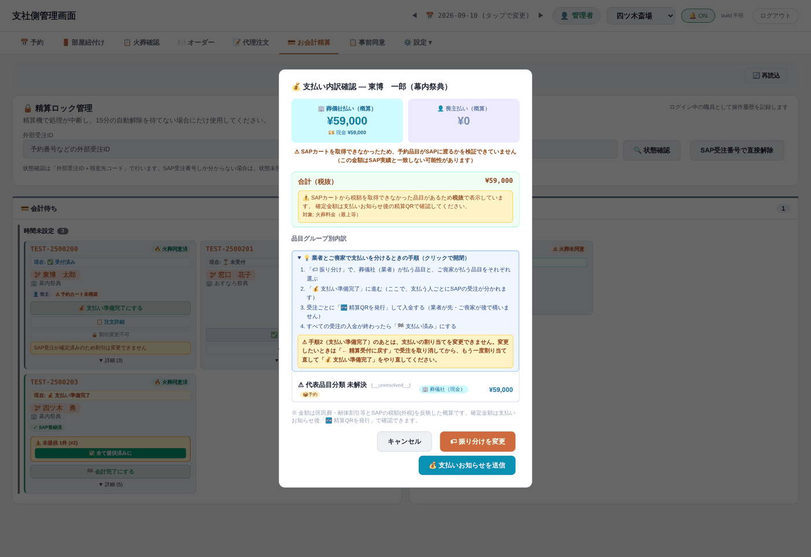

**お客様のLINEに届く「支払いお知らせ」の内容**

「💰 支払いお知らせを送信」を押すと、お客様のLINEには次のメッセージと、**精算QRの画像**が届きます（お客様はこの画像のQRを自動精算機にかざしてお支払い出来ます）:

> 💰 お待たせいたしました。
> お支払いの準備が整いました。
>
> 受付番号: #◯（＋受注番号・合計〈税込〉）
> この後に届く精算QRを自動精算機で読み取ってください。

LINEへの送信に失敗した場合は「LINEへの支払いQR送信に失敗しました。受付は「支払い準備完了」のままです。LINE連携・友だち追加を確認してから、同じボタンで再送してください。」と表示されます。**受付の状態は進んでいる**ので、LINE連携を確認してから同じボタンでもう一度送るだけで済みます。SAP連携に失敗したまま送った場合は、お客様側のメッセージにも「⚠️ SAP連携に失敗しました。スタッフが対応中です。」と添えられます。

> 送信後に「支払いお知らせを送信しましたが、SAPに請求されない注文が◯件あります」と警告が出た場合、その金額はSAPに請求されていません。「↻ SAP再送」で解消して下さい。

**支払い内訳確認・精算QR発行で出る主な警告と対処**

| 警告の表示 | 意味と対処 |
|---|---|
| ⚠️ 未提供の注文が ◯件 あります | 提供が済んでいない注文が残っています。「全て提供済みに」でまとめて提供済みにしてから進めます |
| ⚠️ 支払先が未設定の分類が ◯件 あります | 品目の振り分けが済んでいません。「🏷 振り分けを変更」で支払先を割り当ててから確定します |
| ⚠️ 品目振り分けが未設定です | 同上。SAP側に既に支払割当があるカートでは、未設定のままだと登録に失敗します |
| ⛔ カート未投入（予約品目がカートに入っていない） | ご予約分の品目がSAPカートに入っていません。案内に従いカートを作り直してから送信します |
| ⚠️ 税込金額を確定できないため精算QRを発行できません | 「🔄 SAPと照合」で金額を確定させてから発行します |
| ⚠️ 表示額と精算機の請求額が一致しないため、精算QRを発行できません | 画面とSAPの金額がずれています。「🔄 SAPと照合」で突き合わせます |
| ⚠️ 応答待ちがタイムアウトしました | 処理は続いている可能性があります。**再送信せず**、注文一覧で状態を確認します |

**カードに常に出ているその他のボタン**

| ボタン | 説明 |
|---|---|
| 🏷 振り分け | 葬儀社のお支払いのとき、品目ごとにどなたのお支払いにするかを割り当てます（未設定のときは「🏷 振り分け（未設定）」と太字で表示されます）。品目に「未設定」と付いたまま送信すると**葬儀社払いとして扱われます**。割り当てたら必ず「**💾 振り分けを保存**」を押して下さい（未保存のときは「✏️ 未保存の変更があります」と表示され、保存すると「✅ 振り分けを保存しました」と出ます） |
| 📋 注文詳細 | この方の注文明細と支払先の振り分け状況を確認します |

**「🏁 会計完了にする」が押せないとき（金額の照合が必要な状態）**

| 表示 | 意味・対応 |
|---|---|
| ⚠ 金額照合待ち | SAPの受注金額と割引条件の確認が必要です。**再送・精算はせず**、「🔄 SAPと照合」で金額を突き合わせてから進めます |
| ⚠ SAP照合待ち | SAP連携が完了していない状態です。「↻ SAP再送」等で解消してから進めます |

**支払い準備完了の後にカードへ出るSAPの状態表示**

| 表示 | 意味・対応 |
|---|---|
| ✓ SAP登録済 | 受注が発行済み。精算QRを発行出来ます |
| ⚡ 一部登録済 | 支払者のグループの一部だけ登録済み。「📋 注文詳細」で残りを確認 |
| ⚠ SAP失敗 | 登録に失敗。内容を確認して「↻ SAP再送」 |
| ⚠ SAP到達不明／⚠ SAP状態不明 | 送信が届いたか確認出来ない状態。**そのまま再送すると二重投入になる恐れ**があるため、先に「📋 注文詳細」でカートの内容を確認して下さい |
| ⏳ SAP処理中 | 処理中。しばらく待って画面を更新 |
| 📭 注文なし | SAPに送る注文がありません |
| ⚠ 予約カート未構築 | ご予約分の品目がSAPのカートに入っていない状態。「↻ SAP再送」で作り直します |

**「▼ 詳細」の中にあるボタン**

| ボタン | 出るタイミング |
|---|---|
| 🏧 精算QR発行 | 「💰 支払い準備完了」でSAP登録が成功した後。**自動精算機ご利用票**（QR付き）を表示・印刷出来ます |
| 📩 支払いQRを再送 | 同上。お客様のLINEへ支払いQRをもう一度送ります |
| 🧾 支払確認 | 同上。精算機での支払い状況を確認します |
| 🧾 領収書分割（受注分割へ） | 領収書を分けたいときの案内を開きます（**分割そのものはこの画面では行いません**。下記参照） |
| 🔄 SAPと照合 | SAPの受注金額と画面の金額を突き合わせます |
| ↻ SAP再送 | SAP連携をやり直すとき |
| ← 精算未受付に戻す／← 会計待ちに戻す | 1つ前の状態へ戻します（誤操作の取り消し） |
| 🗑 完全削除 | 受付そのものを削除するとき（取り扱い注意） |

「🏷 振り分け」を押すと「**品目振り分け**」画面が開きます。品目グループごとに支払先を割り当てるほか、上部の一括ボタン「**全て👤 喪主**」「**全て🏢 葬儀社（現金）**」「**全て🏢 葬儀社（売掛）**」で全品目を一度に振り分けられます。「未設定」のまま送信すると葬儀社払い〈現金〉扱いです。割り当てたら「**✅ 振り分けを確定**」を押します:

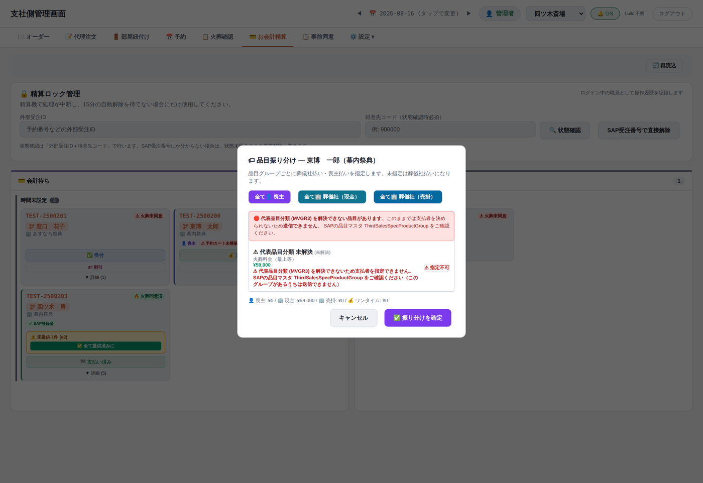

| ボタン | 説明 |
|---|---|
|  | 全品目を喪主様のお支払いに一括変更 |
|  | 振り分けの確定（保存） |

「🏧 精算QRを発行」を押すと「精算QR」画面が開きます。税込金額が確定している受注は緑色で金額（例: ¥3,080〈税込〉・内訳の税抜と税額つき）とQRコードが表示され、「精算QRを発行（税込 ¥3,080）」で確定します:

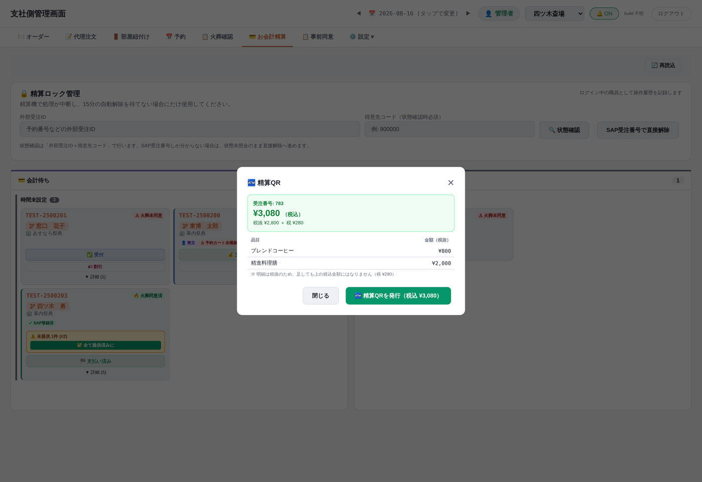

税込金額を確定出来ない受注では黄色の警告「⚠️ 税込金額を確定できないため精算QRを発行できません」が表示され、発行ボタンが押せません。先に「🔄 SAPと照合」で金額を確定させます:

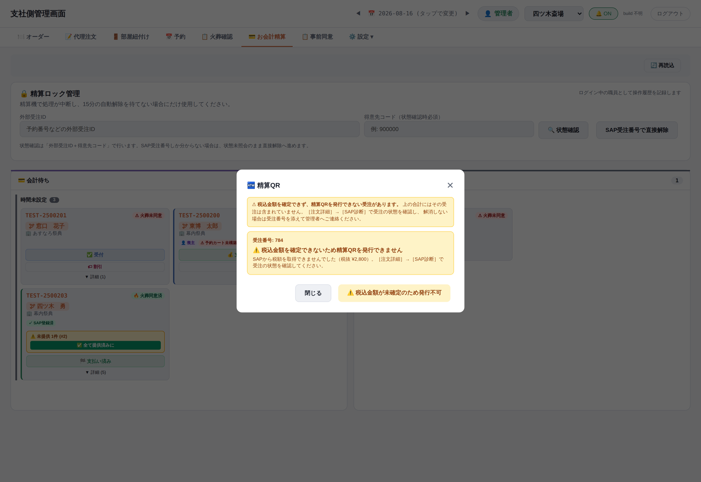

> **売掛（請求書でのご請求）の受注は自動精算機ではお支払いいただけません。** カードに「🧾 売掛のため精算不要（請求書でご請求）」と表示された分は、精算QRを発行せず月次のご請求書で回収します。画面には「この受注は売掛です。自動精算機ではお支払いいただけません（月次のご請求書で回収します）。」とも表示されます。

**💴 支払いを分けたいとき（葬儀社が先払い・ご喪家が後払い など）**

葬儀社が飲食代以外を先に支払い、あとから来場したご喪家が残りを支払う運用は、次の手順で行います（画面にも同じ手順が案内として表示されます）:

| # | 支払いを分ける手順 |
|---|---|
| 1 | 「🏷 振り分け」で、葬儀社（業者）が払う品目と、ご喪家が払う品目をそれぞれ選ぶ |
| 2 | 「💰 支払い準備完了」に進む（ここで、支払う人ごとにSAPの受注が分かれます） |
| 3 | 受注ごとに「🏧 精算QRを発行」して入金する（業者が先・ご喪家が後で構いません） |
| 4 | すべての受注の入金が終わったら「🏁 支払い済み」にする |

> 受注が確定した後は振り分けの変更ボタンは押せなくなり、理由がボタンの隣に表示されます。振り分けを直したい場合は先に受注を戻す操作が必要です。

**🧾 領収書を分けたいとき**

領収書の分割は、**この画面では行いません**。「🧾 領収書分割（受注分割へ）」を開くと「**領収書の分割は「受注分割やり直し」で行います／領収書を分けたい場合は、受注そのものを分けてください。**」と案内が出て、対象のSAP受注番号と「🔀 受注分割やり直し画面を開く」ボタンが表示されます。すでに分割済みの場合は「🗑 分割を解除して領収書1枚に戻す」で元に戻せます（受注分割やり直し画面のURLは「⚙️ 初期設定」で登録します）:

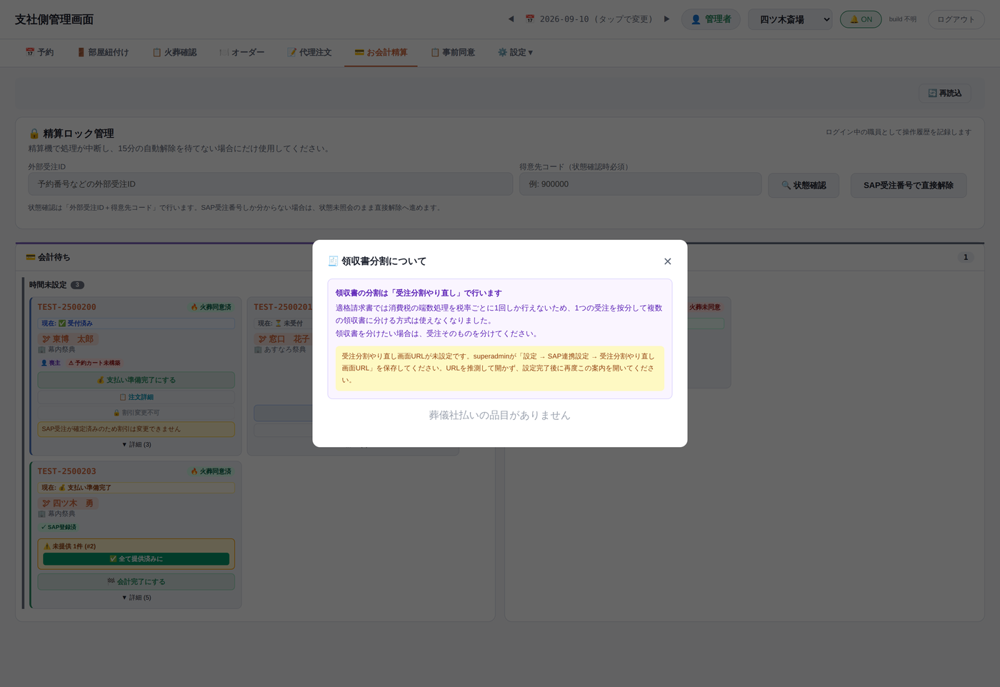

**🏧 精算QRと自動精算機ご利用票**

精算QRの発行後、「🖨️ 印刷」で《**自動精算機ご利用票**》（A4縦1枚）を印刷出来ます。喪家名・取扱い葬儀社名・お支払金額（税込）とQRコードが印字され、「**こちらのQRコードを自動精算機の読み取り部にかざしてください。**」の案内と、注意事項（「内容をご確認のうえお支払いください」「ご収骨開始前にご精算をお願いいたします（式場のご利用者様はご帰宅前にご精算をお願いいたします）」「精算後は本紙を破棄してください」）が入ります:

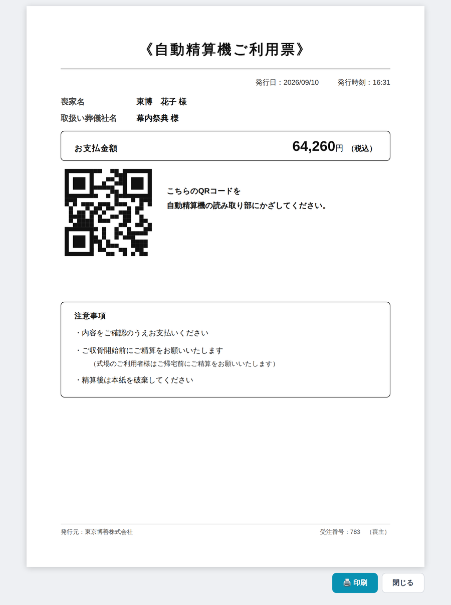

割引の画面は「**割引設定**」という名前で開きます（現在の割引と選択肢が表示され、この葬儀社に使える割引が無い場合は「割引種別が見つかりません」と表示されます。「🚫 割引なし（解除）」で適用済みの割引を外せます）:

「▼ 詳細」を開いた状態（明細・領収書分割などへ進めます）:

| # | 精算QR発行までの手順 |
|---|---|
| 1 | 会計待ちのカードで「✅ 受付する」→「💰 支払い準備完了にする」を押す |
| 2 | 「支払い内訳確認」画面で内訳・警告を確認し「💰 支払いお知らせを送信」（SAPに登録される。最大45秒） |
| 3 | 登録が成功したら「▼ 詳細」を開く →「🏧 精算QRを発行」を押す |
| 4 | 金額を確認してQRを表示 → お客様が自動精算機で読み取ってお支払い |
| 5 | 支払い確認後「🏁 会計完了にする」を押す |

> 「🏁 会計完了にする」で会計が完了すると、お客様のLINEに「**✅ お支払いが完了しました。ご利用ありがとうございました。またのご利用をお待ちしております。**」の通知が届き、お客様のLINEメニューが受付後のメニューに切り替わります。

**会計カードの進み方（受付〜支払いまで）**

| 今の状態 | 大きいボタン | 補助（常時） | 「▼ 詳細」の中 |
|---|---|---|---|
| 受付前（会計待ち列） | ✅ 受付する | 🏷 割引（葬儀社受付では 🏷 振り分け・📋 注文詳細 も） | 🗑 完全削除 |
| 受付済み | 💰 支払い準備完了にする（→ 支払い内訳確認 → 💰 支払いお知らせを送信） | 🏷 割引・🏷 振り分け・📋 注文詳細 | ← 精算受付に戻す・🗑 完全削除 |
| 支払い準備完了後 | 🏁 会計完了にする（※「⚠ 金額照合待ち」「⚠ SAP照合待ち」の間は押せません） | — | 🏧 精算QRを発行・📩 支払いQRを再送・🧾 支払確認・🧾 領収書分割（受注分割へ）・🔄 SAPと照合・↻ SAP再送・← 会計待ちに戻す |
| 会計完了（会計完了列） | — | — | ← 会計待ちに戻す 等（誤操作の取り消し）。精算処理の進行中は「🔒 精算未受付に戻せません」と表示され戻せません |

**🔍 一つ一つの操作の詳しい流れ（お会計精算）**

**① ✅ 受付する** — ご来場を受け付けて、この方の会計を「会計待ち」の列に載せる操作です。押す前にカードの喪家名・葬儀社名・火葬同意バッジ（承諾/未承諾）を確認します。押すとカードが会計待ちに並び、以降の割引・振り分け・精算の起点になります。誤って受付した場合は「▼ 詳細」の「← 精算未受付に戻す」で戻せます（**「💰 支払い準備完了」を押す前まで**）。

**①-2 🖨 紙で受付（喪主がLINEを使えない時）** — カードの喪主の行（👤）には、喪主様のLINE連携の状態が「✅ LINE連携済」または「QR待ち」で表示されます。**「QR待ち」のまま（＝喪主様がQRを読み取れない・LINEをお使いでない）場合は、紫の「🖨 紙で受付」ボタン**が出ます。押すと「喪主を紙で受付します。（LINEなし）続けますか？」の確認が出て、OKすると**LINEなしで喪主様の受付が完了**し、以降の会計（振り分け・精算QR・ご利用票の紙渡し）を通常どおり進められます。LINEに紐付かないため、この方への通知は届きません — お声がけと紙のご利用票でご案内下さい。

**② 🏷 振り分け（品目振り分け）** — 「どの品目を誰が支払うか」を決める操作で、**「💰 支払い準備完了」より前に済ませておくのが原則**です。開いた画面で品目グループごとに支払先（葬儀社〈現金〉・葬儀社〈売掛〉・喪主・**💰 直売**）を割り当てます。「💰 直売」を選んだグループには**直売得意先コード（数字6〜10桁）の入力欄**が開き、未入力のままだと画面下の集計に「⚠ 直売得意先コード未入力◯件」と表示されて確定出来ません。売掛が使えない葬儀社では「🏢 葬儀社（売掛）」の選択肢自体が表示されません。画面下の集計（👤 喪主 ¥◯ / 🏢 現金 ¥◯ / 🏢 売掛 ¥◯ / 💰 直売 ¥◯）で金額の割れ方を確認してから確定します。全品目が同じ支払先なら上部の一括ボタン（「全て👤 喪主」「全て🏢 葬儀社（現金）」「全て🏢 葬儀社（売掛）」）が最速です。割り当てたら必ず「✅ 振り分けを確定」（画面によっては「💾 振り分けを保存」）を押して下さい — 未保存の間は「✏️ 未保存の変更があります」と表示され、保存すると「✅ 振り分けを保存しました」と出ます。「未設定」のまま送信すると**葬儀社払い〈現金〉として扱われ**、SAP側に既に支払割当があるカートでは登録に失敗します。**受注が確定した後は振り分けの変更は出来ません**（ボタンが押せなくなり理由が隣に表示されます）。

**③ 🏷 割引（割引設定）** — 区民葬・献体・減額・公費の割引を適用する操作です。開くと現在の割引と選べる選択肢が表示されます。選択肢は**葬儀社（得意先）ごとの対応可否と連動**しており、使える割引が無い葬儀社では「割引種別が見つかりません」と表示されます。適用済みの割引を外す時は「🚫 割引なし（解除）」を押します。割引は金額の根拠になるため、**支払い準備完了の前に**確定させて下さい。

**④ 💰 支払い準備完了にする（支払い内訳確認 → 💰 支払いお知らせを送信）** — 会計の中心となる操作です。押すと確定前に「**支払い内訳確認**」画面が開き、葬儀社払い（現金）と喪主支払い（現金）の金額・合計（税抜）・品目グループ内訳・警告が表示されます。ここで金額が想定どおりかを必ず確認し（警告が出ている場合は下の警告一覧表に従って先に解消）、「**💰 支払いお知らせを送信**」で確定します。確定した瞬間に、(1) **SAPに支払者ごとの受注番号が発行**され、(2) お客様のLINEへ「💰 お待たせいたしました。お支払いの準備が整いました。…」の本文と**精算QRの画像**が届き、(3) カードの大きいボタンが「🏁 会計完了にする」に変わって「▼ 詳細」の中に精算系のボタンが現れます。内訳が違っていた場合は「🏷 振り分けを変更」からやり直せます（送信前まで）。

**⑤ 🏧 精算QRを発行** — お客様が自動精算機でお支払いになるためのQRを画面に出す操作です（「▼ 詳細」の中・SAP登録成功後に表示）。税込金額が確定している受注は緑色で金額とQRが表示され、「精算QRを発行（税込 ¥◯◯）」で確定します。税込金額を確定出来ない受注では黄色の警告が出て発行出来ません（先に「🔄 SAPと照合」）。発行後は「🖨️ 印刷」で《自動精算機ご利用票》（A4・QRとお支払金額入り）を印刷してお渡し出来ます。**売掛の受注はここには出ません**（自動精算機の対象外・月次のご請求書で回収）。

**⑥ 📩 支払いQRを再送** — お客様のLINEに届いた精算QRが見つからない・消してしまった時に、同じQRをもう一度LINEへ送る操作です。最初の送信がLINE連携の不調で失敗していた場合も、LINE連携・友だち追加を確認してからこのボタン（または同じ「💰 支払いお知らせを送信」）で再送するだけで済みます（受付の状態は「支払い準備完了」のまま進んでいます）。

**⑦ 🧾 支払確認** — 自動精算機でのお支払いが済んだかどうかをその場で照会する操作です。精算機からの入金の連絡は通常自動で届きますが、「お客様は払ったと仰っているのに画面が変わらない」時に手動で確認出来ます。

**⑧ 🏁 会計完了にする** — お支払いの確認が取れた後に押す締めの操作です。押すとカードが「会計完了」列へ移り、**お客様のLINEに「✅ お支払いが完了しました。ご利用ありがとうございました。またのご利用をお待ちしております。」が届き、お客様のLINEメニューが受付後のメニューへ自動で切り替わります**。「⚠ 金額照合待ち」「⚠ SAP照合待ち」が表示されている間は押せません — 先に「🔄 SAPと照合」等で解消します。押した後に誤りに気付いた場合は「← 会計待ちに戻す」で戻せますが、精算処理の進行中は「🔒 精算未受付に戻せません」と表示されます。

**⑨ 🔄 SAPと照合／↻ SAP再送** — 「🔄 SAPと照合」は、画面の金額とSAPの受注金額・割引条件を突き合わせて食い違いを解消する操作です（⚠金額照合待ち・⚠SAP照合待ち・精算QRの金額不一致の時に使います）。「↻ SAP再送」はSAP連携をやり直す操作で、**「⚠ SAP到達不明」の状態では先に「📋 注文詳細」でカートの内容を確認してから**再送して下さい（そのまま再送すると二重投入の恐れがあります）。SAP照合の結果入力は管理者（superadmin）の権限が必要です — スタッフの画面では案内が表示されるので管理者へ連絡して下さい（§6）。

**⑩ 🧾 領収書分割（受注分割へ）** — 領収書を分けたい時の**案内**を開くボタンで、分割そのものはこの画面では行いません。開くと対象のSAP受注番号と「🔀 受注分割やり直し画面を開く」ボタンが表示され、分割は外部の受注分割やり直し画面で行います。既に分割済みの場合のみ「🗑 分割を解除して領収書1枚に戻す」で画面から戻せます。分割やり直し画面のURLが未登録の場合は管理者に「⚙️ 初期設定 → SAP連携設定」での登録を依頼して下さい。

**⑪ 🔒 精算ロック管理** — 自動精算機が処理の途中で止まった時の非常用の操作です。**15分経てば自動解除される**ため、通常は待つだけで構いません。急ぐ場合のみ、「外部受注ID（予約番号など）」と「得意先コード」の2つを入れて「🔍 状態確認」→ 解除対象・理由・斎場コードを選んで「🔓 ロック解除」の順で使います。SAP受注番号しか分からない時の「SAP受注番号で直接解除」は状態を確認しないまま解除する最終手段なので、**別の端末で精算中でないことを必ず確かめてから**実行して下さい。

**🔒 精算ロック管理の使い方**（精算機で処理が中断し、15分の自動解除を待てないときだけ使用）

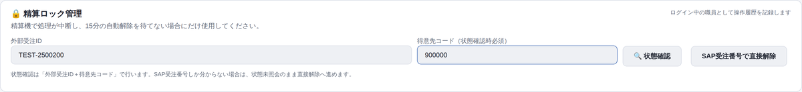

| # | 操作 |
|---|---|
| 1 | 「外部受注ID」に予約番号などを、「得意先コード」（例: 900000）を入力して「🔍 状態確認」 |
| 2 | 状態が表示されたら、**解除対象**（精算のみ／キャッシュバックのみ／精算・キャッシュバック両方）・**理由**（通信断で残留／誤操作／その他）・**斎場コード**（例: YT）を選び、必要に応じて理由の詳細を記入 |
| 3 | 「🔓 ロック解除」を押す |

> SAP受注番号しか分からない場合は「**SAP受注番号で直接解除**」に進めますが、この場合はロック状態を確認しないまま解除することになります（画面にも「⚠ ロック状態は確認できていません」と表示されます）。**別の端末で精算中でないことを必ず確認してから**実行して下さい。
>
> 精算機が途中で止まった場合は15分で自動解除されます。二重会計防止のため、精算機側での二重操作はしないで下さい。

### 3.8 📋 事前同意（事前の火葬同意の一覧・紐付け）

**出来ること:** お客様が前日までに LINE で入力した火葬同意（受付番号つき。例: 260804-0001）の一覧を確認し、予約と紐付けます。名前の入力ゆれなどで自動紐付けされなかったものを、ここで手動で紐付けます。

> **自動紐付けの条件（2026-09-14 操作説明会で周知された運用ルール）**: 「**電話番号・故人名かな・火葬日・斎場**」の**4点が全て一致**した場合に、LINEの申込が自動で予約へ紐付きます。1つでも一致しない場合は自動紐付けされないため、登録内容を確認のうえ、この画面（または「📋 火葬確認」の「LINE申込を検索」）で手動で紐付けて下さい。

| ボタン | 説明 |
|---|---|
|  | **状態の絞り込み** — 全て／未紐付け（初期表示）／紐付け済み |
|  | **検索** — 受付番号・氏名・かな・電話・住所など全項目で部分一致（ひらがな/カタカナどちらでも可） |
|  | **紐付け** — 予約との紐付け画面を開く（下） |

かな検索の例（「とうはく」で検索）:

紐付け画面（火葬日・斎場・故人名・喪家名かなが一致した予約には「完全一致候補」と表示。**一致していても自動確定はされないので、内容を確認して選択**）:

| # | 紐付けの手順 |
|---|---|
| 1 | 「未紐付け」で一覧を表示し、対象を検索 |
| 2 | 「紐付け」→ 火葬予約を検索 → 候補から該当予約を確認 |
| 3 | 「LINE申込を編集して紐づける」で入力内容を確認・訂正（氏名・電話・住所・続柄は空に出来ません） |
| 4 | 「変更して紐づけを完了する」→ 紐付けと申込者へのLINE通知が完了したことを確認 |

> 逆方向（予約から探す）は「📋 火葬確認」の「LINE申込を検索」から行います。
>
> **⚠ 「LINE通知だけ再実行」は押した回数だけお客様に通知が届きます。** 保存と紐付けは何度実行しても同じ結果になりますが、通知の再送だけは重複を防げません。通知が届いていないことを確認してから押して下さい。

**🔍 一つ一つの操作の詳しい流れ（事前同意）**

**① 状態の絞り込みと検索** — 初期表示は「未紐付け」（＝手動対応が必要な申込だけ）です。「全て」「紐付け済み」にも切り替えられます。検索は受付番号・氏名・かな・電話・住所など全項目の部分一致で、ひらがな・カタカナはどちらで入力しても一致します（例:「とうはく」でも「トウハク」でも東博様がヒット）。まず未紐付けで一覧を出し、電話や受付番号で対象を特定するのが基本の流れです。

**② 紐付け（申込→予約の方向）** — 対象の申込の行で「紐付け」を押すと紐付け画面が開き、火葬予約を検索して候補が表示されます。候補には「完全一致候補」（緑）または「要修正」のバッジが付きますが、**一致していても自動確定はされません** — 火葬日・斎場・故人名・申込者名を目で確認してから選択して下さい。

**③ LINE申込を編集して紐づける** — 候補を選んだ後、申込内容の確認・訂正画面に進みます。名前の表記ゆれ（旧字体・スペースの有無など）が自動紐付けを妨げた原因であることが多いため、ここで予約側の表記に合わせて直します。**氏名・電話・住所・続柄は空に出来ません**（空にすると保存でエラーになります）。

**④ 変更して紐づけを完了する** — 最後の確定操作です。押すと紐付けが保存され、**申込者のLINEへ紐付け完了の通知が届きます**。この保存と紐付けは何度実行しても結果が変わらない（安全にやり直せる）操作ですが、**「LINE通知だけ再実行」だけは押した回数分の通知が届く**ため、通知が未達と確認できた時以外は押さないで下さい。

**⑤ 紐付けが出来ない・切り替えられない時** — 候補に「別予約に紐づけ済み」と表示される申込は、既に他の予約と繋がっています。また既に別のLINE申込と紐づいた予約への切り替えは出来ません（「この予約は既に別のLINE申込と紐づいているため切り替えできません」）。この場合はどちらの紐付けが正しいかを予約内容で確認し、誤っている側の扱いを管理者と相談して下さい。

### 3.9 ⚙️ 設定（各種マスタ — 管理者のみ）

**⚙️ 初期設定** — LINEメニューの切替設定・各種連携・イベント履歴・部屋紐付けの標準時間（30分）など:

初期設定の中には、受入テスト（UAT）用の「**OutSystems会員連携 UAT用・隔離予約**」欄があります。実在の予約・会員を使わずに会員登録の試験を行うための専用予約を作成するもので、**通常運用では使用しません**:

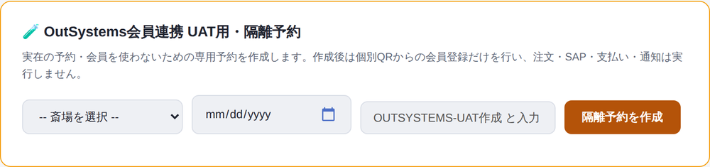

主なセクション:

| セクション | 内容 |
|---|---|
|  | **リッチメニュー** — お客様のLINEメニュー（受付用⇄アフターケア用）の設定・手動切替 |
|  | **Webhook** — LINEからの受信設定 |
|  | **会員情報登録の連携** — 会員情報を外部（アフターケアCRM）へ連携する設定 |
|  | **SAP連携** — SAP登録の有効/無効の切替 |
|  | **イベントログ** — 受付・ログインなどの操作履歴 |
|  | **外部APIキー** — 外部システム接続用の鍵の発行・管理（**画面を撮影・共有しない**） |
|  | **場所・部屋設定** — 部屋紐付けの標準時間（既定30分）など |
|  | **味バリエーション** — 商品の味の選択肢（ホット/アイス等）の設定 |

初期設定の中の外部連携カードは2種類あります。「**🧾 会員情報登録API 送信先**」は火葬予約の会員情報を外部システム（OutSystems）へ登録する連携で、送信のON/OFF・送信先URL・最終送信の記録（送信もスキップも記録が残ります）をここで管理します。連携がOFFの間は「⚠ 連携は現在OFFです。火葬予約をしても会員情報登録API（OutSystems）は呼び出されません。」と黄色の注意が表示されます。「**🔐 管理アカウント連携API 送信先**」は管理アカウント情報の外部送信の設定で、個人情報の送信範囲に関わるため**管理者（superadmin）にだけ表示されます**:

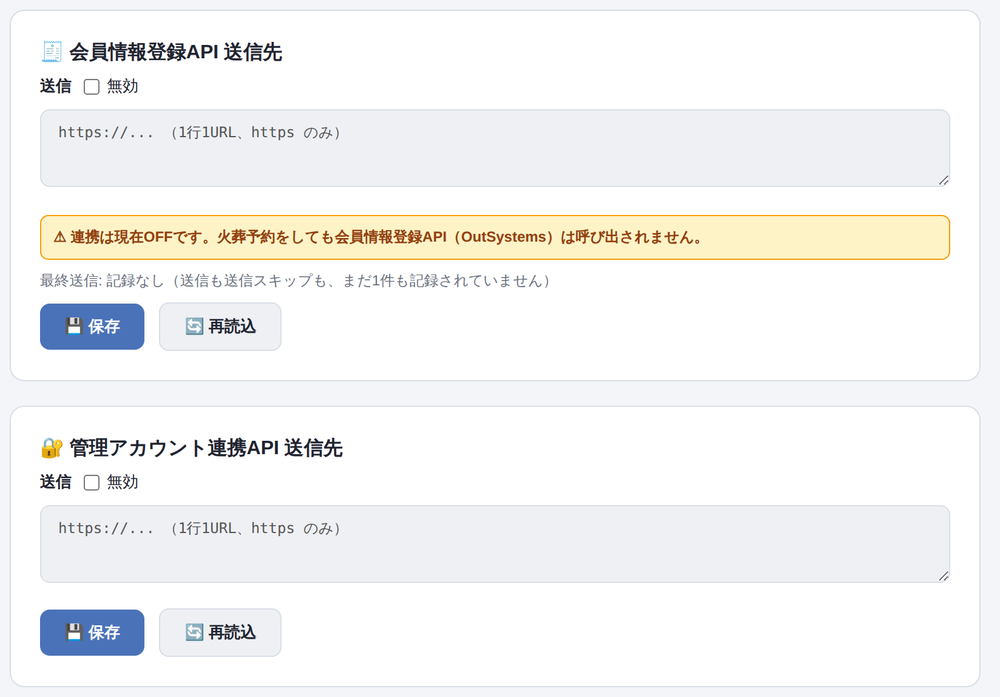

**👥 会員** — LINE会員の一覧。葬儀日・経過日数・メニュー切替（受付⇄アフターケア）・来店/注文回数・累計金額・削除:

**📦 商品** — SAPから取り込んだ商品カタログの確認・同期。分類での絞り込みのほか、上部に同期の操作が並びます（1回あたりの件数を指定して「**🔄 全同期**」「**⚡ 差分同期**」「**📍 保管場所マスタ同期**」、管理者用の「**🗑 DB削除**」。このほか「**🏷 カタログ同期**」「**🔒 ブロック同期**」の個別同期もあります）。一覧には「受注ブロック」列が加わり、SAP側で受注を止めている品目が分かります:

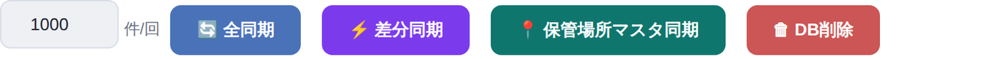

**🔍 商品の同期ボタンの使い分け（詳しく）**

| ボタン | 何をするか・使いどころ |
|---|---|
| 🔄 全同期 | **中間サーバーに「SAPから取り直して」と依頼したうえで**、全商品を取り込み直します（以前は中間サーバーの手持ちデータを写すだけで、SAP側の最新が反映されないことがありました）。「件/回」で1回あたりの取得件数を調整出来ます。商品情報が古い・件数が合わない時の基本手段です |
| ⚡ 差分同期 | 前回の同期以降に変わった分だけを取り込みます。日常のメンテナンスはこちらで十分です |
| 📍 保管場所マスタ同期 | SAPの品目×保管場所のマスタを取り直し、画面の絞り込みキャッシュも更新します。「保管場所が未登録」「在庫の場所が合わない」時に使います |
| 🗑 DB削除 | 取り込んだ商品データを削除します（「プラント「◯◯」の商品をDBから削除しますか？ 削除後は「🔄 全同期」で再取得してください。」の確認つき）。**削除しただけでは商品が空のまま**なので、必ず続けて全同期を実行して下さい |
| 🏷 カタログ同期 | お客様の注文メニュー（カタログ）を斎場の設定から作り直します |
| 🔒 ブロック同期 | 得意先の受注・納品・請求ブロック情報をSAPから取り直します（得意先タブと連動。進捗が「🔒 ブロック同期中 ◯/◯件」で表示されます） |

**📊 在庫** — 在庫管理の画面が刷新され、使えるようになりました。斎場と保管場所を選んで「**📥 在庫取得**」を押すと、在庫API経由で品番・商品名・保管場所・在庫数・単位が一覧表示されます（1回の取得件数も調整可）。保管場所の選択肢が空で「⚠ 保管場所が未登録です」と出る場合は、商品タブの「**📍 保管場所マスタ同期**」で保管場所を取り込んでから開き直して下さい:

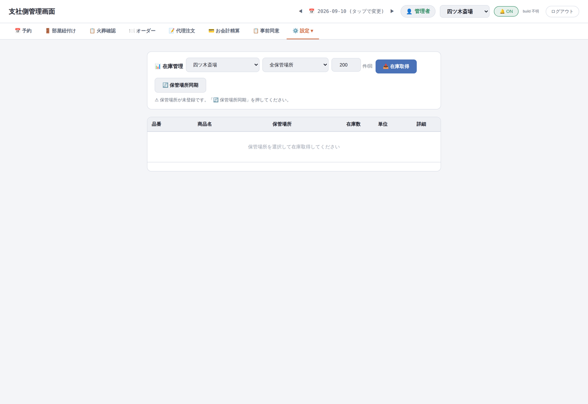

**🏢 得意先** — 葬儀社の一覧（幕内祭典・あすなろ祭典・セレモニー光など）。**区民葬・献体・減額・公費の割引可否**はここの設定が会計画面に反映されます。一覧は「全て（ブロック含む）／受注ブロックなし／受注ブロックあり」で絞り込め、行の詳細では**受注ブロック・納品ブロック・請求ブロック**の状態（🚫あり／なし）を確認出来ます — 受注ブロックが付いた得意先はSAPで受注を止められている状態のため、注文・売掛の前に必ず確認して下さい。ブロック情報が古い時は商品タブの「🔒 ブロック同期」で取り直します:

**🏛️ 斎場設定** — 7斎場と、斎場ごとの売り場・部屋・取扱商品の設定:

売り場の「⚙ 設定」で「**フリードリンク予約に基づく出し分けを有効化**」「**ラストオーダーの対象とする**」を設定します。**フリードリンクは休憩室でのみ**有効にでき（それ以外は「（休憩室以外では使えません）」と表示）、**売店はラストオーダーの対象外**です（「（売店はラストオーダーの対象外です）」と表示）:

> **売上場所ごとの「注文出来る商品」の出し分け**は、売上場所マスタの**注文場所種別（SAP location）**の設定で決まります（例: 休憩室=フリードリンクのみ／ラウンジ=軽食・デザート／式場控室=有料ドリンク）。**注文場所種別が未設定の売上場所では全商品が表示されます**。「関係のない商品まで注文画面に出る」時は、まずこの設定を確認して下さい。

**👤 ユーザー** — スタッフアカウントの発行。権限・担当斎場（空欄=全斎場）・既定の売り場・ログインキー発行:

一覧の「設定」を押すと「**⚙ ◯◯ の設定**」画面が開きます。「**アクセス範囲**」でその利用者が操作出来る斎場（許可斎場。「全斎場」も可）を、「**デフォルト設定**」でログイン直後に選ばれる売上場所を設定し、「**💾 設定を保存**」で確定します。「**🔑 キー再発行**」で印刷カード用のログインキーを再発行出来ます:

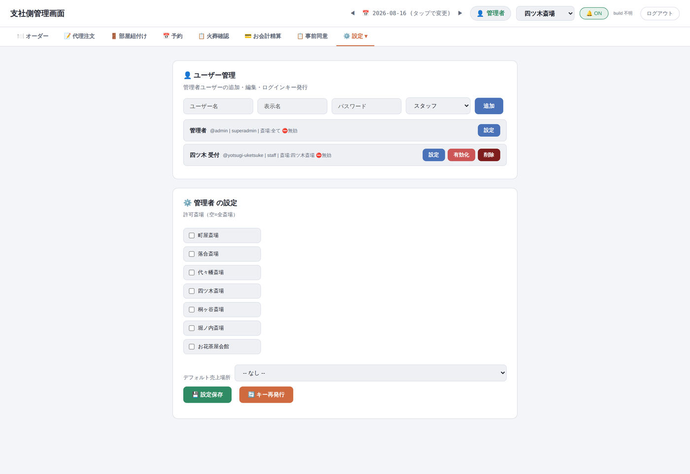

**📱 QR発行** — 2種類のQRを発行します:

| QR | 用途 |
|---|---|
| 注文用QR | 斎場×売り場×ラベル（例: 机1）を指定して発行し、印刷して机上などに設置。読み取るとその売り場の注文メニューが開く（旧称: オーダー用QR）。**売店以外は部屋の情報を持つため部屋紐付けが必要**（売店のQRだけは部屋なしで発行でき、常時注文可）。**非表示に設定した売上場所のQRは新しく発行出来ません** |
| 事前同意QR | 全申込者共通の固定QR。東京博善から各葬儀社に配布し、商談時にお客様が読み取る |

> **注意: ここで発行するQRと「精算QR」「受付QR」は全て別物です。** 精算QRは「💳 お会計精算 → 💰 支払い準備完了にする → ▼詳細 → 🏧 精算QRを発行」から、受付QR（火葬同意用・その方専用・有効期限48時間）は「📋 火葬確認」のQR・受付票印刷から発行します。注文用QRには売り場と部屋の情報だけが入っており、受付QRには同意用の使い切りの鍵だけが入っています — 取り違えるとそれぞれ読めません。

### 3.10 💐 アフターケアCRM「喪主の窓口」（コールセンター向け・新設）

葬儀後のご遺族対応（アフターケア）のための管理画面「**喪主の窓口**」が新しく出来ました。支社管理画面とは**別のページ**（`crm.html`）で、コールセンターの担当者が専用のユーザー名・パスワードでログインして使います:

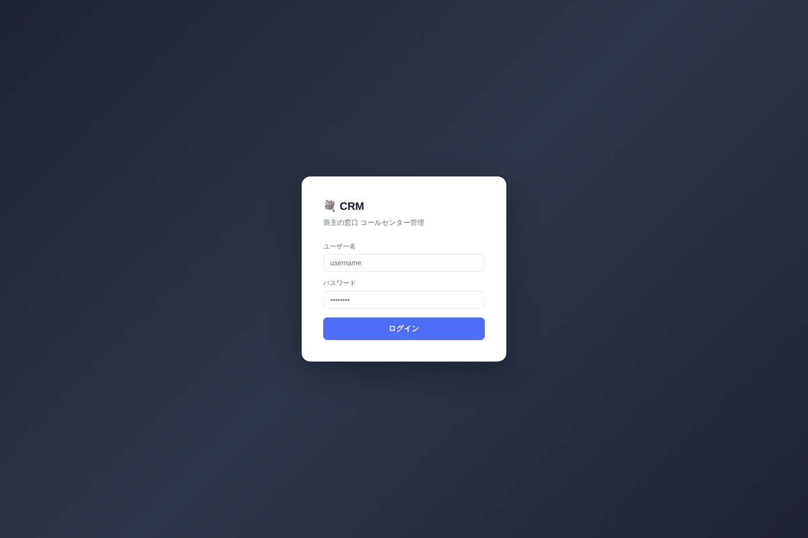

ログインすると「**架電リスト**」が開きます。上部にAC会員総数・未登録・再架電・架電済み・資料請求・詳細打合せの集計が並び、下の「AC会員 架電リスト」で会員ごとの電話番号・葬儀日・ステータス・ラベル・再架電予定・担当を管理します。左のメニューから「**LINEチャット**」「**チケット**」（対応案件の管理・サブチケット）や「**統計**」に移動でき、画面右下の通話ボタンから**ブラウザ上で発信**出来ます:

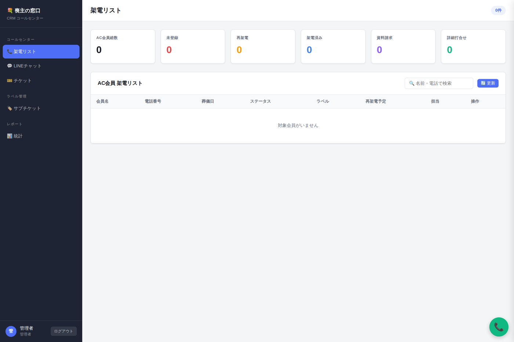

左メニューの各画面は次の通りです。

**💬 LINEチャット** — お客様からのLINEのお問い合わせをチケット単位で扱います。左の一覧（未対応／クローズの別・最終メッセージ・受信時刻）からチケットを選ぶと、右側でやり取りの確認と返信が出来ます。上の検索欄と状態の絞り込みで対象を探せます:

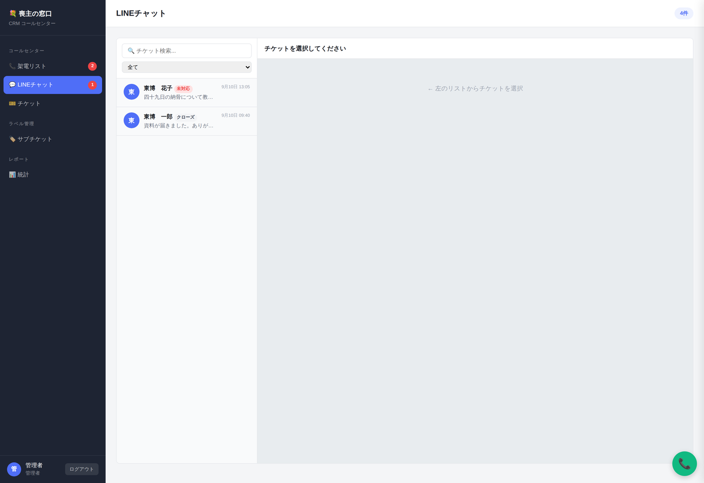

**🎫 チケット** — 架電案件の一覧です。会員名・電話番号・ステータス（未登録／再架電／架電済み／資料請求／詳細打合せ）・ラベル・架電数・最終架電が並び、「詳細」から対応履歴に進みます:

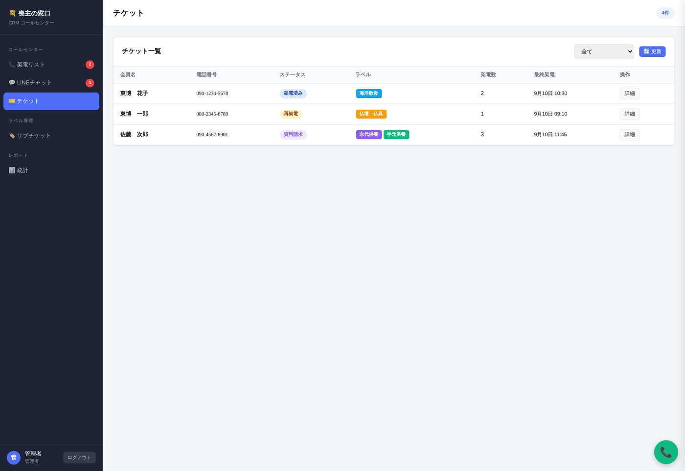

**🏷️ サブチケット** — ラベル（海洋散骨・永代供養・仏壇・仏具・手元供養 など）ごとの個別案件の管理です。上部のラベルで絞り込み、案件ごとのステータス（未対応／資料請求／申込手続き／決済済み／完了／見送り）・担当・次回アポを扱います。ラベル担当（label_agent）のアカウントでログインすると、この画面だけが表示されます:

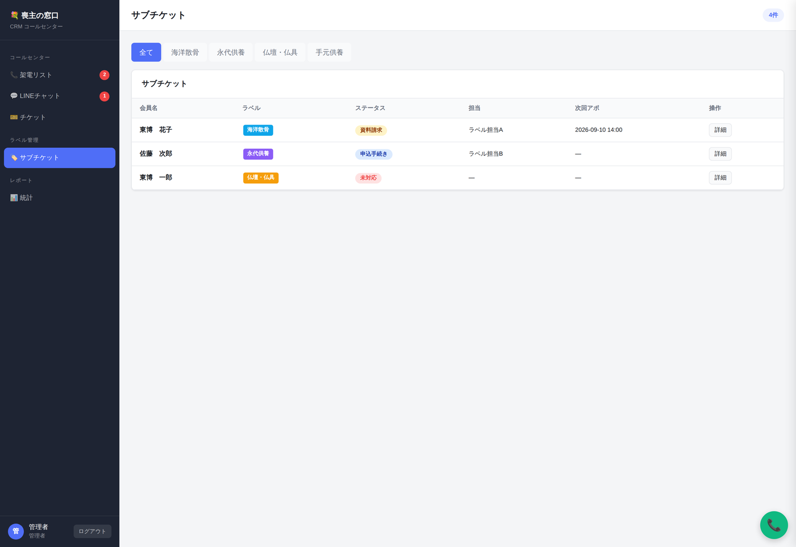

**📊 統計** — ステータス別の件数・チケット/サブチケット総数・本日架電数などの集計です:

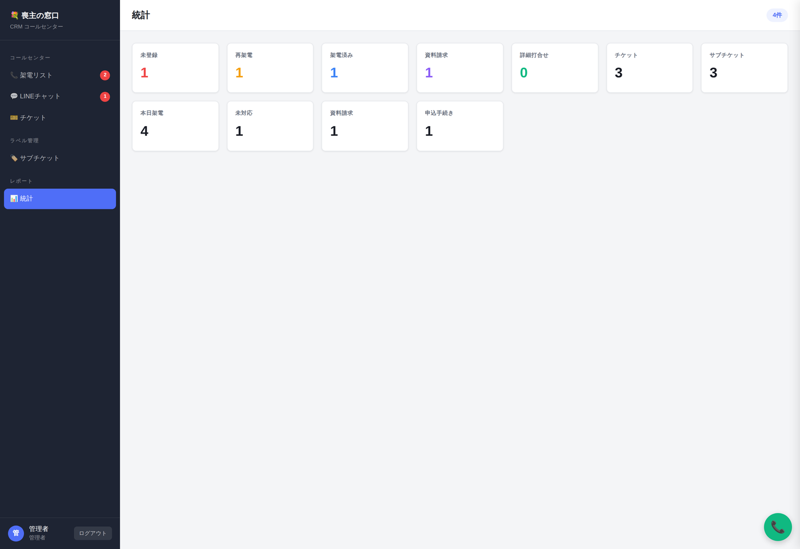

**🔍 一つ一つの操作の詳しい流れ（CRM「喪主の窓口」）**

**① 📋 担当** — 架電リストで担当が付いていない会員に表示されます。押すと自分がその会員の担当になり、以降の架電・記録を進めます。

**② 詳細（会員詳細パネル）** — 会員の基本情報・ステータス・再架電予定に続き、「**📞 架電記録**」のカードが開きます。電話番号がある会員には「**📞 ブラウザ発信**」（画面内のソフトフォンで発信・通話中はタイマー表示）と「**📱 端末発信**」（スマホ等の電話アプリで発信）の2つの発信ボタンが出ます。通話後は 通話結果（接続／不在 など）・ステータス・再架電予定・メモ を入力し「**💾 架電記録を保存**」で記録します。ブラウザ発信の通話は終了時に自動で録音が保存され、履歴の「**🎧 録音**」で聞き直し、「**📝 文字起こし**」で本文化出来ます（完了すると✅印）。LINE連携のある会員には「**💬 LINE送信**」からメッセージも送れます。

**③ 資料請求の記録** — 資料請求を受けた時は、送付先氏名・郵便番号・住所・電話・都合の良い時間帯・メモを入力して保存します（「✅ 資料請求を保存しました」）。ステータスも「資料請求」に揃えます。

**④ LINEチャットの返信** — チケットを選ぶと右側にやり取りが表示され、下の入力欄（「返信を入力...（LINEに送信されます）」）から「**📤 送信**」で**お客様のLINEに実際に送信**されます。お客様に見せない社内向けの記録は「**📝 内部メモ**」で残します — 送信と内部メモの押し間違いにご注意下さい。

> **⚠ 現在の検証環境のビルドでは、画面切替に不具合があり、「架電リスト」以外のメニュー（LINEチャット・チケット・サブチケット・統計）を押すと内容が表示されず空白になります**（画面の作りの問題で、データは失われていません）。上の画像は本来表示される画面です。修正されるまでは架電リストを中心にご利用下さい。
>
> 本書は支社（斎場）運用が中心のため、CRMの詳細な操作手順は対象外です。ここでは「葬儀翌日以降のご遺族対応はこの画面に引き継がれる」ことを押さえて下さい。

---

## 4. LINEミニアプリの操作手順（お客様向け画面）

お客様（喪主さま・ご遺族・お連れ様）のスマホに表示される、LINEミニアプリ「**東京博善の窓口**」の画面です。斎場スタッフがお客様をご案内する際の参考にして下さい。

**画面下部の共通メニュー** — 受付画面（§4.2 STEP 5）以降、各画面の下部に常に表示されます:

| ボタン | タップすると |
|---|---|
|  | **ホーム画面**（§4.3）へ。受付番号・受付時刻の確認と、「料金確認（喪主払い分）」「お食事・ご注文へ」への入口 |
|  | **注文メニュー**（§4.3）へ。読み取ったお部屋（例: 四ツ木斎場 控室「月の間1」）の商品一覧。受付前は薄い表示で押せません |
|  | **予約カート**（§4.4）へ。火葬料金などのご予約内容と、ご注文の一覧 |
|  | **ご注文履歴**（§4.4）へ。この予約の注文・本日の注文・全履歴 |
| 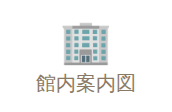 | **館内案内図**（§4.6）へ。斎場のフロア図を階ごとに拡大・縮小して確認出来ます |

> 以前あった「公式」（トーク画面へ移動）のボタンは廃止されました。公式LINEのトークへは、TOP画面の「🔔 公式LINEの追加」カードや通知メッセージから移動します。

### 4.1 前日まで（事前同意）— お客様の導線

葬儀社との商談時にご案内する**事前同意QR**（全申込者共通）から、お客様がご自身のスマホで**火葬日前日の17時まで**に行うお手続きです。トーク画面とミニアプリの行き来を含めた全体の流れ:

> **ミニアプリの外（LINEの画面）へ移動するのは2か所だけです。**
> ① STEP 3 友だち追加 — LINEの友だち追加画面へ一時的に移動し、お客様ご自身でミニアプリへ戻ります
> ② STEP 6 完了画面の「閉じる」— ミニアプリが閉じ、LINEのトーク画面に戻ります

**STEP 1: 事前同意QRを読み取る（LINEのカメラ／トーク画面）**

お客様がLINEのカメラ、またはトークに届いたリンクから事前同意QRを開くと、トーク画面の上にミニアプリ「東京博善の窓口」が立ち上がります。※LINE本体側の画面（カメラ・トーク一覧）はLINE社のアプリ画面のため本書には掲載していません。

**STEP 2: TOP画面 —「申込にすすむ」をタップ**

「東京博善をご利用いただきありがとうございます。」の挨拶文と、お手続きの案内（**火葬日前日の17時まで**）、「📋 ご確認事項」、7斎場の「📞 各種お問合せ先」が表示されます:

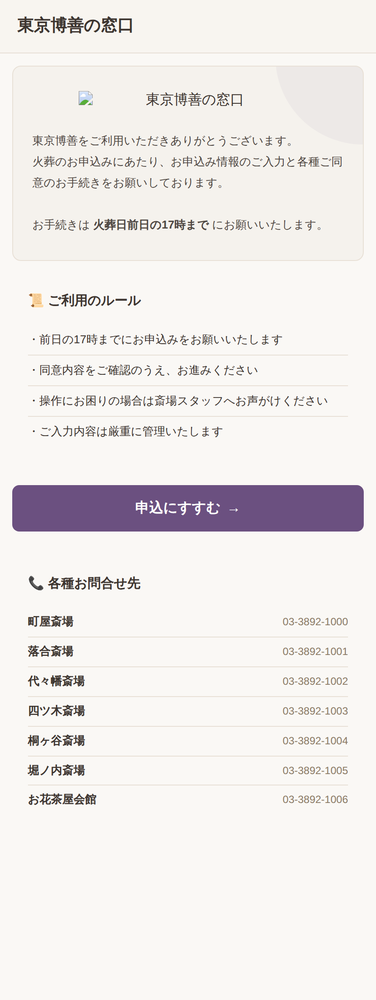

| ボタン・部品 | 説明 |
|---|---|
|  | **申込にすすむ →** — タップすると、公式LINE未追加の方は STEP 3（公式LINEの追加）へ、追加済みの方は STEP 4（申込者情報の入力）へ進みます |
|  | 📋 ご確認事項 — 「次ページ以降でご同意内容をご確認のうえ、お進みください」「ご入力いただいた情報は厳重に管理いたします」の2項目 |
|  | 📞 各種お問合せ先 — 登録されている斎場の代表電話番号の一覧 |

公式LINEが未追加の場合は、TOP画面に「**🔔 公式LINEの追加**」カードも表示されます。「公式LINEを追加」「追加画面が開けない場合：公式LINEを開く」「追加後に状態を確認する」の3つの入口があり、ここから追加状態を確認出来ます。

**STEP 3: 公式LINEの追加（未追加の方のみ）— ここでLINEの画面へ移動します**

**東京博善公式LINEの追加は必須です。** 追加が確認出来るまで申込みには進めません。画面名は「**火葬お申込みの事前準備**」で、「📋 お手続きの手順」として「1. 下のボタンから公式LINEを「追加」する ／ 2. そのままLINEのトーク画面を開く ／ 3. 届いたメッセージのURLからお申込みへ進む」の3手順が示されます:

| ボタン | 動き |
|---|---|
|  | **東京博善公式LINEを追加する** — **ミニアプリを離れ、LINEの追加画面へ移動します。** 追加すると公式LINEのトークに申込み用のURLが届き、そこからお申込みに進みます。「追加が確認できるまで、申込みには進めません。」の注意書きも表示されます |

追加の状態は、TOP画面の「🔔 公式LINEの追加」カードの「**追加後に状態を確認する**」でも確認出来ます。既に追加済みの方にはこの画面は表示されず、STEP 2 から直接 STEP 4 へ進みます。

**STEP 4: 申込者情報の入力（予約内容の確認）—「次へ（規約確認）」をタップ**

画面名は「**予約内容の確認**」。開いた直後は未入力の状態です:

斎場・火葬日・故人さまの氏名（かな）・申込者さまの氏名（かな）・電話番号・**メールアドレス**・郵便番号（🔍住所検索付き）・住所・故人様から見たご関係（続柄）を入力します。**全て必須**です（メールアドレスも必須で、形式が正しくないと進めません）。入力し終えた状態:

| ボタン | 説明 |
|---|---|
|  | **次へ（規約確認）** — 入力に不備があると、**最初の不備1件**が黒い帯で表示されて進めません（例: 未入力なら「⚠️ 斎場は必須です」「⚠️ 故人様姓は必須です」のように**項目名つき**で表示）。メールアドレスは「⚠️ メールアドレスの形式が不正です」、電話番号は10桁または11桁、郵便番号は7桁、かな欄はひらがな・カタカナのみ（カタカナで入力しても、ひらがなに揃えて保存されます）。続柄で「その他」を選んだままだと「続柄は具体的に入力してください」と案内されます |

未入力のまま「次へ（規約確認）」を押した状態（左: 「⚠️ 斎場は必須です」）と、メールアドレスの形式が誤っている状態（右: 「⚠️ メールアドレスの形式が不正です」）。黒い帯の警告が画面上部に数秒表示されます:

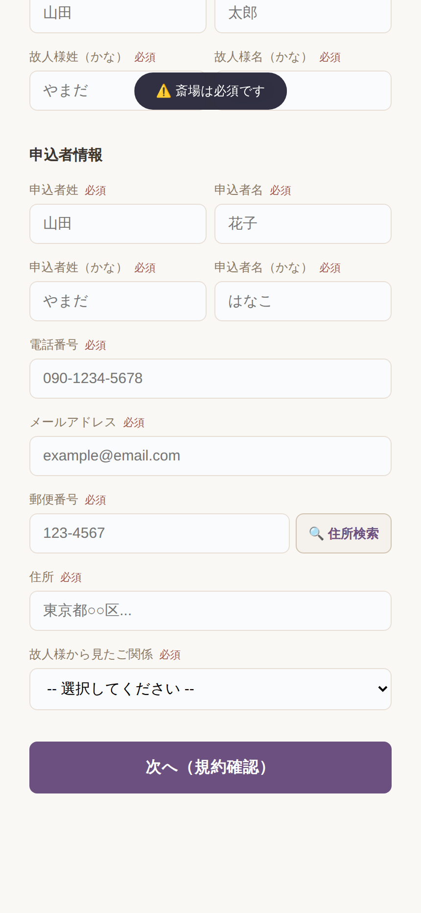 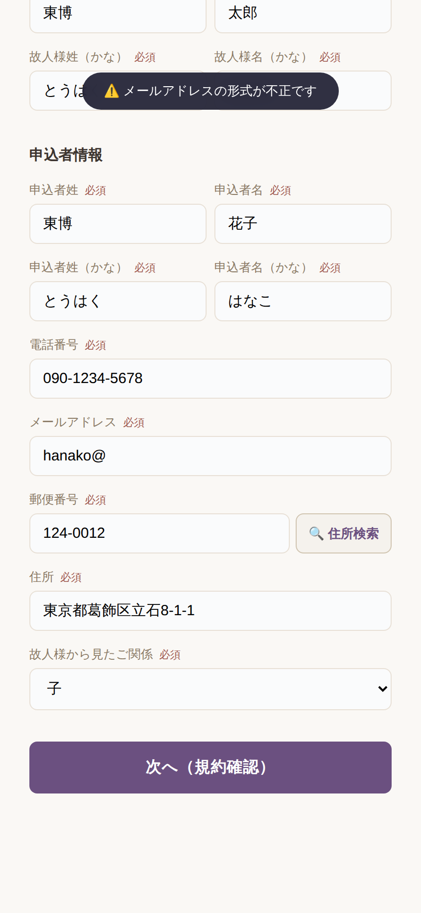

**STEP 5: 規約への同意（ご利用にあたりご確認下さい。）—「次へ進む」をタップ**

「**火葬の申込**」（**必須**）と「**LINEミニアプリ（東京博善の窓口）利用規約**」（任意）の2つが表示されます。チェックを入れる前は「次へ進む」ボタンは押せません（薄い色）:

「**以下の内容を確認し、同意する**」（まとめてチェック）をタップすると両方にチェックが入り、ボタンが押せる色に変わります:

| 部品 | 説明 |
|---|---|
|  | まとめてチェック — 表示中の規約全てに一括で同意/解除 |
|  | チェック前の「次へ進む」（押せない状態） |
|  | チェック後の「次へ進む」（押せる状態）。※火葬の申込規約への同意は必須・利用規約は任意です |

**STEP 6: 完了画面 —「閉じる」でLINEのトーク画面に戻ります**

「**火葬の申込を受付させていただきました。**」と表示されて、お客様のお手続きは完了です。「当日のご不明な点等ございましたら、葬儀社様または各火葬場までご連絡ください。」の案内が添えられます。受付番号（260804-0001 形式）は管理画面「📋 事前同意」の一覧に発番され、スタッフ側で確認します（お客様の画面に表示される場合もあります）。※掲載画像の黄色い「LINE確認通知を送信できませんでした」は検証環境特有の表示です:

| ボタン | 動き |
|---|---|
|  | **閉じる** — **ミニアプリが閉じ、LINEのトーク画面に戻ります** |

### 4.2 当日（火葬同意〜受付）— お客様の導線

斎場でご案内する**受付QR（予約個別QR）**の読み取りから受付完了までの導線です。前日までに事前同意がお済みの方は、同意画面と申込者情報入力が**自動的に省略**されます:

> 当日の導線では、**トーク画面へ自動的に戻る場面はありません。** 受付完了後はそのままミニアプリ内で注文（§4.3）へ進みます。トーク画面を開きたい場合は、LINEアプリ側の操作（ミニアプリを閉じる）で戻ります。

**STEP 1: 受付QRを読み取る（LINEのカメラ）**

スタッフが「📋 火葬確認」画面の「QR」ボタンで表示したQR、または受付票のQRを、お客様がLINEのカメラで読み取ります。

**STEP 2: TOP画面 — 故人さまの情報を確認して「申込にすすむ」**

当日のTOP画面では「次へ進む前に、表示されている**「故人様の情報」がご身内の方で間違いないか**必ずご確認ください。」の案内とともに「**📋 ご登録内容（故人様）**」（**故人氏名・ふりがな・火葬日・斎場**）が表示されます。お客様にお間違いがないかを確認していただいてから進みます（ご利用のルール・お問合せ先は当日は表示されません）:

| 部品 | 説明 |
|---|---|
|  | ご登録内容（故人様）（例: 東博 太郎さま・とうはく たろう・火葬日・四ツ木斎場） |
|  | **申込にすすむ** — タップすると STEP 3（規約への同意）へ。同意・入力が全てお済みの方は、受付（STEP 5）まで自動で進みます |

**STEP 3: 規約への同意 —「次へ進む」をタップ（同意済みの方には表示されません）**

画面は前日の STEP 5 と同じですが、**未同意の規約だけ**が表示されます。火葬同意・利用規約とも同意済みの方はこの画面ごとスキップされます:

同意が完了すると、管理画面「📋 火葬確認」で該当のご予約が**「承諾」**表示に変わります。

**STEP 4: 申込者情報の入力（未入力の場合のみ）—「入力して受付へ進む」**

ご予約に申込者さまの情報が入っていない場合に表示されます。**お名前・ふりがな・電話番号・メールアドレス・郵便番号・住所・続柄が全て必須**です。開いた直後（未入力）と入力し終えた状態:

| ボタン | 説明 |
|---|---|
|  | **入力して受付へ進む** — 登録して受付画面へ |

> **ご予約のあるお客様（当日の受付QRから入られた方）には「あとで入力する」は表示されません。** この画面で全て入力しないと受付に進めません。「あとで入力する」が出るのは、ご予約に紐づかない入口（お連れ様など）から入られた場合だけです。その場合も**火葬中（お会計前まで）の入力が必要**で、未入力の間はホーム画面に「申込者情報を入力する」の案内が表示され続けます。

**STEP 5: 受付 —「火葬申込をする」をタップ**

お名前と「未受付」の状態が表示されます:

| ボタン | 説明 |
|---|---|
|  | **火葬申込をする** — 受付を確定します。利用規約が未同意の場合は同意画面に戻ります |

**STEP 6: 受付完了 — 受付番号が表示され、そのまま注文へ**

「✅ 受付完了！」と表示され、**受付番号（例: #1）・受付時刻・ステータス「受付完了」**が確認出来ます。以後は「お食事・ご注文へ」からモバイルオーダー（§4.3）に進みます:

### 4.3 受付後〜ご注文の画面

**ホーム（受付状況）** — 受付前は「未受付」バッジと「火葬申込をする」ボタン、申込者情報が未入力の間は「申込者情報を入力する」の案内が表示されます:

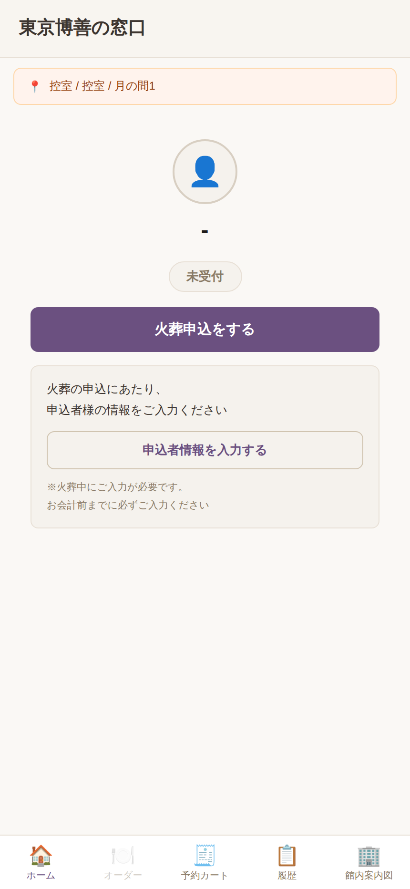

受付後の起点になる画面です。お名前（例: 東博 一郎さま）・「受付済み」バッジ・**受付番号（#1）・受付時刻・ステータス「受付完了」**が表示されます。「**お食事・ご注文へ**」をタップすると注文メニューへ、「**💰 料金確認（喪主払い分）**」をタップすると料金確認（§4.4）へ移動します。申込者情報が未入力の間は「申込者情報を入力する」の案内も表示されます（受付前後の画面の変化は §4.2 STEP 5・6 参照）:

**注文メニュー** — お部屋に設置された注文用QR（例: 四ツ木斎場・控室「月の間1」）をLINEのカメラで読み取ると、その売り場のメニューが開きます。画面上部の📍現在地バーで、どのお部屋あてのご注文になるかを必ず確認して下さい。上部に「**商品を検索**」欄（商品名・品番で部分一致）が加わり、商品カードには数量の「−」「＋」が直接付いて、その場でカートに入れられるようになりました:

| 部品 | タップすると／説明 |
|---|---|
|  | 現在地バー — 今開いているメニューの売り場とお部屋。別のお部屋のQRを読み取ると表示が切り替わります |
| 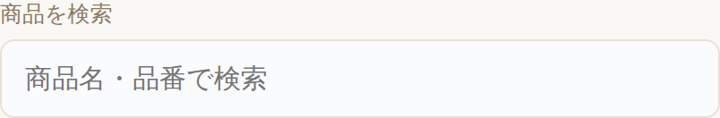 | 商品を検索 — 商品名・品番の一部を入力すると一覧が絞り込まれます |
|  | カテゴリタブ — 「お飲み物」「お食事」「フリードリンク」の商品一覧を切り替えます |
|  | **注文を確定する →** — カートの内容を送信します。送信完了まで**最大45秒**かかることがあります。画面はそのままでお待ちいただき、**再送信はしないで下さい**（二重注文の原因になります） |
|  | カートバー — タップで中身を開閉（例: 🛒 カート 2点 ¥800）。開くと品目ごとの数量変更も出来ます |

**フリードリンクタブ** — フリードリンクが有効なお部屋のお客様にのみ表示されます。対象のお飲み物（ブレンドコーヒー・アイスコーヒーなど）はこのタブから注文します。※ラストオーダーの設定があるお部屋では、時刻（既定: お部屋の利用終了30分前）を過ぎるとご注文いただけません:

**商品の詳細** — 商品カード（例: ブレンドコーヒー ¥400）をタップすると、説明文「香り高いオリジナルブレンド。ホットでご提供します。」と数量の−／＋が表示されます（味の選択肢がある商品はここでホット/アイス等を選びます）。＋を押すとカートに入り、×で商品一覧に戻ります:

**カートを開いた状態** — 品目・数量・金額（例: ブレンドコーヒー×2 ¥800・オレンジジュース×1 ¥430、合計¥1,230）を確認して「注文を確定する →」:

カートの上部バー（点数と合計金額）と、品目ごとの「−」「＋」（数量の変更が出来ます）:

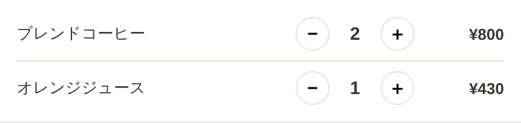

**注文完了** — 「ご注文を承りました」と**ご注文番号（例: 006）**が表示されます。「**追加注文**」をタップすると注文メニューへ、「**ホームに戻る**」をタップするとホーム画面へ戻ります。友だち追加済みの方には、注文ステータスのお知らせがLINE公式アカウントのトークに届きます:

### 4.4 履歴・予約カート・料金確認

**ご注文履歴**（下部メニュー「履歴」）— ご予約に紐づく方は「**🔖 この予約の注文**」、ご予約のない方は「**📅 本日の注文**」が最初に表示されます。「**📜 全履歴を見る**」をタップすると過去のご注文まで一覧出来、「↩ 戻す」で元の表示に戻ります。注文ごとに、注文番号（例: #3）・日付・品目・数量・金額と、「提供済み」「お会計済み」の状態が表示されます:

履歴の見出し行の拡大（「🔖 この予約の注文 (2件)」と「📜 全履歴を見る」）:

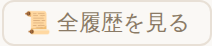

「📜 全履歴を見る」を押した状態（過去のご注文まで一覧。「↩ 戻す」で元の表示へ）:

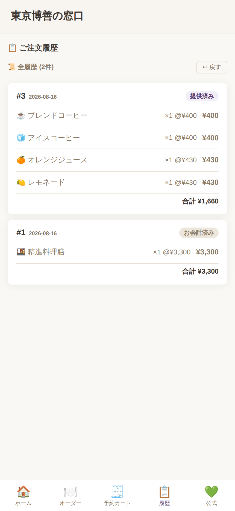

**履歴の状態表示と管理画面の対応** — お客様の履歴に出る状態の言葉は、管理画面のオーダーの列と次のように対応します。

| お客様の履歴の表示 | 管理画面での状態 |
|---|---|
| （表示なし） | 未処理（注文が入った直後） |
| 調理中 | 調理開始を押した後 |
| 提供済み | 提供済み（お渡し済み） |
| お会計済み | 会計が完了した注文 |
| キャンセル | 取り消した注文 |

> お客様から「注文したのに履歴に状態が出ていない」と聞かれた時は、まだ「未処理」の段階です（未処理は履歴に状態の文字が付きません）。

**予約カート**(下部メニュー「予約カート」) — 火葬のご予約内容とご注文を1つの画面でまとめて確認出来ます。カート合計(例: 4品目 ¥64,260)の下に、**📝 予約品目(例: 火葬料金〈最上等〉¥59,000)／🏢 代理注文(例: 精進料理膳 ¥3,300)／👤 自分の注文(例: ブレンドコーヒーほか3点 ¥1,660)／👥 他メンバー(例: オレンジジュース ¥300)**が色分けのラベルつきで並びます。表示価格は目安で、確定金額は精算時に決まります:

**料金確認（喪主払い分）**（ホーム画面の「💰 料金確認」）— 喪主さまがお支払いになる分の合計（例: 5品目 ¥64,260・税抜¥58,418／税¥5,842）です。税額を取得出来ない品目があるときは「**合計（税抜）**」に切り替わり、「※ 税額を取得できていないため税抜表示です」と注記が出ます。SAPで金額が確定すると「**✓ 確定金額**」、確定前は「**◻️ プレビュー**」と表示されます。式場（式場使用料）・火葬（火葬料金〈最上等〉）・骨壺（白磁 7寸）・菓子飲料（精進料理膳・ブレンドコーヒー）のグループごとに小計が出ます。「← 戻る」でホームに戻ります:

### 4.5 こんな画面が出たら

**「オーダーQRコードを読み取ってください」** — お部屋の情報がない状態で注文メニューを開いたときに表示されます。「**QRコードを読み取る**」をタップすると**LINEのQRコードリーダーに移動**するので、お席のオーダーQRを読み取るようご案内下さい:

**「ただいまこのお部屋ではご注文いただけません」** — お部屋の紐付けが未実施か期限切れです。スタッフが管理画面の「🚪 部屋紐付け」で該当のお部屋（例: 控室「月の間1」）にご予約を紐付けると解消します。お客様側の「**部屋紐付け後に再試行する**」をタップすると、紐付け後にそのまま注文へ進めます:

**「斎場を選択してください」** — 位置情報から複数の斎場に該当した場合に表示されます。町屋斎場〜お花茶屋会館の一覧から、ご利用中の斎場をタップして選びます:

**「LINE認証を完了できませんでした」** — LINEとの通信が上手くいかなかったときに表示されます。「**もう一度試す**」で再読み込みされます。繰り返し出る場合は、**画面を閉じずに**斎場スタッフへお声がけいただくようご案内下さい:

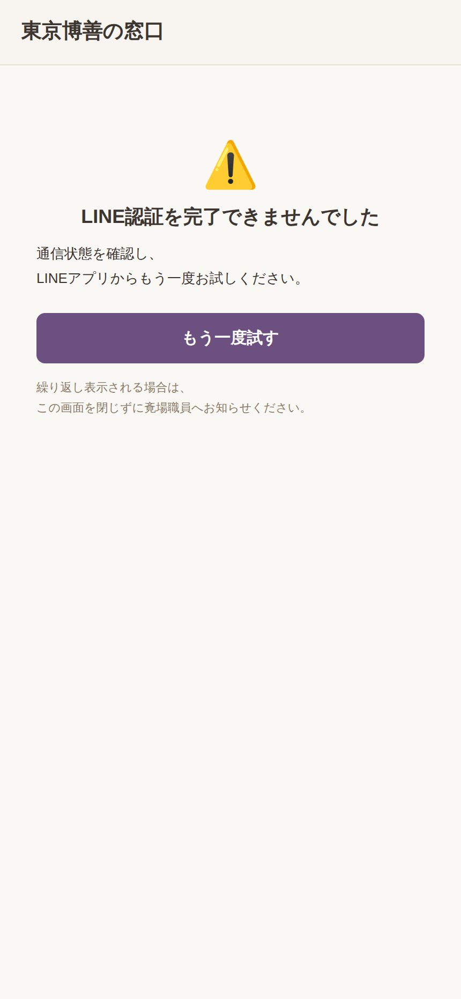

### 4.6 🏢 館内案内図（新設）

下部メニューの「**館内案内図**」から、ご利用中の斎場のフロア図（館内案内図）を確認出来ます。図が登録されている斎場では階ごとのタブで切り替え、二本指の操作や「−」「＋」「元に戻す」ボタンで拡大・縮小出来ます。状態によって次の案内が表示されます:

- **当日の受付完了前**: 「🔒 当日の受付完了後にご覧いただけます。受付がお済みでない場合は、斎場の受付案内に沿ってお手続きください。」
- **図の準備中**: 「🏢 館内案内図を準備しています。斎場職員へお声がけください。」
- **読込中**: 「⌛ 館内案内図を確認しています。」
- **読込失敗**: 「⚠️ 館内案内図を表示できません。時間をおいてもう一度お試しください。」（「もう一度確認する」で再試行）

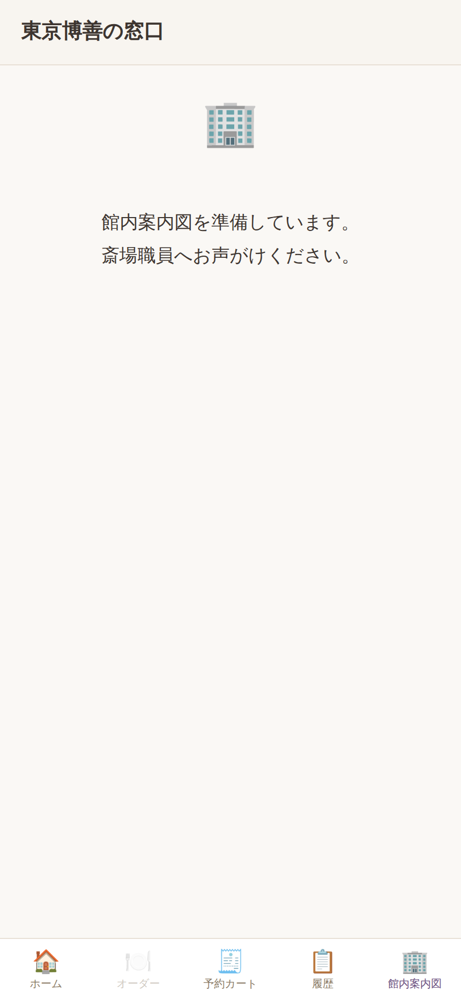

---

## 5. シナリオ別 操作フロー

実際の場面ごとに、誰が・どの画面で・何を押すかを纏めました。画像は代表的な画面です（操作の詳細は第3章・第4章を参照して下さい）。

### シナリオA: 売店でその場支払い

1. **【お客様】** 売店のQR（ラベル「売店レジ前」）を読み取り、瓶ビール（中瓶）等を注文します（売店は部屋紐付け不要で常時ご注文いただけます）。
2. **【スタッフ】** すぐ渡せる商品なので「🍽️ 提供済み」を直接押します（LINEに提供完了通知）。
3. **【スタッフ】** 商品を渡す → PDAで売上計上 →「→ お会計準備完了」。
4. **【スタッフ】** 現金を受け取り「💰 お会計済み」（LINEに会計完了通知）。

 

（左: お客様の注文メニュー ／ 右: スタッフ側に現れる注文カード）

> **このシナリオのつまずきどころ**: 「💰 お会計済み」を押してよいのは**その場でお支払いが完了した時だけ**です。「後でまとめて」と言われたらこのボタンは押さず、シナリオBの流れ（お会計精算での一括精算）に切り替えます。また「提供済み」を押した時点でお客様に通知が届くため、お渡しと同時に押すのがコツです。

### シナリオB: 控室で喪主まとめ払い

1. **【スタッフ】** 「🚪 部屋紐付け」で控室・月の間1 に東博家の予約を紐付けます。
2. **【お客様】** 部屋のQR（📍月の間1）から何度か注文します（対象ならフリードリンクタブも表示）。
3. **【スタッフ】** 「調理開始」→「提供済み」→ PDA計上 →「→ お会計準備完了」。
4. **【スタッフ】** 「📋 注文詳細」で支払先を「喪主」に振り分けます（代理注文で予約を選んだ分は葬儀社払いで自動確定しているため、**必ず確認**）。**「お会計済み」は押しません。**
5. **【スタッフ】** 「💳 お会計精算」で 受付する →（割引）→ 支払い準備完了にする → 支払い内訳確認で「支払いお知らせを送信」→ ▼詳細 → 精算QRを発行 → 自動精算機でお支払い → 会計完了にする。お客様は「料金確認」画面で喪主払い分を事前に確認出来ます。

 

（左: 部屋紐付け ／ 右: お客様の「料金確認（喪主払い分）」）

> **このシナリオのつまずきどころ**: 手順4の振り分け確認を飛ばすと、代理注文分が葬儀社払いのまま精算に進んでしまいます。また手順5で「支払いお知らせを送信」した時点で、**喪主様のLINEにも精算QRが画像で届きます** — 紙のご利用票とLINEのQRのどちらでも自動精算機をご利用いただけます。ご家族の誰かが「お会計の準備ができました」の通知を見て個別に支払いに来られた場合は、まとめ払いの旨をご案内下さい。

### シナリオC: 事前同意済みの方（前日までに入力済み）

事前同意QR → TOP「申込にすすむ」→ 入力完了 → 予約と自動/手動で紐付け → 当日「📋 火葬確認」で「承諾」（緑）と表示され、追加の操作は不要です。

 

（左: お客様の完了画面 ／ 右: 当日の「承諾」表示）

### シナリオD: 炉前でその場同意（当日）

「📋 火葬確認」で「未承諾」（赤）の行 →「QR」を提示 → お客様が読み取り → TOPで故人情報を確認 →「申込にすすむ」→ 同意 → 申込者情報を「入力して受付へ進む」→ 一覧が「承諾」に変わったことを確認します。

 

（左: スタッフが提示する受付QR ／ 右: お客様の同意画面）

> **このシナリオのつまずきどころ**: 受付QRには有効期限（標準48時間）があります。前日以前に印刷した受付票で「QRコードの有効期限が切れています」と出た場合は、一覧からQRを開き直して提示すれば解決します（§3.6）。カードに「✅ 火葬のお申し込みは完了済みです。」と緑で出る方は、既にお手続きが済んでいるため読み取りは不要です。

### シナリオE: 申込者情報を後から入力する場合

ご予約に紐づかない入口（お連れ様など）から入られた方は、申込者情報の画面で「あとで入力する」を選べます（火葬中に入力・お会計前まで必須）→ スタッフが業務の合間に未入力の方を確認して声かけ → ご本人入力または代行入力、と進めます。**当日の受付QRから入られたご予約のあるお客様には「あとで入力する」は表示されず、その場で全て入力していただく必要があります。** 未入力の間は、お客様のホーム画面に「申込者情報を入力する」の案内が表示され続けます:

### シナリオF: 割引がある会計の例

| ケース | 内容 | 支払い |
|---|---|---|
| 例1 | 予約の火葬費用のみ | 葬儀社への請求（売掛） |
| 例2 | 予約＋モバイルオーダーの合算 | 喪主と葬儀社で分割（領収書分割を使用） |
| 例3 | モバイルオーダー複数明細 | 喪主 |
| 例4 | 社員割引の適用 | 葬儀社への請求 |
| 例5 | 業者キャッシュバックあり | 葬儀社への請求 |

（割引の適用画面。区民葬・献体・減額・公費は葬儀社ごとの設定に連動します）

### シナリオG: スポット注文（予約のないお連れ様のその場購入）

1. **【スタッフ】** 「📝 代理注文」で 斎場・売上場所を確認 →「🚶 予約なし」→ 購入者で「🚶 お連れ様（SAP即連携）」を選びます。お名前（任意）・領収書名を伺って入力します。
2. **【スタッフ】** 商品を選んで「**🚶 お連れ様購入（SAP即連携）**」を押します。この瞬間に**SAPへ受注が確定**し、「✅ お連れ様注文を作成しました 予約番号: G…」と表示されます（Gで始まるゲスト予約番号を控えておくと領収書・照会に便利です）。
3. **【スタッフ】** 「🍽️ オーダー」に現れたカード（「🧾 スポット注文（お会計精算の対象外）」バッジ付き・最初から「お会計準備完了」列）で商品をお渡しし、PDAで売上計上します。
4. **【スタッフ】** その場でお支払いを受けて「💰 お会計済み」を押して完結します。**「💳 お会計精算」タブには載りません**し、LINEへの通知もありません（LINEに紐付かないため）。

> **このシナリオのつまずきどころ**: 通常の注文と違い、**送信＝受注確定**です。数量・商品を間違えたまま送ると受注の取り消し・修正が必要になるため、送信前の確認をより丁寧に行って下さい。送信でタイムアウトが出た時は**再送する前に必ず注文一覧を確認**します（前回分が成立している場合、再送は自動で止まりますが二重投入防止の基本は目視確認です）。酒類を含む場合は年齢・運転の有無の口頭確認をしてから確定します。

---

## 6. 権限（アカウント種別）一覧

アカウントの権限によって、表示されるタブと出来る操作が変わります。権限・担当斎場・既定の売り場は「⚙️ 設定 → 👤 ユーザー」で管理します（§3.9）。

| 種別 | 表示名 | 出来ること |
|---|---|---|
| 管理者 | superadmin | 全機能＋「📅 予約」「⚙️ 設定」＋アカウント発行 |
| スタッフ | staff | 日常運用（オーダー/代理注文/部屋紐付け/火葬確認/お会計精算/事前同意）。「予約」「設定」は表示されない |
| CC SV | cc_sv | コールセンター管理（全件＋割り振り解除） |
| CCスタッフ | cc_staff | コールセンター（自分の担当＋未割当） |
| ラベル担当 | label_agent | ラベル業務のみ |

アカウントごとに「アクセス範囲（許可斎場）」「デフォルト売上場所」を設定出来ます（§3.9 ユーザー）:

> 「📅 予約」「⚙️ 設定」タブは管理者（superadmin）にだけ表示されます。スタッフの画面にこの2つが見えないのは正常です。

スタッフ（staff）でログインした時の画面上部。タブは「部屋紐付け／火葬確認／オーダー／代理注文／お会計精算／事前同意」の6つだけになります:

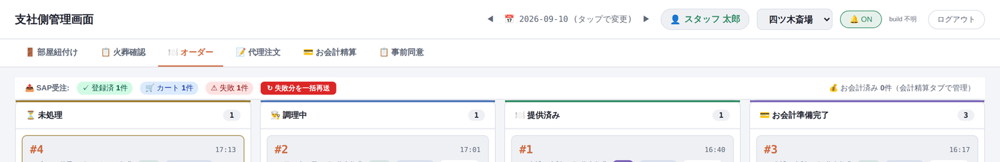

タブのほかにも、次の操作は**管理者（superadmin）にだけ**表示されます。スタッフの画面に出ないのは正常で、必要な場合は管理者へ依頼して下さい。

| 管理者にだけ出る操作 | 内容 |
|---|---|
| 🔄 SAP照合（お会計精算のカード） | SAPの受注金額と画面の金額の突き合わせ・照合結果の登録 |
| 受注分割やり直し画面URLの登録 | 「⚙️ 初期設定 → SAP連携設定」。未登録のときは領収書分割の案内に登録を促す表示が出ます |
| 🔐 管理アカウント連携API 送信先 | 「⚙️ 初期設定」内。個人情報の送信範囲に関わるため管理者専用（§3.9） |
| OutSystems会員連携 UAT用・隔離予約の作成 | 「⚙️ 初期設定」内。押すと「この操作は管理者のみ実行できます」と出ます（§3.9） |

---

## 7. 困ったときは（Q&A）

**質問・不具合・要望の報告の仕方（2026-09-14 操作説明会で確認した運用）**

疑問や不具合らしき事象は、まず**QAシート**（操作説明会のQ&A・確認観点シート）へ記録し、内容を①**現行仕様の確認** ②**不具合候補** ③**追加要望** の3つに分けて整理してから、必要なものを課題管理（Backlog）へ起票します。報告の際は、次の6点を出来る範囲で添えて下さい — **対象の予約番号／操作した画面／操作手順／期待した結果／実際の結果／画面キャプチャ**。その場で答えが出ないものは、曖昧に判断せず「要確認」として記録します。

**障害時の対応の目安（保守窓口・現在調整中の内容）**

| 項目 | 目安 |
|---|---|
| 障害受付時間 | 平日 10:00〜19:00（土日祝・年末年始を除く） |
| 一次応答 | 受付から24時間以内 |
| 復旧目標 | 重大（業務停止・全体影響）: 当日中に暫定対応、3営業日以内に恒久対応の方針提示 ／ 重要（一部業務停止・代替運用可）: 3営業日以内 ／ 軽微（表示の不具合など）: 10営業日以内 |

> 上記は保守契約に向けて調整中の水準です。確定後に改めて周知されます。

### 7.1 画面に出るメッセージと対処（管理画面）

| 画面に出るメッセージ | 意味・対処 |
|---|---|
| ⚠️ 先に「⚙️ 斎場・売上場所設定」で斎場と売上場所を選択して下さい。 | 代理注文の最初の設定が未了。STEP 0 で斎場・売上場所を選びます |
| この売上場所は部屋の紐付けが必要です。部屋を選択して下さい（売店のみ部屋なしで発行出来ます） | QR発行時に部屋が未選択。売店以外は部屋を選んでから発行します |
| ⚠️ 取引先（得意先コード）が設定されていません。予約編集から得意先を設定して下さい。 | ご予約に葬儀社の得意先が入っていません。「📅 予約」の編集で得意先を設定します |
| SAPカート投入後の注文は編集出来ません。SAP受注・カートを照合して下さい。 | 「お会計精算へ移す」の後は ✏️ 編集不可。修正が必要なら「📋 注文詳細」で照合してから対応します |
| ⚠️ この注文はカートに追加出来ません。（原因: 支払振り分けが未設定のため） | 受付カードの「🏷 振り分け」を設定してから再送します |
| SAP失敗した◯件の受注を一括再送しますか？ | 「↻ 失敗分を一括再送」の確認。**⚠ SAP未確定の注文は先に「📋 注文詳細」でカートを確認**してから |
| ⚠️ SAP受注が発番済です | すでに受注番号が発行されています。**再送・二重登録はしない**で下さい |
| 前回のLINE送信結果を24時間以上確認出来ません。再送すると同じ内容が重複して届く可能性があります。 | LINE通知の再送確認。重複送信を了承する場合だけ「再送する」を選びます |
| ⚠ ポップアップがブロックされました。ブラウザの設定で許可して下さい | 受付票・精算票などの印刷ウィンドウが開けない状態。ブラウザのポップアップ許可を設定します |
| 全斎場分の本日予約データをすべて削除します。この操作は取り消せません。本当に実行しますか？ | 「🗑️ 本日分クリア」（予約タブ）の最終確認。**通常運用では実行しません** |
| 検索対象が上限に達しています | 火葬日または斎場で絞ってから再検索します |
| ⚠️ この斎場には売上場所が1件も登録されていないため、代理注文を開始できません。 | 「⚙️ 設定 → 🏛️ 斎場設定」でその斎場の売上場所を登録します（管理者） |
| ⚠️ 得意先「◯◯」がマスタに見つかりません | 得意先コードの入力誤りか、得意先マスタが未同期です。コードを確認し、必要なら「🔒 ブロック同期」等で同期します |
| ⚠️ 得意先「◯◯」のフラグを取得できませんでした（SAP照会に失敗）。 | SAP接続の一時不調。少し置いて再試行し、続く場合はシステム担当へ |
| ⚠️ ブロック確認に失敗しました。手動確認後受付してください。 | 受注ブロックの自動確認が出来なかった状態。「🏢 得意先」でブロック有無を目視確認してから受け付けます |
| ⚠️ 保存中に追加の変更があります。もう一度保存してください | 保存中に別の変更が届きました。そのままもう一度保存すれば揃います |
| ⚠️ 取得上限に達しています。古い予約が表示されない場合があります（予約番号で検索してください） | 一覧の取得件数の上限。予約番号・期間で絞って表示します |
| ⚠️ ブラウザのポップアップブロッカーにより自動で印刷画面が開けませんでした。 | 印刷ウィンドウは開いています。ウィンドウ内の「🖨️ 印刷」を押すか、ブラウザでポップアップを許可します |
| 注文を送信できませんでした。…STEP1の ✕ でカートを作り直してください。 | 代理注文で、カートを作った時の伝票と今の選択が食い違った状態（途中で予約や斎場を切り替えた時）。STEP1のバッジの✕でカートを作り直します |
| この購入者区分（◯◯）で注文できる商品がありません。◯件が購入者区分により除外されています。 | その購入者に出せる商品が無い状態。購入者の選択を確認し、必要なら商品マスタの購入者区分（製品グループ4）を確認します |
| 送信の結果が確認できませんでした（通信タイムアウト）。SAPに届いたかは不明です。再送する前に必ず注文一覧を確認してください | **すぐに再送しない**こと。注文一覧で前回分の有無を確認してから判断します（前回分が成立していた場合、再送は「前回の送信が既に注文として成立しています」で自動停止します） |
| ⚠ SAP連携済みです（割引・振り分けの変更不可） | 受注確定後は割引・振り分けを変更出来ません。変更が必要な場合は先に受注を戻す操作が必要です（管理者へ相談） |

**操作をやり直せない確認ダイアログ（OKの前に必ず内容確認）**: 「〜を削除しますか？（この操作は取り消せません）」（会員・部屋・売上場所・斎場・保管場所など）／「カートを削除します。削除後は「↻ SAP再送」で改めて送信してください。」／「この受付の領収書分割を解除して、領収書1枚に戻しますか？」

### 7.2 お客様の画面に出るメッセージ（ご案内用）

| お客様の画面のメッセージ | ご案内 |
|---|---|
| ⚠️ ◯◯は必須です（例: 斎場は必須です・故人様姓は必須です・メールアドレスは必須です） | 未入力の項目が項目名つきで案内されます。全15項目（斎場・火葬日・故人様の姓名とかな・申込者の姓名とかな・電話・メール・郵便番号・住所・続柄）が必須です |
| ⚠️ メールアドレスの形式が不正です | @やドメインの形をご確認いただきます |
| ⚠️ 電話番号は10桁または11桁で入力してください ／ 郵便番号は7桁で入力してください | 桁数の再確認。ハイフンはあってもなくても構いません（数字だけで数えます） |
| ⚠️ ◯◯はひらがなまたはカタカナで入力してください | かな欄に漢字・英字が入っています。ひらがな・カタカナのどちらで入力しても、保存はひらがなに揃えられます |
| ⚠️ 続柄は具体的に入力してください | 続柄で「その他」を選んだままの状態。具体的なご関係を選択・入力いただきます |
| ⚠️ 火葬日は今日以降を指定してください | 新規のお申込みでは過去の日付は選べません |
| ⚠️ 友だち追加を確認できません。公式アカウントを追加してから再度お試しください | 公式LINEの追加が未完了。「東京博善公式LINEを追加する」→ トークに届いたURLから申込みへ、の順にご案内（追加状態はTOPの「追加後に状態を確認する」でも確認出来ます） |
| ⚠️ 友だち状態を確認出来ません。LINEアプリを完全に閉じてからQRを読み直して下さい。 | LINE側の一時的な不調。アプリを閉じて再度QRの読み取りをご案内 |
| ⚠️ 通信に時間がかかっています。注文は受け付けられている可能性がありますので、もう一度送信せず「注文履歴」で状態をご確認下さい。 | **再送信はしないよう**ご案内し、「履歴」で注文が入っているか確認します |
| 先に受付をお済ませ下さい | 受付前に注文メニューを開いた状態。ホームの「火葬申込をする」からご案内 |
| 利用規約にチェックを入れてから進んで下さい | 同意画面に戻り「以下の内容を確認し、同意する」にチェックをご案内 |
| 郵便番号を7桁で入力して下さい ／ 住所が見つかりませんでした | 郵便番号の再確認、または住所を直接ご入力いただきます |
| QRコードの有効期限が切れています | 受付QRは発行から48時間（標準）で失効します。新しいQRカード・受付票を発行し直してご案内します（§3.6） |
| このQRコードは使用済みです ／ このQRコードは再発行により無効になりました | 既に読み取り済み、または印刷し直した後の古いQRです。最新のQRでご案内します |
| この火葬予約は既に承諾済みです ／ この火葬予約は別のLINE利用者に紐付け済みです | 同意・紐付けが済んでいる状態です。ご本人の状況を「📋 火葬確認」で確認します |

### 7.3 よくある症状と対処

| 症状 | 対応 |
|---|---|
| 一覧に何も表示されない | 画面上部の**日付**と**斎場**を確認 |
| 注文がカンバンに出ない | 「接続中」表示を確認→再読込。日付・斎場・🔔OFF も確認 |
| お客様に「ただいまこのお部屋ではご注文いただけません」と出る | 「🚪 部屋紐付け」で該当のお部屋に予約を紐付け |
| 代理注文が先に進めない | 最初に「⚙️ 斎場・売上場所設定」で斎場と売り場を選択 |
| 「未承諾のみ」で件数が減った | 絞り込みが ON の状態。もう一度押すと全件表示 |
| 予約の件数が合わない | 表示は選択中の斎場のみ。右上の斎場を確認 |
| かなで検索しても出ない | ひらがな/カタカナはどちらでも可。出ない場合はふりがな未登録の可能性 |
| 「検索対象が上限に達しています」 | 火葬日または斎場で絞ってから再検索 |
| 「精算QR発行」ボタンが見当たらない | 「支払い準備完了」を押して SAP 登録が成功すると「▼ 詳細」の中に現れる |
| 精算機が途中で止まった | 15分で自動解除。急ぐ場合のみ「精算ロック管理」で状態確認・解除（精算機側で二重操作しない） |
| 「支払割当が見つかりません」等のSAPエラー | 画面を最新に更新（Ctrl+Shift+R）→ 支払先を振り分け直す → 「↻ 失敗分を一括再送」。繰り返す場合はシステム担当へ |
| お連れ様の注文がエラー表示なのに登録されている | 表示の既知不具合。SAP受注番号の記録を優先し、二重登録しない |
| 注文送信が長い | 最大45秒かかることがあります。**再送信しない**（二重請求防止） |
| LINE通知が届かない | 友だち追加・通知設定を確認（ブロックと通知オフは別物） |
| QRが読めない | 汚れ→再印刷。**部屋QRと精算QRの取り違え**も確認 |
| 誤って受付した | 「💳 お会計精算」でカードの「▼ 詳細」→「← 精算未受付に戻す」。**「支払い準備完了」を押す前まで**しか戻せません |
| 在庫の一覧が空のまま | 斎場と**保管場所**を選んでから「📥 在庫取得」を押します（保管場所が未選択だと取得出来ません） |
| 予約に葬儀社（得意先）が入っていない | この画面では直さず、予約の連携元と得意先マスタを確認 |
| 予約を登録・更新したのに画面に出ない | 予約システムからの反映には**10〜15分程度**の時間差が出ることがあります。少し置いて再読込（§3.5） |
| 注文画面に関係のない商品まで表示される | 売上場所マスタの**注文場所種別（SAP location）が未設定**だと全商品が表示されます。「⚙️ 設定 → 🏛️ 斎場設定」で設定を確認（§3.9） |
| スポット注文を「お会計精算へ移す」ボタンが無い | 仕様どおりです。予約に紐付かない注文はご注文時にSAPへ受注確定済みのため、お会計精算の対象外（カードに「🧾 スポット注文」バッジ）。オーダー画面で「→ お会計準備完了」→「💰 お会計済み」と進めます（§3.2） |

**対応中の既知事象（2026-09-14 操作説明会で共有。改善が入るまで下記を確認して下さい）**

| 事象 | 現場での確認ポイント |
|---|---|
| 注文を取消した後も、精算検索に古い受注番号が残る場合がある | 注文取消後は、**取消済みの注文が精算対象として残っていないか**を「💳 お会計精算」で確認する（取消成功分の関連データを同期削除する改修が進行中） |
| 受付後に予約確定を行うと、同じ受注が二重に作られる場合がある | 予約確定→受付の順を守り、確定後に「💳 お会計精算」の一覧へ**同じ方のデータが二重表示されていないか**を確認する（§3.5） |
| 休憩室・フリードリンクセットなど**セット商品の値引き条件が領収書明細に出ない**場合がある | 明細への反映改修が進行中。なお**値引きとキャッシュバックは別の条件**であり、割引の明細表示とキャッシュバック帳票は同じものとして扱いません |

「一覧に何も表示されない」の典型例。斎場の選択が違うだけで、4つの列は全て空になります。まず画面右上の**日付**と**斎場**を確認して下さい:

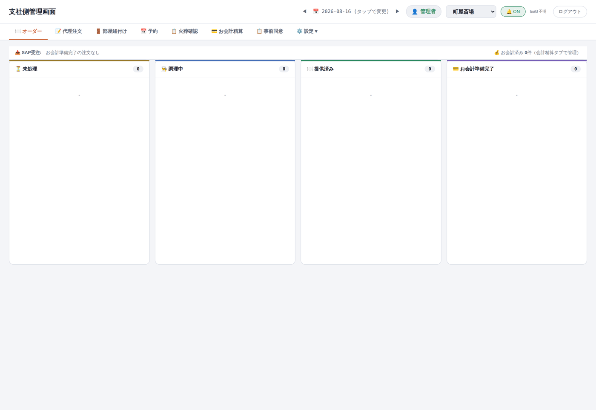

操作に失敗した時は、画面右下に赤い通知が数秒表示されます（§3.1）。**通知の文面に失敗の理由が書かれている**ため、消える前に読み取ってから対処に進むと早く解決出来ます:

