# 東京博善「窓口（mado）」システム手順書 v24.1

| 項目 | 内容 |
|---|---|
| 文書名 | 東京博善 窓口システム（mado）操作手順書 |
| 対象 | 支社側管理画面（斎場スタッフ・本社運用担当向け） |
| 対象読者 | 斎場スタッフ（町屋・落合・代々幡・四ツ木・桐ヶ谷・堀ノ内・お花茶屋会館）・本社運用担当・新規参画メンバー |
| 検証環境（STG） | `https://mado-staging.web.app/admin.html` |
| 本番環境 | `https://madoguchi-ec1d5.web.app/admin.html` |
| 版数 | v24.1（2026-10-02）— アフターケアCRM「喪主の窓口」の章と、アフターケアへの引き継ぎに関する記述・画像を削除（コールセンター部門の画面のため）。全ての日本語の段落を文の切れ目で改行し直し、1段落を短く統一（本文・注意書き・箇条書き・表の長いセルまで全面見直し）。構成・内容はv24.0のまま |

> **ログイン情報は本書に記載しません。** アカウントは管理者から個別（DM）に共有されます。
>
> **📸 掲載画像の氏名・電話番号・予約番号・金額は、全てテスト用の架空データです**（例: 東博 太郎さま・幕内祭典・予約番号 TEST-2500200）。実際の運用では、それぞれのご予約の内容が表示されます。
>
> 掲載画像は**2026-09-03時点の検証環境の画面**です。その後に検証環境へ反映された改善（スマホ対応・表記の見直しなど）は §6.4 の一覧で確認出来ます。

> **📢 LINEミニアプリは使用しません（2026-09-28の関係者会議での決定）**
>
> お客様ご自身によるLINEミニアプリの操作 — 事前の火葬同意の入力と、お客様のスマホからのご注文 — は**使用しません**。この手順書は、LINEを使わない運用だけを説明しています。
>
> 標準の運用は次の3点です。
>
> ① 受付は職員が画面で行います（「✅ 受付する」と「🖨 紙で受付」— §3.7）。
>
> ② ご注文は全て職員が「📝 代理注文」（§3.3）で承ります。
>
> ③ お支払いのご案内は、紙の《自動精算機ご利用票》（§3.7）で行います。お客様への自動通知は無いため、ご案内は口頭と紙で行います。
>
> 機能を画面から取り外す改修（除却）については、**2026-10-01改訂のリリース作業手順書で「11/2の除却・切替工程」が削除**されました。
>
> 当面は管理画面にLINE関連の表示（連携状態の列・通知の文言など）が残りますが、**該当箇所には「使用しません」と明記**しています。
>
---

## 目次

1. [システム全体の繋がり](#1-システム全体の繋がり)
2. [業務の全体像 — 前日の準備／当日の運用](#2-業務の全体像--前日の準備当日の運用)
3. [管理画面の操作手順（画面別・ボタン別）](#3-管理画面の操作手順画面別ボタン別)
4. [シナリオ別 操作フロー](#4-シナリオ別-操作フロー)
5. [権限（アカウント種別）一覧](#5-権限アカウント種別一覧)
6. [困ったときは（Q&A）](#6-困ったときはqa)

---

## 1. システム全体の繋がり

「東京博善の窓口（mado）」は、**東京博善株式会社**の7斎場（**町屋斎場・落合斎場・代々幡斎場・四ツ木斎場・桐ヶ谷斎場・堀ノ内斎場・お花茶屋会館**）で、葬儀当日の**受付・火葬同意・飲食などの注文・会計精算**をデジタル化するシステムです。

**繋がっているシステム**

| 相手 | 何をやり取りするか |
|---|---|
| 新予約システム（テコテック製・9月稼働。旧 Fellow／タイコウ） | 毎朝、当日の火葬予約データを受け取る（中間サーバー経由） |
| LINE | お客様向けの接続（ミニアプリ・通知）として作られていますが、**使用しません**。通知は届かない前提で、ご案内は口頭と紙で行います |
| SAP（基幹システム・広済堂 情報システム部管理） | 商品カタログを受け取り、注文を「受注」として登録。割引（社員割・区民葬など）や仕訳も自動処理 |
| 自動精算機（東芝テック／ユニコ） | 管理画面で発行する「精算QR」を読み取り、お客様が支払い |
| PDA（スタッフ携帯端末） | 売上計上に使用 |
| 会員情報登録API（OutSystems） | 火葬予約の会員情報を外部システムへ登録する連携（§3.8の「🧾 会員情報登録API 送信先」で送信のON/OFFと送信先を管理。連携OFFの間は呼び出されません） |

**一つ一つのシステムの役割（詳しく）**

**① 新予約システム（テコテック製）** — 火葬予約の大元です。

窓口はここから**中間サーバー経由で予約データを受信するだけ**の参照側で、窓口の「📅 予約」タブから新規予約を作ることはありません（作成・変更は予約システム側で行い、窓口へは10〜15分程度の時間差で届きます — §3.5）。

届いた予約を「確定」することで、受付・精算に使えるようになります。

**② 中間サーバー（NURVE管理）** — 窓口とSAP・予約システムの間に立つ通訳役です。商品カタログ・カート・受注・精算機の入金連絡は全てここを経由します。

SAPへの送信がタイムアウトした時に「届いたかは不明」という表現になるのは、窓口→中間→SAPの2段構えのため、途中まで届いている可能性があるからです（だからこそ**再送の前に注文一覧・カートの確認**が必要になります）。

**③ SAP（基幹システム・広済堂情報システム部管理）** — 商品マスタ・得意先マスタ・受注・請求の正本です。

窓口の商品・得意先・割引可否・受注ブロックは全てSAPから同期した写しで、**金額の最終的な正はSAP側**にあります。

画面の金額とSAPの金額が食い違うと「⚠ 金額照合待ち」などで会計が止まる仕組みです（§3.7）。

**④ 自動精算機（東芝テック／ユニコ）** — 精算QR（SAP受注番号入り）を読み取ってお客様が支払う機械です。支払いが完了すると中間サーバー経由で窓口に入金の連絡が届き、受付と注文が自動でお会計済みに進みます。

処理が途中で止まった場合は15分で自動解除され、急ぐ時だけ「精算ロック管理」を使います（§3.7⑪）。

**⑤ LINE** — お客様向けの接点（ミニアプリ・通知）として作られた接続ですが、**使用しません**。通知は届かないため、進行・お支払いのご案内は口頭と紙（自動精算機ご利用票）で行います。

この運用は現行の画面に既に備わっているもので、特別な設定は不要です（§3.7「🖨 紙で受付」・「🖨️ 印刷」）。

**⑥ PDA（スタッフ携帯端末）** — 売上計上の端末です。窓口とは直接繋がっておらず、「PDAで計上してから『💳 お会計精算へ移す』を押す」という**操作の順序**で整合を取ります。

**番号の呼び分け（取り違えの多い3つ）**

| 番号 | どこで使うか |
|---|---|
| **予約番号** | 新予約システムから届く番号（例: TEST-2500200 / 25087953）。管理画面の検索欄は**全て「予約番号」表記**です。注文カードでは 🔑 のマークで表示されます |
| **SAP受注番号** | 「💳 お会計精算」で「💰 支払い準備完了」を押したときにSAPが発行する番号（例: 783）。**精算QRはこの番号で発行**されます |

**運用の要点**

- 予約・注文・受付の画面は**リアルタイム更新**です（新しい注文が入ると通知音が鳴ります）。
- SAPへの連携は**2段階**です。①「🍽️ オーダー」で注文を **お会計準備完了** に進めると（ボタンは「💳 お会計精算へ移す」）、SAP側の**カートに蓄積**されます（カードに「🛒 カート蓄積済」と表示）。

    ②「💳 お会計精算」で **💰 支払い準備完了にする** →「支払い内訳確認」→ **💰 支払いお知らせを送信** まで進めた時点で、**SAPの受注（受注番号）が発行**されます。

- ご注文は全て「📝 代理注文」（§3.3）で承ります。送信でタイムアウトが出た時は、**再送の前に必ず注文一覧・カートを確認**します（二重投入防止の基本です）。
- 検証環境（STG）は**テスト専用**です。実際のお客様のデータは入れません。テストデータは予告なくリセットされることがあるため、確認結果は都度スクリーンショット等で保存して下さい。

---

## 2. 業務の全体像 — 斎場職員の一日の流れ

この章では、火葬日前日までの準備と火葬当日の運用を、**斎場職員の一日の流れ**に沿って説明します。**お客様にスマホの操作をお願いする場面はありません** — 受付・注文・会計は全て職員が管理画面で行います。

「いま何の場面で、どのタブを開き、何を押すか」をこの章で掴み、ボタンごとの詳しい説明は第3章を参照して下さい。

### 2.1 前日まで — 準備の流れ

担当: 本社・斎場管理者 → 斎場スタッフ

**1.【管理者】予約の確定（→§3.5）** — 「📅 予約」タブで翌日分を確認し、「未確定」ボタンから確定します。確定の画面で区民葬・献体・減額・公費の該当と、支払先の葬儀社（得意先）を確認します。

**確定は受付より先に**行います（順序が逆になると受注が二重に作られるケースがあります — §3.5）:

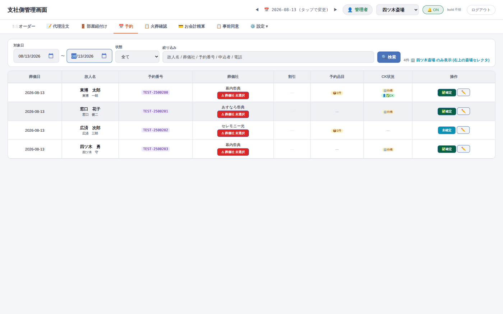

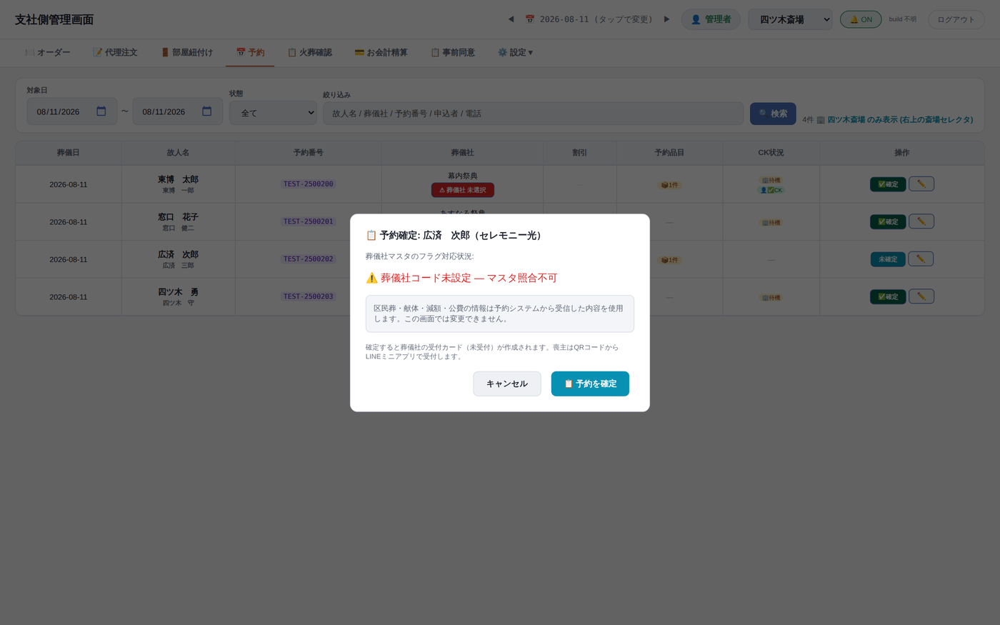

**2.【スタッフ】翌日の全体像の確認（→§3.6）** — 「📋 火葬確認」の日付を翌日に切り替え、件数・火葬開始時間の並び・葬儀社を確認します。

火葬同意はお客様のLINE操作では頂かない運用のため、画面の「承諾/未承諾」表示に関わらず、同意のお手続きは紙の様式など決められた方法で準備します（様式・保管の方法は運用の案内に従って下さい）。

### 2.2 当日の朝 — 始業チェック

担当: 斎場スタッフ全員（画面を使う人それぞれ）

朝、管理画面を開いたら、業務を始める前に**ヘッダーの5点**を確認します（→§3.1）。

| # | 確認すること |
|---|---|
| 1 | **表示対象日が本日**になっているか（前日の履歴を見た後の戻し忘れに注意） |
| 2 | **斎場が自斎場**になっているか（一覧・件数・通知の全てがここに連動します） |
| 3 | **通知音が🔔ON**か（OFFだと新規注文に気付けません） |
| 4 | ヘッダーに「**リアルタイム接続中**」が出ているか（「❌ 接続エラー」のままなら再読込） |
| 5 | 表示が古そうなら **Ctrl+Shift+R** で最新化 |

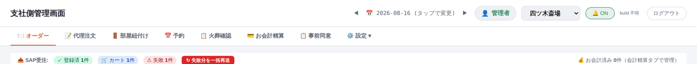

 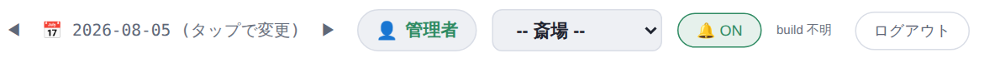

（左: 表示対象日の切り替え ／ 右: 利用者・斎場・通知音・ログアウト）

続いて「📋 火葬確認」を開き、**本日の火葬予約の全体像**（何件あるか・火葬開始時間の並び・どの葬儀社か）を掴みます:

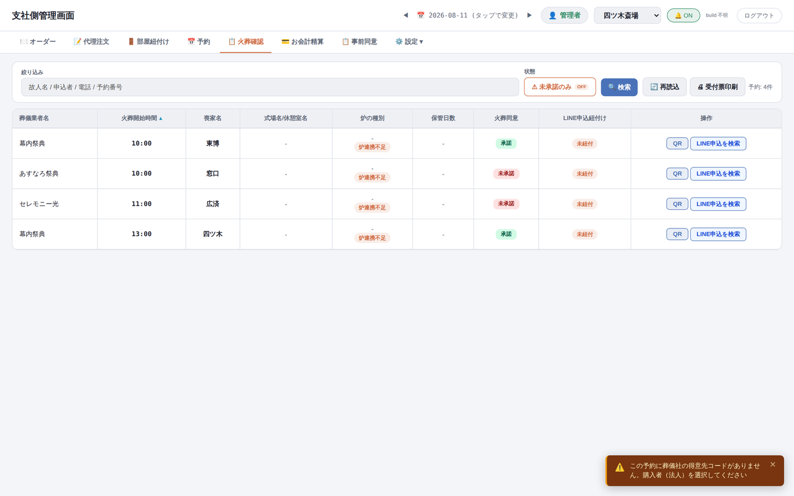

あわせて「🚪 部屋紐付け」で本日使う控室・休憩室の状態（空き・紐付け済み）を確認しておきます:

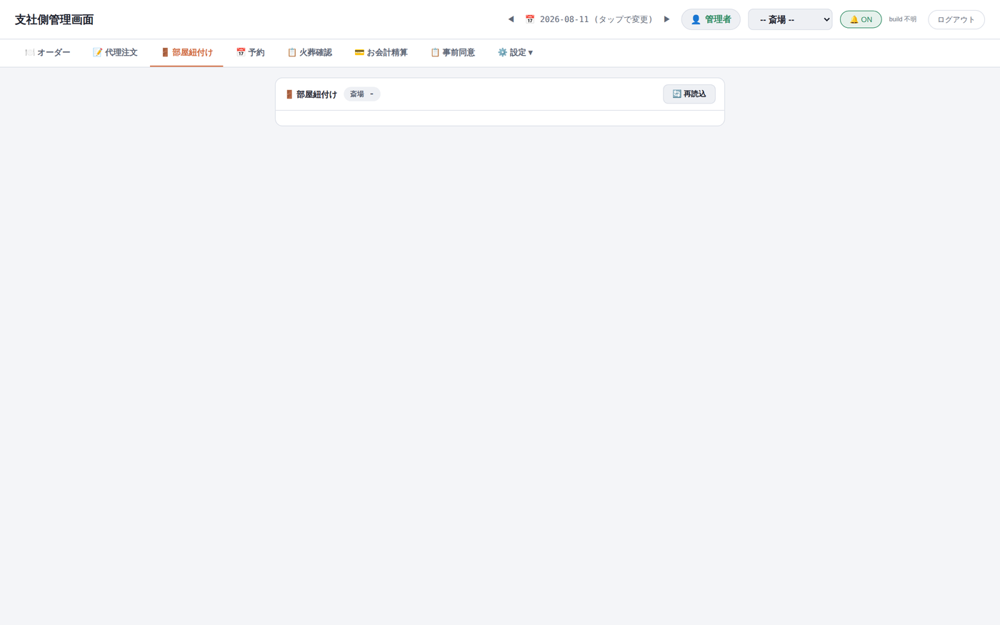

### 2.3 ご到着〜炉前 — 受付と火葬同意

担当: 受付・炉前のスタッフ

ご到着されたら、「📋 火葬確認」で該当のご葬家の行（喪家名・葬儀社・火葬開始時間）を確認します。**火葬同意は紙のお手続きで頂きます**（お客様のスマホ操作はお願いしません。様式は運用の案内に従って下さい）。

画面の「承諾/未承諾」のバッジは使いません（同意の有無は紙のお手続きで確認します）。

受付の操作は「💳 お会計精算」で行います。

カードの「**✅ 受付する**」でご来場を受け付け（→§3.7①）、喪主の行が「QR待ち」表示の時は紫の「**🖨 紙で受付**」を押します — 「喪主を紙で受付します。（LINEなし）続けますか？」の確認でOKすると、**LINEなしで喪主様の受付が完了**し、以降の会計を通常どおり進められます（→§3.7①-2）:

LINEに紐付かないため、この後の進行・お支払いの通知は届きません。お呼び出し・ご案内は全て口頭と紙で行います。

### 2.4 控室へのご案内 — 部屋紐付け

担当: フロア・配膳のスタッフ

ご家族を控室・休憩室へご案内する前に、「🚪 部屋紐付け」で該当の部屋に予約を紐付けます。紐付け画面では**一覧の行そのものをタップ**すると確定します（→§3.4）:

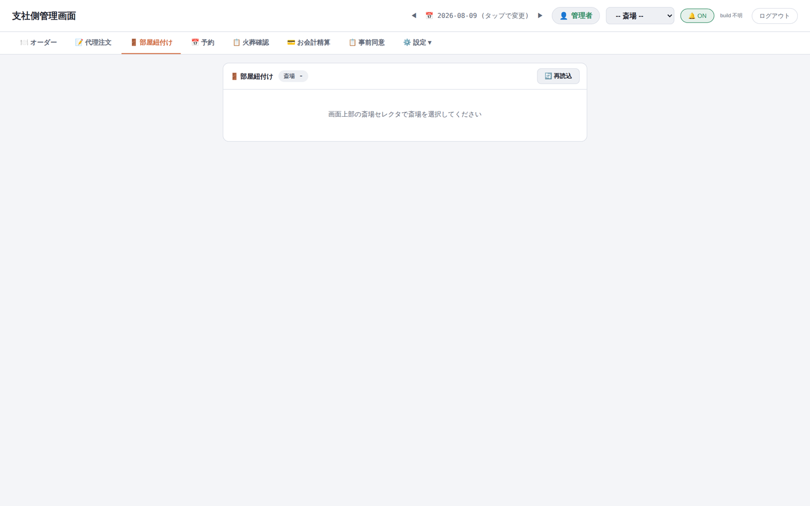

既に別のご予約が紐付いている部屋では上書きの警告が出ます。前のご家族の利用が終わっているかを確認してからOKして下さい:

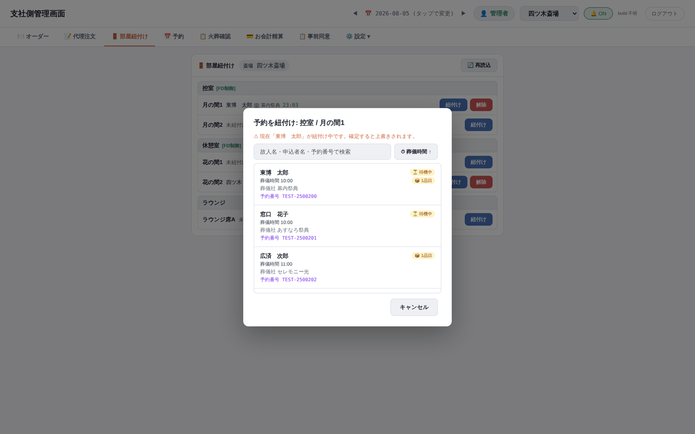

紐付けはご注文・ご提供の管理の土台になります（代理注文のフリードリンク判定・お届け先の部屋の特定に使われます）。ご注文はお部屋へ伺って承り、「📝 代理注文」で入力します（→§2.5）。

### 2.5 火葬中〜お食事 — 注文対応

担当: 売店・厨房・配膳のスタッフ

**ご注文は全て職員が「📝 代理注文」で入力します**（→§3.3）。

お部屋・売店で伺った内容を入力すると、「🍽️ オーダー」の4つの列（未処理 → 調理中 → 提供済み → お会計準備完了）にカードとして現れ、進行を管理できます。新しい注文は通知音でお知らせします:

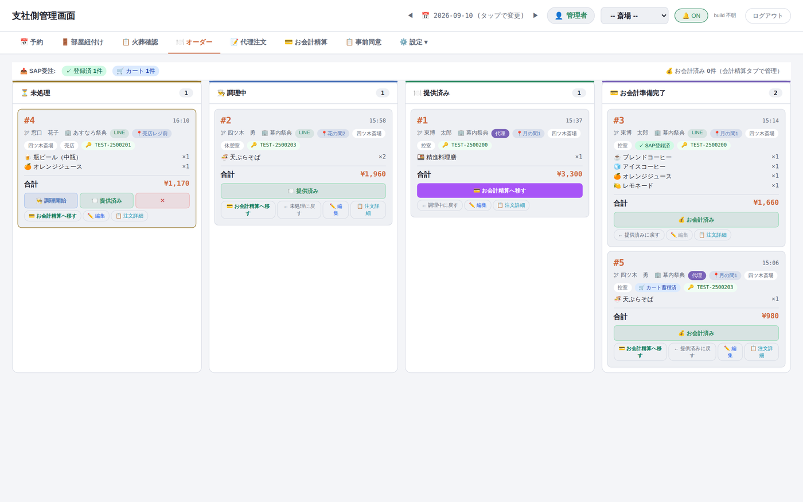

代理注文の入力は、予約のあるご家族・葬儀社の手配は 予約を選ぶ → 商品を選ぶ（購入者は葬儀社払いで自動確定。喪主払いにする分は後から「📋 注文詳細」で振り分け）、予約のないお連れ様のその場購入は「🚶 予約なし」→「お連れ様購入」です（→シナリオD）:

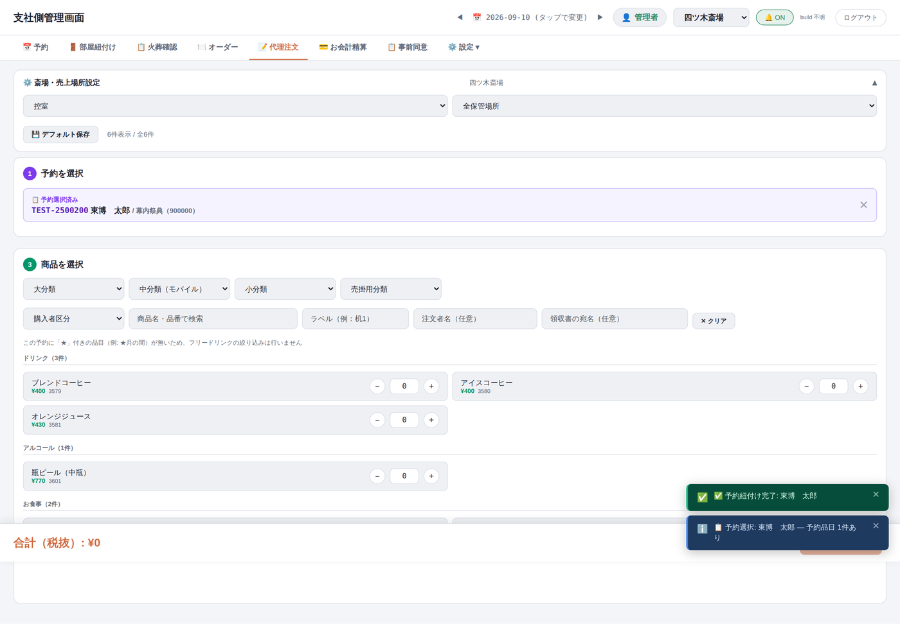

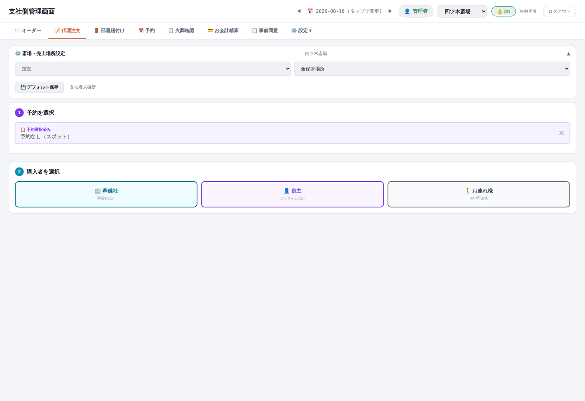

オーダーのカードは、場所ラベル（📍月の間1・売店レジ前 など）で**どこへ届けるか**を確認し、「調理開始」→「🍽️ 提供済み」→（PDAで売上計上）→「💳 お会計精算へ移す」の順に進めます（→§3.2）:

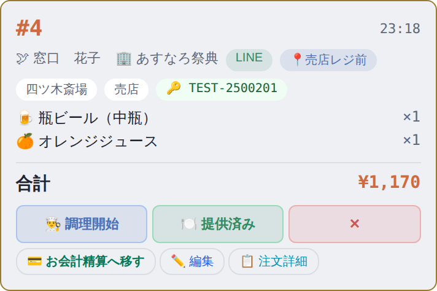

画面上部の「📤 SAP受注」の帯に**⚠失敗**が出ていないかを時々確認し、出ていたら理由を確認して再送します（→§3.2⑨）:

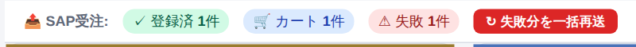

### 2.6 収骨前〜お見送り — 会計・精算

担当: 会計担当のスタッフ

お食事が落ち着いたら「💳 お会計精算」で会計を進めます。

流れは **✅ 受付する →（🏷 割引・🏷 振り分け）→ 💰 支払い準備完了にする → 支払い内訳確認 → 💰 支払いお知らせを送信 → 🏧 精算QRを発行 → 自動精算機でお支払い → 🏁 会計完了にする** です（→§3.7）:

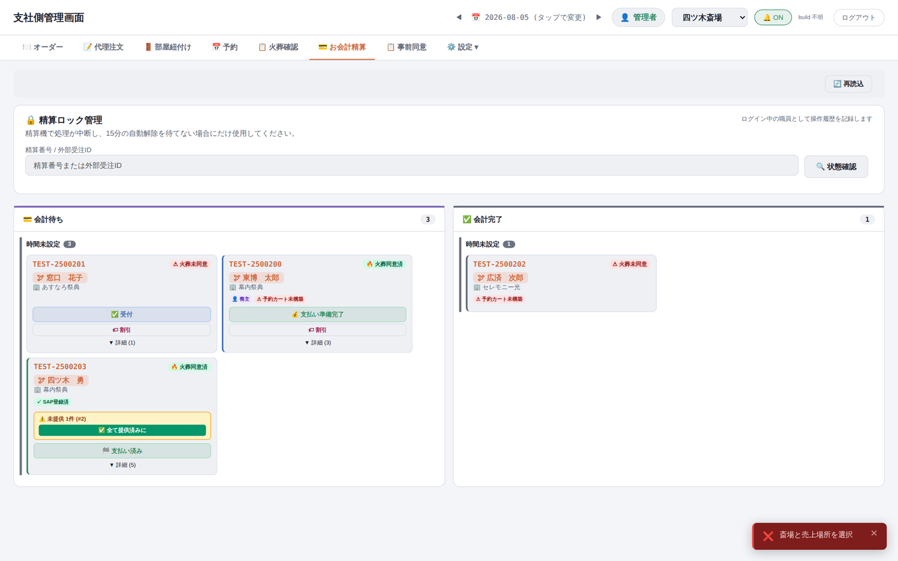

葬儀社とご喪家で支払いを分ける場合は、先に「🏷 振り分け」で品目ごとの支払先を決めます。区民葬などの割引もこの段階で確定させます:

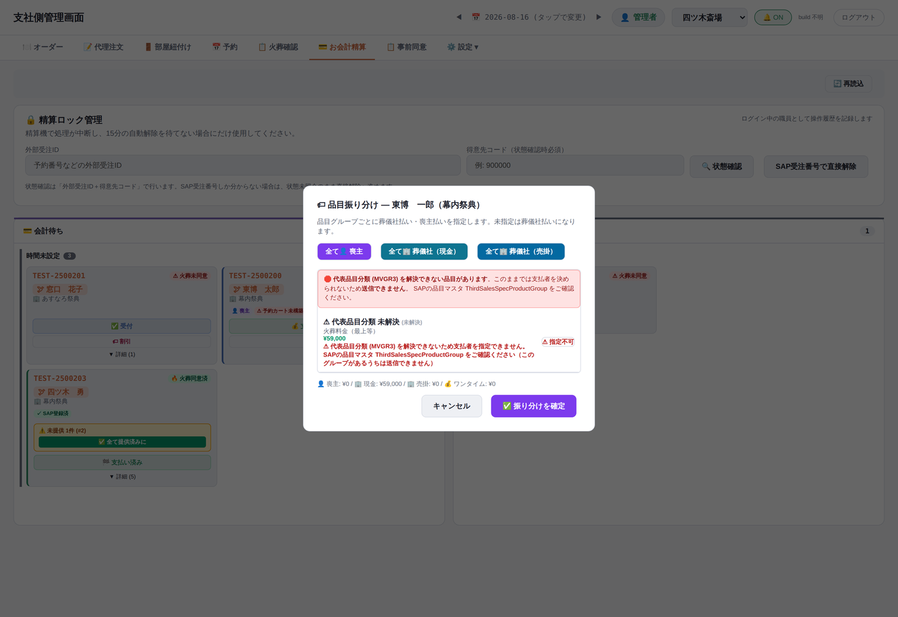

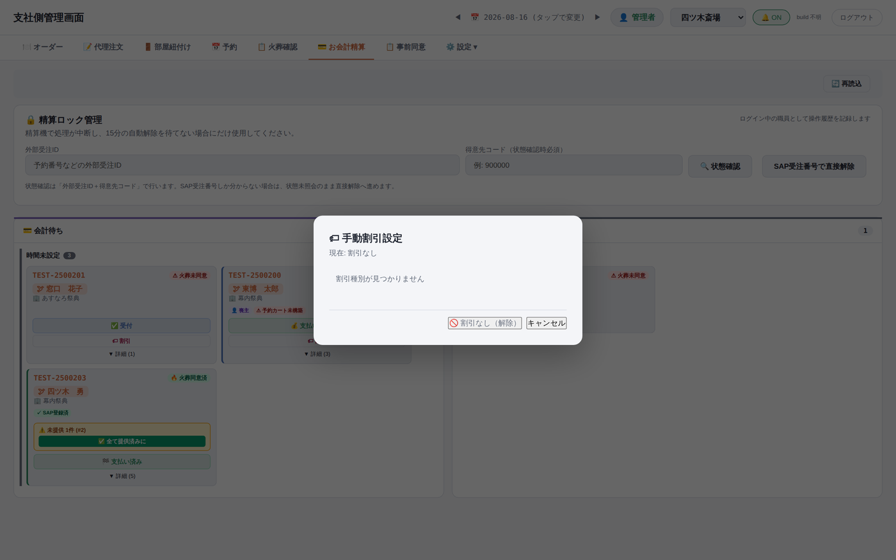

「💰 支払い準備完了にする」を押すと「支払い内訳確認」が開きます。金額と警告を確認して「💰 支払いお知らせを送信」— この瞬間にSAPの受注番号が発行されます（この番号で精算QRを発行します）:

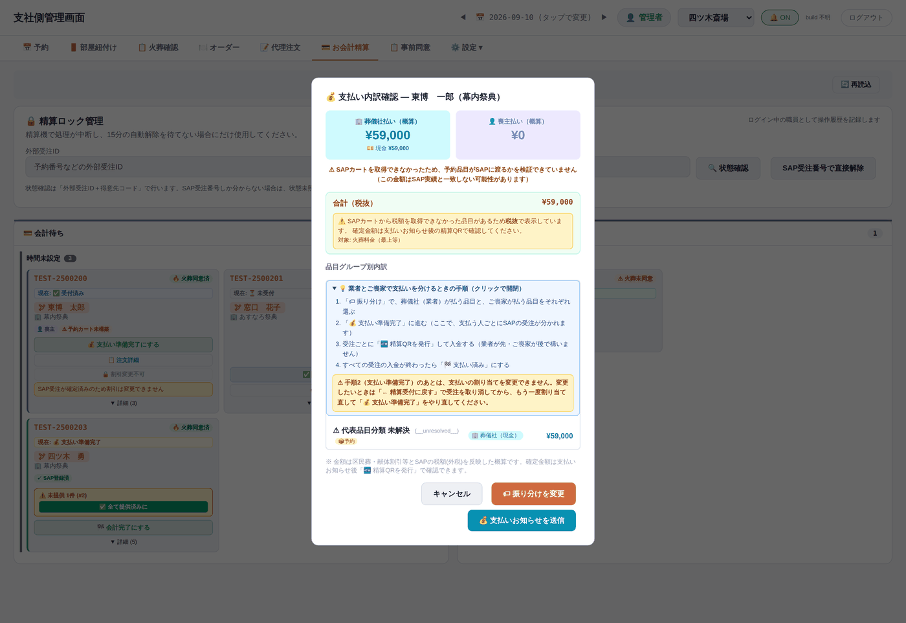

送信後のカードには「支払先ごとの受注」の枠が現れます。**未払いの受注だけ**に精算QRのボタンが出るので、受注ごとにQRを発行します（売掛の受注は請求書回収のため対象外）:

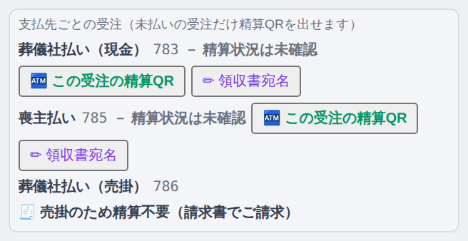

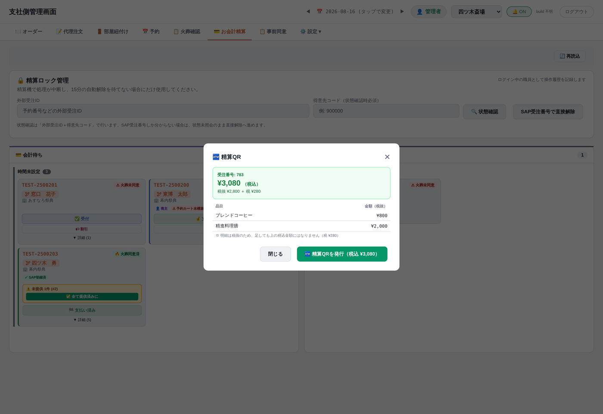

精算QRは「🖨️ 印刷」で**《自動精算機ご利用票》として印刷し、紙でお渡しします**。お客様はご利用票のQRを自動精算機で読み取ってお支払いになります。お支払いの確認が取れたら「🏁 会計完了にする」で締めます:

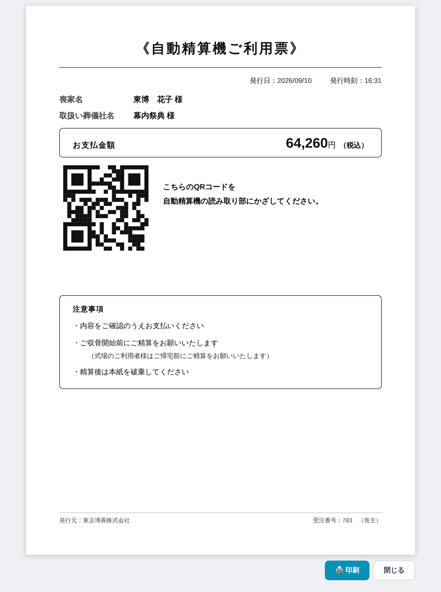

### 2.7 ご利用終了後 — 締めと翌日への引き継ぎ

担当: フロア・受付のスタッフ

- **部屋の解除** — お見送りが済んだら「🚪 部屋紐付け」で「解除」を押します（忘れると次のご家族が注文出来ません — §3.4②）。
- **オーダーの残り確認** — 「お会計準備完了」列に残っているカードが無いか、SAP帯に⚠失敗が残っていないかを確認します。
- **翌日の準備** — §2.1（予約の確定・翌日の全体像の確認・同意の紙様式の準備）を翌日分に対して行います。
> **「受付」と「注文」は別の操作です。** 受付＝「火葬確認」タブで来場を受け付ける操作。注文＝「代理注文」タブでスタッフが商品を注文する操作。

---

## 3. 管理画面の操作手順（画面別・ボタン別）

### 3.0 ログイン

**出来ること:** スタッフ用アカウントでのログイン。パスワード方式と「ログインキー」方式（`XXXX-XXXX-XXXX` 形式の印刷カード）の2通り。

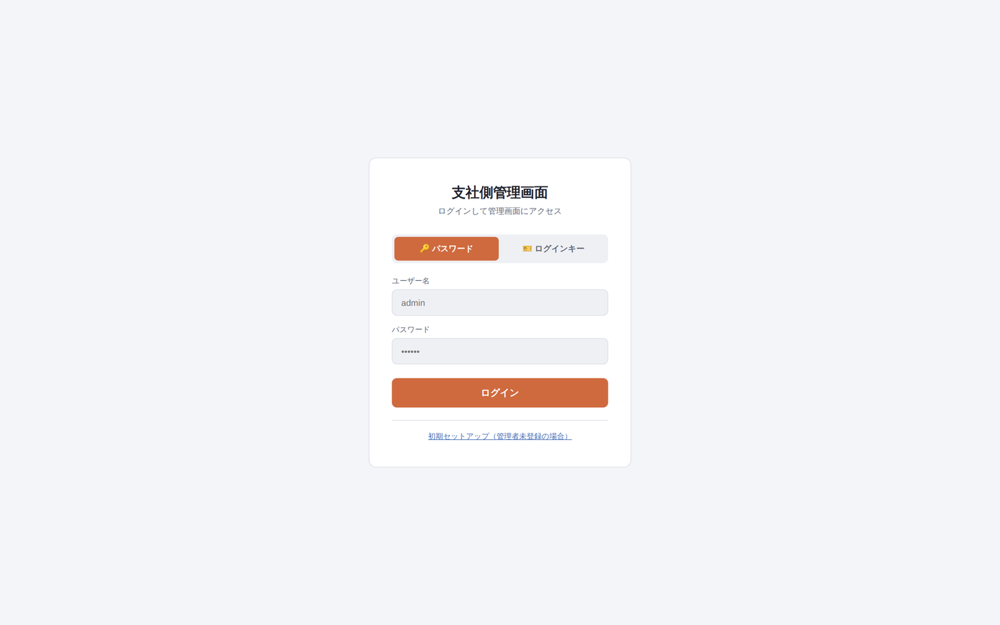

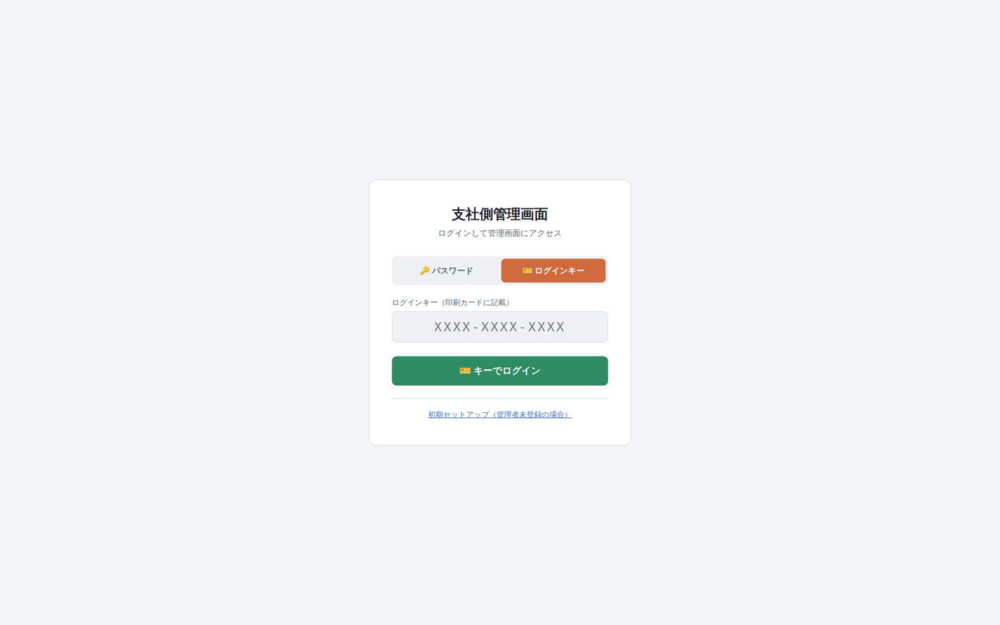

| # | 操作 |
|---|---|
| 1 | 管理画面URLを開く |
| 2 | 「🔑 パスワード」タブでユーザー名・パスワードを入力（またはログインキータブでカードのキーを入力。ハイフンは省略可） |
| 3 | 「ログイン」を押す → オーダー画面が開く |

**ログイン出来ない時の表示** — 未入力のままだと「入力してください」（キー方式は「キーを入力してください」）、誤りがあると「**ユーザー名またはパスワードが違います**」、ログインキーが違う・再発行で無効になったカードでは「**無効なログインキーです**」（短すぎる入力は「キーが短すぎます」）と表示されます。

キーのカードは「🔄 キー再発行」（§3.8）で無効になるため、無効と出た場合は管理者に**新しいカードの発行**を依頼して下さい。

> **操作の途中でログイン画面に戻された時は、ログインの有効期限が切れています。** 保存していない入力は失われるため、ログインし直してから、直前の操作が反映されているかを画面で確認して下さい。

### 3.1 画面共通の見方

管理画面の上部には、ヘッダー（日付・利用者・斎場・通知音）と画面切り替えタブが常に表示されます:

| 表示 | 意味 |
|---|---|
| ◀ 2026-08-05（タップで変更）▶ | **表示対象日**。◀=前日/▶=翌日。**一覧が空のときはまずここを確認** |
| 👤 管理者 | ログイン中の利用者名 |
| 四ツ木斎場 ▼ | **操作対象の斎場**。切り替えると全タブが連動 |
| 🔔 ON | 新規注文の通知音の ON/OFF |
| build …（画面右上の小さな文字） | 表示中の画面の版数。上手く動かないときに「最新の画面を開いているか」を確認するのに使います |
| ログアウト | ログアウト |

**画面切り替えタブ（それぞれをクリックして移動）**

最新の検証環境では**タブの並びが見直され、「🍽️ オーダー」が一番左**に表示されます（2026-10-02時点の確認情報）。

掲載画像（2026-09-03版）は旧配置のため、並び順が実際の画面と異なる場合があります。下表は**並び順ではなく用途**の確認用です:

| タブ | 用途 |
|---|---|
| 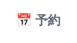 | 予約の確認・確定（管理者のみ表示）（§3.5） |
| 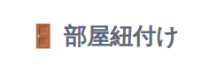 | 部屋と予約の紐付け（§3.4） |
| 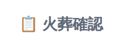 | 火葬同意の確認・来場受付（§3.6） |
|  | 注文の進行管理（§3.2） |
|  | スタッフによる代理注文（§3.3） |
| 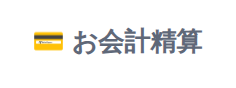 | 会計・精算（§3.7） |
| 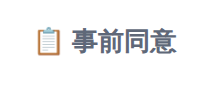 | 事前同意（お客様のLINE申込）の一覧 — **使用しません** |
|  | 「⚙️ 設定 ▾」— 各種マスタ・設定の一覧を開きます（管理者のみ表示）（§3.8） |

**ヘッダーの働き（詳しく）**

- **斎場の切り替え** — 選べる斎場は自分のアカウントの「アクセス範囲（許可斎場）」の中だけです（管理者は全斎場）。切り替えると**全タブの一覧・件数・通知が選択中の斎場に連動**します。

    「一覧に出るはずのものが出ない」「件数が合わない」時は、まずここを確認して下さい（他斎場の注文はポップアップ通知も鳴りません）。

- **表示対象日** — オーダー・火葬確認などの一覧が対象日に連動します。日付を過去に切り替えて履歴を確認した後は、**必ず本日に戻して**下さい（戻し忘れが「注文が出ない」の定番原因です）。
- **リアルタイム更新** — 画面は自動で最新化され、ヘッダーに「**リアルタイム接続中**」と表示されます。通信が切れると「**❌ 接続エラー**」に変わりますが、**10秒後に自動で再接続**を試みます。

    表示が戻らない時だけ再読込（Ctrl+Shift+R）して下さい。

- **通知音（🔔）** — 新しい注文が入った時に鳴ります。売店・厨房の担当はONのまま運用し、会議等で消したい時だけOFFにします（OFFのままだと新規注文に気付けません — §6.2）。

**操作結果の通知（画面右下に数秒表示されます）**

操作が成功すると緑、失敗すると赤の通知が画面右下に表示されます。赤い通知は失敗の理由が書かれているため、消える前に内容を確認して下さい（例はSAP登録失敗の通知）:

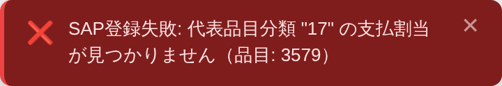

### 3.2 🍽️ オーダー（注文の進行管理）

**出来ること:** 「📝 代理注文」で入力した注文が、**未処理 → 調理中 → 提供済み → お会計準備完了** の4つの列でリアルタイムに管理出来ます（新しい注文が入ると通知音が鳴ります）。

「お会計済み」の件数は右上に表示され、会計そのものは「💳 お会計精算」タブで行います。

**列の見方**

| 列 | 意味 |
|---|---|
| 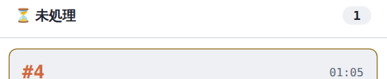 | 注文が入った直後。スタッフがまだ対応していない状態 |
| 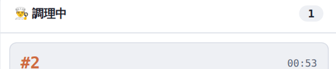 | 「調理開始」を押した状態 |
| 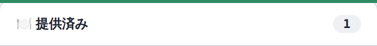 | お客様に商品を渡した状態（PDA計上前） |
| 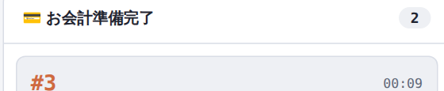 | PDA計上済み・会計待ち。**ご予約に紐づく注文はこの列に移るとSAPのカートに蓄積**されます（受注番号の発行は「💳 お会計精算」の「💰 支払い準備完了」で行われます）。 **スポット注文（予約に紐付かない注文）は例外**で、ご注文の時点でSAPへ受注確定済みのため、この列への移動でSAPには何も送られません（下の「スポット注文の扱い」参照） |

**注文カードの見方**（例: 売店でのご注文 #4）

カードには 注文番号（#4）・注文時刻・🕊故人名（窓口 花子）・🏢葬儀社名（あすなろ祭典）・注文経路（LINE／代理）・📍場所ラベル（売店レジ前・月の間1 など）・斎場と売り場（四ツ木斎場・売店）・SAP連携の状況・🔑予約番号（TEST-2500201）・商品明細・合計金額 が表示されます。

**カードのボタン**

| ボタン | 説明 |
|---|---|
| 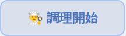 | **調理開始** — カードを「調理中」列へ移す。調理が必要な商品（天ぷらそば等）で使用 |
|  | **🍽️ 提供済み** — カードを「提供済み」列へ移す。瓶ビール等のすぐ渡せる商品は調理開始を飛ばして直接押す |
|  | **💳 お会計精算へ移す** — PDAで売上計上した後に押す。SAPのカートに蓄積され、カードは「お会計準備完了」列へ移ります。 ※予約にも受付にも紐付かない**スポット注文ではこのボタンは表示されず、代わりに「→ お会計準備完了」が出ます**（SAPへは送られません — ご注文時に受注確定済みのため。下の「スポット注文の扱い」参照） |
|  | **お会計済み** — その場でお支払いいただいた場合に押す。**喪主まとめ払いのときは押さない**（§3.7で一括精算） |
| 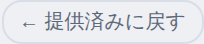 | **← 提供済みに戻す** — 1つ前の列に戻します。押し間違えたときに使用（列に応じて「← 未処理に戻す」「← 調理中に戻す」「← お会計準備完了に戻す」も同じ働きです） |
|  | **編集** — 注文内の商品を個別に削除・追加（一部キャンセル）。下のモーダルが開く |
|  | **📋 注文詳細** — 予約番号単位の明細・支払先の振り分け（喪主/現金/売掛/ワンタイム）・SAP連携状況の確認 |
| 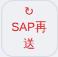 | **SAP再送** — SAP登録に失敗した注文をこのカードだけ再送 |
| 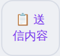 | **📋 送信内容** — SAPに送った内容の確認画面を開く |
| （✕） | **注文の取り消し** — 「未処理」列のカードにだけ付いています。注文そのものを取り消します |
| （💳 一部支払い） | 「お会計準備完了」列で、SAPカートに蓄積済みの注文にだけ表示されます。まとめ精算を待たずにこの注文分だけ先に精算するときに使います |
| （⚠ SAP金額照合待ち） | SAPの受注金額・割引条件の確認が必要な注文では、「💰 お会計済み」の代わりにこの表示が出て**先に進めません**。「💳 お会計精算」側で照合してから進めます |
| （⚠ SAP連携失敗） | SAP連携に失敗した注文では、進めるボタンの代わりにこの表示が出ます。「↻ SAP再送」で解消してから進めます |

**注文の状態の進み方（どの列で・どのボタンで動くか）**

| 今の列 | 押せる進めるボタン | 押せる戻すボタン | いつも押せるボタン |
|---|---|---|---|
| ⏳ 未処理 | 👨‍🍳 調理開始（→調理中）／🍽️ 提供済み（→提供済み）／💳 お会計精算へ移す（→お会計準備完了） | ✕（注文の取り消し） | ✏️ 編集・📋 注文詳細 |
| 👨‍🍳 調理中 | 🍽️ 提供済み（→提供済み）／💳 お会計精算へ移す | ← 未処理に戻す | ✏️ 編集・📋 注文詳細 |
| 🍽️ 提供済み | 💳 お会計精算へ移す（→お会計準備完了） | ← 調理中に戻す | ✏️ 編集・📋 注文詳細 |
| 💳 お会計準備完了 | 💰 お会計済み（※SAPの金額確認が必要な注文では「⚠ SAP金額照合待ち」と表示されて押せません） | ← 提供済みに戻す | ↻ SAP再送・📋 送信内容・💳 一部支払い・✏️ 編集・📋 注文詳細 |
| 💰 お会計済み（右上の件数） | — | ← お会計準備完了に戻す | 📋 注文詳細 |

> **✏️ 編集が出来るのはSAPカート投入前まで**です。投入後に編集しようとすると「SAPカート投入後の注文は編集できません。SAP受注・カートを照合してください。」と表示されます。

**🔍 一つ一つの操作の詳しい流れ（オーダー）**

**① 👨‍🍳 調理開始** — 調理が必要な商品（天ぷらそば・うどんなど温かい食事）を受けた時に、厨房へ取り掛かりの合図をするための操作です。

押す前に、カードの商品明細と場所ラベル（どのお部屋からの注文か）を確認します。

押すとカードが「調理中」列へ移るだけで、**お客様への通知は届きません**（調理中の通知は仕組みとしてありません）。

飲み物だけの注文など、調理が要らない場合はこのボタンを押す必要はなく、次の「🍽️ 提供済み」へ直接進めて構いません。押し間違えた場合は「← 未処理に戻す」で戻せます。

**② 🍽️ 提供済み** — 商品をお客様のお手元へ届け終えた時に押します。押した瞬間にカードが「提供済み」列へ移ります。

お渡しの記録を正しく残すため、**実際にお渡ししてから**押して下さい。複数の注文をまとめてお届けした場合は、届けた注文のカードを1枚ずつ押します。

**③ 💳 お会計精算へ移す** — お渡しが済んだ注文を会計の待ち行列に載せる操作で、**PDAで売上計上を済ませた後**に押すのが順番です。

押すと2つのことが同時に起きます: (1) カードが「お会計準備完了」列へ移り、注文の内容が**SAPのカート（会計の入れ物）に蓄積**されます（受注番号はまだ発行されません — 発行は「💳 お会計精算」タブの「💰 支払い準備完了」で行われます）。

(2) なお、ご予約に紐づかないスポット注文ではボタンが「**→ お会計準備完了**」になり、**働きも異なります**（SAPへは送られません — ご注文時に受注確定済みのため。下の「スポット注文の扱い」参照）。

**押した結果が確認できなかった時の表示** — 通信の不調などで、カートに入ったかどうか確認できないまま終わることがあります。

その場合は次のように表示されるので、**共通して「再送せず、まず注文詳細でカートの中身を確認する」**を徹底して下さい（そのまま再操作すると二重投入の恐れがあります）:

- 「SAPカートへの到達結果が未確定です。精算待ちへ移さず、SAPカートを確認してください。」
- 「精算への移動の応答待ちがタイムアウトしました。SAP側は処理を継続している可能性があります。再操作せず、［注文詳細］→［SAP診断］でSAPカートの状態を確認してください。」
- 「ステータスは変更しましたが、SAPへの送信結果が確認できませんでした。カートに入ったかは不明です。注文詳細でSAPカートを確認してから対応してください（そのまま再送すると二重投入になる可能性があります）。」

また、複数の注文を「全て提供済みに」でまとめて進めた時に一部のSAP送信が失敗していると「⚠ 提供済みにした注文のうち ◯件のSAP送信に失敗しました。このまま進むと支払いお知らせ前のSAP失敗ゲートで確認を求められます。［注文詳細］→「↻ SAP再送」で再試行できます。」と表示されます。

会計の前にここで解消しておくと、支払い準備完了がその分すんなり通ります。

**④ 💰 お会計済み** — 売店などで**その場で現金等のお支払いが完了した**注文だけに押します。押すとカードは右上の「お会計済み」件数に集計されます。

**喪主まとめ払いの注文では絶対に押さないで下さい** — まとめ払いは「💳 お会計精算」タブで一括精算するのが正しい流れで、ここで押してしまうと精算対象から外れてしまいます。

また、SAPの金額確認が必要な注文では、このボタンの代わりに「⚠ SAP金額照合待ち」と表示されて押せません（§3.7の「🔄 SAPと照合」で確認してから進めます）。

**⑤ ← 戻すボタン（未処理に戻す／調理中に戻す／提供済みに戻す／お会計準備完了に戻す）** — 押し間違えた時に、カードを1つ前の列へ戻すための操作です。

戻しても**既に送られたお客様への通知は取り消せません**（例: 提供済みを取り消しても「提供が完了しました」の通知は届いたままです）。戻した後は正しい順序でもう一度進めて下さい。

**⑥ ✕（注文の取り消し）** — 「未処理」列のカードにだけ付いています。注文そのものを取り消す操作です。

調理が始まった後（調理中以降）の取り消しは、この✕ではなく「✏️ 編集」での一部取消か、列を未処理へ戻してからの取り消しになります。取り消しのご依頼をお客様から受けた場合も、スタッフがこの操作で対応します。

**⑦ ✏️ 編集（一部キャンセル）** — 「1品だけ取り消したい」「数量を間違えた」時の操作です。

開いた画面で行の「✕」を押すと合計金額がその場で再計算され、消し過ぎた時は「＋ 商品を追加」で商品名・品番から戻せます。最後に「保存」を押すまで確定しません。

**編集出来るのはSAPカートへ入る前（お会計準備完了へ移す前）まで**で、投入後は「SAPカート投入後の注文は編集できません」と表示されます。その場合の内容変更は§3.7側（注文詳細・SAP照合）で扱います。

**編集を保存した時の結果表示** — カートに入り始めている注文の編集は、保存と同時にSAPカート側の品目の入れ替えまで行われます。

結果は次の3通りの表示で必ず知らされるので、**表示を読んでから**次の操作に進んで下さい:

| 表示 | 意味と対処 |
|---|---|
| 編集内容をSAPカートへ反映しました | 正常終了。そのまま進めます |
| 編集は保存しましたが、SAPカートへの反映に失敗しました。「↻ SAP再送」で復旧してください | 画面上の注文は直りましたが**カート側は古いまま**です。案内どおり「↻ SAP再送」で復旧します |
| 保存結果を確認できませんでした。注文一覧を再読み込みして状態を確認してください(そのまま再操作しないでください) | 通信が途切れて結果が不明の状態です。**再操作すると入れ替えが二重に走る恐れ**があるため、必ず再読込で状態を確かめてから対応します |

**⑧ 📋 注文詳細** — 予約番号の単位で、その方の全注文の明細・金額・支払先の振り分け・SAP連携の状況をまとめて確認する画面です。

会計の前に「どの品目を誰が支払うか」を確認・変更したい時はここを開きます（振り分けの詳しい操作は§3.7）。確認だけなら何度開いても状態は変わりません。

**⑨ ↻ SAP再送・📋 送信内容・↻ 失敗分を一括再送** — SAP連携に失敗した注文（⚠SAP失敗の赤いバッジ）を送り直す操作です。

押す前に必ずバッジにカーソルを合わせて**失敗理由の全文**を確認して下さい（例:「代表品目分類 "17" の支払割当が見つかりません」→ 先に振り分けを直さないと再送しても同じ失敗になります）。

「📋 送信内容」ではSAPに送った内容そのものを確認出来ます。失敗が複数ある時は画面上部の「↻ 失敗分を一括再送」でまとめて再送できます。

**「⚠ SAP未確定」（到達が確認できていない）の注文だけは、そのまま再送すると二重投入の恐れがある**ため、先に「📋 注文詳細」でカートの中身を確認してから判断して下さい。

**🔬 さらに深く（オーダー画面 — 裏側の動きと例外）**

各操作の「画面で見える動き」の裏で何が起きているか、うまくいかない時に何を疑うかを、要素ごとに1段深く整理します:

| 要素 | 裏で起きていること | 例外・注意 |
|---|---|---|
| 注文カードが現れる | 「📝 代理注文」で送信した注文が登録され、進行管理の対象になります | ご案内は全てお声がけで行います（お客様への自動通知はありません） |
| 「🍽️ 提供済み」を押す | カードの列が「提供済み」に変わり、お渡し済みの記録になります | 列は「← 調理中に戻す」で戻せます。お渡しの実態と列を揃えるため、押すのはお渡しと同時にします |
| 「💳 お会計精算へ移す」を押す | SAPのカート（会計の入れ物）に品目が積まれ、お会計準備の通知が届きます。**受注番号はまだ発行されません** | カート投入の結果が確認できないことがあります（③の3分類）。共通の対処は「再送せず、注文詳細でカートを確認」です |
| 「💰 お会計済み」を押す | 支払い完了として記録されます | 喪主まとめ払いのご家族では**押しません**（受付単位の精算は§3.7側で行うため。個別に押すと二重会計の元になります） |
| 「↻ SAP再送」を押す | 失敗した注文の内容を、SAPカートへもう一度積み直します | 「⚠ SAP到達不明」だけは**届いているのに失敗表示**の可能性があり、そのまま再送すると二重投入になり得ます。必ず先にカートの中身を確認します |
| 「✏️ 編集」で保存する | カートに入り始めた注文は、保存と同時に**カート側の品目の入れ替え**（旧品目を外して新品目を入れる）まで行われます | 入れ替えの結果は3分類の表示で知らされます（⑦）。結果不明の時に再操作すると入れ替えが二重に走る恐れがあります |

**🧾 スポット注文の扱い（予約にも受付にも紐付かない注文）**

「🚶 予約なし」から入力した代理注文・お連れ様購入など、**予約にも受付にも紐付かない注文**は、通常の注文と会計の仕組みが根本的に異なります。

- **SAP連携のタイミングが違います。**

    通常の注文は「お会計準備完了」でカートに蓄積→「💰 支払い準備完了」で受注確定、という2段階ですが、スポット注文は**ご注文を送信した時点で、その注文だけで完結する受注としてSAPへ確定**します（カートには積まれません）。

- **「💳 お会計精算」タブには載りません。** 受付単位で精算するお会計精算の対象外のため、カードに「**🧾 スポット注文（お会計精算の対象外）**」のバッジが付き、「💳 お会計精算へ移す」ボタン自体が表示されません（代わりに「→ お会計準備完了」が出ます）。
- **会計はこのオーダー画面内で完結させます。** お渡し・PDA計上の後、「→ お会計準備完了」→ その場でお支払いを受けて「💰 お会計済み」の順に進めます。
- **お渡しとお会計は口頭でご案内下さい**（お客様への自動通知はありません）。
- **お連れ様購入には「G」で始まるゲスト予約番号**が自動で発行され、カードと成功表示（「✅ お連れ様注文を作成しました 予約番号: G…」）に表示されます。領収書や後からの照会はこの番号で行えます。

| 表示 | 意味 |
|---|---|
| LINE ／ 代理 | 注文の入り口の表示です（代理＝代理注文。LINEは使用しない経路のため、通常は「代理」のみが並びます） |
| 📍（例: 月の間1・売店レジ前） | 注文が入ったお部屋・場所のラベル |
| 🔑（例: TEST-2500200） | 紐づくご予約の予約番号 |
| 🔥 火葬同意済 ／ ⚠ 火葬未同意 | 火葬同意の状況（「📋 火葬確認」と連動） |
| 区民葬 ／ 献体 ／ 減額 ／ 公費 | 適用中の割引・特別料金 |
| 🛒 カート蓄積済 | SAPのカートに入り、お会計待ちの状態 |
| ✓ SAP登録済 | SAPの受注が発行済み |
| ⚠ SAP失敗 | SAP連携に失敗（カーソルを合わせると理由の全文） |
| ⚠ SAP未確定 | 送信したがSAP側への到達が確認できていない。**そのまま再送すると二重投入の恐れ** |
| ⏸ SAP保留 ／ ⏭ SAP対象外 ／ 🚫 SAP無効 | SAP連携の対象外・停止中 |
| ⚡ 一部支払済 | 一部の品目だけ精算が済んだ状態 |
| ⚠ 予約カート未構築 | ご予約分の品目がSAPカートに入っていない。「↻ SAP再送」で作り直す |
| ⚠ 金額要確認 | SAPの受注金額と割引条件の確認が必要。**再送・精算は禁止**（「🔄 SAPと照合」で確認） |
| ⚠ 予約と重複 ◯件 ／ ⚠ SAP送信除外 ◯件 | 予約品目と重複した品目／SAP送信から除外された品目がある（カーソルで品目名を確認） |
| 🧾 スポット注文（お会計精算の対象外） | 予約にも受付にも紐付かない注文の印。**ご注文の時点でSAPへ受注として確定済み**のため、受付単位で精算する「💳 お会計精算」には移せません。このオーダー画面内で「→ お会計準備完了」→「💰 お会計済み」と進めて完結させます |

**画面上部「📤 SAP受注」の帯**（お会計準備完了列の集計。0件のものは表示されません）

帯の右端には「💰 お会計済み ◯件（会計精算タブで管理）」の件数も常に表示されます。帯全体の見え方です:

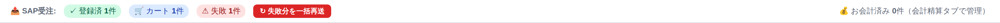

| 表示 | 意味 |
|---|---|
| ✓ 登録済（緑） | SAPへの受注登録が完了 |
| 🛒 カート（青） | SAP側のカートに蓄積済み（会計待ち） |
| ⏳ 送信中（黄） | 応答待ち（通常は表示されません） |
| ⚠ 失敗（赤） | 登録に失敗した注文と、**「SAP未確定」（送信はしたがSAP側への到達が確認できていない）注文の合計**。下の「↻ 失敗分を一括再送」で再送します |
| ⏭ 対象外（灰） | SAP連携の対象外・無効・保留 |
|  | **失敗分を一括再送** — 失敗した注文をまとめて再送（失敗があるときだけ表示） |

SAP登録に失敗した注文のカードには「⚠SAP失敗」の赤いバッジが付きます（バッジにカーソルを合わせると失敗理由の全文が表示されます。例:「代表品目分類 "17" の支払割当が見つかりません（品目: 3579）」）:

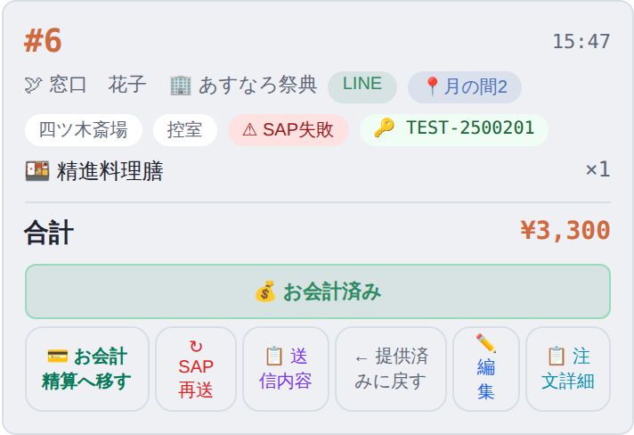

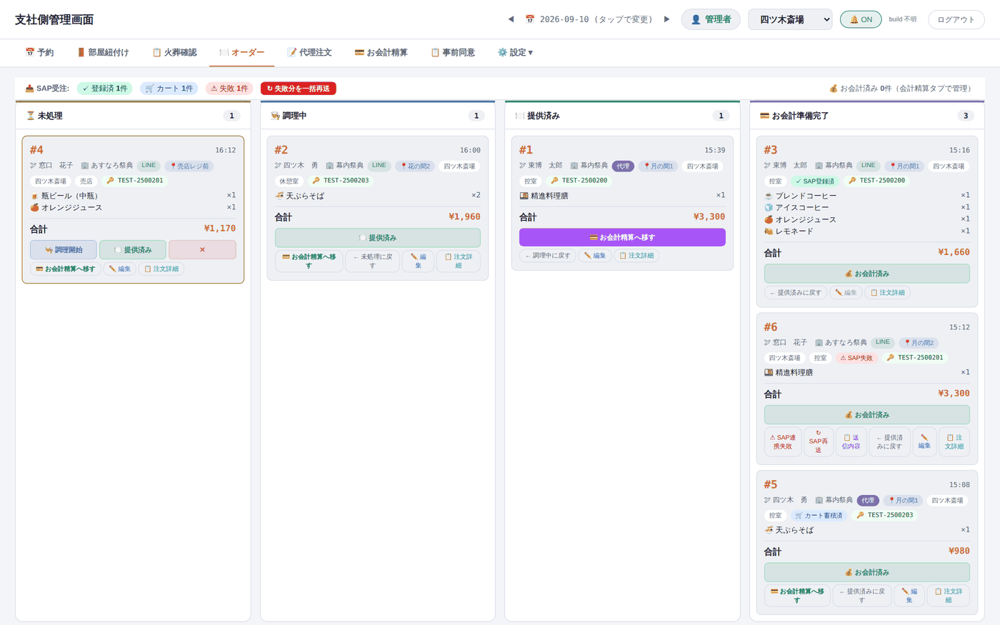

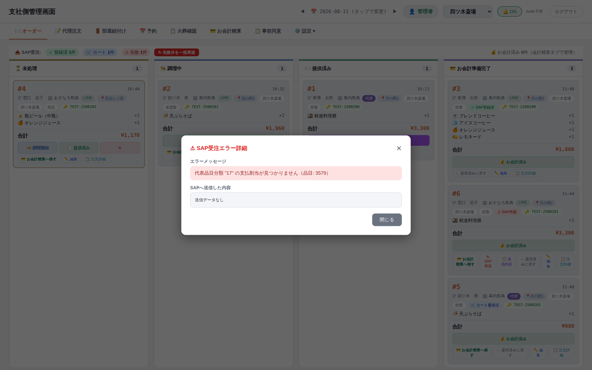

**✏️ 編集（一部キャンセル）の手順**

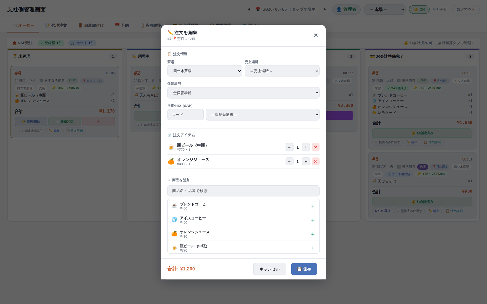

| # | 操作 |
|---|---|
| 1 | カードの「✏ 編集」を押す →「注文を編集」画面が開く |
| 2 | 取り消したい商品の行の「✕」を押す → 合計金額が自動で再計算される |
| 3 | 間違えて消したら「＋ 商品を追加」で商品名・品番から再追加 |
| 4 | 「保存」で確定（注文自体は残るので受付や会計には影響しない） |

**📋 注文詳細**（支払先の振り分け）

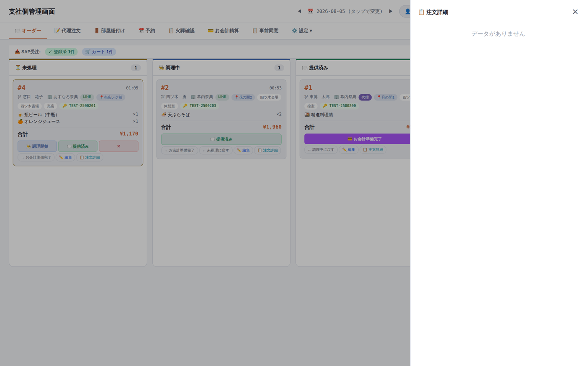

| 支払先ボタン | 使いどころ |
|---|---|
| 喪主 | 喪主まとめ払い。最終精算は「💳 お会計精算」で一括 |
| 現金 | その場での現金支払い |
| 売掛 | 葬儀社への請求（後日精算） |
| ワンタイム | 単発精算（イレギュラー時）。※現場に馴染みのある言葉に合わせて「**喪主支払い**」への名称変更が予定されています |

> **注文の取り消しはスタッフ側の操作で行います。** 取消のご依頼を受けたら、このタブの「キャンセル」で対応して下さい。

### 3.3 📝 代理注文（スタッフによる代行注文）

**出来ること:** **全てのご注文を承る標準の画面です**（お客様のスマホ注文は使用しない方針のため、お部屋・売店・葬儀社の手配を問わず、ご注文は職員がこの画面で入力します）。

画面は上から **⚙️ 斎場・売上場所設定 → 1 予約を選択 → 2 購入者を選択 → 3 商品を選択** の順に並び、上のステップが終わると下が開きます（ステップ番号は 1・2・3 の丸数字で表示されます）。

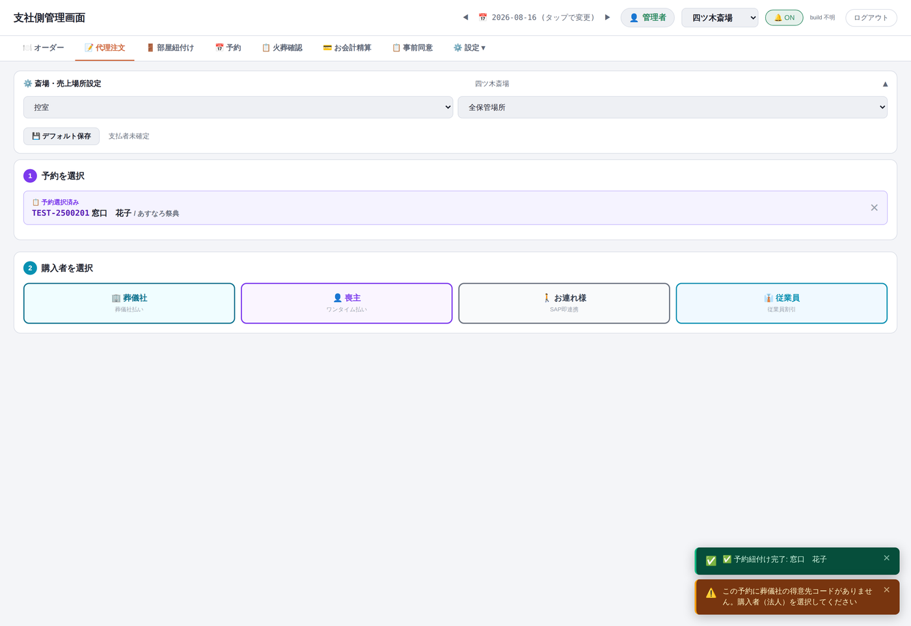

**STEP 0: 斎場・売上場所を選ぶ**

斎場・売上場所が未選択の間は先に進めません（「⚠️ 先に「⚙️ 斎場・売上場所設定」で斎場と売上場所を選択してください。」と表示されます）:

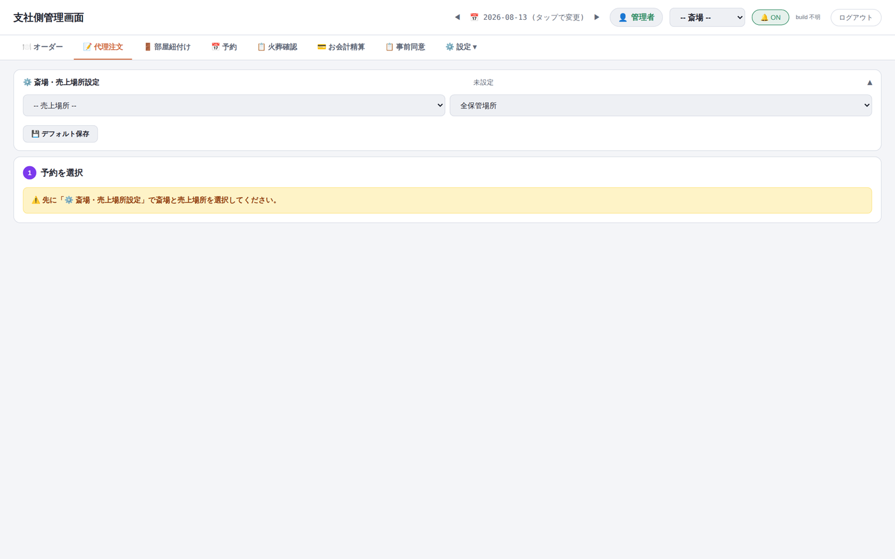

「⚙️ 斎場・売上場所設定」を開いて、売上場所（例: 控室）と保管場所を選びます:

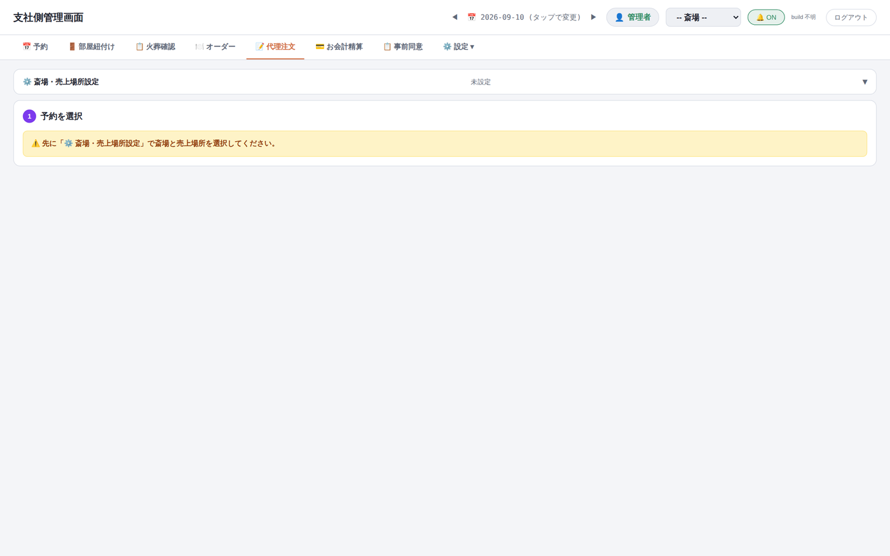

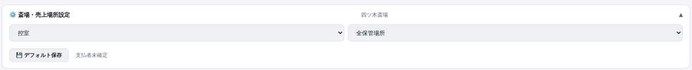

| ボタン | 説明 |
|---|---|
| 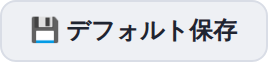 | **デフォルト保存** — 今の斎場・売上場所を自分の既定値として保存（次回から自動で選ばれます） |

四ツ木斎場・控室を選ぶと「1 予約を選択」が使えるようになります:

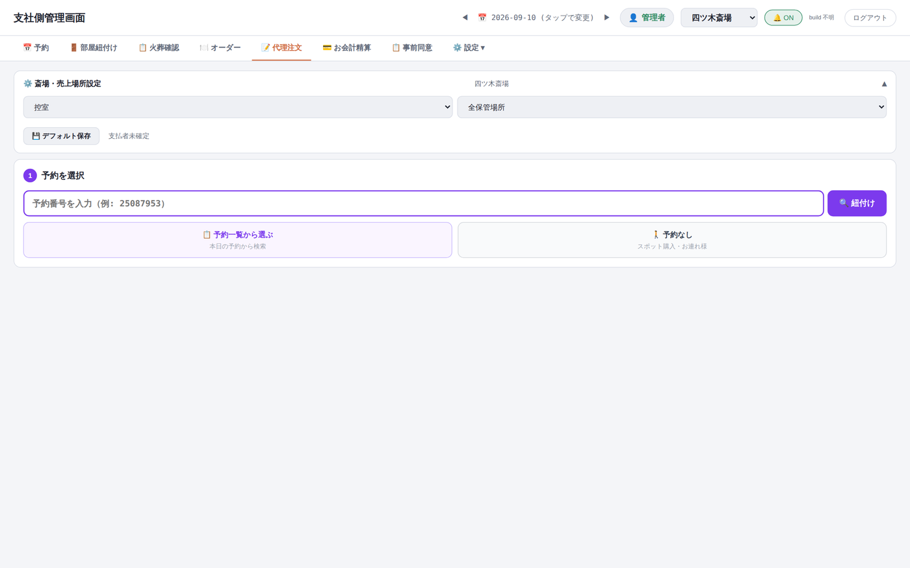

**STEP 1: 予約を選ぶ（3通り）**

| 方法 | 説明 |
|---|---|
| 予約番号を入力 →  | **🔍 紐付け** — 予約番号（例: TEST-2500200）が分かっている場合が最速。成功すると「✅ 予約紐付け完了: 東博　太郎」と表示されます |
|  | **📋 予約一覧から選ぶ** — 当日の予約一覧から選びます（下の画面が開きます） |
| 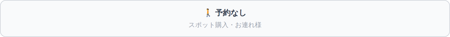 | **🚶 予約なし** — ご予約のないスポット購入・お連れ様向け。この場合だけ 2 購入者を選択 が表示されます |

予約一覧（「本日の予約から検索」。**故人名・葬儀社・予約番号**で検索出来、葬儀時間順の並び替えが付きます。「※ 受付完了の予約は葬儀社得意先コードが自動入力されます」）:

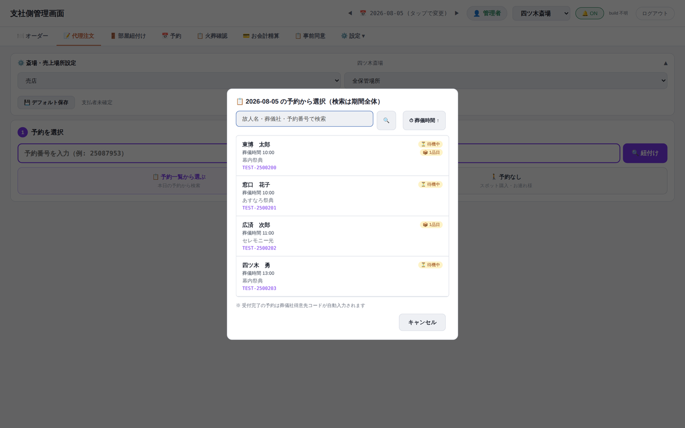

ご予約を選ぶと、2 を飛ばして「3 商品を選択」が開きます（紫のバッジ「📋 予約選択済み TEST-2500200 東博　太郎 / 幕内祭典」。✕で選び直し）。

**ステップ番号が 1 → 3 と飛ぶのが正常な動きです**:

**STEP 2: 購入者を選ぶ（「🚶 予約なし」を選んだ時と、ご予約に得意先コードが無い時のみ）**

| ボタン | 説明 |
|---|---|
| 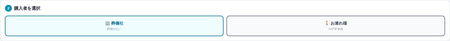 | 「2 購入者を選択」の見出し（この見出しが出ていない＝予約ありで葬儀社払いに自動確定済み） |
|  | **🏢 葬儀社（葬儀社払い）** — 押すと得意先の選択欄が開きます。幕内祭典・あすなろ祭典・セレモニー光などから選びます |
|  | **👤 喪主（直売）** — 喪主様への直接販売として登録します |
|  | **🚶 お連れ様**（カードの下に小さく「SAP即連携」） — その場精算のお連れ様購入。選ぶと、お名前（未入力の場合「お連れ様」で登録）・領収書名の入力欄が使え、送信ボタンが「**🚶 お連れ様購入（SAP即連携）**」に変わります |

> 設定によっては、この画面に「👔 従業員」（従業員割引用。選ぶと「👔 従業員割引 得意先を選択」の画面が開きます）の選択肢も表示されます（現在の検証環境では非表示です）。

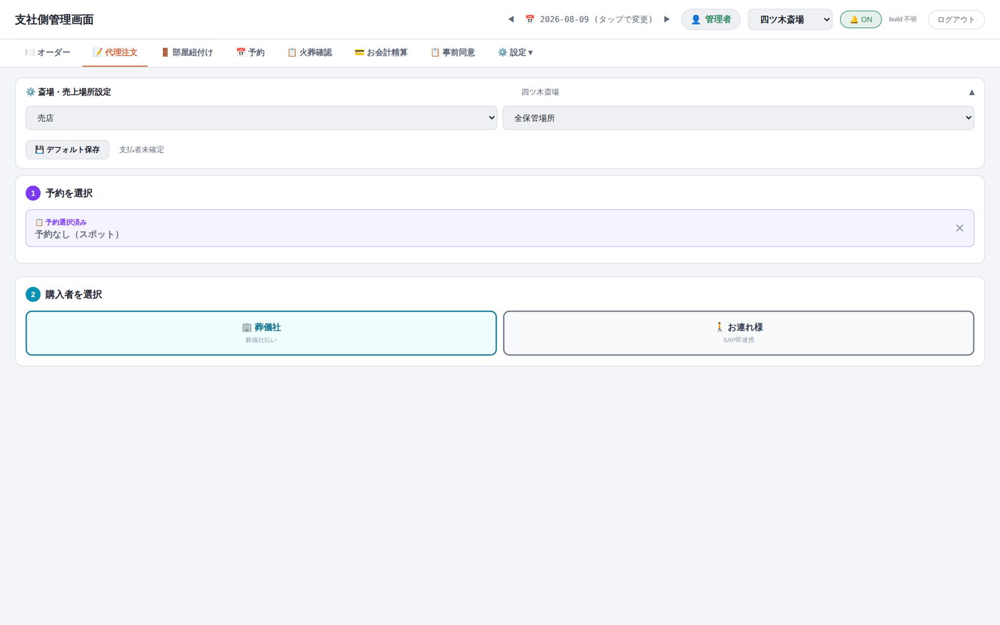

**STEP 3: 商品を選ぶ**

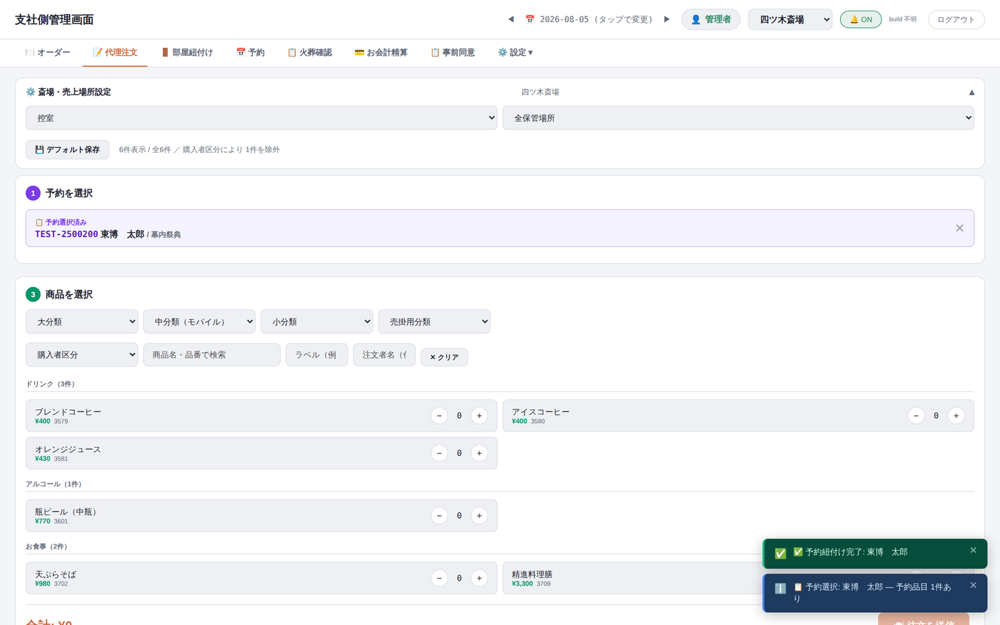

絞り込みの項目は、大分類／中分類（モバイル）／小分類／売掛用分類／購入者区分／商品名・品番で検索／ラベル／注文者名です。

ほかに「**🍵 フリードリンク対象のみ**」のチェックで、フリードリンクの対象品だけに絞り込めます。ソフトドリンク・アルコール・ノンアルコールのうち対象外のものが非表示になり、軽食・和菓子などはそのまま表示されます:

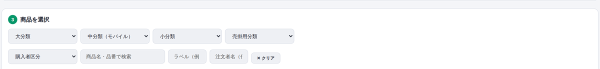

| ボタン | 説明 |
|---|---|
|  /  | 数量の増減 |
| 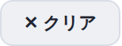 | **✕ クリア** — 絞り込みを全て解除 |
|  | **注文を送信** — 確定すると「🍽️ オーダー」に新しいカードが現れます |

> **購入者による商品の出し分け**: 画面上部に「6件表示 / 全6件 ／ 購入者区分により 1件を除外」のように表示されます。
>
> お連れ様には一般商品のみ、喪家向け商品（精進料理膳など）・スタッフ代理専用品（骨壺など）は購入者に応じて自動的に隠れます。
>
> また購入者を変更すると、その購入者に出せない品目はカートから外され、件数と理由が表示されます。
>
> **価格が決まっていない商品・仕入専用品は、最初から一覧に出ません。**
>
> 件数の行に「／ 価格未設定 ◯件を非表示」「／ 仕入専用品 ◯件を非表示」と表示され、除外された件数が分かります（0円のまま注文して請求漏れになる事故の防止です）。
>
> **「あるはずの商品が一覧に出ない」時は、まずこの件数表示を確認**して下さい — 商品マスタで価格が未設定のままか、仕入専用の扱いになっている可能性があります（表示されない商品についての調査も進行中です。→§6.4）。

価格未設定の商品・仕入専用品が除外されている時の、件数の行の表示例です:

商品を追加すると下部に合計金額と送信ボタンが表示されます:

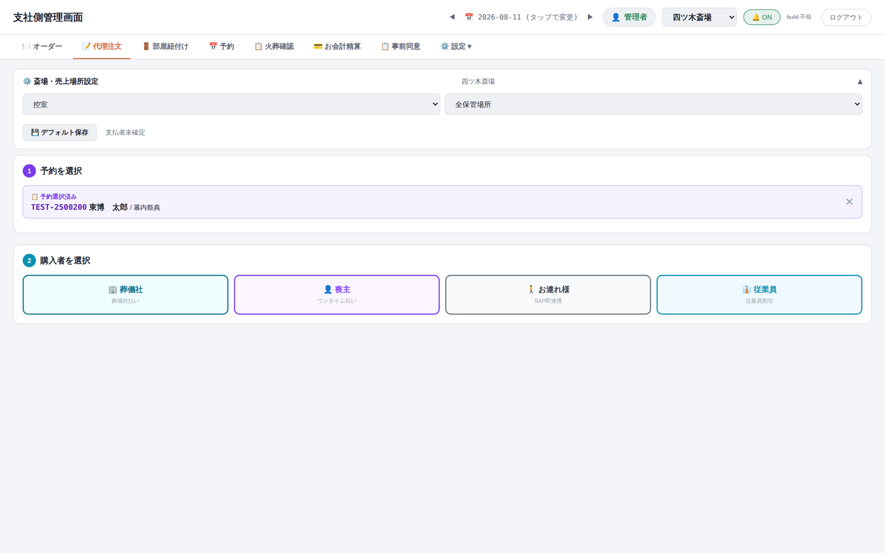

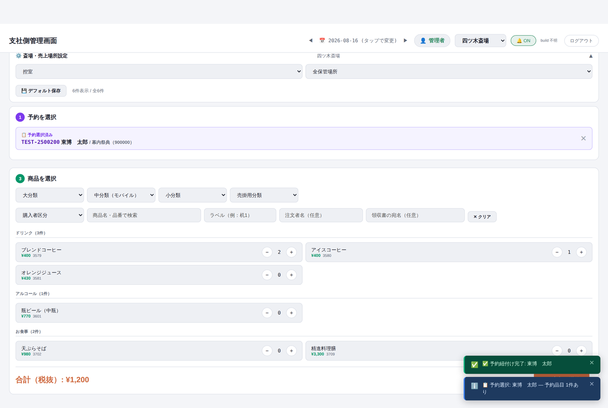

**🔍 一つ一つの操作の詳しい流れ（代理注文）**

**① ⚙️ 斎場・売上場所設定（STEP 0）** — 「どこの売上として計上するか」を最初に決める操作で、ここが未選択の間は下のステップが全て塞がっています。

売上場所（控室・売店・ラウンジなど）と保管場所（在庫の引き当て元）を選びます。

毎回同じ場所で入力する方は「デフォルト保存」を押しておくと、次回からログインした時点で自動的に選ばれた状態になります。

**売上場所を間違えたまま注文を送ると、後の精算でエラーになる**事例が報告されているため（誤った売上場所でも入力自体は通ってしまいます）、送信前にもう一度設定バーの表示を確認して下さい。

**② 🔍 紐付け（予約番号で選ぶ）** — 予約番号が手元にある場合の最短ルートです。

入力して押すと、その場で予約が検索され、成功すると「✅ 予約紐付け完了: 東博　太郎」と表示され、紫のバッジ（予約番号・故人名・葬儀社名）が付きます。

番号の打ち間違いなどで見つからない場合はエラーが表示されるだけで、何も確定しません。選び直したい時はバッジの「✕」を押します。

**③ 📋 予約一覧から選ぶ** — 番号が分からない時に使います。本日の予約が一覧表示され、故人名・葬儀社・予約番号で検索、葬儀時間順の並び替えが出来ます。行を選ぶとその予約に紐付き、②と同じ状態になります。

受付（チェックイン）が完了している予約は、葬儀社の得意先が自動で入っています。

**④ 🚶 予約なし（スポット注文）** — ご予約と関係のないスポット購入（お連れ様の追加の飲み物など）の入り口です。これを選んだ時だけ「2 購入者を選択」が開き、**誰のお支払いになるか**を必ず選びます。

葬儀社（→得意先の選択欄が開く。**売掛が使えない葬儀社では売掛の注文は送信前に止まります**）・喪主（直売）・お連れ様（SAP即連携＝その場精算）から選択します。

**スポット注文は送信した時点でSAPへ受注として確定し、「💳 お会計精算」タブには載りません**（オーダー画面内で「→ お会計準備完了」→「💰 お会計済み」と進めて完結。§3.2「スポット注文の扱い」参照）。

予約なしで送った注文は後から予約に紐付けられないため、ご予約のある方の注文と分かっている場合は必ず②か③で予約を選んでから進めて下さい。

**④-2 お連れ様購入の流れ（詳しく）** — 購入者で「🚶 お連れ様」を選ぶと、お名前・領収書名・ラベルを添えられます（お名前が未入力の場合は「お連れ様」で登録されます）。

商品を選んで「**🚶 お連れ様購入（SAP即連携）**」を押すと、**その瞬間にSAPへ受注が確定**し、「✅ お連れ様注文を作成しました 予約番号: G…」と表示されます（**Gで始まるゲスト予約番号**が自動採番され、領収書やお問い合わせの手掛かりになります）。

作成された注文は最初から「お会計準備完了」列に入るので、お支払いを受けて「💰 お会計済み」で完結します。

送信中に通信が切れた場合は「送信の結果が確認できませんでした（通信タイムアウト）。SAPに届いたかは不明です。再送する前に必ず注文一覧を確認してください」と表示されます — **必ず注文一覧を確認してから**再送して下さい。

前回の送信が実は成立していた場合は、再送時に「⚠ 前回の送信が既に注文として成立しています。注文一覧を確認してください」と自動で止まる仕組みも入っていますが、確認が先です。

**④-3 酒類を含む注文の記録** — ビール・日本酒など酒類を含む代理注文・お連れ様購入を確定すると、**職員が年齢と運転の有無を口頭で確認したものとして記録**されます（確認した職員のアカウントが監査記録に残ります）。

必ず口頭確認をしてから確定して下さい（ノンアルコール商品は対象外です）。

**⑤ 商品を選んで「注文を送信」（STEP 3）** — 商品カードの「＋／−」で数量を調整すると、画面下部に合計金額が積み上がります。

絞り込み（大分類・商品名・品番など）は表示を絞るだけで、カートの中身には影響しません。

購入者によって出せる商品が自動で変わる点に注意して下さい: お連れ様には一般商品のみが表示され、喪家向け商品（精進料理膳など）やスタッフ代理専用品（骨壺など）は自動的に隠れます。

購入者を途中で変更すると、その購入者に出せない品目はカートから外され、件数と理由が画面に表示されます。

「注文を送信」を押すと確定し、「🍽️ オーダー」タブの「未処理」列に新しいカードが現れます（以降の進行は§3.2と同じです）。**送信は1回だけ**押し、応答を待って下さい（最大45秒。§1参照）。

タイムアウトの表示が出た場合は「届いていない」と決めつけず、**先に注文一覧で前回分が入っていないかを確認**します — 同じ内容をもう一度送っても、前回が成立していた場合は「⚠ 前回の送信が既に注文として成立しています」と自動で止まる仕組みが入っています。

**注文の補足情報（任意）** — 商品一覧の上に、ラベル（例: 机1）・注文者名・領収書の宛名の入力欄があります。領収書の宛名は、空欄の場合は喪家名などから自動で設定されます:

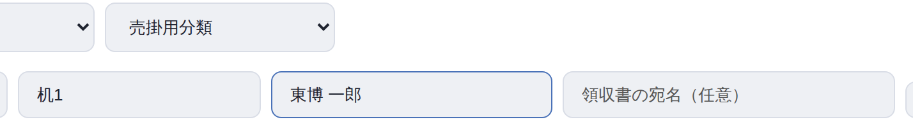

**入力時に止まる主な表示** — 1品目の数量は999個までです（「1品目あたりの上限は999個です」）。

金額をその場で決める**任意金額の商品**は、商品カードに「任意金額」と表示され、金額（税抜）の入力欄が付きます。金額を入れずに送信しようとすると「任意金額品目の金額（税抜）を入力してください: ◯◯」で止まります:

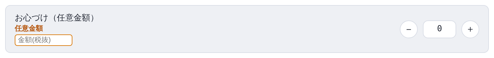

前のご注文のカートが残ったまま別の予約を選ぶと「前の伝票の商品がカートに残っています。「−」で外すか、STEP1の ✕ でやり直してください」と案内されます（同じ予約のまま続けて入力する場合は「📦 カートの商品 ◯件を保持しました」とカートが引き継がれます）。

**⑤-2 送信した後に出る結果表示（重要）** — 「注文を送信」の後には、**注文の成立**と**SAP連携の結果**が1つのメッセージで知らされます。「✅ 代理注文 #◯」だけなら正常です。

「作成しましたが、…」と続く場合は注文自体は成立しており、**SAP側だけが未解決**の状態なので、メッセージ別に次のように対応します:

| 表示（「代理注文 #◯ を作成しましたが、…」に続く部分） | 意味と対処 |
|---|---|
| SAPに送る品目がありません（SAP品目コード未設定）。この金額はSAPに請求されません。 | 商品マスタに品目コードが無い商品でした。**請求漏れになる**ため、商品マスタを確認して正しい商品で入れ直します |
| SAP連携に失敗しました。この金額はSAPに請求されません。注文詳細の「↻ SAP再送」で解消してください | 通信・登録の失敗。案内どおり「↻ SAP再送」で解消します |
| SAPへの到達が確認できていません（未確定）。再送せず、注文詳細でSAPカートの内容を確認してから対応してください。 | 届いたかどうか不明の状態。**再送は二重投入の恐れ**があるため、必ず先にカートを確認します |
| SAPへの送信結果が確認できませんでした。カートに入ったかは不明です。 | 同上（通信タイムアウト）。注文詳細でカートを確認してから対応します |
| SAP連携が無効のため送信されていません。この金額はSAPに請求されません。 | SAP連携の設定が無効になっています。管理者に確認します |

**⑤-3 売掛・葬儀社に関する制限で止まる表示** — 葬儀社のお支払い条件によっては、送信前に次の表示で止まることがあります:

- 「🚫 この葬儀社はブロック中です（◯◯）。受付できません。」— 得意先マスタで受注ブロック中の葬儀社です（§3.8の「ブロック同期」参照）。
- 「この葬儀社は売掛にできません。現金を選んでください」／「この葬儀社は売掛にできません（現金は選べます）」— 売掛が使えない葬儀社です。現金でご案内します。
- 「この葬儀社は分類 ◯ を売掛にできないため送信できません（◯件）」— 一部の品目分類だけ売掛に出来ない契約です。該当品目を現金側へ分けるか、外して送信します。
- 「この葬儀社が売掛にできない分類（◯）の商品 ◯件をカートから削除しました」— 売掛不可の品目が自動でカートから外された通知です。外れた商品を確認して下さい。

**⑤-4 振り分け未設定でカートに入れられない時（ゲスト切替の提案）** — 紐付き注文をSAPカートへ入れる際、支払振り分けが未設定だと確認が出ます。

文面は「⚠️ この注文はカートに追加できません。原因: 支払振り分けが未設定のため 【対応方法】① 受付タブで「🏷 振り分け」を設定後に再送 ② ゲスト購入として単体送信 — ゲスト購入に切り替えますか？」です。

**OKするとその場でスポット注文（単体受注）に切り替わり**「ゲスト購入に切り替えました。SAP送信を再試行します...」と続行されます。受付単位でまとめて精算したい場合はOKせず、先に振り分けを設定して下さい。

**⑥ 送信した後の支払先の直し方** — 予約ありの代理注文は自動的に「葬儀社払い」で登録されます。

喪主様のお支払いにしたかった場合は、送信後に「🍽️ オーダー」の「📋 注文詳細」を開き、支払先を「喪主」へ振り分け直します（§3.2⑧・§3.7）。注文を送り直す必要はありません。

**🔬 さらに深く（代理注文 — 裏側の動きと例外）**

| 要素 | 裏で起きていること | 例外・注意 |
|---|---|---|
| ①でご予約を選ぶ | 予約から葬儀社（得意先コード）が取り込まれ、購入者が「🏢 葬儀社払い」で自動確定します（②が飛ぶのはこのため） | 予約に得意先コードが無いと自動確定できず、②購入者選択が開きます（画面右下に案内が出ます） |
| 「注文を送信」を押す（予約あり） | 注文が登録され、オーダーの「未処理」列に載ります。SAPへはこの時点では送られません（お会計準備完了でカートへ） | 応答は最大45秒。**送信は1回だけ**。同じ内容を誤って再送しても、前回が成立していれば自動で止まります |
| 「🚶 お連れ様購入（SAP即連携）」を押す | その瞬間にSAPへ**単独の受注**が確定し、Gで始まるゲスト予約番号が採番されます（後からの照会の鍵） | 送信＝受注確定のため、内容の間違いは取り消し・修正の手間が大きくなります。押す前の読み合わせが特に重要です |
| 酒類を含めて確定する | 職員が年齢・運転の口頭確認を済ませたものとして、確認者のアカウントつきで監査記録に残ります | 記録は自動です — **必ず実際に口頭確認をしてから**確定して下さい（ノンアルコールは対象外） |
| 購入者を途中で変更する | その購入者に出せない品目が自動でカートから外され、件数と理由が表示されます | 外れた品目は戻りません。必要なら購入者を確定した後に選び直します |

### 3.4 🚪 部屋紐付け（部屋と予約の紐付け）

**出来ること:** 控室・休憩室・式場・ラウンジ・お別れ室の部屋にご家族の予約を紐付けます。紐付けは、ご注文のお届け先の部屋の管理と、休憩室の**フリードリンクの出し分け**の土台になります。

| ボタン・表示 | 説明 |
|---|---|
|  | **紐付け** — 部屋に予約を割り当てる（下の画面が開く） |
|  | **解除** — 「紐付けを解除しますか？」の確認が出て、OKすると解除されます。ご利用終了時に必ず押して下さい（紐付け中の部屋にだけ表示されます） |
|  | **再読込** — 一覧を最新化 |
|  | **FD制御** — この売り場でフリードリンクの出し分けが有効という印 |

「紐付け」を押すと「予約を紐付け」画面が開き、当日の予約から選べます（**故人名・申込者名・予約番号**で検索、「⏱ 葬儀時間」で並び替え）。

**一覧の行そのものをタップ**すると紐付けが確定します（確定用のボタンはありません）:

「期限切れ」の紐付けが残っている部屋では、上書きの警告が出ます（**有効な紐付け中の部屋には「紐付け」ボタン自体が出ません** — 下の「上書きは出来ない仕様」参照）:

| # | ご利用開始〜終了の手順 |
|---|---|
| 1 | ご家族を部屋にご案内する前にこのタブを開く |
| 2 | 該当部屋の「紐付け」→ 当日予約の一覧から該当の行をタップ（前のご家族の「期限切れ」が残っている部屋では上書きの確認が出ます） |
| 3 | お客様をご案内し、部屋のQRを案内（予約にフリードリンク対象の品目があれば自動でフリードリンクメニューが出ます） |
| 4 | ご利用終了時に「解除」を押す（忘れても残り時間で自動失効し、表示は「期限切れ」に変わります。ただし失効するまでの間は次のご家族が注文出来ないため必ず解除して下さい。**「期限切れ」になると解除ボタンは消えます**） |

> **売店は部屋紐付けの対象外**です（ラストオーダーの対象外のため、紐付けなしで常時ご注文いただけます）。フリードリンクの出し分けを設定出来るのは**休憩室のみ**です。

**🔍 一つ一つの操作の詳しい流れ（部屋紐付け）**

**① 紐付け** — 「この部屋を、今からこのご家族が使う」とシステムに登録する操作です。

押すと「**予約を紐付け: ◯◯（売上場所名）/ ◯◯（部屋名）**」の画面が開き、当日の予約一覧から**行そのものをタップ**した瞬間に確定します（「確定」ボタンはありません。タップ＝確定なので、行を選ぶ前に故人名・葬儀社名をよく確認して下さい）。

一覧の各行には **故人名・葬儀時間・葬儀社・予約番号** が表示され、右側に3種類のバッジが付きます。行を選ぶ判断材料にして下さい:

| バッジ | 意味 |
|---|---|
| 🏢 葬儀社CK済（緑） | この予約の葬儀社受付（チェックイン）が済んでいます |
| ⏳ 待機中（黄） | 予約は確定済みですが、葬儀社の受付はまだです |
| 📦 ◯品目（黄） | この予約に予約品目（火葬料金など）が登録されています |

確定した瞬間から、その部屋に貼ってあるQRを読み取ったお客様がメニューを開けるようになり、残り時間（既定30分）のカウントダウンが始まります。

予約にフリードリンク対象の品目が含まれていれば、休憩室ではフリードリンクメニューが自動で表示されます。

**上書きは出来ない仕様です** — 残り時間内の（有効な）紐付けがある部屋には「紐付け」ボタンが表示されず、「解除」だけになります。

**付け替えは「解除」してから改めて紐付ける**のが正しい手順です（誤って別の予約に上書きしてしまう事故の対策）。

「期限切れ」の紐付けが残っている部屋だけは「紐付け」が押せ、その場合は「⚠ 現在「◯◯」が紐付け中です。確定すると上書きされます。」の注意と、確定時の「既存の「◯◯」を上書きして「◯◯」を紐付けますか？」の確認が出ます。

**同じ予約を別の部屋に紐付け直した場合**（お部屋の変更）は、完了時に「**部屋を付け替えました。旧部屋のQRは利用できません**」と表示されます。

1つの予約が同時に使える部屋は1つで、**前の部屋のQRは自動で使えなくなります** — 部屋を移られたご家族には新しい部屋のQRをご案内して下さい。

**② 解除** — ご利用終了時に「この部屋は空きました」と登録する操作です。押すと「紐付けを解除しますか？」の確認が出て、OKすると即座に解除され、その部屋のQRからは注文出来なくなります。

**解除を忘れても残り時間が切れれば自動失効しますが、失効するまでの間は次のご家族がその部屋から注文出来ません**。お見送りが済んだら忘れずに押す運用にして下さい。

表示が「期限切れ」に変わった部屋では解除ボタン自体が消えます（もう解除する必要が無いためです）。

**③ 残り時間（ラストオーダー）の見方** — 紐付け中の部屋の行には、**故人名と🏢葬儀社名**、残り時間が「分:秒」（例: 29:45）で表示され、**1秒ごとに減っていきます**。

この時間がそのままラストオーダーとして働き、切れた後にお客様がQRから注文しようとすると「ただいまこのお部屋ではご注文いただけません」と表示されます。

ご利用が長引く場合は、一度解除してから改めて紐付けると時間がリセットされます。標準の30分は「⚙️ 設定 → 初期設定」の「**🚪 注文場所・部屋紐付け 設定**」で変更出来ます（管理者のみ。→§3.8の画像参照）。

**④ 再読込** — 他の端末で行われた紐付け・解除を含めて一覧を最新の状態にします。一覧は**30秒ごとに自動でも更新されます**が、フロアの担当が複数いる時は、操作の前に一度押す習慣にすると行き違いを防げます。

**⑤ 一覧が空・エラーの時** — 「画面上部の斎場セレクタで斎場を選択してください」は斎場が未選択の状態です。

「この斎場には紐付け対象の部屋がありません」は、この斎場の売上場所に部屋が登録されていない状態で、画面の案内どおり**売上場所管理から部屋の登録**が必要です（管理者へ依頼）。

紐付け画面で「予約の取得に失敗しました」と出た場合は、画面を閉じてもう一度開き直して下さい。

部屋の一覧は**売上場所ごと**にまとまり、フリードリンクの出し分けが有効な売り場には「[FD制御]」の印が付きます。

**🔬 さらに深く（部屋紐付け — 裏側の動きと例外）**

| 要素 | 裏で起きていること | 例外・注意 |
|---|---|---|
| 行をタップして紐付ける | 部屋のQRとご予約が接続され、その瞬間からQRを読んだお客様にメニューが開きます。予約のフリードリンク対象品目の有無もこの時に判定されます | タップ＝即確定（確定ボタンなし）。選び間違えたら「解除」→ 正しい予約で紐付け直します |
| 残り時間の表示 | 期限は**サーバー側の時刻**で管理され、画面は1秒ごとに残りを表示し直しています（端末の時計のズレの影響を受けません） | 期限が切れると、その部屋あてのご注文の受付は締め切りの扱いになります |
| 「解除」を押す | 部屋とQRの接続がその場で切れます。データが消えるわけではなく、注文・会計の記録はそのまま残ります | 解除を忘れても自動失効しますが、**失効までの間は次のご家族が使えません** |
| 同じ予約を別の部屋で紐付ける | 紐付けが新しい部屋へ**移動**し、前の部屋は自動で空きます（1予約=同時1部屋） | 前の部屋のQRはその瞬間から使えません — お部屋を移られたご家族には新しいQRをご案内します |
| 一覧の更新 | 30秒ごとに自動で最新化され、他の端末での紐付け・解除も反映されます | 30秒の間は他端末の操作が見えていない可能性があります。操作の直前に「再読込」を押すのが確実です |

### 3.5 📅 予約（予約の確認・確定 — 管理者のみ）

**出来ること:** 新予約システムから毎朝届いた予約データを確認し、「確定」します。確定時に区民葬・献体・減額・公費の該当と、支払先の葬儀社（得意先）を確認します。

> **予約データの反映には10〜15分程度の時間差が出ることがあります。**
>
> 予約システム側で登録・更新した直後にこの画面へ表示されなくても、すぐに異常と判断せず、少し時間を置いてから再読込して確認して下さい（2026-09-14 操作説明会での周知事項）。
>
> **「確定」の操作は必ず行い、順序にもご注意下さい。** 確定によって受付・精算に必要な情報が次の工程（火葬確認・お会計精算）へ進みます。
>
> 一方で、**受付（チェックイン）が済んだ後に予約確定を行うと、同じ内容の受注が二重に作られるケース**が報告されており、対策の改修が進んでいます。
>
> 予約確定→受付の順を守り、確定後は「💳 お会計精算」の一覧に同じ方のデータが二重に表示されていないかを確認して下さい。

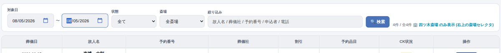

上部の「**対象日**」は、葬儀日・火葬日・式場の利用日・保棺の保管期間の**いずれかが指定した期間に重なる**予約を表示します（葬儀日だけの絞り込みではありません）。

「**状態**」は 全て／未確定／確定済み の3択、「**絞り込み**」は 故人名・葬儀社・予約番号・申込者・電話 での部分一致検索です。

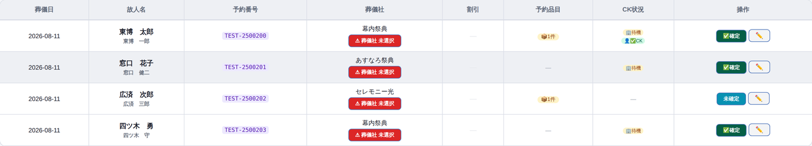

**予約カードに付く印（マーク）の一覧** — 1枚の予約カードには、状態を示す小さな印が最大で7〜8個並びます。全て意味があるので、読み方を覚えると一目で状況が分かります:

| 印 | 意味 |
|---|---|
| 🕊 ◯◯ | 故人名。その下に 🏢 葬儀社名（右に得意先コードの数字） |
| 予約番号（紫の枠） | 予約システムの予約番号。無い予約はグレーで「予約番号なし」と表示されます |
| 🔥 火葬同意済 ／ ⚠ 火葬未同意 | 火葬同意（申込者情報の入力）が済んでいるか。未同意のままなら§3.6で受付QRをご案内します |
| ✅ LINE連携済 ／ 📩 LINE待ち | 喪主様のLINEアカウントが繋がっているか |
| 🔥 火葬のみ ／ ⛩ 告別+火葬 ／ 🕯 通夜+告別 ／ 🙏 法事 | 予約パターン（新予約システムから届いた区分） |
| 📦 ◯品 | 予約品目（火葬料金・式場使用料など）が◯件登録されている印 |
| 🏢 #◯ ◯◯ ／ 👤 #◯ ◯◯ | 葬儀社受付／喪主受付の状態。#◯は受付番号で、状態は「待機中 → 受付済 → お知らせ済 → 完了」の順に進みます |
| ⚠ タイコウ不一致 (◯) | 確定後に予約システム側で内容が変更され、**管理画面の値と食い違っている**印（◯は食い違い項目数）。押すと詳細が開きます（下の⑥参照） |

| ボタン | 説明 |
|---|---|
|  | **未確定** — 押すと確定の確認画面（下）が開きます。確定するとボタンが「✅確定」表示に変わります |
|  | **✅確定** — 確定済みの状態表示（ボタンではありません） |
|  | **⚠ 葬儀社 未選択** — ご予約に葬儀社の得意先コードが入っていない警告。このままだと代理注文・SAP連携で支払先を決められないため、予約の編集（✏️）で葬儀社を設定します |

予約の編集（✏️）を押すと「予約を編集」画面が開きます。

故人名・申込者名・電話番号・メールアドレス・郵便番号・住所・続柄・予約番号・葬儀社の得意先コード（「🔍 葬儀社名から候補を出す」付き）・年齢/享年・葬儀日・火葬日・火葬時間と、割引フラグ（区民葬・献体・減額・公費）をここで修正出来ます:

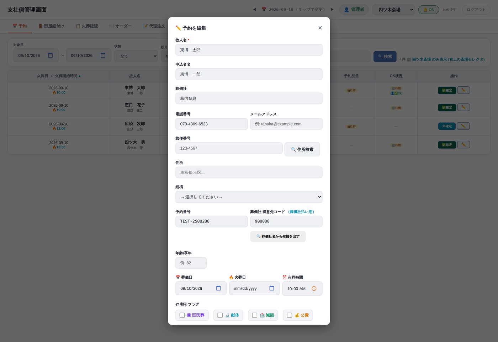

画面を下に送ると「**🏗 施設予約情報（手動入力）**」（予約パターン・炉種別・号炉・時間帯・火葬種別）、「**⚱ 収骨容器（骨壺）選択**」、「**📦 予約品目（火葬種別・式場・骨壺など）**」（SAP品目コードと品名・数量の行を「＋追加」で登録）が続きます。

ここで登録した予約品目が、お客様の「予約カート」や会計時のSAP連携の対象になります:

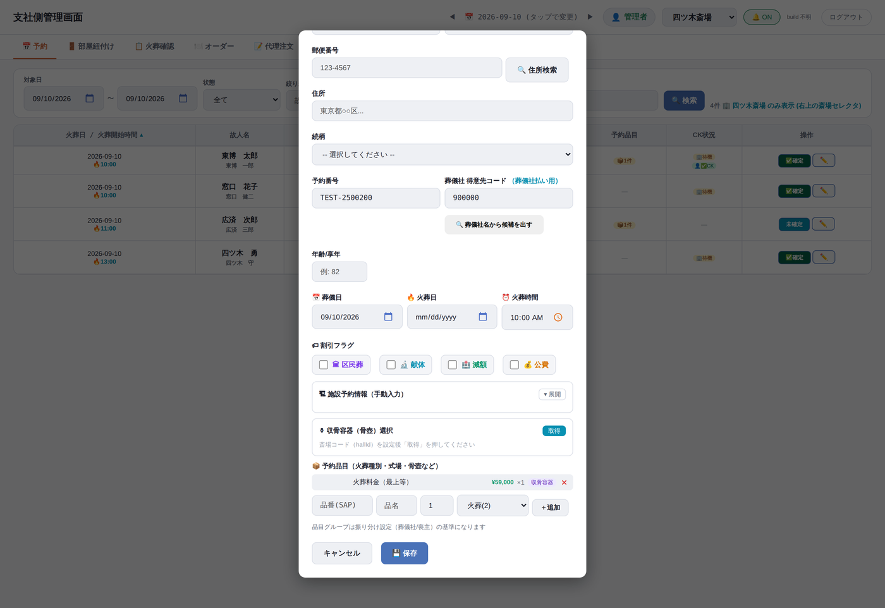

**📦 予約品目リストの行の見方** — 品目の各行には **品番（紫の英数字）・品名・価格・×数量・分類バッジ・✕（行の削除）** が並びます。

分類バッジは 式場／火葬／保棺室／収骨容器／菓子飲料／小物／商品／手数料／その他 のいずれかで、SAP上の品目分類に対応します。

品目が1件も無いときは「品目なし」と表示されます。

**価格が¥0の品目には赤字の価格と「🔄 差替」ボタンが付きます。** 0円のままSAPに送ると請求漏れになるため、正しい価格の商品へ差し替えるための機能です:

| # | 0円品目の差し替え手順 |
|---|---|
| 1 | 赤字「¥0」の行の「🔄 差替」を押す（説明: 同一名で0円以外の商品に差し替え） |
| 2 | 「🔍 検索中...」の後、「🔄 「◯◯」の差し替え候補（◯件）」として**同じ品名で0円以外の商品**の一覧（品番・品名・価格）が開く |
| 3 | 正しい価格の候補をタップ → 「✅ 差替: 旧品名 → 新品名 ¥◯」と表示され、行が置き替わる |
| 4 | 画面下の保存で確定する |

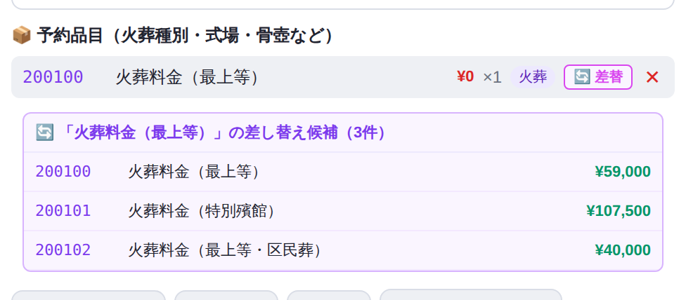

> 候補が見付からない場合は「⚠ 0円以外の同名商品が見つかりませんでした」と表示されます。この場合は品名の表記が商品マスタと違っている可能性があるため、商品マスタ側の品名を確認して下さい。
>
> もう一度「🔄 差替」を押すと候補の表示を閉じられます。

見出しの「**火葬日 / 火葬開始時間**」を押すと並び替え（昇順/降順）が切り替わります。

なお、データ削除用の「🗑 範囲クリア」「🗑️ 本日分クリア」ボタンは、**テストデータの誤削除事故を受けて現在の画面では非表示**になっています（機能自体は残っており、必要な場合はシステム担当が実施します）。

> 支払先の得意先が入っていない予約は、この画面では直さず、予約の連携元と得意先マスタの設定を確認して下さい。

**🔍 一つ一つの操作の詳しい流れ（予約）**

**① 未確定 → 確定** — 予約システムから届いたデータを「この内容で受付・精算に使ってよい」と承認する操作です。

「未確定」ボタンを押すと確定の確認画面が開き、**区民葬・献体・減額・公費の該当**と**支払先の葬儀社（得意先）**を目視で確認してから確定します。

確定するとボタンが「✅確定」の状態表示に変わり、この予約が火葬確認・お会計精算の対象として流れ始めます。確定は取り消しの操作が無い前提で、**内容を確認してから**押して下さい。

また**受付が先に済んでいる予約を後から確定すると受注が二重に作られるケース**が報告されているため、順序（確定→受付）を守って下さい（冒頭の注意参照）。

**② ⚠ 葬儀社 未選択** — 予約に葬儀社の得意先コードが入っていない警告です。このままでも確定は出来ますが、**代理注文の自動確定（葬儀社払い）とSAP連携で支払先を決められず**、後の工程で必ず詰まります。

「✏️ 予約の編集」を開き、「🔍 葬儀社名から候補を出す」で得意先コードを設定してから確定して下さい。

**③ ✏️ 予約の編集** — 氏名・電話・住所などの申込者情報のほか、得意先コード・割引フラグ（区民葬・献体・減額・公費）・葬儀日・火葬日・火葬時間を修正出来ます。

画面下部の「🏗 施設予約情報（手動入力）」（予約パターン・炉種別・号炉・時間帯・火葬種別）、「⚱ 収骨容器（骨壺）選択」、「📦 予約品目」（SAP品目コード・品名・数量を「＋追加」で登録）まで一続きの画面です。

**ここで登録した予約品目が、お客様の「予約カート」と会計時のSAP連携の対象**になるため、火葬料金・式場使用料など最初から決まっている品目はここで揃えておきます。保存すると即時に反映されます。

**③-2 実施済みのご予約は「参照モード」になります** — 受付やお支払いが進んだ（実施済みの）予約の編集画面は、**金額とSAP受注の突き合わせに影響する項目がロック**された参照モードで開きます。

ロックされるのは 割引フラグ（区民葬・献体・減額・公費）・予約品目・葬儀社（得意先コード）・予約番号・葬儀日・火葬日・火葬時刻・施設予約枠（火葬炉枠・式場枠・骨壺・保管枠）・斎場・故人名 です — これらを実施後に書き換えると、確定済みのSAP受注と突き合わせが出来なくなるためです。

一方、**電話番号・住所・メールアドレス・申込者名など金額に影響しない事務項目**は、「**📇 事務項目だけ保存**」ボタンで実施済みでも更新出来ます（「事務項目（連絡先など）を保存しました」）。

ロック項目を含めて保存しようとすると「実施済のため参照のみです。連絡先など事務項目は「📇 事務項目だけ保存」から更新してください」または「以下は実施済のため保存されません: ◯◯」と案内されます。

実施済みの金額側の修正が必要な場合は、管理者経由でシステム担当へ連絡して下さい。

実施済みの予約を開くと、編集画面の上部に次の案内が表示されます。保存出来ない項目の一覧と、「📇 事務項目だけ保存」で保存出来る項目が、その場で確認出来ます:

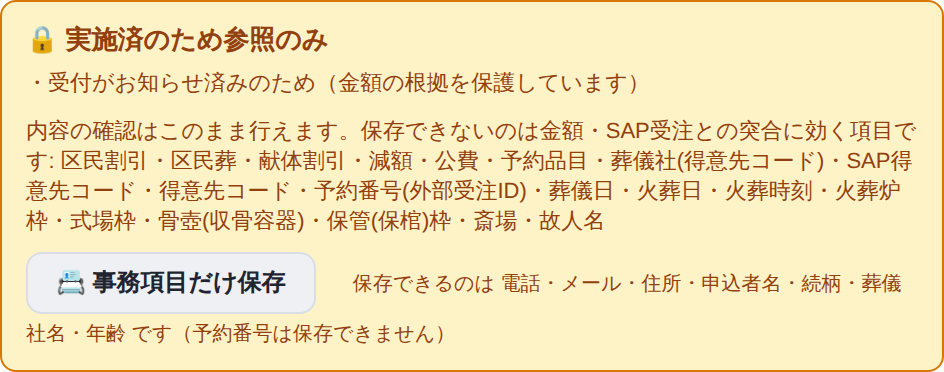

**④ 絞り込みと並び替え** — 「対象日」（葬儀日・火葬日・式場利用日・保管期間のいずれかが重なる期間）と「状態」（全て／未確定／確定済み）、キーワード検索（故人名・葬儀社・予約番号・申込者・電話）で一覧を絞り込みます。

朝一番に状態を「未確定」にして、当日分を順に確定していく使い方が基本です。見出しの「火葬日 / 火葬開始時間」を押すと並び替え（昇順/降順）が切り替わります。

**⑤ 🗑 範囲クリア／🗑️ 本日分クリア（現在は非表示）** — テストデータ整理用の**削除操作**で、過去に誤操作でテストデータ61件が消えた事故があったため、**現在の画面ではどちらのボタンも非表示**になっています。

実行する場合（システム担当）は、本日分クリアで「⚠️ 全斎場分の本日予約データをすべて削除します。この操作は取り消せません。本当に実行しますか？」→「もう一度ご確認ください。本日付の予約が全て (全斎場分) 削除されます。」の**二段階の確認**を経る仕組みです。

通常運用では使いません。

**⑥ ⚠ タイコウ不一致（予約システム側の変更との食い違い）** — 確定済みの予約は、後から予約システム側でデータが変わっても**自動では上書きされません**（確定した金額の根拠が勝手に変わるのを防ぐロック）。

その代わり、食い違いが起きたことがカードの「⚠ タイコウ不一致 (◯)」の印で知らされます。

印を押すと詳細画面が開き、**衝突時刻・理由**（⛔ 確定済みロック／🔒 フィールドロック）と、**フィールドごとの「現在値（管理画面）」と「タイコウ値（受信）」の対照表**が表示されます。

どちらが正しいかを確認のうえ、予約システム側の値を採用する場合は「**📋 タイコウ値で編集モーダルを開く**」を押すと、受信した値が入った状態で予約の編集画面が開くので、内容を確認して保存します（**押しただけでは保存されません** — 編集画面で保存して初めて反映されます）。

**⑧ 予約の新規作成・リスト読込（現在は非表示）** — 予約をこの画面から直接作る「新規予約」、CSV・Excelから一括登録する「📥 予約リスト読込」、CSV出力・時間補完の各機能は、**日次運用で使わないため現在の画面からは撤去（非表示）**されています。

機能自体は残っており、必要な場合はシステム担当が実施します。

正規の予約は必ず新予約システム側で登録して下さい — この画面から臨時に作成した予約は予約システム側には反映されません。

**🔬 さらに深く（予約 — 裏側の動きと例外）**

| 要素 | 裏で起きていること | 例外・注意 |
|---|---|---|
| 予約が届く | 新予約システム → 中間サーバー → 窓口の経路で届きます。登録から表示まで**10〜15分程度**の時間差が出ることがあります | 送信失敗時の通知・再送の取り決めは調整中です（§6.4）。届かない時は時間を置き、それでも来なければ管理者経由で確認します |
| 「確定」する | 受付・精算に使う情報が固まり、以降は**予約システム側の変更が自動では反映されなくなります**（確定した金額の根拠を守るためのロック）。予約品目の初期カート構築もこの流れで行われます | 確定後に予約システム側で変わった内容は「⚠ タイコウ不一致」の印で知らされ、取り込みは手動です（⑥）。初期カート構築が済んでいないと「⚠ 予約カート未構築」の警告が出ます |
| 割引フラグを付けて保存する | 区分（区民葬・献体・減額・公費）が予約に記録されます。**金額の計算はSAP側**で、カートへの反映（品目の再投入）が済んで初めて金額に効きます | 品目を入れた後に区分を変えた場合は再投入が必要です（§3.7「割引と業者キャッシュバック」） |
| 予約品目を登録する | ここで登録した品目が、お客様の「予約カート」表示と会計時のSAP連携の元データになります | 0円のまま登録するとSAPに0円で請求されます — 赤字表示と「🔄 差替」で必ず正しい価格に直します |
| 実施済みの予約を開く | 金額・SAP突合に効く項目がロックされた**参照モード**で開きます | 連絡先などの事務項目だけは「📇 事務項目だけ保存」で更新出来ます（③-2） |

### 3.6 📋 火葬確認（当日の予約一覧の確認）

**出来ること:** 本日の火葬予約が**火葬開始時間順**に一覧表示され、当日の全体像（件数・時間帯・葬儀社・喪家・お部屋）を掴めます。

一覧は **葬儀業者名／火葬開始時間／喪家名／式場名・休憩室名／炉の種別／保管日数／火葬同意／LINE申込紐付け／操作** の9列です。

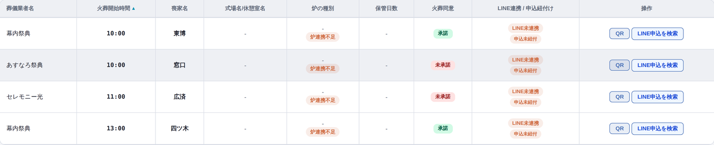

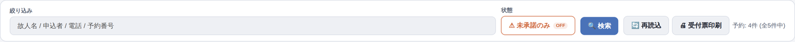

> **「火葬同意」「LINE申込紐付け」の列と、受付QR・受付票・LINE申込の検索に関するボタンは使用しません。** これらはお客様がLINEで火葬同意を入力する仕組みのための表示です。
>
> 同意のお手続きは紙の様式で行い、受付の操作は「💳 お会計精算」で行います（§3.7）。

| ボタン・表示 | 説明 |
|---|---|
|  | **🔍 検索** — 故人名・申込者・電話・**予約番号**で絞り込み |
| 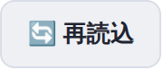 | **再読込** — 一覧を最新化 |

絞り込みに「東博」と入力した状態:

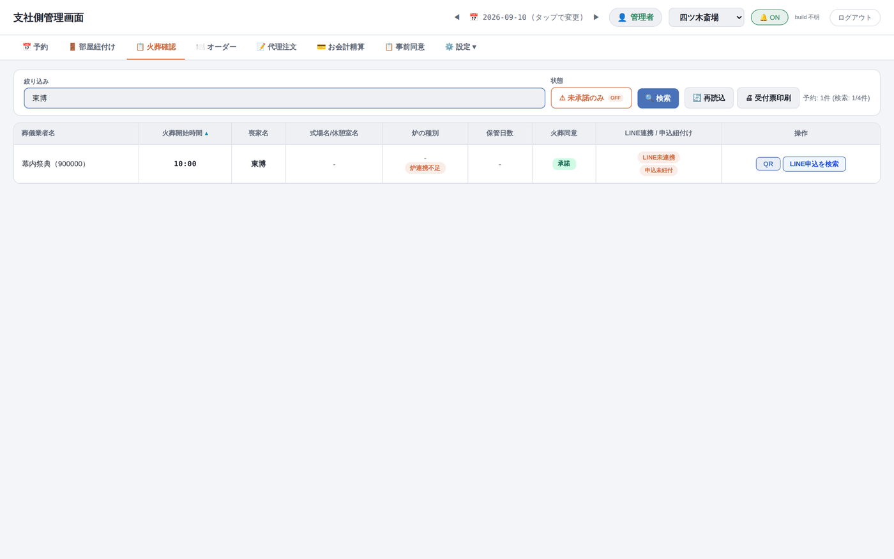

**🔍 一つ一つの操作の詳しい流れ（火葬確認）**

**① 🔍 検索** — 故人名・申込者・電話・予約番号での絞り込みです。

ひらがな・カタカナはどちらでも一致します。

**② 再読込** — 他の端末での受付の進みを含めて、一覧を最新の状態にします。

炉前対応の直前には、一度再読込してから状況を確認して下さい。

> 件数表示は「予約: 4件」のように**選択中の斎場の件数だけ**が表示されます（検索中は「(検索: 2/4件)」のように絞り込み後/絞り込み前の件数）。件数が合わない時は右上の斎場を確認して下さい。

### 3.7 💳 お会計精算（会計・精算）

**出来ること:** お支払い者ごとの会計を「**会計待ち → 会計完了**」で管理します。割引の適用、SAPへの登録、自動精算機用の**精算QR**の発行、領収書の分割までここで行います。

画面上部には自動精算機が途中で止まった時のための「**精算ロック管理**」があります。

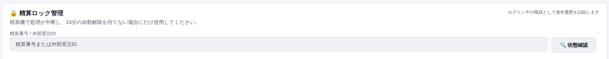

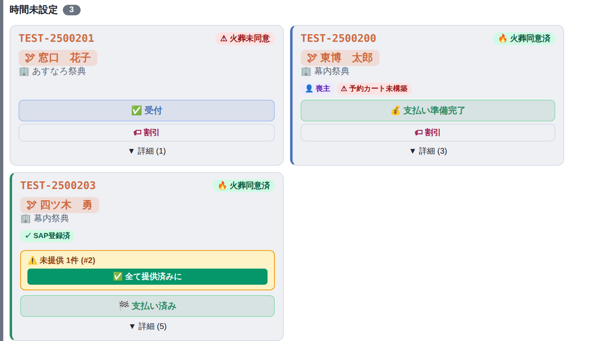

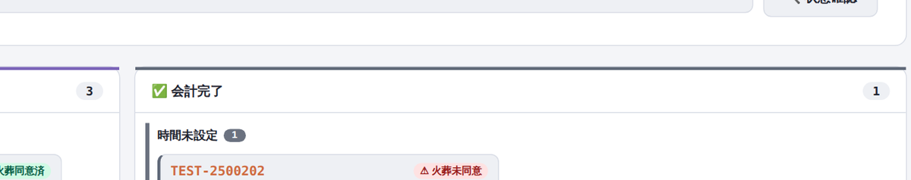

**会計カードの表示の見方（詳しく）**

カードには喪家名・葬儀社名のほかに、状態を示す小さな印（ピル）が並びます: **LINE連携**の有無／受付の組（🏢 葬儀社・👤 喪主）／適用中の**割引**（区民葬・献体・減額・公費）／**SAP状態**（✓登録済・⚡一部登録済・⚠失敗 など）。

喪主の行には、喪主様のLINE連携の状態が表示されます。「✅ LINE連携済」なら対応不要、「QR待ち」の間は紫の「🖨 紙で受付」ボタンが出ます（LINEをお使いでない場合の受付方法。①-2参照）:

「💰 支払い準備完了」の後は、カード内に「**支払先ごとの受注（未払いの受注だけ精算QRを出せます）**」の枠が現れます。

SAP受注が**支払者ごとに1行ずつ**（支払者・受注番号・支払い状況）並び、それぞれの行から個別に操作出来ます:

| 行の表示・ボタン | 意味 |
|---|---|
| ⏳ 未払い ／ － 精算状況は未確認 | まだお支払いが確認出来ていない受注。「**🏧 この受注の精算QR**」でこの受注だけのQRを発行出来ます |
| ✅ 支払済み | 精算機でのお支払いが確認済み。QRのボタンは消えます |
| 🧾 売掛のため精算不要（請求書でご請求） | 売掛の受注。精算機の対象外で、月次のご請求書で回収します |
| 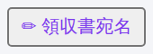 | **✏ 領収書宛名** — **お支払い前に限り**、この受注の領収書の宛名を窓口で変更出来ます（支払い済み・売掛の受注では表示されません。支払い後の宛名変更は中間システムの領収書画面から再発行になります）。 宛名には文字数の上限があり、超えると「宛名は◯文字までです」で止まります。 同じ宛名のまま保存すると「宛名は変更されていません」、既に領収書が発行済みの受注では「この受注の領収書は発行済みです。宛名の変更は領収書画面から「再発行」で行ってください。」と案内されます |

| ボタン・表示 | 説明 |
|---|---|
|  | **✅ 受付する** — 来場受付。カードが会計待ちに並びます |
|  | **💰 支払い準備完了にする** — 押すと下の「**支払い内訳確認**」画面が開き、内訳を確認して「💰 支払いお知らせを送信」で確定します。確定するとSAPに受注登録され、「▼ 詳細」の中に**精算QR発行**ボタンが現れます |
|  | **🏷 割引** — 区民葬・献体・減額・公費の割引を適用（下の「割引設定」画面。葬儀社ごとの対応可否と連動） |
|  | **全て提供済みに** — 未提供の注文が残っている警告が出たとき、まとめて提供済みにする |
|  | **🏁 会計完了にする** — お支払い確認後に押す。会計完了の列へ移ります |
|  | **▼ 詳細** — 補助ボタンを開きます（下の「詳細の中にあるボタン」参照） |
| 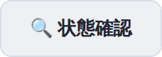 | **🔍 状態確認** — 「**外部受注ID（予約番号など）＋得意先コード**」の2つを入れてロック状態を確認します（両方必要です）。操作者名が記録されます |
|  / 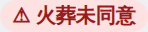 | 火葬同意の状況（「📋 火葬確認」と連動） |

**💰 支払い内訳確認（支払い準備完了の前に必ず開く確認画面）**

「💰 支払い準備完了にする」を押すと、確定前に「**支払い内訳確認**」画面が開きます。内訳が正しければ「**💰 支払いお知らせを送信**」で確定します（SAPに受注登録され、受注番号が発行されます）。

振り分けを直したい場合は「**🏷 振り分けを変更**」からやり直せます:

**画面の読み方（上から順に）** — この画面は「これからSAPに登録する金額」を最終確認する場所です。1行ずつ意味があります:

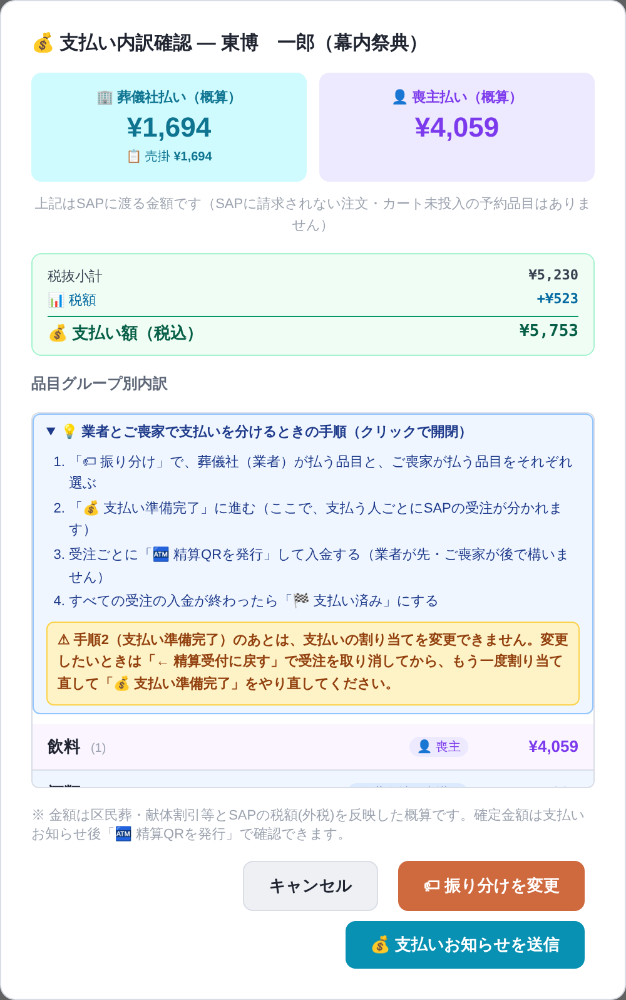

| 表示 | 意味 |
|---|---|
| タイトル行 | 「💰 支払い内訳確認 — ◯◯（◯◯）」＝申込者名と（葬儀社名）。**別の方の画面を開いていないか**をまずここで確認します。開いた直後は「集計中...」と表示されます |
| 葬儀社側カード | 「🏢 葬儀社払い（概算）」＝葬儀社が支払う金額。下に「💴 現金 ¥◯」「📋 売掛 ¥◯」の**内訳**が付きます（両方あれば並びます）。売掛のみなら精算QRの対象はありません |
| 喪主側カード | 「👤 喪主払い（概算）」＝喪主様が支払う金額。振り分けで「💰 直売（ワンタイム）」にした品目も、その場で現金精算のため**この欄に合算**されます |
| 断言の一文 | 「上記はSAPに渡る金額です（SAPに請求されない注文・カート未投入の予約品目はありません）」— **この一文が出ていれば安心して進めます**。表示額とSAPに登録される額が一致することを検証できた時だけ表示されます |
| 合計欄 | 税抜小計 → 税額 → 💰 支払い額（税込）。税額をSAPから取得できた場合は**税込**で表示されます。1品目でも税額が取れないと「⚠️ SAPカートから税額を取得できなかった品目があるため**税抜**で表示しています。」に変わります |
| 品目グループ別内訳 | 品目の分類ごとに、支払者バッジ（👤 喪主／🏢 葬儀社 等）と金額が1行ずつ並びます。同じ分類の中で支払先が割れている場合は「⚠ 混在」バッジが付きます |
| 分ける手順のガイド | 「💡 業者とご喪家で支払いを分けるときの手順」（クリックで開閉）。※ガイド内の「🏁 支払い済み」は現在のボタン名「🏁 会計完了にする」の旧い呼び方です（画面文言の改修待ち） |
| 下部の注記 | 「※ 金額は区民葬・献体割引等とSAPの税額(外税)を反映した概算です。確定金額は支払いお知らせ後「🏧 精算QRを発行」で確認できます。」—「概算」は**割引と外税を反映した見積り**という意味で、確定額は受注登録後の精算QR画面が正になります |

**「SAPに渡らないお金」は合計から除外して表示されます** — 以前は、SAP送信に失敗した注文の金額も合算して表示していたため、実際にSAPへ渡った金額より大きい金額をお客様へ案内できてしまう事例がありました。

現在は**SAPに請求されない金額を合計から除外**し、次の赤い表示で別枠として知らせます:

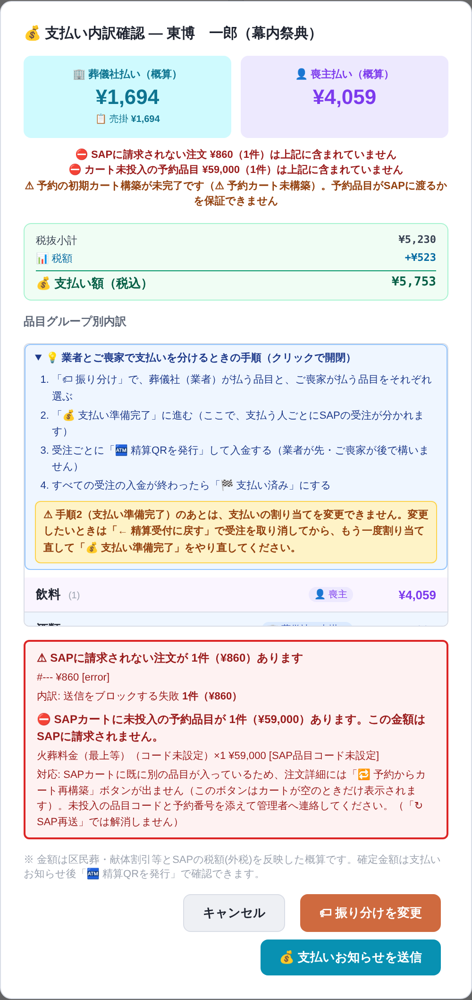

- 「⛔ SAPに請求されない注文 ¥◯（◯件）は上記に含まれていません」＋下部の赤枠「⚠ SAPに請求されない注文が ◯件（¥◯）あります」— SAP送信に失敗したままの注文です。**この金額はお客様に請求されません**。

    「↻ SAP再送」等で解消してから進めます。

- 「⛔ カート未投入の予約品目 ¥◯（◯件）は上記に含まれていません」— ご予約の品目（火葬料金など）がSAPカートに入っていません。赤枠内に品目名と対応方法が表示されるので、その案内に従います（**「↻ SAP再送」では解消しません**）。
- 「⚠ 予約の初期カート構築が未完了です（⚠ 予約カート未構築）。予約品目がSAPに渡るかを保証できません」— 予約確定時のカート作成が済んでいない状態です。管理者へ連絡して下さい。
- 「⚠ SAPカートを取得できなかったため、予約品目がSAPに渡るかを検証できていません（この金額はSAP実績と一致しない可能性があります）」— 通信の一時的な不調でも出ます。閉じて開き直し、繰り返す場合は管理者へ。

> 送信後に「支払いお知らせを送信しましたが、SAPに請求されない注文が◯件あります」と警告が出た場合、その金額はSAPに請求されていません。「↻ SAP再送」で解消して下さい。

**支払い内訳確認・精算QR発行で出る主な警告と対処**

| 警告の表示 | 意味と対処 |
|---|---|
| ⚠️ 未提供の注文が ◯件 あります | 提供が済んでいない注文が残っています。「全て提供済みに」でまとめて提供済みにしてから進めます |
| ⚠️ 支払先が未設定の分類が ◯件 あります | 品目の振り分けが済んでいません。「🏷 振り分けを変更」で支払先を割り当ててから確定します |
| ⚠️ 品目振り分けが未設定です | 同上。SAP側に既に支払割当があるカートでは、未設定のままだと登録に失敗します |
| ⛔ カート未投入（予約品目がカートに入っていない） | ご予約分の品目がSAPカートに入っていません。案内に従いカートを作り直してから送信します（「↻ SAP再送」では解消しません） |
| ⛔ SAPに請求されない注文が ◯件（¥◯）あります | SAP送信に失敗したままの注文で、**合計から除外**されています。「↻ SAP再送」等で解消してから進めます |
| ⚠ 予約の初期カート構築が未完了です（⚠ 予約カート未構築） | 予約確定時のカート作成が済んでいません。管理者へ連絡します |
| ⚠️ 税込金額を確定できないため精算QRを発行できません | 「🔄 SAPと照合」で金額を確定させてから発行します |
| ⚠️ 表示額と精算機の請求額が一致しないため、精算QRを発行できません | 画面とSAPの金額がずれています。「🔄 SAPと照合」で突き合わせます |
| ⚠️ 応答待ちがタイムアウトしました | 処理は続いている可能性があります。**再送信せず**、注文一覧で状態を確認します |

カードに未提供の注文が残っている時の表示です。黄色い枠の「✅ 全て提供済みに」で、まとめて提供済みへ進められます:

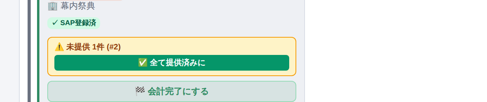

**カードに常に出ているその他のボタン**

| ボタン | 説明 |
|---|---|
| 🏷 振り分け | 葬儀社のお支払いのとき、品目ごとにどなたのお支払いにするかを割り当てます（未設定のときは「🏷 振り分け（未設定）」と太字で表示されます）。品目に「未設定」と付いたまま送信すると**葬儀社払いとして扱われます**。 割り当てたら必ず「**💾 振り分けを保存**」を押して下さい（未保存のときは「✏️ 未保存の変更があります」と表示され、保存すると「✅ 振り分けを保存しました」と出ます） |
| 📋 注文詳細 | この方の注文明細と支払先の振り分け状況を確認します |

**「🏁 会計完了にする」が押せないとき（金額の照合が必要な状態）**

| 表示 | 意味・対応 |
|---|---|
| ⚠ 金額照合待ち | SAPの受注金額と割引条件の確認が必要です。**再送・精算はせず**、「🔄 SAPと照合」で金額を突き合わせてから進めます |
| ⚠ SAP照合待ち | SAP連携が完了していない状態です。「↻ SAP再送」等で解消してから進めます |

**支払い準備完了の後にカードへ出るSAPの状態表示**

| 表示 | 意味・対応 |
|---|---|
| ✓ SAP登録済 | 受注が発行済み。精算QRを発行出来ます |
| ⚡ 一部登録済 | 支払者のグループの一部だけ登録済み。「📋 注文詳細」で残りを確認 |
| ⚠ SAP失敗 | 登録に失敗。内容を確認して「↻ SAP再送」 |
| ⚠ SAP到達不明／⚠ SAP状態不明 | 送信が届いたか確認出来ない状態。**そのまま再送すると二重投入になる恐れ**があるため、先に「📋 注文詳細」でカートの内容を確認して下さい |
| ⏳ SAP処理中 | 処理中。しばらく待って画面を更新 |
| 📭 注文なし | SAPに送る注文がありません |
| ⚠ 予約カート未構築 | ご予約分の品目がSAPのカートに入っていない状態。「↻ SAP再送」で作り直します |

**「▼ 詳細」の中にあるボタン**

| ボタン | 出るタイミング |
|---|---|
| 🏧 精算QR発行 | 「💰 支払い準備完了」でSAP登録が成功した後。**自動精算機ご利用票**（QR付き）を表示・印刷出来ます |
| 📩 支払いQRを再送 | LINE連携のあるお客様向けの再送ボタンです（使用しない運用では押しません） |
| 🧾 支払確認 | 同上。精算機での支払い状況を確認します |
| 🧾 領収書分割（受注分割へ） | 領収書を分けたいときの案内を開きます（**分割そのものはこの画面では行いません**。下記参照） |
| 🔄 SAPと照合 | SAPの受注金額と画面の金額を突き合わせます |
| ↻ SAP再送 | SAP連携をやり直すとき |
| ← 精算未受付に戻す／← 会計待ちに戻す | 1つ前の状態へ戻します（誤操作の取り消し） |
| 🗑 完全削除 | 受付そのものを削除するとき（取り扱い注意） |

「🏷 振り分け」を押すと「**品目振り分け**」画面が開きます。

品目グループごとに支払先を割り当てるほか、上部の一括ボタン「**全て👤 喪主**」「**全て🏢 葬儀社（現金）**」「**全て🏢 葬儀社（売掛）**」で全品目を一度に振り分けられます。

「未設定」のまま送信すると葬儀社払い〈現金〉扱いです。割り当てたら「**✅ 振り分けを確定**」を押します:

| ボタン | 説明 |
|---|---|
|  | 全品目を喪主様のお支払いに一括変更 |
|  | 振り分けの確定（保存） |

「🏧 精算QRを発行」を押すと「精算QR」画面が開きます。

税込金額が確定している受注は緑色で金額（例: ¥3,080〈税込〉・内訳の税抜と税額つき）とQRコードが表示され、「精算QRを発行（税込 ¥3,080）」で確定します:

税込金額を確定出来ない受注では黄色の警告「⚠️ 税込金額を確定できないため精算QRを発行できません」が表示され、発行ボタンが押せません。先に「🔄 SAPと照合」で金額を確定させます:

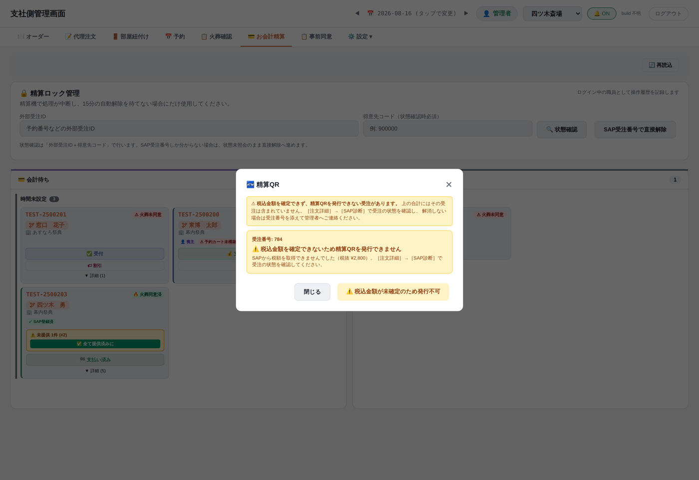

> **売掛（請求書でのご請求）の受注は自動精算機ではお支払いいただけません。** カードに「🧾 売掛のため精算不要（請求書でご請求）」と表示された分は、精算QRを発行せず月次のご請求書で回収します。
>
> 画面には「この受注は売掛です。自動精算機ではお支払いいただけません（月次のご請求書で回収します）。」とも表示されます。

**💴 支払いを分けたいとき（葬儀社が先払い・ご喪家が後払い など）**

葬儀社が飲食代以外を先に支払い、あとから来場したご喪家が残りを支払う運用は、次の手順で行います（画面にも同じ手順が案内として表示されます）:

| # | 支払いを分ける手順 |
|---|---|
| 1 | 「🏷 振り分け」で、葬儀社（業者）が払う品目と、ご喪家が払う品目をそれぞれ選ぶ |
| 2 | 「💰 支払い準備完了」に進む（ここで、支払う人ごとにSAPの受注が分かれます） |
| 3 | 受注ごとに「🏧 精算QRを発行」して入金する（業者が先・ご喪家が後で構いません） |
| 4 | すべての受注の入金が終わったら「🏁 支払い済み」にする |

> 受注が確定した後は振り分けの変更ボタンは押せなくなり、理由がボタンの隣に表示されます。振り分けを直したい場合は先に受注を戻す操作が必要です。
>
> ※ 手順4の「🏁 支払い済み」は、現在のボタン名「**🏁 会計完了にする**」の旧い呼び方です（画面の案内文が旧名称のまま残っています。押すボタンは同じです）。

**🧾 領収書を分けたいとき**

領収書の分割は、**この画面では行いません**。

「🧾 領収書分割（受注分割へ）」を開くと「**領収書の分割は「受注分割やり直し」で行います／領収書を分けたい場合は、受注そのものを分けてください。**」と案内が出て、対象のSAP受注番号と「🔀 受注分割やり直し画面を開く」ボタンが表示されます。

すでに分割済みの場合は「🗑 分割を解除して領収書1枚に戻す」で元に戻せます（受注分割やり直し画面のURLは「⚙️ 初期設定」で登録します）:

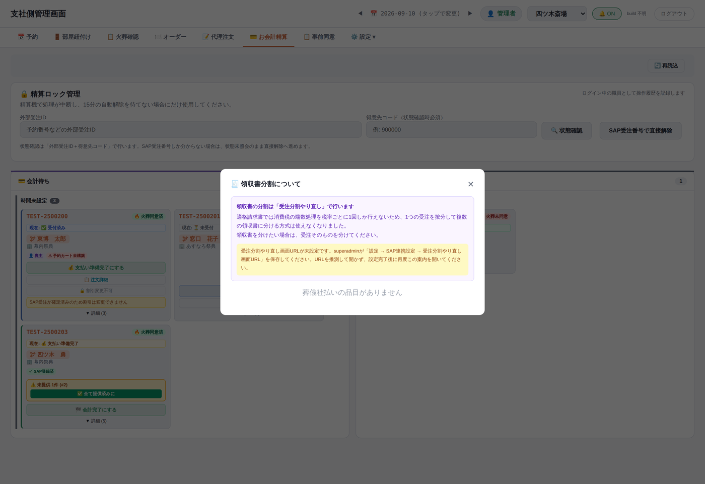

**🏧 精算QRと自動精算機ご利用票**

精算QRの発行後、「🖨️ 印刷」で《**自動精算機ご利用票**》（A4縦1枚）を印刷出来ます。

喪家名・取扱い葬儀社名・お支払金額（税込）とQRコードが印字され、「**こちらのQRコードを自動精算機の読み取り部にかざしてください。**」の案内が入ります。

あわせて注意事項（「内容をご確認のうえお支払いください」「ご収骨開始前にご精算をお願いいたします（式場のご利用者様はご帰宅前にご精算をお願いいたします）」「精算後は本紙を破棄してください」）も印字されます:

割引の画面は「**割引設定**」という名前で開きます（現在の割引と選択肢が表示され、この葬儀社に使える割引が無い場合は「割引種別が見つかりません」と表示されます。「🚫 割引なし（解除）」で適用済みの割引を外せます）:

「▼ 詳細」を開いた状態（明細・領収書分割などへ進めます）:

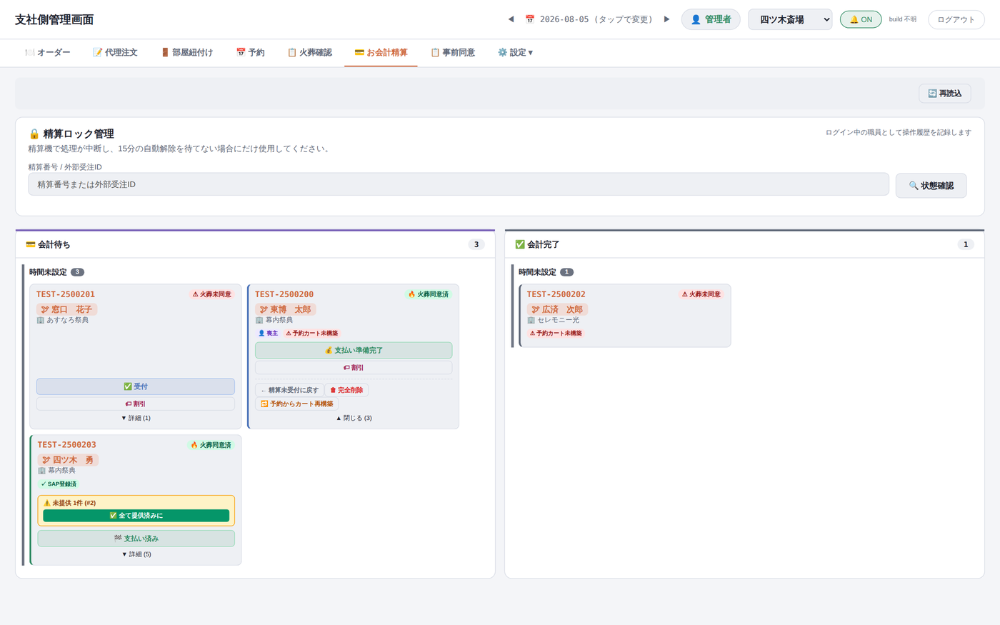

| # | 精算QR発行までの手順 |
|---|---|
| 1 | 会計待ちのカードで「✅ 受付する」→「💰 支払い準備完了にする」を押す |
| 2 | 「支払い内訳確認」画面で内訳・警告を確認し「💰 支払いお知らせを送信」（SAPに登録される。最大45秒） |
| 3 | 登録が成功したら「▼ 詳細」を開く →「🏧 精算QRを発行」を押す |
| 4 | 金額を確認してQRを表示 → お客様が自動精算機で読み取ってお支払い |
| 5 | 支払い確認後「🏁 会計完了にする」を押す |

**会計カードの進み方（受付〜支払いまで）**

| 今の状態 | 大きいボタン | 補助（常時） | 「▼ 詳細」の中 |
|---|---|---|---|
| 受付前（会計待ち列） | ✅ 受付する | 🏷 割引（葬儀社受付では 🏷 振り分け・📋 注文詳細 も） | 🗑 完全削除 |
| 受付済み | 💰 支払い準備完了にする（→ 支払い内訳確認 → 💰 支払いお知らせを送信） | 🏷 割引・🏷 振り分け・📋 注文詳細 | ← 精算受付に戻す・🗑 完全削除 |
| 支払い準備完了後 | 🏁 会計完了にする（※「⚠ 金額照合待ち」「⚠ SAP照合待ち」の間は押せません） | — | 🏧 精算QRを発行・📩 支払いQRを再送・🧾 支払確認・🧾 領収書分割（受注分割へ）・🔄 SAPと照合・↻ SAP再送・← 会計待ちに戻す |
| 会計完了（会計完了列） | — | — | ← 会計待ちに戻す 等（誤操作の取り消し）。精算処理の進行中は「🔒 精算未受付に戻せません」と表示され戻せません |

**🔍 一つ一つの操作の詳しい流れ（お会計精算）**

**① ✅ 受付する** — ご来場を受け付けて、この方の会計を「会計待ち」の列に載せる操作です。押す前にカードの喪家名・葬儀社名・火葬同意バッジ（承諾/未承諾）を確認します。

押すとカードが会計待ちに並び、以降の割引・振り分け・精算の起点になります。

誤って受付した場合は「▼ 詳細」の「← 精算未受付に戻す」で戻せます（**「💰 支払い準備完了」を押す前まで**）。

**①-2 🖨 紙で受付（喪主がLINEを使えない時）** — カードの喪主の行（👤）には、喪主様のLINE連携の状態が「✅ LINE連携済」または「QR待ち」で表示されます。

**「QR待ち」のまま（＝喪主様がQRを読み取れない・LINEをお使いでない）場合は、紫の「🖨 紙で受付」ボタン**が出ます。

押すと「喪主を紙で受付します。（LINEなし）続けますか？」の確認が出て、OKすると**LINEなしで喪主様の受付が完了**し、以降の会計（振り分け・精算QR・ご利用票の紙渡し）を通常どおり進められます。

LINEに紐付かないため、この方への通知は届きません — お声がけと紙のご利用票でご案内下さい。

**② 🏷 振り分け（品目振り分け）** — 「どの品目を誰が支払うか」を決める操作で、**「💰 支払い準備完了」より前に済ませておくのが原則**です。

開いた画面で品目グループごとに支払先（葬儀社〈現金〉・葬儀社〈売掛〉・喪主・**💰 直売**）を割り当てます。

「💰 直売」を選んだグループには**直売得意先コード（数字6〜10桁）の入力欄**が開き、未入力のままだと画面下の集計に「⚠ 直売得意先コード未入力◯件」と表示されて確定出来ません。

売掛が使えない葬儀社では「🏢 葬儀社（売掛）」の選択肢自体が表示されません。

画面下の集計（👤 喪主 ¥◯ / 🏢 現金 ¥◯ / 🏢 売掛 ¥◯ / 💰 直売 ¥◯）で金額の割れ方を確認してから確定します。

全品目が同じ支払先なら上部の一括ボタン（「全て👤 喪主」「全て🏢 葬儀社（現金）」「全て🏢 葬儀社（売掛）」）が最速です。

割り当てたら必ず「✅ 振り分けを確定」（画面によっては「💾 振り分けを保存」）を押して下さい — 未保存の間は「✏️ 未保存の変更があります」と表示され、保存すると「✅ 振り分けを保存しました」と出ます。

「未設定」のまま送信すると**葬儀社払い〈現金〉として扱われ**、SAP側に既に支払割当があるカートでは登録に失敗します。

**受注が確定した後は振り分けの変更は出来ません**（ボタンが押せなくなり理由が隣に表示されます）。

**③ 🏷 割引（割引設定）** — 区民葬・献体・減額・公費の割引を適用する操作です。開くと現在の割引と選べる選択肢が表示されます。

選択肢は**葬儀社（得意先）ごとの対応可否と連動**しており、使える割引が無い葬儀社では「割引種別が見つかりません」と表示されます。

適用済みの割引を外す時は「🚫 割引なし（解除）」を押します。割引は金額の根拠になるため、**支払い準備完了の前に**確定させて下さい。

割引額の決まり方・確定後の内訳の読み方・キャッシュバックとの違いは、この節の下の「**🏷 割引と業者キャッシュバック（詳しく）**」にまとめています。

**④ 💰 支払い準備完了にする（支払い内訳確認 → 💰 支払いお知らせを送信）** — 会計の中心となる操作です。

押すと確定前に「**支払い内訳確認**」画面が開き、葬儀社払い（現金）と喪主支払い（現金）の金額・合計（税抜）・品目グループ内訳・警告が表示されます。

ここで金額が想定どおりかを必ず確認し（警告が出ている場合は下の警告一覧表に従って先に解消）、「**💰 支払いお知らせを送信**」で確定します。

確定した瞬間に、(1) **SAPに支払者ごとの受注番号が発行**され、(2) カードの大きいボタンが「🏁 会計完了にする」に変わって「▼ 詳細」の中に精算系のボタンが現れます。

内訳が違っていた場合は「🏷 振り分けを変更」からやり直せます（送信前まで）。

**⑤ 🏧 精算QRを発行** — お客様が自動精算機でお支払いになるためのQRを画面に出す操作です（「▼ 詳細」の中・SAP登録成功後に表示）。

税込金額が確定している受注は緑色で金額とQRが表示され、「精算QRを発行（税込 ¥◯◯）」で確定します。

税込金額を確定出来ない受注では黄色の警告が出て発行出来ません（先に「🔄 SAPと照合」）。発行後は「🖨️ 印刷」で《自動精算機ご利用票》（A4・QRとお支払金額入り）を印刷してお渡し出来ます。

**売掛の受注はここには出ません**（自動精算機の対象外・月次のご請求書で回収）。

**⑥ 📩 支払いQRを再送** — LINE連携のあるお客様へ精算QRを送り直すための操作です。

**使用しない運用では押しません** — 精算QRのご案内は「🏧 精算QRを発行」→「🖨️ 印刷」の紙のご利用票で行います。

**⑦ 🧾 支払確認** — 自動精算機でのお支払いが済んだかどうかをその場で照会する操作です。精算機からの入金の連絡は通常自動で届きますが、「お客様は払ったと仰っているのに画面が変わらない」時に手動で確認出来ます。

**⑧ 🏁 会計完了にする** — お支払いの確認が取れた後に押す締めの操作です。押すとカードが「会計完了」列へ移り、この方の会計が締まります。

「⚠ 金額照合待ち」「⚠ SAP照合待ち」が表示されている間は押せません — 先に「🔄 SAPと照合」等で解消します。

押した後に誤りに気付いた場合は「← 会計待ちに戻す」で戻せますが、精算処理の進行中は「🔒 精算未受付に戻せません」と表示されます。

**⑨ 🔄 SAPと照合／↻ SAP再送** — 「🔄 SAPと照合」は、画面の金額とSAPの受注金額・割引条件を突き合わせて食い違いを解消する操作です（⚠金額照合待ち・⚠SAP照合待ち・精算QRの金額不一致の時に使います）。

「↻ SAP再送」はSAP連携をやり直す操作で、**「⚠ SAP到達不明」の状態では先に「📋 注文詳細」でカートの内容を確認してから**再送して下さい（そのまま再送すると二重投入の恐れがあります）。

SAP照合の結果入力は管理者（superadmin）の権限が必要です — スタッフの画面では案内が表示されるので管理者へ連絡して下さい（§5）。

**⑩ 🧾 領収書分割（受注分割へ）** — 領収書を分けたい時の**案内**を開くボタンで、分割そのものはこの画面では行いません。

開くと対象のSAP受注番号と「🔀 受注分割やり直し画面を開く」ボタンが表示され、分割は外部の受注分割やり直し画面で行います。

既に分割済みの場合のみ「🗑 分割を解除して領収書1枚に戻す」で画面から戻せます。分割やり直し画面のURLが未登録の場合は管理者に「⚙️ 初期設定 → SAP連携設定」での登録を依頼して下さい。

**⑪ 🔒 精算ロック管理** — 自動精算機が処理の途中で止まった時の非常用の操作です。**15分経てば自動解除される**ため、通常は待つだけで構いません。

急ぐ場合のみ、「外部受注ID（予約番号など）」と「得意先コード」の2つを入れて「🔍 状態確認」→ 解除対象・理由・斎場コードを選んで「🔓 ロック解除」の順で使います。

SAP受注番号しか分からない時の「SAP受注番号で直接解除」は状態を確認しないまま解除する最終手段なので、**別の端末で精算中でないことを必ず確かめてから**実行して下さい。

**🔒 精算ロック管理の使い方**（精算機で処理が中断し、15分の自動解除を待てないときだけ使用）

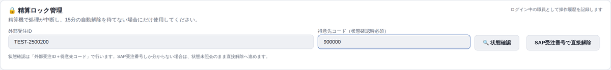

| # | 操作 |
|---|---|
| 1 | 「外部受注ID」に予約番号などを、「得意先コード」（例: 900000）を入力して「🔍 状態確認」 |
| 2 | 状態が表示されたら、**解除対象**（精算のみ／キャッシュバックのみ／精算・キャッシュバック両方）・**理由**（通信断で残留／誤操作／その他）・**斎場コード**（例: YT）を選び、必要に応じて理由の詳細を記入 |
| 3 | 「🔓 ロック解除」を押す |

> SAP受注番号しか分からない場合は「**SAP受注番号で直接解除**」に進めますが、この場合はロック状態を確認しないまま解除することになります（画面にも「⚠ ロック状態は確認できていません」と表示されます）。
>
> **別の端末で精算中でないことを必ず確認してから**実行して下さい。
>
> 精算機が途中で止まった場合は15分で自動解除されます。二重会計防止のため、精算機側での二重操作はしないで下さい。

**🔬 さらに深く（お会計精算 — 裏側の動きと例外）**

| 要素 | 裏で起きていること | 例外・注意 |
|---|---|---|
| 「✅ 受付する」 | ご来場が記録され、以降の割引・振り分け・精算がこの受付に積み上がっていきます | 結果が確認できない通信エラーの時は**再操作せず再読込**（受付が出来ていれば列に現れます） |
| 「🏷 振り分け」を保存する | 「どの品目分類を誰が払うか」の割り当てが受付に記録され、SAP登録時の**支払割当**の元になります | 未設定のまま送ると葬儀社払い（現金）扱い。SAP側に既に割当があるカートでは**必ず失敗**します（支払い内訳確認が事前に警告します） |
| 「💰 支払いお知らせを送信」 | 支払者ごとに**SAPの受注番号が発行**され、カードに精算系のボタンが現れます — 会計の分岐点です | 以降、割引・振り分けは変更不可になります |
| 「🏧 精算QRを発行」 | 受注番号が入ったQRが作られ、自動精算機はこのQRで**SAPに金額を照会して**請求します | 税込金額が未確定の受注は発行できません（先に「🔄 SAPと照合」）。売掛の受注はQR対象外（月次請求で回収） |
| 精算機でお支払い | 入金の連絡が自動で届き、受注の行が「✅ 支払済み」に変わります | 反映には少し間が空くことがあります。「お客様は払ったと仰っている」時は「🧾 支払確認」で手動照会します |
| 「🏁 会計完了にする」 | 支払い完了が記録され、カードが「会計完了」列へ移ります | 「⚠ 金額照合待ち」「⚠ SAP照合待ち」の間は押せません。押した後の「← 会計待ちに戻す」で**精算機の入金は取り消されません** |
| 「🔒 精算ロック管理」 | 精算機の処理が途中で止まった時の残留ロック（精算・キャッシュバックの2種類）を解除します | **15分で自動解除**されるため、通常は待つだけ。急ぐ時も、別の端末で精算中でないことを確かめてから解除します |

#### 📋 注文詳細パネルでのカート品目の修正（詳しく）

「📋 注文詳細」を開くと、SAPカートの品目が1行ずつ表示されます。

**まだSAPに送信していない品目**（カート編集が可能な状態）には行の右下に「**✏️ 編集**」「**🗑 削除**」が表示され、**送信済みの品目**には「**🔒 SAP送信済のため編集できません**」と表示されます（変更するには受注の差戻しが必要、という案内がボタンの説明に出ます）。

**✏️ 編集（品目の修正・0円商品の差し替え）** — 行の「✏️ 編集」を押すと「**✏️ カート品目 編集**」画面が開き、**品番・品名（差替検索に使用）・単価（円）・数量・品目グループ**を修正出来ます。

画面下部の注意書きのとおり「**保存操作は「削除→追加」の2ステップで実行されます。SAPカートが CART / PENDING 状態のみ編集可能。**」です。

単価が0円のまま登録されてしまった商品を正しい商品へ置き替える時は、次の手順で「**🔄 差替候補**」を使います:

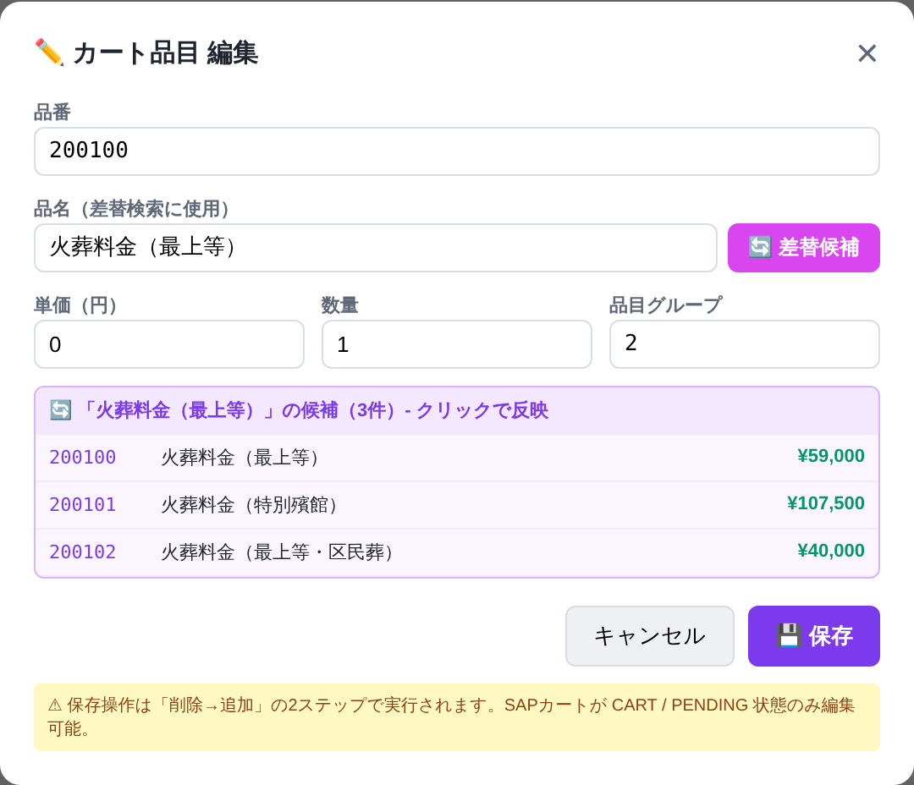

| # | カート品目の差し替え手順 |
|---|---|
| 1 | 「品名（差替検索に使用）」欄に品名が入っていることを確認して「🔄 差替候補」を押す（空のままだと「品名を入力してください」） |
| 2 | 「🔄 「◯◯」の候補（◯件）- クリックで反映」として**0円以外の同名商品**の一覧（品番・品名・価格）が開く |
| 3 | 正しい候補をタップ → 「✅ 反映しました。「保存」を押すとSAPカートに適用されます」と表示され、入力欄に品番・品名・価格が入る |
| 4 | 「💾 保存」を押す → 「✅ 保存しました」。**保存の実体は「旧品目を外して新品目を入れ直す」置き替え**のため、保存後にパネルが開き直って最新のカートが表示されます |

> 候補が無い場合は「⚠ 該当商品が見つかりません」と表示されます。品番が空のまま保存しようとすると「品番は必須です」で止まります。
>
> **その場で金額を決める任意金額の商品は、この編集からは追加出来ません**（「任意金額の商品は編集からは追加できません。代理注文で追加してください」）。

**🗑 削除（品目の取り消し）** — 「🗑 以下の品目をSAPカートから削除しますか？」（品目名の一覧と「※ この操作は取り消せません」付き）の確認でOKすると「✅ カート明細を取り消しました」と表示されます。

**⚠ エラーになった明細だけを外す** — カート内の1品目だけがSAP側でエラーになる事があります（例: 保管場所に無い商品）。

エラーの明細には赤い「**⚠ この明細はエラーです: ◯◯**」のバナーと「**🗑 この明細を外す**」ボタンが付きます。

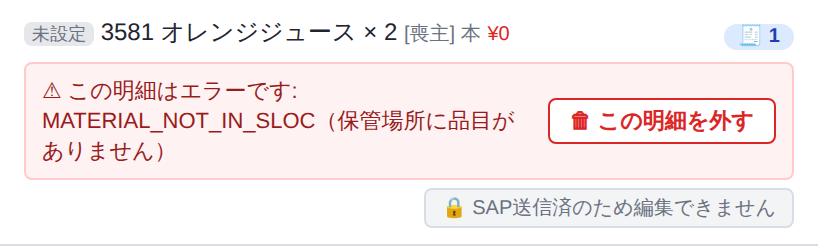

押すと「⚠️ エラー明細をSAPカートから外します。品目: ◯◯ エラー: ◯◯ この明細だけを削除します（他の明細は残ります）。よろしいですか？」の確認が出て、OKすると「✅ エラー明細「◯◯」をカートから外しました（理由: ◯◯）」と表示されます。

- **他の明細はそのまま残ります** — 外すのはエラーの1行だけです。
- 「⚠ 金額照合待ち」など**金額の照合が必要な状態の間は、このボタンは表示されません**（照合を解消してから操作します）。
- 外した後に正しい品目を入れ直す場合は、上の「✏️ 編集」または代理注文から追加します。

**🔁 予約からカート再構築** — カートが**空のときだけ**表示される復旧ボタンです。

押すと「🔁 予約からカート再構築 — 予約の品目をSAPカートに追加します。**既にカートに入っている品目コードはサーバ側で除外されるため、二重に積まれることはありません。** 続行しますか?」の確認が出て、実行すると「✅ カート再構築完了: ◯件追加」と結果が表示されます。

予約品目を後から手で追加しようとして既にカートにある場合は「⚠️ 予約からすでにカートに入っている品目があります — このまま追加すると同じ品目が2件になり、二重で請求されます。」の警告で止まるので、**意図した追加購入の時だけ**OKして下さい。

**🔍 SAP診断（注文ごとのSAP連携状態の確認）** — 画面のあちこちの案内文に出てくる「［注文詳細］→［SAP診断］で状態を確認してください」の確認場所です。

注文詳細パネルの中ほどにある「**🔍 SAP診断 (◯件) — 注文ごとのSAP連携状態**」の見出しを押すと開きます（普段は折りたたまれています）。

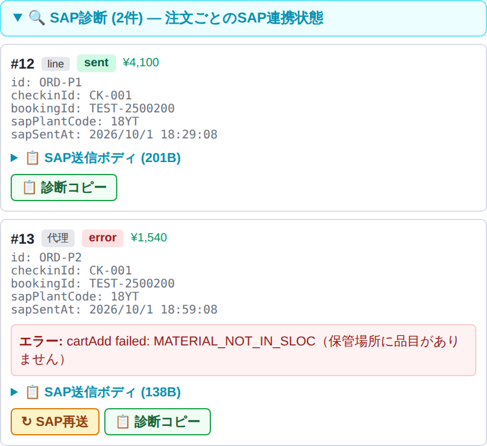

注文ごとに1枚のカードで、注文番号・注文の経路（line＝お客様のスマホ注文／代理＝代理注文／ゲスト）・SAP連携の状態・金額・紐付け情報・SAPへ送った日時が並びます。

状態の色付きバッジは、sent＝SAP登録まで完了（正常）、error＝SAP送信の失敗、cart_added＝カートへの蓄積までは成功、という意味です。

エラーの時は赤い「**エラー:**」枠に理由がそのまま表示されます。

- 「**↻ SAP再送**」は**SAP送信がエラーになった注文にだけ**表示されます（成立している注文への再送は二重投入になるため、ボタン自体が出ません）。
- 「**📋 診断コピー**」を押すと「✅ SAP診断をクリップボードにコピーしました」と表示され、そのカードの内容が文字でコピーされます。**エスカレーションの際はこれを貼り付けて共有**すると、口頭で読み上げるより速く正確です。
- 「📋 SAP送信ボディ」はSAPへ送った内容そのものの控えです。通常の運用で開く必要はありません — システム担当が原因を調べる時に使います。

#### 🏷 割引と業者キャッシュバック（詳しく）

割引とキャッシュバックは、名前が似ていますが**別の仕組み**です。取り違えると金額の説明を誤るため、先に違いを押さえて下さい。

| | 割引 | 業者キャッシュバック |
|---|---|---|
| 何に効くか | **お客様（喪主・葬儀社）の支払い額**が安くなります | 支払い額は変わりません。**葬儀社へ後から戻る金額**です |
| 画面での見え方 | 金額から差し引かれ、赤字の「🏷 割引合計」と内訳行で表示 | 支払い額の**下に黄色い破線の「💰 [別枠] キャッシュバック」枠**で表示（支払い額には含まれません） |
| 決まり方 | 窓口の「割引設定」で選んだ区分（区民葬・献体・減額・公費など）を基に**SAP側が金額を自動計算** | 葬儀社（得意先）ごとの条件でSAP側が計算。**値引き（割引）とは別の条件**です |
| 窓口での操作 | 「🏷 割引」で**支払い準備完了の前に**確定 | **窓口での操作はありません**（確認のみ） |

**割引の決まり方** — 窓口の「🏷 割引（割引設定）」で選ぶ区民葬・献体・減額・公費などの割引は、割引の画面にも説明が出るとおり「**手動割引と違い、予約の区分として登録します。金額はSAP側で自動計算されるため、登録後にSAPカートへの反映（予約品目の再投入）が必要です**」という扱いです。

つまり窓口で決めるのは「この予約にどの区分を適用するか」だけで、**いくら引くかはSAPが計算**します。

品目を入れた後に区分を変えた場合は品目の入れ直し（再投入）が必要になるため、割引は品目より先・遅くとも**支払い準備完了の前**に確定させて下さい。受注が確定した後は変更出来ません。

このほか、SAPの担当者が受注に直接入れた割引は、内訳の行に「**手動**」のバッジが付いて区別されます。

**割引を設定・解除した時に出る表示と対処**:

| 表示 | 意味と対処 |
|---|---|
| ✅ 割引区分をSAPカートへ反映しました（品目追加 ◯件） | 設定と同時にカートへの反映（品目の再投入）まで完了した正常終了です |
| 🚫 割引を解除しました | 「🚫 割引なし（解除）」の完了表示です |
| ⚠ 割引の設定は保存しましたが、SAPカートへ未反映です。「🔁 予約からカート再構築」を実行するまで金額に反映されません。 | 区分の保存だけ成功した状態です。**金額にはまだ効いていない**ため、案内どおり再構築を実行します |
| ⚠ 割引の設定は保存されましたが、カートの再構築に失敗しました／通信エラーが発生しました | 同上。「🔁 予約からカート再構築」をやり直します |
| ◯◯ はSAP中間側のカートフラグが未設定のため設定できません。（この状態で保存しても値引きは効きません） | この予約のカートが割引区分を受け取れない状態です。管理者経由でシステム担当へ連絡します |
| 割引設定の応答待ちがタイムアウトしました。サーバ側は処理を継続している可能性があります。 | **再操作せず**、受付カードを再読込して割引の状態を確認してから次の操作に進みます |

**割引の金額を確認できる画面は3つ**あります:

| 画面 | 開き方 | 分かること |
|---|---|---|
| 割引設定 | カードの「🏷 割引」 | 今どの割引区分が適用されているか・この葬儀社に使える区分 |
| 支払い内訳確認 | 「💰 支払い準備完了にする」 | 送信前の最終金額（支払者ごとの金額と品目グループ内訳） |
| 📋 注文詳細のSAP金額サマリー | カードの「▼ 詳細 → 📋 注文詳細」 | **確定後の割引の内訳と金額・キャッシュバックの[別枠]表示**（下で詳説） |

**📋 注文詳細「SAP金額サマリー」の読み方** — 受注確定後（SAP送信済み）の注文詳細には、緑色の金額サマリーが表示されます。上から順に読みます:

![注文詳細のSAP金額サマリー（割引内訳・[別枠]キャッシュバック・支払者別の請求明細・合計）](imgs/a92-order-detail-money-summary.png)

| 行 | 意味 |
|---|---|
| ✓ SAP受注確認 totals から表示 | この金額が**SAPの受注確認から取得した確定値**であることを示すバッジです |
| 金額（PPR0） | **割引前の本体価格の合計**。PPR0はSAP上の「本体価格」の記号です |
| 🏷 割引合計（赤） | 割引の合計。すぐ下に「└ 区民葬割引（10%） Z040 ×2品目 -¥410」のような**内訳行**が続きます（割引名・率・SAP上の記号・対象品目数・金額） |
| 税抜小計 → 📊 税額 | 割引後の税抜金額と消費税 |
| 💰 支払い額（税込） | **お客様が実際に支払う金額**です |
| 💰 [別枠] キャッシュバック（黄色い破線枠） | 葬儀社へ後から戻る金額。**支払い額（税込）には含まれていません**。この枠が無い場合、この会計にキャッシュバックはありません |

**支払者別の請求明細** — サマリーの下には「💳 支払者別の請求明細」として、支払者（喪主=紫・葬儀社=青緑。売掛の葬儀社には「売掛」バッジ）ごとのカードが並びます。

各カードにはその支払者の**SAP受注番号・得意先コード**と、金額 → 割引（内訳付き）→ 税額 → 💰 支払い額が表示されます。

割引は**割り当てられた品目の支払者にだけ**付くため、「喪主のカードには区民葬割引があるのに葬儀社のカードには無い」という見え方は正常です。

キャッシュバックの対象になる支払者（通常は葬儀社）のカードには、支払い額の下に[別枠]の黄色い枠が付き、内訳として「**└ Z050 業者バック(税抜)**」「**└ Z051 業者バック(税額)**」の2行が表示されます。

最後の濃い緑の「📊 合計」で、全支払者の支払い合計と「💰 [別枠] キャッシュバック合計」を確認出来ます。

**品目ごとの割引表示** — 割引が効いている品目は、明細の行でも分かります。元の金額に打ち消し線が引かれ、「🏷 -¥◯」の赤いバッジと割引後の金額が並びます。

行の下の「💳 SAP割引内訳」ボックスで、その品目1行分の 金額 → 割引（種別と率）→ 割引合計 → 税抜小計 → 税額 → 支払い額 を確認出来ます:

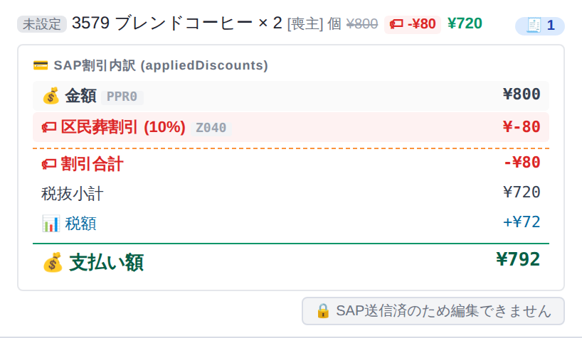

**キャッシュバックがある会計の進め方（よくある誤解と注意）**:

- 会計の操作は**通常とまったく同じ**です。振り分け → 支払い準備完了 → 精算QR → 会計完了、の流れにキャッシュバック用の操作はありません。

    「キャッシュバックがある時はQRを2回スキャンする」という案内が過去にありましたが、**誤案内**です。この件の精算機側の改修は**2026-09-25に検証環境へ反映済み**で、最終確認が進んでいます（→§6.3 Q9・§6.4）。

- キャッシュバックの金額は上記の[別枠]表示で**確認は出来ますが、窓口で金額を変える操作はありません**。金額に疑義がある場合はSAP側（本社経理）への確認になります。
- 自動精算機のロックには、精算のロックとは別に**キャッシュバックのロック**があります。「🔒 精算ロック管理」の解除対象に「キャッシュバックのみ」がある（⑪の表）のはこのためで、状態確認では両方のロック状態が表示されます。
- キャッシュバックの**帳票出力**が必要なケースで正しく出力されるかは、E2Eテストで継続確認中です（🔶確認中。帳票はSAP上「販売リベート請求書」として扱われ、出力検証が進行中です — §6.3 Q9）。

    また、セット商品の**値引き**条件が領収書明細に出ない事象の改修（§6.2）とキャッシュバック帳票は別の話です — 値引きとキャッシュバックは別条件として扱われます。

### 3.8 ⚙️ 設定（各種マスタ — 管理者のみ）

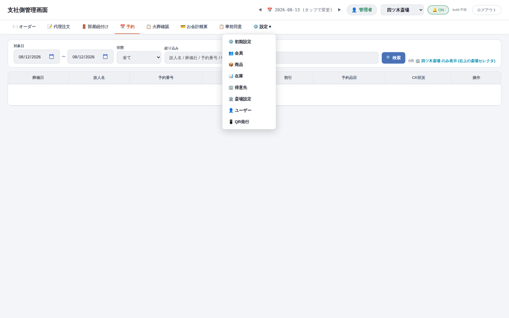

**⚙️ 初期設定** — 各種連携・イベント履歴・部屋紐付けの標準時間（30分）など:

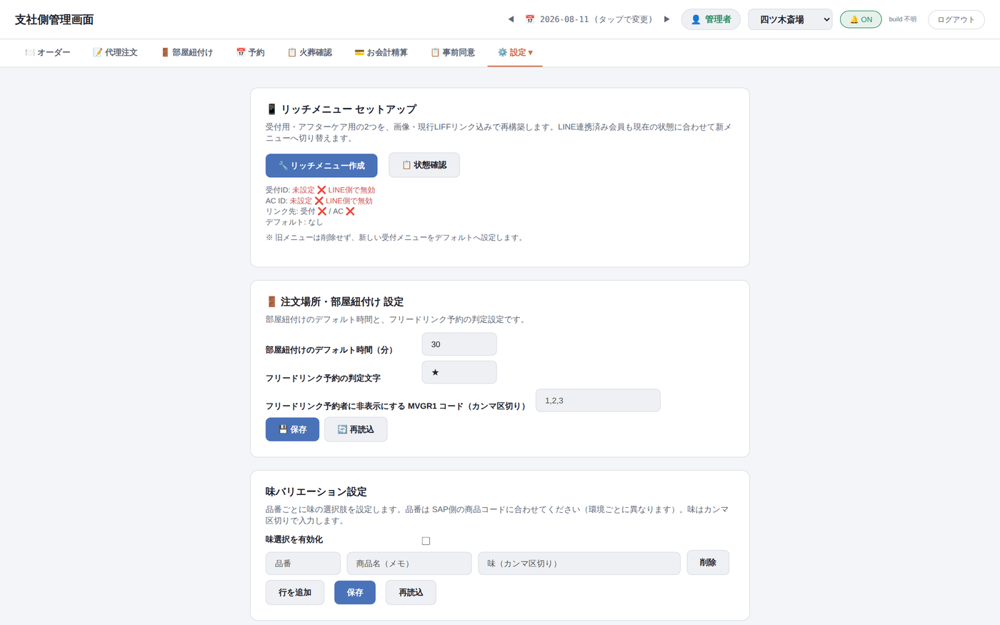

初期設定の中には、受入テスト（UAT）用の「**OutSystems会員連携 UAT用・隔離予約**」欄があります。

実在の予約・会員を使わずに会員登録の試験を行うための専用予約を作成するもので、**通常運用では使用しません**:

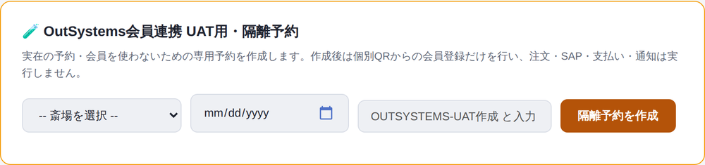

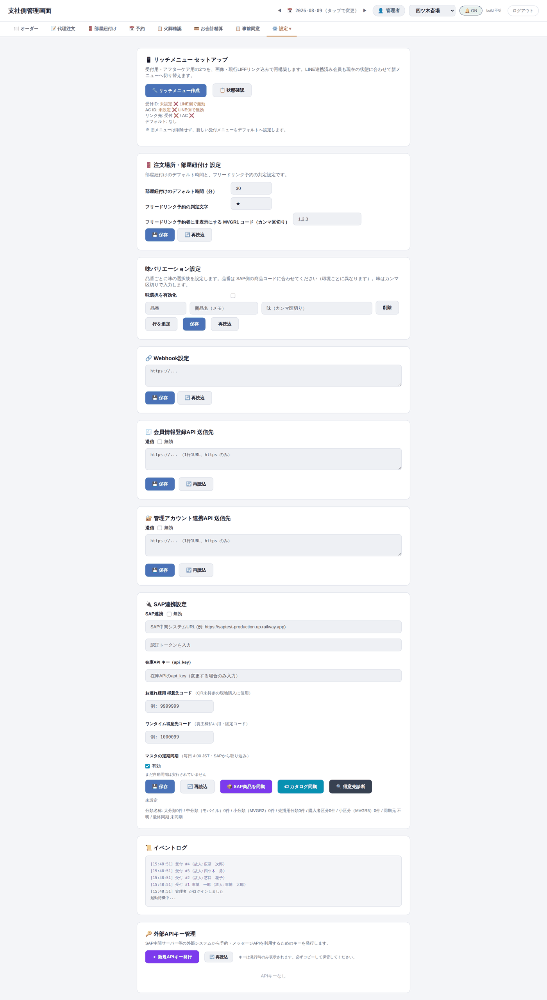

主なセクション:

| セクション | 内容 |
|---|---|
| 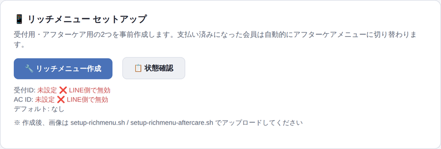 | **リッチメニュー** — お客様のLINEメニューの設定（**使用しません**） |
| 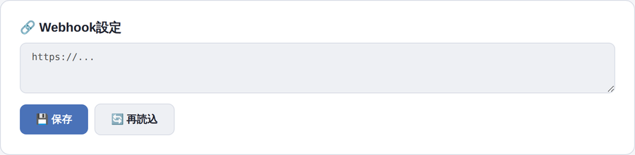 | **Webhook** — LINEからの受信設定（**使用しません**） |
| 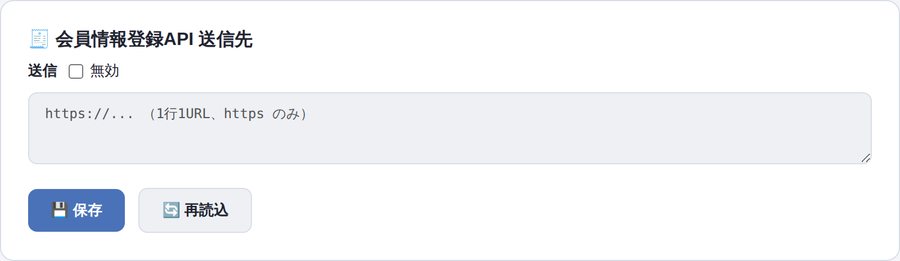 | **会員情報登録の連携** — 会員情報を外部システムへ連携する設定 |
| 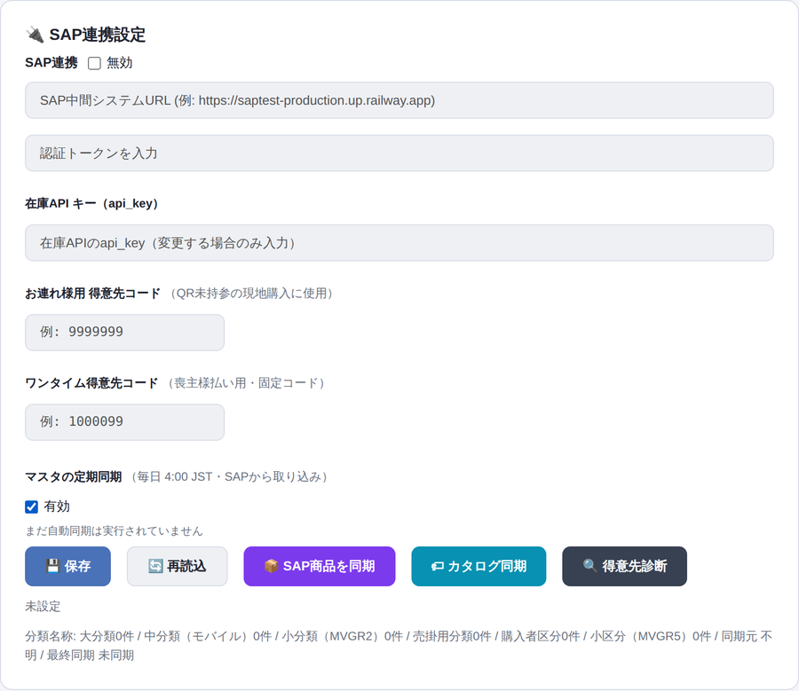 | **SAP連携** — SAP登録の有効/無効の切替 |
| 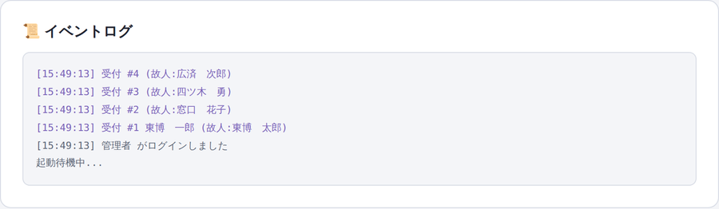 | **イベントログ** — 受付・ログインなどの操作履歴 |
| 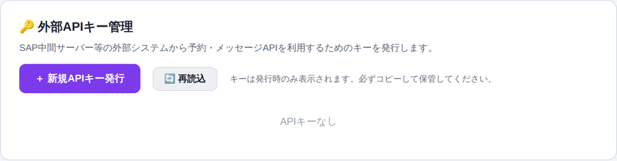 | **外部APIキー** — 外部システム接続用の鍵の発行・管理（**画面を撮影・共有しない**） |
| 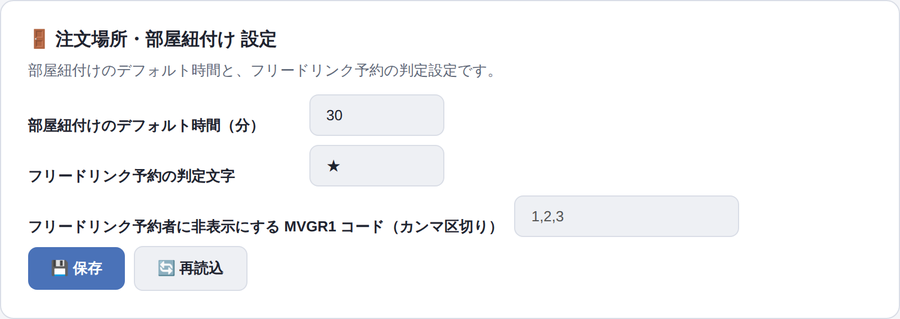 | **🚪 注文場所・部屋紐付け 設定** — 部屋紐付けのデフォルト時間（既定30分）と、フリードリンク予約の判定設定 |
| 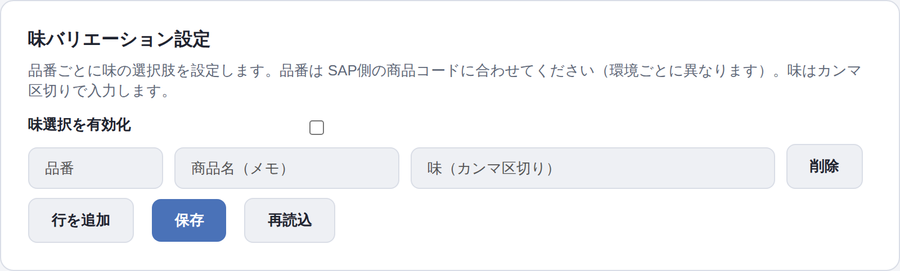 | **味バリエーション** — 商品の味の選択肢（ホット/アイス等）の設定 |

イベントログの表示例です。受付の作成・ログイン・同期などの操作が、時刻付きで新しい順に並びます:

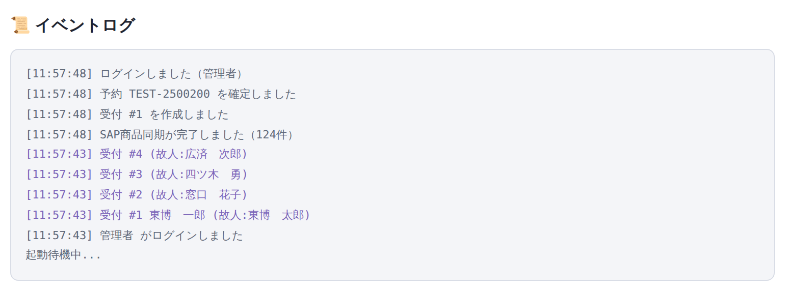

**リッチメニュー・Webhook（初期設定内）** — お客様のLINE向けの設定カードです。通常の業務では操作しません。

特にリッチメニューの再構築は連携済みの全会員に影響するため、リリース作業などシステム担当の指示がある時だけ実行して下さい。

「**🚪 注文場所・部屋紐付け 設定**」のカードでは、次の3つを設定します（保存で即時反映・全斎場共通）:

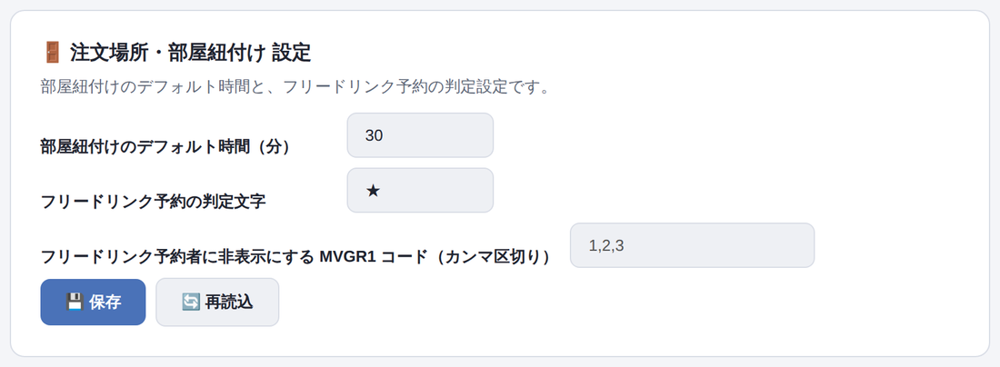

- **部屋紐付けのデフォルト時間（分）** — 部屋紐付けの残り時間（ラストオーダー）の標準値です（既定30分・1〜1440分）。**全斎場・全部屋に共通**で、部屋ごと・ご予約ごとの個別設定はありません。
- **フリードリンク予約の判定文字** — 予約品目の名称にこの文字（既定「★」）が含まれていると「フリードリンク対象の予約」と判定されます。
- **フリードリンク予約者に非表示にするMVGR1コード** — フリードリンクのお客様のメニューから隠す商品分類（カンマ区切り）です。「FD対象外の飲み物を隠す」出し分けは、この設定で決まります（軽食・和菓子などは隠しません — §6.3 Q4）。

初期設定の中の外部連携カードは2種類あります。

「**🧾 会員情報登録API 送信先**」は火葬予約の会員情報を外部システム（OutSystems）へ登録する連携で、送信のON/OFF・送信先URL・最終送信の記録（送信もスキップも記録が残ります）をここで管理します。

連携がOFFの間は「⚠ 連携は現在OFFです。火葬予約をしても会員情報登録API（OutSystems）は呼び出されません。」と黄色の注意が表示されます。

「**🔐 管理アカウント連携API 送信先**」は管理アカウント情報の外部送信の設定で、個人情報の送信範囲に関わるため**管理者（superadmin）にだけ表示されます**:

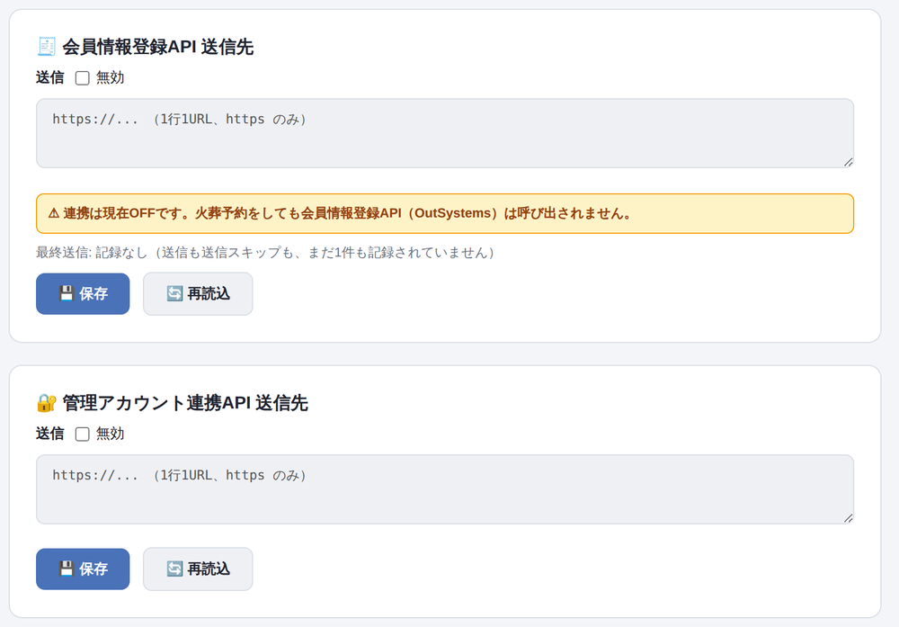

**👥 会員** — 会員の一覧。葬儀日・経過日数・来店/注文回数・累計金額・削除:

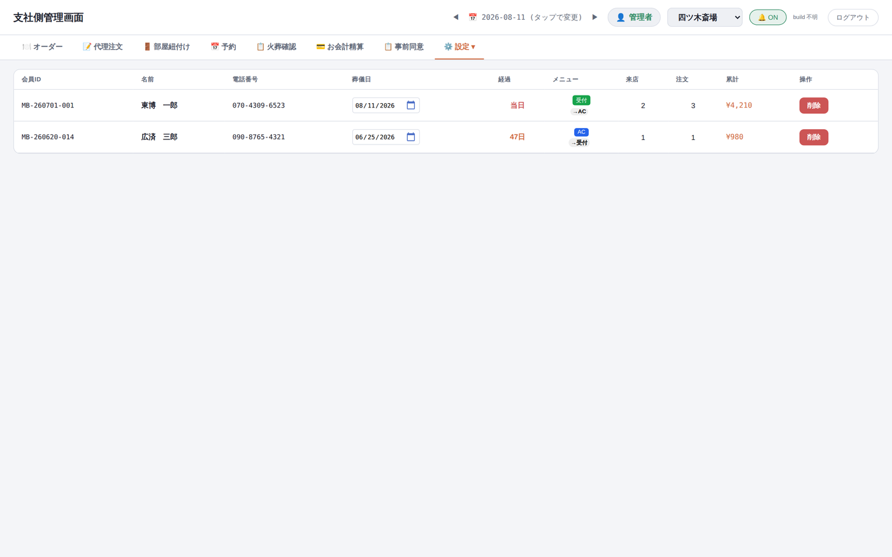

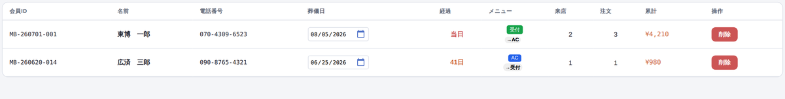

会員の削除は「**「◯◯」を削除しますか？　・会員情報は完全に削除されます　・注文履歴・受付履歴は残ります　・CRMチケットは匿名化されます**」の確認付きです — 削除しても**注文・受付の記録は消えません**（金額の記録は保全され、過去のやり取りの記録は個人が特定できない形に変わります）。

完了すると「会員を削除しました」と表示されます。

**📦 商品** — SAPから取り込んだ商品カタログの確認・同期。

商品データは設計上、**毎朝3時（JST）に中間サーバーがSAPから取り込み、4時に窓口側へ同期**される流れです（実際の稼働時刻は環境の設定によります）。日中に商品を直した時に、この画面の手動同期を使います。

分類での絞り込みのほか、上部に同期の操作が並びます（1回あたりの件数を指定して「**🔄 全同期**」「**⚡ 差分同期**」「**📍 保管場所マスタ同期**」、管理者用の「**🗑 DB削除**」。このほか「**🏷 カタログ同期**」「**🔒 ブロック同期**」の個別同期もあります）。

一覧には「受注ブロック」列が加わり、SAP側で受注を止めている品目が分かります:

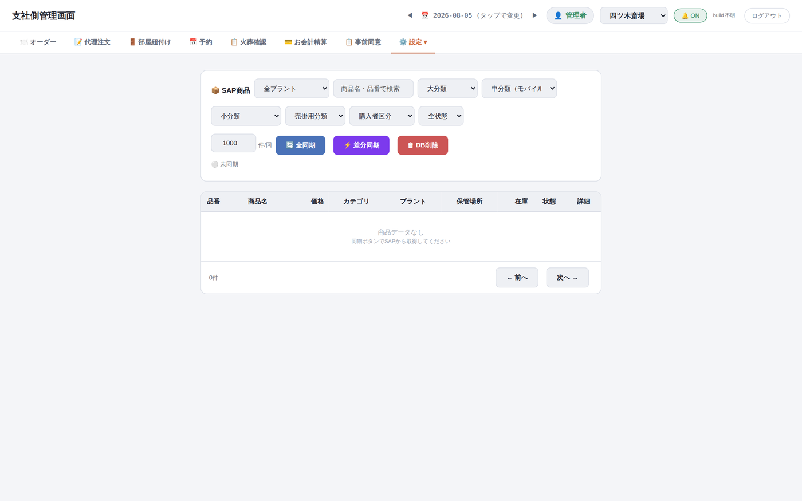

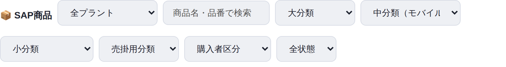

**🔍 商品の同期ボタンの使い分け（詳しく）**

| ボタン | 何をするか・使いどころ |
|---|---|
| 🔄 全同期 | **中間サーバーに「SAPから取り直して」と依頼したうえで**、全商品を取り込み直します（以前は中間サーバーの手持ちデータを写すだけで、SAP側の最新が反映されないことがありました）。「件/回」で1回あたりの取得件数を調整出来ます。商品情報が古い・件数が合わない時の基本手段です |
| ⚡ 差分同期 | 前回の同期以降に変わった分だけを取り込みます。日常のメンテナンスはこちらで十分です |
| 📍 保管場所マスタ同期 | SAPの品目×保管場所のマスタを取り直し、画面の絞り込みキャッシュも更新します。「保管場所が未登録」「在庫の場所が合わない」時に使います |
| 🗑 DB削除 | 取り込んだ商品データを削除します（「プラント「◯◯」の商品をDBから削除しますか？ 削除後は「🔄 全同期」で再取得してください。」の確認つき）。**削除しただけでは商品が空のまま**なので、必ず続けて全同期を実行して下さい |
| 🏷 カタログ同期 | お客様の注文メニュー（カタログ）を斎場の設定から作り直します |
| 🔒 ブロック同期 | 得意先の受注・納品・請求ブロック情報をSAPから取り直します（得意先タブと連動。進捗が「🔒 ブロック同期中 ◯/◯件」で表示されます） |

商品の同期・削除の操作には確認と結果表示が付きます: 「🗑 DB削除」の後は「🗑 ◯件削除しました。「🔄 全同期」で再取得できます」（**削除したままでは商品が出ないため、必ず全同期まで**行います）。

「⚡ 差分同期」を初回に押すと「最終同期日時が未設定です。差分同期を続けますか？」と確認されます（初回は「🔄 全同期」が確実です）。

**📊 在庫** — 在庫管理の画面が刷新され、使えるようになりました。

斎場と保管場所を選んで「**📥 在庫取得**」を押すと、在庫API経由で品番・商品名・保管場所・在庫数・単位が一覧表示されます（1回の取得件数も調整可）。

取得結果を消す時は「取得済みの在庫リストをクリアしますか？」の確認付きでクリア出来ます。

保管場所の選択肢が空で「⚠ 保管場所が未登録です」と出る場合は、商品タブの「**📍 保管場所マスタ同期**」で保管場所を取り込んでから開き直して下さい:

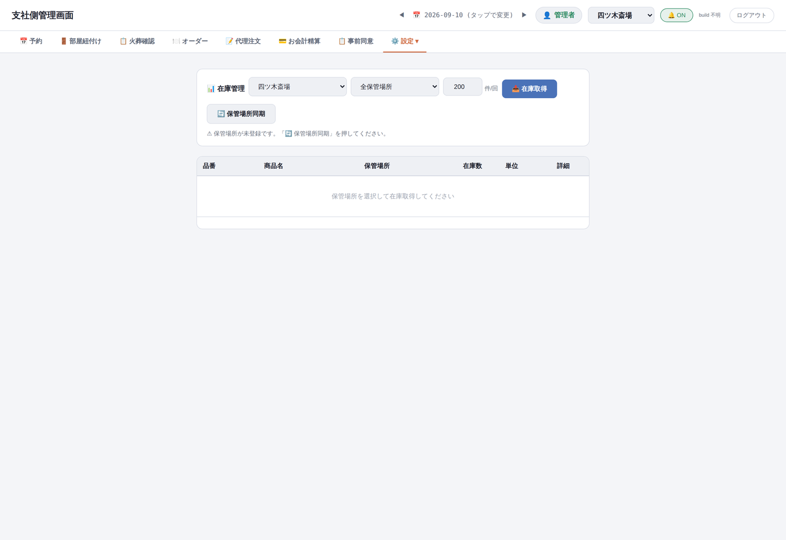

**🏢 得意先** — 葬儀社の一覧（幕内祭典・あすなろ祭典・セレモニー光など）。**区民葬・献体・減額・公費の割引可否**はここの設定が会計画面に反映されます。

一覧は「全て（ブロック含む）／受注ブロックなし／受注ブロックあり」で絞り込め、行の詳細では**受注ブロック・納品ブロック・請求ブロック**の状態（🚫あり／なし）を確認出来ます — 受注ブロックが付いた得意先はSAPで受注を止められている状態のため、注文・売掛の前に必ず確認して下さい。

ブロック情報が古い時は商品タブの「🔒 ブロック同期」で取り直します:

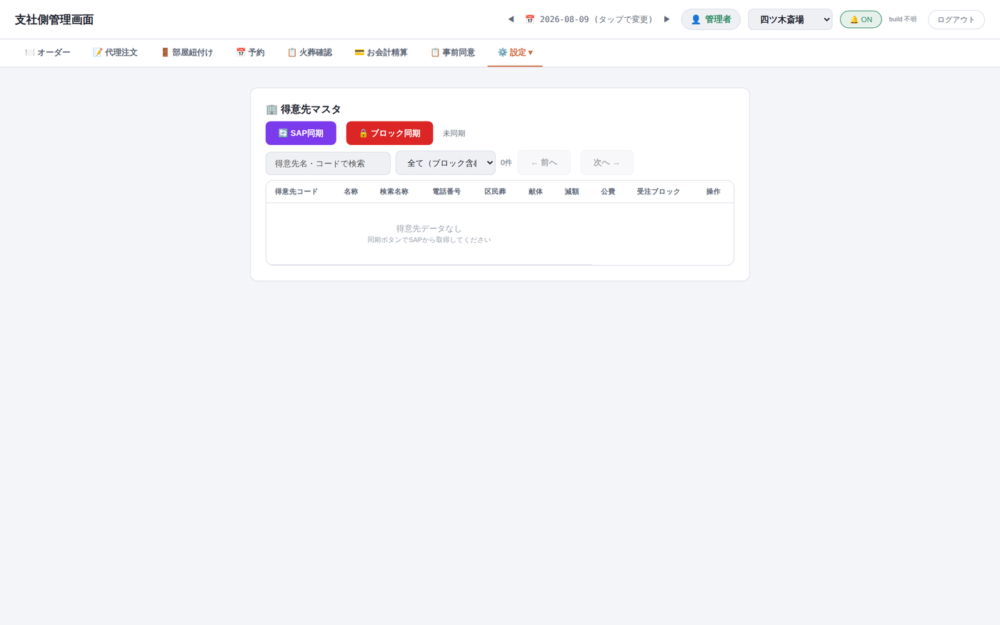

**🏛️ 斎場設定** — 7斎場と、斎場ごとの売り場・部屋・取扱商品の設定:

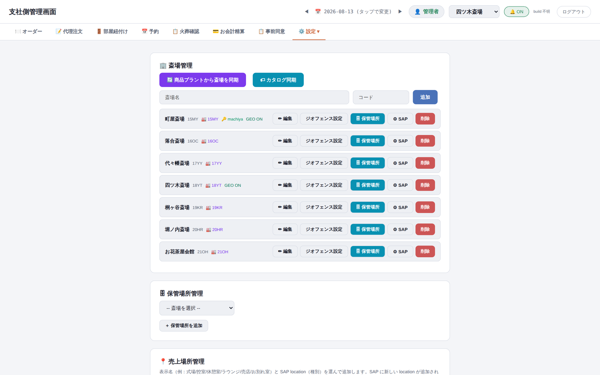

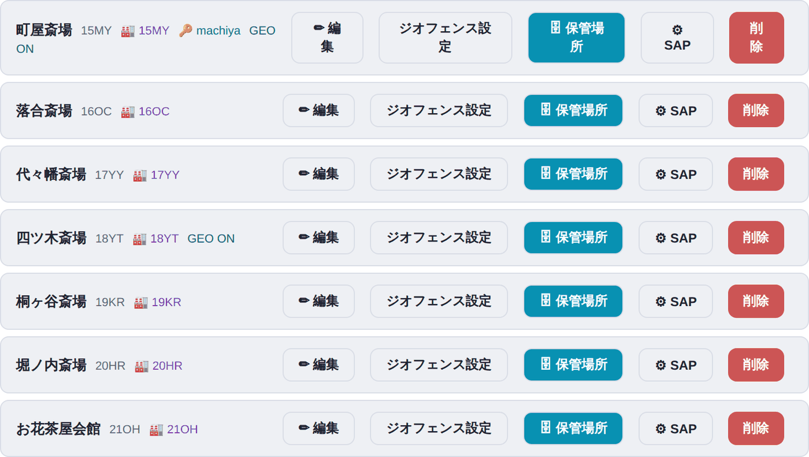

売り場の「⚙ 設定」で「**フリードリンク予約に基づく出し分けを有効化**」「**ラストオーダーの対象とする**」を設定します。

**フリードリンクは休憩室でのみ**有効にでき（それ以外は「（休憩室以外では使えません）」と表示）、**売店はラストオーダーの対象外**です（「（売店はラストオーダーの対象外です）」と表示）:

売り場の「**商品設定**」を押すと「🍽️ ◯◯ の販売商品」が開きます。**チェックを入れた商品だけ**が、その売り場の注文メニュー（代理注文の商品一覧）に載ります:

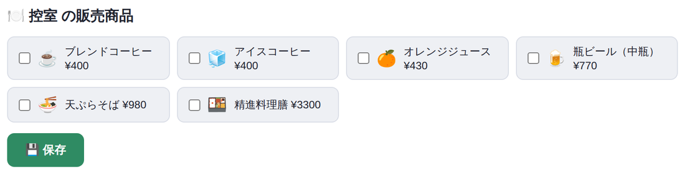

斎場設定の**削除操作は連鎖に注意**して下さい。売上場所の削除は「この売上場所を削除しますか？ **紐づく部屋レコードも一緒に削除されます。**」の確認付きで、部屋・部屋QRごと消えます。

部屋は「この部屋を削除しますか？」、保管場所は「この保管場所を削除しますか？」、斎場そのものは「この斎場を削除しますか？」です — いずれも運用中の斎場では実行しないで下さい（削除ではなく設定変更で対応します）。

保管場所の初期設定を省力化する「**保管場所と売上場所を1:1で自動マッピングしますか？ 既に設定済みの売上場所はスキップされます。**」の一括操作もあります（設定済みの売り場は上書きされません）。

> **売上場所ごとの「注文出来る商品」の出し分け**は、売上場所マスタの**注文場所種別（SAP location）**の設定で決まります（例: 休憩室=フリードリンクのみ／ラウンジ=軽食・デザート／式場控室=有料ドリンク）。
>
> **注文場所種別が未設定の売上場所では全商品が表示されます**。「関係のない商品まで注文画面に出る」時は、まずこの設定を確認して下さい。

**👤 ユーザー** — スタッフアカウントの発行。権限・担当斎場（空欄=全斎場）・既定の売り場・ログインキー発行:

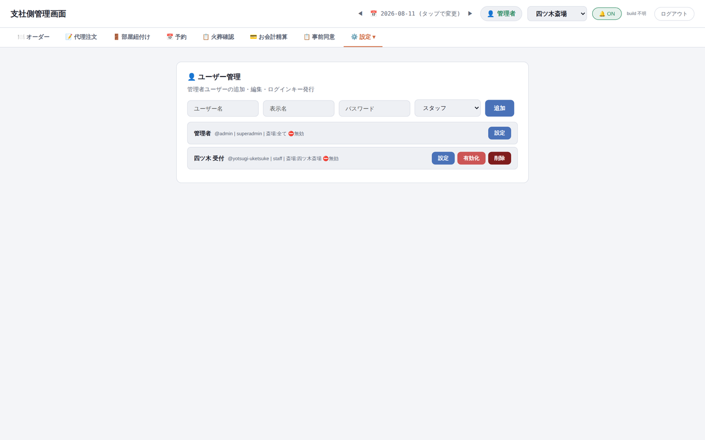

一覧の「設定」を押すと「**⚙️ ◯◯ の設定**」画面が開きます。

「**アクセス範囲**」でその利用者が操作出来る斎場（許可斎場。「全斎場」も可）を、「**デフォルト設定**」でログイン直後に選ばれる売上場所を設定し、「**💾 設定を保存**」で確定します。

「**🔄 キー再発行**」で印刷カード用のログインキーを再発行出来ます:

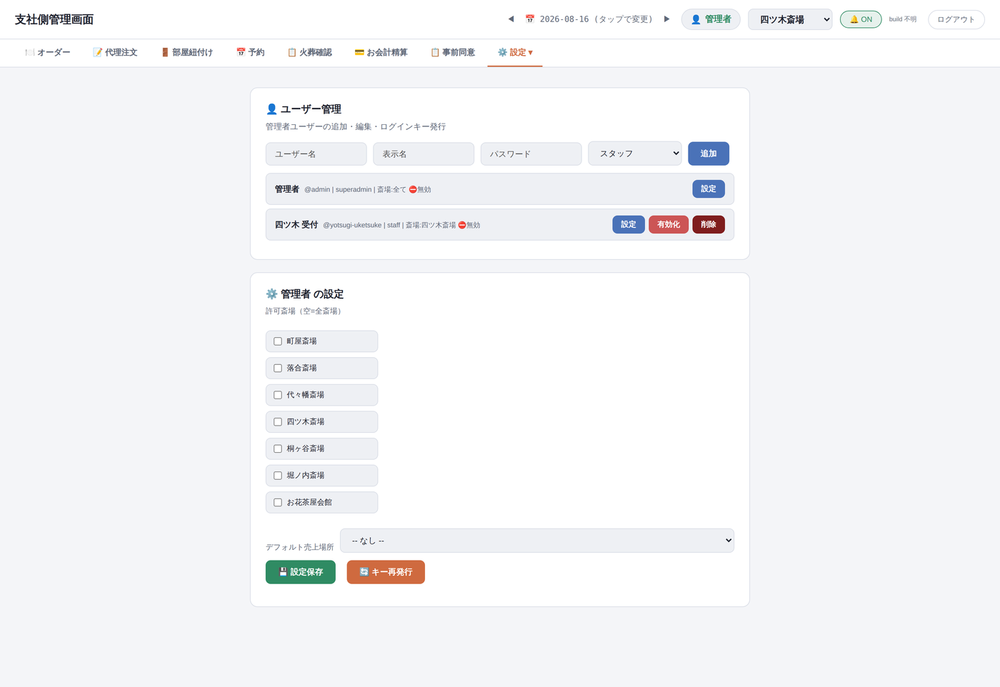

ユーザーの新規作成では権限を1つ以上選ばないと「権限を1つ以上選択してください」で止まり、作成が完了すると「**✅ ユーザー作成 ログインキー: ◯◯**」として**印刷カード用のログインキーが一度だけ表示**されます（この場で控えて本人に渡します）。

「🔄 キー再発行」は「**ログインキーを再発行しますか？ 旧キーは無効になります。**」の確認付きです — 再発行した瞬間に**古いキーのカードは使えなくなる**ため、本人へ新キーを渡すまでの間はログイン出来なくなる点に注意して下さい。

**📱 QR発行** — 2種類のQRを発行します:

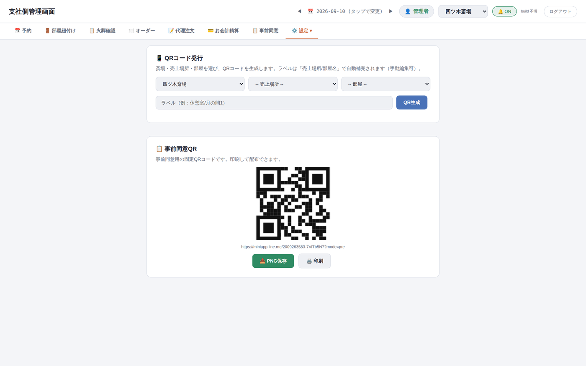

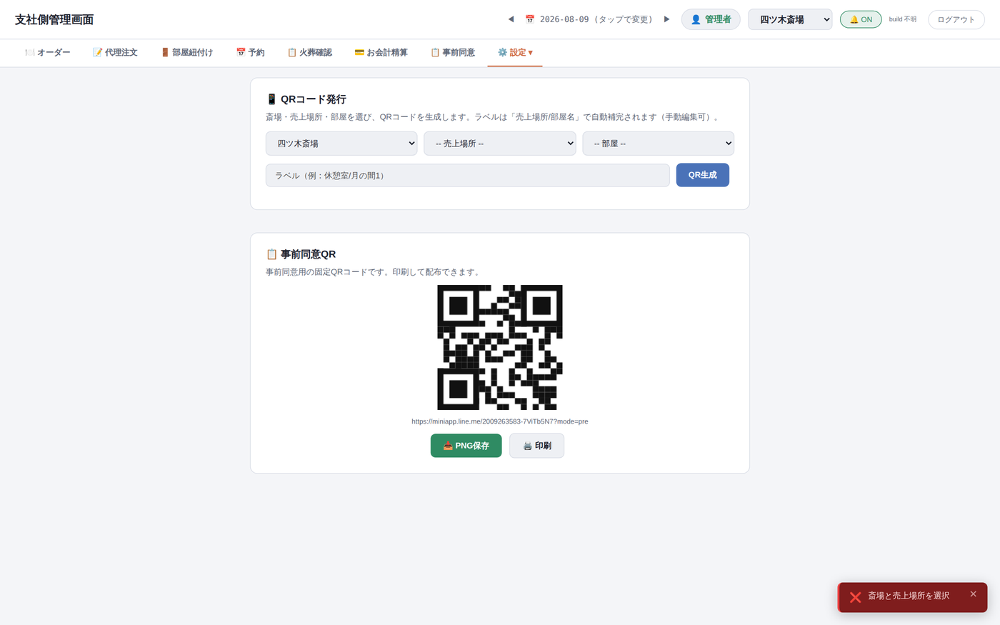

| QR | 用途 |
|---|---|
| 注文用QR | 斎場×売り場×ラベル（例: 机1）を指定して発行し、印刷して机上などに設置。読み取るとその売り場の注文メニューが開く（旧称: オーダー用QR）。 **売店以外は部屋の情報を持つため部屋紐付けが必要**（売店のQRだけは部屋なしで発行でき、常時注文可）。**非表示に設定した売上場所のQRは新しく発行出来ません** |
| 事前同意QR | 全申込者共通の固定QR（お客様のLINE申込の入口） — **使用しません** |

> **注意: ここで発行するQRと「精算QR」は別物です。** 精算QRは「💳 お会計精算 → 💰 支払い準備完了にする → ▼詳細 → 🏧 精算QRを発行」から発行します。
>
> 注文用QRには売り場と部屋の情報だけが入っています — 精算機では読めません。

**🔬 さらに深く（設定 — 裏側の動きと例外）**

| 要素 | 裏で起きていること | 例外・注意 |
|---|---|---|
| 「🔄 全同期」 | 中間サーバーへ**SAPからの再取得を依頼してから**商品カタログを取り込みます（時間がかかる代わりに確実） | 「🗑 DB削除」の後は必ずこれを実行するまで商品が出ません |
| 「⚡ 差分同期」 | 前回の同期以降に変わった商品だけを取り込みます（速い） | 初回は最終同期日時が無いため確認が出ます — 初回は全同期が確実です |
| 「📍 保管場所マスタ同期」 | SAPの保管場所の一覧を取り込みます。在庫画面・代理注文の保管場所の選択肢の元データです | 「⚠ 保管場所が未登録です」が出る画面は、まずこれを実行してから開き直します |
| 「🔒 ブロック同期」 | 得意先ごとの**受注・納品・請求ブロック**の状態をSAPから取り直します | ブロック中の葬儀社は受付・売掛で止まります（§3.3⑤-3）。「ブロック中なのに通ってしまう/通らない」時はまず同期の鮮度を疑います |
| 売上場所の「注文場所種別（SAP location）」 | どの種類の商品を出すかの**自動の出し分け**の鍵です。1つの売上場所に1種類だけ設定できます | **未設定だと全商品が表示されます**（§6.3 Q4）。休憩室⇄式場控室の切替後の復旧は確認中の項目です（Q5） |
| ユーザーの「🔄 キー再発行」 | 新しいログインキーが発行され、**旧キーはその瞬間に無効**になります | 新キーを本人に渡すまでの間、その方はログイン出来ません。渡す段取りを決めてから再発行します |

## 4. シナリオ別 操作フロー

実際の場面ごとに、誰が・どの画面で・何を押すかを纏めました。**全てのシナリオで、お客様にスマホの操作をお願いする場面はありません。** 画像は代表的な画面です（操作の詳細は第3章を参照して下さい）。

### シナリオA: 基本の流れ — 受付から会計まで（標準運用）

1. **【管理者・前日】** 「📅 予約」で翌日分を確定します（→§2.1）。
2. **【スタッフ・当日】** ご到着されたら「💳 お会計精算」のカードで「**✅ 受付する**」。喪主の行が「QR待ち」なら「**🖨 紙で受付**」も押します（→§2.3。火葬同意は紙のお手続き）。
3. **【スタッフ】** ご案内する控室・休憩室に「🚪 部屋紐付け」で予約を紐付けます。
4. **【スタッフ】** ご注文はお部屋・売店で伺い、「📝 代理注文」で入力します。オーダーのカードを「調理開始」→「提供済み」→ PDA計上 →「💳 お会計精算へ移す」と進めます。
5. **【スタッフ】** 「💳 お会計精算」で（🏷 割引・🏷 振り分け）→「💰 支払い準備完了にする」→ 支払い内訳確認で「💰 支払いお知らせを送信」→「🏧 精算QRを発行」→「🖨️ 印刷」で**《自動精算機ご利用票》を紙でお渡し** → 自動精算機でお支払い →「🏁 会計完了にする」。

> **このシナリオのつまずきどころ**: 通知が届かない前提の運用のため、**「お会計のご準備が出来ました」のご案内は必ず口頭で**行い、ご利用票のお渡しと合わせて精算機の場所をご案内します。
>
> また予約の確定（手順1）を受付より先に済ませておくこと — 順序が逆になると受注が二重に作られるケースがあります（§3.5）。

### シナリオB: 控室で喪主まとめ払い

1. **【スタッフ】** 「🚪 部屋紐付け」で控室・月の間1 に東博家の予約を紐付けます。
2. **【スタッフ】** お部屋で伺ったご注文を「📝 代理注文」で入力します（予約を選ぶため葬儀社払いで自動確定します）。
3. **【スタッフ】** 「調理開始」→「提供済み」→ PDA計上 →「→ お会計準備完了」。
4. **【スタッフ】** 「📋 注文詳細」で喪主払いにする品目の支払先を「喪主」に振り分けます（**代理注文は葬儀社払いで自動確定しているため、ここでの振り分けが必須です**）。**「お会計済み」は押しません。**
5. **【スタッフ】** 「💳 お会計精算」で 受付する →（割引）→ 支払い準備完了にする → 支払い内訳確認で「支払いお知らせを送信」→ ▼詳細 → 精算QRを発行 → ご利用票を紙でお渡し → 自動精算機でお支払い → 会計完了にする。

 

（左: 部屋紐付け ／ 右: 品目の振り分け）

> **このシナリオのつまずきどころ**: 手順4の振り分けを飛ばすと、喪主払いのつもりの品目が葬儀社払いのまま精算に進んでしまいます。
>
> LINEをお使いの場合と違ってお客様側から金額を確認する手段が無いため、**支払い内訳確認の画面の金額を、送信前にお客様へ口頭でお伝えする**と行き違いを防げます。

### シナリオC: 割引がある会計の例

| ケース | 内容 | 支払い | 操作の流れ |
|---|---|---|---|
| 例1 | 予約の火葬費用のみ | 葬儀社への請求（売掛） | 振り分けで「全て🏢 葬儀社（売掛）」→ 支払い準備完了。受注の行に「🧾 売掛のため精算不要」と出て、精算機は使わず月次請求で完結（→§3.7） |
| 例2 | 予約＋当日のご注文（代理注文）の合算 | 喪主と葬儀社で分割 | 振り分けで品目ごとに支払先を分ける → 支払い準備完了で受注が支払者ごとに分かれる → 受注ごとに精算QR（→§6.3 Q10の数字例） |
| 例3 | 当日のご注文（代理注文）複数明細 | 喪主 | 「全て👤 喪主」で一括振り分け → 喪主の受注1本にまとまる → 精算QRを1回発行 |
| 例4 | 社員割引の適用 | 葬儀社への請求 | 「🏷 割引」で該当の割引を適用してから支払い準備完了（割引はSAP側で自動計算。金額は支払い内訳確認で確認） |
| 例5 | 業者キャッシュバックあり | 葬儀社への請求 | 会計の操作は例1と同じ（キャッシュバック用の操作はありません）。金額は「📋 注文詳細」の黄色い「💰 [別枠] キャッシュバック」枠で確認。値引きとは別の条件で、帳票の出力は🔶確認中（→§3.7「🏷 割引と業者キャッシュバック（詳しく）」・§6.3 Q9） |

> **このシナリオのつまずきどころ**: 割引は**支払い準備完了より前**に確定させるのが鉄則です（受注確定後は変更出来ません）。
>
> 区分を選んだだけでは金額に反映されないケースがあるため、設定後のメッセージを必ず読み（「⚠ …SAPカートへ未反映です」なら案内どおり再構築）、「支払い内訳確認」で**割引後の金額になっているか**を目で確かめてから送信して下さい。
>
> 使える割引が出ない時は、この葬儀社の対応可否（得意先の設定）が原因のことが多いです（§3.8 得意先）。

（割引の適用画面。区民葬・献体・減額・公費は葬儀社ごとの設定に連動します）

### シナリオD: スポット注文（予約のないお連れ様のその場購入）

1. **【スタッフ】** 「📝 代理注文」で 斎場・売上場所を確認 →「🚶 予約なし」→ 購入者で「🚶 お連れ様」を選びます。お名前（任意）・領収書名を伺って入力します。
2. **【スタッフ】** 商品を選んで「**🚶 お連れ様購入（SAP即連携）**」を押します。

    この瞬間に**SAPへ受注が確定**し、「✅ お連れ様注文を作成しました 予約番号: G…」と表示されます（Gで始まるゲスト予約番号を控えておくと領収書・照会に便利です）。

3. **【スタッフ】** 「🍽️ オーダー」に現れたカード（「🧾 スポット注文（お会計精算の対象外）」バッジ付き・最初から「お会計準備完了」列）で商品をお渡しし、PDAで売上計上します。
4. **【スタッフ】** その場でお支払いを受けて「💰 お会計済み」を押して完結します。**「💳 お会計精算」タブには載りません**（お客様への通知もありません）。

> **このシナリオのつまずきどころ**: 通常の注文と違い、**送信＝受注確定**です。数量・商品を間違えたまま送ると受注の取り消し・修正が必要になるため、送信前の確認をより丁寧に行って下さい。
>
> 送信でタイムアウトが出た時は**再送する前に必ず注文一覧を確認**します（前回分が成立している場合、再送は自動で止まりますが二重投入防止の基本は目視確認です）。
>
> 酒類を含む場合は年齢・運転の有無の口頭確認をしてから確定します。

---

## 5. 権限（アカウント種別）一覧

アカウントの権限によって、表示されるタブと出来る操作が変わります。権限・担当斎場・既定の売り場は「⚙️ 設定 → 👤 ユーザー」で管理します（§3.8）。

| 種別 | 表示名 | 出来ること |
|---|---|---|
| 管理者 | superadmin | 全機能＋「📅 予約」「⚙️ 設定」＋アカウント発行 |
| スタッフ | staff | 日常運用（オーダー/代理注文/部屋紐付け/火葬確認/お会計精算/事前同意）。「予約」「設定」は表示されない |
| CC SV | cc_sv | コールセンター管理（全件＋割り振り解除） |
| CCスタッフ | cc_staff | コールセンター（自分の担当＋未割当） |
| ラベル担当 | label_agent | ラベル業務のみ |

アカウントごとに「アクセス範囲（許可斎場）」「デフォルト売上場所」を設定出来ます（§3.8 ユーザー）:

> 「📅 予約」「⚙️ 設定」タブは管理者（superadmin）にだけ表示されます。スタッフの画面にこの2つが見えないのは正常です。

スタッフ（staff）でログインした時の画面上部。タブは「部屋紐付け／火葬確認／オーダー／代理注文／お会計精算／事前同意」の6つだけになります:

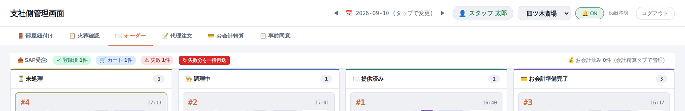

タブのほかにも、次の操作は**管理者（superadmin）にだけ**表示されます。スタッフの画面に出ないのは正常で、必要な場合は管理者へ依頼して下さい。

| 管理者にだけ出る操作 | 内容 |
|---|---|
| 🔄 SAP照合（お会計精算のカード） | SAPの受注金額と画面の金額の突き合わせ・照合結果の登録 |
| 受注分割やり直し画面URLの登録 | 「⚙️ 初期設定 → SAP連携設定」。未登録のときは領収書分割の案内に登録を促す表示が出ます |
| 🔐 管理アカウント連携API 送信先 | 「⚙️ 初期設定」内。個人情報の送信範囲に関わるため管理者専用（§3.8） |
| OutSystems会員連携 UAT用・隔離予約の作成 | 「⚙️ 初期設定」内。押すと「この操作は管理者のみ実行できます」と出ます（§3.8） |

---

## 6. 困ったときは（Q&A）

**質問・不具合・要望の報告の仕方（2026-09-14 操作説明会で確認した運用）**

疑問や不具合らしき事象は、まず**QAシート**（操作説明会のQ&A・確認観点シート）へ記録し、内容を①**現行仕様の確認** ②**不具合候補** ③**追加要望** の3つに分けて整理してから、必要なものを課題管理（Backlog）へ起票します。

報告の際は、次の6点を出来る範囲で添えて下さい — **対象の予約番号／操作した画面／操作手順／期待した結果／実際の結果／画面キャプチャ**。その場で答えが出ないものは、曖昧に判断せず「要確認」として記録します。

**障害時の対応の目安（保守窓口・現在調整中の内容）**

| 項目 | 目安 |
|---|---|
| 障害受付時間 | 平日 10:00〜19:00（土日祝・年末年始を除く） |
| 一次応答 | 受付から24時間以内 |
| 復旧目標 | 重大（業務停止・全体影響）: 当日中に暫定対応、3営業日以内に恒久対応の方針提示 ／ 重要（一部業務停止・代替運用可）: 3営業日以内 ／ 軽微（表示の不具合など）: 10営業日以内 |

> 上記は保守契約に向けて調整中の水準です。確定後に改めて周知されます。

### 6.1 画面に出るメッセージと対処（管理画面）

| 画面に出るメッセージ | 意味・対処 |
|---|---|
| ⚠️ 先に「⚙️ 斎場・売上場所設定」で斎場と売上場所を選択して下さい。 | 代理注文の最初の設定が未了。STEP 0 で斎場・売上場所を選びます |
| この売上場所は部屋の紐付けが必要です。部屋を選択して下さい（売店のみ部屋なしで発行出来ます） | QR発行時に部屋が未選択。売店以外は部屋を選んでから発行します |
| ⚠️ 取引先（得意先コード）が設定されていません。予約編集から得意先を設定して下さい。 | ご予約に葬儀社の得意先が入っていません。「📅 予約」の編集で得意先を設定します |
| SAPカート投入後の注文は編集出来ません。SAP受注・カートを照合して下さい。 | 「お会計精算へ移す」の後は ✏️ 編集不可。修正が必要なら「📋 注文詳細」で照合してから対応します |
| ⚠️ この注文はカートに追加出来ません。（原因: 支払振り分けが未設定のため） | 受付カードの「🏷 振り分け」を設定してから再送します |
| SAP失敗した◯件の受注を一括再送しますか？ | 「↻ 失敗分を一括再送」の確認。**⚠ SAP未確定の注文は先に「📋 注文詳細」でカートを確認**してから |
| ⚠️ SAP受注が発番済です | すでに受注番号が発行されています。**再送・二重登録はしない**で下さい |
| ⚠ ポップアップがブロックされました。ブラウザの設定で許可して下さい | 受付票・精算票などの印刷ウィンドウが開けない状態。ブラウザのポップアップ許可を設定します |
| 全斎場分の本日予約データをすべて削除します。この操作は取り消せません。本当に実行しますか？ | 「🗑️ 本日分クリア」（予約タブ）の最終確認。**通常運用では実行しません** |
| 検索対象が上限に達しています | 火葬日または斎場で絞ってから再検索します |
| ⚠️ この斎場には売上場所が1件も登録されていないため、代理注文を開始できません。 | 「⚙️ 設定 → 🏛️ 斎場設定」でその斎場の売上場所を登録します（管理者） |
| ⚠️ 得意先「◯◯」がマスタに見つかりません | 得意先コードの入力誤りか、得意先マスタが未同期です。コードを確認し、必要なら「🔒 ブロック同期」等で同期します |
| ⚠️ 得意先「◯◯」のフラグを取得できませんでした（SAP照会に失敗）。 | SAP接続の一時不調。少し置いて再試行し、続く場合はシステム担当へ |
| ⚠️ ブロック確認に失敗しました。手動確認後受付してください。 | 受注ブロックの自動確認が出来なかった状態。「🏢 得意先」でブロック有無を目視確認してから受け付けます |
| ⚠️ 保存中に追加の変更があります。もう一度保存してください | 保存中に別の変更が届きました。そのままもう一度保存すれば揃います |
| ⚠️ 取得上限に達しています。古い予約が表示されない場合があります（予約番号で検索してください） | 一覧の取得件数の上限。予約番号・期間で絞って表示します |
| ⚠️ ブラウザのポップアップブロッカーにより自動で印刷画面が開けませんでした。 | 印刷ウィンドウは開いています。ウィンドウ内の「🖨️ 印刷」を押すか、ブラウザでポップアップを許可します |
| 注文を送信できませんでした。…STEP1の ✕ でカートを作り直してください。 | 代理注文で、カートを作った時の伝票と今の選択が食い違った状態（途中で予約や斎場を切り替えた時）。STEP1のバッジの✕でカートを作り直します |
| この購入者区分（◯◯）で注文できる商品がありません。◯件が購入者区分により除外されています。 | その購入者に出せる商品が無い状態。購入者の選択を確認し、必要なら商品マスタの購入者区分（製品グループ4）を確認します |
| 送信の結果が確認できませんでした（通信タイムアウト）。SAPに届いたかは不明です。再送する前に必ず注文一覧を確認してください | **すぐに再送しない**こと。注文一覧で前回分の有無を確認してから判断します（前回分が成立していた場合、再送は「前回の送信が既に注文として成立しています」で自動停止します） |
| ⚠ SAP連携済みです（割引・振り分けの変更不可） | 受注確定後は割引・振り分けを変更出来ません。変更が必要な場合は先に受注を戻す操作が必要です（管理者へ相談） |
| 処理中です。完了までお待ちください ／ 送信処理中です。完了までお待ちください | 前の操作の応答待ちです。**連打せず**そのまま待ちます（連打による二重実行の防止です） |
| 商品データ読み込み中です。完了をお待ちください… ／ 商品データが未ロードです。少し待ってから再操作してください | 商品カタログの読み込みが終わる前に操作しました。数秒待ってからやり直します |
| 支払先振り分けを保存中です。完了までお待ちください | 振り分けの保存の応答待ちです。待ってから次の操作へ進みます |
| 🔄 他の画面で先に変更されました。読み直してからやり直してください。 | 別の端末・別のタブが同じデータを先に更新しました。再読込して最新の状態から操作し直します |
| 🚫 SAPに接続できませんでした。時間をおいてやり直してください。 | SAP中間との接続の一時的な不調です。時間をおいて再試行し、続く場合は管理者へ |
| 🚫 受注が見つかりませんでした。受注番号をご確認ください。 ／ この受注は中間で見つかりませんでした。 | 入力した受注番号に該当がありません。番号の桁・写し間違いを確認します |
| 受付の作成で通信エラーが発生しました。再操作せず、再読込して状態を確認してください。 | 受付（✅受付する）の結果が不明の状態です。**再操作せず**再読込 — 受付が出来ていれば列に現れます |
| 受付状態の更新中に通信エラーが発生しました。再操作せず、再読込して状態を確認してください。 | 同上（状態変更ボタン全般）。再読込で実際の状態を確かめてから続けます |
| 会計待ちへ戻しました。精算機での支払いは取り消されていません。 | 「← 会計待ちに戻す」の完了表示。**精算機側の入金は取り消されない**ため、返金が必要な場合は別途対応します |
| ⏳ 未精算あり | まだ支払いが済んでいない受注が残っています。支払先ごとの受注の行で ⏳未払い の行を確認します |
| ❓ 精算状況を判定できませんでした — 領収書の種別が想定と異なります。精算機のレシートで確認してください。 | 「🧾 支払確認」で判定できなかった状態。精算機の出力レシートを直接確認します |
| 支払い準備完了を中止しました。未提供の注文をご確認ください。 | 未提供の注文が残っていたため送信前に中止した状態です。提供を済ませて（または取り消して）から再実行します |
| 注文の取得に失敗したため、ここに出ている未提供の注文で全部とは限りません。 | 未提供チェックの取得が不完全でした。処理後にオーダー画面で残りが無いかを必ず確認します |
| 中止しました（何も保存・送信していません） ／ 追加を取りやめました。カートの内容はそのまま残っています | 確認画面でキャンセルした時の表示。データは変わっていないので安心してやり直せます |
| 再送対象の注文がありません。SAPのマスタ(品目・価格条件)をご確認ください | 「↻ 失敗分を一括再送」を押したが再送できる形の失敗が無い状態。SAP側のマスタ起因の可能性があります（管理者へ） |
| その売上場所がこの斎場の選択肢にありません。斎場の選択をご確認ください | 斎場と売上場所の組み合わせが不一致です。画面上部の斎場と「⚙️ 斎場・売上場所設定」を合わせます |
| 精算QRが取得できていないため印刷できません | QRの表示が済む前に「🖨️ 印刷」を押しました。QRが画面に出てから印刷します |

**操作をやり直せない確認ダイアログ（OKの前に必ず内容確認）**:

- 「「◯◯」を削除しますか？　この操作は取り消せません。」（会員・部屋・売上場所・斎場・保管場所など。対象によっては削除される内容の説明が続きます）
- 「カートを削除します。削除後は「↻ SAP再送」で改めて送信してください。」
- 「この受付の領収書分割を解除して、領収書1枚に戻しますか？」

### 6.2 よくある症状と対処

| 症状 | 対応 |
|---|---|
| 一覧に何も表示されない | 画面上部の**日付**と**斎場**を確認 |
| 注文がカンバンに出ない | 「接続中」表示を確認→再読込。日付・斎場・🔔OFF も確認 |
| お客様に「ただいまこのお部屋ではご注文いただけません」と出る | 「🚪 部屋紐付け」で該当のお部屋に予約を紐付け |
| 代理注文が先に進めない | 最初に「⚙️ 斎場・売上場所設定」で斎場と売り場を選択 |
| 「未承諾のみ」で件数が減った | 絞り込みが ON の状態。もう一度押すと全件表示 |
| 予約の件数が合わない | 表示は選択中の斎場のみ。右上の斎場を確認 |
| かなで検索しても出ない | ひらがな/カタカナはどちらでも可。出ない場合はふりがな未登録の可能性 |
| 「検索対象が上限に達しています」 | 火葬日または斎場で絞ってから再検索 |
| 「精算QR発行」ボタンが見当たらない | 「支払い準備完了」を押して SAP 登録が成功すると「▼ 詳細」の中に現れる |
| 精算機が途中で止まった | 15分で自動解除。急ぐ場合のみ「精算ロック管理」で状態確認・解除（精算機側で二重操作しない） |
| 「支払割当が見つかりません」等のSAPエラー | 画面を最新に更新（Ctrl+Shift+R）→ 支払先を振り分け直す → 「↻ 失敗分を一括再送」。繰り返す場合はシステム担当へ |
| お連れ様の注文がエラー表示なのに登録されている | 表示の既知不具合。SAP受注番号の記録を優先し、二重登録しない |
| 注文送信が長い | 最大45秒かかることがあります。**再送信しない**（二重請求防止） |
| QRが読めない | 汚れ→再印刷。**部屋QRと精算QRの取り違え**も確認 |
| 誤って受付した | 「💳 お会計精算」でカードの「▼ 詳細」→「← 精算未受付に戻す」。**「支払い準備完了」を押す前まで**しか戻せません |
| 在庫の一覧が空のまま | 斎場と**保管場所**を選んでから「📥 在庫取得」を押します（保管場所が未選択だと取得出来ません） |
| 予約に葬儀社（得意先）が入っていない | この画面では直さず、予約の連携元と得意先マスタを確認 |
| 予約を登録・更新したのに画面に出ない | 予約システムからの反映には**10〜15分程度**の時間差が出ることがあります。少し置いて再読込（§3.5） |
| 注文画面に関係のない商品まで表示される | 売上場所マスタの**注文場所種別（SAP location）が未設定**だと全商品が表示されます。「⚙️ 設定 → 🏛️ 斎場設定」で設定を確認（§3.8） |
| スポット注文を「お会計精算へ移す」ボタンが無い | 仕様どおりです。予約に紐付かない注文はご注文時にSAPへ受注確定済みのため、お会計精算の対象外（カードに「🧾 スポット注文」バッジ）。オーダー画面で「→ お会計準備完了」→「💰 お会計済み」と進めます（§3.2） |

**対応中の既知事象（2026-09-14 操作説明会での共有＋課題管理の照合。改善が入るまで下記を確認して下さい）**

| 事象 | 現場での確認ポイント |
|---|---|
| 注文を取消した後も、精算検索に古い受注番号が残る場合がある | 注文取消後は、**取消済みの注文が精算対象として残っていないか**を「💳 お会計精算」で確認する（取消成功分の関連データを同期削除する改修が進行中） |
| 受付後に予約確定を行うと、同じ受注が二重に作られる場合がある | 予約確定→受付の順を守り、確定後に「💳 お会計精算」の一覧へ**同じ方のデータが二重表示されていないか**を確認する（§3.5） |
| 休憩室・フリードリンクセットなど**セット商品の値引き条件が領収書明細に出ない**場合がある | 明細への反映改修が進行中（価格条件マスタに無い割引パターンの表示方法を調整中 — TOHAKU-829/832/811）。なお**値引きとキャッシュバックは別の条件**であり、割引の明細表示とキャッシュバック帳票は同じものとして扱いません |
| 予約システムから届いた予約で「**取引先が存在しない**」と表示され、葬儀社名が出ない場合がある（TOHAKU-1199） | 連携元の得意先情報の不備が原因です。「⚠ 葬儀社 未選択」と同様に、「✏️ 予約の編集」で葬儀社（得意先）を設定してから確定します（§3.5②） |
| 「領収書分割を設定する」の旧機能はエラーになります（TOHAKU-1251・仕組み自体が廃止済み） | 分割は「🧾 領収書分割（受注分割へ）」からの**受注分割やり直し画面**で行います（§3.7⑩）。旧ボタンが残った画面に出会っても使いません |
| 「💳 お会計精算」に**同じ喪家が二重に表示される**事象の調査が進んでいます（TOHAKU-1907） | 二重受注（上の行）と同様に、精算の前に一覧の重複を確認します。重複を見つけたら受付番号を添えて管理者へ |
| 商品の表示に関する受入指摘が未解決です — 菓子飲料の価格表示（1494）・終売商品も表示される（1495）・商品の混在（1515） | メニューに古い商品・不自然な価格を見つけたら、品目名を添えて管理者経由で報告します（商品マスタ・同期側の調整中） |

**領収書の印字について確認済みの事実（2026-08-17 精算機の実機確認より）**:

- **セット商品は領収書に親の1行だけで印字**されます（例: 収骨容器の一式は「収骨容器（◯寸白壷 白覆一式）」1行）。

    壷・覆・桐箱などの**構成品の行は印字されず、構成品の金額は親の品目へ合算**されるため、**合計金額は変わりません**。精算情報の取得・領収書の再発行・キャッシュバック照会の3経路すべてに適用済みです。

- セット商品の中にさらにセット商品が入る多段構成など、例外的な商品では構成品が残る可能性があります。気付いた場合は品目名を添えてシステム担当へ連絡して下さい。
- フリードリンク付き休憩室セットでの確認と、再発行の実機確認は追加確認の予定です。

「一覧に何も表示されない」の典型例。斎場の選択が違うだけで、4つの列は全て空になります。まず画面右上の**日付**と**斎場**を確認して下さい:

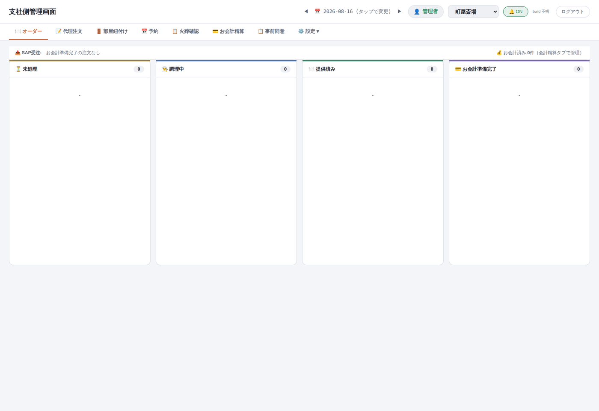

操作に失敗した時は、画面右下に赤い通知が数秒表示されます（§3.1）。**通知の文面に失敗の理由が書かれている**ため、消える前に読み取ってから対処に進むと早く解決出来ます:

### 6.3 現場からのご質問と回答（2026-09 操作説明会・QAシートより）

実際に斎場からいただいたご質問と、その回答・参照先を纏めました。「🔶確認中」の付いた項目は、開発・運用側で整理中の事項です。

回答は説明会当時（お客様のLINE操作を含む運用の前提）のものです — LINEのご利用を前提とする部分（通知・お客様のスマホ画面）は、使用しない方針の決定後は参考情報として読んで下さい。

**Q1. チェックイン前に予約内容（火葬日時・骨壺・休憩室・式場）を確認する方法は？**

管理者は次の手順で全て確認出来ます（→§3.5③）。

| # | 手順 |
|---|---|
| 1 | 「📅 予約」タブを開き、対象日と斎場を合わせて対象のご予約を表示する |
| 2 | 行の「✏️ 編集」を押す（**火葬日・火葬時間**は上部に表示されます） |
| 3 | 画面を下へ送る —「🏗 施設予約情報」で**式場・炉種別・時間帯**、「⚱ 収骨容器（骨壺）選択」で**骨壺**、「📦 予約品目」で**式場使用料・休憩室**などの品目を確認出来ます |
| 4 | 確認だけなら保存せずに閉じます（保存しなければ何も変わりません） |

 

スタッフ権限の方は「📋 火葬確認」の一覧で、火葬開始時間・式場名/休憩室名・炉の種別・保管日数を確認出来ます（→§3.6）。

**Q2. 予約画面『編集』の使い方と、入力が反映される場所は？**

使い方は §3.5③ のとおりです。

保存すると即時に反映され、**入力した項目ごとに次の場所へ効きます**: 葬儀社の得意先コード → 代理注文の自動確定とSAP連携の支払先／割引フラグ（区民葬・献体・減額・公費）→ お会計精算の割引／📦 予約品目 → お客様の「予約カート」と会計時のSAPカート／氏名かな・電話番号 → 予約の検索・照合。

**Q3. 部屋紐付けに表示される喪家名の範囲は？ 通夜の追加貸しのデフォルト時間は変えられる？**

紐付け画面に出るのは「**当日の予約一覧**」です。通夜のご利用が予約データとして窓口へ届いていれば表示されますが、予約システムからの連携範囲（通夜予約を含むか）は 🔶確認中 です。

『部屋紐付けのデフォルト時間（分）』は「⚙️ 設定 → 初期設定」の「🚪 注文場所・部屋紐付け 設定」（§3.8に画像）にある**全体で1つの設定**で、**部屋ごと・ご予約ごとに変えることは出来ません**。

時間を延ばしたい時は、一度「解除」してから紐付け直すと残り時間がリセットされます（→§3.4③）。

**Q4.（TOHAKU-1752 確認1）フリードリンクを設定したのに、フリードリンク以外の商品も表示される**

フリードリンクの出し分けは「**FD対象品だけを残す**」仕組みでは**ありません**。

「対象外の飲み物（ソフトドリンク・アルコール・ノンアルコールのうちFD対象でないもの）を隠す」仕組みで、**軽食・和菓子などは表示されたままが正常**です。

そのうえで、出し分けが効く条件を順に確認して下さい（→§3.8）。

| # | 確認する場所 | 確認すること |
|---|---|---|
| 1 | ⚙️ 設定 → 🏛️ 斎場設定 → 対象の売り場 | 注文場所種別（SAP location）が「**休憩室（restroom）**」になっているか（**ラウンジは対象外**に変更されています） |
| 2 | 同じ売り場の「⚙ 設定」 | 「**フリードリンク予約に基づく出し分けを有効化**」がONか |
| 3 | 📅 予約 → ✏️ 編集 → 📦 予約品目 | ご予約に**フリードリンク対象の品目**（名称に判定文字「★」を含む）が入っているか |
| 4 | ⚙️ 設定 → 初期設定 → 🚪 注文場所・部屋紐付け 設定 | 「フリードリンク予約者に非表示にするMVGR1コード」に、隠したい飲料の分類が入っているか（**ここに入っていない分類は隠れません**） |

なお、フリードリンク表示ルールの**最終的な適用範囲は関係者間で合意の詰めが進行中**です（論点: ★判定の単位・FD対象と対象外が混在する予約の扱い・軽食の例外・代理注文への適用 — TOHAKU-1752/1897/1908・🔶確認中）。

上の表は現在の画面の動きで、合意の結果によって変わる可能性があります。

**Q5.（確認3）1つの売上場所に休憩室（restroom）と式場控室（waitroom）の両方を登録出来る？**

出来ません。**注文場所種別（SAP location）は1つの売上場所に1つ**です。休憩室と式場控室は**別々の売上場所として登録**して下さい。

種別を切り替えた後に部屋紐付けで控室が選べなくなった事象は、この種別変更の影響とみられます — 実際の画面での復旧手順は 🔶確認中（課題管理で対応中）です。

**Q6. CK状況が「済」でなくても予約確定は出来る？**

出来ます。確定と受付（チェックイン）は独立した操作です。むしろ**確定→受付の順が正しい順序**で、受付が先に済んだ予約を後から確定すると受注が二重に作られるケースが報告されています（対策改修中。→§3.5）。

**Q7. 代理注文の「お連れ様購入」は、通常の注文と動きが違う？**

違います。お連れ様購入（予約なし）は**送信した瞬間にSAPへ受注が確定**し、注文は最初から「お会計準備完了」列に入ります。

「💳 お会計精算へ移す」は出ず、オーダー画面内で「💰 お会計済み」まで完結させます（→§3.2「スポット注文の扱い」・シナリオD）。

**Q8. 喪家・葬儀社と関係のない代理注文は、予約に紐づかないデータとして精算する認識で合っている？**

概ね合っています。予約に紐付かないスポット注文としてSAPに**単独の受注**が立ちます。

ただし精算は「💳 お会計精算」ではなく**オーダー画面内で完結**させます（お会計精算の対象外バッジが付き、精算機用のQR発行の対象にもなりません。その場でのお支払いで「💰 お会計済み」にします。→§3.2）。

**Q9. キャッシュバック金額・割引金額を精算前に確認できる画面は？**

**割引**は、「🏷 割引（割引設定）」画面・「📋 注文詳細」・「💰 支払い準備完了にする」で開く「**支払い内訳確認**」画面で精算前に確認出来ます（→§3.7「🏷 割引と業者キャッシュバック（詳しく）」）。

**キャッシュバックの金額**も窓口で確認出来ます。

「📋 注文詳細」のSAP金額サマリーに、支払い額（税込）とは別の黄色い「**💰 [別枠] キャッシュバック**」枠で表示されます（SAPがキャッシュバックを返した会計のみ。支払い額からは引かれません。→§3.7）。

ただし表示されるのは受注確定後（支払い準備完了の後）のため、**精算前の時点ではSAP側の条件登録の確認**になります。

キャッシュバックの**帳票**は、SAP上は「**販売リベート請求書**」として扱われ、その出力検証が進行中です（TOHAKU-628。売掛の業者キャッシュバックを含む支払いパターンの検証も並行中 — TOHAKU-739）。

帳票が必要なケースで正しく出力されるかは引き続き 🔶確認中 の扱いです（なお**値引きとキャッシュバックは別の条件**として扱われます — §6.2）。

このほかキャッシュバックの周辺では、「2回QRスキャン」誤案内に対する**精算機側の改修が検証環境へ反映済み**です（2026-09-25・最終確認中 — TOHAKU-1821）。

あわせて、次の整理・対応が進んでいます（→§6.4）。

- キャッシュバックのみのお会計での**0円支払QR**の扱いの整理（1614・整理済み）
- **現金払いと売掛が混ざる場合**の受注登録方法（1616・検証環境反映済み）
- 複数式場品目の構成品目へのキャッシュバック金額の反映（1829・確認中）
- 条件付き30%キャッシュバックへの対応（1685・対応中）

**Q10. 分割精算（業者が午前に先払い・喪家が午後に来場して残りを支払う）の手順は？**

§3.7「💴 支払いを分けたいとき」の4手順がそのままこのケースです。

①「🏷 振り分け」で業者払いの品目と喪家払いの品目を分ける → ②「💰 支払い準備完了」（ここで受注が支払者ごとに分かれる）→ ③午前中に**業者の受注だけ**「🏧 この受注の精算QR」で入金し、午後に喪家の受注をQR発行して入金 → ④全ての入金が済んだら「🏁 会計完了にする」。

カードの「支払先ごとの受注」枠（→§3.7の画像）で、どの受注が支払い済みかを1行ずつ確認しながら進められます。

**数字を入れた例**（火葬料金¥59,000=業者払い・菓子/飲料¥5,260=喪主払いの場合）:

| 時間帯 | 操作 | 画面の状態 |
|---|---|---|
| 午前（業者来場） | 「🏷 振り分け」で火葬料金の品目グループを「🏢 葬儀社（現金）」、菓子・飲料を「👤 喪主」に割り当て →「✅ 振り分けを確定」 | 集計に「🏢 現金: ¥59,000 / 👤 喪主: ¥5,260」と表示 |
| 午前 | 「💰 支払い準備完了にする」→ 内訳確認 →「💰 支払いお知らせを送信」 | 受注が2本に分かれる（例: 783=葬儀社¥59,000・785=喪主¥5,260） |
| 午前 | 業者の受注783の行で「🏧 この受注の精算QR」→ 精算機でお支払い | 783の行が「✅ 支払済み」に変わり、785は「⏳ 未払い」のまま |
| 午後（喪家来場） | 喪主の受注785の行で「🏧 この受注の精算QR」→ 精算機でお支払い | 785も「✅ 支払済み」に |
| 午後 | 「🏁 会計完了にする」 | 会計完了列へ移り、会計が締まります |

**Q11. 会計完了後に注文ミスに気付いた場合の修正手順は？**

**お支払い（入金）前**なら、「← 会計待ちに戻す」で戻してやり直せます（精算処理の進行中は「🔒 精算未受付に戻せません」と表示され戻せません）。

受注確定後は振り分け・割引の変更は出来ないため、先に受注を戻す操作が必要です（管理者へ相談）。

**入金まで済んだ後**の取消・返金・再会計は、SAP側の受注取消を伴うため窓口画面だけでは完結しません — 正式な手順は 🔶確認中（管理者経由でシステム担当へご連絡下さい）。

関連して、**精算確定済みの伝票への品目の追加登録**（分骨壺・証明書の追加購入など）の動作確認も進行中です（TOHAKU-1865・🔶確認中）。

**Q12. 精算後の領収書の宛名変更のやり方は？**

**お支払い前**であれば、カードの「支払先ごとの受注」枠にある「**✏ 領収書宛名**」で受注ごとに宛名を変更出来ます。

**お支払い後**は紙が発行済みのため窓口からは変更出来ず、**中間システムの領収書画面からの再発行**になります（→§3.7）。

なお、精算機が印字する領収書の**宛名の出し分けの正式ルール**（どの支払者の時に誰の宛名になるか・葬儀場住所の取得元）は、東京博善様側で確認中の項目です（TOHAKU-822・🔶確認中）。

**Q13. 梅の間の予約を椿の間で紐付けても良い？ 精算はどちらの部屋になる？**

紐付け自体は可能です（部屋紐付けは「どの部屋のQRから注文出来るようにするか」を決める操作で、予約と別の部屋にも紐付け出来ます）。

**お部屋の利用料金は、紐付けた部屋ではなく予約品目（式場使用料・休憩室料）に基づいて請求**されます。

部屋の変更で料金も変える必要がある場合は、予約側（📦 予約品目）の修正が必要です（休憩室料金の明細への反映はE2E継続確認中 — §6.2）。

**Q14. モバイルオーダーの30分は喪家ごとに変えられる？ 3時間貸しでは短くない？**

**喪家ごと・部屋ごとの個別設定は出来ません**（既定時間は全体で1つの設定です — Q3参照）。長いご利用では、一度「解除」して紐付け直すと残り時間がリセットされるので、これで延長する運用になります。

標準時間そのものの見直し（例: 3時間貸しに合わせる）は全斎場・全部屋に効く変更のため、要望として課題管理（Backlog）へ起票して下さい。

**Q15. 式場利用で通夜がある場合も、チェックインして紐付けする？**

仕組みとしては「部屋のQRから注文する時間帯には紐付けが必要」「受付（チェックイン）は火葬当日の会計の起点」です。通夜の時間帯の運用（誰がいつ紐付けるか・受付を伴うか）は 🔶確認中 です。

**Q16. コーヒーラウンジでも部屋の紐付けは必要？ LINE前提？ 注文出来ない商品がある？**

必要です。**部屋なしで常時注文できるのは売店だけ**で、ラウンジを含むその他の売り場は紐付けが必要です（→§3.4）。ご注文は全て代理注文で承ります。

ラウンジで一部の商品が出ないのは、**注文場所種別による出し分け**（ラウンジ=軽食・デザート等）と、売上場所の『商品設定』による絞り込みの結果で、設定どおりの動きです（→§3.8・Q18）。

なお、ラウンジ利用時にどの品目を使うか（SAP側の品目整理）は運用課題として整理中です（TOHAKU-1260・🔶確認中）。

**Q17. 新式場の利用で、火葬中に別のお部屋を貸した場合も紐付けは必要？**

必要です。貸したお部屋のQRからご注文いただくためには、そのお部屋への紐付けが要ります（原則: 売店以外のお部屋のご利用は全て紐付け）。

なお、**長期貸し（サブスク契約）の式場・保棺室**の扱い（対象部屋の範囲・契約中の予約の売上対応）は別途整理中の項目です（TOHAKU-1242・1122・🔶確認中）。

10月に長期貸し保棺の式場が増える予定もあるため、該当施設の運用は整理結果を待って確認して下さい。

**Q18. 設定 → 斎場設定 → 売上場所管理 →『商品設定』の意味は？**

その売上場所で**販売する商品を選ぶ画面**です。「🍽️ ◯◯ の販売商品」が開き、**チェックを入れた商品だけ**がその売り場のメニュー（代理注文の商品一覧）に載ります。

注文場所種別（SAP location）による自動の出し分けとは別の、**売り場単位の手動の絞り込み**です:

### 6.4 参考: 改善の反映状況と、調整が続いている主なテーマ（2026-10-02時点の照合結果）

課題管理（Backlog）・関係者間のやり取りを照合した、**窓口の現場運用に関わる項目**の一覧です。「その話は反映済み・調整中」と知っておくと、現場での説明やエスカレーションがスムーズになります。

**検証環境に反映済みの改善（受入確認中）** — 次の改善は検証環境（STG）へ反映済みで、受入の確認が進んでいます。反映後の画面は、掲載画像（2026-09-03時点の検証環境）と一部異なる場合があります:

| 改善 | 内容 |
|---|---|
| 代理注文: 価格未設定品・仕入専用品の非表示（TOHAKU-1571） | 一覧に最初から出さず、件数の行に非表示件数を表示（§3.3に記載済み） |
| 管理画面のスマホ対応（1467） | スマホ画面での表示・操作の改善 |
| 代理注文の商品個数の指定の改善（1479）・送信後の画面リセット（1582） | 入力まわりの操作性の改善 |
| 注文詳細への割引理由の表示（1585） | 割引の根拠が注文詳細で分かるように |
| ワンタイム支払先の表現の見直し（1478） | 「ワンタイム」→「喪主払い」の表記へ |
| 精算機のキャッシュバック改修（1821・2026-09-25反映） | 「2回QRスキャン」誤案内の解消。最終確認中 |
| 現金払い＋売掛のキャッシュバック時の受注登録方法（1616） | 支払い方法が混ざる場合の登録の整理 |

**調整・確認が続いているテーマ**:

| テーマ | 状況 |
|---|---|
| LINEミニアプリ（事前の火葬同意の入力・スマホからのご注文）を使用しない運用 | 2026-09-28の関係者会議で決定（冒頭のお知らせ）。2026-10-01改訂のリリース作業手順書で**11/2の除却・切替の工程は削除**され、機能はシステム上残したまま使用しない扱いに。除却の機能範囲・画面の扱いそのものは引き続き確認事項として管理されています |
| 本番リリースの日程と条件 | 10/6リリース手順レビュー → 10/13〜15 検証環境でリハーサル（第三者実行・切戻し実演を含む） → **10/16本番リリース** → 10/19〜11/1 現行システムと並行稼働（二重登録）。 既知の不具合（Known Issues）は**10/16の本番前に全件完了が前提**とされています |
| 画面レイアウトの変更の業務確認 | タブの並びなど画面レイアウトの見直しが進んでおり、変更内容と業務側の承認の突き合わせが、リリース前の確認事項（UI業務レビュー）として管理されています。→§3.1のタブ並びの注記 |
| フリードリンク表示ルールの最終合意 | 4論点（★判定の単位・混在時・軽食の例外・代理注文への適用）を合意中（1752・1897・1908）。→Q4 |
| 部屋別の商品一覧・設定確認の資料整備 | 斎場×部屋×注文場所種別×FD状態の一覧を作成・レビュー中（1908） |
| キャッシュバック帳票（販売リベート請求書）の出力検証 | 進行中（628）。売掛の業者キャッシュバックを含む支払いパターンの検証も並行中（739） |
| キャッシュバックの派生項目 | 複数式場品目の構成品目への金額反映（1829）・条件付き30%キャッシュバック（1685）・キャッシュバック無し業者の明細別割引の手順（1751） |
| 精算機の領収書の宛名出し分けルール・葬儀場住所の取得元 | 東京博善様確認中（822） |
| セット品の構成品に割引が含まれる場合の運用／価格条件マスタに無い割引パターンの領収書表示 | 調整中（811・832） |
| 事前同意・LINE注文・会計の重複に関する調査 | チケットごとに原因・修正・再テストを追跡中（1899・1900・1901・1907）。→§6.2 |
| 商品有効期限の設定と管理画面への反映 | QA進行中（1430） |
| 任意金額（その場で金額を決める）品目の扱いの整理 | 未着手（311）。現行画面では代理注文からのみ入力可（§3.3） |
| 部屋QRの発行を部屋紐付け画面へ統合する提案 | 東京博善様確認中（1231）。実現すると§3.4/§3.8のQR発行の導線が変わります |
| 予約連携のエラー仕様・送信失敗時の通知と再送の取り決め | 確認中（1064・1067）。§3.5の「反映まで10〜15分」の注意と併せて把握を |
| 帳票類（在庫・売上・仕入系）の整備 | 順次対応中（1273〜1281ほか多数）。窓口画面ではなくSAP側の帳票です |
| 自動精算機の運用改善 | 音量の調整方法（1732・確認中）・釣銭残量などの通知（1179・次期候補）。現行は釣銭・用紙の状態を精算機本体の表示で確認します |
| 各システムのSLA（サポート水準）の正式共有 | 中間サーバー・帳票・予約システム・自動精算機それぞれに共有依頼中（1604・1606・1608・1609） |
| 区民葬設定のためのフラグの確認 | QA進行中（1259）。区民葬割引の適用手順そのもの（§3.7）は現行どおり |

> 番号は開発・運用側との連絡に使う管理番号です。問い合わせ・エスカレーションの際に番号を添えると、やり取りが速くなります。

